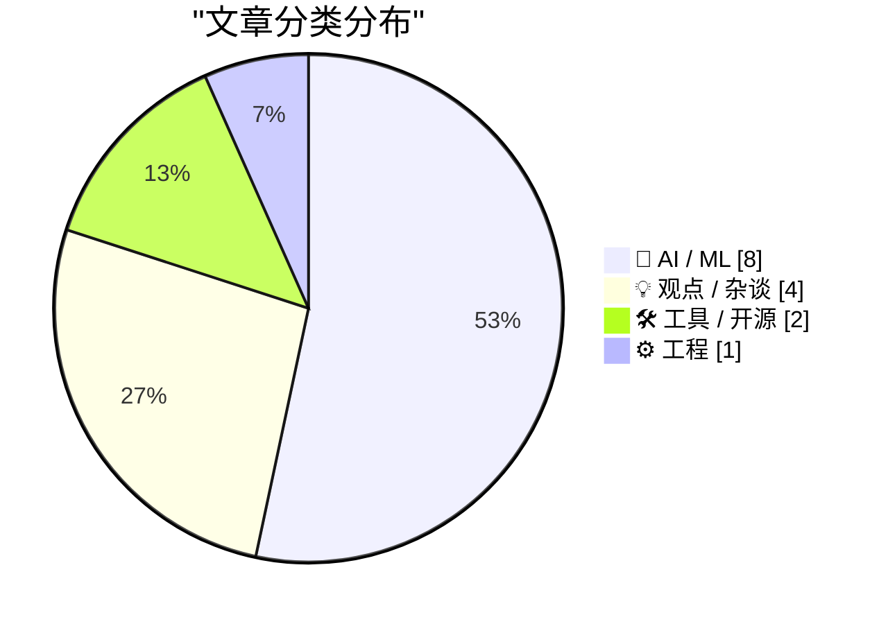
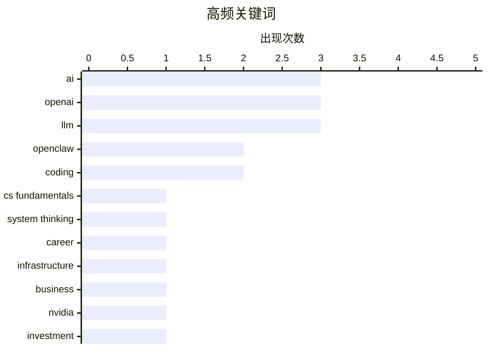

# 📰 AI 博客每日精选 — 2026-02-22

> 来自 117 个技术博客和社交媒体源，AI 精选 Top 15

## 📝 今日看点

今日技术圈的核心焦点在于AI领域的深度整合与战略调整。一方面，AI能力正加速渗透至区块链安全、代码审计等垂直专业领域，并催生出更复杂的多模态协作框架。另一方面，头部AI公司在激进的扩张后正面临现实财务压力，开始进行战略收缩与商业化路径的探索。与此同时，关于人机协作的思考也在深化，业界共识正从单纯追求工具效率转向强调工程师的系统思维与基础能力作为关键支撑。

---

## 🏆 今日必读

🥇 **在AI时代，哪些“基础能力”永远不会过时？**

[文中提到的“基础永远不会过时”，这里的基础指的是哪些能力呢？ 如果结合访谈内容，里面说的基础主要是几个层面： 1. 扎实的 CS 专业基础 > “他拉了一条 25 年...](https://x.com/dotey/status/2025446448553193719) — 𝕏 @dotey · 3 小时前 · 💡 观点 / 杂谈

> 文章探讨了在AI编程普及的背景下，工程师真正稀缺且持久的基础能力。核心观点认为，扎实的计算机科学专业基础（如编程语言、系统设计原理）是理解技术栈底层、为AI兜底的关键。产品直觉和系统思维变得比代码生成能力更重要，因为真正的瓶颈已从“写代码”转移到“理解用户需求并设计产品”。代码架构和工程判断力同样是不可或缺的核心能力。结论是，在抽象层之间灵活移动、理解系统全局以及将需求转化为产品的能力，其价值将长期超越单纯的代码实现。

💡 **为什么值得读**: 为在AI浪潮中感到焦虑的技术人员指明了清晰且可长期投资的能力发展方向。

🏷️ CS Fundamentals, AI, System Thinking, Career

🥈 **OpenAI战略转向：AI基础设施投资计划腰斩，并开始探索广告变现**

[OpenAI双管齐下了🙊 原计划到2030年砸1.4万亿美元搞AI基础设施，现在直接砍到6000亿美元！砍掉一半多！ Sam Altman几个月前还喊“all in”，现在谨慎多了😂 ...](https://x.com/abskoop/status/2025486517121286619) — 𝕏 @abskoop · 57 分钟前 · 🤖 AI / ML

> OpenAI大幅调整其激进的AI基础设施投资策略，将原计划到2030年的1.4万亿美元支出削减至约6000亿美元。这一转变源于公司财务压力，尽管2025年营收超131亿美元，但推理成本暴涨3倍，导致毛利率从40%降至33%。为平衡收支，公司决定将支出与收入挂钩，并已在ChatGPT免费版中开始测试广告。此举标志着OpenAI从“All in”扩张转向更务实的商业化与成本控制阶段。

💡 **为什么值得读**: 揭示了顶级AI公司在商业化和技术理想之间的现实权衡，对理解行业风向具有重要参考价值。

🏷️ OpenAI, infrastructure, business

🥉 **英伟达CEO否认千亿美元投资OpenAI承诺，称“只是被邀请”**

[Nvidia was only invited to invest](https://idiallo.com/byte-size/nvidia-was-only-invited-to-invest?src=feed) — idiallo.com · 9 小时前 · 🤖 AI / ML

> 英伟达CEO黄仁勋澄清，公司并未承诺向OpenAI投资1000亿美元，此前流传的巨额投资循环图（英伟达投OpenAI，OpenAI投Oracle，Oracle再投英伟达）不实。黄仁勋表示英伟达只是“被邀请”投资，但从未做出正式承诺。这一表态推翻了此前关于科技巨头间存在大规模闭环资本联盟的猜测，揭示了AI领域巨额投资传闻与实际情况可能存在出入。

💡 **为什么值得读**: 澄清了AI领域一则关键资本传闻，有助于理解巨头间的真实合作与竞争动态。

🏷️ Nvidia, OpenAI, investment, AI

4️⃣ **OpenAI发布EVMbench基准，用AI审计智能合约漏洞**

[OpenAI 出了 EVMbench，专门测 AI 找智能合约漏洞的能力。 说明 AI x Crypto 这个交叉点，大厂已经认真在做了。 值得关注的是安全审计是 Crypto 里少数"客户愿意...](https://x.com/runes_leo/status/2025217528843436288) — 𝕏 @runes_leo · 18 小时前 · 🤖 AI / ML

> OpenAI推出了名为EVMbench的新基准测试，专门用于评估AI代理在检测、利用和修复高严重性智能合约漏洞方面的能力。这表明AI与加密货币（特别是区块链安全）的交叉领域已引起主流AI公司的严肃关注。智能合约安全审计是加密市场中少数客户愿意支付高额费用的服务之一。如果AI能达到人工审计80%的效果，将可能重塑该市场的定价和竞争格局。

💡 **为什么值得读**: 展示了AI落地高价值专业领域（区块链安全）的最新进展，对开发者和安全从业者有直接启发。

🏷️ AI security, smart contract, benchmark, OpenAI

5️⃣ **SpaceX成功实现“星舰”超重助推器空中捕获，并计划下月再次试飞**

[The Super Heavy catch that broke the internet 厉害啊，275吨助推器被塔臂一把抓住！🤯 马老板刚官宣：星舰下个月（3月）又要飞了！🚀 #SpaceX #Starship](https://x.com/abskoop/status/2025403163038425246) — 𝕏 @abskoop · 6 小时前 · ⚙️ 工程

> SpaceX实现了里程碑式的技术突破，成功使用发射塔的机械臂在空中捕获了重达275吨的“超重助推器”。这一“接住”火箭的壮举极大地提升了火箭的可重复使用性和经济性。公司创始人马斯克随即宣布，“星舰”计划于下个月（3月）进行下一次飞行测试。此次成功捕获标志着火箭回收技术从“海上着陆”迈向更高效、快速的“空中回收”新阶段。

💡 **为什么值得读**: 展示了航天领域一项革命性回收技术的成功实践，是工程学上的重大突破。

🏷️ SpaceX, Starship, launch

---

## 📊 数据概览

| 扫描源 | 抓取文章 | 时间范围 | 精选 |
|:---:|:---:|:---:|:---:|
| 107/117 | 2725 篇 → 93 篇 | 24h | **15 篇** |

### 分类分布



### 高频关键词



<details>
<summary>📈 纯文本关键词图（终端友好）</summary>

```
ai              │ ████████████████████ 3
openai          │ ████████████████████ 3
llm             │ ████████████████████ 3
openclaw        │ █████████████░░░░░░░ 2
coding          │ █████████████░░░░░░░ 2
cs fundamentals │ ███████░░░░░░░░░░░░░ 1
system thinking │ ███████░░░░░░░░░░░░░ 1
career          │ ███████░░░░░░░░░░░░░ 1
infrastructure  │ ███████░░░░░░░░░░░░░ 1
business        │ ███████░░░░░░░░░░░░░ 1
```

</details>

### 🏷️ 话题标签

**ai**(3) · **openai**(3) · **llm**(3) · openclaw(2) · coding(2) · cs fundamentals(1) · system thinking(1) · career(1) · infrastructure(1) · business(1) · nvidia(1) · investment(1) · ai security(1) · smart contract(1) · benchmark(1) · spacex(1) · starship(1) · launch(1) · release(1) · gemini(1)

---

## 🤖 AI / ML

### 1. OpenAI战略转向：AI基础设施投资计划腰斩，并开始探索广告变现

[OpenAI双管齐下了🙊 原计划到2030年砸1.4万亿美元搞AI基础设施，现在直接砍到6000亿美元！砍掉一半多！ Sam Altman几个月前还喊“all in”，现在谨慎多了😂 ...](https://x.com/abskoop/status/2025486517121286619) — **𝕏 @abskoop** · 57 分钟前 · ⭐ 26/30

> OpenAI大幅调整其激进的AI基础设施投资策略，将原计划到2030年的1.4万亿美元支出削减至约6000亿美元。这一转变源于公司财务压力，尽管2025年营收超131亿美元，但推理成本暴涨3倍，导致毛利率从40%降至33%。为平衡收支，公司决定将支出与收入挂钩，并已在ChatGPT免费版中开始测试广告。此举标志着OpenAI从“All in”扩张转向更务实的商业化与成本控制阶段。

🏷️ OpenAI, infrastructure, business

---

### 2. 英伟达CEO否认千亿美元投资OpenAI承诺，称“只是被邀请”

[Nvidia was only invited to invest](https://idiallo.com/byte-size/nvidia-was-only-invited-to-invest?src=feed) — **idiallo.com** · 9 小时前 · ⭐ 25/30

> 英伟达CEO黄仁勋澄清，公司并未承诺向OpenAI投资1000亿美元，此前流传的巨额投资循环图（英伟达投OpenAI，OpenAI投Oracle，Oracle再投英伟达）不实。黄仁勋表示英伟达只是“被邀请”投资，但从未做出正式承诺。这一表态推翻了此前关于科技巨头间存在大规模闭环资本联盟的猜测，揭示了AI领域巨额投资传闻与实际情况可能存在出入。

🏷️ Nvidia, OpenAI, investment, AI

---

### 3. OpenAI发布EVMbench基准，用AI审计智能合约漏洞

[OpenAI 出了 EVMbench，专门测 AI 找智能合约漏洞的能力。 说明 AI x Crypto 这个交叉点，大厂已经认真在做了。 值得关注的是安全审计是 Crypto 里少数"客户愿意...](https://x.com/runes_leo/status/2025217528843436288) — **𝕏 @runes_leo** · 18 小时前 · ⭐ 25/30

> OpenAI推出了名为EVMbench的新基准测试，专门用于评估AI代理在检测、利用和修复高严重性智能合约漏洞方面的能力。这表明AI与加密货币（特别是区块链安全）的交叉领域已引起主流AI公司的严肃关注。智能合约安全审计是加密市场中少数客户愿意支付高额费用的服务之一。如果AI能达到人工审计80%的效果，将可能重塑该市场的定价和竞争格局。

🏷️ AI security, smart contract, benchmark, OpenAI

---

### 4. 实测对比：Claude 4.6 Opus在定位并修复上游代码bug上强于Codex 5.3

[结论：4.6 Opus 更强。 两边在做到 e2e 测试阶段的时候都遇到了按照设计的用法跑却出错。而且问题并不是出在它们这一次 session 自己写的代码 scope 里面，而是...](https://x.com/yuxiyou/status/2025217905751908590) — **𝕏 @yuxiyou** · 18 小时前 · ⭐ 25/30

> 通过并行实战测试对比，Claude 4.6 Opus在复杂工程任务中展现出比Codex 5.3 xhigh更强的深度问题解决能力。当测试遇到非本次任务代码范围内的上游依赖bug时，Codex倾向于在自己的测试中绕开问题。而Claude则两次都精确定位到了上游bug的根源并直接进行了修复。这表明在需要深度理解代码库上下文和进行根源性调试的场景下，Claude模型可能更具优势。

🏷️ LLM, coding, debugging, Claude

---

### 5. 现象级框架OpenClaw的底层引擎：Pi Agent Engine详解

[关于Pi的文章更详细的介绍，值得阅读。 现在"OpenClaw"可以说是一个现象级的词了。 越是这样，越想知道，背后到底是什么可以这么神奇 从阅读这个关于Pi的文章开...](https://x.com/sodawhite_dev/status/2025195200868655317) — **𝕏 @sodawhite_dev** · 20 小时前 · ⭐ 24/30

> 揭示了现象级开源AI代理框架OpenClaw的核心是其底层引擎Pi。Pi作为一个Agent引擎，提供了四大基础能力：统一的模型抽象层，可调用Claude、GPT、Gemini等多种大模型；支持实时响应的流式推理机制；基于“思考-行动-观察”循环的Agent架构；以及对Read/Write/Edit/Bash等基础工具的原语级执行支持。正是Pi引擎的这些设计，为OpenClaw的灵活性和强大功能奠定了基础。

🏷️ OpenClaw, Pi, agent engine, architecture

---

### 6. 解决LLM“看不见后文”的盲点：将提示词重复发送两遍

[LLM 的盲点：生成时只能向前看，看不到后文。 解法：把 prompt 发两遍。 准确率 21% → 97%，零成本，零延迟。 简单 > 聪明。](https://x.com/runes_leo/status/2025215683932340519) — **𝕏 @runes_leo** · 18 小时前 · ⭐ 24/30

> 大型语言模型因自回归生成机制存在一个根本盲点：在生成答案时，它只能“看到”并基于提示词中位于答案之前的上文，无法看到提示词末尾之后的内容。一个极其简单有效的解决方法是：将完整的提示词（包含上下文和问题）发送两遍。这种方法被证明能将任务准确率从21%大幅提升至97%，且几乎不增加任何成本和延迟。这体现了在工程中“简单方案优于复杂聪明”的原则。

🏷️ LLM, prompt engineering, technique

---

### 7. 向AI智能体销售与向人销售：截然不同的游戏规则

[向 AI Agents 销售 vs 向人销售，完全不是一个游戏规则 看完 brian flynn 这篇长文，最有启发的 3 点： 1. Agents 不浏览，只查询 - 你的营销网站、定价页面对它...](https://x.com/runes_leo/status/2025188254257996085) — **𝕏 @runes_leo** · 20 小时前 · ⭐ 24/30

> 文章探讨了面向AI智能体（Agents）销售产品与面向人类销售的根本区别。核心观点是：AI智能体不浏览营销页面，只通过API查询能力、价格、速度和可靠性；能向AI销售的核心价值是“不可自计算的东西”，如专有数据、实时数据流或硬件密集型计算；可靠性直接等同于产品价值，早期数据显示44个服务中仅2个可用，品牌将转化为可测量的可靠性分数。结论是，必须从交易成本理论出发，重新构建面向AI智能体的经济学模型。

🏷️ AI Agents, API economy, product strategy

---

### 8. 一句话总结顶级大模型的特点

[一句话总结几个顶级大模型的特点： GPT-5.3codex：很牛逼的干活的码农。 Claude Opus 4.6：牛逼的架构师和工程师。 Gemini3.1Pro：一个很会展示自己的全知科学家...](https://x.com/Khazix0918/status/2025465474084229531) — **𝕏 @Khazix0918** · 2 小时前 · ⭐ 24/30

> 推文用拟人化和精炼的比喻概括了多个主流大模型的核心特点：GPT-5.3codex被比作“很牛逼的干活的码农”，强调其强大的代码执行能力；Claude Opus 4.6是“牛逼的架构师和工程师”，侧重其系统设计与工程思维；Gemini 3.1 Pro像“很会展示自己的全知科学家”，突出其知识广度与展示能力；GPT-5.2 Thinking是“兢兢业业的全栈白领”，形容其可靠的全能性；GPT-4.5则被幽默地称为“兄弟和情人”，可能指其平衡与亲和力。这种概括基于模型在具体任务中的表现差异。

🏷️ LLM, comparison, coding, GPT

---

## 💡 观点 / 杂谈

### 9. 在AI时代，哪些“基础能力”永远不会过时？

[文中提到的“基础永远不会过时”，这里的基础指的是哪些能力呢？ 如果结合访谈内容，里面说的基础主要是几个层面： 1. 扎实的 CS 专业基础 > “他拉了一条 25 年...](https://x.com/dotey/status/2025446448553193719) — **𝕏 @dotey** · 3 小时前 · ⭐ 27/30

> 文章探讨了在AI编程普及的背景下，工程师真正稀缺且持久的基础能力。核心观点认为，扎实的计算机科学专业基础（如编程语言、系统设计原理）是理解技术栈底层、为AI兜底的关键。产品直觉和系统思维变得比代码生成能力更重要，因为真正的瓶颈已从“写代码”转移到“理解用户需求并设计产品”。代码架构和工程判断力同样是不可或缺的核心能力。结论是，在抽象层之间灵活移动、理解系统全局以及将需求转化为产品的能力，其价值将长期超越单纯的代码实现。

🏷️ CS Fundamentals, AI, System Thinking, Career

---

### 10. 与AI Agent高效协作的七条实用法则

[7 条与 AI Agent 协作的法则 01: Context, not control（给背景，而不是控制欲） 别去微调AI 的每一步，给它清晰的背景和最终目标，让它自己找路。它往往比你设...](https://x.com/sodawhite_dev/status/2025481182180413477) — **𝕏 @sodawhite_dev** · 1 小时前 · ⭐ 24/30

> 文章总结了七条提升与AI Agent协作效率的核心法则。核心思想包括：提供清晰背景而非步步控制（Context, not control）；通过不断施压试探AI的能力边界（Push until it breaks）；通过大量实践培养使用直觉（Put in the reps）。其他法则鼓励大胆尝试、容忍Token浪费以激发创意，以及通过公开构建过程加速学习。这些法则旨在将AI从执行工具转变为能深度协作的创造性伙伴。

🏷️ AI Agent, collaboration, prompt, workflow

---

### 11. 请大家今天少喝点水，你们本地的数据中心更需要它

[Everyone please drink a little less water today, your local data center needs it more](https://x.com/vasuman/status/2025248159753031922) — **𝕏 @vasuman** · 16 小时前 · ⭐ 24/30

> 这是一条带有讽刺意味的推文，尖锐地指出了数据中心巨大的水资源消耗问题。它通过反讽的修辞，将数据中心的资源需求与普通人的基本生活需求对立起来。其核心是引发公众对数字基础设施背后隐性环境成本（尤其是耗水量）的关注。作者暗示了在AI与云计算高速发展的背景下，资源分配可能存在的紧张关系。

🏷️ data center, sustainability, water

---

### 12. AI降临派是效率至上的放大，但缺乏真正的想象力

[AI 降临派是工业革命效率至上的放大，看似很有想象力，细想却缺少想象力。 比如 EvoMap。Agents 吞下一颗颗胶囊后，经验复用的效率得到提升。然后呢，效率之外的...](https://x.com/lifesinger/status/2025391597286752611) — **𝕏 @lifesinger** · 7 小时前 · ⭐ 24/30

> 文章批判了当前AI发展过于聚焦“效率至上”的局限，认为这仅是工业革命思维的放大。作者指出，无论是AI编程还是视频生成，都未能超越人类经验的边界，只是在压缩时间、提升效率。核心论点是：语言构成了AI能力的边界，在边界内卷效率只会巩固“旧世界”；真正的新世界存在于边界之外、时间之外和“巨大的不知”里。结论是，仅追求效率无法带来本质创新，AI需要突破人类经验和想象的桎梏。

🏷️ AI, efficiency, imagination, limitation

---

## 🛠 工具 / 开源

### 13. OpenClaw发布新测试版，集成Gemini 3.1并新增Discord语音频道支持

[New @openclaw beta bits are up! Gemini 3.1, Thread-bound subagent sessions on Discord, voice channels, BytePlus provider and loads more. https://githu...](https://x.com/steipete/status/2025257951007588582) — **𝕏 @steipete** · 16 小时前 · ⭐ 25/30

> 开源AI代理框架OpenClaw发布了新的测试版本（v2026.2.21）。该版本主要更新包括集成了最新的Gemini 3.1模型，并引入了Discord平台上的线程绑定子代理会话和语音频道功能。此外，还新增了对BytePlus作为模型提供商的支持，并包含大量其他改进。这些更新增强了OpenClaw在多模型支持、多平台交互和会话管理方面的能力。

🏷️ OpenClaw, release, Gemini, Discord

---

### 14. LangChain社区聚焦：langchain-agent-skills与生产级LangGraph模式

[RT LangChain OSS: LangChain Community Spotlight: langchain-agent-skills 🚀 Production-ready LangGraph patterns with AI assistants. Lubu Labs built a...](https://x.com/LangChain/status/2025269295383810332) — **𝕏 @LangChain** · 15 小时前 · ⭐ 24/30

> 文章展示了LangChain社区的一个生产就绪AI助手项目langchain-agent-skills。Lubu Labs利用该项目的LangGraph模式，将研究智能体的开发时间从2-3周缩短至6天。项目采用了协调者-工作者架构、状态归约器、选择性重试等关键技术，并集成了LangSmith进行调试。这是一个将LangChain/GangGraph理论模式应用于实际业务场景，并显著提升开发效率的成功案例。

🏷️ LangChain, LangGraph, agent, development

---

## ⚙️ 工程

### 15. SpaceX成功实现“星舰”超重助推器空中捕获，并计划下月再次试飞

[The Super Heavy catch that broke the internet 厉害啊，275吨助推器被塔臂一把抓住！🤯 马老板刚官宣：星舰下个月（3月）又要飞了！🚀 #SpaceX #Starship](https://x.com/abskoop/status/2025403163038425246) — **𝕏 @abskoop** · 6 小时前 · ⭐ 25/30

> SpaceX实现了里程碑式的技术突破，成功使用发射塔的机械臂在空中捕获了重达275吨的“超重助推器”。这一“接住”火箭的壮举极大地提升了火箭的可重复使用性和经济性。公司创始人马斯克随即宣布，“星舰”计划于下个月（3月）进行下一次飞行测试。此次成功捕获标志着火箭回收技术从“海上着陆”迈向更高效、快速的“空中回收”新阶段。

🏷️ SpaceX, Starship, launch

---

*生成于 2026-02-22 09:20 | 扫描 107 源 → 获取 2725 篇 → 精选 15 篇*
*基于 [Hacker News Popularity Contest 2025](https://refactoringenglish.com/tools/hn-popularity/) RSS 源列表，由 [Andrej Karpathy](https://x.com/karpathy) 推荐*
*由「懂点儿AI」制作，欢迎关注同名微信公众号获取更多 AI 实用技巧 💡*
