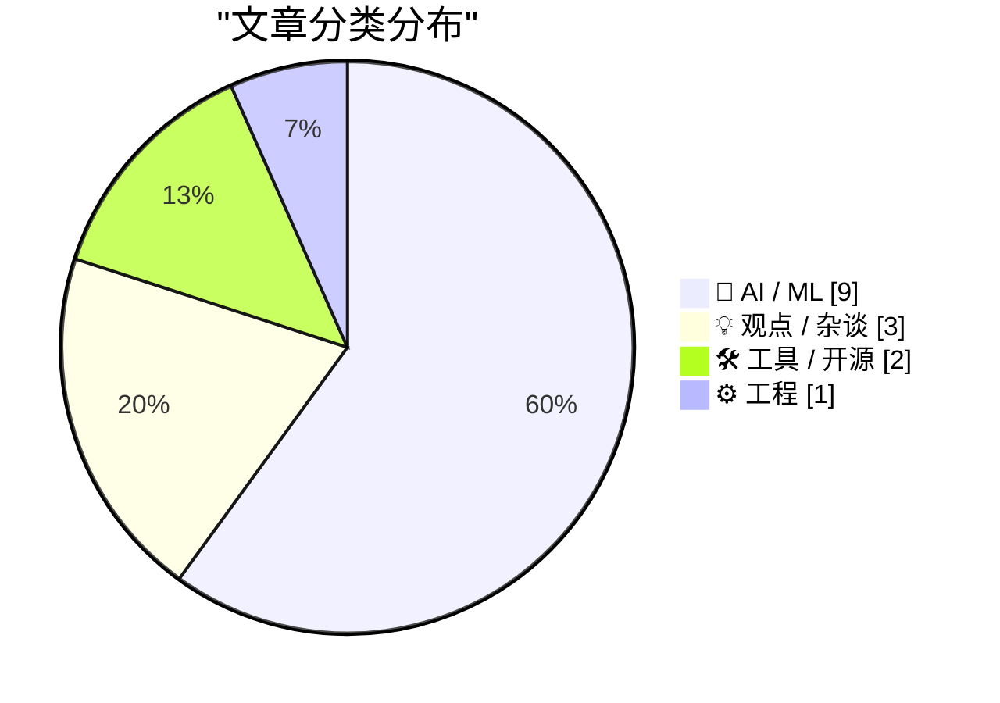
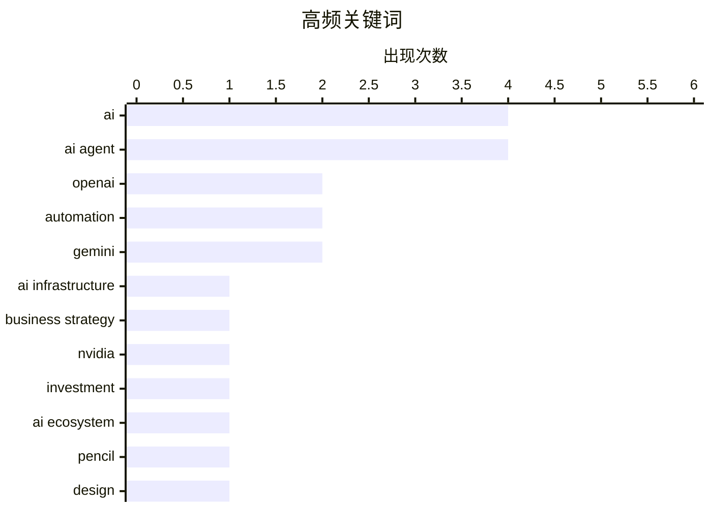

# 📰 AI 博客每日精选 — 2026-02-22

> 来自 117 个技术博客和社交媒体源，AI 精选 Top 15

## 📝 今日看点

今日技术圈聚焦于AI产业的战略调整与能力深化。一方面，头部企业正从激进扩张转向务实经营，OpenAI大幅削减基建投资并探索广告变现，英伟达也澄清了巨额投资传闻，行业进入理性发展阶段。另一方面，AI能力正突破关键瓶颈，从赋予Agent数字身份以跨越登录壁垒，到专项基准测试提升智能合约审计水平，技术落地路径愈发清晰。同时，AI与人的协作范式成为新焦点，工具创新与协作法则的探讨标志着人机共生进入深度整合期。

---

## 🏆 今日必读

🥇 **OpenAI战略转向：大幅削减AI基建投资，同时开启广告变现**

[OpenAI双管齐下了🙊 原计划到2030年砸1.4万亿美元搞AI基础设施，现在直接砍到6000亿美元！砍掉一半多！ Sam Altman几个月前还喊“all in”，现在谨慎多了😂 ...](https://x.com/abskoop/status/2025486517121286619) — 𝕏 @abskoop · 5 小时前 · 🤖 AI / ML

> OpenAI正在调整其激进的扩张战略，将原计划到2030年高达1.4万亿美元的AI基础设施投资大幅削减至6000亿美元。公司向投资者强调需将支出与收入挂钩，尽管2025年营收已超过131亿美元，但推理成本暴涨3倍导致毛利率从40%下滑至33%。为应对成本压力，OpenAI已开始在ChatGPT免费版中投放广告，采取“节流”与“开源”并行的策略。这表明公司正从“All in”式的激进投入转向更注重财务可持续性的务实经营。

💡 **为什么值得读**: 本文揭示了全球AI领头羊OpenAI在商业化与成本压力下的关键战略转向，对理解AI行业的未来投资节奏和商业模式演变具有重要参考价值。

🏷️ OpenAI, AI Infrastructure, Business Strategy

🥈 **英伟达否认千亿美元投资承诺：仅受邀参与**

[Nvidia was only invited to invest](https://idiallo.com/byte-size/nvidia-was-only-invited-to-invest?src=feed) — idiallo.com · 14 小时前 · 🤖 AI / ML

> 英伟达CEO黄仁勋否认了此前传闻中向OpenAI投资1000亿美元的承诺。黄仁勋澄清，英伟达只是被邀请参与投资，从未做出正式承诺。这一表态推翻了此前关于AI公司间存在“循环投资”的传闻，即英伟达投OpenAI，OpenAI再投甲骨文，甲骨文回投英伟达的闭环。此事反映了AI领域巨额资本传闻的复杂性以及企业对外沟通的谨慎态度。

💡 **为什么值得读**: 该文澄清了AI芯片巨头英伟达一项关键的投资传闻，有助于理解行业顶级玩家之间真实的资本关系与战略动向。

🏷️ Nvidia, OpenAI, investment, AI ecosystem

🥉 **Pencil：基于浏览器与Claude Agent的无限设计画布，可同步生成代码**

[神仙产品Pencil 浏览器里跑的无限WebGL设计画布+Claude并行设计agent！ 设计直接转代码还git同步 还不下载吗？https://www.pencil.dev/](https://x.com/sodawhite_dev/status/2025226325984944561) — 𝕏 @sodawhite_dev · 22 小时前 · 🛠 工具 / 开源

> Pencil是一款在浏览器中运行、基于无限WebGL画布的设计工具。其核心创新在于集成了Claude并行设计智能体，能够辅助用户进行设计创作。该工具支持将设计直接转换为代码，并能通过Git进行版本同步，实现了设计与开发工作流的无缝衔接。它旨在提供一个集设计、AI协作与代码生成于一体的全新创作环境。

💡 **为什么值得读**: 对于设计师和前端开发者而言，Pencil展示了AI如何深度融入创意与生产工具，是探索下一代设计开发范式的一个具体案例。

🏷️ Pencil, design, code generation, AI

4️⃣ **为AI Agent配备“互联网万能钥匙”：突破网站登录壁垒的数字身份方案**

[给我的 AI 助理配了一把互联网“万能钥匙”。🔑 刚才在读 Greg Isenberg 提的 14 个 Agent 演进阶段，意识到当下的 AI Agent 最大的短板不是大脑，而是“数字...](https://x.com/runes_leo/status/2025544802218180951) — 𝕏 @runes_leo · 1 小时前 · 🤖 AI / ML

> 当前AI Agent面临的核心瓶颈并非其“大脑”（推理能力），而是缺乏跨越网站登录/注册壁垒的“数字身份”。作者集成了一套名为Login Machine的架构，使Agent能自主完成注册流程。方案核心包括：利用Gemini Vision进行视觉识别以动态定位表单，替代脆弱的CSS选择器；为Agent配置可丢弃的沙盒化数字身份（专用邮箱、随机密码及浏览器指纹隔离）；采用安全注入机制，AI只负责识别，真实密码由本地系统从安全库注入，避免AI接触敏感信息。这使Agent从“只能读API的机器人”升级为能自主探索的“数字员工”。

💡 **为什么值得读**: 该方案直击AI Agent实现真正自主操作的关键技术难点，为构建能够处理复杂现实任务的智能体提供了切实可行的身份验证解决思路。

🏷️ AI Agent, authentication, automation

5️⃣ **OpenAI发布EVMbench基准，评估AI审计智能合约漏洞的能力**

[OpenAI 出了 EVMbench，专门测 AI 找智能合约漏洞的能力。 说明 AI x Crypto 这个交叉点，大厂已经认真在做了。 值得关注的是安全审计是 Crypto 里少数"客户愿意...](https://x.com/runes_leo/status/2025217528843436288) — 𝕏 @runes_leo · 23 小时前 · 🤖 AI / ML

> OpenAI推出了名为EVMbench的新基准测试，专门用于衡量AI智能体检测、利用和修复高严重性智能合约漏洞的能力。这表明AI与加密货币（Crypto）的交叉领域已引起大厂的认真投入。智能合约安全审计是Crypto领域中少数客户愿意支付高额费用的服务，如果AI能达到人工审计80%的效果，将可能重塑该市场的定价与格局。

💡 **为什么值得读**: EVMbench的发布标志着AI在区块链安全这一高价值、高专业度的垂直领域迈出了标准化评估的关键一步，预示了AI赋能的新方向。

🏷️ AI, security, blockchain, audit

---

## 📊 数据概览

| 扫描源 | 抓取文章 | 时间范围 | 精选 |
|:---:|:---:|:---:|:---:|
| 106/117 | 2716 篇 → 84 篇 | 24h | **15 篇** |

### 分类分布



### 高频关键词



<details>
<summary>📈 纯文本关键词图（终端友好）</summary>

```
ai                │ ████████████████████ 4
ai agent          │ ████████████████████ 4
openai            │ ██████████░░░░░░░░░░ 2
automation        │ ██████████░░░░░░░░░░ 2
gemini            │ ██████████░░░░░░░░░░ 2
ai infrastructure │ █████░░░░░░░░░░░░░░░ 1
business strategy │ █████░░░░░░░░░░░░░░░ 1
nvidia            │ █████░░░░░░░░░░░░░░░ 1
investment        │ █████░░░░░░░░░░░░░░░ 1
ai ecosystem      │ █████░░░░░░░░░░░░░░░ 1
```

</details>

### 🏷️ 话题标签

**ai**(4) · **ai agent**(4) · **openai**(2) · automation(2) · gemini(2) · ai infrastructure(1) · business strategy(1) · nvidia(1) · investment(1) · ai ecosystem(1) · pencil(1) · design(1) · code generation(1) · authentication(1) · security(1) · blockchain(1) · audit(1) · efficiency(1) · limitation(1) · creativity(1)

---

## 🤖 AI / ML

### 1. OpenAI战略转向：大幅削减AI基建投资，同时开启广告变现

[OpenAI双管齐下了🙊 原计划到2030年砸1.4万亿美元搞AI基础设施，现在直接砍到6000亿美元！砍掉一半多！ Sam Altman几个月前还喊“all in”，现在谨慎多了😂 ...](https://x.com/abskoop/status/2025486517121286619) — **𝕏 @abskoop** · 5 小时前 · ⭐ 26/30

> OpenAI正在调整其激进的扩张战略，将原计划到2030年高达1.4万亿美元的AI基础设施投资大幅削减至6000亿美元。公司向投资者强调需将支出与收入挂钩，尽管2025年营收已超过131亿美元，但推理成本暴涨3倍导致毛利率从40%下滑至33%。为应对成本压力，OpenAI已开始在ChatGPT免费版中投放广告，采取“节流”与“开源”并行的策略。这表明公司正从“All in”式的激进投入转向更注重财务可持续性的务实经营。

🏷️ OpenAI, AI Infrastructure, Business Strategy

---

### 2. 英伟达否认千亿美元投资承诺：仅受邀参与

[Nvidia was only invited to invest](https://idiallo.com/byte-size/nvidia-was-only-invited-to-invest?src=feed) — **idiallo.com** · 14 小时前 · ⭐ 25/30

> 英伟达CEO黄仁勋否认了此前传闻中向OpenAI投资1000亿美元的承诺。黄仁勋澄清，英伟达只是被邀请参与投资，从未做出正式承诺。这一表态推翻了此前关于AI公司间存在“循环投资”的传闻，即英伟达投OpenAI，OpenAI再投甲骨文，甲骨文回投英伟达的闭环。此事反映了AI领域巨额资本传闻的复杂性以及企业对外沟通的谨慎态度。

🏷️ Nvidia, OpenAI, investment, AI ecosystem

---

### 3. 为AI Agent配备“互联网万能钥匙”：突破网站登录壁垒的数字身份方案

[给我的 AI 助理配了一把互联网“万能钥匙”。🔑 刚才在读 Greg Isenberg 提的 14 个 Agent 演进阶段，意识到当下的 AI Agent 最大的短板不是大脑，而是“数字...](https://x.com/runes_leo/status/2025544802218180951) — **𝕏 @runes_leo** · 1 小时前 · ⭐ 24/30

> 当前AI Agent面临的核心瓶颈并非其“大脑”（推理能力），而是缺乏跨越网站登录/注册壁垒的“数字身份”。作者集成了一套名为Login Machine的架构，使Agent能自主完成注册流程。方案核心包括：利用Gemini Vision进行视觉识别以动态定位表单，替代脆弱的CSS选择器；为Agent配置可丢弃的沙盒化数字身份（专用邮箱、随机密码及浏览器指纹隔离）；采用安全注入机制，AI只负责识别，真实密码由本地系统从安全库注入，避免AI接触敏感信息。这使Agent从“只能读API的机器人”升级为能自主探索的“数字员工”。

🏷️ AI Agent, authentication, automation

---

### 4. OpenAI发布EVMbench基准，评估AI审计智能合约漏洞的能力

[OpenAI 出了 EVMbench，专门测 AI 找智能合约漏洞的能力。 说明 AI x Crypto 这个交叉点，大厂已经认真在做了。 值得关注的是安全审计是 Crypto 里少数"客户愿意...](https://x.com/runes_leo/status/2025217528843436288) — **𝕏 @runes_leo** · 23 小时前 · ⭐ 24/30

> OpenAI推出了名为EVMbench的新基准测试，专门用于衡量AI智能体检测、利用和修复高严重性智能合约漏洞的能力。这表明AI与加密货币（Crypto）的交叉领域已引起大厂的认真投入。智能合约安全审计是Crypto领域中少数客户愿意支付高额费用的服务，如果AI能达到人工审计80%的效果，将可能重塑该市场的定价与格局。

🏷️ AI, security, blockchain, audit

---

### 5. Claude 3.5 Opus与GPT-4o代码能力对比：Opus在定位并修复上游Bug上表现更强

[结论：4.6 Opus 更强。 两边在做到 e2e 测试阶段的时候都遇到了按照设计的用法跑却出错。而且问题并不是出在它们这一次 session 自己写的代码 scope 里面，而是...](https://x.com/yuxiyou/status/2025217905751908590) — **𝕏 @yuxiyou** · 23 小时前 · ⭐ 24/30

> 在一场针对相同编程任务的对比测试中，Claude 3.5 Opus与GPT-4o Codex都遇到了由所依赖的外部代码存在Bug而导致测试失败的情况。GPT-4o Codex的第一反应是在自身测试代码中寻找变通方法（Workaround）来绕过问题。而Claude 3.5 Opus则两次都精确定位到了上游代码中的根本性Bug，并直接进行了修复。测试结论认为，在解决此类复杂、涉及外部依赖的工程问题上，Claude 3.5 Opus展现出更强的深度分析和根治问题的能力。

🏷️ Claude, Codex, debugging, AI coding

---

### 6. 与AI Agent高效协作的七条法则

[7 条与 AI Agent 协作的法则 01: Context, not control（给背景，而不是控制欲） 别去微调AI 的每一步，给它清晰的背景和最终目标，让它自己找路。它往往比你设...](https://x.com/sodawhite_dev/status/2025481182180413477) — **𝕏 @sodawhite_dev** · 5 小时前 · ⭐ 23/30

> 文章提出了七条与AI智能体协作的核心法则：1. 提供背景而非控制（Context, not control）；2. 持续施压直至其犯错以探知边界（Push until it breaks）；3. 通过大量练习培养直觉（Put in the reps）；4. 大胆尝试，不惧浪费Token（Try everything. Waste tokens.）；5. 公开构建过程（Build in public）；6. 保持人性化互动（Stay human）；7. 保持乐观（Stay optimistic）。这些法则强调通过给予目标、测试极限、积累经验和开放探索来最大化AI的协作价值。

🏷️ AI agent, prompt engineering, collaboration, best practices

---

### 7. 解决LLM“无法瞻前顾后”的盲点：将提示词发送两遍，准确率从21%提升至97%

[LLM 的盲点：生成时只能向前看，看不到后文。 解法：把 prompt 发两遍。 准确率 21% → 97%，零成本，零延迟。 简单 > 聪明。](https://x.com/runes_leo/status/2025215683932340519) — **𝕏 @runes_leo** · 23 小时前 · ⭐ 23/30

> 大型语言模型（LLM）因采用自回归生成方式，存在一个根本盲点：在生成每个词元（Token）时只能“看到”它之前的文本，无法预知后文内容。这导致当提示词（Prompt）很长且问题在末尾时，模型在回答时可能已“遗忘”了开头的关键上下文。一个极其简单有效的解决方法是：将完整的提示词（包含上下文和问题）发送两遍给模型。实验表明，这一零成本、零延迟的技巧能将任务准确率从21%大幅提升至97%。

🏷️ LLM, prompt, accuracy

---

### 8. Gemini 3.1 Pro设计能力强劲，SVG动画或革新抽象知识教学

[现在Gemini 3.1pro的设计能力真的是强！ 我感觉SVG 动画演示特别适合用在教学上，这让我想到刚上高中的时候，数学和物理特别抽象的知识点，整整一个学期才弄懂。...](https://x.com/sodawhite_dev/status/2025228618671272415) — **𝕏 @sodawhite_dev** · 22 小时前 · ⭐ 22/30

> 作者高度评价了Gemini 3.1 Pro模型在生成设计内容方面的强大能力，特别指出其生成的SVG动画演示非常适合用于教学场景。文章以高中抽象的数学和物理知识点为例，说明传统的理解过程可能耗时漫长，而动态可视化工具有潜力极大地提升教学效率和理解深度。作者由此引发思考，探讨此类AI工具是否已被现代教育工作者采纳。

🏷️ Gemini, SVG, education, AI design

---

### 9. 2025全球人形机器人出货量出炉：中国品牌包揽前六，智元Agibot居首

[2025全球人形机器人出货量出来了🤖 中国直接把前6全包了：智元AgiBot 5168台第一，宇树Unitree 4200台第二，优必选UBTECH 1000台第三，美国Figure、特斯拉Opti...](https://x.com/abskoop/status/2025523491240611882) — **𝕏 @abskoop** · 3 小时前 · ⭐ 22/30

> 根据Omdia的数据，2025年全球人形机器人出货量排名显示，中国厂商已占据绝对主导地位，直接包揽前六名。具体排名为：智元Agibot以5168台位列第一，宇树Unitree以4200台位居第二，优必选UBTECH出货1000台排名第三。相比之下，美国公司如Figure、特斯拉Optimus和Agility Robotics的出货量均仅在150台左右。数据清晰地表明，中国在人形机器人的量产速度和规模上已经显著领先于全球竞争对手。

🏷️ humanoid robot, market, China

---

## 💡 观点 / 杂谈

### 10. 反思AI“效率至上”：边界之内卷效率，新世界在边界之外

[AI 降临派是工业革命效率至上的放大，看似很有想象力，细想却缺少想象力。 比如 EvoMap。Agents 吞下一颗颗胶囊后，经验复用的效率得到提升。然后呢，效率之外的...](https://x.com/lifesinger/status/2025391597286752611) — **𝕏 @lifesinger** · 11 小时前 · ⭐ 24/30

> 文章批判了当前AI发展过于聚焦于“效率至上”的范式，认为这本质上是工业革命思维的放大，缺乏真正的想象力。作者指出，无论是AI编程还是视频生成，其产出都未能超越人类既有经验和想象的边界。AI的核心作用目前看来是压缩时间——既压缩过去数据训练出LLM，也帮助人类压缩未来的工作时间。然而，当时间被极致压缩后，人类将面临“时间之外的空无”。真正的创新和新世界存在于现有语言与经验的边界之外，而非在边界内无限提升效率。

🏷️ AI, efficiency, limitation, creativity

---

### 11. 在AI时代，哪些“基础”能力永远不会过时？

[文中提到的“基础永远不会过时”，这里的基础指的是哪些能力呢？ 如果结合访谈内容，里面说的基础主要是几个层面： 1. 扎实的 CS 专业基础 > “他拉了一条 25 年...](https://x.com/dotey/status/2025446448553193719) — **𝕏 @dotey** · 8 小时前 · ⭐ 23/30

> 文章探讨了在AI编程普及的背景下，工程师需要具备哪些不会过时的核心基础能力。这些能力包括扎实的计算机科学专业基础（如编程语言、系统设计原理），用于在AI出错时进行兜底和任务拆解；产品直觉与系统思维，以解决从代码生成到理解用户真实需求的瓶颈；以及代码架构与工程判断力。作者的核心观点是，会写代码正变得普遍，而产品直觉、系统思维和在抽象层间灵活移动的能力正变得更为稀缺和关键。

🏷️ career, fundamentals, software engineering, AI

---

### 12. 借鉴：将本职工作Agent化以释放探索时间

[这篇值得借鉴。 正好我正在梳理自己的工作内容，把本职工作Agent化，留出更多的时间探索…](https://x.com/sodawhite_dev/status/2025404007464992850) — **𝕏 @sodawhite_dev** · 10 小时前 · ⭐ 22/30

> 作者分享了一种提升个人效率的工作方法：将常规性、重复性的本职工作流程进行Agent化（即通过智能体或自动化工具处理）。这种方法的核心目的是将人力从繁琐任务中解放出来，从而留出更多时间用于更具创造性的探索和学习。文章未详述具体技术方案，但点明了“梳理工作内容”是实现这一目标的前提步骤。其核心价值在于通过自动化实现时间资源的再分配，聚焦于高价值活动。

🏷️ AI Agent, workflow, automation

---

## 🛠 工具 / 开源

### 13. Pencil：基于浏览器与Claude Agent的无限设计画布，可同步生成代码

[神仙产品Pencil 浏览器里跑的无限WebGL设计画布+Claude并行设计agent！ 设计直接转代码还git同步 还不下载吗？https://www.pencil.dev/](https://x.com/sodawhite_dev/status/2025226325984944561) — **𝕏 @sodawhite_dev** · 22 小时前 · ⭐ 24/30

> Pencil是一款在浏览器中运行、基于无限WebGL画布的设计工具。其核心创新在于集成了Claude并行设计智能体，能够辅助用户进行设计创作。该工具支持将设计直接转换为代码，并能通过Git进行版本同步，实现了设计与开发工作流的无缝衔接。它旨在提供一个集设计、AI协作与代码生成于一体的全新创作环境。

🏷️ Pencil, design, code generation, AI

---

### 14. OpenClaw迭代神速，几乎日更，新增Gemini 3.1与Discord语音支持

[OpenClaw可以说上史上迭代最快的吧 几乎一天一天版本了。 Gemini3.1 Discord语音](https://x.com/sodawhite_dev/status/2025258805974692048) — **𝕏 @sodawhite_dev** · 20 小时前 · ⭐ 22/30

> 文章指出开源项目OpenClaw的迭代速度极快，几乎达到一天一个版本。最新版本（v2026.2.21）集成了多项重要更新：接入了谷歌的Gemini 3.1模型；在Discord平台上实现了线程绑定的子代理会话和语音频道功能；并新增了BytePlus作为模型提供商。这些更新显著增强了其多模态交互和平台集成能力。

🏷️ OpenClaw, AI Agent, Discord, Gemini

---

## ⚙️ 工程

### 15. SpaceX成功实现“星舰”超重助推器空中捕获，预计下月再次试飞

[The Super Heavy catch that broke the internet 厉害啊，275吨助推器被塔臂一把抓住！🤯 马老板刚官宣：星舰下个月（3月）又要飞了！🚀 #SpaceX #Starship](https://x.com/abskoop/status/2025403163038425246) — **𝕏 @abskoop** · 11 小时前 · ⭐ 23/30

> SpaceX实现了航天史上的一项壮举：成功使用发射塔的机械臂在空中捕获了重达275吨的“星舰”超重型助推器。这一“接住”火箭的技术是实现火箭完全可重复使用的关键一步。公司创始人埃隆·马斯克已官方宣布，“星舰”集成飞行测试计划于下个月（3月）再次进行。这标志着“星舰”开发计划进入了快速迭代的新阶段。

🏷️ SpaceX, Starship, rocket

---

*生成于 2026-02-22 13:53 | 扫描 106 源 → 获取 2716 篇 → 精选 15 篇*
*基于 [Hacker News Popularity Contest 2025](https://refactoringenglish.com/tools/hn-popularity/) RSS 源列表，由 [Andrej Karpathy](https://x.com/karpathy) 推荐*
*由「懂点儿AI」制作，欢迎关注同名微信公众号获取更多 AI 实用技巧 💡*
