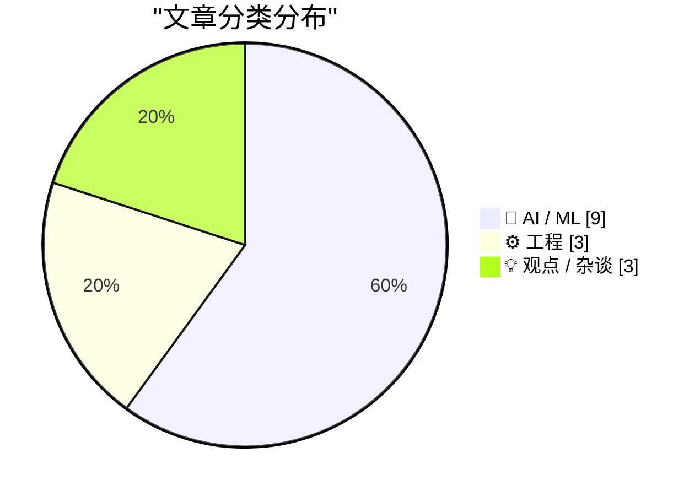
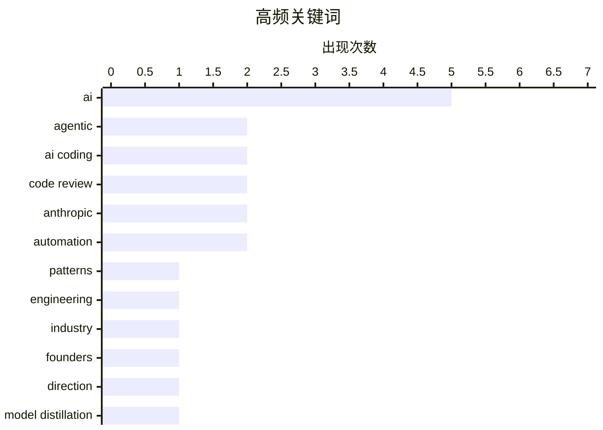

# 📰 AI 博客每日精选 — 2026-02-24

> 来自 117 个技术博客和社交媒体源，AI 精选 Top 15

## 📝 今日看点

今日技术圈聚焦于AI工程化的深层变革与行业震荡。一方面，智能体工程模式正成为开发新范式，业界积极寻求高效、可靠的AI编码实践与工具链优化。另一方面，AI竞争白热化引发伦理与商业冲突，模型能力窃取指控和传统IT堡垒被攻破事件凸显了行业的技术与权力重构。同时，关于AI二阶效应的严肃讨论警示，其对社会经济结构的潜在冲击远超当前的技术替代焦虑。

---

## 🏆 今日必读

🥇 **撰写关于智能体工程模式**

[Writing about Agentic Engineering Patterns](https://simonwillison.net/2026/Feb/23/agentic-engineering-patterns/#atom-everything) — simonwillison.net · 6 小时前 · 🤖 AI / ML

> 作者启动了一个新项目，旨在收集和记录“智能体工程模式”，以帮助开发者在编码智能体时代获得最佳实践。这些模式指的是使用Claude Code、OpenAI Codex等编码智能体构建软件的具体编码实践和方法。项目目标是系统化地整理经验，以应对当前快速发展的智能体开发浪潮。核心观点是，随着编码成本降低，需要新的工程习惯和模式来有效利用智能体。

💡 **为什么值得读**: 为希望系统化提升AI编码智能体使用效率的开发者提供了宝贵的模式库和最佳实践指南。

🏷️ AI, agentic, patterns, engineering

🥈 **AI领域的每个人都在因同一个原因构建错误的东西**

[Everyone in AI is building the wrong thing for the same reason](https://www.joanwestenberg.com/everyone-in-ai-is-building-the-wrong-thing-for-the-same-reason/) — joanwestenberg.com · 12 小时前 · 🤖 AI / ML

> 文章指出当前AI行业普遍存在一种方向性错误和加速内卷的困境。许多AI创始人感到行业在向一个“不太合理”的方向狂奔，却不知如何停下。这种集体焦虑源于对技术路径的盲目跟从和对市场真实需求的误判。作者的核心观点是，整个行业需要反思构建方向，而非仅仅追求速度。

💡 **为什么值得读**: 提供了一个批判性视角，帮助从业者跳出技术狂热，思考AI发展的本质与可持续方向。

🏷️ AI, industry, founders, direction

🥉 **Anthropic指控三家中国AI实验室通过“蒸馏攻击”非法提取Claude能力**

[Anthropic 发布调查报告，称发现 DeepSeek、月之暗面（Moonshot/Kimi）和 MiniMax 三家中国 AI 实验室，通过大规模"蒸馏攻击"非法提取 Claude 模型的能力来训练...](https://x.com/dotey/status/2026013737426022417) — 𝕏 @dotey · 4 小时前 · 🤖 AI / ML

> Anthropic发布报告，指控DeepSeek、月之暗面（Kimi）和MiniMax三家中国AI实验室通过大规模“蒸馏攻击”非法提取Claude模型能力。三家公司共创建约2.4万个虚假账户，与Claude进行了超过1600万次对话交互以获取训练数据。其中，MiniMax交互超1300万次聚焦编程能力，月之暗面超340万次瞄准智能体推理，DeepSeek则用独特方法让Claude复述推理过程生成思维链数据。核心结论是，尽管模型蒸馏本身是合法技术，但未经授权对竞争对手模型进行大规模操作违反了服务条款。

💡 **为什么值得读**: 揭示了AI行业竞争中的灰色地带与伦理边界，是了解模型安全、知识产权与行业竞争态势的关键案例。

🏷️ AI, model distillation, ethics, Claude

4️⃣ **AI写代码的实战经验：通过测试不等于能干活**

[每天用 AI 写项目的人表示：这条说的全中。 AI 写的代码通过了所有测试，部署后各种边界情况爆炸——考试满分，上班不会干活。 我的土办法： • 写完不算完，必...](https://x.com/runes_leo/status/2025745674546069548) — 𝕏 @runes_leo · 22 小时前 · ⚙️ 工程

> 基于日常使用AI编码的经验，指出AI生成的代码常能通过测试却在真实部署后因边界情况而失败，即“考试满分，上班不会干活”。作者分享了两个实用土办法：一是必须用真实数据验证，而非仅靠模拟测试；二是让两个不同的AI模型互相审查代码。其核心观点是，使用AI编码的竞争力关键已从“会写代码”转变为“会出题（写需求）+会验收”。

💡 **为什么值得读**: 提供了来自一线开发者的、可立即落地的AI编码质量保障实战技巧，极具操作性。

🏷️ AI coding, testing, prompt engineering, code review

5️⃣ **哪些Web框架对AI智能体最节省Token？**

[Which web frameworks are most token-efficient for AI agents?](https://martinalderson.com/posts/which-web-frameworks-are-most-token-efficient-for-ai-agents/?utm_source=rss) — martinalderson.com · 1 天前 · 🤖 AI / ML

> 文章对19个Web框架进行了基准测试，以评估AI编码智能体构建和扩展同一应用时的Token使用效率。测试发现，极简框架（Minimal frameworks）相比功能齐全的全栈框架，最多可节省高达2.9倍的Token。这意味着为AI智能体选择更轻量级的框架能显著降低提示工程的成本和复杂度。结论是，框架的复杂性与AI智能体完成任务的Token消耗直接相关。

💡 **为什么值得读**: 为开发者选择适合AI智能体协作的Web框架提供了关键的量化数据和选型依据。

🏷️ AI agents, web frameworks, benchmark, tokens

---

## 📊 数据概览

| 扫描源 | 抓取文章 | 时间范围 | 精选 |
|:---:|:---:|:---:|:---:|
| 106/117 | 2686 篇 → 107 篇 | 24h | **15 篇** |

### 分类分布



### 高频关键词



<details>
<summary>📈 纯文本关键词图（终端友好）</summary>

```
ai          │ ████████████████████ 5
agentic     │ ████████░░░░░░░░░░░░ 2
ai coding   │ ████████░░░░░░░░░░░░ 2
code review │ ████████░░░░░░░░░░░░ 2
anthropic   │ ████████░░░░░░░░░░░░ 2
automation  │ ████████░░░░░░░░░░░░ 2
patterns    │ ████░░░░░░░░░░░░░░░░ 1
engineering │ ████░░░░░░░░░░░░░░░░ 1
industry    │ ████░░░░░░░░░░░░░░░░ 1
founders    │ ████░░░░░░░░░░░░░░░░ 1
```

</details>

### 🏷️ 话题标签

**ai**(5) · **agentic**(2) · **ai coding**(2) · code review(2) · anthropic(2) · automation(2) · patterns(1) · engineering(1) · industry(1) · founders(1) · direction(1) · model distillation(1) · ethics(1) · claude(1) · testing(1) · prompt engineering(1) · ai agents(1) · web frameworks(1) · benchmark(1) · tokens(1)

---

## 🤖 AI / ML

### 1. 撰写关于智能体工程模式

[Writing about Agentic Engineering Patterns](https://simonwillison.net/2026/Feb/23/agentic-engineering-patterns/#atom-everything) — **simonwillison.net** · 6 小时前 · ⭐ 27/30

> 作者启动了一个新项目，旨在收集和记录“智能体工程模式”，以帮助开发者在编码智能体时代获得最佳实践。这些模式指的是使用Claude Code、OpenAI Codex等编码智能体构建软件的具体编码实践和方法。项目目标是系统化地整理经验，以应对当前快速发展的智能体开发浪潮。核心观点是，随着编码成本降低，需要新的工程习惯和模式来有效利用智能体。

🏷️ AI, agentic, patterns, engineering

---

### 2. AI领域的每个人都在因同一个原因构建错误的东西

[Everyone in AI is building the wrong thing for the same reason](https://www.joanwestenberg.com/everyone-in-ai-is-building-the-wrong-thing-for-the-same-reason/) — **joanwestenberg.com** · 12 小时前 · ⭐ 27/30

> 文章指出当前AI行业普遍存在一种方向性错误和加速内卷的困境。许多AI创始人感到行业在向一个“不太合理”的方向狂奔，却不知如何停下。这种集体焦虑源于对技术路径的盲目跟从和对市场真实需求的误判。作者的核心观点是，整个行业需要反思构建方向，而非仅仅追求速度。

🏷️ AI, industry, founders, direction

---

### 3. Anthropic指控三家中国AI实验室通过“蒸馏攻击”非法提取Claude能力

[Anthropic 发布调查报告，称发现 DeepSeek、月之暗面（Moonshot/Kimi）和 MiniMax 三家中国 AI 实验室，通过大规模"蒸馏攻击"非法提取 Claude 模型的能力来训练...](https://x.com/dotey/status/2026013737426022417) — **𝕏 @dotey** · 4 小时前 · ⭐ 27/30

> Anthropic发布报告，指控DeepSeek、月之暗面（Kimi）和MiniMax三家中国AI实验室通过大规模“蒸馏攻击”非法提取Claude模型能力。三家公司共创建约2.4万个虚假账户，与Claude进行了超过1600万次对话交互以获取训练数据。其中，MiniMax交互超1300万次聚焦编程能力，月之暗面超340万次瞄准智能体推理，DeepSeek则用独特方法让Claude复述推理过程生成思维链数据。核心结论是，尽管模型蒸馏本身是合法技术，但未经授权对竞争对手模型进行大规模操作违反了服务条款。

🏷️ AI, model distillation, ethics, Claude

---

### 4. 哪些Web框架对AI智能体最节省Token？

[Which web frameworks are most token-efficient for AI agents?](https://martinalderson.com/posts/which-web-frameworks-are-most-token-efficient-for-ai-agents/?utm_source=rss) — **martinalderson.com** · 1 天前 · ⭐ 25/30

> 文章对19个Web框架进行了基准测试，以评估AI编码智能体构建和扩展同一应用时的Token使用效率。测试发现，极简框架（Minimal frameworks）相比功能齐全的全栈框架，最多可节省高达2.9倍的Token。这意味着为AI智能体选择更轻量级的框架能显著降低提示工程的成本和复杂度。结论是，框架的复杂性与AI智能体完成任务的Token消耗直接相关。

🏷️ AI agents, web frameworks, benchmark, tokens

---

### 5. OpenAI的Stargate计算战略：构建广泛的生态系统伙伴网络

[RT Sachin Katti: Stargate is the umbrella brand for our compute strategy. It’s about mobilizing the full ecosystem to deliver a step-change in global...](https://x.com/OpenAI/status/2026073545953210701) — **𝕏 @OpenAI** · 1 小时前 · ⭐ 25/30

> OpenAI的Stargate是其整体计算战略的品牌，旨在动员整个生态系统实现全球AI计算的阶跃式变化。自2025年1月宣布以来，OpenAI已从主要依赖单一供应商的模式，扩展为横跨云、芯片和基础设施的广泛合作伙伴网络，包括SoftBank、NVIDIA、AMD、Broadcom、Oracle、微软、AWS、CoreWeave和Cerebras等。这表明OpenAI正通过多元化合作来保障和扩展其关键的计算资源。

🏷️ OpenAI, AI compute, Stargate

---

### 6. 传统IT堡垒被攻破：Anthropic将推COBOL自动化AI工具，IBM股价大跌

[RT Jeff Li: 传统IT时代最坚硬的堡垒被攻破：Anthropic将推出COBOL自动化AI工具；IBM股价应声下跌13%，创2000年以来最大跌幅](https://x.com/dotey/status/2026045991007248556) — **𝕏 @dotey** · 2 小时前 · ⭐ 25/30

> Anthropic即将推出COBOL自动化AI工具，标志着传统IT时代最坚硬的堡垒之一——大型机遗留系统现代化——被AI攻破。此消息导致高度依赖相关业务的IBM股价应声下跌13%，创下自2000年以来的最大单日跌幅。这显示了AI工具对特定传统技术和其背后商业模式的颠覆性潜力。

🏷️ Anthropic, COBOL, legacy systems, automation

---

### 7. OpenClaw 刚支持 Gemini 3.1，谷歌就开启了封号模式？

[啊哈～～～昨天openclaw刚更新的版本支持Gemini3.1 今天谷子就开启了封号模式？](https://x.com/sodawhite_dev/status/2025779170366959735) — **𝕏 @sodawhite_dev** · 20 小时前 · ⭐ 24/30

> 第三方AI工具OpenClaw在更新支持Google的Gemini 3.1模型后，其用户可能面临谷歌账户被封禁的风险。开发者Peter Steinberger指出谷歌对此采取了严厉措施，并计划移除对Antigravity（推测为相关工具或服务）的支持。相比之下，Anthropic等公司会就问题与开发者友好沟通，而谷歌直接采取封禁手段。这反映了大型模型提供商对第三方工具集成的严格管控态度。

🏷️ Gemini, API, ban, OpenClaw

---

### 8. AI将在12个月内永久分层人群：个人技术栈构建指南

[Alex 那篇文章说 AI 会在 12 个月内把人永久分层，用的和不用的差距只会越拉越大。他推荐了 4样：AI 自动化工具、云端强模型、编程模型、本地私有模型。 看完对...](https://x.com/runes_leo/status/2025759096272826455) — **𝕏 @runes_leo** · 21 小时前 · ⭐ 24/30

> 有观点认为AI将在未来12个月内造成‘永久性分层’，使用与不使用AI的人差距会迅速拉大。为应对此趋势，建议构建包含四大要素的个人技术栈：AI自动化工具、云端强模型、编程专用模型以及本地私有模型。作者通过补装DeepSeek R1和Qwen Coder等本地模型，完成了自身技术栈的拼图。核心观点是无需一步到位，可以逐步叠加这些能力，以掌握‘个人经济主权’。

🏷️ AI adoption, local model, workflow, DeepSeek

---

### 9. Anthropic发布新研究：AI流畅度指数

[New research: The AI Fluency Index. We tracked 11 behaviors across thousands of http://Claude.ai conversations—for example, how often people iterate ...](https://x.com/AnthropicAI/status/2025950279099961854) — **𝕏 @AnthropicAI** · 8 小时前 · ⭐ 24/30

> Anthropic公司发布了一项名为‘AI流畅度指数’的新研究，旨在量化人类与AI协作的效率。该研究通过追踪数千次Claude.ai对话中的11种具体行为（例如用户与Claude迭代和优化工作的频率）来进行测量。其目标是建立一个衡量人们如何有效与AI合作的指标。这项研究为了解和提升人机协作模式提供了数据基础。

🏷️ Anthropic, AI interaction, research

---

## ⚙️ 工程

### 10. AI写代码的实战经验：通过测试不等于能干活

[每天用 AI 写项目的人表示：这条说的全中。 AI 写的代码通过了所有测试，部署后各种边界情况爆炸——考试满分，上班不会干活。 我的土办法： • 写完不算完，必...](https://x.com/runes_leo/status/2025745674546069548) — **𝕏 @runes_leo** · 22 小时前 · ⭐ 26/30

> 基于日常使用AI编码的经验，指出AI生成的代码常能通过测试却在真实部署后因边界情况而失败，即“考试满分，上班不会干活”。作者分享了两个实用土办法：一是必须用真实数据验证，而非仅靠模拟测试；二是让两个不同的AI模型互相审查代码。其核心观点是，使用AI编码的竞争力关键已从“会写代码”转变为“会出题（写需求）+会验收”。

🏷️ AI coding, testing, prompt engineering, code review

---

### 11. Ladybird浏览器在AI协助下采用Rust语言

[Ladybird adopts Rust, with help from AI](https://simonwillison.net/2026/Feb/23/ladybird-adopts-rust/#atom-everything) — **simonwillison.net** · 5 小时前 · ⭐ 24/30

> Ladybird浏览器项目在AI编码智能体的帮助下，成功将其代码库从其他语言迁移至Rust。这是一个关于在关键、复杂的代码项目中高级且成熟地使用编码智能体的有趣案例研究。项目在等待Swift生态未果后，选择Rust作为内存安全语言，并首先利用AI辅助移植了一个关键库。案例证明了AI智能体在大型、严肃的工程项目中能够发挥实质性作用。

🏷️ Rust, AI, compiler, migration

---

### 12. 从10步全闭环到2条规则：AI自动写代码的简化实践

[这篇是目前见过最完整的 AI 全自动写代码方案，10 步流水线，从风险分级到自动修复到事故记忆，全闭环。 但 solo builder 用不上这么重的体系。我的简化版就两条...](https://x.com/runes_leo/status/2025930409121288586) — **𝕏 @runes_leo** · 10 小时前 · ⭐ 24/30

> 针对一套包含风险分级、自动修复、事故记忆等10个步骤的AI全自动写代码闭环方案，作者为独立开发者提出了极简化的两条核心规则。核心原则是按风险等级决定审查力度：涉及资金的代码，由Opus写完后再用Codex审核一遍；不涉及资金的，AI写完并通过测试即可。文章还强调了一个关键洞察：代码审查状态只认当前提交，过期的‘通过’一律作废，这条规则适用于任何规模的团队。

🏷️ AI coding, code review, risk management, automation

---

## 💡 观点 / 杂谈

### 13. AI的二阶效应比一阶猛烈得多

[AI 的二阶效应比一阶猛得多。 一阶 — 替代白领，利润暴增，股市新高 二阶 — 消费崩塌，软件定价坍缩，私募信贷连环违约 三阶 — 税收断崖，房贷根基动摇，政策...](https://x.com/runes_leo/status/2025805856454119594) — **𝕏 @runes_leo** · 18 小时前 · ⭐ 25/30

> 文章深入分析了AI技术超越“替代白领”的一阶效应后，可能引发的更深层社会经济连锁反应。二阶效应包括消费市场崩塌、软件定价体系坍缩以及私募信贷连环违约。三阶效应则可能触及税收断崖、房贷根基动摇和政策工具失灵。核心洞察指出，当人类智力从稀缺变为充裕时，整个建立在“智力稀缺”假设上的金融和经济定价体系将面临根本性冲击。

🏷️ AI impact, economy, second-order effects, analysis

---

### 14. 现在写代码很便宜

[Writing code is cheap now](https://simonwillison.net/guides/agentic-engineering-patterns/code-is-cheap/#atom-everything) — **simonwillison.net** · 7 小时前 · ⭐ 24/30

> 文章指出，采纳智能体工程实践的最大挑战，在于适应“现在写代码很便宜”这一事实带来的后果。传统上，产出几百行干净、经过测试的代码需要开发者一整天甚至更久，因此代码是昂贵的。许多宏观和微观的工程习惯都建立在“代码昂贵”的假设上。智能体的出现彻底改变了这一成本结构，要求我们重新思考代码质量、重构频率和系统设计等固有习惯。

🏷️ AI, agentic, productivity, coding

---

### 15. 给CS学生的AI时代建议：稀缺性从构建能力转向主动性、品味与质量

[给 CS 学生什么建议？ Harry 替即将进入职场的 CS 学生问了这个问题：怎么在 AI 时代保持自己的价值？ Embiricos 的回答出乎意料地乐观。他说从未有比现在更好的...](https://x.com/dotey/status/2025825905805771061) — **𝕏 @dotey** · 17 小时前 · ⭐ 24/30

> 在AI时代，CS学生面临如何保持自身价值的问题。一个乐观的观点是，现在是通过AI工具快速理解复杂代码库、提升工程能力的绝佳时机。然而，真正的挑战在于获取工作机会，因为构建的容易程度改变了稀缺资源的定义。新的稀缺品是主动性（自主发现问题并解决）、品味（在众多方案中做出优雅选择）和质量（在AI产出80分代码基础上完成最后20分的打磨）。具体建议是动手构建项目并公开分享。

🏷️ career, AI tools, software engineering

---

*生成于 2026-02-24 00:02 | 扫描 106 源 → 获取 2686 篇 → 精选 15 篇*
*基于 [Hacker News Popularity Contest 2025](https://refactoringenglish.com/tools/hn-popularity/) RSS 源列表，由 [Andrej Karpathy](https://x.com/karpathy) 推荐*
*由「懂点儿AI」制作，欢迎关注同名微信公众号获取更多 AI 实用技巧 💡*
