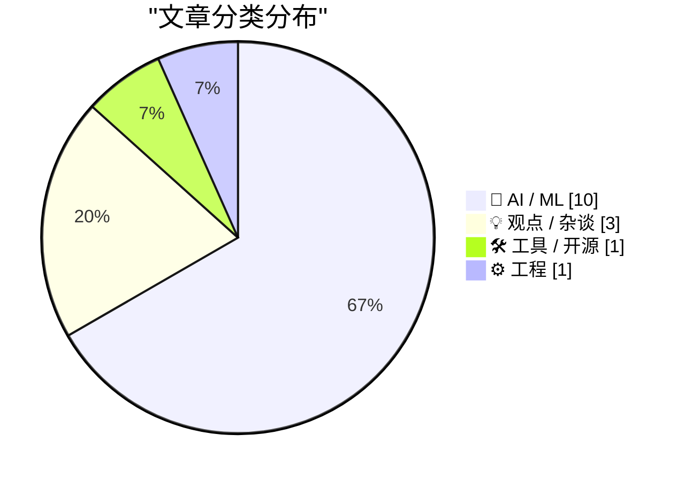
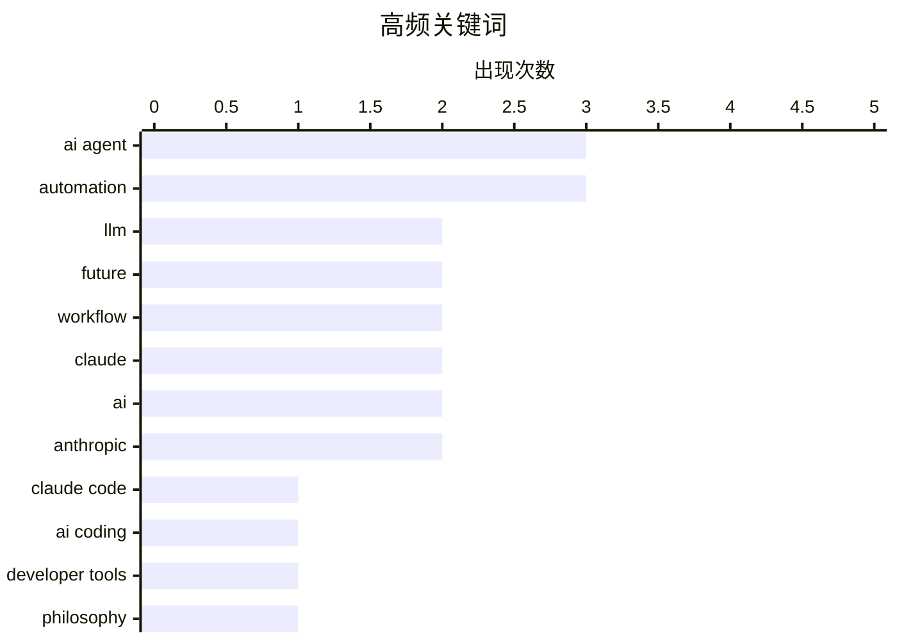

# 📰 AI 博客每日精选 — 2026-02-26

> 来自 117 个技术博客和社交媒体源，AI 精选 Top 15

## 📝 今日看点

今日技术圈聚焦于AI发展的深度整合与务实应用。一方面，AI能力正从单纯的知识获取转向工作流重构与成本优化，智能体部署和开源维护都强调以软件验证为先的务实路径。另一方面，行业呈现“智力”与“生成”双线并进的清晰脉络，背后是英伟达等硬件巨头持续强劲的业绩支撑。与此同时，围绕AI发展的激进与克制路线之争依然存在，但乐观的实践声音正展示其切实的降本增效潜力。

---

## 🏆 今日必读

🥇 **Claude Code 远程控制功能**

[Claude Code Remote Control](https://simonwillison.net/2026/Feb/25/claude-code-remote-control/#atom-everything) — simonwillison.net · 6 小时前 · 🛠 工具 / 开源

> Claude Code 新推出了远程控制功能，允许用户在本地计算机上运行一个会话，然后通过网页、iOS 或原生桌面应用界面向其发送提示词。该功能目前仍有些粗糙，部分用户遇到了“远程控制未为您的账户启用”的错误。这标志着 Claude 向更深度集成本地开发环境迈出了一步，旨在提升 AI 辅助编程的便捷性。

💡 **为什么值得读**: 对于希望将 Claude 深度融入本地工作流的开发者而言，此功能是评估其可用性和未来潜力的关键更新。

🏷️ Claude Code, AI coding, developer tools

🥈 **当获取知识不再是限制**

[When access to knowledge is no longer the limitation](https://idiallo.com/blog/access-to-knowledge-is-no-longer-a-limitation?src=feed) — idiallo.com · 12 小时前 · 🤖 AI / ML

> 文章探讨了在大型语言模型时代，获取知识本身已不再是人类进步的主要瓶颈。作者通过一个思想实验，将反对 LLM 的所有论点暂时搁置，转而聚焦于其带来的积极面。核心观点是，我们能够近乎即时地获取世界信息并得到答案，这开启了前所未有的可能性。关键在于我们如何利用这种近乎无限的知识可及性。

💡 **为什么值得读**: 这篇文章提供了一个超越技术争论的哲学视角，引导读者思考在知识触手可及的时代，人类创造力的新边疆在哪里。

🏷️ LLM, philosophy, knowledge

🥉 **AI 发展的双线框架：智力线与生成线**

[看到推荐，丢给 Claude Code 帮我消化。13,000 字长文，2 分钟出结构化摘要。 Kenny 这篇的核心框架：AI 发展两条线——LLM 智力线（推理模型 → agent → agent...](https://x.com/runes_leo/status/2026505457276424570) — 𝕏 @runes_leo · 20 小时前 · 🤖 AI / ML

> 一篇 13,000 字长文的核心框架指出，AI 发展沿两条主线并行：LLM 智力线（从推理模型到智能体再到智能体团队）和多模态生成线（技术门槛被模型吸收）。两条线共享同一个数据飞轮。文章对个人最实际的启示是：如果工作过程数据已线上化，AI 很可能做得更好。作者看好的应用方向包括垂直智能体、AI 互动平台和 AI 硬件（如 Plaud 年收入达 2-3 亿美金）。

💡 **为什么值得读**: 该框架清晰梳理了 AI 演进脉络，并结合具体案例和商业数据，为理解行业趋势和个人职业选择提供了扎实的认知地图。

🏷️ AI trends, LLM, agent, future

4️⃣ **部署 AI 智能体前，先用低成本方案跑通工作流**

[很多人为了玩 Agent，第一步就是砸几千刀买 Mac Studio，结果吃灰。 Miles 的这篇 OpenClaw 指南说透了核心命题：在硬件上烧钱之前，先在软件上把 Workflow 跑通...](https://x.com/runes_leo/status/2026577405981372688) — 𝕏 @runes_leo · 15 小时前 · 🤖 AI / ML

> 针对盲目购买高端硬件（如 Mac Studio）玩 AI 智能体却导致闲置的现象，文章提出了核心建议：在硬件上投入前，应优先在软件层面验证和跑通工作流。具体方法包括：将 AI 视为“严苛导师”来压力测试想法；通过手动时间审计找出真正高频、值得自动化的流程；使用低成本 VPS 和本地闲置设备作为沙盒进行验证。核心原则是不要为了智能体而智能体，而应关注投资回报率。

💡 **为什么值得读**: 这是一份极具实操性的避坑指南，提倡的“先验证，再投入”理念能帮助开发者或创业者以最小成本高效启动 AI 项目。

🏷️ AI Agent, workflow, automation, OpenClaw

5️⃣ **在 Claude 协同时代，如何构建 AI 原生垂直 SaaS**

[how to build an ai native vertical saas in the claude cowork era: 1. pick a sub-niche inside a large, profitable market 2. map one recurring workflow ...](https://x.com/gregisenberg/status/2026665189765005433) — 𝕏 @gregisenberg · 9 小时前 · 🤖 AI / ML

> 文章提供了一个在 Claude 等 AI 协同工具时代构建垂直 SaaS 的七步方法论。步骤包括：在一个庞大、盈利的市场中选择细分领域；梳理出一个能驱动收入或节省时间的重复性工作流；像培训实习生一样逐步写下该工作流；将机械性步骤与判断性决策分离；将 Claude 连接到实际技术栈（如 CRM、表格、邮箱）；消除流程中的导出和复制粘贴环节；最终将原始数据到推理再到产出的过程压缩。

💡 **为什么值得读**: 这套结构化、可执行的步骤清单，为创业者或产品经理利用 AI 重构传统工作流、打造高价值产品提供了清晰的路线图。

🏷️ SaaS, AI-native, workflow, Claude

---

## 📊 数据概览

| 扫描源 | 抓取文章 | 时间范围 | 精选 |
|:---:|:---:|:---:|:---:|
| 106/117 | 2687 篇 → 133 篇 | 24h | **15 篇** |

### 分类分布



### 高频关键词



<details>
<summary>📈 纯文本关键词图（终端友好）</summary>

```
ai agent    │ ████████████████████ 3
automation  │ ████████████████████ 3
llm         │ █████████████░░░░░░░ 2
future      │ █████████████░░░░░░░ 2
workflow    │ █████████████░░░░░░░ 2
claude      │ █████████████░░░░░░░ 2
ai          │ █████████████░░░░░░░ 2
anthropic   │ █████████████░░░░░░░ 2
claude code │ ███████░░░░░░░░░░░░░ 1
ai coding   │ ███████░░░░░░░░░░░░░ 1
```

</details>

### 🏷️ 话题标签

**ai agent**(3) · **automation**(3) · **llm**(2) · future(2) · workflow(2) · claude(2) · ai(2) · anthropic(2) · claude code(1) · ai coding(1) · developer tools(1) · philosophy(1) · knowledge(1) · ai trends(1) · agent(1) · openclaw(1) · saas(1) · ai-native(1) · nvidia(1) · earnings(1)

---

## 🤖 AI / ML

### 1. 当获取知识不再是限制

[When access to knowledge is no longer the limitation](https://idiallo.com/blog/access-to-knowledge-is-no-longer-a-limitation?src=feed) — **idiallo.com** · 12 小时前 · ⭐ 26/30

> 文章探讨了在大型语言模型时代，获取知识本身已不再是人类进步的主要瓶颈。作者通过一个思想实验，将反对 LLM 的所有论点暂时搁置，转而聚焦于其带来的积极面。核心观点是，我们能够近乎即时地获取世界信息并得到答案，这开启了前所未有的可能性。关键在于我们如何利用这种近乎无限的知识可及性。

🏷️ LLM, philosophy, knowledge

---

### 2. AI 发展的双线框架：智力线与生成线

[看到推荐，丢给 Claude Code 帮我消化。13,000 字长文，2 分钟出结构化摘要。 Kenny 这篇的核心框架：AI 发展两条线——LLM 智力线（推理模型 → agent → agent...](https://x.com/runes_leo/status/2026505457276424570) — **𝕏 @runes_leo** · 20 小时前 · ⭐ 26/30

> 一篇 13,000 字长文的核心框架指出，AI 发展沿两条主线并行：LLM 智力线（从推理模型到智能体再到智能体团队）和多模态生成线（技术门槛被模型吸收）。两条线共享同一个数据飞轮。文章对个人最实际的启示是：如果工作过程数据已线上化，AI 很可能做得更好。作者看好的应用方向包括垂直智能体、AI 互动平台和 AI 硬件（如 Plaud 年收入达 2-3 亿美金）。

🏷️ AI trends, LLM, agent, future

---

### 3. 部署 AI 智能体前，先用低成本方案跑通工作流

[很多人为了玩 Agent，第一步就是砸几千刀买 Mac Studio，结果吃灰。 Miles 的这篇 OpenClaw 指南说透了核心命题：在硬件上烧钱之前，先在软件上把 Workflow 跑通...](https://x.com/runes_leo/status/2026577405981372688) — **𝕏 @runes_leo** · 15 小时前 · ⭐ 25/30

> 针对盲目购买高端硬件（如 Mac Studio）玩 AI 智能体却导致闲置的现象，文章提出了核心建议：在硬件上投入前，应优先在软件层面验证和跑通工作流。具体方法包括：将 AI 视为“严苛导师”来压力测试想法；通过手动时间审计找出真正高频、值得自动化的流程；使用低成本 VPS 和本地闲置设备作为沙盒进行验证。核心原则是不要为了智能体而智能体，而应关注投资回报率。

🏷️ AI Agent, workflow, automation, OpenClaw

---

### 4. 在 Claude 协同时代，如何构建 AI 原生垂直 SaaS

[how to build an ai native vertical saas in the claude cowork era: 1. pick a sub-niche inside a large, profitable market 2. map one recurring workflow ...](https://x.com/gregisenberg/status/2026665189765005433) — **𝕏 @gregisenberg** · 9 小时前 · ⭐ 25/30

> 文章提供了一个在 Claude 等 AI 协同工具时代构建垂直 SaaS 的七步方法论。步骤包括：在一个庞大、盈利的市场中选择细分领域；梳理出一个能驱动收入或节省时间的重复性工作流；像培训实习生一样逐步写下该工作流；将机械性步骤与判断性决策分离；将 Claude 连接到实际技术栈（如 CRM、表格、邮箱）；消除流程中的导出和复制粘贴环节；最终将原始数据到推理再到产出的过程压缩。

🏷️ SaaS, AI-native, workflow, Claude

---

### 5. 英伟达 2027 财年 Q1 业绩指引超预期，营收同比增速加快至近 77%

[英伟达提供的2027财年第一财季指引强于预期。 营收料再创新高，指引区间中值较分析师预期高7.1%，同比增速较四季度加快至近77%。 英伟达指出，该指引不含中国市...](https://x.com/oran_ge/status/2026796737017557131) — **𝕏 @oran_ge** · 53 分钟前 · ⭐ 25/30

> 英伟达发布的 2027 财年第一财季业绩指引强于市场预期，营收预计将再创新高。其指引区间中值较分析师预期高出 7.1%，同比增速从四季度的水平加快至近 77%。公司特别指出，该业绩指引未包含来自中国市场的数据中心计算收入。

🏷️ NVIDIA, earnings, AI chip

---

### 6. Polymarket CLI 是 Agent 最自然的接口

[Polymarket CLI 是 Agent 最自然的接口，没有多余的 UI 层，输入输出就是纯文本，天然可组合 ── Karpathy 这个 checklist 很实用：CLI / MCP / Skills / Markd...](https://x.com/runes_leo/status/2026471709495407021) — **𝕏 @runes_leo** · 22 小时前 · ⭐ 24/30

> 文章核心观点是命令行界面（CLI）是AI智能体最自然和高效的交互接口。CLI作为“遗留”技术，其纯文本的输入输出特性让AI智能体能够原生、轻松地使用和组合它们，并通过整个终端工具包与之交互。作者引用了Andrej Karpathy的实用清单，强调了CLI、MCP、技能和Markdown文档的重要性。结论是，到2026年，不考虑AI智能体可访问性的产品，就如同2016年不做移动端适配一样落伍。

🏷️ AI Agent, CLI, interface, product

---

### 7. Anthropic 放弃其旗舰安全承诺

[RT Soumith Chintala: this is as wild as OpenAI dropping the "open", probably wilder: https://time.com/7380854/exclusive-anthropic-drops-flagship-safet...](https://x.com/steipete/status/2026740189649936691) — **𝕏 @steipete** · 6 小时前 · ⭐ 24/30

> 文章报道了AI公司Anthropic做出了一个重大政策转变。该公司放弃了其旗舰的安全承诺，这一举动被评论者认为其震撼程度甚至超过了OpenAI放弃“开放”原则。消息来源是《时代》杂志的独家报道。这一变化可能标志着AI公司在发展策略或安全治理重点上发生了根本性调整。

🏷️ Anthropic, safety, governance

---

### 8. AI编程：提示词工程、产品思维与编程经验孰重孰轻？

[今天朋友问，AI编程提示词工程重不重要？ 1. 提示词工程不重要，AI能力够强不需要提示词 2. 产品思维很重要，因为清晰的目标会让AI写清晰的代码，很多人一开始就...](https://x.com/manateelazycat/status/2026507409250988515) — **𝕏 @manateelazycat** · 20 小时前 · ⭐ 24/30

> 文章探讨了在AI辅助编程中，提示词工程、产品思维和编程经验三者的相对重要性。核心论点是：提示词工程本身并不关键，强大的AI模型能降低对其依赖；清晰的产品思维至关重要，因为它能帮助定义明确目标，从而让AI生成清晰的代码；而在大型项目的后期，深厚的编程经验变得不可或缺，它能帮助开发者洞察AI的局限并引导其走出困境。作者将AI比作一辆好越野车，但需要经验丰富的司机（开发者）才能驾驭复杂地形。

🏷️ AI-programming, prompt-engineering, product-thinking

---

### 9. 使用Perplexity Computer及其19个模型能做的10件酷事

[10 cool things you can do with perplexity computer and its 19 models: 1. auto-generate a live competitor brief that updates weekly with traffic shifts...](https://x.com/gregisenberg/status/2026754841037717682) — **𝕏 @gregisenberg** · 3 小时前 · ⭐ 24/30

> 文章列举了利用Perplexity Computer平台及其集成的19个AI模型可以完成的十项高级任务。这些任务展示了AI在商业分析和自动化方面的强大能力，例如：自动生成并每周更新包含流量、招聘和定价变化的实时竞品简报；将原始财务数据转化为包含叙述、图表和前瞻性建议的精美董事会演示文稿；监控整个行业并接收综合战略更新，而非零散的新闻提醒；以及每周通过交叉引用数据重建外联目标列表。

🏷️ Perplexity, AI models, automation, analysis

---

### 10. Agent Skills 爆火背后的逻辑：能力泛化与破圈

[跟 Agent Skills 火一样，首先是模型能力到了+Agent 工具成熟了，然后能力泛化能做非编程任务，从技术圈到了非技术圈](https://x.com/dotey/status/2026785816916234388) — **𝕏 @dotey** · 1 小时前 · ⭐ 24/30

> 文章分析了AI智能体技能（Agent Skills）近期突然兴起的原因。其核心逻辑是，首先，底层大模型的能力达到了临界点，同时智能体工具链本身已经成熟。在此基础上，智能体的能力实现了泛化，从单一的编程任务扩展到各种非编程任务。正是这种能力泛化，使得智能体技术得以从技术圈层走向更广泛的非技术圈层，引发了普及热潮。文末引用了一个疑问，呼应了coding agent在短时间内“起飞”的现象。

🏷️ AI agent, coding, automation

---

## 💡 观点 / 杂谈

### 11. AI 一周复刻 Next.js 的成功依赖四个关键条件

[这条新闻很多人把焦点放在“1周”用AI做出来上面，但是也要看看为什么能一周做出来。 这个项目能成功，靠的是几个条件同时到位。 首先，Next.js 文档极其完善，S...](https://x.com/dotey/status/2026528869902069965) — **𝕏 @dotey** · 18 小时前 · ⭐ 25/30

> CloudFlare 团队用 AI 在一周内复刻 Next.js 的成功并非偶然，依赖于四个同时到位的条件：Next.js 拥有极其完善的文档和大量 Stack Overflow 问答，这些高质量数据已进入模型训练集；Next.js 自带的数千个端到端测试可直接用作机器验证的“规格说明书”；Vite 已解决底层构建难题，AI 只需在其上适配；最重要的是，当前模型能力已足够强大，能将整个大型代码库装入上下文并保持一致性，甚至能自查源码排查 Bug。

🏷️ AI, Next.js, productivity, development

---

### 12. 一切都很美好（我为何是个乐观主义者）

[Everything is awesome (why I'm an optimist)](https://www.joanwestenberg.com/everything-is-awesome-why-im-an-optimist/) — **joanwestenberg.com** · 22 小时前 · ⭐ 24/30

> 针对二月份互联网上弥漫的、将 AI 比作新冠疫情早期并预言灾难的恐慌性言论（如某文章获得超 8000 万浏览量），作者旗帜鲜明地表达了自己的乐观主义立场。文章驳斥了这种危言耸听，认为当前对 AI 的过度恐惧是不必要的。作者主张应以更积极、建设性的视角看待技术发展。

🏷️ AI, optimism, future

---

### 13. Anthropic 的“异类”路线：克制、安全与稳定交付

[Daniel 这篇反讽文很有意思，用 Clickbait 的标题点出了 Anthropic 在当前 AI 竞赛中最“惹人厌”的几个特点：刻板的订阅制、严打 API 灰产，以及明显缺乏“华丽...](https://x.com/runes_leo/status/2026710533227823159) — **𝕏 @runes_leo** · 6 小时前 · ⭐ 24/30

> 文章以反讽方式指出，Anthropic 在当前 AI 竞赛中因刻板的订阅制、严打 API 灰产及缺乏“华丽营销感”而显得“惹人厌”。但其核心是一条异类产品路线：当竞争对手纷纷降价、拓展场景时，Anthropic 选择极度专注于安全性和对齐研究，甚至不惜牺牲短期商业扩张效率。这种“不迎合市场”的底层逻辑，使其在交付复杂、长链路的系统级代码时，表现往往最为稳定可靠。

🏷️ Anthropic, business model, AI safety, strategy

---

## 🛠 工具 / 开源

### 14. Claude Code 远程控制功能

[Claude Code Remote Control](https://simonwillison.net/2026/Feb/25/claude-code-remote-control/#atom-everything) — **simonwillison.net** · 6 小时前 · ⭐ 26/30

> Claude Code 新推出了远程控制功能，允许用户在本地计算机上运行一个会话，然后通过网页、iOS 或原生桌面应用界面向其发送提示词。该功能目前仍有些粗糙，部分用户遇到了“远程控制未为您的账户启用”的错误。这标志着 Claude 向更深度集成本地开发环境迈出了一步，旨在提升 AI 辅助编程的便捷性。

🏷️ Claude Code, AI coding, developer tools

---

## ⚙️ 工程

### 15. 2026 年，AI 如何大幅降低开源项目的维护成本

[开源项目最让人犹豫的不是写代码，是后续维护。 我不写代码，项目（x-reader）是 AI 帮搭的。这两天陆续收到 3 个代码贡献 + 1 个用户提问，全程交给 Claude —...](https://x.com/runes_leo/status/2026801130181898584) — **𝕏 @runes_leo** · 36 分钟前 · ⭐ 24/30

> 作者分享其 AI 搭建的开源项目 x-reader 的维护经验，指出当前 AI 已能极大降低开源维护成本。在收到 3 个代码贡献和 1 个用户提问后，作者全程交由 Claude 处理：审查代码、合并合规范的提交、驳回有问题（甚至能发现其中由 AI 生成的幻觉代码）的提交、回复用户提问。作者仅需给出“帮我看看”的指令。基于此，作者鼓励拥有自用小工具的人大胆开源。

🏷️ open source, AI maintenance, Claude, code review

---

*生成于 2026-02-26 00:03 | 扫描 106 源 → 获取 2687 篇 → 精选 15 篇*
*基于 [Hacker News Popularity Contest 2025](https://refactoringenglish.com/tools/hn-popularity/) RSS 源列表，由 [Andrej Karpathy](https://x.com/karpathy) 推荐*
*由「懂点儿AI」制作，欢迎关注同名微信公众号获取更多 AI 实用技巧 💡*
