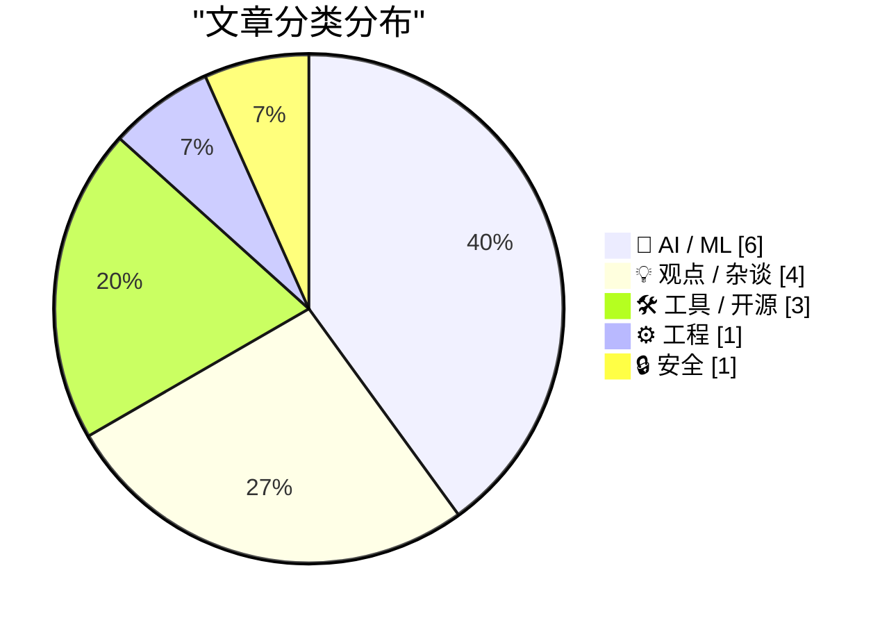
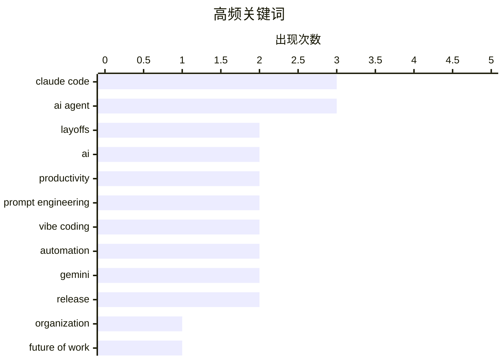

# 📰 AI 博客每日精选 — 2026-02-27

> 来自 117 个技术博客和社交媒体源，AI 精选 Top 15

## 📝 今日看点

今日技术圈的核心焦点是AI如何重塑软件开发的范式与实践。一方面，AI编码智能体的普及正推动“氛围编程”等新协作模式进入主流教学与工作流程；另一方面，业界已开始反思其局限性，并积极探索“规格驱动开发”等更严谨的AI原生工程方法。与此同时，AI带来的效率提升也引发了剧烈的组织调整，企业正通过激进的结构变革来适应这一新的运营现实。

---

## 🏆 今日必读

🥇 **Block大裁员：Jack Dorsey 砍掉近半员工，称 AI 改变了公司运营方式**

[Square 宣布裁员 40%，这可能只是接下来裁员大潮的开始。 公司没有任何经营困难，只是... AI 已经改变了组织运作的方式 AI + 扁平化的组织方式，可以比之前 2 倍...](https://x.com/oran_ge/status/2027166167715213567) — 𝕏 @oran_ge · 25 分钟前 · 💡 观点 / 杂谈

> Block（前身为 Square）CEO Jack Dorsey 宣布裁员约 4000 人，将公司规模从超过 1 万人缩减至不到 6000 人，裁员比例接近一半。此次裁员并非因为经营困难，而是 AI 技术从根本上改变了组织运作方式。AI 结合扁平化组织，能以之前 2 倍多的人员效率完成更多工作。未来的公司要求每个人都成为“超级个体”，主动承担超出岗位边界的工作。作者核心观点是，个人应主动适应 AI 驱动的组织变革，而非被动等待。

💡 **为什么值得读**: 这篇文章揭示了 AI 如何引发根本性的组织重构，对理解未来职场和个人发展路径具有重要警示和启发意义。

🏷️ layoffs, AI, organization, future of work

🥈 **囤积你所知道如何做的事情**

[Hoard things you know how to do](https://simonwillison.net/guides/agentic-engineering-patterns/hoard-things-you-know-how-to-do/#atom-everything) — simonwillison.net · 3 小时前 · 🤖 AI / ML

> 文章核心是分享与编码智能体高效协作的模式。关键论点是，高效构建软件的技能在于了解什么是可能或不可能的，并对如何实现有大致思路。作者建议将“囤积你知道如何做的事情”这一传统职业建议，延伸应用到与 AI 智能体的协作中。通过积累和整理已知的解决方案与模式，可以更有效地指导和评估智能体的工作。这本质上是一种提升人机协作效率的知识管理策略。

💡 **为什么值得读**: 它提供了一个将传统软件开发智慧迁移到 AI 时代的具体、可操作的模式，能直接提升使用编码智能体的生产力。

🏷️ AI Agents, Engineering Patterns, Productivity

🥉 **CLAUDE.md 从配置文件演化为操作系统的实践与架构设计**

[用 Claude Code 两个多月，http://CLAUDE.md 从一个配置文件长成了一套操作系统。 踩过最痛的坑：rules/ 目录下的文件每次对话全量加载。我往里塞了 17KB 的规则...](https://x.com/runes_leo/status/2027030391643570258) — 𝕏 @runes_leo · 9 小时前 · 🛠 工具 / 开源

> 文章分享了作者使用 Claude Code 两个多月后，如何将其配置文件 http://CLAUDE.md 发展成一套复杂的“操作系统”。核心挑战是 rules/ 目录下 17KB 的规则文件全量加载会撑爆上下文窗口（达 125,996 / 125,999 tokens），导致故障，削减至 6.6KB 后才解决。由此提炼出关键设计原则：每个字节都有成本，必须按需加载。作者最终设计了三层架构（CLAUDE.md 指针层、rules/ 自动加载层、docs/ 按需加载层）并辅以热数据层、任务路由等四个机制，实现了高效的上下文管理和任务延续。

💡 **为什么值得读**: 这是来自重度用户的宝贵实战经验，其提出的分层按需加载架构和具体数据指标，对任何构建复杂 AI 助手系统的人都有极高参考价值。

🏷️ Claude Code, context window, prompt engineering, AI workflow

4️⃣ **斯坦福正式开设“氛围编程”课程：《现代软件开发者》**

[斯坦福把 Vibe Coding 变成了正式课程。 CS146S《The Modern Software Developer》，10 周，从怎么跟 AI 写代码讲到怎么让 AI 自己干活——搭 Agent、管上下文、...](https://x.com/runes_leo/status/2026994655787659581) — 𝕏 @runes_leo · 11 小时前 · 🤖 AI / ML

> 斯坦福大学开设了名为 CS146S《The Modern Software Developer》的 10 周课程，将“氛围编程”（Vibe Coding）体系化。课程内容涵盖从与 AI 协作编码到构建自主智能体（Agent）、管理上下文、防范安全漏洞及自动化部署的全流程。课程亮点包括探讨“上下文腐化”（Context Rot）、提示词注入（Prompt Injection）攻防、以及如何担任智能体的“经理”等前沿议题。文章也指出课程可能存在赞助商偏见，如 Warp 终端工具占比较大，且重度偏向 Claude 生态。

💡 **为什么值得读**: 它标志着 AI 编程实践正从民间技巧进入顶尖学术殿堂，课程大纲揭示了下一代开发者必须掌握的核心技能树。

🏷️ AI education, Vibe Coding, Stanford, AI Agent

5️⃣ **超越氛围编程：规格驱动开发（SDD）是 AI 原生开发的终极形态**

[“如果你还在纯靠 Vibe Coding，那你很快会撞上 Agent 的认知墙。” 很多人迷恋 AI 带来的快节奏，却忽略了代码漂移的代价。其实 SDD (Spec-Driven Development)...](https://x.com/runes_leo/status/2026949357099012548) — 𝕏 @runes_leo · 14 小时前 · ⚙️ 工程

> 文章批判了纯“氛围编程”（Vibe Coding）的局限性，认为其会导致代码漂移并很快撞上智能体的“认知墙”。作者提出，规格驱动开发（Spec-Driven Development， SDD）才是 Vibe Coding 的进化方向。在 SDD 模式下，人类开发者仅负责定义意图（Intent），而将制定计划、对齐规格、编写和维护文档等具体工作全部交给智能体（Agent）完成。这被认为是真正的 AI 原生开发范式，将人类从繁琐的“苦累活”中解放出来。

💡 **为什么值得读**: 它清晰地指出了当前 AI 辅助编程的下一阶段演进方向，为希望深度整合 AI 的开发者提供了高阶方法论。

🏷️ AI Agent, Spec-Driven Development, Vibe Coding, software development

---

## 📊 数据概览

| 扫描源 | 抓取文章 | 时间范围 | 精选 |
|:---:|:---:|:---:|:---:|
| 107/117 | 2691 篇 → 107 篇 | 24h | **15 篇** |

### 分类分布



### 高频关键词



<details>
<summary>📈 纯文本关键词图（终端友好）</summary>

```
claude code        │ ████████████████████ 3
ai agent           │ ████████████████████ 3
layoffs            │ █████████████░░░░░░░ 2
ai                 │ █████████████░░░░░░░ 2
productivity       │ █████████████░░░░░░░ 2
prompt engineering │ █████████████░░░░░░░ 2
vibe coding        │ █████████████░░░░░░░ 2
automation         │ █████████████░░░░░░░ 2
gemini             │ █████████████░░░░░░░ 2
release            │ █████████████░░░░░░░ 2
```

</details>

### 🏷️ 话题标签

**claude code**(3) · **ai agent**(3) · **layoffs**(2) · ai(2) · productivity(2) · prompt engineering(2) · vibe coding(2) · automation(2) · gemini(2) · release(2) · organization(1) · future of work(1) · ai agents(1) · engineering patterns(1) · context window(1) · ai workflow(1) · ai education(1) · stanford(1) · spec-driven development(1) · software development(1)

---

## 🤖 AI / ML

### 1. 囤积你所知道如何做的事情

[Hoard things you know how to do](https://simonwillison.net/guides/agentic-engineering-patterns/hoard-things-you-know-how-to-do/#atom-everything) — **simonwillison.net** · 3 小时前 · ⭐ 25/30

> 文章核心是分享与编码智能体高效协作的模式。关键论点是，高效构建软件的技能在于了解什么是可能或不可能的，并对如何实现有大致思路。作者建议将“囤积你知道如何做的事情”这一传统职业建议，延伸应用到与 AI 智能体的协作中。通过积累和整理已知的解决方案与模式，可以更有效地指导和评估智能体的工作。这本质上是一种提升人机协作效率的知识管理策略。

🏷️ AI Agents, Engineering Patterns, Productivity

---

### 2. 斯坦福正式开设“氛围编程”课程：《现代软件开发者》

[斯坦福把 Vibe Coding 变成了正式课程。 CS146S《The Modern Software Developer》，10 周，从怎么跟 AI 写代码讲到怎么让 AI 自己干活——搭 Agent、管上下文、...](https://x.com/runes_leo/status/2026994655787659581) — **𝕏 @runes_leo** · 11 小时前 · ⭐ 25/30

> 斯坦福大学开设了名为 CS146S《The Modern Software Developer》的 10 周课程，将“氛围编程”（Vibe Coding）体系化。课程内容涵盖从与 AI 协作编码到构建自主智能体（Agent）、管理上下文、防范安全漏洞及自动化部署的全流程。课程亮点包括探讨“上下文腐化”（Context Rot）、提示词注入（Prompt Injection）攻防、以及如何担任智能体的“经理”等前沿议题。文章也指出课程可能存在赞助商偏见，如 Warp 终端工具占比较大，且重度偏向 Claude 生态。

🏷️ AI education, Vibe Coding, Stanford, AI Agent

---

### 3. Claude Code 重度用户验证：智能体记忆系统的缺失与土法解决方案

[Claude Code 重度用户实测验证。 六个缺失全踩过，最痛两个： • 没有遗忘 — 一年前过时经验跟昨天关键教训权重相同 • Memory Misevolution — 错误经验写入 h...](https://x.com/runes_leo/status/2026924694369341739) — **𝕏 @runes_leo** · 16 小时前 · ⭐ 25/30

> 作者以 Claude Code 重度用户身份，验证了当前 AI 编码智能体在记忆系统上的六大缺失。最突出的两个问题是：缺乏遗忘机制，导致一年前的过时经验与昨天的重要教训权重相同；以及“记忆错误进化”，一旦错误经验被写入核心模式文件，会在后续每次对话中自动加载并重复犯错。作为应对，作者采用了三层手动晋升的土法方案（today.md → MEMORY.md → patterns.md），模拟了从短期记忆到长期记忆再到核心记忆的过程，但指出未来方向需要真正的遗忘功能和重要性评分机制。

🏷️ Claude Code, AI memory, prompt engineering, context management

---

### 4. 蜂群架构：将软件工程机器压缩为个人控制台

[“未来一代的企业家，不会雇佣一个 10 人团队去做一套系统就能搞定的事。” @elvissun 提到的这个 Swarm (蜂群) 架构，本质上是把“软件工程”这台机器，完全压...](https://x.com/runes_leo/status/2026891727039299782) — **𝕏 @runes_leo** · 18 小时前 · ⭐ 25/30

> 文章探讨了“蜂群”（Swarm）架构如何彻底改变软件工程的组织方式。该架构的本质是将传统上需要多人团队协作的“软件工程机器”，压缩成可由单一个人通过“控制台”操控的系统。其最硬核的原则是“实证驱动”，即只信任真实的代码提交（Commit）、实际收入和系统报错，拒绝无意义的 AI 演示。当核心编排器（Orchestrator）能够自动发现任务并协同子智能体执行时，个人生产力的物理上限将仅取决于系统的内存容量。

🏷️ AI Agent, Swarm, automation, software engineering

---

### 5. Google DeepMind 发布 Nano Banana 2 图像模型

[](https://x.com/vasuman/status/2027058227309924778) — **𝕏 @vasuman** · 7 小时前 · ⭐ 25/30

> Google DeepMind 宣布推出 Nano Banana 2 图像生成与编辑模型。该模型基于最新的 Gemini Flash 模型构建，在创造和编辑图像方面达到了业界领先水平。它结合了专业级的能力与闪电般的处理速度。

🏷️ Gemini, Google-DeepMind, multimodal, model-release

---

### 6. 关于英伟达与分析困境

[On NVIDIA and Analyslop](https://www.wheresyoured.at/on-nvidia-and-analyslop/) — **wheresyoured.at** · 7 小时前 · ⭐ 24/30

> 文章探讨了英伟达在AI芯片市场的垄断地位及其引发的行业分析困境。作者指出，市场分析师过度依赖英伟达的官方叙事，缺乏对其技术路线和商业策略的独立批判性思考。这种“分析困境”导致了对AI硬件生态多样性和潜在风险的忽视。核心观点是，行业需要超越英伟达的营销框架，进行更深入、更独立的技术与市场分析。

🏷️ NVIDIA, AI hardware, market analysis

---

## 💡 观点 / 杂谈

### 7. Block大裁员：Jack Dorsey 砍掉近半员工，称 AI 改变了公司运营方式

[Square 宣布裁员 40%，这可能只是接下来裁员大潮的开始。 公司没有任何经营困难，只是... AI 已经改变了组织运作的方式 AI + 扁平化的组织方式，可以比之前 2 倍...](https://x.com/oran_ge/status/2027166167715213567) — **𝕏 @oran_ge** · 25 分钟前 · ⭐ 26/30

> Block（前身为 Square）CEO Jack Dorsey 宣布裁员约 4000 人，将公司规模从超过 1 万人缩减至不到 6000 人，裁员比例接近一半。此次裁员并非因为经营困难，而是 AI 技术从根本上改变了组织运作方式。AI 结合扁平化组织，能以之前 2 倍多的人员效率完成更多工作。未来的公司要求每个人都成为“超级个体”，主动承担超出岗位边界的工作。作者核心观点是，个人应主动适应 AI 驱动的组织变革，而非被动等待。

🏷️ layoffs, AI, organization, future of work

---

### 8. 引用 Andrej Karpathy：编程在最近两个月因 AI 发生了根本性改变

[Quoting Andrej Karpathy](https://simonwillison.net/2026/Feb/26/andrej-karpathy/#atom-everything) — **simonwillison.net** · 4 小时前 · ⭐ 24/30

> 文章引用了 AI 专家 Andrej Karpathy 的观点，强调编程在最近两个月（特别是去年十二月以来）发生了非渐进式的根本改变。Karpathy 认为，编码智能体在十二月之前基本上无法有效工作，而自此之后则变得基本可用。关键变化在于模型质量、长期连贯性和持久性得到了显著提升，使得智能体能够攻克大型复杂任务。这标志着一个新时代的转折点。

🏷️ AI Programming, Developer Tools, Paradigm Shift

---

### 9. 反共识视角：AI引发的是智力大爆炸，而非全球智力危机

[在市场因 Anthropic 的能力跃迁而恐慌抛售时，Kobeissi Letter 提出了一个极高维度的反共识视角：我们经历的并非全球智力危机，而是智力大爆炸。 很多看空逻辑建...](https://x.com/runes_leo/status/2026865388898889921) — **𝕏 @runes_leo** · 20 小时前 · ⭐ 24/30

> 针对市场因AI能力跃迁产生的恐慌，Kobeissi Letter提出了一个反共识的宏观经济学视角。核心论点是，AI带来的不是危机，而是“认知商品化”和“智力大爆炸”。历史表明，生产成本的坍塌会伴随总需求的指数级扩张，AI导致的服务价格通缩（即“丰饶GDP”）将提升社会整体购买力和产出。虽然多数行业会经历利润压缩的阵痛，但这为超级个体和适应性组织创造了巨大机会。结论是，不应做空这场由AI驱动的系统性变革。

🏷️ AI economics, productivity, societal impact, Anthropic

---

### 10. Block裁员4000人，主因是AI重塑工作方式

[4000 people laid off today at Block the reason is AI “we're already seeing that the intelligence tools we’re creating and using, paired with smaller...](https://x.com/gregisenberg/status/2027141181629444330) — **𝕏 @gregisenberg** · 2 小时前 · ⭐ 24/30

> 支付公司Block（原Square）宣布裁员4000人，其联合创始人Jack Dorsey在内部信中明确将原因指向AI。他指出，公司正在创造和使用的智能工具，结合更精简、扁平化的团队，正在从根本上改变公司的构建和运营方式。这种由AI驱动的新工作模式正在加速普及，并导致了此次大规模的组织结构调整。

🏷️ layoffs, AI, workforce, automation

---

## 🛠 工具 / 开源

### 11. CLAUDE.md 从配置文件演化为操作系统的实践与架构设计

[用 Claude Code 两个多月，http://CLAUDE.md 从一个配置文件长成了一套操作系统。 踩过最痛的坑：rules/ 目录下的文件每次对话全量加载。我往里塞了 17KB 的规则...](https://x.com/runes_leo/status/2027030391643570258) — **𝕏 @runes_leo** · 9 小时前 · ⭐ 25/30

> 文章分享了作者使用 Claude Code 两个多月后，如何将其配置文件 http://CLAUDE.md 发展成一套复杂的“操作系统”。核心挑战是 rules/ 目录下 17KB 的规则文件全量加载会撑爆上下文窗口（达 125,996 / 125,999 tokens），导致故障，削减至 6.6KB 后才解决。由此提炼出关键设计原则：每个字节都有成本，必须按需加载。作者最终设计了三层架构（CLAUDE.md 指针层、rules/ 自动加载层、docs/ 按需加载层）并辅以热数据层、任务路由等四个机制，实现了高效的上下文管理和任务延续。

🏷️ Claude Code, context window, prompt engineering, AI workflow

---

### 12. Claude Code功能快速迭代：手机控制、定时任务与记忆功能

[果然😂 Claude Code 第一天推出手机控制、第二天推出定时任务、第三天推出记忆功能…](https://x.com/sodawhite_dev/status/2027161801432219740) — **𝕏 @sodawhite_dev** · 42 分钟前 · ⭐ 24/30

> 一条推文展示了Anthropic的Claude Code工具功能的快速迭代。该工具在第一天推出了手机控制功能，第二天增加了定时任务，第三天便上线了记忆功能。视频演示了其操作界面和流程。这表明Claude Code正以极快的速度完善其自动化编程助手的能力集。

🏷️ Claude Code, AI features, release

---

### 13. Gemini CLI已上线gemini-3.1-pro模型

[试了一下，Gemini Cli 中已经有了 gemini-3.1-pro](https://x.com/sodawhite_dev/status/2026901275997253989) — **𝕏 @sodawhite_dev** · 17 小时前 · ⭐ 24/30

> 推文证实，谷歌的Gemini 3.1 Pro模型现已通过Gemini CLI向所有付费用户开放。该模型被设置为默认路由模型“Auto (Gemini 3)”中处理复杂提示的Pro模型。用户也可以通过`/model`命令手动切换至该新模型进行体验。这标志着Gemini系列模型的一次重要更新已全面铺开。

🏷️ Gemini, CLI, release

---

## ⚙️ 工程

### 14. 超越氛围编程：规格驱动开发（SDD）是 AI 原生开发的终极形态

[“如果你还在纯靠 Vibe Coding，那你很快会撞上 Agent 的认知墙。” 很多人迷恋 AI 带来的快节奏，却忽略了代码漂移的代价。其实 SDD (Spec-Driven Development)...](https://x.com/runes_leo/status/2026949357099012548) — **𝕏 @runes_leo** · 14 小时前 · ⭐ 25/30

> 文章批判了纯“氛围编程”（Vibe Coding）的局限性，认为其会导致代码漂移并很快撞上智能体的“认知墙”。作者提出，规格驱动开发（Spec-Driven Development， SDD）才是 Vibe Coding 的进化方向。在 SDD 模式下，人类开发者仅负责定义意图（Intent），而将制定计划、对齐规格、编写和维护文档等具体工作全部交给智能体（Agent）完成。这被认为是真正的 AI 原生开发范式，将人类从繁琐的“苦累活”中解放出来。

🏷️ AI Agent, Spec-Driven Development, Vibe Coding, software development

---

## 🔒 安全

### 15. OpenClaw 极简安全实践指南（Root 权限场景）

[👍🏻👍🏻👍🏻，学习了](https://x.com/yangyi/status/2026978592421470689) — **𝕏 @yangyi** · 12 小时前 · ⭐ 25/30

> 这是一份针对拥有目标机器 Root 权限的 OpenClaw 智能体的安全实践指南。指南基于作者过去一个月与 OpenClaw 的安全对话、相关漏洞挖掘验证、数百个已披露漏洞的学习，以及 SlowMist 团队的历史安全实践经验综合输出。内容聚焦于在赋予智能体最大能力（Root 权限）的场景下，如何保障操作安全。

🏷️ OpenClaw, security guide, vulnerability, best practices

---

*生成于 2026-02-27 00:02 | 扫描 107 源 → 获取 2691 篇 → 精选 15 篇*
*基于 [Hacker News Popularity Contest 2025](https://refactoringenglish.com/tools/hn-popularity/) RSS 源列表，由 [Andrej Karpathy](https://x.com/karpathy) 推荐*
*由「懂点儿AI」制作，欢迎关注同名微信公众号获取更多 AI 实用技巧 💡*
