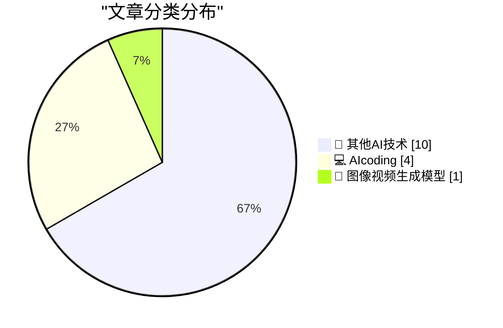
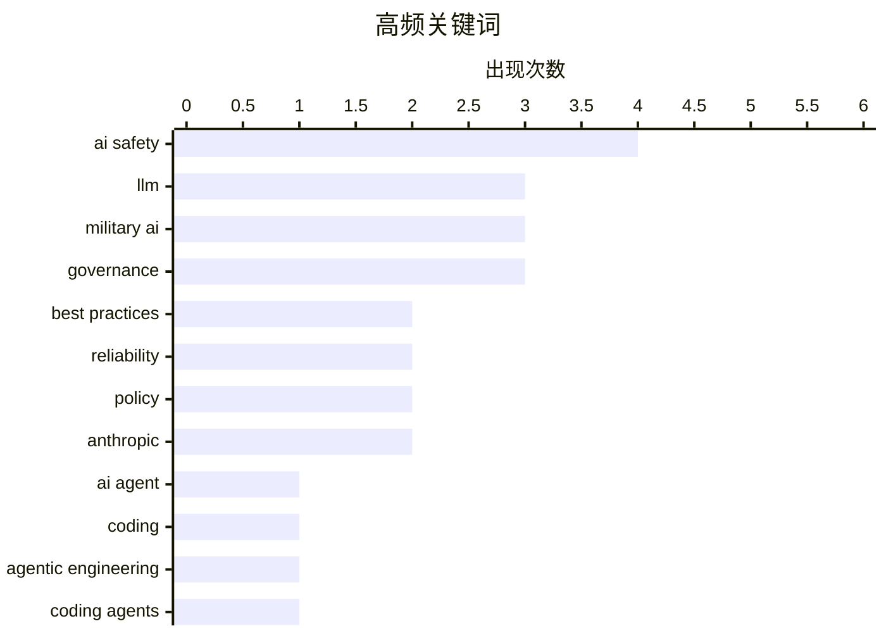

# 📰 AI 博客每日精选 — 2026-02-27

> 来自 5 个技术博客和社交媒体源，AI 精选 Top 15

## 📝 今日看点

今日技术圈聚焦于两大核心议题。一方面，AI编程协作模式正经历剧变，从业者开始系统化构建“个人知识库”以高效驱动智能体，这标志着开发范式的根本性转变。另一方面，关于生成式AI可靠性的讨论升温，业界专家警示其内在不可靠性，反对在关键领域盲目部署，同时头部公司的伦理抉择引发广泛关注。

---

## 🏆 今日必读

🥇 **积累你所知道如何做的事情**

[Hoard things you know how to do](https://simonwillison.net/guides/agentic-engineering-patterns/hoard-things-you-know-how-to-do/#atom-everything) — simonwillison.net · 14 小时前 · 💻 AIcoding

> 文章提出一个提升与编码智能体协作效率的核心建议：系统性地积累你掌握的技术知识与方法。这一建议源于软件工程的核心技能——了解什么是可行的以及如何实现。作者认为，无论是传统编程还是与AI协作，建立一个个人知识库（如代码片段、配置示例、解决特定问题的步骤）都至关重要。这种“积累”行为能让你更高效地指导智能体，并快速验证其输出。最终，这不仅是使用AI的技巧，更是一项能提升整体工程生产力的通用职业建议。

💡 **为什么值得读**: 它提供了一个具体、可操作且超越AI工具本身的效率提升策略，对任何希望系统化个人知识以提升工作产出的开发者都极具价值。

🏷️ AI Agent, Coding, Best Practices

🥈 **（推文）《智能体工程模式》今日章节：积累你所知道如何做的事情**

[Today's chapter of Agentic Engineering Patterns is some good general career advice which happens to also help when working with coding agents: Hoard t...](https://x.com/simonw/status/2027130136987086905) — 𝕏 @simonw · 13 小时前 · 💻 AIcoding

> 这是一条推广《智能体工程模式》指南中“积累你所知道如何做的事情”章节的推文。作者Simon Willison指出，该章节内容本质上是通用的职业建议，但恰好也能极大地帮助与编码智能体协作。推文直接链接到详细的指南文章，旨在引导读者阅读完整内容。

💡 **为什么值得读**: 通过作者本人的社交推荐，可以快速了解该指南的核心价值，并决定是否深入阅读以获取具体方法。

🏷️ Agentic Engineering, Coding Agents, Best Practices

🥉 **（推文）没想到在Gemini 3.1 Flash之前先看到了Gemini 3.1 Flash Image！**

[I didn't think we would get Gemini 3.1 Flash Image before we got Gemini 3.1 Flash!](https://x.com/simonw/status/2027142536872198359) — 𝕏 @simonw · 12 小时前 · 🎨 图像视频生成模型

> 推文表达了作者对Google发布顺序的惊讶：Gemini 3.1 Flash Image模型先于其基础文本模型Gemini 3.1 Flash发布。该模型内部代号为“Nano Banana 2”，专注于图像生成与编辑。新特性包括提供更低成本的新分辨率选项以及图像搜索等工具。用户可通过AI Studio和Gemini API访问此模型。

💡 **为什么值得读**: 第一时间传递了Google Gemini系列模型的重要更新信息，特别是图像生成模型的抢先发布及其新特性，对关注多模态AI进展的开发者有直接参考价值。

🏷️ Gemini, Image Generation, API

4️⃣ **引用安德烈·卡帕西**

[Quoting Andrej Karpathy](https://simonwillison.net/2026/Feb/26/andrej-karpathy/#atom-everything) — simonwillison.net · 15 小时前 · 💻 AIcoding

> 文章引用了AI专家安德烈·卡帕西的观点，强调编程方式在最近两个月（特别是去年12月）发生了剧变。卡帕西认为，编码智能体在12月之前基本不可用，而之后则变得基本可用，这并非通常意义上的渐进式进步。关键转折在于新模型在质量、长期连贯性和韧性上显著提升，使其能够处理大型复杂任务。这一变化标志着AI编程辅助工具实用性的一个分水岭。

💡 **为什么值得读**: 通过顶尖专家的权威论断，清晰指出了AI编程能力发生质变的具体时间点与原因，有助于理解当前技术发展的关键节点。

🏷️ Programming, AI Impact, LLM

5️⃣ **（推文）Gary Marcus：生成式AI并非太聪明，而是太不可靠**

[Another complete misrepresentation of my views by a (prominent) e/acc who doesn’t get my basic point. Gen AI is NOT too smart. It’s too *unreliable*...](https://x.com/GaryMarcus/status/2027127532190040115) — 𝕏 @GaryMarcus · 13 小时前 · 🔬 其他AI技术

> Gary Marcus驳斥了对其观点的误读，澄清他认为生成式AI的主要问题不是过于智能，而是其不可靠性。真正的危险在于将这种不可靠的系统部署在需要高可靠性的领域（如无监督的军事应用）。他同时表明自己认为AGI（通用人工智能）是可能的，只是不认为其迫在眉睫，而当前模型的不可靠性是其核心缺陷。

💡 **为什么值得读**: 直指当前AI热潮中的一个关键争议点（能力 vs. 可靠性），并提出了一个关于AI风险更精确、更值得警惕的视角。

🏷️ AI Safety, Reliability, Debate

---

## 📊 数据概览

| 扫描源 | 抓取文章 | 时间范围 | 精选 |
|:---:|:---:|:---:|:---:|
| 5/5 | 82 篇 → 25 篇 | 24h | **15 篇** |

### 分类分布



### 高频关键词



<details>
<summary>📈 纯文本关键词图（终端友好）</summary>

```
ai safety      │ ████████████████████ 4
llm            │ ███████████████░░░░░ 3
military ai    │ ███████████████░░░░░ 3
governance     │ ███████████████░░░░░ 3
best practices │ ██████████░░░░░░░░░░ 2
reliability    │ ██████████░░░░░░░░░░ 2
policy         │ ██████████░░░░░░░░░░ 2
anthropic      │ ██████████░░░░░░░░░░ 2
ai agent       │ █████░░░░░░░░░░░░░░░ 1
coding         │ █████░░░░░░░░░░░░░░░ 1
```

</details>

### 🏷️ 话题标签

**ai safety**(4) · **llm**(3) · **military ai**(3) · governance(3) · best practices(2) · reliability(2) · policy(2) · anthropic(2) · ai agent(1) · coding(1) · agentic engineering(1) · coding agents(1) · gemini(1) · image generation(1) · api(1) · programming(1) · ai impact(1) · debate(1) · multi-agent(1) · research(1)

---

## 🔬 其他AI技术

### 1. （推文）Gary Marcus：生成式AI并非太聪明，而是太不可靠

[Another complete misrepresentation of my views by a (prominent) e/acc who doesn’t get my basic point. Gen AI is NOT too smart. It’s too *unreliable*...](https://x.com/GaryMarcus/status/2027127532190040115) — **𝕏 @GaryMarcus** · 13 小时前 · ⭐ 14/25

> Gary Marcus驳斥了对其观点的误读，澄清他认为生成式AI的主要问题不是过于智能，而是其不可靠性。真正的危险在于将这种不可靠的系统部署在需要高可靠性的领域（如无监督的军事应用）。他同时表明自己认为AGI（通用人工智能）是可能的，只是不认为其迫在眉睫，而当前模型的不可靠性是其核心缺陷。

🏷️ AI Safety, Reliability, Debate

---

### 2. （推文）Gary Marcus：更多智能体并不自动意味着更聪明的系统

[“More agents does not automatically mean smarter systems. Sometimes it just means louder agreement.” New Stanford/Berkeley paper:](https://x.com/GaryMarcus/status/2027056606958239828) — **𝕏 @GaryMarcus** · 18 小时前 · ⭐ 14/25

> 推文引用了一句核心论断：“更多智能体并不自动意味着更聪明的系统，有时只是意味着更响亮的附和。”这源于一篇新的斯坦福/伯克利论文《复合AI系统中聚合的力量与局限》。该论文从数学上分解了聚合机制，指出盲目遵循“只需添加更多智能体”的策略存在局限，并非总是有效。

🏷️ Multi-Agent, LLM, Research

---

### 3. （推文）Gary Marcus转发：生成式AI不可靠，将其用于生死攸关的操作是错误

[RT Joseph Hurtado - Founder Granata Consulting: "Gen AI is NOT too smart. It’s too *unreliable*. It’s the combination of unreliability and deploymen...](https://x.com/GaryMarcus/status/2027146212487675917) — **𝕏 @GaryMarcus** · 12 小时前 · ⭐ 13/25

> Gary Marcus转发了对其观点的支持性评论。评论者赞同Marcus的观点，即生成式AI的核心问题是不可靠性，将其部署在掌控生死的行动（如军事）中是危险的错误。评论者建议应将其用作需要人工核查的助手，或作为提升人类能力的工具（比喻为“思维摩托车”），而非完全自主的决策者。

🏷️ AI Safety, Reliability, Deployment

---

### 4. （推文）Gary Marcus：美国空军退役将军关于AI的重要评论

[Important comments from Jack Shanahan, a retired US Air Force General who was first Director of the first Department of Defense Joint Artificial Intel...](https://x.com/GaryMarcus/status/2027157316231983380) — **𝕏 @GaryMarcus** · 11 小时前 · ⭐ 11/25

> Gary Marcus强调了一位关键人物——美国空军退役将军、国防部首任联合人工智能中心主任Jack Shanahan——关于AI的评论的重要性。推文暗示该评论内容较长且关键，需要点击查看全文。这通常涉及AI在军事国防等敏感领域的应用、伦理或战略层面的深度分析。

🏷️ Military AI, Policy, Safety

---

### 5. （推文）Gary Marcus：历史性时刻！Anthropic声明拒绝国防部合同

[Historic! I don’t always agree with @DarioAmodei but my hat is off to him for this incredibly brave statement.](https://x.com/GaryMarcus/status/2027158302149452035) — **𝕏 @GaryMarcus** · 11 小时前 · ⭐ 10/25

> Gary Marcus将Anthropic公司CEO Dario Amodei的声明誉为“历史性”和“极其勇敢”。根据引用内容，Anthropic发布了一份正式声明，表明其立场（推文链接标题为“statement-department-of-war”，暗示可能与拒绝参与战争部门项目有关）。尽管Marcus并不总是同意Amodei，但他对此举表示高度赞赏。

🏷️ AI Ethics, Policy, Anthropic

---

### 6. 非技术人才如何为AGI做贡献？OpenAI CEO谈研究招聘

[We often get asked how people who are not technical can contribute to AGI. One area is research recruiting. Tifa (@tifafafafa) is looking for exceptio...](https://x.com/sama/status/2027087700214591913) — **𝕏 @sama** · 16 小时前 · ⭐ 9/25

> OpenAI CEO Sam Altman指出，非技术背景人才可以通过研究招聘为AGI发展做出关键贡献。他特别强调，公司正在寻找来自非传统背景、尤其是前创始人等领域的杰出招聘人员。核心招聘理念是依靠对领域的背景、品味和未来方向的真实感觉来组建团队，目标是找到能推动前沿发展的人，而不仅仅是填补职位空缺。这反映了AGI领域对多元化思维和战略眼光的高度重视。

🏷️ AGI, Recruiting, Team Building

---

### 7. OpenAI总裁Greg Brockman谈使命捍卫与个人成长

[Many times, Greg has shown clear conviction in doing whatever he thought would be important to defend the mission and people of OpenAI, especially whe...](https://x.com/sama/status/2027087128514183553) — **𝕏 @sama** · 16 小时前 · ⭐ 8/25

> OpenAI联合创始人兼总裁Greg Brockman多次展现了捍卫公司使命和员工的坚定信念，尤其是在困难时期。他在访谈中回顾了这些关键时刻，并分享了自己的成长历程。Brockman坦言，在OpenAI的每个阶段，他的工作方式都在不断学习、改变和成长，回头看一年前或五年前的自己，会意识到当时所知甚少。这体现了一位科技领导者在高速发展领域中的持续反思与进化。

🏷️ OpenAI, Leadership, Mission

---

### 8. Gary Marcus：AI关键决策并非由最懂AI的人做出

[Agreed: this decision is NOT being made by the people who best understand AI.](https://x.com/GaryMarcus/status/2027125373755068490) — **𝕏 @GaryMarcus** · 13 小时前 · ⭐ 8/25

> AI专家Gary Marcus赞同一种观点，即当前关于人工智能的关键决策并非由最理解该技术的人做出。他指出，五角大楼和情报机构内部一些最聪明的人多年来一直在警告上级，将不可靠的AI嵌入杀伤链和监控系统是极其愚蠢的行为，但这些警告常被忽视。这揭示了在AI军事化应用中，技术理性与政治决策之间存在严重脱节。

🏷️ AI Policy, Military AI, Governance

---

### 9. Gary Marcus：将不可靠AI嵌入军事系统是“最愚蠢”的行为

[Embedding unreliable AI deep into the source code of the military without human oversight is the single stupidest thing we could do as a species. And ...](https://x.com/GaryMarcus/status/2027121643580211483) — **𝕏 @GaryMarcus** · 13 小时前 · ⭐ 8/25

> AI专家Gary Marcus强烈批评将不可靠的AI深度嵌入军事源代码且缺乏人类监督的做法，称这是人类可能做出的“最愚蠢”的事情。他明确指出，美国正打算这样做。这直接针对AI自主武器系统的发展趋势，强调了在致命性系统中使用尚未解决可靠性问题的AI所带来的生存级风险。

🏷️ Military AI, AI Safety, Governance

---

### 10. Gary Marcus：Anthropic与美国战争部的对峙可能导致生存级灾难

[RT Bulletin of the Atomic Scientists: AI expert @GaryMarcus on why the showdown between Anthropic, a major developer of artificial intelligence models...](https://x.com/GaryMarcus/status/2027120478553559239) — **𝕏 @GaryMarcus** · 14 小时前 · ⭐ 8/25

> AI专家Gary Marcus在《原子科学家公报》上撰文警告，AI模型主要开发商Anthropic与美国战争部之间的对峙，可能导致生存级别的灾难。这场冲突的核心在于先进AI技术的控制权及其在军事领域的应用边界。Marcus认为，这种将强大AI系统与国家级军事力量结合的决定，关乎全人类的生死存亡。

🏷️ AI Safety, Anthropic, Governance

---

## 💻 AIcoding

### 11. 积累你所知道如何做的事情

[Hoard things you know how to do](https://simonwillison.net/guides/agentic-engineering-patterns/hoard-things-you-know-how-to-do/#atom-everything) — **simonwillison.net** · 14 小时前 · ⭐ 21/25

> 文章提出一个提升与编码智能体协作效率的核心建议：系统性地积累你掌握的技术知识与方法。这一建议源于软件工程的核心技能——了解什么是可行的以及如何实现。作者认为，无论是传统编程还是与AI协作，建立一个个人知识库（如代码片段、配置示例、解决特定问题的步骤）都至关重要。这种“积累”行为能让你更高效地指导智能体，并快速验证其输出。最终，这不仅是使用AI的技巧，更是一项能提升整体工程生产力的通用职业建议。

🏷️ AI Agent, Coding, Best Practices

---

### 12. （推文）《智能体工程模式》今日章节：积累你所知道如何做的事情

[Today's chapter of Agentic Engineering Patterns is some good general career advice which happens to also help when working with coding agents: Hoard t...](https://x.com/simonw/status/2027130136987086905) — **𝕏 @simonw** · 13 小时前 · ⭐ 20/25

> 这是一条推广《智能体工程模式》指南中“积累你所知道如何做的事情”章节的推文。作者Simon Willison指出，该章节内容本质上是通用的职业建议，但恰好也能极大地帮助与编码智能体协作。推文直接链接到详细的指南文章，旨在引导读者阅读完整内容。

🏷️ Agentic Engineering, Coding Agents, Best Practices

---

### 13. 引用安德烈·卡帕西

[Quoting Andrej Karpathy](https://simonwillison.net/2026/Feb/26/andrej-karpathy/#atom-everything) — **simonwillison.net** · 15 小时前 · ⭐ 16/25

> 文章引用了AI专家安德烈·卡帕西的观点，强调编程方式在最近两个月（特别是去年12月）发生了剧变。卡帕西认为，编码智能体在12月之前基本不可用，而之后则变得基本可用，这并非通常意义上的渐进式进步。关键转折在于新模型在质量、长期连贯性和韧性上显著提升，使其能够处理大型复杂任务。这一变化标志着AI编程辅助工具实用性的一个分水岭。

🏷️ Programming, AI Impact, LLM

---

### 14. （推文）Sam Altman：感谢并将努力继续赢得你们的代币

[Thank you and will work hard to continue to earn your tokens!](https://x.com/sama/status/2027087689359753483) — **𝕏 @sama** · 16 小时前 · ⭐ 13/25

> 这是Sam Altman对一条用户好评的回应。用户Mitchell Hashimoto称赞Codex 5.3模型比Opus 4.6有效得多，经过反复对比后，他已完全转向使用Codex 5.3一周，这是首个让他放弃使用Opus的模型。Sam Altman以此感谢用户并表达了持续提供价值的决心。

🏷️ Codex, Model Comparison, LLM

---

## 🎨 图像视频生成模型

### 15. （推文）没想到在Gemini 3.1 Flash之前先看到了Gemini 3.1 Flash Image！

[I didn't think we would get Gemini 3.1 Flash Image before we got Gemini 3.1 Flash!](https://x.com/simonw/status/2027142536872198359) — **𝕏 @simonw** · 12 小时前 · ⭐ 18/25

> 推文表达了作者对Google发布顺序的惊讶：Gemini 3.1 Flash Image模型先于其基础文本模型Gemini 3.1 Flash发布。该模型内部代号为“Nano Banana 2”，专注于图像生成与编辑。新特性包括提供更低成本的新分辨率选项以及图像搜索等工具。用户可通过AI Studio和Gemini API访问此模型。

🏷️ Gemini, Image Generation, API

---

*生成于 2026-02-27 10:36 | 扫描 5 源 → 获取 82 篇 → 精选 15 篇*
*基于 [Hacker News Popularity Contest 2025](https://refactoringenglish.com/tools/hn-popularity/) RSS 源列表，由 [Andrej Karpathy](https://x.com/karpathy) 推荐*
*由「懂点儿AI」制作，欢迎关注同名微信公众号获取更多 AI 实用技巧 💡*
