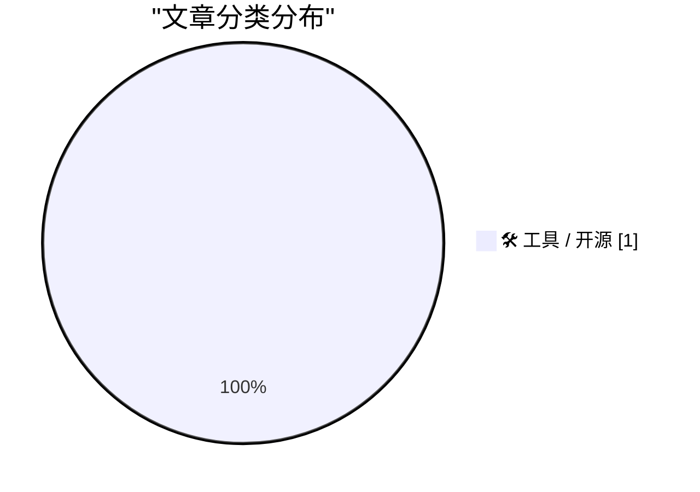
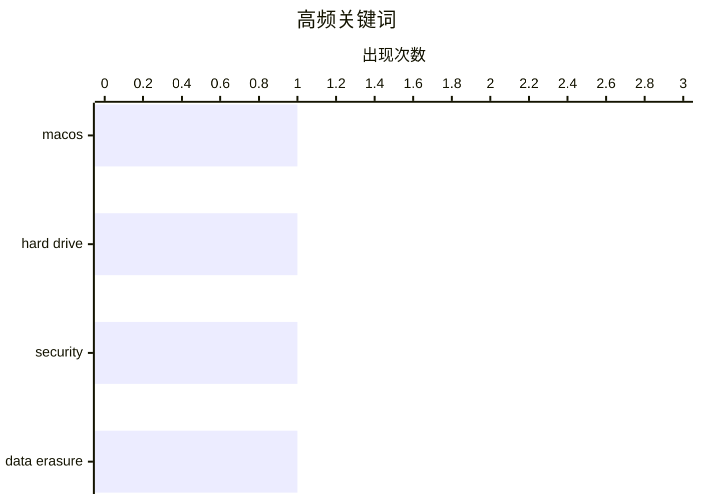

# 📰 AI 博客每日精选 — 2026-02-27

> 来自 3 个技术博客和社交媒体源，AI 精选 Top 1

## 📝 今日看点

今日技术圈聚焦于系统工具演进带来的兼容性挑战与安全实践。一方面，macOS新版本引发的工具链变化，凸显了底层硬件管理与操作系统更新间的磨合问题。另一方面，数据安全议题持续升温，物理存储介质的安全处置成为开发者关注的实用技能。整体来看，在系统快速迭代的背景下，如何保障操作的可靠性与安全性是当下的核心议题。

---

## 📊 数据概览

| 扫描源 | 抓取文章 | 时间范围 | 精选 |
|:---:|:---:|:---:|:---:|
| 3/3 | 52 篇 → 1 篇 | 24h | **1 篇** |

### 分类分布



### 高频关键词



<details>
<summary>📈 纯文本关键词图（终端友好）</summary>

```
macos        │ ████████████████████ 1
hard drive   │ ████████████████████ 1
security     │ ████████████████████ 1
data erasure │ ████████████████████ 1
```

</details>

### 🏷️ 话题标签

**macos**(1) · **hard drive**(1) · **security**(1) · data erasure(1)

---

## 🛠 工具 / 开源

### 1. 如何在 macOS Tahoe 上安全擦除旧硬盘

[How to Securely Erase an old Hard Drive on macOS Tahoe](https://www.jeffgeerling.com/blog/2026/securely-erase-hard-drive-macos-tahoe/) — **jeffgeerling.com** · 12 小时前 · ⭐ 18/30

> 文章核心是解决在 macOS Tahoe 系统中无法对机械硬盘执行安全擦除的问题。作者发现，在 macOS Tahoe 的磁盘工具中，为机械硬盘执行“抹掉”操作时，缺少了以往版本中可选的“安全选项”（如 7 次覆写、35 次覆写等）。这导致用户无法通过图形界面彻底清除硬盘上的敏感数据。作者通过终端命令 `diskutil secureErase` 配合 `freespace` 等级，成功实现了对硬盘剩余空间的多次覆写，从而达到了安全擦除的目的。最终结论是，虽然图形界面功能被移除，但通过命令行工具依然可以完成安全的硬盘数据销毁。

🏷️ macOS, hard drive, security, data erasure

---

*生成于 2026-02-27 08:45 | 扫描 3 源 → 获取 52 篇 → 精选 1 篇*
*基于 [Hacker News Popularity Contest 2025](https://refactoringenglish.com/tools/hn-popularity/) RSS 源列表，由 [Andrej Karpathy](https://x.com/karpathy) 推荐*
*由「懂点儿AI」制作，欢迎关注同名微信公众号获取更多 AI 实用技巧 💡*
