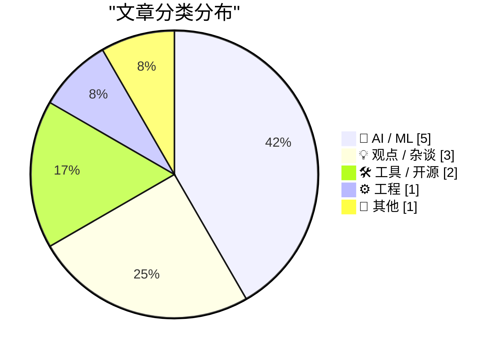
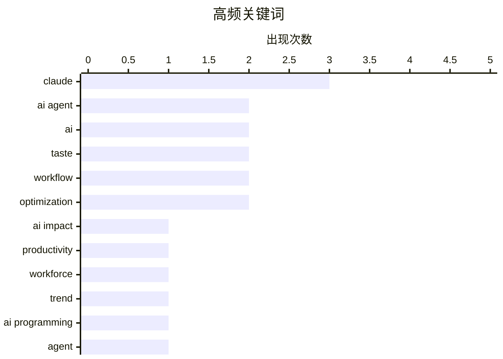

# 📰 AI 博客每日精选 — 2026-02-27

> 来自 2 个技术博客和社交媒体源，AI 精选 Top 12

## 📝 今日看点

今日技术圈的核心焦点在于AI对开发范式的深度重塑。一方面，AI赋能下的“超级个体”与团队精简成为现实趋势，正剧烈冲击传统工作模式；另一方面，行业探索正从基础的“氛围编程”向更系统的AI原生开发方法论演进，规格驱动与记忆管理成为关键课题。与此同时，在AI工具日益普及的背景下，开发者的个人“品味”而非单纯技能，正被确立为新的核心竞争力。

---

## 🏆 今日必读

🥇 **Jack将Block员工从一万裁至六千，AI赋能小团队已成现实趋势**

[Jack 把 Block 从一万人裁到六千人，理由是 AI 让小团队就能干大团队的活。 看到这条的第一反应不是震惊，是"该来的还是来了"。 我自己全职用 AI 搞开发、跑策略...](https://x.com/runes_leo/status/2027239015515140246) — 𝕏 @runes_leo · 4 小时前 · 💡 观点 / 杂谈

> 文章讨论了AI技术导致企业大规模裁员（如Block裁员40%）并重塑工作模式的核心现象。作者基于自身两个月全职使用AI进行开发、策略和内容创作的经验，证实单人借助AI的产出已超过传统小团队。作者预测此类因AI增效而裁员的事件将频繁发生，并建议普通人应立即开始深度使用至少一个AI工具，将其融入工作流程。

💡 **为什么值得读**: 这篇文章提供了来自一线实践者的真实洞察，揭示了AI对组织结构和就业市场的颠覆性影响，对职场人具有紧迫的警示和行动指导意义。

🏷️ AI impact, productivity, workforce, trend

🥈 **斯坦福正式开设“氛围编程”课程《现代软件开发者》，系统化教授AI编程与Agent管理**

[斯坦福把 Vibe Coding 变成了正式课程。 CS146S《The Modern Software Developer》，10 周，从怎么跟 AI 写代码讲到怎么让 AI 自己干活——搭 Agent、管上下文、...](https://x.com/runes_leo/status/2026994655787659581) — 𝕏 @runes_leo · 20 小时前 · 🤖 AI / ML

> 斯坦福大学开设了为期10周的CS146S课程，系统化教授如何利用AI进行软件开发。课程内容涵盖从基础提示工程到构建AI Agent、管理上下文、防范安全漏洞及自动化部署的全流程。课程亮点包括探讨“上下文腐化”（Context Rot）、提示注入攻防以及如何像经理一样指挥AI Agent等前沿议题。需注意课程内容存在对Warp终端工具和Claude生态的明显偏向。

💡 **为什么值得读**: 这门课程标志着顶尖学府对AI编程范式的正式认可，其课程大纲是了解下一代开发者所需核心技能的绝佳路线图。

🏷️ AI Programming, Agent, Education, Vibe Coding

🥉 **超越氛围编程：规格驱动开发（SDD）是AI原生开发的终极形态**

[“如果你还在纯靠 Vibe Coding，那你很快会撞上 Agent 的认知墙。” 很多人迷恋 AI 带来的快节奏，却忽略了代码漂移的代价。其实 SDD (Spec-Driven Development)...](https://x.com/runes_leo/status/2026949357099012548) — 𝕏 @runes_leo · 23 小时前 · 💡 观点 / 杂谈

> 文章指出纯“氛围编程”（Vibe Coding）存在局限性，容易遭遇AI的“认知墙”和代码漂移问题。作者提出规格驱动开发（Spec-Driven Development， SDD）是解决方案，即人类仅负责定义意图（Intent），而将编写计划、对齐规格、维护文档等繁琐工作全部交由AI Agent完成。其核心观点是，将人类从实现细节中解放出来、专注于高层意图，才是真正的AI原生开发模式。

💡 **为什么值得读**: 本文清晰地指出了当前AI辅助编程的进化方向，为希望深度整合AI的开发者提供了一个高阶的架构思路。

🏷️ AI Agent, Spec-Driven Development, Software Engineering

4️⃣ **AI的“品味”是大众平均值，如何将你的个人品味“蒸馏”给AI？**

[AI 模型的"品味"是所有人的平均值。看着像那么回事，但对任何一个具体的人来说，总差那么一点。 这篇文章把这个问题讲的很清楚：品味不是客观标准，是文化共识，...](https://x.com/runes_leo/status/2027302433609625901) — 𝕏 @runes_leo · 20 分钟前 · 🤖 AI / ML

> 文章探讨了通用AI模型输出缺乏个人化“品味”的问题，因为其训练数据反映的是文化共识的平均值。解决路径在于将用户的个人品味通过交互反馈“蒸馏”给AI，例如在使用Cursor/Claude时，每次接受或拒绝代码补全都是一次训练数据标注。核心观点是：手动修改AI的输出并非浪费时间，而是在喂养数据，修改越多，AI越懂你的偏好。

💡 **为什么值得读**: 它提供了一个极具操作性的视角，将日常的AI交互行为重新定义为模型个性化训练的过程，改变了人机协作的认知。

🏷️ AI, personalization, fine-tuning, taste

5️⃣ **开发实战：用Codex审查Claude编写的代码，实现AI间的“交叉验证”**

[同感，但我的用法反过来：写代码的模型永远不负责审自己的代码。 我的日常开发全在 Claude Code 里跑 Opus 4.6。写完一个功能或改完一个 bug，不急着提交，先让 ...](https://x.com/runes_leo/status/2027269214524903892) — 𝕏 @runes_leo · 2 小时前 · 🤖 AI / ML

> 作者分享了一套AI代码审查工作流：在Claude Code中使用Claude Opus 4.6编写代码，但绝不让他审查自己的代码。通过MCP协议集成Codex MCP Server，在终端内一键发起“Codex review”，由另一个AI模型进行独立审查。实践表明，这种交叉审查每次都能发现边界条件、错误处理遗漏等问题，偶尔能抓到逻辑Bug，其成本远低于返工时间。

💡 **为什么值得读**: 这是一个经过实战检验、具体可落地的AI开发最佳实践，直接提升了代码质量和开发效率，极具参考价值。

🏷️ AI coding, code review, workflow, Claude

---

## 📊 数据概览

| 扫描源 | 抓取文章 | 时间范围 | 精选 |
|:---:|:---:|:---:|:---:|
| 2/2 | 39 篇 → 12 篇 | 24h | **12 篇** |

### 分类分布



### 高频关键词



<details>
<summary>📈 纯文本关键词图（终端友好）</summary>

```
claude       │ ████████████████████ 3
ai agent     │ █████████████░░░░░░░ 2
ai           │ █████████████░░░░░░░ 2
taste        │ █████████████░░░░░░░ 2
workflow     │ █████████████░░░░░░░ 2
optimization │ █████████████░░░░░░░ 2
ai impact    │ ███████░░░░░░░░░░░░░ 1
productivity │ ███████░░░░░░░░░░░░░ 1
workforce    │ ███████░░░░░░░░░░░░░ 1
trend        │ ███████░░░░░░░░░░░░░ 1
```

</details>

### 🏷️ 话题标签

**claude**(3) · **ai agent**(2) · **ai**(2) · taste(2) · workflow(2) · optimization(2) · ai impact(1) · productivity(1) · workforce(1) · trend(1) · ai programming(1) · agent(1) · education(1) · vibe coding(1) · spec-driven development(1) · software engineering(1) · personalization(1) · fine-tuning(1) · ai coding(1) · code review(1)

---

## 🤖 AI / ML

### 1. 斯坦福正式开设“氛围编程”课程《现代软件开发者》，系统化教授AI编程与Agent管理

[斯坦福把 Vibe Coding 变成了正式课程。 CS146S《The Modern Software Developer》，10 周，从怎么跟 AI 写代码讲到怎么让 AI 自己干活——搭 Agent、管上下文、...](https://x.com/runes_leo/status/2026994655787659581) — **𝕏 @runes_leo** · 20 小时前 · ⭐ 25/30

> 斯坦福大学开设了为期10周的CS146S课程，系统化教授如何利用AI进行软件开发。课程内容涵盖从基础提示工程到构建AI Agent、管理上下文、防范安全漏洞及自动化部署的全流程。课程亮点包括探讨“上下文腐化”（Context Rot）、提示注入攻防以及如何像经理一样指挥AI Agent等前沿议题。需注意课程内容存在对Warp终端工具和Claude生态的明显偏向。

🏷️ AI Programming, Agent, Education, Vibe Coding

---

### 2. AI的“品味”是大众平均值，如何将你的个人品味“蒸馏”给AI？

[AI 模型的"品味"是所有人的平均值。看着像那么回事，但对任何一个具体的人来说，总差那么一点。 这篇文章把这个问题讲的很清楚：品味不是客观标准，是文化共识，...](https://x.com/runes_leo/status/2027302433609625901) — **𝕏 @runes_leo** · 20 分钟前 · ⭐ 24/30

> 文章探讨了通用AI模型输出缺乏个人化“品味”的问题，因为其训练数据反映的是文化共识的平均值。解决路径在于将用户的个人品味通过交互反馈“蒸馏”给AI，例如在使用Cursor/Claude时，每次接受或拒绝代码补全都是一次训练数据标注。核心观点是：手动修改AI的输出并非浪费时间，而是在喂养数据，修改越多，AI越懂你的偏好。

🏷️ AI, personalization, fine-tuning, taste

---

### 3. 开发实战：用Codex审查Claude编写的代码，实现AI间的“交叉验证”

[同感，但我的用法反过来：写代码的模型永远不负责审自己的代码。 我的日常开发全在 Claude Code 里跑 Opus 4.6。写完一个功能或改完一个 bug，不急着提交，先让 ...](https://x.com/runes_leo/status/2027269214524903892) — **𝕏 @runes_leo** · 2 小时前 · ⭐ 24/30

> 作者分享了一套AI代码审查工作流：在Claude Code中使用Claude Opus 4.6编写代码，但绝不让他审查自己的代码。通过MCP协议集成Codex MCP Server，在终端内一键发起“Codex review”，由另一个AI模型进行独立审查。实践表明，这种交叉审查每次都能发现边界条件、错误处理遗漏等问题，偶尔能抓到逻辑Bug，其成本远低于返工时间。

🏷️ AI coding, code review, workflow, Claude

---

### 4. Karpathy：AI定制软件从10小时到1小时，但目标应是1分钟

[Karpathy 说他花 1 小时让 AI 写了个心跳追踪面板，以前要 10 小时。但他真正想说的是：这件事本该 1 分钟。 差什么？三样东西——AI 要有你的个人上下文，外部...](https://x.com/runes_leo/status/2027256883283997128) — **𝕏 @runes_leo** · 3 小时前 · ⭐ 24/30

> Andrej Karpathy以1小时用AI构建心跳追踪面板（过去需10小时）为例，展望了高度定制化软件的未来。实现“1分钟”目标需要三大支柱：AI拥有个人上下文记忆、外部服务提供AI可调用的API、常用能力封装成可复用的技能模块。作者认为，从10小时到1小时的效率跃升已经发生，从1小时到1分钟只是时间问题。

🏷️ AI agent, MCP, personal context, automation

---

### 5. Claude推出原生“自动记忆”功能：解决了“记不住”，但“记太多”仍需设计

[用了两个月手搓版 auto-memory，现在官方出了原生版。 对普通用户是大升级——不用写任何东西，Claude 自己记住你的偏好和踩过的坑。 但用深了会发现，记住什么...](https://x.com/runes_leo/status/2027220184176763361) — **𝕏 @runes_leo** · 5 小时前 · ⭐ 23/30

> Claude推出了原生auto-memory功能，能自动记住用户的偏好和项目上下文，无需手动编写。但作者根据自身经验指出，真正的挑战不在于“记住”，而在于“记忆管理”：包括何时遗忘、如何按需加载而非全量塞入、以及不同项目间的记忆隔离。此前作者曾因全量加载17KB规则导致上下文窗口被撑满。

🏷️ AI memory, context window, Claude, optimization

---

## 💡 观点 / 杂谈

### 6. Jack将Block员工从一万裁至六千，AI赋能小团队已成现实趋势

[Jack 把 Block 从一万人裁到六千人，理由是 AI 让小团队就能干大团队的活。 看到这条的第一反应不是震惊，是"该来的还是来了"。 我自己全职用 AI 搞开发、跑策略...](https://x.com/runes_leo/status/2027239015515140246) — **𝕏 @runes_leo** · 4 小时前 · ⭐ 27/30

> 文章讨论了AI技术导致企业大规模裁员（如Block裁员40%）并重塑工作模式的核心现象。作者基于自身两个月全职使用AI进行开发、策略和内容创作的经验，证实单人借助AI的产出已超过传统小团队。作者预测此类因AI增效而裁员的事件将频繁发生，并建议普通人应立即开始深度使用至少一个AI工具，将其融入工作流程。

🏷️ AI impact, productivity, workforce, trend

---

### 7. 超越氛围编程：规格驱动开发（SDD）是AI原生开发的终极形态

[“如果你还在纯靠 Vibe Coding，那你很快会撞上 Agent 的认知墙。” 很多人迷恋 AI 带来的快节奏，却忽略了代码漂移的代价。其实 SDD (Spec-Driven Development)...](https://x.com/runes_leo/status/2026949357099012548) — **𝕏 @runes_leo** · 23 小时前 · ⭐ 25/30

> 文章指出纯“氛围编程”（Vibe Coding）存在局限性，容易遭遇AI的“认知墙”和代码漂移问题。作者提出规格驱动开发（Spec-Driven Development， SDD）是解决方案，即人类仅负责定义意图（Intent），而将编写计划、对齐规格、维护文档等繁琐工作全部交由AI Agent完成。其核心观点是，将人类从实现细节中解放出来、专注于高层意图，才是真正的AI原生开发模式。

🏷️ AI Agent, Spec-Driven Development, Software Engineering

---

### 8. Paul Graham：在AI时代，“品味”将成为唯一的护城河

[当所有人都能做任何事，唯一的护城河是 taste — 知道什么值得做。 Taste 不是天赋，是实践的副产品。 做中学 > 想中学。](https://x.com/runes_leo/status/2027103120023806179) — **𝕏 @runes_leo** · 13 小时前 · ⭐ 22/30

> Paul Graham预测，在AI赋能人人皆可创造的时代，关键的差异化能力不再是“能否做”，而是“选择做什么”，即“品味”（Taste）。他强调，品味并非与生俱来的天赋，而是持续实践和“在做中学”的副产品。当技术门槛被AI极大降低后，判断什么值得做的眼光变得至关重要。

🏷️ AI, taste, creativity, differentiation

---

## 🛠 工具 / 开源

### 9. 开源福利：维护者可申请6个月免费Claude Max 20x（价值1200美元）

[开源维护者可以申请 6 个月免费 Claude Max 20x（价值 $1,200）。5000+ stars 优先，但小项目也鼓励申请。 我的 x-reader 上线 5 天 540+ stars，刚提交了申请，...](https://x.com/runes_leo/status/2027235846433505281) — **𝕏 @runes_leo** · 4 小时前 · ⭐ 22/30

> Anthropic为开源维护者和核心贡献者提供了Claude for Open Source计划，赠送价值1200美元的6个月Claude Max 20x免费使用权。虽然拥有5000+ stars的项目会优先考虑，但小型项目也受到鼓励申请。作者以自己的项目（上线5天获540+ stars）为例，已提交申请并呼吁其他开源开发者尝试。

🏷️ Claude, open source, developer tools, funding

---

### 10. 如何在macOS Tahoe上安全擦除旧硬盘

[How to Securely Erase an old Hard Drive on macOS Tahoe](https://www.jeffgeerling.com/blog/2026/securely-erase-hard-drive-macos-tahoe/) — **jeffgeerling.com** · 12 小时前 · ⭐ 15/30

> 文章解决了在最新macOS Tahoe系统中安全擦除传统机械硬盘（HDD）时遇到的困难。作者发现，Disk Utility工具在连接旧iMac硬盘时，移除了关键的“安全选项”按钮，无法执行多遍覆盖的安全擦除。作为解决方案，文章详细介绍了如何使用终端命令`diskutil secureErase`并指定擦除级别（如0、1、2、3、4或7级）来强制完成安全擦除。这表明苹果可能默认现代Mac用户已不再使用机械硬盘，导致相关功能被隐藏或移除。

🏷️ macOS, hard drive, security, data erasure

---

## ⚙️ 工程

### 11. Claude Code深度使用：将CLAUDE.md打造成三层“操作系统”，管理上下文与任务路由

[用 Claude Code 两个多月，http://CLAUDE.md 从一个配置文件长成了一套操作系统。 踩过最痛的坑：rules/ 目录下的文件每次对话全量加载。我往里塞了 17KB 的规则...](https://x.com/runes_leo/status/2027030391643570258) — **𝕏 @runes_leo** · 18 小时前 · ⭐ 24/30

> 作者分享了将Claude Code的配置文件CLAUDE.md演进为一套复杂管理系统的经验。核心教训是需避免全量加载所有规则（曾因加载17KB规则撑爆上下文窗口），应遵循“按需加载”原则。最终设计了三层结构：轻量根配置、自动加载的行为规则、按需加载的重型文档，并在此基础上实现了热数据记忆、任务自动路由、外部工具集成和定期知识同步四大机制。

🏷️ Claude Code, context management, optimization, workflow

---

## 📝 其他

### 12. 预测市场首次公开全量订单簿数据

[预测市场终于有公开的全量 orderbook 数据了。 每小时更新，记录所有市场的每一次挂单变化和成交，30M 行/快照，Parquet 格式免费下载。Polymarket / Kalshi / O...](https://x.com/runes_leo/status/2027163518123032866) — **𝕏 @runes_leo** · 9 小时前 · ⭐ 21/30

> Polymarket、Kalshi、Opinion等主流预测市场的全量订单簿数据现已公开。该数据集每小时更新，以Parquet格式免费提供，每个快照包含约3000万行数据，记录了所有市场的每一次挂单变化和成交。与仅显示成交结果的记录不同，订单簿数据揭示了市场动态背后的原因，是进行策略回测的关键稀缺资源。作者认为，这些数据对于理解市场‘为何发生’特定变化至关重要。

🏷️ prediction markets, data, orderbook, finance

---

*生成于 2026-02-27 08:59 | 扫描 2 源 → 获取 39 篇 → 精选 12 篇*
*基于 [Hacker News Popularity Contest 2025](https://refactoringenglish.com/tools/hn-popularity/) RSS 源列表，由 [Andrej Karpathy](https://x.com/karpathy) 推荐*
*由「懂点儿AI」制作，欢迎关注同名微信公众号获取更多 AI 实用技巧 💡*
