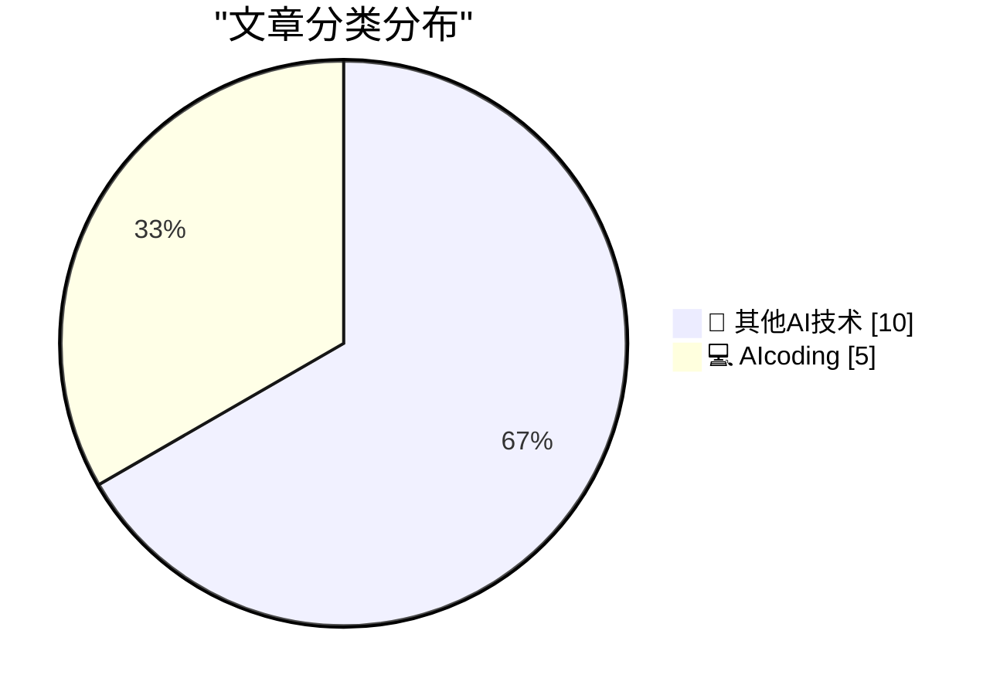
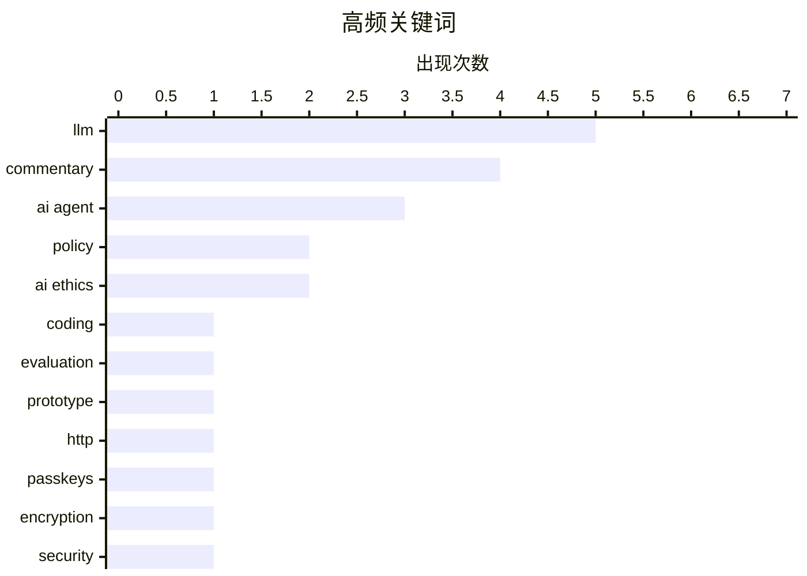

# 📰 AI 博客每日精选 — 2026-02-27

> 来自 5 个技术博客和社交媒体源，AI 精选 Top 15

## 📝 今日看点

今日技术圈聚焦于AI编码范式的深度演进与行业理性反思。一方面，多智能体协作编码正从实验走向实用，寻求人机交互的最优工作流平衡。另一方面，业界权威对AI能力的盲目乐观发出警告，强调其在专业领域的局限性并批判行业短视行为。同时，核心人才的流动与巨头竞争正悄然重塑AI基础设施的格局。

---

## 🏆 今日必读

🥇 **一位AI编码代理怀疑论者的详尽AI代理编码尝试**

[An AI agent coding skeptic tries AI agent coding, in excessive detail](https://simonwillison.net/2026/Feb/27/ai-agent-coding-in-excessive-detail/#atom-everything) — simonwillison.net · 3 小时前 · 💻 AIcoding

> 文章记录了作者Max Woolf从怀疑到实践，逐步尝试AI编码代理完成复杂项目的过程。他从简单的YouTube元数据抓取器开始，逐步挑战更复杂的任务，最终尝试让AI代理完成一个完整的项目移植。整个过程揭示了AI编码代理当前的能力边界和实际应用中的挑战。作者通过亲身实践，为评估AI编码代理的实用性提供了具体、详尽的案例。

💡 **为什么值得读**: 通过一位前怀疑论者的第一手、渐进式实验，为开发者提供了评估AI编码代理真实能力与局限性的宝贵经验，而非空泛的炒作或否定。

🏷️ AI Agent, Coding, Evaluation

🥈 **使用fetch() HTTP范围请求进行二分查找的Unicode探索器**

[Unicode Explorer using binary search over fetch() HTTP range requests](https://simonwillison.net/2026/Feb/27/unicode-explorer/#atom-everything) — simonwillison.net · 6 小时前 · 🔬 其他AI技术

> 作者Simon Willison构建了一个原型工具，用于探索Unicode字符集。该工具的核心技术是利用HTTP范围请求和二分查找算法，高效地从远程文件（如Unicode数据库）中定位特定字符。这个项目是作者对HTTP范围请求技巧系列探索的一部分。它同时展示了如何利用大语言模型来快速满足好奇心并构建功能性原型。

💡 **为什么值得读**: 这是一个巧妙结合HTTP协议特性和算法思维来解决实际问题的极简工程范例，极具启发性。

🏷️ LLM, Prototype, HTTP

🥉 **求求你们，别再使用通行密钥来加密用户数据了**

[Please, please, please stop using passkeys for encrypting user data](https://simonwillison.net/2026/Feb/27/passkeys/#atom-everything) — simonwillison.net · 1 小时前 · 🔬 其他AI技术

> 文章核心是警告开发者不要使用通行密钥来加密用户数据。关键论点是用户频繁丢失通行密钥，且可能意识不到数据因此被不可逆地加密并永久丢失。作者Tim Cappalli向身份认证行业发出强烈呼吁，要求停止推广这种危险做法。结论是通行密钥应专注于其身份验证的本职，而非用于数据加密。

💡 **为什么值得读**: 它指出了一个在推广新安全技术时容易被忽视但后果严重的设计陷阱，对所有涉及用户数据加密的开发者都是重要警示。

🏷️ Passkeys, Encryption, Security

4️⃣ **Andrej Karpathy关于多AI代理协作编码实验的推文**

[I had the same thought so I've been playing with it in nanochat. E.g. here's 8 agents (4 claude, 4 codex), with 1 GPU each running nanochat experiment...](https://x.com/karpathy/status/2027521323275325622) — 𝕏 @karpathy · 46 分钟前 · 💻 AIcoding

> Andrej Karpathy分享了使用nanochat平台进行多AI代理协作编码的实验。他设置了8个代理（4个Claude，4个Codex），尝试让它们协作完成“取消logit softcap而不引发回归”的任务。实验尝试了多种组织模式，如8个独立研究员、1个首席科学家带领8个初级研究员等。结论是目前这种方法效果不佳且混乱，但可视化过程很有趣。

💡 **为什么值得读**: 来自AI领域顶尖专家的第一手多智能体实验报告，直观揭示了当前AI协作编码的现状与挑战。

🏷️ AI Agent, Multi-Agent, Experiment

5️⃣ **Simon Willison关于MLX及Awni Hannun离开苹果的推文**

[MLX is an astoundingly great piece of software which helped make Mac hardware credible as a platform for running LLMs I'm surprised Apple didn't move ...](https://x.com/simonw/status/2027505671005213128) — 𝕏 @simonw · 1 小时前 · 💻 AIcoding

> 这条推文赞扬了MLX软件极大地提升了苹果硬件作为运行大语言模型平台的可信度。推文对苹果未能全力留住MLX核心开发者Awni Hannun表示惊讶。同时引用了Awni Hannun的离职声明，其中提到在苹果芯片上发展AI仍处于早期阶段，并对未来表示期待。

💡 **为什么值得读**: 简短点评揭示了关键开源项目MLX的重要性及其核心人员变动可能对苹果AI生态产生的影响。

🏷️ MLX, LLM, Apple

---

## 📊 数据概览

| 扫描源 | 抓取文章 | 时间范围 | 精选 |
|:---:|:---:|:---:|:---:|
| 5/5 | 77 篇 → 19 篇 | 24h | **15 篇** |

### 分类分布



### 高频关键词



<details>
<summary>📈 纯文本关键词图（终端友好）</summary>

```
llm        │ ████████████████████ 5
commentary │ ████████████████░░░░ 4
ai agent   │ ████████████░░░░░░░░ 3
policy     │ ████████░░░░░░░░░░░░ 2
ai ethics  │ ████████░░░░░░░░░░░░ 2
coding     │ ████░░░░░░░░░░░░░░░░ 1
evaluation │ ████░░░░░░░░░░░░░░░░ 1
prototype  │ ████░░░░░░░░░░░░░░░░ 1
http       │ ████░░░░░░░░░░░░░░░░ 1
passkeys   │ ████░░░░░░░░░░░░░░░░ 1
```

</details>

### 🏷️ 话题标签

**llm**(5) · **commentary**(4) · **ai agent**(3) · policy(2) · ai ethics(2) · coding(1) · evaluation(1) · prototype(1) · http(1) · passkeys(1) · encryption(1) · security(1) · multi-agent(1) · experiment(1) · mlx(1) · apple(1) · cursor(1) · workflow(1) · claude(1) · open source(1)

---

## 🔬 其他AI技术

### 1. 使用fetch() HTTP范围请求进行二分查找的Unicode探索器

[Unicode Explorer using binary search over fetch() HTTP range requests](https://simonwillison.net/2026/Feb/27/unicode-explorer/#atom-everything) — **simonwillison.net** · 6 小时前 · ⭐ 22/25

> 作者Simon Willison构建了一个原型工具，用于探索Unicode字符集。该工具的核心技术是利用HTTP范围请求和二分查找算法，高效地从远程文件（如Unicode数据库）中定位特定字符。这个项目是作者对HTTP范围请求技巧系列探索的一部分。它同时展示了如何利用大语言模型来快速满足好奇心并构建功能性原型。

🏷️ LLM, Prototype, HTTP

---

### 2. 求求你们，别再使用通行密钥来加密用户数据了

[Please, please, please stop using passkeys for encrypting user data](https://simonwillison.net/2026/Feb/27/passkeys/#atom-everything) — **simonwillison.net** · 1 小时前 · ⭐ 21/25

> 文章核心是警告开发者不要使用通行密钥来加密用户数据。关键论点是用户频繁丢失通行密钥，且可能意识不到数据因此被不可逆地加密并永久丢失。作者Tim Cappalli向身份认证行业发出强烈呼吁，要求停止推广这种危险做法。结论是通行密钥应专注于其身份验证的本职，而非用于数据加密。

🏷️ Passkeys, Encryption, Security

---

### 3. Gary Marcus转推Sam Altman为Anthropic辩护的新闻

[Sam is not my hero but I am really glad to see this.](https://x.com/GaryMarcus/status/2027423374193144039) — **𝕏 @GaryMarcus** · 7 小时前 · ⭐ 10/25

> Gary Marcus转发了关于OpenAI CEO Sam Altman为竞争对手Anthropic辩护的新闻。Altman公开反对特朗普政府威胁使用《国防生产法》来针对AI公司。Marcus虽称Altman并非其偶像，但对此举表示赞同。这反映了AI行业领袖在面对可能损害行业整体的外部监管威胁时，展现出的罕见团结。

🏷️ Policy, Regulation, Industry

---

### 4. Gary Marcus转推关于LLM在药物发现中局限性的观点

[“LLMs are ‘not particularly good’ at the kind of biology necessary to develop therapies” See also my pinned tweet.](https://x.com/GaryMarcus/status/2027415453237469406) — **𝕏 @GaryMarcus** · 7 小时前 · ⭐ 10/25

> Gary Marcus转发了对礼来公司CEO Dave Ricks的采访，其中指出当前的大语言模型在药物发现所需的生物学领域“并不特别擅长”。这直接反驳了“AI将治愈癌症”等过于乐观的泛化宣传。Marcus借此强调需要更具体、更严谨地评估AI在科学领域的实际能力，而非盲目炒作。

🏷️ LLM, Limitations, Biology

---

### 5. Gary Marcus呼吁大家短暂停止愚蠢行为的推文

[Could we just have like an hour where nobody did anything really stupid? Just an hour? Please?](https://x.com/GaryMarcus/status/2027518399061102727) — **𝕏 @GaryMarcus** · 57 分钟前 · ⭐ 9/25

> 这是一条充满讽刺和无奈情绪的推文。Gary Marcus恳求能否有一个小时的时间，没有人做出任何真正愚蠢的事情。它没有指向具体事件，而是对当前（可能指AI领域或更广范围）频繁出现的非理性、短视或荒谬行为的一种概括性吐槽。反映了观察者对周遭环境一种普遍的疲惫感。

🏷️ Commentary, AI Ethics

---

### 6. 特朗普是否操之过急？未来几天我们将深入了解硅谷

[Did Trump just overplay his hand? We will learn a LOT about Silicon Valley in the coming days.](https://x.com/GaryMarcus/status/2027495508177260875) — **𝕏 @GaryMarcus** · 2 小时前 · ⭐ 9/25

> 文章核心是讨论前总统特朗普的言论或行动可能对硅谷产生的冲击。作者Gary Marcus暗示，特朗普的举动可能引发了硅谷内部价值观与商业利益之间的潜在冲突。未来几天硅谷主要公司（如Anthropic、OpenAI）的公开回应与立场选择，将成为观察其原则底线的关键窗口。结论是，这一事件将成为检验硅 Valley 核心立场与韧性的试金石。

🏷️ Politics, Silicon Valley, Commentary

---

### 7. Ilya Sutskever：Anthropic 坚守立场与 OpenAI 采取相似姿态意义重大

[RT Ilya Sutskever: It’s extremely good that Anthropic has not backed down, and it’s siginficant that OpenAI has taken a similar stance. In the futur...](https://x.com/GaryMarcus/status/2027495587642544634) — **𝕏 @GaryMarcus** · 3 小时前 · ⭐ 9/25

> 主题是AI行业领军公司在面临外部压力时保持一致立场的重要性。OpenAI联合创始人Ilya Sutskever赞扬了Anthropic没有妥协，并指出OpenAI也采取了相似立场。他认为未来会出现更多此类挑战，竞争对手搁置分歧、领导者挺身而出至关重要。其核心观点是，行业团结与原则性立场对于应对未来的复杂局面具有关键意义。

🏷️ AI Ethics, Policy, Commentary

---

### 8. 令人惊讶：即便是特朗普政府也对Grok存疑

[Wow. Even the Trump administration has doubts about Grok.](https://x.com/GaryMarcus/status/2027449815706308984) — **𝕏 @GaryMarcus** · 5 小时前 · ⭐ 9/25

> 文章指出，连特朗普政府内部都意识到埃隆·马斯克旗下xAI开发的AI聊天机器人Grok存在严重的偏见问题。引用Jon Favreau的评论，称Grok为“有偏见的垃圾”，并附有相关截图作为证据。这暴露了Grok在政治立场或事实准确性上可能存在设计缺陷或训练数据问题。结论是，Grok的客观性已受到跨政治光谱的质疑。

🏷️ Grok, Bias, Commentary

---

### 9. 华尔街资深人士：Sam Altman 史上最大规模融资近乎犯罪

[RT George Noble: In 45 years on Wall Street, I've never seen anything like this. Sam Altman just convinced 3 of the world's smartest investors to fund...](https://x.com/GaryMarcus/status/2027452485015863701) — **𝕏 @GaryMarcus** · 6 小时前 · ⭐ 9/25

> 文章转述了华尔街资深人士George Noble对OpenAI最新巨额融资的尖锐批评。他指出，Sam Altman从亚马逊、英伟达、软银等顶级投资者那里获得了110亿美元的历史性私人融资，但公司却零利润可见。Noble认为这种在毫无盈利路径下进行的超大规模融资是“近乎犯罪”的，并警告投资者需要理解其风险。核心观点是，这笔融资脱离了传统投资逻辑，泡沫风险极高。

🏷️ Investment, Business, LLM

---

### 10. 请有艺术技能的人根据新数据更新左侧插图

[Can someone with artistic skills please update the illustration on the left to reflect the new data on the right?](https://x.com/GaryMarcus/status/2027410095555162181) — **𝕏 @GaryMarcus** · 8 小时前 · ⭐ 9/25

> Gary Marcus发布了两张对比图，左侧是一张概念性插图，右侧则是新的数据图表。他请求网友用艺术技能更新左侧插图以反映右侧的新数据。这暗示右侧数据可能揭示了与左侧旧有认知或表述不符的新情况（例如AI能力评估、市场数据等）。其核心意图是通过视觉化对比，突出新数据带来的认知冲击或对旧范式的颠覆。

🏷️ Data, Visualization, AI

---

## 💻 AIcoding

### 11. 一位AI编码代理怀疑论者的详尽AI代理编码尝试

[An AI agent coding skeptic tries AI agent coding, in excessive detail](https://simonwillison.net/2026/Feb/27/ai-agent-coding-in-excessive-detail/#atom-everything) — **simonwillison.net** · 3 小时前 · ⭐ 24/25

> 文章记录了作者Max Woolf从怀疑到实践，逐步尝试AI编码代理完成复杂项目的过程。他从简单的YouTube元数据抓取器开始，逐步挑战更复杂的任务，最终尝试让AI代理完成一个完整的项目移植。整个过程揭示了AI编码代理当前的能力边界和实际应用中的挑战。作者通过亲身实践，为评估AI编码代理的实用性提供了具体、详尽的案例。

🏷️ AI Agent, Coding, Evaluation

---

### 12. Andrej Karpathy关于多AI代理协作编码实验的推文

[I had the same thought so I've been playing with it in nanochat. E.g. here's 8 agents (4 claude, 4 codex), with 1 GPU each running nanochat experiment...](https://x.com/karpathy/status/2027521323275325622) — **𝕏 @karpathy** · 46 分钟前 · ⭐ 19/25

> Andrej Karpathy分享了使用nanochat平台进行多AI代理协作编码的实验。他设置了8个代理（4个Claude，4个Codex），尝试让它们协作完成“取消logit softcap而不引发回归”的任务。实验尝试了多种组织模式，如8个独立研究员、1个首席科学家带领8个初级研究员等。结论是目前这种方法效果不佳且混乱，但可视化过程很有趣。

🏷️ AI Agent, Multi-Agent, Experiment

---

### 13. Simon Willison关于MLX及Awni Hannun离开苹果的推文

[MLX is an astoundingly great piece of software which helped make Mac hardware credible as a platform for running LLMs I'm surprised Apple didn't move ...](https://x.com/simonw/status/2027505671005213128) — **𝕏 @simonw** · 1 小时前 · ⭐ 19/25

> 这条推文赞扬了MLX软件极大地提升了苹果硬件作为运行大语言模型平台的可信度。推文对苹果未能全力留住MLX核心开发者Awni Hannun表示惊讶。同时引用了Awni Hannun的离职声明，其中提到在苹果芯片上发展AI仍处于早期阶段，并对未来表示期待。

🏷️ MLX, LLM, Apple

---

### 14. Andrej Karpathy分享Cursor中Tab补全与代理请求比率的推文

[Cool chart showing the ratio of Tab complete requests to Agent requests in Cursor. With improving capability, every point in time has an optimal setup...](https://x.com/karpathy/status/2027501331125239822) — **𝕏 @karpathy** · 2 小时前 · ⭐ 18/25

> 推文展示了一张图表，揭示了代码编辑器Cursor中Tab补全请求与AI代理请求的比率变化。核心观点是随着AI能力提升，存在一个不断演进的最优工作流程平衡点（从无到Tab补全，到代理，再到并行代理和代理团队）。过于保守会浪费潜力，过于激进则制造混乱而非创造价值。流程的艺术在于将80%的精力用于找到这个平衡点。

🏷️ AI Agent, Cursor, Workflow

---

### 15. 面向（大型项目）开源维护者的免费Claude Max

[Free Claude Max for (large project) open source maintainers](https://simonwillison.net/2026/Feb/27/claude-max-oss-six-months/#atom-everything) — **simonwillison.net** · 5 小时前 · ⭐ 13/25

> Anthropic公司为大型开源项目的维护者提供为期6个月的免费Claude Max（20倍上下文）高级计划。申请者需是GitHub星标超5000或NPM月下载量超100万的公共代码库的主要维护者或核心团队成员。该计划旨在支持开源社区的关键贡献者。这是一个限时、有条件的高价值资源支持计划。

🏷️ Claude, Open Source, LLM

---

*生成于 2026-02-27 23:55 | 扫描 5 源 → 获取 77 篇 → 精选 15 篇*
*基于 [Hacker News Popularity Contest 2025](https://refactoringenglish.com/tools/hn-popularity/) RSS 源列表，由 [Andrej Karpathy](https://x.com/karpathy) 推荐*
*由「懂点儿AI」制作，欢迎关注同名微信公众号获取更多 AI 实用技巧 💡*
