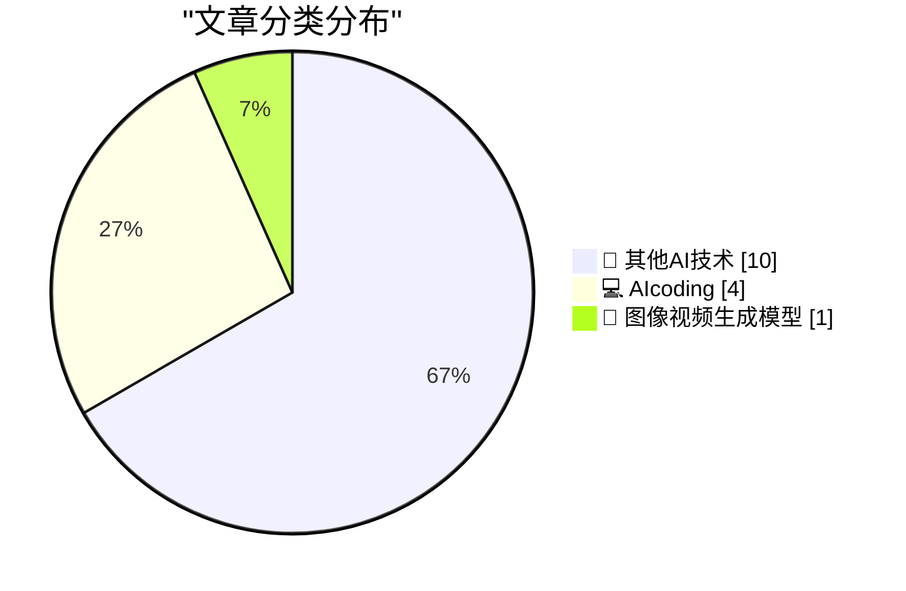
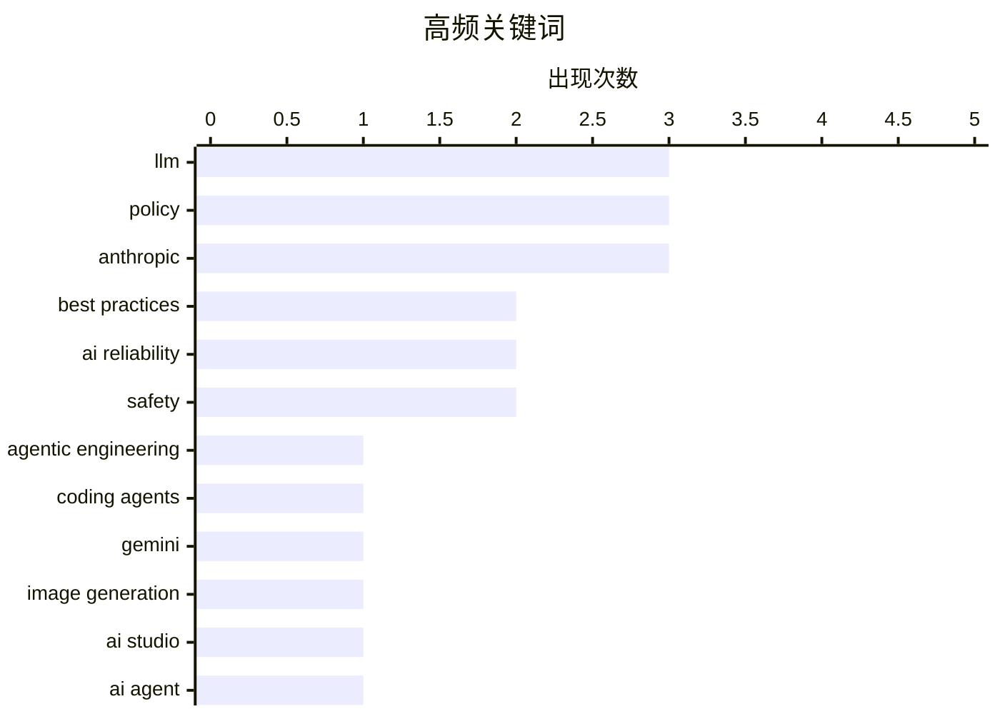

# 📰 AI 博客每日精选 — 2026-02-27

> 来自 5 个技术博客和社交媒体源，AI 精选 Top 15

## 📝 今日看点

今日技术圈聚焦于AI编程范式的革命性转变与业界对AI能力的冷思考。一方面，编码智能体效能取得突破性进展，正从根本上重塑软件开发的工作模式。另一方面，产业领袖与学者则警示当前AI在专业领域的局限性及其不可靠性带来的实际风险，为过热预期注入理性视角。同时，大模型军备竞赛持续，但基础设施供应商的股价波动也折射出市场对激进扩张的担忧。

---

## 🏆 今日必读

🥇 **囤积你擅长做的事情**

[Today's chapter of Agentic Engineering Patterns is some good general career advice which happens to also help when working with coding agents: Hoard t...](https://x.com/simonw/status/2027130136987086905) — 𝕏 @simonw · 20 小时前 · 💻 AIcoding

> 文章源自《智能体工程模式》系列，核心是分享一条对软件工程师和AI编程智能体都适用的高效工作建议。关键论点是，软件构建技能的核心在于了解什么是可行的、什么是不可行的，并对如何实现有大致概念。作者建议系统地“囤积”你已掌握的具体任务解决方案，这不仅能提升个人效率，在与编码智能体协作时，也能更精准地评估其建议的可行性并下达有效指令。结论是，这种知识积累是提升人机协作生产力的基础。

💡 **为什么值得读**: 该建议将传统工程智慧与AI时代的新工作流相结合，为开发者如何系统化积累知识、从而更高效地驾驭AI编码助手提供了具体且可操作的思路。

🏷️ Agentic Engineering, Coding Agents, Best Practices

🥈 **Gemini 3.1 Flash Image 模型意外抢先发布**

[I didn't think we would get Gemini 3.1 Flash Image before we got Gemini 3.1 Flash!](https://x.com/simonw/status/2027142536872198359) — 𝕏 @simonw · 19 小时前 · 🎨 图像视频生成模型

> 文章报道了谷歌意外地先于 Gemini 3.1 Flash 文本模型发布了其图像生成与编辑模型 Gemini 3.1 Flash Image（内部代号 Nano Banana 2）。该模型被宣称为目前最佳的图像生成和编辑模型，可通过 AI Studio 和 Gemini API 访问。同时，谷歌还引入了新的分辨率选项（以降低成本）以及图像搜索等工具。这表明谷歌在推进多模态AI能力方面采取了快速且灵活的发布策略。

💡 **为什么值得读**: 了解谷歌在多模态AI竞赛中的最新产品动态和战略布局，对关注图像生成AI和Gemini生态的开发者及研究者具有即时参考价值。

🏷️ Gemini, Image Generation, AI Studio

🥉 **囤积你擅长做的事情**

[Hoard things you know how to do](https://simonwillison.net/guides/agentic-engineering-patterns/hoard-things-you-know-how-to-do/#atom-everything) — simonwillison.net · 20 小时前 · 💻 AIcoding

> 这是对Index 0推文所链接文章的详细阐述，核心是提出一条提升与编码智能体协作效率的关键原则。作者认为，许多与智能体高效协作的技巧，本质上是成功软件工程经验的延伸。具体建议是主动“囤积”你已知如何完成的任务知识库，因为软件技能的关键在于理解可能性的边界。这种知识储备能帮助开发者更准确地判断智能体建议的可行性，并给出更清晰的指令。最终，这能显著提升人机协作的产出质量和速度。

💡 **为什么值得读**: 文章深入阐释了在AI辅助编程时代，开发者应如何转换思维、系统化积累知识以保持核心竞争力，观点深刻且具实践指导性。

🏷️ AI Agent, Coding, Best Practices

4️⃣ **引用安德烈·卡帕西的观点：编程在去年12月发生剧变**

[Quoting Andrej Karpathy](https://simonwillison.net/2026/Feb/26/andrej-karpathy/#atom-everything) — simonwillison.net · 22 小时前 · 💻 AIcoding

> 文章引用了AI专家安德烈·卡帕西的观点，指出编程领域在最近两个月（尤其是去年12月）发生了非渐进式的剧变。卡帕西认为，在此之前编码智能体基本不可用，而自此之后则基本可用了，关键在于模型质量、长期连贯性和持久性得到了显著提升。这些改进使得AI智能体能够处理大型复杂任务。这一观点强调了AI编程能力在短期内取得的突破性进展，而非缓慢的线性进步。

💡 **为什么值得读**: 通过顶尖AI研究者的权威观察，快速把握当前AI编程能力突变的临界点，对于评估开发现状和未来趋势至关重要。

🏷️ Programming, AI Impact, LLM

5️⃣ **Codex 5.3 模型表现超越 Opus 4.6**

[Thank you and will work hard to continue to earn your tokens!](https://x.com/sama/status/2027087689359753483) — 𝕏 @sama · 23 小时前 · 💻 AIcoding

> 文章转述了Mitchell Hashimoto的评测，指出Codex 5.3模型在效能上已显著超越Opus 4.6。评测者经过反复对比后，已完全转向使用Codex 5.3长达一周，这是首个让他放弃使用Opus的模型。OpenAI CEO Sam Altman对此回应表示感谢，并将继续努力。这反映了大型语言模型（LLM）在代码生成领域竞争激烈，性能排名可能正在快速洗牌。

💡 **为什么值得读**: 为开发者选择高效的代码生成AI工具提供了来自资深用户的一手性能对比信息，具有直接的选型参考意义。

🏷️ Codex, Model Comparison, LLM

---

## 📊 数据概览

| 扫描源 | 抓取文章 | 时间范围 | 精选 |
|:---:|:---:|:---:|:---:|
| 5/5 | 77 篇 → 24 篇 | 24h | **15 篇** |

### 分类分布



### 高频关键词



<details>
<summary>📈 纯文本关键词图（终端友好）</summary>

```
llm                 │ ████████████████████ 3
policy              │ ████████████████████ 3
anthropic           │ ████████████████████ 3
best practices      │ █████████████░░░░░░░ 2
ai reliability      │ █████████████░░░░░░░ 2
safety              │ █████████████░░░░░░░ 2
agentic engineering │ ███████░░░░░░░░░░░░░ 1
coding agents       │ ███████░░░░░░░░░░░░░ 1
gemini              │ ███████░░░░░░░░░░░░░ 1
image generation    │ ███████░░░░░░░░░░░░░ 1
```

</details>

### 🏷️ 话题标签

**llm**(3) · **policy**(3) · **anthropic**(3) · best practices(2) · ai reliability(2) · safety(2) · agentic engineering(1) · coding agents(1) · gemini(1) · image generation(1) · ai studio(1) · ai agent(1) · coding(1) · programming(1) · ai impact(1) · codex(1) · model comparison(1) · biology(1) · limitations(1) · coreweave(1)

---

## 🔬 其他AI技术

### 1. 礼来CEO：当前LLM在药物研发所需的生物学领域“并不擅长”

[“LLMs are ‘not particularly good’ at the kind of biology necessary to develop therapies” See also my pinned tweet.](https://x.com/GaryMarcus/status/2027415453237469406) — **𝕏 @GaryMarcus** · 1 小时前 · ⭐ 14/25

> 文章针对“AI将治愈癌症”的流行说法，提供了来自产业界的冷静评估。礼来公司CEO Dave Ricks指出，当前的大语言模型在开发疗法所必需的那种生物学研究上“并不特别擅长”。这回应了AI界普遍缺乏具体细节的乐观预测。观点认为，LLM在生物医学这种需要高度精确和深度专业知识的复杂领域，其实际效用可能被高估了。

🏷️ LLM, Biology, Limitations

---

### 2. CoreWeave股价暴跌的原因分析

[Why CoreWeave is tanking.](https://x.com/GaryMarcus/status/2027407137811693874) — **𝕏 @GaryMarcus** · 1 小时前 · ⭐ 13/25

> 文章分析了GPU云服务商CoreWeave股价暴跌的潜在原因。核心观点指出，CoreWeave在2025年第四季度筹集的所有资金主要用于购买GPU。其特殊目的载体（SPV）的整个目的就是通过举债和融资来购买GPU，这帮助英伟达膨胀了需求，同时使得CoreWeave高管和投资方Magnetar能够尽快套现。这暗示其商业模式可能高度依赖于资本运作和硬件囤积，而非稳定的服务营收，引发了市场担忧。

🏷️ CoreWeave, GPU, Infrastructure

---

### 3. 请求根据新数据更新左侧示意图

[Can someone with artistic skills please update the illustration on the left to reflect the new data on the right?](https://x.com/GaryMarcus/status/2027410095555162181) — **𝕏 @GaryMarcus** · 1 小时前 · ⭐ 12/25

> 这是一条带有讽刺意味的推文，作者Gary Marcus展示了两张对比图。左侧是一张将“AI进展”描绘为持续指数级增长的经典示意图。右侧则是一张真实数据图，暗示AI的实际进展可能并非如此平滑和乐观。作者请求有艺术技能的人用新数据更新旧示意图，意在讽刺AI领域宣传与实际情况可能存在的脱节，以及人们对技术发展曲线过于简单化的描绘。

🏷️ Data Visualization, AI Progress, Chart

---

### 4. 转发：生成式AI的危险在于其不可靠性，而非过于智能

[RT Joseph Hurtado - Founder Granata Consulting: "Gen AI is NOT too smart. It’s too *unreliable*. It’s the combination of unreliability and deploymen...](https://x.com/GaryMarcus/status/2027146212487675917) — **𝕏 @GaryMarcus** · 19 小时前 · ⭐ 12/25

> 文章转发了Joseph Hurtado的观点，并赞同Gary Marcus的立场。核心论点是：生成式AI的危险性并非源于它“太聪明”，而在于其“不可靠性”。真正的风险在于将这种不可靠的系统部署在它本不该被部署的领域（例如没有监督的军事应用），并让其掌管生死操作。正确的使用方式应是将其作为需要人工核查的助手，或作为人类智慧的“增强工具”（摩托车比喻），而非完全自主的决策者。

🏷️ AI Reliability, Safety, Deployment

---

### 5. Gary Marcus澄清：生成式AI的核心问题是不可靠性

[Another complete misrepresentation of my views by a (prominent) e/acc who doesn’t get my basic point. Gen AI is NOT too smart. It’s too *unreliable*...](https://x.com/GaryMarcus/status/2027127532190040115) — **𝕏 @GaryMarcus** · 20 小时前 · ⭐ 12/25

> 这是Gary Marcus对自身观点的直接澄清，反驳了某些有效加速主义者（e/acc）对其的误解。他重申，生成式AI的主要问题不是“过于智能”，而是其固有的“不可靠性”。危险源于将这种不可靠的系统部署在需要极高可靠性的领域（如无监督的军事应用）。他同时澄清自己认为AGI是可能的，但怀疑其即将来临，而不可靠性是目前模型固有的、独立于AGI时间表的问题。

🏷️ AI Reliability, Safety, Debate

---

### 6. 将不可靠的AI深度嵌入军事源代码且无人监督，是我们这个物种能做的最愚蠢的事

[Embedding unreliable AI deep into the source code of the military without human oversight is the single stupidest thing we could do as a species. And ...](https://x.com/GaryMarcus/status/2027121643580211483) — **𝕏 @GaryMarcus** · 20 小时前 · ⭐ 12/25

> Gary Marcus强烈反对美国军方计划将不可靠的人工智能深度集成到军事系统的源代码中，并完全排除人类监督。他认为，这种做法将AI的决策权置于关键的国家安全系统核心，而当前AI技术存在不可预测的“幻觉”和错误风险。这被其称为“人类可能做出的最愚蠢的单一决定”，并指出美国正打算这么做。核心观点是，在缺乏可靠安全保障的情况下，赋予AI军事自主权将带来灾难性风险。

🏷️ AI Safety, Military, Oversight

---

### 7. AI专家Gary Marcus：Anthropic与美国战争部的对峙可能导致生存级灾难

[RT Bulletin of the Atomic Scientists: AI expert @GaryMarcus on why the showdown between Anthropic, a major developer of artificial intelligence models...](https://x.com/GaryMarcus/status/2027120478553559239) — **𝕏 @GaryMarcus** · 21 小时前 · ⭐ 11/25

> 文章核心是分析AI公司Anthropic与美国国防部（文中称“战争部”）之间的潜在冲突及其严重后果。Gary Marcus警告，这场对峙可能引发“生存级别的灾难”。冲突的根源在于政府可能动用《国防生产法》等强制手段，迫使AI公司将其前沿模型用于军事目的。作者认为，将尚未解决安全与可靠性问题的强大AI模型整合进军事指挥系统，可能带来不可控的、威胁全人类的极端风险。

🏷️ AI Risk, Policy, Anthropic

---

### 8. Sam Altman：非技术背景者如何为AGI做出贡献——以研究招聘为例

[We often get asked how people who are not technical can contribute to AGI. One area is research recruiting. Tifa (@tifafafafa) is looking for exceptio...](https://x.com/sama/status/2027087700214591913) — **𝕏 @sama** · 23 小时前 · ⭐ 10/25

> OpenAI CEO Sam Altman指出，非技术背景的人才同样能为通用人工智能（AGI）的发展做出关键贡献，并以研究招聘为例。他提到招聘负责人Tifa正在寻找来自非传统背景、尤其是前创始人的杰出招聘人员。OpenAI认为，最好的研究团队建设依赖于对领域的“背景、品味和未来方向的真实感觉”，招聘目标是找到能推动边界前进的人，而不仅仅是填补职位。这表明在AGI研发中，战略眼光和人才鉴别能力与技术能力同等重要。

🏷️ AGI, Recruiting, Team Building

---

### 9. Gary Marcus：Sam Altman并非我的英雄，但我很高兴看到他此举

[Sam is not my hero but I am really glad to see this.](https://x.com/GaryMarcus/status/2027423374193144039) — **𝕏 @GaryMarcus** · 46 分钟前 · ⭐ 10/25

> Gary Marcus转发了Sam Altman公开为Anthropic辩护的消息，并对此表示赞赏。Altman针对特朗普政府威胁动用《国防生产法》来对付AI公司的报道，明确表态反对 Pentagon（五角大楼）使用该法案威胁这些公司。Altman的“打破阵营”行为，意味着在面临政府过度干预的压力时，AI行业领袖开始展现出一致的立场来维护行业自主性与安全伦理。Marcus的评论凸显了在重大原则问题上，超越个人分歧达成共识的重要性。

🏷️ Policy, AI Regulation, Anthropic

---

### 10. Gary Marcus：历史性时刻！虽不总同意Dario Amodei，但为他勇敢的声明脱帽致敬

[Historic! I don’t always agree with @DarioAmodei but my hat is off to him for this incredibly brave statement.](https://x.com/GaryMarcus/status/2027158302149452035) — **𝕏 @GaryMarcus** · 18 小时前 · ⭐ 10/25

> Gary Marcus对Anthropic CEO Dario Amodei的一份声明给予了极高评价，称之为“历史性的”和“极其勇敢的”。该声明直接针对美国“战争部”（即国防部），内容尚未详述，但结合上下文，很可能涉及Anthropic拒绝将其AI技术用于不符合其安全伦理准则的军事用途。Marcus的赞扬表明，这份声明在抵抗政府压力、坚守AI安全原则方面具有里程碑意义。这标志着AI公司开始在国家安全与企业伦理的冲突中采取明确且坚定的立场。

🏷️ AI Ethics, Policy, Anthropic

---

## 💻 AIcoding

### 11. 囤积你擅长做的事情

[Today's chapter of Agentic Engineering Patterns is some good general career advice which happens to also help when working with coding agents: Hoard t...](https://x.com/simonw/status/2027130136987086905) — **𝕏 @simonw** · 20 小时前 · ⭐ 22/25

> 文章源自《智能体工程模式》系列，核心是分享一条对软件工程师和AI编程智能体都适用的高效工作建议。关键论点是，软件构建技能的核心在于了解什么是可行的、什么是不可行的，并对如何实现有大致概念。作者建议系统地“囤积”你已掌握的具体任务解决方案，这不仅能提升个人效率，在与编码智能体协作时，也能更精准地评估其建议的可行性并下达有效指令。结论是，这种知识积累是提升人机协作生产力的基础。

🏷️ Agentic Engineering, Coding Agents, Best Practices

---

### 12. 囤积你擅长做的事情

[Hoard things you know how to do](https://simonwillison.net/guides/agentic-engineering-patterns/hoard-things-you-know-how-to-do/#atom-everything) — **simonwillison.net** · 20 小时前 · ⭐ 20/25

> 这是对Index 0推文所链接文章的详细阐述，核心是提出一条提升与编码智能体协作效率的关键原则。作者认为，许多与智能体高效协作的技巧，本质上是成功软件工程经验的延伸。具体建议是主动“囤积”你已知如何完成的任务知识库，因为软件技能的关键在于理解可能性的边界。这种知识储备能帮助开发者更准确地判断智能体建议的可行性，并给出更清晰的指令。最终，这能显著提升人机协作的产出质量和速度。

🏷️ AI Agent, Coding, Best Practices

---

### 13. 引用安德烈·卡帕西的观点：编程在去年12月发生剧变

[Quoting Andrej Karpathy](https://simonwillison.net/2026/Feb/26/andrej-karpathy/#atom-everything) — **simonwillison.net** · 22 小时前 · ⭐ 17/25

> 文章引用了AI专家安德烈·卡帕西的观点，指出编程领域在最近两个月（尤其是去年12月）发生了非渐进式的剧变。卡帕西认为，在此之前编码智能体基本不可用，而自此之后则基本可用了，关键在于模型质量、长期连贯性和持久性得到了显著提升。这些改进使得AI智能体能够处理大型复杂任务。这一观点强调了AI编程能力在短期内取得的突破性进展，而非缓慢的线性进步。

🏷️ Programming, AI Impact, LLM

---

### 14. Codex 5.3 模型表现超越 Opus 4.6

[Thank you and will work hard to continue to earn your tokens!](https://x.com/sama/status/2027087689359753483) — **𝕏 @sama** · 23 小时前 · ⭐ 14/25

> 文章转述了Mitchell Hashimoto的评测，指出Codex 5.3模型在效能上已显著超越Opus 4.6。评测者经过反复对比后，已完全转向使用Codex 5.3长达一周，这是首个让他放弃使用Opus的模型。OpenAI CEO Sam Altman对此回应表示感谢，并将继续努力。这反映了大型语言模型（LLM）在代码生成领域竞争激烈，性能排名可能正在快速洗牌。

🏷️ Codex, Model Comparison, LLM

---

## 🎨 图像视频生成模型

### 15. Gemini 3.1 Flash Image 模型意外抢先发布

[I didn't think we would get Gemini 3.1 Flash Image before we got Gemini 3.1 Flash!](https://x.com/simonw/status/2027142536872198359) — **𝕏 @simonw** · 19 小时前 · ⭐ 21/25

> 文章报道了谷歌意外地先于 Gemini 3.1 Flash 文本模型发布了其图像生成与编辑模型 Gemini 3.1 Flash Image（内部代号 Nano Banana 2）。该模型被宣称为目前最佳的图像生成和编辑模型，可通过 AI Studio 和 Gemini API 访问。同时，谷歌还引入了新的分辨率选项（以降低成本）以及图像搜索等工具。这表明谷歌在推进多模态AI能力方面采取了快速且灵活的发布策略。

🏷️ Gemini, Image Generation, AI Studio

---

*生成于 2026-02-27 17:26 | 扫描 5 源 → 获取 77 篇 → 精选 15 篇*
*基于 [Hacker News Popularity Contest 2025](https://refactoringenglish.com/tools/hn-popularity/) RSS 源列表，由 [Andrej Karpathy](https://x.com/karpathy) 推荐*
*由「懂点儿AI」制作，欢迎关注同名微信公众号获取更多 AI 实用技巧 💡*
