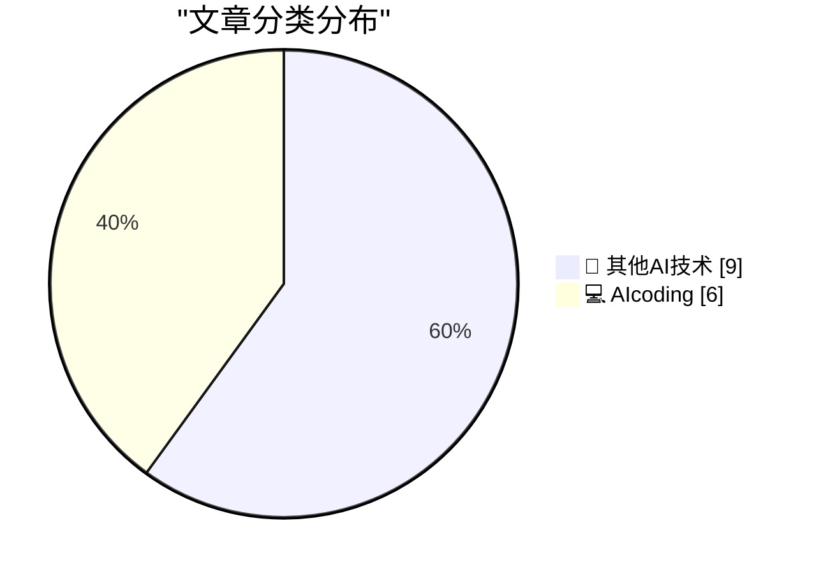
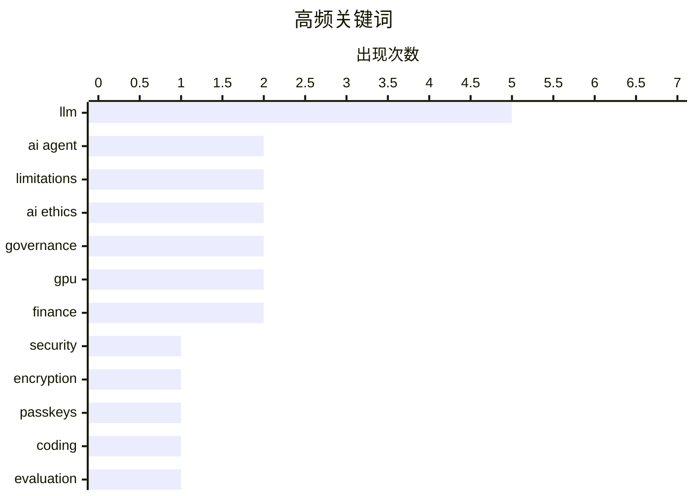

# 📰 AI 博客每日精选 — 2026-02-28

> 来自 5 个技术博客和社交媒体源，AI 精选 Top 15

## 📝 今日看点

今日技术圈聚焦于AI编码实践的深化与行业关键反思。一方面，AI编码代理从工具集成到多代理协作的工作流演进成为核心议题，开发者正积极探索其能力边界与最佳实践。另一方面，行业领袖对当前AI技术的局限性发出警示，包括其在生物医学等专业领域的推理不足，以及身份认证方案误用可能引发的数据风险。同时，顶尖机构对核心原则的坚守预示着未来将面临更多治理与伦理挑战。

---

## 🏆 今日必读

🥇 **求求你们，别再使用通行密钥来加密用户数据了**

[Please, please, please stop using passkeys for encrypting user data](https://simonwillison.net/2026/Feb/27/passkeys/#atom-everything) — simonwillison.net · 4 小时前 · 🔬 其他AI技术

> 文章核心警告开发者不要使用通行密钥（Passkeys）来加密用户数据。关键论点是用户频繁丢失通行密钥，且可能意识不到数据已被其不可逆加密，导致永久性数据丢失。作者Tim Cappalli恳请身份认证行业停止推广和使用此方案。结论是通行密钥应专注于身份验证，而非数据加密。

💡 **为什么值得读**: 该警告基于真实的用户数据丢失风险，为所有考虑使用通行密钥的开发者提供了关键的安全设计警示。

🏷️ Security, Encryption, Passkeys

🥈 **一位AI编码代理怀疑论者的详尽实践记录**

[An AI agent coding skeptic tries AI agent coding, in excessive detail](https://simonwillison.net/2026/Feb/27/ai-agent-coding-in-excessive-detail/#atom-everything) — simonwillison.net · 6 小时前 · 💻 AIcoding

> 文章记录了作者Max Woolf从怀疑到实践AI编码代理的完整过程。他进行了一系列复杂度递增的项目，从简单的YouTube元数据抓取工具开始，最终尝试了更具雄心的任务。实践表明，AI编码代理的能力自2025年11月以来取得了显著进步。作者通过详尽的细节展示了其潜力和当前局限性。

💡 **为什么值得读**: 通过一位初始怀疑者的亲身实践，提供了关于AI编码代理当前能力最真实、最细致的一手评估。

🏷️ AI Agent, Coding, Evaluation

🥉 **使用fetch() HTTP范围请求进行二分查找的Unicode探索器**

[Unicode Explorer using binary search over fetch() HTTP range requests](https://simonwillison.net/2026/Feb/27/unicode-explorer/#atom-everything) — simonwillison.net · 9 小时前 · 💻 AIcoding

> Simon Willison介绍了一个实验性原型工具，用于探索Unicode字符集。该工具的核心技术是利用HTTP范围请求（Range Requests）和二分查找算法，通过浏览器直接高效地查询远程大型Unicode数据文件。项目展示了HTTP范围请求的巧妙应用和利用LLM满足好奇心的开发模式。这是一个将网络协议特性用于前端数据检索的实践案例。

💡 **为什么值得读**: 它巧妙地将底层网络协议（HTTP Range）与经典算法（二分查找）结合，为处理前端大型静态文件提供了新颖的思路。

🏷️ LLM, Prototype, Web Development

4️⃣ **MLX是让Mac成为可信LLM运行平台的杰出软件**

[MLX is an astoundingly great piece of software which helped make Mac hardware credible as a platform for running LLMs I'm surprised Apple didn't move ...](https://x.com/simonw/status/2027505671005213128) — 𝕏 @simonw · 4 小时前 · 💻 AIcoding

> Simon Willison称赞MLX是一个极其出色的软件框架，它成功确立了Apple Silicon Mac作为运行大型语言模型（LLM）的可靠硬件平台。他指出，苹果未能全力留住MLX核心开发者Awni Hannun是令人惊讶的。Awni Hannun确认已从苹果离职，并认为Apple Silicon的AI生态仍处于早期阶段。作者对Awni未来的项目充满期待。

💡 **为什么值得读**: 提供了关于Mac AI生态关键框架MLX及其核心人物变动的重要业界动态，对关注边缘AI和苹果平台的开发者有参考价值。

🏷️ MLX, LLM, Apple Silicon

5️⃣ **Karpathy实验多AI代理协作编码：混乱但有趣的尝试**

[I had the same thought so I've been playing with it in nanochat. E.g. here's 8 agents (4 claude, 4 codex), with 1 GPU each running nanochat experiment...](https://x.com/karpathy/status/2027521323275325622) — 𝕏 @karpathy · 3 小时前 · 💻 AIcoding

> Andrej Karpathy分享了他使用nanochat进行多AI代理协作编码的实验。他尝试了多种设置，如8个独立研究员、1个首席科学家带领8个初级研究员等，每个“科学家”在一个Git分支上工作。实验目标是让代理们协作移除logit softcap而不引发回归。结论是当前这种方法并不奏效，整个协作过程相当混乱。但他认为这种多代理交互的视觉呈现仍然非常有趣。

💡 **为什么值得读**: 来自AI教育家的第一手多智能体编码实验报告，直观揭示了当前AI团队协作面临的实际挑战与复杂性。

🏷️ AI Agent, Multi-Agent, Experiment

---

## 📊 数据概览

| 扫描源 | 抓取文章 | 时间范围 | 精选 |
|:---:|:---:|:---:|:---:|
| 5/5 | 78 篇 → 22 篇 | 24h | **15 篇** |

### 分类分布



### 高频关键词



<details>
<summary>📈 纯文本关键词图（终端友好）</summary>

```
llm         │ ████████████████████ 5
ai agent    │ ████████░░░░░░░░░░░░ 2
limitations │ ████████░░░░░░░░░░░░ 2
ai ethics   │ ████████░░░░░░░░░░░░ 2
governance  │ ████████░░░░░░░░░░░░ 2
gpu         │ ████████░░░░░░░░░░░░ 2
finance     │ ████████░░░░░░░░░░░░ 2
security    │ ████░░░░░░░░░░░░░░░░ 1
encryption  │ ████░░░░░░░░░░░░░░░░ 1
passkeys    │ ████░░░░░░░░░░░░░░░░ 1
```

</details>

### 🏷️ 话题标签

**llm**(5) · **ai agent**(2) · **limitations**(2) · ai ethics(2) · governance(2) · gpu(2) · finance(2) · security(1) · encryption(1) · passkeys(1) · coding(1) · evaluation(1) · prototype(1) · web development(1) · mlx(1) · apple silicon(1) · multi-agent(1) · experiment(1) · ai coding(1) · cursor(1)

---

====================

## 🔬 其他AI技术

### 1. 求求你们，别再使用通行密钥来加密用户数据了

[Please, please, please stop using passkeys for encrypting user data](https://simonwillison.net/2026/Feb/27/passkeys/#atom-everything) — **simonwillison.net** · 4 小时前 · ⭐ 23/25

> 文章核心警告开发者不要使用通行密钥（Passkeys）来加密用户数据。关键论点是用户频繁丢失通行密钥，且可能意识不到数据已被其不可逆加密，导致永久性数据丢失。作者Tim Cappalli恳请身份认证行业停止推广和使用此方案。结论是通行密钥应专注于身份验证，而非数据加密。

🏷️ Security, Encryption, Passkeys

📌 其他AI技术

---

### 2. 礼来CEO：当前LLM在药物发现所需的生物学方面“并不特别好”

[“LLMs are ‘not particularly good’ at the kind of biology necessary to develop therapies” See also my pinned tweet.](https://x.com/GaryMarcus/status/2027415453237469406) — **𝕏 @GaryMarcus** · 10 小时前 · ⭐ 12/25

> 文章引用礼来公司CEO Dave Ricks的观点，对“AI将治愈癌症”的流行说法提出质疑。Ricks明确指出，当前的大型语言模型（LLM）在药物发现所必需的那种生物学推理和研发方面“并不特别好”。这一观点与Gary Marcus等人对AI在科学领域实际能力的长期批评相呼应。它揭示了AI在复杂科学领域（如生物制药）的应用与媒体宣传之间存在差距。

🏷️ LLM, Limitations, Biology

📌 其他AI技术

---

### 3. 请求根据新数据更新左侧示意图

[Can someone with artistic skills please update the illustration on the left to reflect the new data on the right?](https://x.com/GaryMarcus/status/2027410095555162181) — **𝕏 @GaryMarcus** · 11 小时前 · ⭐ 11/25

> Gary Marcus发布了一条推文，请求具备艺术技能的人根据右侧的新数据图表，更新左侧一张关于AI能力或风险的象征性示意图。推文包含两张图片：左侧是一张风格化的概念插图，右侧则是一张包含具体数据点的图表。Marcus未明确说明图表的具体内容，但其意图显然是希望视觉呈现能更准确地反映最新的实证数据。

🏷️ Data Visualization, LLM, Limitations

📌 其他AI技术

---

### 4. Ilya Sutskever：赞赏Anthropic和OpenAI在关键问题上立场坚定

[RT Ilya Sutskever: It’s extremely good that Anthropic has not backed down, and it’s siginficant that OpenAI has taken a similar stance. In the futur...](https://x.com/GaryMarcus/status/2027495587642544634) — **𝕏 @GaryMarcus** · 5 小时前 · ⭐ 10/25

> Ilya Sutskever转发并评论，高度赞赏Anthropic没有让步，并且OpenAI采取了相似立场的行为具有重要意义。他认为，未来将会出现更多类似性质的挑战性情境。届时，相关领导者挺身而出、激烈的竞争者搁置分歧将至关重要。他对当前两家公司能这样做表示欣慰。Gary Marcus转发了这一观点。

🏷️ AI Ethics, Governance

📌 其他AI技术

---

### 5. RT James Chanos: It’s hard to overstate how bad the $CRWV results/guidance were, but consider this: CoreWeave would still be losing money if they dep...

[RT James Chanos: It’s hard to overstate how bad the $CRWV results/guidance were, but consider this: CoreWeave would still be losing money if they dep...](https://x.com/GaryMarcus/status/2027452613441241389) — **𝕏 @GaryMarcus** · 8 小时前 · ⭐ 10/25

> RT James Chanos<br>It’s hard to overstate how bad the $CRWV results/guidance were, but consider this: CoreWeave would still be losing money if they depreciated their GPU’s over 10 years! And at a cons

🏷️ GPU, Infrastructure, Finance

📌 其他AI技术

---

### 6. Translation: The pentagon wants mass surveillance of US citizens (that means you!) and is so caught in the hype they think it is a-ok to put hallucina...

[Translation: The pentagon wants mass surveillance of US citizens (that means you!) and is so caught in the hype they think it is a-ok to put hallucina...](https://x.com/GaryMarcus/status/2027439587824456114) — **𝕏 @GaryMarcus** · 9 小时前 · ⭐ 10/25

> Translation: The pentagon wants mass surveillance of US citizens (that means you!) and is so caught in the hype they think it is a-ok to put hallucination machines in autonomous weapons without human 

🏷️ AI Ethics, Surveillance, Autonomous Weapons

📌 其他AI技术

---

### 7. RT George Noble: In 45 years on Wall Street, I've never seen anything like this. Sam Altman just convinced 3 of the world's smartest investors to fund...

[RT George Noble: In 45 years on Wall Street, I've never seen anything like this. Sam Altman just convinced 3 of the world's smartest investors to fund...](https://x.com/GaryMarcus/status/2027452485015863701) — **𝕏 @GaryMarcus** · 9 小时前 · ⭐ 10/25

> RT George Noble<br>In 45 years on Wall Street, I've never seen anything like this.<br><br>Sam Altman just convinced 3 of the world's smartest investors to fund his losses.<br><br>$110 billion. But ZER

🏷️ Investment, Finance, Startup

📌 其他AI技术

---

### 8. Sam is not my hero but I am really glad to see this.

[Sam is not my hero but I am really glad to see this.](https://x.com/GaryMarcus/status/2027423374193144039) — **𝕏 @GaryMarcus** · 10 小时前 · ⭐ 10/25

> Sam is not my hero but I am really glad to see this.<div class="rsshub-quote"><br><br>Brian Allen: 🚨 BREAKING: OpenAI CEO Sam Altman just broke ranks and defended Anthropic amid reports the Trump adm

🏷️ AI Policy, Governance

📌 其他AI技术

---

### 9. Why CoreWeave is tanking.

[Why CoreWeave is tanking.](https://x.com/GaryMarcus/status/2027407137811693874) — **𝕏 @GaryMarcus** · 11 小时前 · ⭐ 10/25

> Why CoreWeave is tanking.<div class="rsshub-quote"><br><br>Kakashii: So, all that CoreWeave raised during Q4 2025, they spent on, of course, GPUs. And that’s, folks, the whole purpose of CoreWeave's S

🏷️ AI Infrastructure, GPU, Business

📌 其他AI技术

---

## 💻 AIcoding

### 10. 一位AI编码代理怀疑论者的详尽实践记录

[An AI agent coding skeptic tries AI agent coding, in excessive detail](https://simonwillison.net/2026/Feb/27/ai-agent-coding-in-excessive-detail/#atom-everything) — **simonwillison.net** · 6 小时前 · ⭐ 22/25

> 文章记录了作者Max Woolf从怀疑到实践AI编码代理的完整过程。他进行了一系列复杂度递增的项目，从简单的YouTube元数据抓取工具开始，最终尝试了更具雄心的任务。实践表明，AI编码代理的能力自2025年11月以来取得了显著进步。作者通过详尽的细节展示了其潜力和当前局限性。

🏷️ AI Agent, Coding, Evaluation

📌 AIcoding

---

### 11. 使用fetch() HTTP范围请求进行二分查找的Unicode探索器

[Unicode Explorer using binary search over fetch() HTTP range requests](https://simonwillison.net/2026/Feb/27/unicode-explorer/#atom-everything) — **simonwillison.net** · 9 小时前 · ⭐ 22/25

> Simon Willison介绍了一个实验性原型工具，用于探索Unicode字符集。该工具的核心技术是利用HTTP范围请求（Range Requests）和二分查找算法，通过浏览器直接高效地查询远程大型Unicode数据文件。项目展示了HTTP范围请求的巧妙应用和利用LLM满足好奇心的开发模式。这是一个将网络协议特性用于前端数据检索的实践案例。

🏷️ LLM, Prototype, Web Development

📌 AIcoding

---

### 12. MLX是让Mac成为可信LLM运行平台的杰出软件

[MLX is an astoundingly great piece of software which helped make Mac hardware credible as a platform for running LLMs I'm surprised Apple didn't move ...](https://x.com/simonw/status/2027505671005213128) — **𝕏 @simonw** · 4 小时前 · ⭐ 20/25

> Simon Willison称赞MLX是一个极其出色的软件框架，它成功确立了Apple Silicon Mac作为运行大型语言模型（LLM）的可靠硬件平台。他指出，苹果未能全力留住MLX核心开发者Awni Hannun是令人惊讶的。Awni Hannun确认已从苹果离职，并认为Apple Silicon的AI生态仍处于早期阶段。作者对Awni未来的项目充满期待。

🏷️ MLX, LLM, Apple Silicon

📌 AIcoding

---

### 13. Karpathy实验多AI代理协作编码：混乱但有趣的尝试

[I had the same thought so I've been playing with it in nanochat. E.g. here's 8 agents (4 claude, 4 codex), with 1 GPU each running nanochat experiment...](https://x.com/karpathy/status/2027521323275325622) — **𝕏 @karpathy** · 3 小时前 · ⭐ 18/25

> Andrej Karpathy分享了他使用nanochat进行多AI代理协作编码的实验。他尝试了多种设置，如8个独立研究员、1个首席科学家带领8个初级研究员等，每个“科学家”在一个Git分支上工作。实验目标是让代理们协作移除logit softcap而不引发回归。结论是当前这种方法并不奏效，整个协作过程相当混乱。但他认为这种多代理交互的视觉呈现仍然非常有趣。

🏷️ AI Agent, Multi-Agent, Experiment

📌 AIcoding

---

### 14. Cursor中Tab补全与Agent请求比例演进的启示

[Cool chart showing the ratio of Tab complete requests to Agent requests in Cursor. With improving capability, every point in time has an optimal setup...](https://x.com/karpathy/status/2027501331125239822) — **𝕏 @karpathy** · 5 小时前 · ⭐ 17/25

> Karpathy分享了一张图表，展示了代码编辑器Cursor中Tab补全请求与AI Agent请求的比例变化。核心观点是，随着AI能力提升，存在一个不断演进的“最优工作流程”平衡点：从无辅助到Tab补全，再到Agent，进而可能发展到并行多Agent和Agent团队。过于保守会浪费效率红利，过于激进则会产生混乱而非有效工作。流程设计的艺术在于将80%的精力用于找到这个动态平衡点。

🏷️ AI Coding, Cursor, Trend

📌 AIcoding

---

### 15. 面向（大型项目）开源维护者的免费Claude Max计划

[Free Claude Max for (large project) open source maintainers](https://simonwillison.net/2026/Feb/27/claude-max-oss-six-months/#atom-everything) — **simonwillison.net** · 8 小时前 · ⭐ 15/25

> Anthropic公司为大型开源项目的维护者提供为期六个月的免费Claude Max（20x）计划。申请者需是拥有5000+ GitHub星标或100万+月NPM下载量的公共代码库的主要维护者或核心团队成员。该计划是Claude for OSS项目的一部分，旨在支持开源社区。符合条件的维护者需要通过指定链接联系销售团队申请。

🏷️ Claude, Open Source, LLM

📌 AIcoding

---

====================

*生成于 2026-02-28 02:51 | 扫描 5 源 → 获取 78 篇 → 精选 15 篇*
*基于 [Hacker News Popularity Contest 2025](https://refactoringenglish.com/tools/hn-popularity/) RSS 源列表，由 [Andrej Karpathy](https://x.com/karpathy) 推荐*
*由「懂点儿AI」制作，欢迎关注同名微信公众号获取更多 AI 实用技巧 💡*
