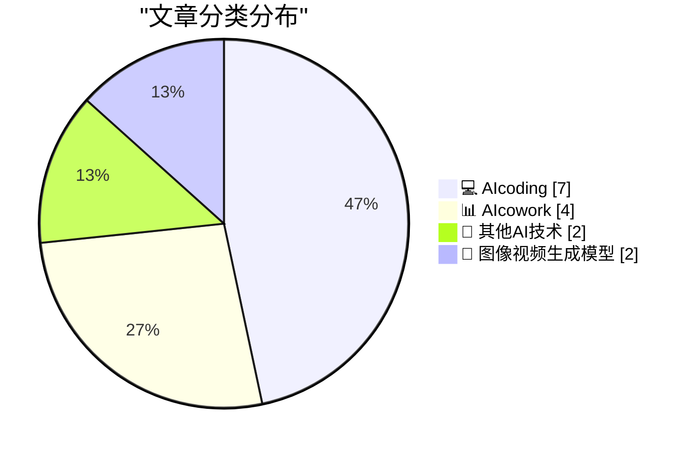
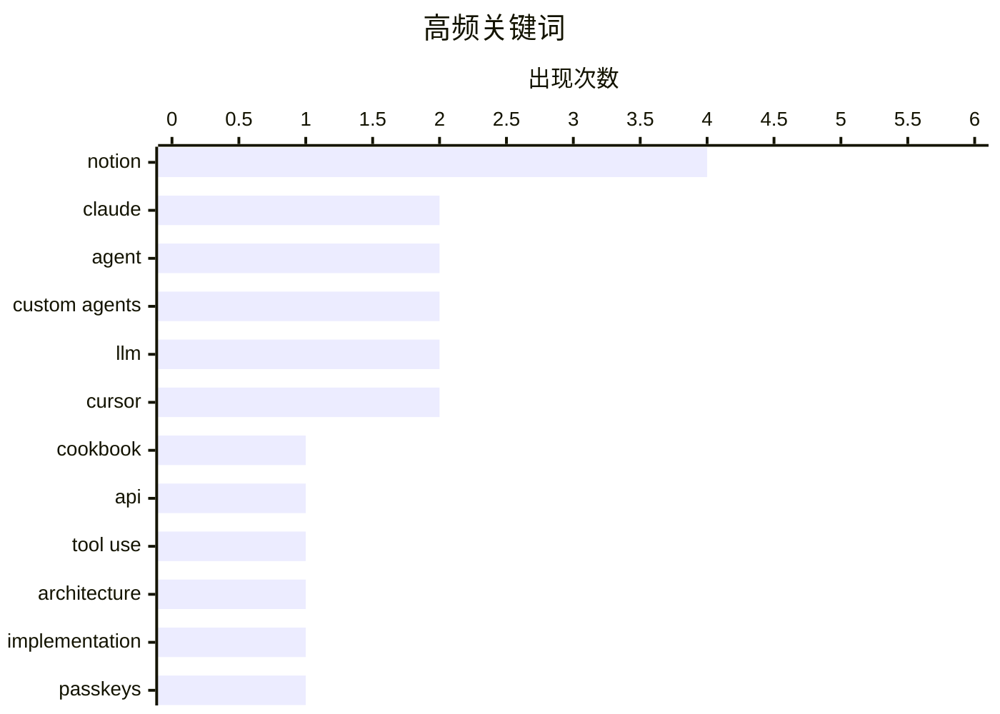

# 📰 AI 博客每日精选 — 2026-02-28

> 来自 99 个技术博客和社交媒体源，AI 精选 Top 15

## 📝 今日看点

今日技术圈聚焦于AI应用开发的深度演进与安全警示。一方面，以Notion为代表的AI协作平台正通过开源模型、多模块架构和深度数据理解，推动智能体向更强大、经济且可定制的方向发展。另一方面，AI编码工具的使用痕迹检测、多智能体协作等实践，揭示了开发流程与团队协作模式正在被AI深刻重塑。同时，行业也发出明确警告，提醒开发者审慎使用通行密钥等新技术，避免引发数据永久丢失的安全风险。

---

## 🏆 今日必读

🥇 **Claude 官方秘籍库被严重低估了**

[RT God of Prompt: 🚨 The Claude Cookbooks are criminally underrated. Anthropic's own engineers use these notebooks to build with Claude. They've bee...](https://x.com/godofprompt/status/2027801020118810807) — 𝕏 @godofprompt · 12 小时前 · 💻 AIcoding

> Anthropic 官方发布的 Claude Cookbooks 是工程师构建 Claude 应用的实战指南，但讨论度极低。秘籍库包含了 Anthropic 官方实现工具调用、函数调用、端到端图像处理视觉管道以及 RAG 系统的最佳实践。其中，提示词缓存模式甚至可以将 API 成本削减一半。这些内容是构建生产级 Claude 应用的权威参考。

💡 **为什么值得读**: 这是直接来自 Claude 创造者的内部工程实践，能帮你以官方推荐的方式高效构建应用并显著降低成本。

🏷️ Claude, Cookbook, API, Tool Use

🥈 **Notion 智能体实现的五大基础构建模块**

[RT Matthew Salmon ⏩: I'm impressed by Notion's agent implementation. 5 basic building blocks: triggers, instructions, tools and access, model, and al...](https://x.com/NotionHQ/status/2027600387260506438) — 𝕏 @NotionHQ · 19 小时前 · 📊 AIcowork

> Notion 的智能体实现基于五个核心构建模块：触发器、指令、工具与权限、模型以及允许的 URL。其独特之处在于，智能体能够根据聊天内容自我配置这些模块，或提示用户授予适当权限，并且用户可以清晰地查看其访问范围。这种设计虽然不像某些智能体那样充满“魔法感”，但胜在结构简单、易于理解和使用。

💡 **为什么值得读**: 通过剖析 Notion 智能体的模块化设计，可以学习如何将复杂的智能体能力封装成清晰、可配置的组件。

🏷️ Notion, Agent, Architecture, Implementation

🥉 **请务必停止使用通行密钥来加密用户数据**

[Please, please, please stop using passkeys for encrypting user data](https://simonwillison.net/2026/Feb/27/passkeys/#atom-everything) — simonwillison.net · 22 小时前 · 🔬 其他AI技术

> 文章核心警告开发者不要使用通行密钥（Passkeys）来加密用户数据。因为用户频繁丢失通行密钥，且可能意识不到数据已被其不可逆地加密，导致数据永久无法恢复。作者 Tim Cappalli 向整个身份认证行业发出强烈呼吁，要求停止推广这种危险做法。通行密钥应专注于其作为身份验证凭证的核心职责。

💡 **为什么值得读**: 它指出了一个广泛存在且后果严重的错误设计模式，能帮助开发者避免导致用户数据永久丢失的重大事故。

🏷️ Passkeys, Encryption, Security

4️⃣ **将费曼教学法逆向工程为 Claude 提示系统**

[RT God of Prompt: Richard Feynman had one superpower: making the complex feel obvious. I reverse-engineered his entire teaching method into a Claude p...](https://x.com/godofprompt/status/2027833975323168916) — 𝕏 @godofprompt · 4 小时前 · 💻 AIcoding

> 作者将理查德·费曼化繁为简的教学超能力，逆向工程成了一套 Claude 提示词系统。该系统旨在帮助用户在 10 分钟内理解任何复杂概念。其核心是复现费曼的教学方法，通过一系列结构化的提示步骤引导 Claude 进行解释。这为高效学习和知识消化提供了一个可操作的工具模板。

💡 **为什么值得读**: 它将一位传奇科学家的顶级思维模型转化为可立即使用的 AI 提示工具，能极大提升学习复杂知识的效率。

🏷️ Claude, Prompt Engineering, Learning

5️⃣ **Notion 为自定义智能体推出首个开源权重模型**

[RT Akshay Kothari: We just rolled out the first open weight model for @NotionHQ Custom Agents. For simpler tasks, it's a lot cheaper than other models...](https://x.com/NotionHQ/status/2027810327828783433) — 𝕏 @NotionHQ · 3 小时前 · 📊 AIcowork

> Notion 为其自定义智能体功能推出了首个开源权重模型。该模型针对较简单的任务进行了优化，其核心优势在于成本远低于其他主流模型。官方鼓励用户尝试并提供反馈，旨在为用户提供更经济高效的模型选择，以降低智能体应用的运行开销。

💡 **为什么值得读**: 它标志着 Notion 智能体开始提供低成本模型选项，对于预算敏感或处理简单任务的应用场景有直接价值。

🏷️ Notion, Custom Agents, Open Weight Model

---

## 📊 数据概览

| 扫描源 | 抓取文章 | 时间范围 | 精选 |
|:---:|:---:|:---:|:---:|
| 84/99 | 2212 篇 → 78 篇 | 24h | **15 篇** |

### 分类分布



### 高频关键词



<details>
<summary>📈 纯文本关键词图（终端友好）</summary>

```
notion        │ ████████████████████ 4
claude        │ ██████████░░░░░░░░░░ 2
agent         │ ██████████░░░░░░░░░░ 2
custom agents │ ██████████░░░░░░░░░░ 2
llm           │ ██████████░░░░░░░░░░ 2
cursor        │ ██████████░░░░░░░░░░ 2
cookbook      │ █████░░░░░░░░░░░░░░░ 1
api           │ █████░░░░░░░░░░░░░░░ 1
tool use      │ █████░░░░░░░░░░░░░░░ 1
architecture  │ █████░░░░░░░░░░░░░░░ 1
```

</details>

### 🏷️ 话题标签

**notion**(4) · **claude**(2) · **agent**(2) · custom agents(2) · llm(2) · cursor(2) · cookbook(1) · api(1) · tool use(1) · architecture(1) · implementation(1) · passkeys(1) · encryption(1) · security(1) · prompt engineering(1) · learning(1) · open weight model(1) · minimax(1) · model selection(1) · github(1)

---

====================

## 💻 AIcoding

### 1. Claude 官方秘籍库被严重低估了

[RT God of Prompt: 🚨 The Claude Cookbooks are criminally underrated. Anthropic's own engineers use these notebooks to build with Claude. They've bee...](https://x.com/godofprompt/status/2027801020118810807) — **𝕏 @godofprompt** · 12 小时前 · ⭐ 23/25

> Anthropic 官方发布的 Claude Cookbooks 是工程师构建 Claude 应用的实战指南，但讨论度极低。秘籍库包含了 Anthropic 官方实现工具调用、函数调用、端到端图像处理视觉管道以及 RAG 系统的最佳实践。其中，提示词缓存模式甚至可以将 API 成本削减一半。这些内容是构建生产级 Claude 应用的权威参考。

🏷️ Claude, Cookbook, API, Tool Use

📌 AIcoding

---

### 2. 将费曼教学法逆向工程为 Claude 提示系统

[RT God of Prompt: Richard Feynman had one superpower: making the complex feel obvious. I reverse-engineered his entire teaching method into a Claude p...](https://x.com/godofprompt/status/2027833975323168916) — **𝕏 @godofprompt** · 4 小时前 · ⭐ 21/25

> 作者将理查德·费曼化繁为简的教学超能力，逆向工程成了一套 Claude 提示词系统。该系统旨在帮助用户在 10 分钟内理解任何复杂概念。其核心是复现费曼的教学方法，通过一系列结构化的提示步骤引导 Claude 进行解释。这为高效学习和知识消化提供了一个可操作的工具模板。

🏷️ Claude, Prompt Engineering, Learning

📌 AIcoding

---

### 3. Python 源代码中的 LLM 使用痕迹

[LLM Use in the Python Source Code](https://blog.miguelgrinberg.com/post/llm-use-in-the-python-source-code) — **miguelgrinberg.com** · 6 小时前 · ⭐ 19/25

> 文章揭示了一个在 GitHub 上检测项目是否使用 Claude Code 等编码智能体的技巧：屏蔽 claude 用户后，相关仓库顶部会出现提示横幅。令人惊讶的是，Python 语言的核心 CPython 代码库也出现了此横幅，表明其开发已开始依赖 AI 编码助手。这引发了关于 AI 如何影响核心基础设施开发的广泛讨论。

🏷️ GitHub, LLM, Code

📌 AIcoding

---

### 4. 多智能体协作编码实验：混乱但有趣的探索

[I had the same thought so I've been playing with it in nanochat. E.g. here's 8 agents (4 claude, 4 codex), with 1 GPU each running nanochat experiment...](https://x.com/karpathy/status/2027521323275325622) — **𝕏 @karpathy** · 22 小时前 · ⭐ 19/25

> 作者在 nanochat 中进行了多智能体协作编码的实验，例如让 8 个智能体（4个 Claude，4个 Codex）尝试完成“删除 logit softcap 而不引发回归”的任务。实验设置了多种协作模式，如 8 个独立研究员、1 个首席科学家带领 8 个初级研究员等。结论是当前这种方法效果不佳且混乱，但实验过程本身具有观察价值。

🏷️ Multi-Agent, LLM, Experiment

📌 AIcoding

---

### 5. Cursor 中 Tab 补全与智能体请求比率的演进图表

[RT Andrej Karpathy: Cool chart showing the ratio of Tab complete requests to Agent requests in Cursor. With improving capability, every point in time ...](https://x.com/leerob/status/2027513973449363664) — **𝕏 @leerob** · 23 小时前 · ⭐ 19/25

> 一张图表展示了 Cursor 编辑器中 Tab 补全请求与智能体请求的比率变化。随着 AI 能力提升，每个时间点都存在一个不断演变的最优工作流程配置（从无到 Tab 补全，再到智能体、并行智能体、智能体团队）。社区平均水平在追踪这个最优点。过程管理的艺术在于：过于保守会错失杠杆效应，过于激进则制造混乱多于有用工作。

🏷️ Cursor, AI Agent, Code Completion

📌 AIcoding

---

### 6. Cursor中Tab补全请求与Agent请求比率变化图

[Cool chart showing the ratio of Tab complete requests to Agent requests in Cursor. With improving capability, every point in time has an optimal setup...](https://x.com/karpathy/status/2027501331125239822) — **𝕏 @karpathy** · 23 小时前 · ⭐ 18/25

> 一张图表展示了AI编程工具Cursor中，用户使用Tab补全与调用Agent（智能体）两种辅助模式的比例变化。随着AI能力提升，每个时间点都存在一个最优的“人机协作”配置，且这个配置在不断演变，社区的平均使用行为恰好追踪着这个最优平衡点。演进路径大致为：无辅助 -> Tab补全 -> 单Agent -> 并行多Agent -> Agent团队协作。过于保守会错失效率提升机会，而过于激进则可能因混乱而降低实际工作效率。

🏷️ AI Coding, Cursor, Workflow

📌 AIcoding

---

### 7. Vibecode Android发布：现已支持在Android上测试你的应用

[RT vibecode.dev: Introducing Vibecode Android Millions of iOS apps have been vibecoded already... & Now, you can test your apps on Android Play Store ...](https://x.com/rileybrown/status/2027546857535377566) — **𝕏 @rileybrown** · 20 小时前 · ⭐ 16/25

> 推文宣布了Vibecode工具正式推出Android版本。此前，该工具已用于测试了数百万个iOS应用。现在，开发者可以使用它在Android平台上测试自己的应用。官方还预告了即将支持Google Play商店提交和完整的Android应用功能。

🏷️ App Testing, Android, iOS

📌 AIcoding

---

## 📊 AIcowork

### 8. Notion 智能体实现的五大基础构建模块

[RT Matthew Salmon ⏩: I'm impressed by Notion's agent implementation. 5 basic building blocks: triggers, instructions, tools and access, model, and al...](https://x.com/NotionHQ/status/2027600387260506438) — **𝕏 @NotionHQ** · 19 小时前 · ⭐ 22/25

> Notion 的智能体实现基于五个核心构建模块：触发器、指令、工具与权限、模型以及允许的 URL。其独特之处在于，智能体能够根据聊天内容自我配置这些模块，或提示用户授予适当权限，并且用户可以清晰地查看其访问范围。这种设计虽然不像某些智能体那样充满“魔法感”，但胜在结构简单、易于理解和使用。

🏷️ Notion, Agent, Architecture, Implementation

📌 AIcowork

---

### 9. Notion 为自定义智能体推出首个开源权重模型

[RT Akshay Kothari: We just rolled out the first open weight model for @NotionHQ Custom Agents. For simpler tasks, it's a lot cheaper than other models...](https://x.com/NotionHQ/status/2027810327828783433) — **𝕏 @NotionHQ** · 3 小时前 · ⭐ 20/25

> Notion 为其自定义智能体功能推出了首个开源权重模型。该模型针对较简单的任务进行了优化，其核心优势在于成本远低于其他主流模型。官方鼓励用户尝试并提供反馈，旨在为用户提供更经济高效的模型选择，以降低智能体应用的运行开销。

🏷️ Notion, Custom Agents, Open Weight Model

📌 AIcowork

---

### 10. Notion 自定义智能体新增 MiniMax M2.5 模型

[RT Ivan Zhao: We added a new model to Custom Agents last night (MiniMax M2.5). Give us cost and performance feedback. More models coming](https://x.com/NotionHQ/status/2027752362564300852) — **𝕏 @NotionHQ** · 7 小时前 · ⭐ 20/25

> Notion 在自定义智能体中新增了 MiniMax M2.5 模型。官方主动邀请用户就该模型的成本和性能提供反馈，并预告未来会有更多模型加入。此举旨在丰富用户的选择，并通过社区反馈来优化模型选型策略，帮助用户平衡成本与性能。

🏷️ Notion, Custom Agents, MiniMax, Model Selection

📌 AIcowork

---

### 11. Notion 智能体已悄然变得非常强大

[RT Sean Wildenfree: The Notion Agent has gotten quietly powerful and I don't think enough people have caught on yet. It reads your databases. Understa...](https://x.com/NotionHQ/status/2027592524769202299) — **𝕏 @NotionHQ** · 22 小时前 · ⭐ 19/25

> Notion 智能体的能力被严重低估，它已悄然变得十分强大。其核心能力在于能够读取并理解用户数据库中的内容和结构（Schema）。这种对结构化数据的深度理解，使其能够执行更复杂、更贴合用户业务逻辑的操作，而不仅仅是简单的文本对话。

🏷️ Notion, Agent, Database, Automation

📌 AIcowork

---

## 🔬 其他AI技术

### 12. 请务必停止使用通行密钥来加密用户数据

[Please, please, please stop using passkeys for encrypting user data](https://simonwillison.net/2026/Feb/27/passkeys/#atom-everything) — **simonwillison.net** · 22 小时前 · ⭐ 21/25

> 文章核心警告开发者不要使用通行密钥（Passkeys）来加密用户数据。因为用户频繁丢失通行密钥，且可能意识不到数据已被其不可逆地加密，导致数据永久无法恢复。作者 Tim Cappalli 向整个身份认证行业发出强烈呼吁，要求停止推广这种危险做法。通行密钥应专注于其作为身份验证凭证的核心职责。

🏷️ Passkeys, Encryption, Security

📌 其他AI技术

---

### 13. 30个月节省3兆瓦时：更多家庭电池统计数据

[30 months to 3MWh - some more home battery stats](https://shkspr.mobi/blog/2026/02/30-months-to-3mwh-some-more-home-battery-stats/) — **shkspr.mobi** · 8 小时前 · ⭐ 17/25

> 文章分享了作者安装Moixa 4.8kWh太阳能电池系统30个月后的实际运行数据和收益。该系统与太阳能电池板配对，持续进行充放电以优化家庭用电。核心数据是，该系统累计节省了约3兆瓦时（MWh）的电能。作者进一步估算了这些节省带来的具体经济收益。

🏷️ Energy, Hardware, IoT

📌 其他AI技术

---

## 🎨 图像视频生成模型

### 14. Google Nano Banana 2 让任何缩略图设计成为可能

[RT Thumio: Google Nano Banana 2 Has Made Any Thumbnail Design Possible. and we are here to prove it.](https://x.com/corbin_braun/status/2027526525701234930) — **𝕏 @corbin_braun** · 21 小时前 · ⭐ 17/25

> 一条推文转发了Thumio的内容，宣称Google的Nano Banana 2模型已经能够实现任何缩略图设计。推文附带的视频展示了该模型强大的图像生成能力，旨在证明其宣称的可实现性。

🏷️ Thumio, Google Nano Banana 2, Thumbnail Design

📌 图像视频生成模型

---

### 15. 致YouTuber和播客主：Nano Banana 2模型现已能制作你的缩略图

[If you are a YouTuber or Podcaster This Nano Banana 2 model can now make your thumbnails. trust me. it actually works now. I made a video showcasing e...](https://x.com/corbin_braun/status/2027521567157268510) — **𝕏 @corbin_braun** · 22 小时前 · ⭐ 16/25

> 推文直接面向YouTuber和播客主，推荐使用Google的Nano Banana 2模型来制作视频缩略图。作者强调该模型现在“确实可用”，并附上了自己制作的演示视频链接，以具体展示其工作流程和效果。

🏷️ Thumbnail, AI Design, Image Generation

📌 图像视频生成模型

---

====================

*生成于 2026-02-28 21:24 | 扫描 84 源 → 获取 2212 篇 → 精选 15 篇*
*基于 [Hacker News Popularity Contest 2025](https://refactoringenglish.com/tools/hn-popularity/) RSS 源列表，由 [Andrej Karpathy](https://x.com/karpathy) 推荐*
*由「懂点儿AI」制作，欢迎关注同名微信公众号获取更多 AI 实用技巧 💡*
