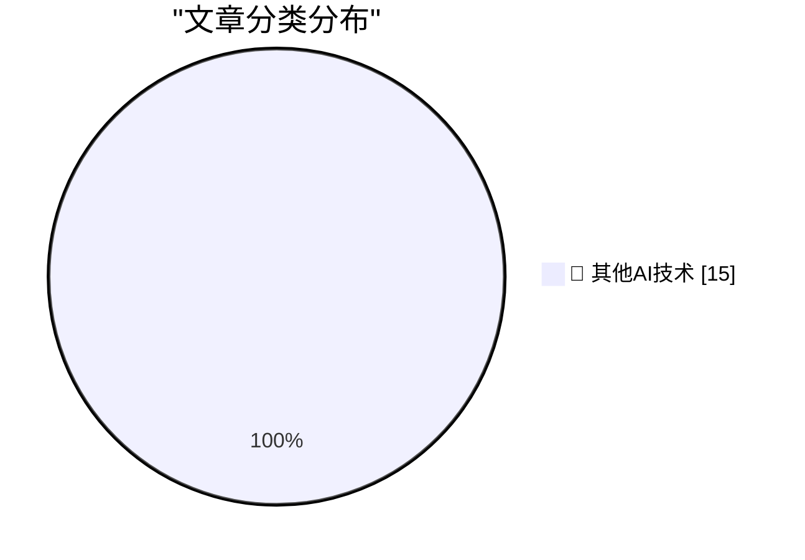

# 📰 AI 博客每日精选 — 2026-03-02

> 来自 99 个技术博客和社交媒体源，AI 精选 Top 15

## 🏆 今日必读

🥇 **Quoting claude.com/import-memory**

[Quoting claude.com/import-memory](https://simonwillison.net/2026/Mar/1/claude-import-memory/#atom-everything) — simonwillison.net · 16 小时前 · 🔬 其他AI技术

> Quoting claude.com/import-memory

🥈 **Expert Beginners and Lone Wolves will dominate this early LLM era**

[Expert Beginners and Lone Wolves will dominate this early LLM era](https://www.jeffgeerling.com/blog/2026/expert-beginners-and-lone-wolves-dominate-llm-era/) — jeffgeerling.com · 5 小时前 · 🔬 其他AI技术

> Expert Beginners and Lone Wolves will dominate this early LLM era

🥉 **Sentry**

[Sentry](https://sentry.io/resources/ios-workshop-jan-2026/?utm_source=daringfireball&amp;utm_medium=paid-display&amp;utm_campaign=general-fy27q1-evergreen&amp;utm_content=static-ad-mobilerss-trysentry) — daringfireball.net · 11 小时前 · 🔬 其他AI技术

> Sentry

4️⃣ **The Talk Show: ‘Bad Dates’**

[The Talk Show: ‘Bad Dates’](https://daringfireball.net/thetalkshow/2026/02/28/ep-442) — daringfireball.net · 11 小时前 · 🔬 其他AI技术

> The Talk Show: ‘Bad Dates’

5️⃣ **Redis patterns for coding**

[Redis patterns for coding](http://antirez.com/news/161) — antirez.com · 17 小时前 · 🔬 其他AI技术

> Redis patterns for coding

---

## 📊 数据概览

| 扫描源 | 抓取文章 | 时间范围 | 精选 |
|:---:|:---:|:---:|:---:|
| 89/99 | 2318 篇 → 53 篇 | 24h | **15 篇** |

### 分类分布

---

====================

## 🔬 其他AI技术

### 1. Quoting claude.com/import-memory

[Quoting claude.com/import-memory](https://simonwillison.net/2026/Mar/1/claude-import-memory/#atom-everything) — **simonwillison.net** · 16 小时前 · ⭐ 15/25

> Quoting claude.com/import-memory

📌 其他AI技术

---

### 2. Expert Beginners and Lone Wolves will dominate this early LLM era

[Expert Beginners and Lone Wolves will dominate this early LLM era](https://www.jeffgeerling.com/blog/2026/expert-beginners-and-lone-wolves-dominate-llm-era/) — **jeffgeerling.com** · 5 小时前 · ⭐ 15/25

> Expert Beginners and Lone Wolves will dominate this early LLM era

📌 其他AI技术

---

### 3. Sentry

[Sentry](https://sentry.io/resources/ios-workshop-jan-2026/?utm_source=daringfireball&amp;utm_medium=paid-display&amp;utm_campaign=general-fy27q1-evergreen&amp;utm_content=static-ad-mobilerss-trysentry) — **daringfireball.net** · 11 小时前 · ⭐ 15/25

> Sentry

📌 其他AI技术

---

### 4. The Talk Show: ‘Bad Dates’

[The Talk Show: ‘Bad Dates’](https://daringfireball.net/thetalkshow/2026/02/28/ep-442) — **daringfireball.net** · 11 小时前 · ⭐ 15/25

> The Talk Show: ‘Bad Dates’

📌 其他AI技术

---

### 5. Redis patterns for coding

[Redis patterns for coding](http://antirez.com/news/161) — **antirez.com** · 17 小时前 · ⭐ 15/25

> Redis patterns for coding

📌 其他AI技术

---

### 6. Book Review: Under Fire - Black Britain in Wartime by Stephen Bourne ★★★★☆

[Book Review: Under Fire - Black Britain in Wartime by Stephen Bourne ★★★★☆](https://shkspr.mobi/blog/2026/03/book-review-under-fire-black-britain-in-wartime-by-stephen-bourne/) — **shkspr.mobi** · 15 小时前 · ⭐ 15/25

> Book Review: Under Fire - Black Britain in Wartime by Stephen Bourne ★★★★☆

📌 其他AI技术

---

### 7. "Why hack the DHS? I can think of a couple Pretti Good reasons!"

["Why hack the DHS? I can think of a couple Pretti Good reasons!"](https://micahflee.com/why-hack-the-dhs-i-can-think-of-a-couple-pretti-good-reasons/) — **micahflee.com** · 6 小时前 · ⭐ 15/25

> "Why hack the DHS? I can think of a couple Pretti Good reasons!"

📌 其他AI技术

---

### 8. Praatjes

[Praatjes](https://berthub.eu/articles/praatjes/) — **berthub.eu** · 17 小时前 · ⭐ 15/25

> Praatjes

📌 其他AI技术

---

### 9. “If you stay at OpenAI, you're on the wrong side of history. It's as simple as that”

[“If you stay at OpenAI, you're on the wrong side of history. It's as simple as that”](https://x.com/GaryMarcus/status/2028297051138859176) — **𝕏 @GaryMarcus** · 1 小时前 · ⭐ 15/25

> “If you stay at OpenAI, you're on the wrong side of history. It's as simple as that”

📌 其他AI技术

---

### 10. Why does Graham always hype Altman when there are so many legitimate questions that can be raised about Altman? I don’t get it.

[Why does Graham always hype Altman when there are so many legitimate questions that can be raised about Altman? I don’t get it.](https://x.com/GaryMarcus/status/2028213757395272096) — **𝕏 @GaryMarcus** · 6 小时前 · ⭐ 15/25

> Why does Graham always hype Altman when there are so many legitimate questions that can be raised about Altman? I don’t get it.

📌 其他AI技术

---

### 11. It’s weird how people post stuff like this without looking closely. I can spot multiple errors, how about you?

[It’s weird how people post stuff like this without looking closely. I can spot multiple errors, how about you?](https://x.com/GaryMarcus/status/2028211938447302866) — **𝕏 @GaryMarcus** · 6 小时前 · ⭐ 15/25

> It’s weird how people post stuff like this without looking closely. I can spot multiple errors, how about you?

📌 其他AI技术

---

### 12. Dario did what was right. Sam did what was lucrative. We will all suffer the consequences.

[Dario did what was right. Sam did what was lucrative. We will all suffer the consequences.](https://x.com/GaryMarcus/status/2028169623049478353) — **𝕏 @GaryMarcus** · 9 小时前 · ⭐ 15/25

> Dario did what was right. Sam did what was lucrative. We will all suffer the consequences.

📌 其他AI技术

---

### 13. RT D. HuskyTron: I agree. Also it's the AI that's now a tentacle of the US government that's almost guaranteed to be spying on you and building a comp...

[RT D. HuskyTron: I agree. Also it's the AI that's now a tentacle of the US government that's almost guaranteed to be spying on you and building a comp...](https://x.com/GaryMarcus/status/2028158654403477595) — **𝕏 @GaryMarcus** · 10 小时前 · ⭐ 15/25

> RT D. HuskyTron: I agree. Also it's the AI that's now a tentacle of the US government that's almost guaranteed to be spying on you and building a comp...

📌 其他AI技术

---

### 14. tl;dr of something worth reading: OpenAI is full of shit, and perfectly happy to be using their unreliable tech for war. #DeleteChatGPT

[tl;dr of something worth reading: OpenAI is full of shit, and perfectly happy to be using their unreliable tech for war. #DeleteChatGPT](https://x.com/GaryMarcus/status/2028143619417448611) — **𝕏 @GaryMarcus** · 11 小时前 · ⭐ 15/25

> tl;dr of something worth reading: OpenAI is full of shit, and perfectly happy to be using their unreliable tech for war. #DeleteChatGPT

📌 其他AI技术

---

### 15. It’s not just the AI that will be taking our jobs. It’s the AI that will be making life or death decisions. And the AI that might lead to needless e...

[It’s not just the AI that will be taking our jobs. It’s the AI that will be making life or death decisions. And the AI that might lead to needless e...](https://x.com/GaryMarcus/status/2028143088624161150) — **𝕏 @GaryMarcus** · 11 小时前 · ⭐ 15/25

> It’s not just the AI that will be taking our jobs. It’s the AI that will be making life or death decisions. And the AI that might lead to needless e...

📌 其他AI技术

---

====================

*生成于 2026-03-02 03:41 | 扫描 89 源 → 获取 2318 篇 → 精选 15 篇*
*基于 [Hacker News Popularity Contest 2025](https://refactoringenglish.com/tools/hn-popularity/) RSS 源列表，由 [Andrej Karpathy](https://x.com/karpathy) 推荐*
*由「懂点儿AI」制作，欢迎关注同名微信公众号获取更多 AI 实用技巧 💡*
