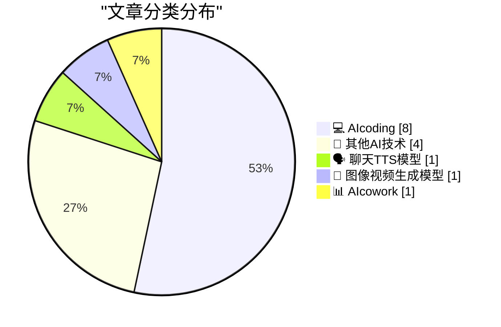
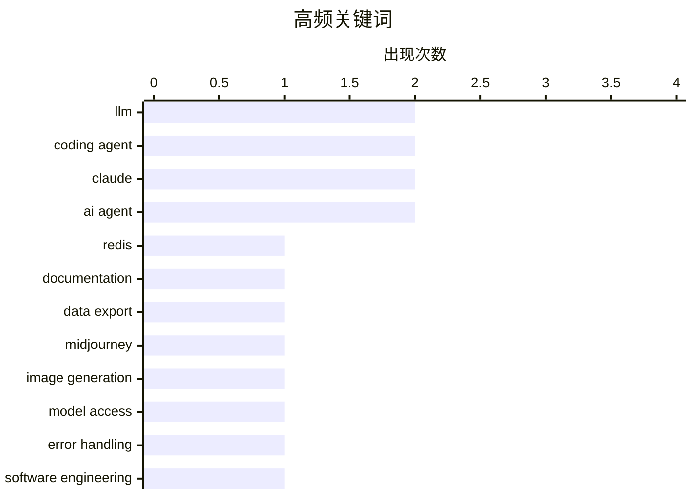

# 📰 AI 博客每日精选 — 2026-03-01

> 来自 99 个技术博客和社交媒体源，AI 精选 Top 15

## 📝 今日看点

今日技术圈焦点集中于AI编程范式的演进与基础设施的智能化实践。一方面，AI编码智能体正从代码生成向构建交互式解释、管理认知债务等深层工程模式深化。另一方面，以Claude为代表的AI工具正深度融入开发运维流程，实现从日志分析到远程服务器管理的实用化操作。同时，业界对技术演进的反思也在加强，包括开源生态的下游测试缺失问题以及设备端AI智能体面临的固有性能瓶颈。

---

## 🏆 今日必读

🥇 **Redis 编程模式**

[Redis patterns for coding](http://antirez.com/news/161) — antirez.com · 11 小时前 · 💻 AIcoding

> Redis 创始人 antirez 发布了一份面向开发者的实用文档集。该资源不仅包含 Redis 命令和数据类型的详尽说明，还提供了常用的编程模式、配置提示以及如何组合命令实现特定算法的指导。文档旨在帮助开发者和 AI 编码代理更高效地使用 Redis。其内容被证实对人类开发者同样极具价值。

💡 **为什么值得读**: 由 Redis 创始人亲自整理的实战指南，是深入理解 Redis 高级用法和最佳实践的权威资料。

🏷️ Redis, LLM, Coding Agent, Documentation

🥈 **引用 claude.com/import-memory**

[Quoting claude.com/import-memory](https://simonwillison.net/2026/Mar/1/claude-import-memory/#atom-everything) — simonwillison.net · 10 小时前 · 🗣️ 聊天TTS模型

> 文章展示了一段向 Claude AI 请求导出全部记忆数据的提示词模板。该模板要求 AI 列出所有存储的关于用户的记忆和从过往对话中学到的上下文信息。输出需包含保存日期（如可用），并尽可能保留用户的原始指令。其目的是帮助用户将个人数据从一项服务迁移到另一项服务。

💡 **为什么值得读**: 为需要从 AI 对话服务中导出个人数据的用户提供了一个可直接操作的标准模板。

🏷️ LLM, Data Export, Claude

🥉 **你仍可在我们网站上使用所有旧模型——最早可回溯到 Midjourney V1**

[you can still use all our old models on our website - everything back to midjourney v1](https://x.com/midjourney/status/2027936894789755252) — 𝕏 @midjourney · 18 小时前 · 🎨 图像视频生成模型

> Midjourney 官方宣布，用户在其网站上仍可使用所有历史版本的模型，最早可追溯到 Midjourney V1。推文附带了创始人 Marcin Ignac 的评论，他认为生成式 AI 在无法做出逼真效果时反而更有趣，并配有一张 2022 年 3 月的 Midjourney 早期作品图。这体现了对 AI 艺术发展不同阶段美学价值的回顾。

💡 **为什么值得读**: 了解 Midjourney 模型进化史和体验早期 AI 艺术独特风格的官方渠道。

🏷️ Midjourney, Image Generation, Model Access

4️⃣ **两种错误**

[The two kinds of error](https://evanhahn.com/the-two-kinds-of-error/) — evanhahn.com · 21 小时前 · 💻 AIcoding

> 文章将编程中的错误分为两类：预期错误和意外错误。预期错误（如用户输入无效数据）是正常操作的一部分，并非开发者过错，应当被妥善处理。意外错误（如空指针异常）则是开发者的过错，通常意味着存在 bug，应当允许其崩溃。清晰区分这两种错误是改善错误处理和用户体验的关键。

💡 **为什么值得读**: 提供了一个清晰实用的错误分类框架，能从根本上提升代码的健壮性和可维护性。

🏷️ Error Handling, Software Engineering, Best Practices

5️⃣ **Simon Willison 发布其《智能体工程模式》指南新章节：关于利用编码智能体构建交互式解释**

[New chapter of my Agentic Engineering Patterns guide. This one is about having coding agents build custom interactive and animated explanations to hel...](https://x.com/simonw/status/2027885000432259567) — 𝕏 @simonw · 22 小时前 · 💻 AIcoding

> Simon Willison 为其《智能体工程模式》指南新增了关于“交互式解释”的章节。该模式的核心是让编码智能体构建自定义的、交互式的动画解释，以帮助对抗“认知债务”。当智能体编写的代码逻辑复杂、难以追踪时，就会产生认知债务。通过生成动态可视化解释，可以帮助开发者理解复杂代码的工作原理。

💡 **为什么值得读**: 提出了利用 AI 智能体自动生成代码解释的前沿模式，是解决“黑盒”AI 生成代码理解难题的创新思路。

🏷️ Agentic Engineering, Coding Agent, Interactive Explanation

---

## 📊 数据概览

| 扫描源 | 抓取文章 | 时间范围 | 精选 |
|:---:|:---:|:---:|:---:|
| 87/99 | 2278 篇 → 47 篇 | 24h | **15 篇** |

### 分类分布



### 高频关键词



<details>
<summary>📈 纯文本关键词图（终端友好）</summary>

```
llm              │ ████████████████████ 2
coding agent     │ ████████████████████ 2
claude           │ ████████████████████ 2
ai agent         │ ████████████████████ 2
redis            │ ██████████░░░░░░░░░░ 1
documentation    │ ██████████░░░░░░░░░░ 1
data export      │ ██████████░░░░░░░░░░ 1
midjourney       │ ██████████░░░░░░░░░░ 1
image generation │ ██████████░░░░░░░░░░ 1
model access     │ ██████████░░░░░░░░░░ 1
```

</details>

### 🏷️ 话题标签

**llm**(2) · **coding agent**(2) · **claude**(2) · ai agent(2) · redis(1) · documentation(1) · data export(1) · midjourney(1) · image generation(1) · model access(1) · error handling(1) · software engineering(1) · best practices(1) · agentic engineering(1) · interactive explanation(1) · remote development(1) · ai coding assistant(1) · logs(1) · debugging(1) · command line(1)

---

====================

## 💻 AIcoding

### 1. Redis 编程模式

[Redis patterns for coding](http://antirez.com/news/161) — **antirez.com** · 11 小时前 · ⭐ 23/25

> Redis 创始人 antirez 发布了一份面向开发者的实用文档集。该资源不仅包含 Redis 命令和数据类型的详尽说明，还提供了常用的编程模式、配置提示以及如何组合命令实现特定算法的指导。文档旨在帮助开发者和 AI 编码代理更高效地使用 Redis。其内容被证实对人类开发者同样极具价值。

🏷️ Redis, LLM, Coding Agent, Documentation

📌 AIcoding

---

### 2. 两种错误

[The two kinds of error](https://evanhahn.com/the-two-kinds-of-error/) — **evanhahn.com** · 21 小时前 · ⭐ 21/25

> 文章将编程中的错误分为两类：预期错误和意外错误。预期错误（如用户输入无效数据）是正常操作的一部分，并非开发者过错，应当被妥善处理。意外错误（如空指针异常）则是开发者的过错，通常意味着存在 bug，应当允许其崩溃。清晰区分这两种错误是改善错误处理和用户体验的关键。

🏷️ Error Handling, Software Engineering, Best Practices

📌 AIcoding

---

### 3. Simon Willison 发布其《智能体工程模式》指南新章节：关于利用编码智能体构建交互式解释

[New chapter of my Agentic Engineering Patterns guide. This one is about having coding agents build custom interactive and animated explanations to hel...](https://x.com/simonw/status/2027885000432259567) — **𝕏 @simonw** · 22 小时前 · ⭐ 21/25

> Simon Willison 为其《智能体工程模式》指南新增了关于“交互式解释”的章节。该模式的核心是让编码智能体构建自定义的、交互式的动画解释，以帮助对抗“认知债务”。当智能体编写的代码逻辑复杂、难以追踪时，就会产生认知债务。通过生成动态可视化解释，可以帮助开发者理解复杂代码的工作原理。

🏷️ Agentic Engineering, Coding Agent, Interactive Explanation

📌 AIcoding

---

### 4. Levelsio 称赞 Claude 远程控制功能极佳

[Claude Remote Control is extremely nice Can edit on MacOS or iOS in Claude app on my production server from anywhere A bit more friendly to the eyes t...](https://x.com/levelsio/status/2028211678194647447) — **𝕏 @levelsio** · 33 分钟前 · ⭐ 21/25

> Levelsio 高度评价 Claude 的远程控制功能，认为它比 SSH 更友好。他可以在 MacOS 或 iOS 的 Claude 应用中，从任何地方直接编辑生产服务器上的文件。他还分享了自己在“yolo 模式”下使用的一个快捷命令，该命令跳过了权限检查以提升操作速度。

🏷️ Claude, Remote Development, AI Coding Assistant

📌 AIcoding

---

### 5. Levelsio 转发 Nate Berkopec：用 tail 和 Claude 分析日志

[RT Nate Berkopec: -n 50](https://x.com/levelsio/status/2028206607935402353) — **𝕏 @levelsio** · 19 小时前 · ⭐ 21/25

> Levelsio 转发了一条推文，展示了一种替代付费日志服务（如每月 99 美元）的简单方法。该方法使用 Unix 的 `tail -n 50` 命令抓取最近的 PHP、Nginx 和系统日志，然后通过管道传递给 Claude AI，让其分析日志中的错误或问题。这体现了将传统命令行工具与 AI 结合的高效实践。

🏷️ Logs, Debugging, Command Line

📌 AIcoding

---

### 6. 交互式解释

[Interactive explanations](https://simonwillison.net/guides/agentic-engineering-patterns/interactive-explanations/#atom-everything) — **simonwillison.net** · 22 小时前 · ⭐ 20/25

> 这是 Simon Willison《智能体工程模式》指南中关于“交互式解释”模式的详细章节。文章指出，当不理解 AI 智能体所写代码的工作原理时，就会产生“认知债务”。对于复杂逻辑，这可能导致维护困难。该模式主张让智能体为其生成的代码构建交互式、动画化的解释，从而将隐性知识显性化，减轻开发者的认知负担。

🏷️ AI Agent, Code Generation, Cognitive Debt

📌 AIcoding

---

### 7. 下游测试

[Downstream Testing](https://nesbitt.io/2026/03/01/downstream-testing.html) — **nesbitt.io** · 21 小时前 · ⭐ 20/25

> 文章指出了一个开源库维护中的普遍痛点：大多数库维护者在发布新版本前，无法针对其下游依赖方（即使用该库的项目）进行测试。这种“下游测试”的缺失可能导致意外的兼容性破坏，影响生态稳定性。这揭示了开源软件供应链中一个关键的质量保障缺口。

🏷️ Testing, Software Maintenance, Dependencies

📌 AIcoding

---

### 8. 关于在独立VPS上运行自主修复代理以防范提示注入的安全建议

[So @elvissun sent me some very helpful tips about this If I'd run this { autonomous agent that reads my error logs to fix } on the same VPS server as ...](https://x.com/levelsio/status/2028204279660744923) — **𝕏 @levelsio** · 1 小时前 · ⭐ 17/25

> 讨论如何安全地部署一个能读取错误日志并自动修复的自主AI代理。核心安全风险在于，若代理与主网站运行在同一服务器上，攻击者可能通过向错误日志注入恶意提示来劫持代理。提出的解决方案是将代理部署在独立的VPS上，该VPS仅拥有代码仓库的只读权限，且代码中不包含敏感数据或凭证。代理的权限被严格限制为只能向仓库提交拉取请求（PR）来修复问题，从而隔离风险并控制影响范围。

🏷️ Autonomous Agent, Security, Prompt Injection

📌 AIcoding

---

## 🔬 其他AI技术

### 9. 为何设备端智能体 AI 难以跟上发展

[Why on-device agentic AI can't keep up](https://martinalderson.com/posts/why-on-device-agentic-ai-cant-keep-up/?utm_source=rss) — **martinalderson.com** · 21 小时前 · ⭐ 20/25

> 文章从技术原理上分析了设备端 AI 智能体面临的重大挑战。尽管听起来很美好，但通过对 KV 缓存缩放、设备 RAM 预算和推理速度的数学计算表明，其能力存在根本性限制。当前移动设备的计算和内存资源，难以支撑需要大量上下文和复杂推理的智能体持续运行。因此，云端协同仍是更可行的路径。

🏷️ On-device AI, AI Agent, Inference

📌 其他AI技术

---

### 10. 拉格朗日插值多项式笔记

[Notes on Lagrange Interpolating Polynomials](https://eli.thegreenplace.net/2026/notes-on-lagrange-interpolating-polynomials/) — **eli.thegreenplace.net** · 18 小时前 · ⭐ 18/25

> 文章深入探讨了多项式插值，即寻找一个完美拟合给定数据点的多项式函数。核心介绍了拉格朗日插值法，该方法通过构造一组拉格朗日基多项式，并对其进行线性组合来得到目标插值多项式。文中详细推导了拉格朗日公式，并讨论了其计算复杂度为 O(n²)。作者指出，虽然拉格朗日形式在理论上优雅且易于理解，但在数值计算中，牛顿插值法等其他形式可能更高效。

🏷️ Polynomial Interpolation, Mathematics, Algorithm

📌 其他AI技术

---

### 11. Sentry iOS研讨会：崩溃报告、追踪与日志

[Sentry](https://sentry.io/resources/ios-workshop-jan-2026/?utm_source=daringfireball&amp;utm_medium=paid-display&amp;utm_campaign=general-fy27q1-evergreen&amp;utm_content=static-ad-mobilerss-trysentry) — **daringfireball.net** · 5 小时前 · ⭐ 15/25

> 这是一则关于Sentry举办的iOS应用监控实践研讨会的推广信息。研讨会主题是“Sentry中的iOS崩溃报告、追踪与日志”，旨在帮助开发者建立崩溃、性能瓶颈与用户体验之间的关联。内容涵盖如何设置Sentry以精准呈现高优先级移动端问题，避免警报疲劳；利用日志和面包屑重建崩溃现场；以及使用性能追踪工具定位瓶颈根源。该研讨会为点播形式，方便开发者随时学习。

🏷️ Monitoring, iOS, Workshop

📌 其他AI技术

---

### 12. “你多大了？”操作系统的提问——加州AB-1043法案的困惑

[&ldquo;How old are you?&rdquo; Asked the OS](https://idiallo.com/byte-size/how-old-are-you-asked-the-os?src=feed) — **idiallo.com** · 19 小时前 · ⭐ 15/25

> 文章聚焦于加州2025年10月通过的AB-1043法案，该法案要求操作系统在创建账户时必须收集用户年龄。作者提出了一系列该法案在现实中难以执行的问题：是否适用于离线系统？家庭使用的树莓派如何执行？提供错误年龄是否违法？孩子使用已正确设置年龄的设备怎么办？作者指出，该法案实际上无法被有效执行，但其真正目的可能并非技术上的强制，而是传递某种立法意图或社会信号。

🏷️ Regulation, Age Verification, Privacy

📌 其他AI技术

---

## 🗣️ 聊天TTS模型

### 13. 引用 claude.com/import-memory

[Quoting claude.com/import-memory](https://simonwillison.net/2026/Mar/1/claude-import-memory/#atom-everything) — **simonwillison.net** · 10 小时前 · ⭐ 22/25

> 文章展示了一段向 Claude AI 请求导出全部记忆数据的提示词模板。该模板要求 AI 列出所有存储的关于用户的记忆和从过往对话中学到的上下文信息。输出需包含保存日期（如可用），并尽可能保留用户的原始指令。其目的是帮助用户将个人数据从一项服务迁移到另一项服务。

🏷️ LLM, Data Export, Claude

📌 聊天TTS模型

---

## 🎨 图像视频生成模型

### 14. 你仍可在我们网站上使用所有旧模型——最早可回溯到 Midjourney V1

[you can still use all our old models on our website - everything back to midjourney v1](https://x.com/midjourney/status/2027936894789755252) — **𝕏 @midjourney** · 18 小时前 · ⭐ 22/25

> Midjourney 官方宣布，用户在其网站上仍可使用所有历史版本的模型，最早可追溯到 Midjourney V1。推文附带了创始人 Marcin Ignac 的评论，他认为生成式 AI 在无法做出逼真效果时反而更有趣，并配有一张 2022 年 3 月的 Midjourney 早期作品图。这体现了对 AI 艺术发展不同阶段美学价值的回顾。

🏷️ Midjourney, Image Generation, Model Access

📌 图像视频生成模型

---

## 📊 AIcowork

### 15. 尝试“全栈Notion”挑战：Notion Mail、Calendar与AI的集成体验

[RT swyx: Going to try the Full Stack Notion™ Challenge for a few weeks: - Notion Mail - Notion Calendar - Notion AI This talk has 350k views but i st...](https://x.com/NotionHQ/status/2028154105244656035) — **𝕏 @NotionHQ** · 20 小时前 · ⭐ 16/25

> 作者发起一项为期数周的“全栈Notion”挑战，计划全面使用Notion Mail、Notion Calendar和Notion AI。他认为，尽管相关演讲已有35万次观看，但许多技术人士仍未充分重视Notion的潜力。作者赞赏Notion将AI优雅地集成到生产力软件中的方式，而非从聊天界面开始、强迫用户进行复杂配置。他指出，邮件和日历功能虽有待完善，但相比Gmail和Google Calendar，Notion的集成方案提供了新的可能性。

🏷️ Notion, AI Productivity, Workflow

📌 AIcowork

---

====================

*生成于 2026-03-01 21:25 | 扫描 87 源 → 获取 2278 篇 → 精选 15 篇*
*基于 [Hacker News Popularity Contest 2025](https://refactoringenglish.com/tools/hn-popularity/) RSS 源列表，由 [Andrej Karpathy](https://x.com/karpathy) 推荐*
*由「懂点儿AI」制作，欢迎关注同名微信公众号获取更多 AI 实用技巧 💡*
