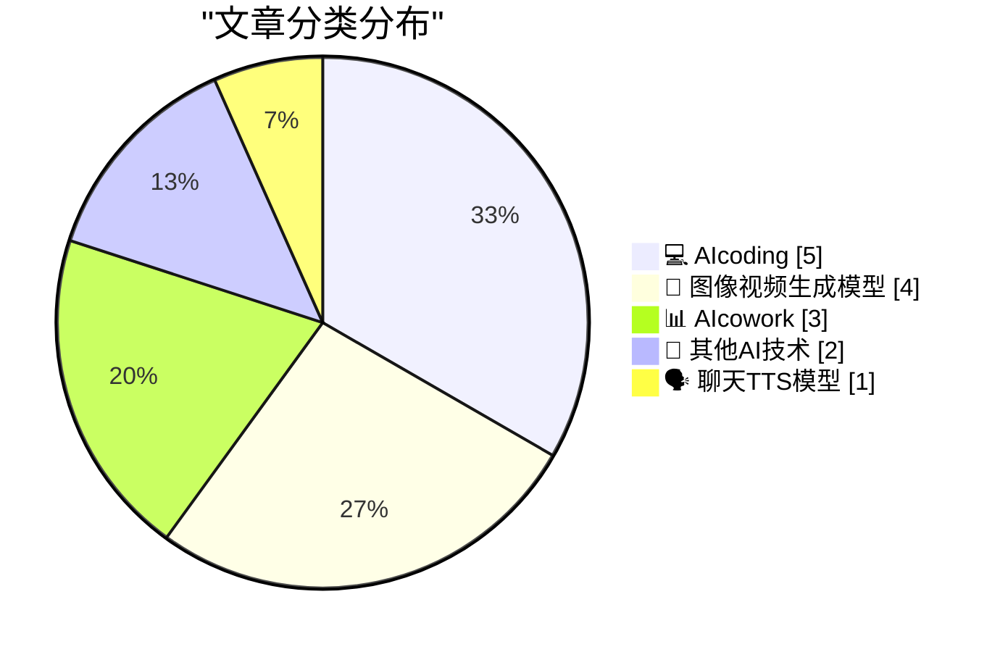
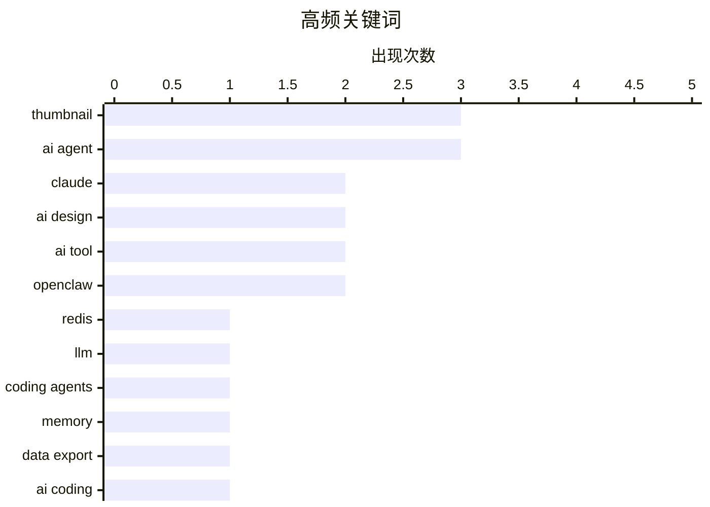

# 📰 AI 博客每日精选 — 2026-03-02

> 来自 99 个技术博客和社交媒体源，AI 精选 Top 15

## 📝 今日看点

今日技术圈聚焦于AI驱动的生产力革命与工具生态演进。以Thumio为代表的AI应用正以极低成本与惊人效率重塑设计、开发等传统工作流程，将耗时数日的任务压缩至分钟级。同时，Claude等AI智能体正深入实际工作场景，从代码编辑到系统运维，展现出向“AI协作者”演进的明确趋势。此外，顶尖开发者持续贡献核心资源与安全思考，如Redis创始人发布综合性编程指南，以及业界对自主代理安全架构的审慎探讨，共同推动着技术基础设施的成熟与规范。

---

## 🏆 今日必读

🥇 **Redis 编程模式**

[Redis patterns for coding](http://antirez.com/news/161) — antirez.com · 21 小时前 · 💻 AIcoding

> Redis 创始人 antirez 发布了一个面向开发者的综合性资源站点。该站点不仅包含 Redis 命令和数据类型的详尽文档，还提供了常用的编程模式、配置提示以及基于 Redis 命令构建的算法示例。其内容旨在帮助开发者和 AI 智能体更高效地使用 Redis 进行开发。作者强调，这些文档对人类开发者同样极具实用价值。

💡 **为什么值得读**: 这是来自 Redis 创始人的一手权威资料，对于希望深入理解 Redis 高级用法和最佳实践的开发者是不可多得的核心参考。

🏷️ Redis, LLM, Coding Agents

🥈 **引用 claude.com/import-memory**

[Quoting claude.com/import-memory](https://simonwillison.net/2026/Mar/1/claude-import-memory/#atom-everything) — simonwillison.net · 20 小时前 · 🗣️ 聊天TTS模型

> 文章引用了 Claude AI 的“导入记忆”功能的一段用户请求示例。用户要求 Claude 导出所有关于自己的记忆数据，包括对话历史和学到的上下文信息。请求指定了输出格式，要求以代码块形式呈现，并尽可能保留用户的原始指令。这展示了用户对 AI 数据可移植性和个人数据所有权的关注。

💡 **为什么值得读**: 该示例直观揭示了用户与 AI 交互时对数据主权和迁移能力的真实需求，是理解 AI 产品隐私与数据管理功能设计的重要案例。

🏷️ Claude, Memory, Data Export

🥉 **用 AI 在 6 小时内构建一个真实应用**

[Build a Real App with AI in 6 Hours](https://x.com/corbin_braun/status/2028226729467314264) — 𝕏 @corbin_braun · 9 小时前 · 💻 AIcoding

> 创作者 Corbin Braun 公开分享了其耗时 6 小时、使用 AI 工具构建估值百万美元的 AI 应用 Thumio 的完整过程。全程免费，无需注册，展示了使用 Google AI Studio 和 Cursor 等工具解决真实编码问题的实践。视频内容涵盖了从构思到实现的具体代码、遇到的真实问题及其解决方案。

💡 **为什么值得读**: 这是一个罕见的、无门槛的实战案例，为开发者提供了利用现有 AI 工具快速构建复杂应用的完整路线图和第一手经验。

🏷️ AI Coding, Cursor, Google AI Studio, Tutorial

4️⃣ **Claude 远程控制功能体验极佳**

[Claude Remote Control is extremely nice Can edit on MacOS or iOS in Claude app on my production server from anywhere A bit more friendly to the eyes t...](https://x.com/levelsio/status/2028211678194647447) — 𝕏 @levelsio · 10 小时前 · 💻 AIcoding

> Levelsio 分享了使用 Claude 远程控制功能在 MacOS 或 iOS 的 Claude 应用中直接编辑生产服务器文件的体验。他认为该界面比传统的 SSH 方式更友好。推文还附上了他自定义的、跳过权限检查的便捷命令（`c()` 函数），该命令以“yolo 模式”运行，提高了操作效率。

💡 **为什么值得读**: 通过资深开发者的实际工作流展示，揭示了 AI 工具如何从交互界面层面革新传统的服务器运维和开发方式。

🏷️ Claude, Remote Development, SSH

5️⃣ **Thumio：将缩略图设计成本从 100 美元降至 50 美分**

[this would of costed 100 dollars from a thumbnail designer and 3 day delivery. now it is only 50 cents and 5 minutes with Thumio. Let that sink in.](https://x.com/corbin_braun/status/2028131538513322031) — 𝕏 @corbin_braun · 15 小时前 · 🎨 图像视频生成模型

> Corbin Braun 展示了其 AI 应用 Thumio 在成本与效率上的颠覆性表现。传统上需要花费 100 美元并等待 3 天交付的缩略图设计，现在通过 Thumio 仅需 50 美分和 5 分钟即可完成。他特别指出，Thumio 刚刚集成了新的“Nano Banana 2”模型，预示着缩略图设计市场将面临巨大冲击。

💡 **为什么值得读**: 用具体数字量化了 AI 对传统设计行业的冲击力，直观展示了生产力与成本结构的革命性变化。

🏷️ Thumio, Thumbnail Generation, AI Design, Cost Saving

---

## 📊 数据概览

| 扫描源 | 抓取文章 | 时间范围 | 精选 |
|:---:|:---:|:---:|:---:|
| 86/99 | 2266 篇 → 56 篇 | 24h | **15 篇** |

### 分类分布



### 高频关键词



<details>
<summary>📈 纯文本关键词图（终端友好）</summary>

```
thumbnail     │ ████████████████████ 3
ai agent      │ ████████████████████ 3
claude        │ █████████████░░░░░░░ 2
ai design     │ █████████████░░░░░░░ 2
ai tool       │ █████████████░░░░░░░ 2
openclaw      │ █████████████░░░░░░░ 2
redis         │ ███████░░░░░░░░░░░░░ 1
llm           │ ███████░░░░░░░░░░░░░ 1
coding agents │ ███████░░░░░░░░░░░░░ 1
memory        │ ███████░░░░░░░░░░░░░ 1
```

</details>

### 🏷️ 话题标签

**thumbnail**(3) · **ai agent**(3) · **claude**(2) · ai design(2) · ai tool(2) · openclaw(2) · redis(1) · llm(1) · coding agents(1) · memory(1) · data export(1) · ai coding(1) · cursor(1) · google ai studio(1) · tutorial(1) · remote development(1) · ssh(1) · thumio(1) · thumbnail generation(1) · cost saving(1)

---

====================

## 💻 AIcoding

### 1. Redis 编程模式

[Redis patterns for coding](http://antirez.com/news/161) — **antirez.com** · 21 小时前 · ⭐ 24/25

> Redis 创始人 antirez 发布了一个面向开发者的综合性资源站点。该站点不仅包含 Redis 命令和数据类型的详尽文档，还提供了常用的编程模式、配置提示以及基于 Redis 命令构建的算法示例。其内容旨在帮助开发者和 AI 智能体更高效地使用 Redis 进行开发。作者强调，这些文档对人类开发者同样极具实用价值。

🏷️ Redis, LLM, Coding Agents

📌 AIcoding

---

### 2. 用 AI 在 6 小时内构建一个真实应用

[Build a Real App with AI in 6 Hours](https://x.com/corbin_braun/status/2028226729467314264) — **𝕏 @corbin_braun** · 9 小时前 · ⭐ 23/25

> 创作者 Corbin Braun 公开分享了其耗时 6 小时、使用 AI 工具构建估值百万美元的 AI 应用 Thumio 的完整过程。全程免费，无需注册，展示了使用 Google AI Studio 和 Cursor 等工具解决真实编码问题的实践。视频内容涵盖了从构思到实现的具体代码、遇到的真实问题及其解决方案。

🏷️ AI Coding, Cursor, Google AI Studio, Tutorial

📌 AIcoding

---

### 3. Claude 远程控制功能体验极佳

[Claude Remote Control is extremely nice Can edit on MacOS or iOS in Claude app on my production server from anywhere A bit more friendly to the eyes t...](https://x.com/levelsio/status/2028211678194647447) — **𝕏 @levelsio** · 10 小时前 · ⭐ 20/25

> Levelsio 分享了使用 Claude 远程控制功能在 MacOS 或 iOS 的 Claude 应用中直接编辑生产服务器文件的体验。他认为该界面比传统的 SSH 方式更友好。推文还附上了他自定义的、跳过权限检查的便捷命令（`c()` 函数），该命令以“yolo 模式”运行，提高了操作效率。

🏷️ Claude, Remote Development, SSH

📌 AIcoding

---

### 4. 关于自主代理修复错误日志的安全架构思考

[So @elvissun sent me some very helpful tips about this If I'd run this { autonomous agent that reads my error logs to fix } on the same VPS server as ...](https://x.com/levelsio/status/2028204279660744923) — **𝕏 @levelsio** · 11 小时前 · ⭐ 18/25

> Levelsio 讨论了运行能读取错误日志并自动修复的自主代理时面临的安全风险，特别是通过错误日志进行提示注入攻击的可能性。他提出了一种安全架构方案：将代理运行在独立的 VPS 上，仅授予其代码库的读取权限，并确保代码中不包含敏感数据，代理只能通过提交拉取请求（PR）来修复问题。

🏷️ Autonomous Agent, Prompt Injection, Security

📌 AIcoding

---

### 5. Naval：传统软件工程已死？恰恰相反，工程师正成为杠杆率最高的人群

[This quote hits hard. It's true.](https://x.com/rileybrown/status/2028327261251031137) — **𝕏 @rileybrown** · 2 小时前 · ⭐ 13/25

> 这条推文引用并认同了 Naval 关于 AI 时代软件工程价值的观点。核心论点是：传统软件工程并未因 AI 的兴起而消亡，相反，软件工程师（即使不直接从事 AI 模型训练）正成为地球上杠杆率最高的人群之一。AI 作为一种强大的工具，极大地放大了软件工程师将创意转化为现实、解决复杂问题和创造价值的能力。因此，工程师的角色不是被取代，而是被增强，其战略重要性进一步提升。

🏷️ Software Engineering, AI Future, Discussion

📌 AIcoding

---

## 🎨 图像视频生成模型

### 6. Thumio：将缩略图设计成本从 100 美元降至 50 美分

[this would of costed 100 dollars from a thumbnail designer and 3 day delivery. now it is only 50 cents and 5 minutes with Thumio. Let that sink in.](https://x.com/corbin_braun/status/2028131538513322031) — **𝕏 @corbin_braun** · 15 小时前 · ⭐ 20/25

> Corbin Braun 展示了其 AI 应用 Thumio 在成本与效率上的颠覆性表现。传统上需要花费 100 美元并等待 3 天交付的缩略图设计，现在通过 Thumio 仅需 50 美分和 5 分钟即可完成。他特别指出，Thumio 刚刚集成了新的“Nano Banana 2”模型，预示着缩略图设计市场将面临巨大冲击。

🏷️ Thumio, Thumbnail Generation, AI Design, Cost Saving

📌 图像视频生成模型

---

### 7. Thumio 在 20 秒内生成的惊人效果

[☠️ thumio what is this. how did you create this in just 20 seconds. what a joke 🤣](https://x.com/corbin_braun/status/2028240831199797517) — **𝕏 @corbin_braun** · 8 小时前 · ⭐ 18/25

> Corbin Braun 对 Thumio 的生成能力表示震惊，发布了一张由 Thumio 在短短 20 秒内创建的图像。推文以“这是个笑话吧🤣”表达了对生成速度与质量的难以置信，侧面印证了 AI 图像生成工具的高效和强大。

🏷️ Thumbnail, AI Generation, Speed

📌 图像视频生成模型

---

### 8. Thumio 以 10 美元成本在 2 小时内完成 15.7 万订阅频道的整体品牌重塑

[157K Subs on YouTube. and Thumio just rebranded my entire channel in 2 hours. and it costed me 10 USD. thumbnails go to 0.](https://x.com/corbin_braun/status/2028261944592073205) — **𝕏 @corbin_braun** · 7 小时前 · ⭐ 17/25

> Corbin Braun 拥有 15.7 万订阅者的 YouTube 频道，其整体品牌重塑工作由 Thumio 在 2 小时内完成，总成本仅为 10 美元。他再次强调“缩略图成本归零”，并附上了展示 rebranding 效果的视频。这进一步证明了 AI 工具在批量、高质量视觉设计任务上的巨大成本优势。

🏷️ Thumbnail, AI Tool, Rebranding

📌 图像视频生成模型

---

### 9. Thumio 的又一次经典胜利

[a classic Thumio W](https://x.com/corbin_braun/status/2028244065897382153) — **𝕏 @corbin_braun** · 8 小时前 · ⭐ 17/25

> 推文引用了一位设计师（Timi）的评论，指出缩略图设计已从耗时的照片处理和 Camera Raw 操作转变为简单的提示词工程。尽管许多人仍会因创意、构思和技术知识而外包或雇佣设计师，但 Timi 认为设计师尚未被完全取代，并打算寻找更多客户。Corbin Braun 将此称为“Thumio 的又一次经典胜利”。

🏷️ Thumbnail, AI Design, Prompt

📌 图像视频生成模型

---

## 📊 AIcowork

### 10. Brian Lovin：将自定义智能体视为指令、工具和触发器的组合包

[RT Brian Lovin: Re Think of the custom agent as a bundle of: - instructions - tools and resources - triggers You can chat with a custom agent, give it...](https://x.com/NotionHQ/status/2028219626837168538) — **𝕏 @NotionHQ** · 13 小时前 · ⭐ 18/25

> Brian Lovin 阐述了自定义智能体的核心构成，即指令、工具与资源、触发器的组合包。用户可以与智能体对话，通过工具授予其访问 Slack、GitHub 等权限，并基于 Notion 内部或外部应用（如特定 Slack 频道消息）的事件触发其行动。文中提到，Workers 是一个用于编写自定义工具的工具包，用于扩展智能体能力。

🏷️ AI Agent, Notion, Integration

📌 AIcowork

---

### 11. Riley Brown：经过 200 小时测试 OpenClaw 后的核心洞见

[For those who like the YouTube https://youtu.be/ISb0nrlNoKQ](https://x.com/rileybrown/status/2028294329174028667) — **𝕏 @rileybrown** · 5 小时前 · ⭐ 16/25

> 作者分享了投入 200 小时测试 OpenClaw AI 代理框架后的核心经验。关键发现是：与其构建一个功能庞杂的“全能”代理，不如让每个代理保持专注、执行特定任务，并组建一个分工明确的代理团队。视频内容涵盖了从 Perplexity Computer、Manus 工具的使用，到初期因技能过多导致代理效率低下的教训，再到测试专注型代理（如 YouTube 专用代理）的优势。结论是，一个由多个专注型代理组成的团队架构，比单一复杂代理更高效、更实用。

🏷️ AI Agent, OpenClaw, Workflow

📌 AIcowork

---

### 12. Riley Brown 转发：测试 OpenClaw 200 小时的核心收获

[RT Riley Brown: I spent 200 hours testing OpenClaw, trying to find the perfect setup... My biggest takeaway: Keep your agents focused, and build a tea...](https://x.com/rileybrown/status/2028294231065002154) — **𝕏 @rileybrown** · 9 小时前 · ⭐ 16/25

> 这是对上一推文核心观点的转发和强调，内容高度一致。核心结论是构建 AI 代理系统的关键原则：保持代理的专注性，并组建团队协同工作。视频大纲进一步细化了这一观点，展示了从全能代理到专注代理的思维转变过程，并举例说明了像 YouTube 代理这样的窄域代理如何运作。最终论证了由多个专注型代理组成的团队架构，在复杂任务处理上更具优势。

🏷️ AI Agent, OpenClaw, Teamwork

📌 AIcowork

---

## 🔬 其他AI技术

### 13. Sentry iOS 实战工作坊：崩溃报告、追踪与日志

[Sentry](https://sentry.io/resources/ios-workshop-jan-2026/?utm_source=daringfireball&amp;utm_medium=paid-display&amp;utm_campaign=general-fy27q1-evergreen&amp;utm_content=static-ad-mobilerss-trysentry) — **daringfireball.net** · 15 小时前 · ⭐ 16/25

> 这是一个关于在 iOS 应用中集成 Sentry 监控工具的实战工作坊。核心内容是学习如何将应用性能下降、崩溃与用户体验关联起来进行综合分析。工作坊将演示如何配置 Sentry 以精准发现高优先级问题，避免警报疲劳；利用日志和面包屑功能重建崩溃现场；并使用性能追踪工具定位瓶颈根源。最终目标是帮助开发者建立一套完整的应用可观测性体系，以提升应用稳定性和用户体验。

🏷️ Sentry, iOS, Monitoring

📌 其他AI技术

---

### 14. Corbin Braun 的讽刺对比：Thumio 与 TechSnif 的开发成本与收益

[want to hear something ironic. thumio took me 3 months to build, 250K+ lines of code, and is costly to maintain as I keep scaling with more users. tec...](https://x.com/corbin_braun/status/2028246617636417872) — **𝕏 @corbin_braun** · 8 小时前 · ⭐ 14/25

> 作者通过对比两个亲身项目，揭示了软件工程中投入与回报的不对称现象。Thumio 项目耗时 3 个月、代码超 25 万行，且随着用户增长维护成本高昂；而 TechSnif 项目仅用 9 天、1.5 万行代码完成，每月运行成本仅 30-40 美元。然而，具有讽刺意味的是，作者预测从长远看，轻量级的 TechSnif 将比重型的 Thumio 创造更多收入。这一对比突显了产品市场契合度、开发效率和运维成本对项目成功的关键影响，远胜于单纯的代码规模或开发时长。

🏷️ AI Tool, Development, Scaling

📌 其他AI技术

---

## 🗣️ 聊天TTS模型

### 15. 引用 claude.com/import-memory

[Quoting claude.com/import-memory](https://simonwillison.net/2026/Mar/1/claude-import-memory/#atom-everything) — **simonwillison.net** · 20 小时前 · ⭐ 23/25

> 文章引用了 Claude AI 的“导入记忆”功能的一段用户请求示例。用户要求 Claude 导出所有关于自己的记忆数据，包括对话历史和学到的上下文信息。请求指定了输出格式，要求以代码块形式呈现，并尽可能保留用户的原始指令。这展示了用户对 AI 数据可移植性和个人数据所有权的关注。

🏷️ Claude, Memory, Data Export

📌 聊天TTS模型

---

====================

*生成于 2026-03-02 07:29 | 扫描 86 源 → 获取 2266 篇 → 精选 15 篇*
*基于 [Hacker News Popularity Contest 2025](https://refactoringenglish.com/tools/hn-popularity/) RSS 源列表，由 [Andrej Karpathy](https://x.com/karpathy) 推荐*
*由「懂点儿AI」制作，欢迎关注同名微信公众号获取更多 AI 实用技巧 💡*
