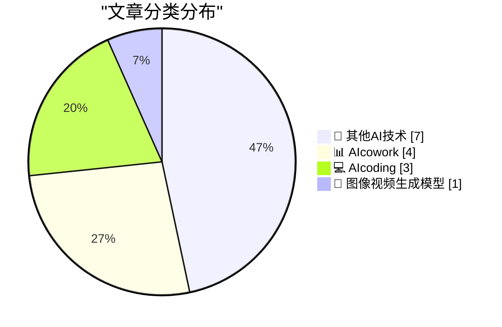
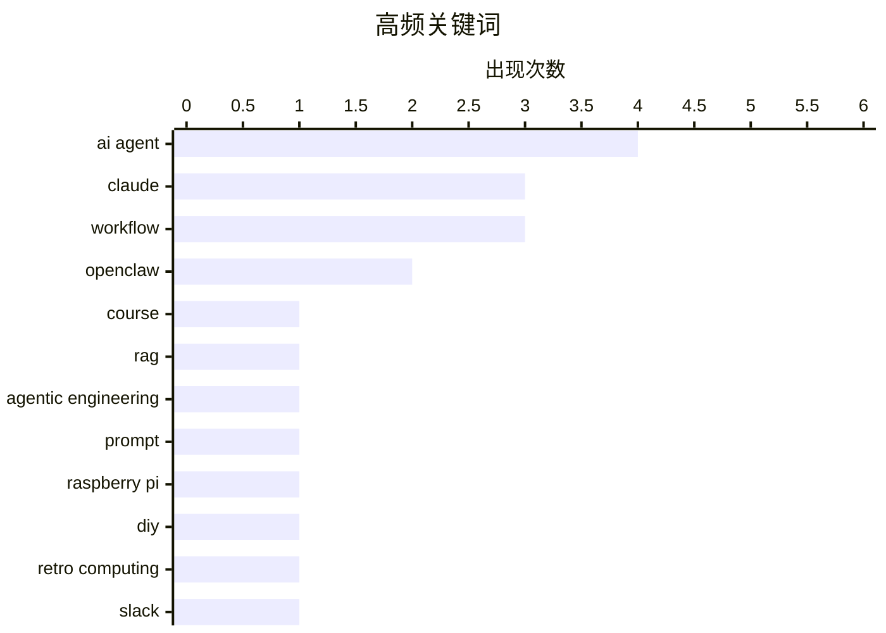

# 📰 AI 博客每日精选 — 2026-03-02

> 来自 97 个技术博客和社交媒体源，AI 精选 Top 15

## 📝 今日看点

今日技术圈聚焦于AI智能体架构的演进与AI工具生态的深化。一方面，构建高效AI智能体的核心理念转向设计功能专注的“窄域”智能体，并通过团队化协作来提升整体效能。另一方面，主流AI厂商正积极推动开发者生态建设，通过发布官方课程与集成生产力工具，降低AI应用开发门槛。同时，将经典系统设计哲学（如Unix“万物皆文件”）应用于AI架构的探索，也展现了技术思想的跨时代融合。

---

## 🏆 今日必读

🥇 **别再满足于随机的YouTube教程了：Anthropic发布了免费的Claude构建课程**

[RT God of Prompt: stop satisfying yourself with random youtube tutorials. Anthropic just released free courses on building with Claude. with certifica...](https://x.com/godofprompt/status/2028483916269510866) — 𝕏 @godofprompt · 15 小时前 · 💻 AIcoding

> Anthropic官方推出了免费的Claude应用开发系列课程，并提供结业证书。课程内容涵盖提示工程、工具使用、检索增强生成（RAG）和评估等核心主题。与网络上非官方的教程不同，这些课程由模型创造者亲自构建，确保了内容的权威性和深度。课程完全免费，旨在为开发者提供体系化的学习路径。这为希望掌握Claude API和Agentic AI开发的开发者提供了一个宝贵且可靠的学习资源。

💡 **为什么值得读**: 这是由模型创造者官方出品、体系化且免费的权威课程，能帮你绕过质量参差不齐的第三方教程，直接掌握最核心的开发技能。

🏷️ Claude, Course, RAG

🥈 **为我的Agentic工程指南新增带注释的提示词章节**

[I started a new section of my Agentic Engineering guide for annotated versions of prompts I've used for projects - the first is a prompt I used to hav...](https://x.com/simonw/status/2028509862422835233) — 𝕏 @simonw · 4 小时前 · 💻 AIcoding

> 作者在其《Agentic工程指南》中新增了一个章节，专门分享他在实际项目中使用的、带有详细注释的提示词。首个案例是一个用于命令Claude Code构建Web UI的提示词，该UI通过WebAssembly版本的Gifsicle工具来压缩GIF动图。这个章节旨在提供可复用的、经过实战检验的提示词模式，并解释其设计思路。通过剖析具体案例，帮助读者理解如何设计有效的提示词来解决实际问题。

💡 **为什么值得读**: 通过一个具体的GIF压缩Web UI项目，展示了如何编写可执行复杂任务的实用提示词，是学习提示工程实战技巧的绝佳范例。

🏷️ Agentic Engineering, Prompt, Claude

🥉 **我打造了一台迷你版麦金塔电脑**

[I built a pint-sized Macintosh](https://www.jeffgeerling.com/blog/2026/pint-sized-macintosh-pico-micro-mac/) — jeffgeerling.com · 18 分钟前 · 🔬 其他AI技术

> 作者为响应MARCHintosh活动，使用树莓派Pico微控制器组装了一台微型麦金塔电脑。这台被称为“Pico Micro Mac”的设备并非原创设计，而是基于Matt Evans的开源项目构建。它成功运行了经典的System 5.3操作系统，并展示了完整的系统文件夹界面。该项目展示了利用现代廉价硬件复刻经典计算机系统的可行性和趣味性。

💡 **为什么值得读**: 这是一个将复古计算情怀与现代开源硬件（树莓派Pico）相结合的酷炫DIY项目，步骤清晰，极具启发性和可玩性。

🏷️ Raspberry Pi, DIY, Retro Computing

4️⃣ **在Slack内将任何文档转化为即时、可操作的见解**

[💡What if you could turn any document into instant, actionable insights – right inside Slack. With Slackbot, just drop in your file, ask for what y...](https://x.com/SlackHQ/status/2028476762695344542) — 𝕏 @SlackHQ · 7 小时前 · 📊 AIcowork

> Slack推出了Slackbot的新功能，允许用户直接在Slack工作区内对上传的文档进行智能分析。用户只需拖入文件并向Slackbot提问，即可在几秒钟内获得详细分析，例如即时摘要、风险提示、后续步骤等可操作的见解。该功能旨在将AI分析深度集成到工作流中，提升团队的信息处理效率。它代表了将生成式AI能力无缝嵌入日常协作工具的趋势。

💡 **为什么值得读**: 展示了AI如何从独立工具演变为深度嵌入核心工作流（如Slack）的“工作伙伴”，是观察企业级AI应用落地的生动案例。

🏷️ Slack, Document Analysis, Workflow

5️⃣ **为Auth0添加“使用Mastodon登录”功能**

[Adding "Log In With Mastodon" to Auth0](https://shkspr.mobi/blog/2026/03/adding-log-in-with-mastodon-to-auth0/) — shkspr.mobi · 8 小时前 · 🔬 其他AI技术

> 作者为OpenBenches网站使用Auth0管理社交登录，但发现Auth0原生不支持去中心化社交网络Mastodon。文章记录了如何克服这一限制，为Auth0成功集成Mastodon登录的解决方案。这个过程避免了自行管理用户账户和密码的复杂性，延续了使用第三方身份验证服务的便利性。最终实现了在Auth0平台上扩展非主流社交登录选项的目标。

💡 **为什么值得读**: 为解决一个具体的、Auth0官方尚未支持的第三方登录集成需求提供了实战指南，对需要集成小众或新兴平台登录的开发者有直接参考价值。

🏷️ Auth0, OAuth, Mastodon

---

## 📊 数据概览

| 扫描源 | 抓取文章 | 时间范围 | 精选 |
|:---:|:---:|:---:|:---:|
| 86/97 | 2177 篇 → 74 篇 | 24h | **15 篇** |

### 分类分布



### 高频关键词



<details>
<summary>📈 纯文本关键词图（终端友好）</summary>

```
ai agent            │ ████████████████████ 4
claude              │ ███████████████░░░░░ 3
workflow            │ ███████████████░░░░░ 3
openclaw            │ ██████████░░░░░░░░░░ 2
course              │ █████░░░░░░░░░░░░░░░ 1
rag                 │ █████░░░░░░░░░░░░░░░ 1
agentic engineering │ █████░░░░░░░░░░░░░░░ 1
prompt              │ █████░░░░░░░░░░░░░░░ 1
raspberry pi        │ █████░░░░░░░░░░░░░░░ 1
diy                 │ █████░░░░░░░░░░░░░░░ 1
```

</details>

### 🏷️ 话题标签

**ai agent**(4) · **claude**(3) · **workflow**(3) · openclaw(2) · course(1) · rag(1) · agentic engineering(1) · prompt(1) · raspberry pi(1) · diy(1) · retro computing(1) · slack(1) · document analysis(1) · auth0(1) · oauth(1) · mastodon(1) · agent(1) · memory(1) · filesystem(1) · team(1)

---

====================

## 🔬 其他AI技术

### 1. 我打造了一台迷你版麦金塔电脑

[I built a pint-sized Macintosh](https://www.jeffgeerling.com/blog/2026/pint-sized-macintosh-pico-micro-mac/) — **jeffgeerling.com** · 18 分钟前 · ⭐ 21/25

> 作者为响应MARCHintosh活动，使用树莓派Pico微控制器组装了一台微型麦金塔电脑。这台被称为“Pico Micro Mac”的设备并非原创设计，而是基于Matt Evans的开源项目构建。它成功运行了经典的System 5.3操作系统，并展示了完整的系统文件夹界面。该项目展示了利用现代廉价硬件复刻经典计算机系统的可行性和趣味性。

🏷️ Raspberry Pi, DIY, Retro Computing

📌 其他AI技术

---

### 2. 为Auth0添加“使用Mastodon登录”功能

[Adding "Log In With Mastodon" to Auth0](https://shkspr.mobi/blog/2026/03/adding-log-in-with-mastodon-to-auth0/) — **shkspr.mobi** · 8 小时前 · ⭐ 19/25

> 作者为OpenBenches网站使用Auth0管理社交登录，但发现Auth0原生不支持去中心化社交网络Mastodon。文章记录了如何克服这一限制，为Auth0成功集成Mastodon登录的解决方案。这个过程避免了自行管理用户账户和密码的复杂性，延续了使用第三方身份验证服务的便利性。最终实现了在Auth0平台上扩展非主流社交登录选项的目标。

🏷️ Auth0, OAuth, Mastodon

📌 其他AI技术

---

### 3. 从“万物皆文件”到“万物皆上下文”：将最古老的Unix原则应用于最新的AI问题

[RT God of Prompt: "everything is a file" becomes "everything is context." CSIRO Data61 and ArcBlock published a paper applying the oldest Unix princip...](https://x.com/godofprompt/status/2028583693795877048) — **𝕏 @godofprompt** · 6 小时前 · ⭐ 19/25

> CSIRO Data61和ArcBlock的研究人员发表了一篇论文，将Unix的经典设计哲学“万物皆文件”应用于AI智能体架构。他们提出将内存、工具、知识和人类输入视为一个挂载的文件系统，供智能体在运行时动态浏览，而非在启动时全部塞入有限的上下文窗口。这是一篇关于软件架构而非机器学习的论文，其核心是通过改进系统设计来更高效地管理和利用上下文。作者认为，这种架构层面的创新可能比当前多数纯粹的ML研究更具实际影响力。

🏷️ Agent, Memory, Filesystem

📌 其他AI技术

---

### 4. RT: 经过200小时测试OpenClaw后的最大收获：保持智能体专注，并组建团队

[RT Riley Brown: I spent 200 hours testing OpenClaw, trying to find the perfect setup... My biggest takeaway: Keep your agents focused, and build a tea...](https://x.com/rileybrown/status/2028294231065002154) — **𝕏 @rileybrown** · 23 小时前 · ⭐ 18/25

> 此推文是索引6内容的转发和更详细展开。核心观点是经过对OpenClaw等AI智能体框架的长时间测试，构建“全能”智能体往往效率低下。正确的做法是设计功能聚焦的“窄域”智能体，并让它们以团队形式协作。视频详细记录了测试过程，包括与Perplexity Computer、Manus的对比，并给出了YouTube分析智能体等具体案例。最终结论强调了智能体的“意图”明确性和团队协作架构的重要性。

🏷️ AI Agent, OpenClaw, Team

📌 其他AI技术

---

### 5. ChangeTheHeaders：解决从Safari拖拽图片意外获得WebP格式的问题

[ChangeTheHeaders](https://underpassapp.com/news/2025/3/4.html) — **daringfireball.net** · 22 分钟前 · ⭐ 17/25

> 文章讨论了一个具体问题：从Safari浏览器拖拽网页图片时，有时会意外地得到WebP格式文件，而非期望的PNG或JPEG格式，这对需要特定格式发布的用户造成困扰。问题的根源在于Safari发送的HTTP请求头（`Accept`）表明它支持WebP，导致服务器优先返回此格式。作者为此开发了一个名为“ChangeTheHeaders”的macOS应用，通过修改Safari发出的请求头，从根本上解决此问题，确保获取兼容性更佳的图像格式。

🏷️ Safari, WebP, Image Format

📌 其他AI技术

---

### 6. Surprise new feature in Telegram, inspired OpenClaw et al using Telegram as a UI Anyone know how well this work with screen readers? I'm still not con...

[Surprise new feature in Telegram, inspired OpenClaw et al using Telegram as a UI Anyone know how well this work with screen readers? I'm still not con...](https://x.com/simonw/status/2028495592238752183) — **𝕏 @simonw** · 5 小时前 · ⭐ 17/25

> Surprise new feature in Telegram, inspired OpenClaw et al using Telegram as a UI<br><br>Anyone know how well this work with screen readers? I'm still not confident I know how to make streaming chat UI

🏷️ Telegram, UI, Accessibility

📌 其他AI技术

---

### 7. Stop thinking about prompting AI agents... Start thinking about giving agents a clear purpose... And then supporting their purpose with aligned skills...

[Stop thinking about prompting AI agents... Start thinking about giving agents a clear purpose... And then supporting their purpose with aligned skills...](https://x.com/rileybrown/status/2028235593990406345) — **𝕏 @rileybrown** · 23 小时前 · ⭐ 14/25

> Stop thinking about prompting AI agents...<br>Start thinking about giving agents a clear purpose...<br><br>And then supporting their purpose with aligned skills, integrations, tasks, and personalities

🏷️ AI Agent, Purpose, Skills

📌 其他AI技术

---

## 📊 AIcowork

### 8. 在Slack内将任何文档转化为即时、可操作的见解

[💡What if you could turn any document into instant, actionable insights – right inside Slack. With Slackbot, just drop in your file, ask for what y...](https://x.com/SlackHQ/status/2028476762695344542) — **𝕏 @SlackHQ** · 7 小时前 · ⭐ 20/25

> Slack推出了Slackbot的新功能，允许用户直接在Slack工作区内对上传的文档进行智能分析。用户只需拖入文件并向Slackbot提问，即可在几秒钟内获得详细分析，例如即时摘要、风险提示、后续步骤等可操作的见解。该功能旨在将AI分析深度集成到工作流中，提升团队的信息处理效率。它代表了将生成式AI能力无缝嵌入日常协作工具的趋势。

🏷️ Slack, Document Analysis, Workflow

📌 AIcowork

---

### 9. 经过200小时测试OpenClaw后的最大收获：保持智能体专注，并组建团队

[For those who like the YouTube https://youtu.be/ISb0nrlNoKQ](https://x.com/rileybrown/status/2028294329174028667) — **𝕏 @rileybrown** · 19 小时前 · ⭐ 18/25

> 作者通过200小时测试AI智能体框架OpenClaw，总结出构建高效AI智能体的核心经验。最大的收获是：应该让单个智能体保持高度专注，执行特定任务，而非打造功能庞杂的“全能”智能体。更有效的模式是组建一个由多个“窄域”智能体协同工作的团队，例如专精YouTube分析的智能体。视频内容涵盖了从Perplexity Computer、Manus到OpenClaw的测试对比，并举例说明了窄域智能体的工作方式。

🏷️ AI Agent, Workflow, OpenClaw

📌 AIcowork

---

### 10. Sent the February edition of my sponsors-only newsletter - a summary of my last month of blogging for people who want to pay for a shorter version I u...

[Sent the February edition of my sponsors-only newsletter - a summary of my last month of blogging for people who want to pay for a shorter version I u...](https://x.com/simonw/status/2028485332094558327) — **𝕏 @simonw** · 6 小时前 · ⭐ 17/25

> Sent the February edition of my sponsors-only newsletter - a summary of my last month of blogging for people who want to pay for a shorter version<br><br>I use Claude as a proofreader and fact checker

🏷️ Claude, Proofreading, Workflow

📌 AIcowork

---

### 11. RT saya: For the next 5 days, Saya’s Socialite (my AI teammate) will run an X takeover 🫣 I’m solo parenting this week and my P0s are figuring out...

[RT saya: For the next 5 days, Saya’s Socialite (my AI teammate) will run an X takeover 🫣 I’m solo parenting this week and my P0s are figuring out...](https://x.com/NotionHQ/status/2028500300353642952) — **𝕏 @NotionHQ** · 5 小时前 · ⭐ 14/25

> RT saya<br>For the next 5 days, Saya’s Socialite (my AI teammate) will run an X takeover 🫣 <br><br>I’m solo parenting this week and my P0s are figuring out what my 2-year-old is going to eat for dinn

🏷️ AI Agent, Social Media, Automation

📌 AIcowork

---

## 💻 AIcoding

### 12. 别再满足于随机的YouTube教程了：Anthropic发布了免费的Claude构建课程

[RT God of Prompt: stop satisfying yourself with random youtube tutorials. Anthropic just released free courses on building with Claude. with certifica...](https://x.com/godofprompt/status/2028483916269510866) — **𝕏 @godofprompt** · 15 小时前 · ⭐ 23/25

> Anthropic官方推出了免费的Claude应用开发系列课程，并提供结业证书。课程内容涵盖提示工程、工具使用、检索增强生成（RAG）和评估等核心主题。与网络上非官方的教程不同，这些课程由模型创造者亲自构建，确保了内容的权威性和深度。课程完全免费，旨在为开发者提供体系化的学习路径。这为希望掌握Claude API和Agentic AI开发的开发者提供了一个宝贵且可靠的学习资源。

🏷️ Claude, Course, RAG

📌 AIcoding

---

### 13. 为我的Agentic工程指南新增带注释的提示词章节

[I started a new section of my Agentic Engineering guide for annotated versions of prompts I've used for projects - the first is a prompt I used to hav...](https://x.com/simonw/status/2028509862422835233) — **𝕏 @simonw** · 4 小时前 · ⭐ 22/25

> 作者在其《Agentic工程指南》中新增了一个章节，专门分享他在实际项目中使用的、带有详细注释的提示词。首个案例是一个用于命令Claude Code构建Web UI的提示词，该UI通过WebAssembly版本的Gifsicle工具来压缩GIF动图。这个章节旨在提供可复用的、经过实战检验的提示词模式，并解释其设计思路。通过剖析具体案例，帮助读者理解如何设计有效的提示词来解决实际问题。

🏷️ Agentic Engineering, Prompt, Claude

📌 AIcoding

---

### 14. 如果我的对话框里有一个ID为IDCANCEL的非按钮控件，会发生什么可怕的事情？

[What sort of horrible things happen if my dialog has a non-button with the control ID of IDCANCEL?](https://devblogs.microsoft.com/oldnewthing/20260302-53/?p=112098) — **devblogs.microsoft.com/oldnewthing** · 37 分钟前 · ⭐ 17/25

> 这篇技术短文探讨了Windows对话框编程中一个特定边界情况：如果一个非按钮控件（如静态文本或编辑框）被错误地赋予了标准按钮控件ID `IDCANCEL`（通常用于“取消”按钮）会产生什么后果。核心答案是：系统会向该控件发送一些它无法理解或不应处理的通知消息，可能导致不可预知或令人困惑的行为。文章旨在提醒开发者遵循控件ID的约定，避免此类设计错误，以确保对话框消息路由的正确性。

🏷️ Windows API, Dialog Box, IDCANCEL

📌 AIcoding

---

## 🎨 图像视频生成模型

### 15. 157K Subs on YouTube. and Thumio just rebranded my entire channel in 2 hours. and it costed me 10 USD. thumbnails go to 0.

[157K Subs on YouTube. and Thumio just rebranded my entire channel in 2 hours. and it costed me 10 USD. thumbnails go to 0.](https://x.com/corbin_braun/status/2028261944592073205) — **𝕏 @corbin_braun** · 21 小时前 · ⭐ 13/25

> 157K Subs on YouTube.<br><br>and Thumio just rebranded my entire channel in 2 hours.<br><br>and it costed me 10 USD.<br><br>thumbnails go to 0.<br><video width="2048" height="1152" src="https://video.

🏷️ Thumbnail, AI Tool, Rebranding

📌 图像视频生成模型

---

====================

*生成于 2026-03-02 21:33 | 扫描 86 源 → 获取 2177 篇 → 精选 15 篇*
*基于 [Hacker News Popularity Contest 2025](https://refactoringenglish.com/tools/hn-popularity/) RSS 源列表，由 [Andrej Karpathy](https://x.com/karpathy) 推荐*
*由「懂点儿AI」制作，欢迎关注同名微信公众号获取更多 AI 实用技巧 💡*
