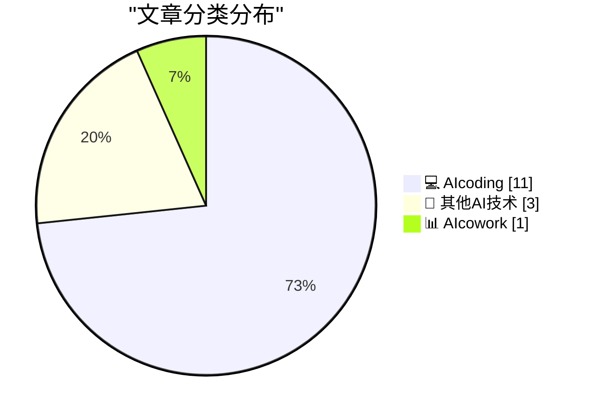
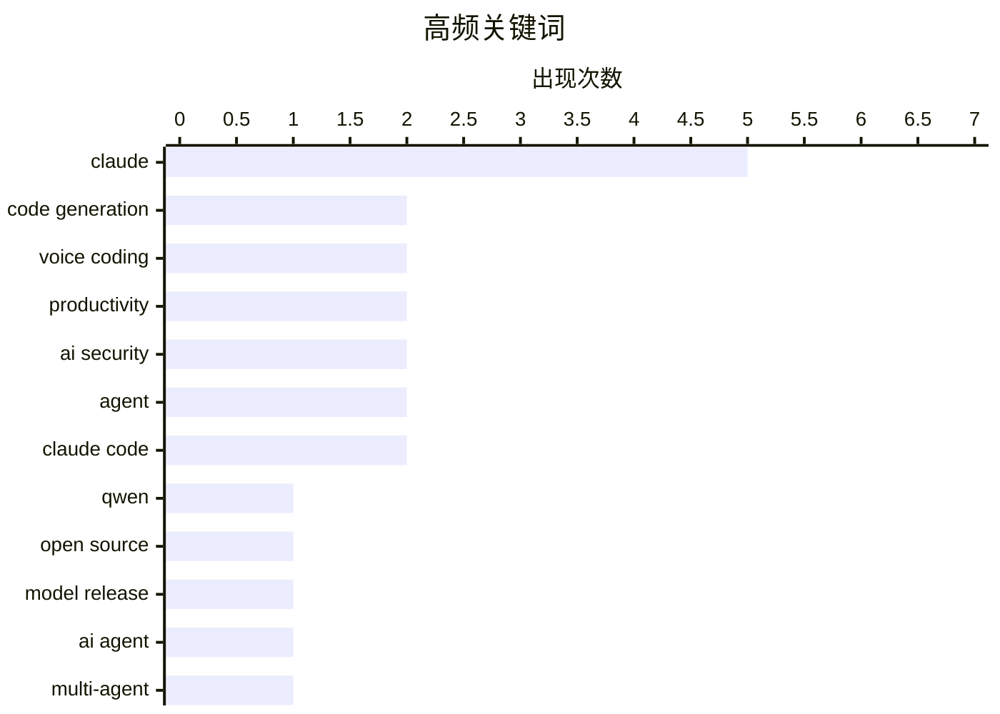

# 📰 AI 博客每日精选 — 2026-03-03

> 来自 98 个技术博客和社交媒体源，AI 精选 Top 15

## 📝 今日看点

今日技术圈聚焦于AI能力的突破与开发范式的革新。一方面，大模型性能与效率的边界被重新定义，小尺寸模型展现出匹敌巨头的惊人表现。另一方面，AI编程正从代码生成迈向深度集成与流程自动化，语音交互、智能体协作与成本控制成为提升开发效率的关键。同时，针对AI智能体的安全防护实践也日益受到重视。

---

## 🏆 今日必读

🥇 **通义千问发布四款新模型，性能对比令人震惊**

[RT God of Prompt: Qwen just dropped 4 new models and the math doesn’t make sense. > 4B nearly matches their previous 80B A3B > 9B rivals GPT OSS 120B...](https://x.com/godofprompt/status/2028767127310622785) — 𝕏 @godofprompt · 21 小时前 · 🔬 其他AI技术

> 通义千问（Qwen）最新发布了四款开源模型，其性能与尺寸的对比关系打破了常规认知。其中，4B参数模型性能接近其前代80B的A3B模型，而9B模型在尺寸仅为对手1/13的情况下，性能可匹敌GPT开源120B模型。此外，0.8B和2B模型可直接在手机上离线运行。所有模型均免费、开源且支持离线使用。

💡 **为什么值得读**: 该消息揭示了当前大模型小型化与性能突破的最新进展，对于关注模型部署成本与效率的开发者具有重要参考价值。

🏷️ Qwen, Open Source, Model Release

🥈 **npx workos：一个能将认证代码直接写入你代码库的AI助手**

[[Sponsor] npx workos: An AI Agent That Writes Auth Directly Into Your Codebase](https://workos.com/docs/authkit/cli-installer?utm_source=tldrdev&amp;utm_medium=newsletter&amp;utm_campaign=q12026) — daringfireball.net · 21 小时前 · 💻 AIcoding

> WorkOS发布了一款由Claude驱动的AI助手，旨在自动化集成身份认证功能。该助手并非简单的模板生成器，而是通过读取项目代码、识别技术栈，然后编写出与现有代码库完全契合的认证集成代码。它会进行类型检查和构建，并将任何错误反馈给自己进行修复。

💡 **为什么值得读**: 它展示了AI如何深入理解具体项目上下文并生成定制化代码，为开发者解决繁琐的集成工作提供了新思路。

🏷️ AI Agent, Code Generation, Claude

🥉 **AI编程的瓶颈从来不是模型智能，而是输入摩擦**

[The bottleneck in AI-assisted coding was never the model’s intelligence. It was input friction. Humans speak at 150 words per minute. They type at 40...](https://x.com/godofprompt/status/2028767089457041609) — 𝕏 @godofprompt · 11 小时前 · 💻 AIcoding

> AI辅助编程的主要瓶颈在于人类输入指令的效率低下，而非模型本身的能力。人类说话速度（150词/分钟）是打字速度（40词/分钟）的3.7倍。Claude Code的语音模式通过按住空格键说话并释放的方式，消除了这一输入摩擦，允许开发者通过口述描述问题，由AI执行编写。

💡 **为什么值得读**: 它点明了提升AI生产力的关键方向——优化人机交互界面，而非一味追求模型参数增长。

🏷️ Claude, Voice Coding, Productivity

4️⃣ **为AI Agent植入“思想钢印”：慢雾发布安全防护实践指南**

[上一条聊了 AI agent 的攻击面，这条是防御方案。 慢雾这份指南思路很清晰：给 agent 植入一个安全规范文档（余弦老师叫它"思想钢印"），覆盖事前拦截、事中收窄...](https://x.com/runes_leo/status/2028821694735905049) — 𝕏 @runes_leo · 8 小时前 · 💻 AIcoding

> 针对AI Agent的安全攻击面，慢雾提出了一套植入安全规范文档（称为“思想钢印”）的防御方案。该方案覆盖事前拦截、事中收窄和事后巡检，并采用红线（必须人工确认）与黄线（可执行但强制记录）的分级处理机制，比简单的二值拦截更精细。在加密场景中，核心原则是Agent只构造交易数据，签名必须由人类在独立钱包完成，私钥永不经过Agent。

💡 **为什么值得读**: 该指南为日益普及的AI Agent提供了具体、可操作的安全防护框架，对开发者和企业安全实践至关重要。

🏷️ AI Security, Agent, Claude

5️⃣ **利用Claude Code搭建四智能体内容生产流水线**

[这哥们用 Claude Code 搭了个 4-Agent 内容流水线： Research 拉推文存库 → Ideate 生成 hook 创意 → Write 按个人风格出稿 → Orchestrator 编排调度。 每个 ...](https://x.com/runes_leo/status/2028728565936865370) — 𝕏 @runes_leo · 14 小时前 · 💻 AIcoding

> 有开发者使用Claude Code搭建了一个由四个智能体（Research, Ideate, Write, Orchestrator）组成的内容生产流水线，实现了从拉取推文、生成创意、按风格撰稿到编排调度的全自动化。每个智能体具备持久记忆能力，例如Writer能记住用户过去的反馈。实践发现，生成（Write）环节最容易，而研究（Research）环节的信息过滤（信噪比）才是整个流程的瓶颈。

💡 **为什么值得读**: 它提供了一个具体的多智能体协作案例，揭示了在自动化流程中，数据预处理和过滤逻辑往往比内容生成本身更具挑战性。

🏷️ Multi-Agent, Claude, Content Pipeline

---

## 📊 数据概览

| 扫描源 | 抓取文章 | 时间范围 | 精选 |
|:---:|:---:|:---:|:---:|
| 89/98 | 2227 篇 → 73 篇 | 24h | **15 篇** |

### 分类分布



### 高频关键词



<details>
<summary>📈 纯文本关键词图（终端友好）</summary>

```
claude          │ ████████████████████ 5
code generation │ ████████░░░░░░░░░░░░ 2
voice coding    │ ████████░░░░░░░░░░░░ 2
productivity    │ ████████░░░░░░░░░░░░ 2
ai security     │ ████████░░░░░░░░░░░░ 2
agent           │ ████████░░░░░░░░░░░░ 2
claude code     │ ████████░░░░░░░░░░░░ 2
qwen            │ ████░░░░░░░░░░░░░░░░ 1
open source     │ ████░░░░░░░░░░░░░░░░ 1
model release   │ ████░░░░░░░░░░░░░░░░ 1
```

</details>

### 🏷️ 话题标签

**claude**(5) · **code generation**(2) · **voice coding**(2) · productivity(2) · ai security(2) · agent(2) · claude code(2) · qwen(1) · open source(1) · model release(1) · ai agent(1) · multi-agent(1) · content pipeline(1) · codex(1) · efficiency(1) · ai assistant(1) · claude sonnet(1) · no-code(1) · notion(1) · sidebar(1)

---

====================

## 💻 AIcoding

### 1. npx workos：一个能将认证代码直接写入你代码库的AI助手

[[Sponsor] npx workos: An AI Agent That Writes Auth Directly Into Your Codebase](https://workos.com/docs/authkit/cli-installer?utm_source=tldrdev&amp;utm_medium=newsletter&amp;utm_campaign=q12026) — **daringfireball.net** · 21 小时前 · ⭐ 22/25

> WorkOS发布了一款由Claude驱动的AI助手，旨在自动化集成身份认证功能。该助手并非简单的模板生成器，而是通过读取项目代码、识别技术栈，然后编写出与现有代码库完全契合的认证集成代码。它会进行类型检查和构建，并将任何错误反馈给自己进行修复。

🏷️ AI Agent, Code Generation, Claude

📌 AIcoding

---

### 2. AI编程的瓶颈从来不是模型智能，而是输入摩擦

[The bottleneck in AI-assisted coding was never the model’s intelligence. It was input friction. Humans speak at 150 words per minute. They type at 40...](https://x.com/godofprompt/status/2028767089457041609) — **𝕏 @godofprompt** · 11 小时前 · ⭐ 21/25

> AI辅助编程的主要瓶颈在于人类输入指令的效率低下，而非模型本身的能力。人类说话速度（150词/分钟）是打字速度（40词/分钟）的3.7倍。Claude Code的语音模式通过按住空格键说话并释放的方式，消除了这一输入摩擦，允许开发者通过口述描述问题，由AI执行编写。

🏷️ Claude, Voice Coding, Productivity

📌 AIcoding

---

### 3. 为AI Agent植入“思想钢印”：慢雾发布安全防护实践指南

[上一条聊了 AI agent 的攻击面，这条是防御方案。 慢雾这份指南思路很清晰：给 agent 植入一个安全规范文档（余弦老师叫它"思想钢印"），覆盖事前拦截、事中收窄...](https://x.com/runes_leo/status/2028821694735905049) — **𝕏 @runes_leo** · 8 小时前 · ⭐ 21/25

> 针对AI Agent的安全攻击面，慢雾提出了一套植入安全规范文档（称为“思想钢印”）的防御方案。该方案覆盖事前拦截、事中收窄和事后巡检，并采用红线（必须人工确认）与黄线（可执行但强制记录）的分级处理机制，比简单的二值拦截更精细。在加密场景中，核心原则是Agent只构造交易数据，签名必须由人类在独立钱包完成，私钥永不经过Agent。

🏷️ AI Security, Agent, Claude

📌 AIcoding

---

### 4. 利用Claude Code搭建四智能体内容生产流水线

[这哥们用 Claude Code 搭了个 4-Agent 内容流水线： Research 拉推文存库 → Ideate 生成 hook 创意 → Write 按个人风格出稿 → Orchestrator 编排调度。 每个 ...](https://x.com/runes_leo/status/2028728565936865370) — **𝕏 @runes_leo** · 14 小时前 · ⭐ 21/25

> 有开发者使用Claude Code搭建了一个由四个智能体（Research, Ideate, Write, Orchestrator）组成的内容生产流水线，实现了从拉取推文、生成创意、按风格撰稿到编排调度的全自动化。每个智能体具备持久记忆能力，例如Writer能记住用户过去的反馈。实践发现，生成（Write）环节最容易，而研究（Research）环节的信息过滤（信噪比）才是整个流程的瓶颈。

🏷️ Multi-Agent, Claude, Content Pipeline

📌 AIcoding

---

### 5. 实验证实：AGENTS.md配置文件能显著降低复杂任务的AI执行成本

[研究者用 OpenAI Codex 在 10 个 repo、124 个 PR 上做了对照实验：同样的任务跑两遍，一次有 http://AGENTS.md，一次没有。 结果：任务完成率几乎一样。但有 ht...](https://x.com/runes_leo/status/2028706192344883614) — **𝕏 @runes_leo** · 15 小时前 · ⭐ 21/25

> 一项在10个代码库、124个PR上进行的对照实验表明，为编码智能体提供AGENTS.md配置文件，虽然对任务完成率影响不大，但能将任务运行时间降低29%，token消耗降低17%。收益分布极不均匀，主要来自少数原本会反复试错的高成本复杂任务，简单任务几乎无差别。配置文件的作用更像是“护栏”，为智能体提供上下文，防止其在复杂任务中选错方案并推倒重来。

🏷️ Agent, Codex, Efficiency

📌 AIcoding

---

### 6. Claude Code原生语音输入模式：代码语音输入已成标配

[语音输入写代码已经不可替代了。我之前一直用 Typeless，日常写 prompt 全靠语音。现在 Claude Code 原生加了 voice mode，按住空格说完松开直接录入，不额外收...](https://x.com/runes_leo/status/2028669983845429333) — **𝕏 @runes_leo** · 18 小时前 · ⭐ 21/25

> Claude Code现已原生集成语音输入模式，用户按住空格键说话，松开即完成录入，且不额外收费。这一功能极大地提升了向AI描述编程意图的效率。作者认为，随着工具链的收敛，语音输入正在成为“氛围编程”（vibe coding）的标准配置。

🏷️ Claude Code, Voice Coding, AI Assistant

📌 AIcoding

---

### 7. 开发者利用Claude Sonnet 4.6在30分钟内重建价值12亿美元的应用原型

[RT Vibecoding Explained: oh my... People need to wake up to Claude Sonnet 4.6. He just rebuilt a $1.2 BILLION app in 30 minutes. All on @vibecodeapp w...](https://x.com/rileybrown/status/2028893465300623700) — **𝕏 @rileybrown** · 4 小时前 · ⭐ 20/25

> 有开发者在Vibecode平台上，借助Claude Sonnet 4.6模型，仅用30分钟就重建了一个价值12亿美元的应用。整个过程无需手动编写代码，展示了当前顶尖AI模型在理解和快速实现复杂应用需求方面的强大能力。

🏷️ Claude Sonnet, Code Generation, No-Code

📌 AIcoding

---

### 8. 用简单脚本替代AI监控，每日token成本骤降95%

[每天烧 2400 万 token 去盯没在跑的程序。Elvis 的解法：先零成本看一眼"有没有事"，有事才请 AI。成本降 95%。 看完当晚就动手了。8 个小脚本自动巡逻：策略连...](https://x.com/runes_leo/status/2028874973377712404) — **𝕏 @runes_leo** · 4 小时前 · ⭐ 20/25

> 为解决每日消耗2400万token用于监控非运行状态程序的高昂成本，一位开发者设计了一套两层系统：先用零成本的Bash脚本进行预检查，仅在发现问题时才触发AI（如Claude Opus）介入。这套由8个小脚本组成的自动巡逻系统，覆盖策略亏损、数据断更、磁盘空间等场景，将监控token消耗降低了约95%。

🏷️ Cost Optimization, Monitoring, Automation

📌 AIcoding

---

### 9. 你装了多少个Skill？认真读过每一行吗？

[你装了多少个 Skill？认真读过每一行吗？ 最近读了一篇论文 SKILL-INJECT（arxiv:2602.20156），专门研究 Skill 文件的安全风险。用 202 个真实攻击样本测了主流...](https://x.com/runes_leo/status/2028781932981399574) — **𝕏 @runes_leo** · 10 小时前 · ⭐ 20/25

> 一篇关于Skill文件安全风险的研究论文SKILL-INJECT揭示了AI模型易受上下文注入攻击。攻击者通过在正常的Skill文件中夹带一两行恶意指令（如将文件发送到外部服务器或加密勒索），即可欺骗AI模型执行。测试显示，主流模型在普通模式下被骗率差异显著：Claude Haiku为9%，Claude Opus 4.5为27%，Claude Sonnet为32%。这表明看似无害的Skill文件可能成为严重的安全后门，用户需仔细审查其内容。

🏷️ AI Security, Skill Injection, Vulnerability

📌 AIcoding

---

### 10. 从OpenClaw借鉴：构建个人化的AI工作流管理体系

[一直用 Claude Code，体验太好，其实没什么动力去折腾 OpenClaw。 中间看大家都在玩，也试了一下。综合下来，无论是完成任务的质量、订阅成本的可控性、还是安全...](https://x.com/runes_leo/status/2028688567078109464) — **𝕏 @runes_leo** · 17 小时前 · ⭐ 20/25

> 作者在对比Claude Code与OpenClaw后，认为前者在任务质量、成本可控性和安全性上更优。但借鉴了OpenClaw将用户身份信息结构化的思路，将其核心的SOUL.md、IDENTITY.md、MEMORY.md分文件管理理念吸收。作者据此构建了自己的Claude Code体系，形成了rules/（行为规范）、memory/（项目记忆）、skills/（可复用工作流）三个目录。经过三个月实践，这套系统自然演化成了一套高度个人化的工作流。核心观点是工具可替换，但内化成长的体系才是个人效率的基石。

🏷️ Claude Code, AI Coding, Workflow

📌 AIcoding

---

### 11. 让AI审计工作流：自动发现并创建缺失的Skill

[今天试了个方法：让 Claude 分析我的对话历史，自动发现缺什么 Skill。 具体操作：把 30 个现有 skill 列表 + 最近两天的工作日志丢给它，问"哪些高频操作没有被...](https://x.com/runes_leo/status/2028625401204117889) — **𝕏 @runes_leo** · 21 小时前 · ⭐ 20/25

> 作者提出一种方法，让Claude分析现有30个Skill列表和近期工作日志，以自动发现工作流中的高频操作缺口。该方法成功识别出三个未被覆盖的痛点，并立即创建了对应Skill：根据地址自动生成策略画像、会话结束自动扫描推文素材、优化X长文抓取以节省Token。关键发现是，创建Skill的难点在于“知道该建什么”，而让AI审计自身工作流比人工拍脑袋更有效。为确保新建Skill被使用，作者将其全部改为自动触发模式，避免了工具被遗忘的问题。

🏷️ Claude, Skill Discovery, Workflow Automation

📌 AIcoding

---

## 🔬 其他AI技术

### 12. 通义千问发布四款新模型，性能对比令人震惊

[RT God of Prompt: Qwen just dropped 4 new models and the math doesn’t make sense. > 4B nearly matches their previous 80B A3B > 9B rivals GPT OSS 120B...](https://x.com/godofprompt/status/2028767127310622785) — **𝕏 @godofprompt** · 21 小时前 · ⭐ 23/25

> 通义千问（Qwen）最新发布了四款开源模型，其性能与尺寸的对比关系打破了常规认知。其中，4B参数模型性能接近其前代80B的A3B模型，而9B模型在尺寸仅为对手1/13的情况下，性能可匹敌GPT开源120B模型。此外，0.8B和2B模型可直接在手机上离线运行。所有模型均免费、开源且支持离线使用。

🏷️ Qwen, Open Source, Model Release

📌 其他AI技术

---

### 13. HazeOver —— 用于高亮最前窗口的Mac实用工具

[★ HazeOver — Mac Utility for Highlighting the Frontmost Window](https://daringfireball.net/2026/03/hazeover) — **daringfireball.net** · 21 小时前 · ⭐ 19/25

> HazeOver是一款专注于提升MacOS日常使用体验的单一功能工具。它的核心功能非常简单：通过调暗所有背景窗口来高亮当前的活动窗口。尽管功能单一，但其执行效果出色，能显著减少窗口切换时的视觉干扰。这款工具证明了将一个小痛点做到极致，就能对生产力产生实质性的积极影响。

🏷️ Productivity, MacOS, Utility

📌 其他AI技术

---

### 14. MIT研究发现“上下文污染”：LLM会因阅读自身错误输出而表现更差

[RT God of Prompt: MIT researchers discovered a phenomenon called "context pollution" where llms get WORSE by reading their own prior responses errors,...](https://x.com/godofprompt/status/2028893249348485640) — **𝕏 @godofprompt** · 9 小时前 · ⭐ 19/25

> MIT研究人员发现了一种名为“上下文污染”的现象，即大语言模型在阅读自己先前的回答后，性能会变得更差。其机制在于，模型会将早期回合中的错误、幻觉和风格瑕疵视为事实，并让这些缺陷在后续对话中传播和放大。一个关键的发现是，简单地移除模型自身输出的历史记录，就能修复这个问题。这表明，模型对自己生成内容的过度信任，构成了一个影响其可靠性的内在反馈循环。

🏷️ LLM, Context Pollution, Research

📌 其他AI技术

---

## 📊 AIcowork

### 15. Notion全新侧边栏现已面向所有用户开放试用

[We’ve been quietly building a new sidebar — and it’s now opt-in for everyone! It’s a smoother way to move through your workspace: content, threads...](https://x.com/NotionHQ/status/2028885797483761860) — **𝕏 @NotionHQ** · 4 小时前 · ⭐ 20/25

> Notion悄然开发并推出了一款全新的侧边栏，现已作为可选功能向所有用户开放。新侧边栏旨在提供更流畅的工作空间导航体验，整合了内容、线程、通知等所有功能。官方邀请用户开启试用，并在使用一两天后提供反馈以持续改进。

🏷️ Notion, Sidebar, Product Update

📌 AIcowork

---

====================

*生成于 2026-03-03 21:33 | 扫描 89 源 → 获取 2227 篇 → 精选 15 篇*
*基于 [Hacker News Popularity Contest 2025](https://refactoringenglish.com/tools/hn-popularity/) RSS 源列表，由 [Andrej Karpathy](https://x.com/karpathy) 推荐*
*由「懂点儿AI」制作，欢迎关注同名微信公众号获取更多 AI 实用技巧 💡*
