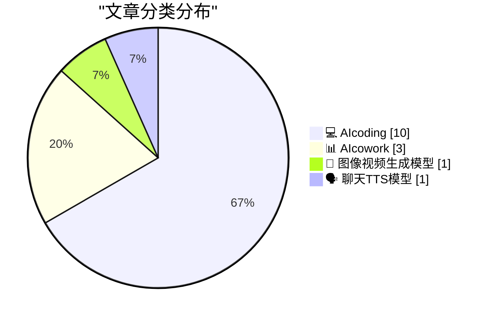
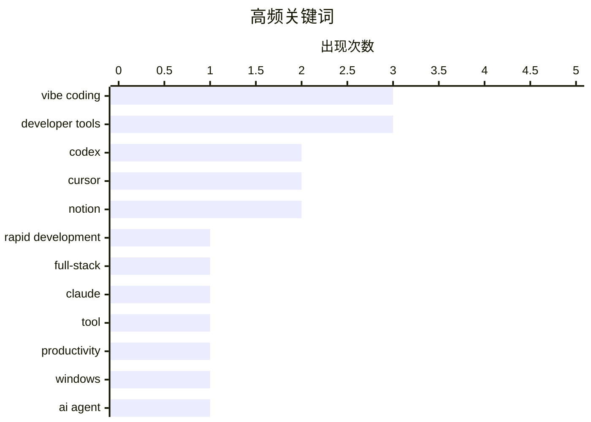

# 📰 AI 博客每日精选 — 2026-03-04

> 来自 98 个技术博客和社交媒体源，AI 精选 Top 15

## 📝 今日看点

今日技术圈聚焦于AI编程工具的深度整合与效能提升。一方面，主流AI编码平台正加速向多终端和一体化工作流演进，显著降低全栈应用开发门槛。另一方面，业界开始重点反思人机协作模式，强调对AI生成代码的审查与优化，避免效率陷阱。同时，工具链的“冷静”与稳健性也成为开发者关注的新焦点。

---

## 🏆 今日必读

🥇 **Vibecoding 演示：不到10分钟构建一个包含前端、数据库、支付和AI的移动应用**

[RT Vibecoding Explained: No way... Building a mobile app with: > Frontend > Database & Auth > Payments w/ @RevenueCat > OpenAI API In less than 10 min...](https://x.com/rileybrown/status/2029000627351916707) — 𝕏 @rileybrown · 20 小时前 · 💻 AIcoding

> 文章展示了使用 Vibecode 平台快速构建全功能移动应用的能力。该演示在不到10分钟内，集成了前端界面、数据库与用户认证、通过 RevenueCat 的支付系统以及 OpenAI API。整个过程无需复杂的底层编码，通过平台工具和集成服务实现。这证明了低代码/无代码平台与成熟第三方服务结合能极大提升应用开发效率。

💡 **为什么值得读**: 该演示为开发者提供了一个极致的效率范例，展示了如何将多个复杂模块快速组合成可用的产品原型，对探索快速验证想法和低代码开发流程具有直接参考价值。

🏷️ Vibe Coding, Rapid Development, Full-Stack

🥈 **使用 Recall 工具高效恢复 Claude 终端对话**

[终端崩了想恢复对话，之前的做法是让 Claude 自己在 ~/.claude/projects/ 下面翻 JSONL 文件，Glob + Grep 一通搜，能找到但慢，还吃 context。 装了 recall 之...](https://x.com/runes_leo/status/2029217049365680164) — 𝕏 @runes_leo · 6 小时前 · 💻 AIcoding

> 文章解决了 Claude 等 AI 编程助手在终端崩溃后恢复历史对话的痛点。传统方法需要手动在 `~/.claude/projects/` 目录下搜索 JSONL 文件，过程缓慢且消耗上下文。Recall 工具通过建立本地 SQLite 索引，为 3000 多条历史对话建立索引仅需 23 秒，并能通过关键词秒级搜索并直接恢复会话。作者指出，优秀工具的价值在于填补那些“能做但别扭”的体验缝隙。

💡 **为什么值得读**: 它精准定位了一个 AI 编程工具使用中的具体痛点，并提供了一个高效、本地化的解决方案，对依赖 Claude 进行长时间编程会话的开发者极具实用性。

🏷️ Claude, Tool, Productivity

🥉 **OpenAI Codex 应用正式登陆 Windows 平台**

[RT OpenAI Developers: The Codex app is now on Windows. Get the full Codex app experience on Windows with a native agent sandbox and support for Window...](https://x.com/OpenAI/status/2029253900981924012) — 𝕏 @OpenAI · 3 小时前 · 💻 AIcoding

> OpenAI 宣布其 Codex 应用现已推出 Windows 版本。Windows 用户将获得完整的 Codex 应用体验，包括原生的智能体沙盒环境。新版本特别提供了对 Windows 开发者环境的支持，尤其是在 PowerShell 中的集成。这使得 Windows 开发者也能在熟悉的系统环境中利用 Codex 进行 AI 辅助编程。

💡 **为什么值得读**: 这是 Codex 生态扩展的重要一步，让占主流的 Windows 开发者群体能够无缝接入先进的 AI 编程助手，降低了使用门槛。

🏷️ Codex, Windows, Developer Tools

4️⃣ **MercadoLibre 总结提升 AI 编程智能体效能的四大杠杆**

[MercadoLibre（拉美最大电商，市值 $1000 亿级） 2 万开发者在推的方法论，说 AI 编程 agent 好不好用取决于四根杠杆——规则文件、MCP 工具、Skills 按需加载、...](https://x.com/runes_leo/status/2029050955204051277) — 𝕏 @runes_leo · 17 小时前 · 💻 AIcoding

> 文章分享了市值千亿美元的 MercadoLibre 公司内部推广的 AI 编程智能体效能提升方法论。其核心是四大杠杆：规则文件（如 `CLAUDE.md`，用于注入技术栈和规范，但需拆分以避免上下文溢出）、MCP 工具（为智能体扩展浏览器、数据库等外部能力）、Skills 按需加载（将任务指令封装，调用时才加载全文以节省上下文）、以及规格驱动开发。此外，文章强调了通过钩子（hooks）建立强制性的反馈闭环（如提交前跑 lint），确保代码质量。研究表明，上下文填充超过 60% 会导致模型性能退化。

💡 **为什么值得读**: 这套来自超大型技术团队的实战方法论，系统性地解决了 AI 编程智能体在工程化应用中的核心挑战，具有极高的借鉴和落地价值。

🏷️ AI Agent, Best Practice, MCP

5️⃣ **包管理器需要“冷静期”**

[Package Managers Need to Cool Down](https://nesbitt.io/2026/03/04/package-managers-need-to-cool-down.html) — nesbitt.io · 11 小时前 · 💻 AIcoding

> 文章核心议题是探讨软件包管理器中的“依赖冷静期”支持。作者对主流的包管理器和更新工具进行了一项调查，旨在评估它们对“依赖冷静期”功能的支持情况。“依赖冷静期”指的是在新版本发布后，不立即升级，而是等待一段时间以观察其稳定性和兼容性。文章通过对比分析，揭示了不同工具在此功能上的差异与现状。结论指出，这一功能对于维护项目稳定性至关重要，但当前生态支持尚不完善。

💡 **为什么值得读**: 它提出了一个关乎生产环境稳定性的关键但常被忽视的工程实践，并通过实际调查数据为开发者选择工具提供了重要参考。

🏷️ Package Manager, Dependency, Software Development

---

## 📊 数据概览

| 扫描源 | 抓取文章 | 时间范围 | 精选 |
|:---:|:---:|:---:|:---:|
| 86/98 | 2168 篇 → 69 篇 | 24h | **15 篇** |

### 分类分布



### 高频关键词



<details>
<summary>📈 纯文本关键词图（终端友好）</summary>

```
vibe coding       │ ████████████████████ 3
developer tools   │ ████████████████████ 3
codex             │ █████████████░░░░░░░ 2
cursor            │ █████████████░░░░░░░ 2
notion            │ █████████████░░░░░░░ 2
rapid development │ ███████░░░░░░░░░░░░░ 1
full-stack        │ ███████░░░░░░░░░░░░░ 1
claude            │ ███████░░░░░░░░░░░░░ 1
tool              │ ███████░░░░░░░░░░░░░ 1
productivity      │ ███████░░░░░░░░░░░░░ 1
```

</details>

### 🏷️ 话题标签

**vibe coding**(3) · **developer tools**(3) · **codex**(2) · cursor(2) · notion(2) · rapid development(1) · full-stack(1) · claude(1) · tool(1) · productivity(1) · windows(1) · ai agent(1) · best practice(1) · mcp(1) · package manager(1) · dependency(1) · software development(1) · agentic engineering(1) · anti-patterns(1) · best practices(1)

---

====================

## 💻 AIcoding

### 1. Vibecoding 演示：不到10分钟构建一个包含前端、数据库、支付和AI的移动应用

[RT Vibecoding Explained: No way... Building a mobile app with: > Frontend > Database & Auth > Payments w/ @RevenueCat > OpenAI API In less than 10 min...](https://x.com/rileybrown/status/2029000627351916707) — **𝕏 @rileybrown** · 20 小时前 · ⭐ 24/25

> 文章展示了使用 Vibecode 平台快速构建全功能移动应用的能力。该演示在不到10分钟内，集成了前端界面、数据库与用户认证、通过 RevenueCat 的支付系统以及 OpenAI API。整个过程无需复杂的底层编码，通过平台工具和集成服务实现。这证明了低代码/无代码平台与成熟第三方服务结合能极大提升应用开发效率。

🏷️ Vibe Coding, Rapid Development, Full-Stack

📌 AIcoding

---

### 2. 使用 Recall 工具高效恢复 Claude 终端对话

[终端崩了想恢复对话，之前的做法是让 Claude 自己在 ~/.claude/projects/ 下面翻 JSONL 文件，Glob + Grep 一通搜，能找到但慢，还吃 context。 装了 recall 之...](https://x.com/runes_leo/status/2029217049365680164) — **𝕏 @runes_leo** · 6 小时前 · ⭐ 24/25

> 文章解决了 Claude 等 AI 编程助手在终端崩溃后恢复历史对话的痛点。传统方法需要手动在 `~/.claude/projects/` 目录下搜索 JSONL 文件，过程缓慢且消耗上下文。Recall 工具通过建立本地 SQLite 索引，为 3000 多条历史对话建立索引仅需 23 秒，并能通过关键词秒级搜索并直接恢复会话。作者指出，优秀工具的价值在于填补那些“能做但别扭”的体验缝隙。

🏷️ Claude, Tool, Productivity

📌 AIcoding

---

### 3. OpenAI Codex 应用正式登陆 Windows 平台

[RT OpenAI Developers: The Codex app is now on Windows. Get the full Codex app experience on Windows with a native agent sandbox and support for Window...](https://x.com/OpenAI/status/2029253900981924012) — **𝕏 @OpenAI** · 3 小时前 · ⭐ 22/25

> OpenAI 宣布其 Codex 应用现已推出 Windows 版本。Windows 用户将获得完整的 Codex 应用体验，包括原生的智能体沙盒环境。新版本特别提供了对 Windows 开发者环境的支持，尤其是在 PowerShell 中的集成。这使得 Windows 开发者也能在熟悉的系统环境中利用 Codex 进行 AI 辅助编程。

🏷️ Codex, Windows, Developer Tools

📌 AIcoding

---

### 4. MercadoLibre 总结提升 AI 编程智能体效能的四大杠杆

[MercadoLibre（拉美最大电商，市值 $1000 亿级） 2 万开发者在推的方法论，说 AI 编程 agent 好不好用取决于四根杠杆——规则文件、MCP 工具、Skills 按需加载、...](https://x.com/runes_leo/status/2029050955204051277) — **𝕏 @runes_leo** · 17 小时前 · ⭐ 22/25

> 文章分享了市值千亿美元的 MercadoLibre 公司内部推广的 AI 编程智能体效能提升方法论。其核心是四大杠杆：规则文件（如 `CLAUDE.md`，用于注入技术栈和规范，但需拆分以避免上下文溢出）、MCP 工具（为智能体扩展浏览器、数据库等外部能力）、Skills 按需加载（将任务指令封装，调用时才加载全文以节省上下文）、以及规格驱动开发。此外，文章强调了通过钩子（hooks）建立强制性的反馈闭环（如提交前跑 lint），确保代码质量。研究表明，上下文填充超过 60% 会导致模型性能退化。

🏷️ AI Agent, Best Practice, MCP

📌 AIcoding

---

### 5. 包管理器需要“冷静期”

[Package Managers Need to Cool Down](https://nesbitt.io/2026/03/04/package-managers-need-to-cool-down.html) — **nesbitt.io** · 11 小时前 · ⭐ 21/25

> 文章核心议题是探讨软件包管理器中的“依赖冷静期”支持。作者对主流的包管理器和更新工具进行了一项调查，旨在评估它们对“依赖冷静期”功能的支持情况。“依赖冷静期”指的是在新版本发布后，不立即升级，而是等待一段时间以观察其稳定性和兼容性。文章通过对比分析，揭示了不同工具在此功能上的差异与现状。结论指出，这一功能对于维护项目稳定性至关重要，但当前生态支持尚不完善。

🏷️ Package Manager, Dependency, Software Development

📌 AIcoding

---

### 6. Cursor 编辑器现可通过 30 余款 ACP 客户端使用，包括 OpenClaw

[You can now use Cursor with 30+ ACP clients, including OpenClaw 🦞 This means complete access to Composer 1.5, codebase indexing and semantic search...](https://x.com/leerob/status/2029255331914588647) — **𝕏 @leerob** · 3 小时前 · ⭐ 21/25

> Cursor 编辑器现已兼容超过 30 款 ACP（AI Coding Platform）客户端，其中包含 OpenClaw。这意味着开发者可以通过这些客户端获得 Cursor 的完整功能，包括 Composer 1.5、代码库索引与语义搜索等高级特性。推文附带了在 avante.nvim 客户端中使用的示例视频，展示了集成的流畅体验。这极大地扩展了 Cursor 的使用场景和灵活性。

🏷️ Cursor, AI Coding, Codebase Indexing

📌 AIcoding

---

### 7. GitHub Copilot 开发者日活动即将在全球多地举行

[GitHub Copilot Dev Days are coming to a city near you. 🏙️ Starting March 14, connect with your local dev community to level up your Copilot skills...](https://x.com/github/status/2029025288797986889) — **𝕏 @GitHub** · 18 小时前 · ⭐ 21/25

> GitHub 宣布将于 3 月 14 日起，在全球多个城市举办 GitHub Copilot 开发者日活动。活动旨在让开发者与本地社区连接，共同提升 Copilot 使用技能。参与者将有机会学习新功能、观看现场演示，并将 Copilot 应用于真实工作流中。GitHub 同时开放了活动查找和主办方报名渠道。

🏷️ GitHub Copilot, Workshop, Developer Tools

📌 AIcoding

---

### 8. 新演示：在Notion中进行可视化“氛围编程”游戏开发

[RT Geoffrey Litt: ✨New demo: what if vibe coding felt more visual? @brian_lovin @maryrosecook and I did a game jam using Notion as our "IDE": launchi...](https://x.com/NotionHQ/status/2029233149767790976) — **𝕏 @NotionHQ** · 5 小时前 · ⭐ 21/25

> Geoffrey Litt等人进行了一场以Notion作为“集成开发环境（IDE）”的游戏开发挑战。演示中，他们从Notion任务板启动Cursor智能体进行编码，并为每个任务创建了自定义图像。该实践提出了未来智能体发展的三个构想，核心是智能体应实现跨应用协作，让Notion AI专注于起草规范和任务管理，Cursor专注于编码，各司其职。这展示了将项目管理工具与专业开发工具深度集成的未来工作模式。

🏷️ Vibe Coding, Notion, Cursor, Agents

📌 AIcoding

---

### 9. 氛围编程完整指南：开发可收取费用的移动应用

[RT Vibecoding Explained: Vibe Coding Mobile Apps that COLLECT PAYMENTS (Complete Guide @RevenueCat + @vibecodeapp)](https://x.com/rileybrown/status/2029241175211950277) — **𝕏 @rileybrown** · 4 小时前 · ⭐ 20/25

> 这是一份关于使用Vibecode和RevenueCat进行移动应用开发的综合指南。内容聚焦于“氛围编程”模式，指导开发者如何快速构建具备支付功能的移动应用。指南结合了Vibecode的开发工具与RevenueCat的支付与订阅管理服务，提供了端到端的实现方案。其目标是降低开发门槛，让开发者能更直观、高效地创建可盈利的应用。

🏷️ Vibe Coding, Mobile App, Payments

📌 AIcoding

---

### 10. Firebase身份验证，实属神器

[firebase auth it is goated.](https://x.com/corbin_braun/status/2029296204404933080) — **𝕏 @corbin_braun** · 53 分钟前 · ⭐ 19/25

> 这条推文以极简的方式表达了对Firebase身份验证（Firebase Auth）服务的高度赞誉。作者用网络流行语“goated”（意为“史上最佳”）来形容它，强调了其在开发者社区中的卓越口碑。Firebase Auth作为后端即服务（BaaS），为应用提供了完整、安全且易集成的用户身份认证解决方案。这反映了该服务在简化开发流程、保障安全方面的关键作用。

🏷️ Firebase, Authentication, Developer Tools

📌 AIcoding

---

## 📊 AIcowork

### 11. 智能体工程反模式：向协作者倾倒未经审查的代码

[I started a new chapter of my Agentic Engineering Patternw guide about anti-patterns - things NOT to do So far I only have one: Inflicting unreviewed ...](https://x.com/simonw/status/2029260505324412954) — **𝕏 @simonw** · 3 小时前 · ⭐ 21/25

> 作者在其《智能体工程模式》指南中新增了关于“反模式”的章节。目前提出的第一个反模式是“向协作者倾倒未经审查的代码”，即直接提交一个由 AI 生成、未经测试和审查的、长达上千行的 PR。这种行为将本应由开发者承担的代码验证责任转嫁给了协作者，破坏了协作流程。作者认为，确保 AI 生成代码的基本可运行性是使用者的责任。

🏷️ Agentic Engineering, Anti-patterns, Best Practices

📌 AIcowork

---

### 12. Codex 集成至 Prism，打造一体化科学写作与分析平台

[RT Victor Powell: 🧵1/ We've brought the most advanced AI to Prism by introducing Codex to Prism. Prism is already the best place for scientific wri...](https://x.com/OpenAI/status/2029273685388083489) — **𝕏 @OpenAI** · 2 小时前 · ⭐ 21/25

> OpenAI 宣布将最先进的 Codex AI 集成到科学写作平台 Prism 中。Prism 原本已是优秀的科学写作工具，此次集成 Codex 后，用户可以在同一个平台内完成写作、计算、分析和迭代的全流程。这意味着研究者无需在多个工具间切换，即可利用 AI 辅助进行数据分析和内容生成。该集成旨在提升科学工作的效率和连贯性。

🏷️ Codex, Scientific Writing, Prism

📌 AIcowork

---

### 13. Notion首席运营官如何用自定义智能体开启高效一周

[For our Chief of Staff @tylerjhaviland, the week starts on Friday. That’s when his Custom Agent finds the latest status from every project over the p...](https://x.com/NotionHQ/status/2029263984726360331) — **𝕏 @NotionHQ** · 3 小时前 · ⭐ 21/25

> Notion展示了其首席运营官利用自定义智能体（Custom Agent）自动化管理项目周报的工作流。该智能体在每周五自动汇总过去一周所有项目的最新状态。通过这种方式，管理者可以在周一上班前就清晰掌握所有项目的进展，实现“带着答案开始新一周”。这体现了Notion AI在自动化信息聚合与工作流管理方面的应用潜力。

🏷️ Notion, Custom Agent, Project Management

📌 AIcowork

---

## 🎨 图像视频生成模型

### 14. 投入5小时优化，OpenClaw 现能通过2条提示生成完整动态图形视频

[I spent 5 hours today making OpenClaw even better at Motion Graphics I created the video below in 2 prompts with no asset uploads. It scraped or gener...](https://x.com/rileybrown/status/2029031830855532627) — **𝕏 @rileybrown** · 18 小时前 · ⭐ 21/25

> 作者通过5小时的优化，显著提升了 OpenClaw 在动态图形生成方面的能力。优化后，仅需2条文本提示，无需上传任何素材，即可生成包含品牌元素抓取、图像生成、视频生成、音乐生成与抓取、流畅转场等内容的完整视频。系统基本实现了零错误，并且始终输出一个可跨设备访问的编辑器链接，方便后续编辑。这展示了 AI 智能体在创意内容生产流程中的高度自动化潜力。

🏷️ OpenClaw, Motion Graphics, Video Generation

📌 图像视频生成模型

---

## 🗣️ 聊天TTS模型

### 15. 新研究揭示大模型“过度思考”根源：非训练失败，乃采样失败

[RT God of Prompt: reasoning models already know when they've solved the problem. we just don't let them stop. new paper from Beihang University and By...](https://x.com/godofprompt/status/2029245812405084601) — **𝕏 @godofprompt** · 10 小时前 · ⭐ 19/25

> 北京航空航天大学和字节跳动的新论文指出，DeepSeek-R1、Qwen3等推理模型的“过度思考”问题本质是采样失败，而非训练失败。研究发现，模型其实知道问题何时已被解决，只是现有采样方法不允许它们适时停止。论文提出的修复方法，在减少44%令牌使用量的同时，还提高了模型回答的准确性。这一发现为优化推理模型的计算效率提供了新的理论方向和实用方案。

🏷️ Reasoning Model, Overthinking, Sampling, Research

📌 聊天TTS模型

---

====================

*生成于 2026-03-04 21:35 | 扫描 86 源 → 获取 2168 篇 → 精选 15 篇*
*基于 [Hacker News Popularity Contest 2025](https://refactoringenglish.com/tools/hn-popularity/) RSS 源列表，由 [Andrej Karpathy](https://x.com/karpathy) 推荐*
*由「懂点儿AI」制作，欢迎关注同名微信公众号获取更多 AI 实用技巧 💡*
