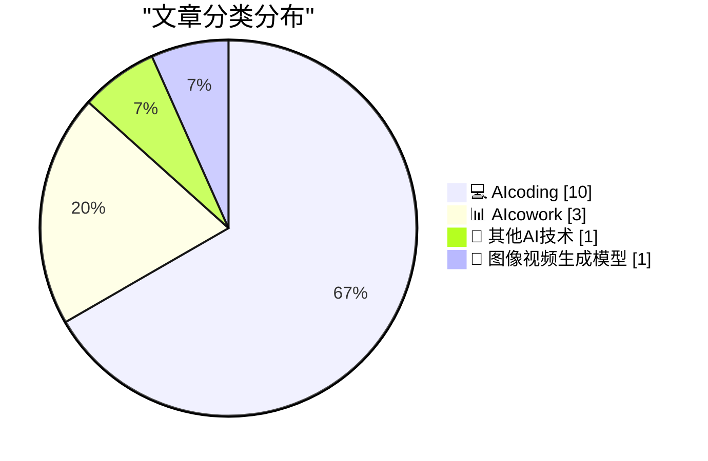
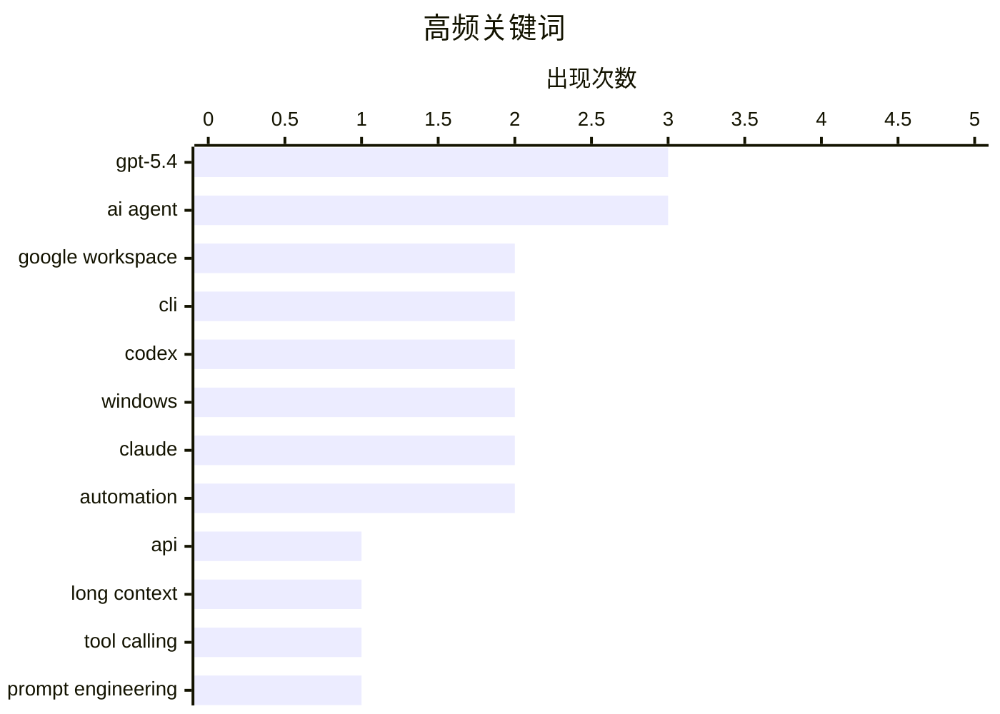

# 📰 AI 博客每日精选 — 2026-03-05

> 来自 98 个技术博客和社交媒体源，AI 精选 Top 15

## 📝 今日看点

今日技术圈的核心焦点是AI在编程与办公领域的深度集成与能力进化。一方面，以GPT-5.4和Cursor为代表的AI编程工具正朝着更高效、更自动化与更原生系统集成的方向发展，推动开发模式变革。另一方面，以谷歌Workspace CLI为代表的工具正致力于打通AI智能体与核心办公套件的自动化链路，预示着人机协同工作流将进入新阶段。同时，针对Claude等模型的精细化提示工程也显示出，如何有效驾驭AI已成为提升专业领域生产力的关键技能。

---

## 🏆 今日必读

🥇 **GPT-5.4 正式发布**

[GPT-5.4 is launching, available now in the API and Codex and rolling out over the course of the day in ChatGPT. It's much better at knowledge work and...](https://x.com/sama/status/2029622732594499630) — 𝕏 @sama · 3 小时前 · 💻 AIcoding

> OpenAI 正式发布了 GPT-5.4 模型，现已通过 API 和 Codex 提供，并将在 ChatGPT 中逐步上线。新模型在知识工作和网络搜索方面表现大幅提升，并具备原生计算机使用能力。用户可以在模型生成回复过程中进行引导，且其上下文长度支持高达 100 万 tokens。

💡 **为什么值得读**: 这是 OpenAI 最新旗舰模型的首发公告，揭示了其在处理复杂任务和长上下文方面的重大进步，对开发者和技术决策者至关重要。

🏷️ GPT-5.4, API, Long Context

🥈 **谷歌发布 Workspace 命令行工具**

[RT Addy Osmani: Introducing the Google Workspace CLI: https://github.com/googleworkspace/cli - built for humans and agents. Google Drive, Gmail, Calen...](https://x.com/levelsio/status/2029399495679631794) — 𝕏 @levelsio · 19 小时前 · 📊 AIcowork

> 谷歌开源了 Google Workspace CLI，这是一个为人类和 AI 智能体设计的命令行工具。它集成了 Google Drive、Gmail、Calendar 等所有 Workspace API。该工具内置了超过 40 种面向智能体的技能，旨在提升自动化效率。

💡 **为什么值得读**: 该工具将 Google 生态的核心生产力服务以 CLI 形式开放，极大简化了自动化流程构建，是 AI 智能体集成和企业自动化的重要基础设施。

🏷️ Google Workspace, CLI, AI Agent

🥉 **GPT-5.4 引入 /fast 模式**

[Forgot to mention /fast! I think people will like this.](https://x.com/sama/status/2029623948980416681) — 𝕏 @sama · 3 小时前 · 💻 AIcoding

> 在 GPT-5.4 发布的同时，OpenAI 为 Codex 引入了 `/fast` 模式，以提供更快的响应版本。新版本的 Codex 在 token 使用效率、工具调用、计算机使用和前端开发能力上均有优化。

💡 **为什么值得读**: 了解 GPT-5.4 在效率与速度上的具体优化，对于需要权衡性能与成本的开发者具有直接参考价值。

🏷️ GPT-5.4, Tool Calling, Codex

4️⃣ **Codex 应用登陆 Windows 平台**

[Codex app on Windows!](https://x.com/sama/status/2029623487007183274) — 𝕏 @sama · 3 小时前 · 💻 AIcoding

> Codex 应用现已正式在 Windows 平台上线。该应用支持原生运行和在 WSL 中运行，并集成了 PowerShell、命令提示符、Git Bash 或 WSL 终端。同时，OpenAI 构建了首个 Windows 原生智能体沙箱，利用操作系统级控制来限制文件系统在指定范围外的写入。

💡 **为什么值得读**: 这标志着 OpenAI 的开发工具正式深度集成到主流桌面操作系统，其原生沙箱技术为智能体安全运行提供了新的解决方案。

🏷️ Codex, Windows, AI Agent

5️⃣ **10个 Claude 提示词复现华尔街分析框架**

[RT God of Prompt: Wall Street firms pay analysts $200K/year to run frameworks these 10 Claude prompts replicate in 30 seconds. I engineered each one f...](https://x.com/godofprompt/status/2029661254374003140) — 𝕏 @godofprompt · 10 小时前 · 📊 AIcowork

> 一套包含 10 个经过精心设计的 Claude 提示词，声称能在 30 秒内复现华尔街分析师年薪 20 万美元所执行的分析框架。这些提示词基于高盛、桥水基金和文艺复兴科技公司的实际方法论构建。作者宣称它们可以替代每月 2000 美元的彭博终端功能，用于股票分析。

💡 **为什么值得读**: 该内容展示了如何将顶尖金融机构的复杂分析流程转化为可执行的 AI 提示词，是提示工程在专业领域应用的极端案例，极具启发性和争议性。

🏷️ Claude, Prompt Engineering, Finance

---

## 📊 数据概览

| 扫描源 | 抓取文章 | 时间范围 | 精选 |
|:---:|:---:|:---:|:---:|
| 86/98 | 2173 篇 → 63 篇 | 24h | **15 篇** |

### 分类分布



### 高频关键词



<details>
<summary>📈 纯文本关键词图（终端友好）</summary>

```
gpt-5.4          │ ████████████████████ 3
ai agent         │ ████████████████████ 3
google workspace │ █████████████░░░░░░░ 2
cli              │ █████████████░░░░░░░ 2
codex            │ █████████████░░░░░░░ 2
windows          │ █████████████░░░░░░░ 2
claude           │ █████████████░░░░░░░ 2
automation       │ █████████████░░░░░░░ 2
api              │ ███████░░░░░░░░░░░░░ 1
long context     │ ███████░░░░░░░░░░░░░ 1
```

</details>

### 🏷️ 话题标签

**gpt-5.4**(3) · **ai agent**(3) · **google workspace**(2) · cli(2) · codex(2) · windows(2) · claude(2) · automation(2) · api(1) · long context(1) · tool calling(1) · prompt engineering(1) · finance(1) · cursor(1) · prompt(1) · landing page(1) · vibecoding(1) · veo(1) · mobile app(1) · agent(1)

---

====================

## 💻 AIcoding

### 1. GPT-5.4 正式发布

[GPT-5.4 is launching, available now in the API and Codex and rolling out over the course of the day in ChatGPT. It's much better at knowledge work and...](https://x.com/sama/status/2029622732594499630) — **𝕏 @sama** · 3 小时前 · ⭐ 24/25

> OpenAI 正式发布了 GPT-5.4 模型，现已通过 API 和 Codex 提供，并将在 ChatGPT 中逐步上线。新模型在知识工作和网络搜索方面表现大幅提升，并具备原生计算机使用能力。用户可以在模型生成回复过程中进行引导，且其上下文长度支持高达 100 万 tokens。

🏷️ GPT-5.4, API, Long Context

📌 AIcoding

---

### 2. GPT-5.4 引入 /fast 模式

[Forgot to mention /fast! I think people will like this.](https://x.com/sama/status/2029623948980416681) — **𝕏 @sama** · 3 小时前 · ⭐ 21/25

> 在 GPT-5.4 发布的同时，OpenAI 为 Codex 引入了 `/fast` 模式，以提供更快的响应版本。新版本的 Codex 在 token 使用效率、工具调用、计算机使用和前端开发能力上均有优化。

🏷️ GPT-5.4, Tool Calling, Codex

📌 AIcoding

---

### 3. Codex 应用登陆 Windows 平台

[Codex app on Windows!](https://x.com/sama/status/2029623487007183274) — **𝕏 @sama** · 3 小时前 · ⭐ 21/25

> Codex 应用现已正式在 Windows 平台上线。该应用支持原生运行和在 WSL 中运行，并集成了 PowerShell、命令提示符、Git Bash 或 WSL 终端。同时，OpenAI 构建了首个 Windows 原生智能体沙箱，利用操作系统级控制来限制文件系统在指定范围外的写入。

🏷️ Codex, Windows, AI Agent

📌 AIcoding

---

### 4. Cursor 推出“自动化”功能以构建常驻智能体

[RT Cursor: We're introducing Cursor Automations to build always-on agents.](https://x.com/leerob/status/2029606223683764464) — **𝕏 @leerob** · 4 小时前 · ⭐ 21/25

> AI 代码编辑器 Cursor 宣布推出“Cursor Automations”功能，旨在帮助用户构建“常驻智能体”。该功能允许创建持续运行、自动响应的 AI 辅助编程工作流。

🏷️ Cursor, AI Agent, Automation

📌 AIcoding

---

### 5. Claude 代码设计技巧：生成着陆页选项目录

[RT Vibecoding Explained: Wow... This Claude Code Design Hack is wild. When building landing pages, don't ask for a single landing page. Ask for a dire...](https://x.com/rileybrown/status/2029603965395161555) — **𝕏 @rileybrown** · 4 小时前 · ⭐ 21/25

> 介绍了一个针对 Claude 的代码设计技巧：在构建着陆页时，不要直接要求生成单个页面，而是提示 AI 生成一个包含多个选项的“着陆页目录”。这种方法通过一个特定的提示词，能一次性获得多样化的设计选择和组件，提高设计迭代效率。

🏷️ Claude, Prompt, Landing Page

📌 AIcoding

---

### 6. 移动应用开发技巧：使用 Google Veo 3.1 视频作为背景

[RT Vibecoding Explained: Here's a tip when vibe coding mobile apps. Use Google Veo 3.1 Videos in the background. Very easy to upload to @vibecodeapp (...](https://x.com/rileybrown/status/2029323582728491217) — **𝕏 @rileybrown** · 23 小时前 · ⭐ 21/25

> 分享了一个移动应用“氛围编程”的技巧：使用 Google 的 Veo 3.1 模型生成的视频作为应用背景。该方法声称可以轻松地将生成的视频上传到 Vibecodeapp（一个移动应用构建器），以快速创建视觉效果出色的移动应用界面。

🏷️ Vibecoding, Veo, Mobile App

📌 AIcoding

---

### 7. JJ LSP 后续思考

[JJ LSP Follow Up](https://matklad.github.io/2026/03/05/jj-lsp-followup.html) — **matklad.github.io** · 21 小时前 · ⭐ 20/25

> 本文是作者对之前提出的“为版本控制工具 jj 实现类似 Magit 风格用户体验”构想的后续探讨。核心思路是利用语言服务器协议（LSP）作为通用接口，一次性实现这种高效的交互模式，并使其能应用于多种编辑器和 IDE。文章可能深入讨论了该方案的可行性、设计细节或面临的挑战。

🏷️ LSP, Version Control, UI/UX

📌 AIcoding

---

### 8. 包管理器的“魔法文件”及其位置

[Package Manager Magic Files](https://nesbitt.io/2026/03/05/package-manager-magic-files.html) — **nesbitt.io** · 11 小时前 · ⭐ 20/25

> 文章系统梳理了各主流包管理器用于配置和自定义行为的特殊配置文件。这些文件包括 .npmrc（npm）、MANIFEST.in（Python）、Directory.Packages.props（.NET）、.pnpmfile.cjs（pnpm）等，它们控制着依赖解析、打包规则和安装行为。掌握这些文件的位置和用法是进行高级依赖管理和项目配置的关键。理解这些“魔法文件”能帮助开发者解决复杂的包管理问题并优化工作流。

🏷️ Package Manager, Configuration, Development

📌 AIcoding

---

### 9. chardet库通过Claude Code辅助重写实现LGPL到MIT的重新许可引发争议

[The chardet open source library relicensed from LGPL to MIT two days ago thanks to a Claude Code assisted "clean room" rewrite - but original author M...](https://x.com/simonw/status/2029600918912553111) — **𝕏 @simonw** · 4 小时前 · ⭐ 19/25

> 字符编码检测库 chardet 在两天前通过一次由 Claude Code 辅助的“净室”重写，将其许可证从 LGPL 更改为 MIT。然而，原作者 Mark Pilgrim 对此次重写是否足以正当化许可证变更提出了质疑。争议焦点在于这种利用AI辅助的“净室”实现方式在法律和伦理上的有效性。此事引发了关于开源许可证、代码所有权以及AI在代码重写中角色的讨论。

🏷️ Claude Code, Open Source, License

📌 AIcoding

---

### 10. 消息循环之谜：为何投递的消息在到达主循环前就被分发了

[The mystery of the posted message that was dispatched before reaching the main message loop](https://devblogs.microsoft.com/oldnewthing/20260305-00/?p=112114) — **devblogs.microsoft.com/oldnewthing** · 6 小时前 · ⭐ 18/25

> 文章探讨了Windows消息处理机制中一个反直觉的现象：为何一个通过PostMessage投递的消息，有时会在进入应用程序的主消息循环之前就被分发和处理。核心原因在于，当调用PeekMessage或GetMessage等函数时，如果当前线程有任何待处理的消息，它们会立即被取出并可能通过DispatchMessage函数直接分发。这意味着消息的分发可以不依赖于主消息循环的显式代码。理解这一机制对于调试复杂的窗口消息时序问题至关重要。

🏷️ Windows, Message Loop, Debugging

📌 AIcoding

---

## 📊 AIcowork

### 11. 谷歌发布 Workspace 命令行工具

[RT Addy Osmani: Introducing the Google Workspace CLI: https://github.com/googleworkspace/cli - built for humans and agents. Google Drive, Gmail, Calen...](https://x.com/levelsio/status/2029399495679631794) — **𝕏 @levelsio** · 19 小时前 · ⭐ 22/25

> 谷歌开源了 Google Workspace CLI，这是一个为人类和 AI 智能体设计的命令行工具。它集成了 Google Drive、Gmail、Calendar 等所有 Workspace API。该工具内置了超过 40 种面向智能体的技能，旨在提升自动化效率。

🏷️ Google Workspace, CLI, AI Agent

📌 AIcowork

---

### 12. 10个 Claude 提示词复现华尔街分析框架

[RT God of Prompt: Wall Street firms pay analysts $200K/year to run frameworks these 10 Claude prompts replicate in 30 seconds. I engineered each one f...](https://x.com/godofprompt/status/2029661254374003140) — **𝕏 @godofprompt** · 10 小时前 · ⭐ 21/25

> 一套包含 10 个经过精心设计的 Claude 提示词，声称能在 30 秒内复现华尔街分析师年薪 20 万美元所执行的分析框架。这些提示词基于高盛、桥水基金和文艺复兴科技公司的实际方法论构建。作者宣称它们可以替代每月 2000 美元的彭博终端功能，用于股票分析。

🏷️ Claude, Prompt Engineering, Finance

📌 AIcowork

---

### 13. Google Workspace CLI 补全 AI 智能体自动注册链路

[Google 今天开源了 Workspace CLI，命令行直接调 Gmail API。对我来说意味着一件事：Agent 自动注册的最后一块拼图补上了。 之前给 Claude Code 做过自动注册和...](https://x.com/runes_leo/status/2029554428420702221) — **𝕏 @runes_leo** · 7 小时前 · ⭐ 21/25

> 作者认为 Google Workspace CLI 的开源补齐了 AI 智能体实现全自动注册流程的最后一块拼图。此前，智能体可以自动完成打开网站、填写表单、创建账号等步骤，但卡在需要人工收取邮箱验证码环节。现在，通过 gws CLI 轮询 Gmail 并自动提取验证码，使得智能体能够自主完成从注册到获取 API 密钥的全流程。作者实测多个 AI 平台，除手机短信验证需人工介入外，其余步骤均可自动化。

🏷️ Google Workspace, CLI, Agent, Automation

📌 AIcowork

---

## 🔬 其他AI技术

### 14. OpenAI发布思维链可控性新评估套件与研究论文

[We're publishing a new evaluation suite and research paper on Chain-of-Thought (CoT) Controllability. We find that GPT-5.4 Thinking shows low ability ...](https://x.com/OpenAI/status/2029650046002811280) — **𝕏 @OpenAI** · 1 小时前 · ⭐ 20/25

> OpenAI发布了针对思维链可控性的新评估套件和研究成果。研究发现，GPT-5.4 Thinking 模型在隐藏其推理过程方面能力较低，其思维链容易被外部监测。这一发现表明，对思维链进行监控仍然是一个有效的安全工具。该研究为理解和控制大语言模型的内部推理过程提供了重要依据。

🏷️ GPT-5.4, Chain-of-Thought, AI Safety

📌 其他AI技术

---

## 🎨 图像视频生成模型

### 15. Utopai Studios正式推出长篇电影生成模型PAI

[RT Utopai Studios: PAI is officially rolling out. The long-form cinematic model from Utopai Studios, built for storytellers who think in scenes, not s...](https://x.com/godofprompt/status/2029654205464498414) — **𝕏 @godofprompt** · 3 小时前 · ⭐ 19/25

> Utopai Studios 正式推出了专为长片叙事设计的电影生成模型 PAI。该模型面向以场景而非秒数为单位的叙事者，能够生成数分钟长的连续视频，并保持角色与场景在不同镜头间的一致性。其核心特点是支持自然语言编辑，允许创作者直接修改故事内容，而非仅仅调整单个画面。PAI旨在赋能创作者进行连贯的长篇视觉叙事。

🏷️ Video Generation, Long-form, Consistency

📌 图像视频生成模型

---

====================

*生成于 2026-03-05 21:34 | 扫描 86 源 → 获取 2173 篇 → 精选 15 篇*
*基于 [Hacker News Popularity Contest 2025](https://refactoringenglish.com/tools/hn-popularity/) RSS 源列表，由 [Andrej Karpathy](https://x.com/karpathy) 推荐*
*由「懂点儿AI」制作，欢迎关注同名微信公众号获取更多 AI 实用技巧 💡*
