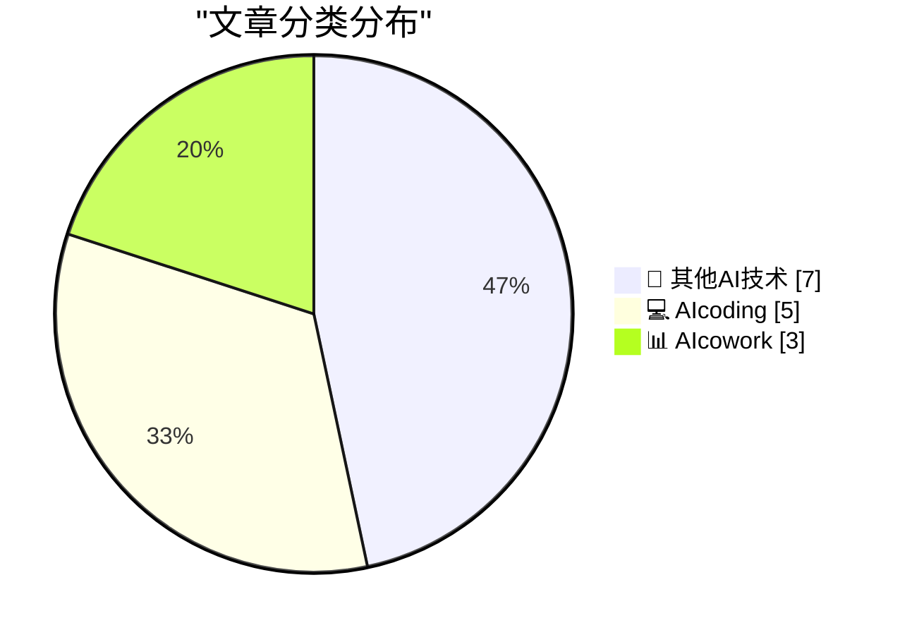
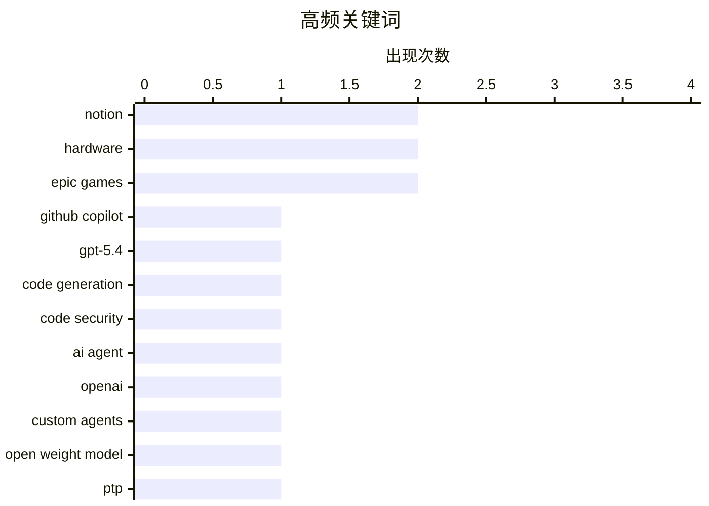

# 📰 AI 博客每日精选 — 2026-03-06

> 来自 98 个技术博客和社交媒体源，AI 精选 Top 15

## 📝 今日看点

今日技术圈聚焦于AI驱动的开发与协作工具深度整合。AI编程助手能力持续升级，安全与智能化成为核心方向，例如GPT-5.4增强代码推理，Codex Security专注漏洞修复。同时，Notion、Figma等协作平台正通过深度集成AI模型与外部工具，重塑无缝化的工作流体验。此外，业界也在反思对技术极致追求的实用性，体现了工具选择上更务实的趋势。

---

## 🏆 今日必读

🥇 **GPT-5.4 现已在 GitHub Copilot 中全面推出**

[🆕 @OpenAIDevs GPT-5.4 is now generally available and rolling out in GitHub Copilot. Early testing shows ➡️ It consistently hits high rates of suc...](https://x.com/github/status/2029703640626205173) — 𝕏 @GitHub · 21 小时前 · 💻 AIcoding

> OpenAI 的 GPT-5.4 模型已在 GitHub Copilot 中正式上线。早期测试表明，该模型在代码任务上持续达到高成功率，并增强了处理复杂流程时的逻辑推理与任务执行能力。开发者现可在 VS Code 或 Copilot CLI 中体验。

💡 **为什么值得读**: 对于依赖 Copilot 的开发者而言，了解新版模型在代码生成和逻辑推理方面的具体提升，有助于评估其能否显著提升自身开发效率。

🏷️ GitHub Copilot, GPT-5.4, Code Generation

🥈 **OpenAI 应用安全代理 Codex Security 进入研究预览阶段**

[Codex Security—our application security agent—is now in research preview. https://openai.com/index/codex-security-now-in-research-preview/](https://x.com/OpenAI/status/2029985250512920743) — 𝕏 @OpenAI · 3 小时前 · 💻 AIcoding

> OpenAI 推出了专注于应用安全的 AI 代理 Codex Security，目前处于研究预览阶段。该工具旨在利用 AI 辅助识别和修复代码中的安全漏洞。

💡 **为什么值得读**: 关注应用安全的开发者和安全工程师可以借此了解 AI 在自动化安全审计领域的最新进展和潜在能力。

🏷️ Code Security, AI Agent, OpenAI

🥉 **Notion 引入首个开放权重模型，Custom Agents 支持 MiniMax M2.5**

[We're adding more models to Notion, starting with our first open weight model. ICYMI, Custom Agents now support MiniMax M2.5, an open weight model tha...](https://x.com/NotionHQ/status/2030007783844893003) — 𝕏 @NotionHQ · 1 小时前 · 📊 AIcowork

> Notion 正在为其平台引入更多 AI 模型，首个开放权重模型现已加入。其 Custom Agents 功能已支持 MiniMax M2.5 模型，该模型在处理基础任务时成本效益最高可达其他方案的 10 倍。此举旨在为用户提供更多选择，减少供应商锁定。

💡 **为什么值得读**: 对于关注 AI 应用成本和控制权的 Notion 用户，了解这个高性价比的开放模型选项，有助于优化其自动化工作流的构建策略。

🏷️ Notion, Custom Agents, Open Weight Model

4️⃣ **PTP 挂钟不切实际且过于精确**

[A PTP Wall Clock is impractical and a little too precise](https://www.jeffgeerling.com/blog/2026/ptp-wall-clock-impractical-too-precise/) — jeffgeerling.com · 6 小时前 · 🔬 其他AI技术

> 作者受一场技术演讲启发，尝试复现一个使用精密时间协议（PTP）同步的挂钟。实践后发现，PTP 时钟对于日常使用而言精度过高，且实现复杂、成本不菲，缺乏实际应用价值。文章结论是，这种追求极致精度的挂钟更像一个极客玩具，而非实用工具。

💡 **为什么值得读**: 通过一个具体项目揭示了技术理想主义与日常实用性之间的差距，对热衷于将前沿技术应用于生活场景的硬件爱好者有启发意义。

🏷️ PTP, Time Synchronization, Hardware

5️⃣ **当 ReadDirectoryChangesW 报告删除事件时，如何获取被删对象的更多信息？**

[When Read­Directory­ChangesW reports that a deletion occurred, how can I learn more about the deleted thing?](https://devblogs.microsoft.com/oldnewthing/20260306-00/?p=112116) — devblogs.microsoft.com/oldnewthing · 6 小时前 · 💻 AIcoding

> 文章解答了一个关于 Windows API `ReadDirectoryChangesW` 的常见问题：当它报告一个删除事件后，如何获取被删除文件或目录的详细信息。核心答案是：无法获取，因为对象已经消失。如果程序需要这些信息，必须在删除事件发生前就自行缓存（记住）相关元数据。

💡 **为什么值得读**: 为 Windows 系统编程开发者提供了一个关键且反直觉的 API 行为洞察，有助于设计更健壮的文件监控逻辑。

🏷️ Windows API, File System, Programming

---

## 📊 数据概览

| 扫描源 | 抓取文章 | 时间范围 | 精选 |
|:---:|:---:|:---:|:---:|
| 78/98 | 2606 篇 → 27 篇 | 24h | **15 篇** |

### 分类分布



### 高频关键词



<details>
<summary>📈 纯文本关键词图（终端友好）</summary>

```
notion          │ ████████████████████ 2
hardware        │ ████████████████████ 2
epic games      │ ████████████████████ 2
github copilot  │ ██████████░░░░░░░░░░ 1
gpt-5.4         │ ██████████░░░░░░░░░░ 1
code generation │ ██████████░░░░░░░░░░ 1
code security   │ ██████████░░░░░░░░░░ 1
ai agent        │ ██████████░░░░░░░░░░ 1
openai          │ ██████████░░░░░░░░░░ 1
custom agents   │ ██████████░░░░░░░░░░ 1
```

</details>

### 🏷️ 话题标签

**notion**(2) · **hardware**(2) · **epic games**(2) · github copilot(1) · gpt-5.4(1) · code generation(1) · code security(1) · ai agent(1) · openai(1) · custom agents(1) · open weight model(1) · ptp(1) · time synchronization(1) · windows api(1) · file system(1) · programming(1) · self-hosting(1) · email server(1) · devops(1) · meeting notes(1)

---

====================

## 🔬 其他AI技术

### 1. PTP 挂钟不切实际且过于精确

[A PTP Wall Clock is impractical and a little too precise](https://www.jeffgeerling.com/blog/2026/ptp-wall-clock-impractical-too-precise/) — **jeffgeerling.com** · 6 小时前 · ⭐ 19/25

> 作者受一场技术演讲启发，尝试复现一个使用精密时间协议（PTP）同步的挂钟。实践后发现，PTP 时钟对于日常使用而言精度过高，且实现复杂、成本不菲，缺乏实际应用价值。文章结论是，这种追求极致精度的挂钟更像一个极客玩具，而非实用工具。

🏷️ PTP, Time Synchronization, Hardware

📌 其他AI技术

---

### 2. 如何搭建自己的邮件服务器

[How to Host your Own Email Server](https://blog.miguelgrinberg.com/post/how-to-host-your-own-email-server) — **miguelgrinberg.com** · 5 小时前 · ⭐ 19/25

> 作者因不愿为个人项目引入付费邮件服务（如 Mailgun）的依赖，决定自建邮件服务器。文章挑战了“自建邮件服务器极其困难”的普遍认知，详细记录了从域名配置（SPF、DKIM、DMARC）、服务器软件（Postfix、Dovecot）选择到反垃圾邮件设置（rspamd）的全过程。最终成功搭建了一个能可靠发送事务性邮件的系统。

🏷️ Self-hosting, Email Server, DevOps

📌 其他AI技术

---

### 3. 谷歌威胁情报小组：揭秘来源神秘的强大iOS漏洞利用工具包“Coruna”

[Google’s Threat Intelligence Group on Coruna a Powerful iOS Exploit Kit of Mysterious Origin](https://cloud.google.com/blog/topics/threat-intelligence/coruna-powerful-ios-exploit-kit) — **daringfireball.net** · 56 分钟前 · ⭐ 13/25

> 谷歌威胁情报小组发现了一个针对iOS 13.0至17.2.1版本iPhone的新型强大漏洞利用工具包“Coruna”。该工具包包含5个完整的iOS漏洞利用链，总计23个漏洞利用程序，其核心价值在于对iOS漏洞的全面收集。攻击者利用这些漏洞，可在目标设备上实现从初始访问到持久化控制的完整攻击流程。这一发现揭示了针对iOS设备的高级持续性威胁（APT）攻击能力已达到相当成熟的水平。

🏷️ iOS Exploit, Security, Google

📌 其他AI技术

---

### 4. Treedix TRX5-0816电缆测试仪的固件更新

[Firmware Update for the Treedix TRX5-0816 Cable Tester](https://shkspr.mobi/blog/2026/03/firmware-update-for-the-treedix-trx5-0816-cable-tester/) — **shkspr.mobi** · 8 小时前 · ⭐ 11/25

> 作者为Treedix USB电缆测试仪获取并分享了官方固件更新，以修复此前评测中提到的几个小错误。许多中国制造商不习惯在官网上发布更新，而是通过提供Google Drive链接来分发固件。文章详细说明了更新步骤，并附带了更新说明文档。这次更新解决了设备的一些已知问题，提升了测试仪的可靠性和用户体验。

🏷️ Hardware, Firmware, USB

📌 其他AI技术

---

### 5. The Verge在‘Epic诉谷歌’案胜诉后专访蒂姆·斯威尼

[The Verge Interviews Tim Sweeney After Victory in ‘Epic v. Google’](https://www.theverge.com/23996474/epic-tim-sweeney-interview-win-google-antitrust-lawsuit-district-court) — **daringfireball.net** · 3 小时前 · ⭐ 10/25

> Epic Games CEO蒂姆·斯威尼在赢得对谷歌的反垄断诉讼后接受采访，对比了与苹果诉讼案的差异。他将苹果的策略比作“冰”，指其通过内部统一的商店、支付和条款控制生态；而将谷歌的策略比作“火”，指其通过向外支付游戏开发商、原始设备制造商和运营商来达成目标。斯威尼认为谷歌的行为构成了明显的排他性协议和贿赂。这一对比清晰地揭示了两家科技巨头在维持其应用商店垄断地位时所采用的不同手段。

🏷️ Antitrust, App Store, Epic Games

📌 其他AI技术

---

### 6. 蒂姆·斯威尼签署协议，在2032年前放弃批评谷歌Play商店的权利

[Tim Sweeney Signed Away His Right to Criticize Google’s Play Store Until 2032](https://www.theverge.com/news/889595/tim-sweeney-signed-away-his-right-to-criticize-google-until-2032) — **daringfireball.net** · 3 小时前 · ⭐ 10/25

> 作为与谷歌和解协议的一部分，Epic Games CEO蒂姆·斯威尼签署了一份具有约束力的条款清单，极大地限制了他对谷歌的批评权。该协议不仅禁止Epic就谷歌的应用分发实践、费用和政策提起诉讼或贬损，还剥夺了斯威尼个人在2032年前倡导改变谷歌应用商店政策或进行批评的权利。这意味着在长达八年的时间里，这位最著名的谷歌应用商店批评者将被“禁言”。此举显示了和解协议中常见的非贬低条款（NDA）在科技巨头法律战中的强大约束力。

🏷️ Legal Settlement, Google Play, Epic Games

📌 其他AI技术

---

### 7. “我们不满的窗口装饰”

[‘The Window Chrome of Our Discontent’](https://pxlnv.com/blog/window-chrome-of-our-discontent/) — **daringfireball.net** · 1 小时前 · ⭐ 9/25

> 文章以苹果Pages软件从2009年至今的界面演变为例，批评了苹果近年来让窗口边框和工具栏图标越来越“隐形”的设计趋势。作者认为，这种淡化界面与文档之间界限的做法，并未减少工作时的干扰，反而常常因为需要费力寻找功能按钮而增加了认知负担。这种为了“让用户更专注于内容”而过度简化界面视觉线索的设计哲学，实际上损害了软件的可用性和操作效率。核心观点是，好的设计应在美观与清晰的功能指示之间取得平衡，而非一味追求极简。

🏷️ UI Design, Apple, User Experience

📌 其他AI技术

---

## 💻 AIcoding

### 8. GPT-5.4 现已在 GitHub Copilot 中全面推出

[🆕 @OpenAIDevs GPT-5.4 is now generally available and rolling out in GitHub Copilot. Early testing shows ➡️ It consistently hits high rates of suc...](https://x.com/github/status/2029703640626205173) — **𝕏 @GitHub** · 21 小时前 · ⭐ 23/25

> OpenAI 的 GPT-5.4 模型已在 GitHub Copilot 中正式上线。早期测试表明，该模型在代码任务上持续达到高成功率，并增强了处理复杂流程时的逻辑推理与任务执行能力。开发者现可在 VS Code 或 Copilot CLI 中体验。

🏷️ GitHub Copilot, GPT-5.4, Code Generation

📌 AIcoding

---

### 9. OpenAI 应用安全代理 Codex Security 进入研究预览阶段

[Codex Security—our application security agent—is now in research preview. https://openai.com/index/codex-security-now-in-research-preview/](https://x.com/OpenAI/status/2029985250512920743) — **𝕏 @OpenAI** · 3 小时前 · ⭐ 20/25

> OpenAI 推出了专注于应用安全的 AI 代理 Codex Security，目前处于研究预览阶段。该工具旨在利用 AI 辅助识别和修复代码中的安全漏洞。

🏷️ Code Security, AI Agent, OpenAI

📌 AIcoding

---

### 10. 当 ReadDirectoryChangesW 报告删除事件时，如何获取被删对象的更多信息？

[When Read­Directory­ChangesW reports that a deletion occurred, how can I learn more about the deleted thing?](https://devblogs.microsoft.com/oldnewthing/20260306-00/?p=112116) — **devblogs.microsoft.com/oldnewthing** · 6 小时前 · ⭐ 19/25

> 文章解答了一个关于 Windows API `ReadDirectoryChangesW` 的常见问题：当它报告一个删除事件后，如何获取被删除文件或目录的详细信息。核心答案是：无法获取，因为对象已经消失。如果程序需要这些信息，必须在删除事件发生前就自行缓存（记住）相关元数据。

🏷️ Windows API, File System, Programming

📌 AIcoding

---

### 11. “看情况”——专家从不给出直接答案

[It Depends](https://idiallo.com/blog/it-depends-experts-never-give-straight-answers?src=feed) — **idiallo.com** · 9 小时前 · ⭐ 17/25

> 文章探讨了资深技术人员在面对“是否应该升级系统/软件”等问题时，为何总回答“看情况”。作者最初对此感到沮丧，但后来意识到，简单的“是/否”在复杂的技术环境中往往是危险或片面的。真正的专业知识体现在对具体上下文、权衡利弊和潜在风险的深刻理解上。“看情况”背后是对系统复杂性的尊重和负责任的态度。

🏷️ Software Development, Best Practices, Decision Making

📌 AIcoding

---

### 12. .gitlocal：Git 应该让文件能够忽略自身

[.gitlocal](https://nesbitt.io/2026/03/06/gitlocal.html) — **nesbitt.io** · 11 小时前 · ⭐ 17/25

> 作者提出了一个 Git 使用中的痛点：无法让一个文件在版本控制中忽略自身的本地更改（例如包含本地路径的配置文件）。现有的 `.gitignore` 机制无法解决此问题。文章建议 Git 应支持类似 `.gitlocal` 的功能，允许文件声明仅跟踪其模板，而忽略对自身实例的修改。

🏷️ Git, Version Control, Workflow

📌 AIcoding

---

## 📊 AIcowork

### 13. Notion 引入首个开放权重模型，Custom Agents 支持 MiniMax M2.5

[We're adding more models to Notion, starting with our first open weight model. ICYMI, Custom Agents now support MiniMax M2.5, an open weight model tha...](https://x.com/NotionHQ/status/2030007783844893003) — **𝕏 @NotionHQ** · 1 小时前 · ⭐ 20/25

> Notion 正在为其平台引入更多 AI 模型，首个开放权重模型现已加入。其 Custom Agents 功能已支持 MiniMax M2.5 模型，该模型在处理基础任务时成本效益最高可达其他方案的 10 倍。此举旨在为用户提供更多选择，减少供应商锁定。

🏷️ Notion, Custom Agents, Open Weight Model

📌 AIcowork

---

### 14. Notion 新侧边栏整合日历事件与会议笔记

[RT Frank: having calendar events and meeting notes in @NotionHQ's new sidebar is sooo handy! rolling it out very soon ❤️](https://x.com/NotionHQ/status/2029963483652276569) — **𝕏 @NotionHQ** · 5 小时前 · ⭐ 18/25

> Notion 即将推出一项新功能，将日历事件和相关的会议笔记整合到应用侧边栏中。这种设计旨在让用户无需切换上下文即可快速查看日程安排和会议记录，提升工作流的便捷性。

🏷️ Notion, Meeting Notes, Productivity

📌 AIcowork

---

### 15. 设计师福音！Figma 现已集成至 Google Chat

[Designers, rejoice! 🎉 @figma is now in Google Chat. Share designs, get feedback, and iterate faster. → https://goo.gle/4rPl78Z](https://x.com/GoogleWorkspace/status/2030011285325115410) — **𝕏 @GoogleWorkspace** · 1 小时前 · ⭐ 16/25

> Google 宣布将设计协作工具 Figma 集成到 Google Chat 中。用户现在可以直接在 Chat 里分享 Figma 设计文件、收集反馈并进行快速迭代，旨在提升设计团队的沟通和协作效率。

🏷️ Google Chat, Figma, Collaboration

📌 AIcowork

---

====================

*生成于 2026-03-06 21:29 | 扫描 78 源 → 获取 2606 篇 → 精选 15 篇*
*基于 [Hacker News Popularity Contest 2025](https://refactoringenglish.com/tools/hn-popularity/) RSS 源列表，由 [Andrej Karpathy](https://x.com/karpathy) 推荐*
*由「懂点儿AI」制作，欢迎关注同名微信公众号获取更多 AI 实用技巧 💡*
