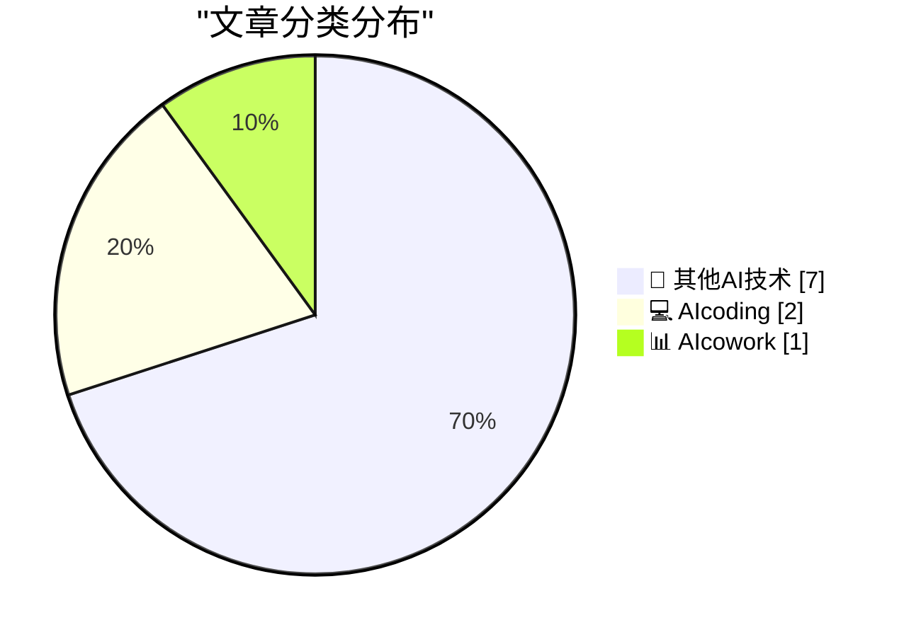
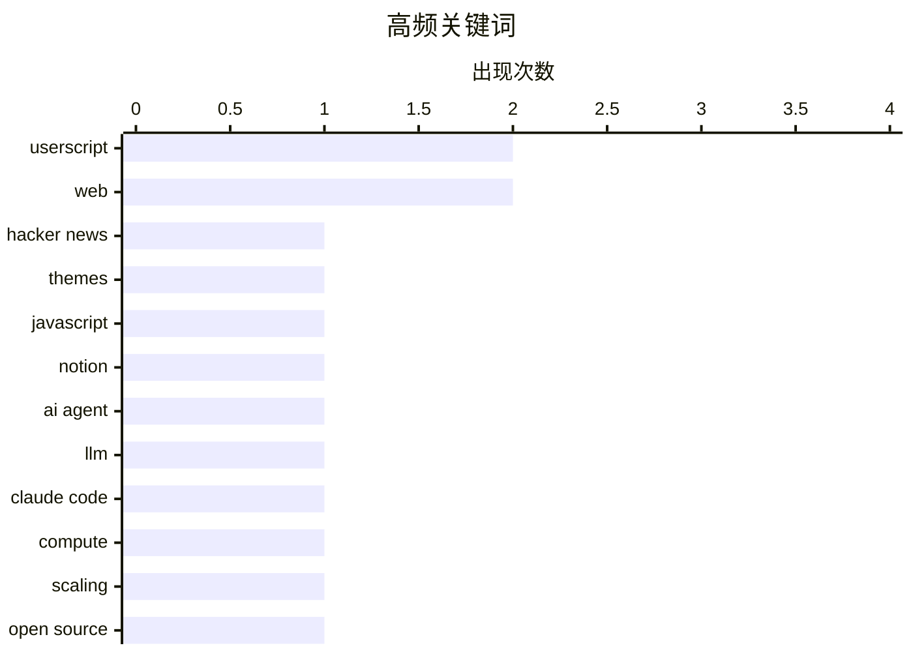

# 📰 AI 博客每日精选 — 2026-03-07

> 来自 98 个技术博客和社交媒体源，AI 精选 Top 10

## 📝 今日看点

今日技术圈聚焦于两大核心趋势：AI平台正积极构建开放生态，以Notion为代表的“AI瑞士”模式旨在赋予用户模型选择自由；与此同时，行业面临算力需求的严峻挑战，用户规模激增引发对基础设施的深度关切。此外，开源协作持续深化，新工作组的成立与工具迭代共同推动着开发者体验的优化。

---

## 🏆 今日必读

🥇 **HN Skins 0.3.0 发布**

[HN Skins 0.3.0](https://susam.net/code/news/hnskins/0.3.0.html) — susam.net · 21 小时前 · 🔬 其他AI技术

> HN Skins 是一款为 Hacker News 网站添加自定义主题的浏览器用户脚本。0.3.0 版本是一个小更新，修复了之前版本遗留的几个问题。具体修复包括：评论输入框现在使用与当前活动主题一致的字体和字号，同时已访问链接的颜色被略微调暗，以使其与未访问链接更容易区分。

💡 **为什么值得读**: 如果你经常浏览 Hacker News 并希望获得更个性化的视觉体验，这个脚本的小幅优化值得关注。

🏷️ Hacker News, Userscript, Themes

🥈 **移除烦人的网站元素**

[Remove annoying banners](https://maurycyz.com/projects/fixsite/) — maurycyz.com · 21 小时前 · 🔬 其他AI技术

> 这是一个用于移除网页上大多数烦人元素（如“骚扰条幅”）的 JavaScript 代码片段。其核心逻辑是遍历页面所有元素，读取其样式信息，并根据特定条件（如元素位置、尺寸）进行筛选和移除。代码示例展示了如何通过 `getComputedStyle` 和 `querySelectorAll` 实现这一功能。

💡 **为什么值得读**: 这段简洁的代码为解决网页浏览中的常见痛点提供了一个直接的技术思路。

🏷️ JavaScript, Web, Userscript

🥉 **Notion 致力于成为“AI 瑞士”，支持用户自由选择模型**

[RT Akshay Kothari: We're working hard to make @NotionHQ the AI Switzerland🇨🇭 -- make it incredibly easy for you (and your company) to pick whate...](https://x.com/NotionHQ/status/2030055180184736152) — 𝕏 @NotionHQ · 22 小时前 · 📊 AIcowork

> Notion 宣布其战略目标是成为“AI 瑞士”，即一个中立平台，让用户和公司能自由选择任何想用的 AI 模型。其核心价值主张是将所有上下文集中在一处，并允许接入任意模型，从而让用户完全掌控如何构建“智能体化”的未来。作为该计划的一部分，Notion 开始引入更多模型，例如其首个开放权重模型，并且其“自定义智能体”功能已支持开放权重模型 MiniMax M2.5。

💡 **为什么值得读**: 了解 Notion 在 AI 集成上的开放平台战略，对于评估未来工具生态和 AI 应用开发有重要参考价值。

🏷️ Notion, AI Agent, LLM

4️⃣ **AI 算力危机到来了吗？**

[Is the AI Compute Crunch Here?](https://martinalderson.com/posts/is-the-ai-compute-crunch-here/?utm_source=rss&amp;utm_medium=rss&amp;utm_campaign=feed) — martinalderson.com · 21 小时前 · 💻 AIcoding

> 文章以 Claude Code 已拥有 200-300 万用户（约占知识工作者总数的 1%）为切入点，探讨 AI 算力需求面临的严峻挑战。作者指出，仅从当前用户基数进行推算，未来的算力需求数字将变得“令人恐惧”。这引发了对 AI 基础设施能否支撑其大规模普及的深度担忧。

💡 **为什么值得读**: 通过一个具体的用户数据，尖锐地指出了 AI 爆发式增长背后潜在的算力瓶颈问题。

🏷️ Claude Code, Compute, Scaling

5️⃣ **宣布成立新的工作组**

[Announcing New Working Groups](https://nesbitt.io/2026/03/07/announcing-new-working-groups.html) — nesbitt.io · 11 小时前 · 🔬 其他AI技术

> 开源基金会联盟宣布成立七个新的工作组。公告本身非常简短，未透露具体的工作组名称或职责范围。这标志着该联盟在组织架构和协作范围上的一次重要扩展。

💡 **为什么值得读**: 关注开源治理和生态协作的读者可以借此了解行业联盟的最新动向。

🏷️ Open Source, Consortium, Working Groups

---

## 📊 数据概览

| 扫描源 | 抓取文章 | 时间范围 | 精选 |
|:---:|:---:|:---:|:---:|
| 75/98 | 2461 篇 → 10 篇 | 24h | **10 篇** |

### 分类分布



### 高频关键词



<details>
<summary>📈 纯文本关键词图（终端友好）</summary>

```
userscript  │ ████████████████████ 2
web         │ ████████████████████ 2
hacker news │ ██████████░░░░░░░░░░ 1
themes      │ ██████████░░░░░░░░░░ 1
javascript  │ ██████████░░░░░░░░░░ 1
notion      │ ██████████░░░░░░░░░░ 1
ai agent    │ ██████████░░░░░░░░░░ 1
llm         │ ██████████░░░░░░░░░░ 1
claude code │ ██████████░░░░░░░░░░ 1
compute     │ ██████████░░░░░░░░░░ 1
```

</details>

### 🏷️ 话题标签

**userscript**(2) · **web**(2) · **hacker news**(1) · themes(1) · javascript(1) · notion(1) · ai agent(1) · llm(1) · claude code(1) · compute(1) · scaling(1) · open source(1) · consortium(1) · working groups(1) · rss(1) · news(1) · cybersecurity(1) · book(1) · history(1) · personal(1)

---

====================

## 🔬 其他AI技术

### 1. HN Skins 0.3.0 发布

[HN Skins 0.3.0](https://susam.net/code/news/hnskins/0.3.0.html) — **susam.net** · 21 小时前 · ⭐ 20/25

> HN Skins 是一款为 Hacker News 网站添加自定义主题的浏览器用户脚本。0.3.0 版本是一个小更新，修复了之前版本遗留的几个问题。具体修复包括：评论输入框现在使用与当前活动主题一致的字体和字号，同时已访问链接的颜色被略微调暗，以使其与未访问链接更容易区分。

🏷️ Hacker News, Userscript, Themes

📌 其他AI技术

---

### 2. 移除烦人的网站元素

[Remove annoying banners](https://maurycyz.com/projects/fixsite/) — **maurycyz.com** · 21 小时前 · ⭐ 19/25

> 这是一个用于移除网页上大多数烦人元素（如“骚扰条幅”）的 JavaScript 代码片段。其核心逻辑是遍历页面所有元素，读取其样式信息，并根据特定条件（如元素位置、尺寸）进行筛选和移除。代码示例展示了如何通过 `getComputedStyle` 和 `querySelectorAll` 实现这一功能。

🏷️ JavaScript, Web, Userscript

📌 其他AI技术

---

### 3. 宣布成立新的工作组

[Announcing New Working Groups](https://nesbitt.io/2026/03/07/announcing-new-working-groups.html) — **nesbitt.io** · 11 小时前 · ⭐ 10/25

> 开源基金会联盟宣布成立七个新的工作组。公告本身非常简短，未透露具体的工作组名称或职责范围。这标志着该联盟在组织架构和协作范围上的一次重要扩展。

🏷️ Open Source, Consortium, Working Groups

📌 其他AI技术

---

### 4. 多元视角：有了 RSS，网络尚可忍受（2026年3月7日）

[Pluralistic: The web is bearable with RSS (07 Mar 2026)](https://pluralistic.net/2026/03/07/reader-mode/) — **pluralistic.net** · 3 小时前 · ⭐ 9/25

> 本文是 Cory Doctorow 的每日博客链接合集，核心主题是 RSS 和阅读器模式如何让浏览网络变得可以忍受。文章包含多个板块，如“看看这个”（分享有趣链接）、“物体恒存性”（科技与文化短评）以及作者近况和著作信息。其内容驳杂，旨在提供一种对抗信息过载和糟糕网络体验的多元视角。

🏷️ RSS, Web, News

📌 其他AI技术

---

### 5. 书评：《电子罪犯》（罗伯特·法尔，1975年） ★★★⯪☆

[Book Review: The Electronic Criminals by Robert Farr (1975) ★★★⯪☆](https://shkspr.mobi/blog/2026/03/book-review-the-electronic-criminals-by-robert-farr-1975/) — **shkspr.mobi** · 8 小时前 · ⭐ 9/25

> 这篇书评探讨了一本五十年前关于网络安全的书籍《电子罪犯》能带给今人什么启示。该书创作于计算机刚进入主流之际，描绘了通过电传进行欺诈、对物理磁带实施“勒索软件”、窃取密码和入侵大型机等“恐怖”的新犯罪世界。书评认为该书开头有力，但因当时真实案例有限而后续逐渐乏力。

🏷️ Cybersecurity, Book, History

📌 其他AI技术

---

### 6. 使用 Clankers 帮助我应对手术恢复期

[Using Clankers to Help Me Process Surgery](https://xeiaso.net/blog/2026/surgery-recovery-clankers/) — **xeiaso.net** · 21 小时前 · ⭐ 8/25

> 文章讲述了作者在凌晨四点的术后恢复期间，与“永不睡眠的机器”（Clankers）为伴的独特经历。这些机器在特殊时刻成为了恰如其分的陪伴者。

🏷️ Personal, Surgery, Recovery

📌 其他AI技术

---

### 7. Daring Fireball 周刊赞助席位开放

[Daring Fireball Weekly Sponsorship Openings](https://daringfireball.net/feeds/sponsors/) — **daringfireball.net** · 23 小时前 · ⭐ 7/25

> 文章介绍了 Daring Fireball 博客自 2007 年以来最主要的收入来源——每周赞助。该模式之所以成功，是因为它实现了多方共赢：为博客带来可观收入；每周仅一家赞助商且内容与读者高度相关，避免了读者反感；同时赞助效果也得到了客户认可。作者最喜欢的一点是这种模式带来的赞助商多样性。

🏷️ Sponsorship, Business, Blog

📌 其他AI技术

---

## 💻 AIcoding

### 8. AI 算力危机到来了吗？

[Is the AI Compute Crunch Here?](https://martinalderson.com/posts/is-the-ai-compute-crunch-here/?utm_source=rss&amp;utm_medium=rss&amp;utm_campaign=feed) — **martinalderson.com** · 21 小时前 · ⭐ 14/25

> 文章以 Claude Code 已拥有 200-300 万用户（约占知识工作者总数的 1%）为切入点，探讨 AI 算力需求面临的严峻挑战。作者指出，仅从当前用户基数进行推算，未来的算力需求数字将变得“令人恐惧”。这引发了对 AI 基础设施能否支撑其大规模普及的深度担忧。

🏷️ Claude Code, Compute, Scaling

📌 AIcoding

---

### 9. GitHub 分享团队协作心得：学会放手

[Being a team player means learning to let go. What tips do you have for empowering your team? https://github.blog/developer-skills/programming-languag...](https://x.com/github/status/2030343121763021302) — **𝕏 @GitHub** · 3 小时前 · ⭐ 8/25

> GitHub 发布推文，探讨团队协作的关键在于“学会放手”，并询问社区有何赋能团队的技巧。推文链接至一篇博客文章，该文总结了 C# 和 TypeScript 架构师 Anders Hejlsberg 关于编程语言和框架的 7 点心得。

🏷️ Teamwork, GitHub, Soft Skills

📌 AIcoding

---

## 📊 AIcowork

### 10. Notion 致力于成为“AI 瑞士”，支持用户自由选择模型

[RT Akshay Kothari: We're working hard to make @NotionHQ the AI Switzerland🇨🇭 -- make it incredibly easy for you (and your company) to pick whate...](https://x.com/NotionHQ/status/2030055180184736152) — **𝕏 @NotionHQ** · 22 小时前 · ⭐ 15/25

> Notion 宣布其战略目标是成为“AI 瑞士”，即一个中立平台，让用户和公司能自由选择任何想用的 AI 模型。其核心价值主张是将所有上下文集中在一处，并允许接入任意模型，从而让用户完全掌控如何构建“智能体化”的未来。作为该计划的一部分，Notion 开始引入更多模型，例如其首个开放权重模型，并且其“自定义智能体”功能已支持开放权重模型 MiniMax M2.5。

🏷️ Notion, AI Agent, LLM

📌 AIcowork

---

====================

*生成于 2026-03-07 21:20 | 扫描 75 源 → 获取 2461 篇 → 精选 10 篇*
*基于 [Hacker News Popularity Contest 2025](https://refactoringenglish.com/tools/hn-popularity/) RSS 源列表，由 [Andrej Karpathy](https://x.com/karpathy) 推荐*
*由「懂点儿AI」制作，欢迎关注同名微信公众号获取更多 AI 实用技巧 💡*
