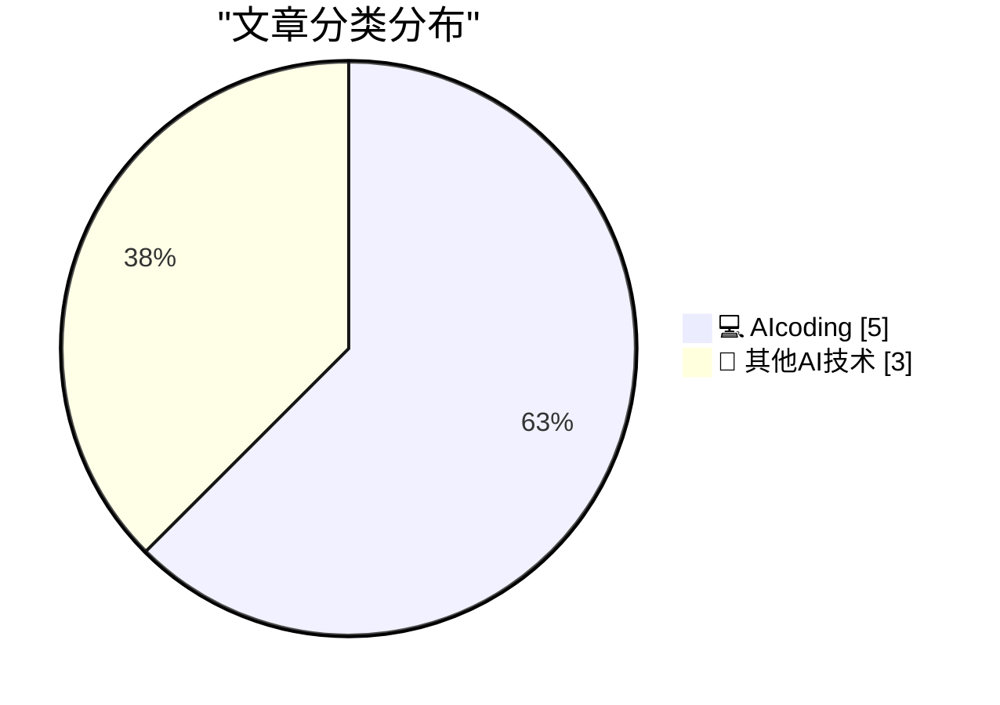
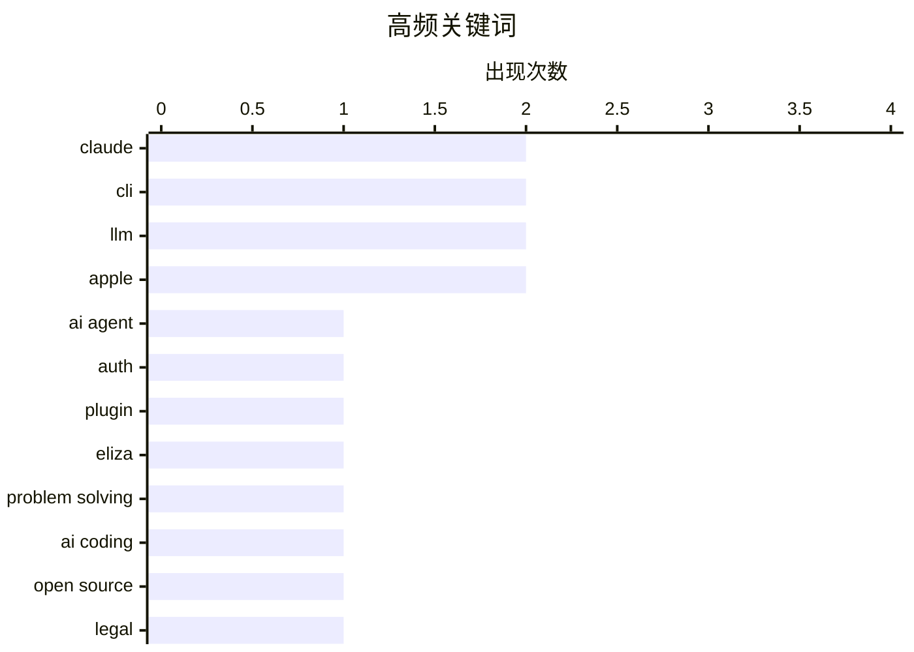

# 📰 AI 博客每日精选 — 2026-03-08

> 来自 98 个技术博客和社交媒体源，AI 精选 Top 8

## 📝 今日看点

今日技术圈聚焦于AI编码工具的深度进化与行业反思。一方面，AI代理正从代码生成迈向复杂问题解决与自动化集成，甚至引发了关于开源许可的法律伦理新讨论。另一方面，工具生态出现“形似神不似”的批判性声音，提示业界需关注工具本质与设计哲学。同时，顶尖学者对AI能力的看法转变，标志着其解决复杂科学问题的潜力正获得权威认可。

---

## 🏆 今日必读

🥇 **‘npx workos’**

[‘npx workos’](https://workos.com/docs/authkit/cli-installer?utm_source=tldrdev&amp;utm_medium=newsletter&amp;utm_campaign=q12026) — daringfireball.net · 23 小时前 · 💻 AIcoding

> WorkOS 推出的 CLI 工具 `npx workos` 是一个由 Claude 驱动的 AI 代理，旨在自动化解决项目中的身份验证集成问题。该工具会读取现有项目代码，自动检测技术栈框架，并直接编写出适配的完整身份验证集成代码，而非简单的模板生成。它具备自我纠错能力，能进行类型检查、构建，并将错误反馈给自身进行修复。这代表了一种新型的、基于代码理解的智能集成开发工具。

💡 **为什么值得读**: 它展示了 AI 代理如何超越代码生成，通过理解上下文并提供端到端的解决方案来真正提升开发效率。

🏷️ AI Agent, Claude, CLI, Auth

🥈 **介绍 llm-eliza**

[Introducing llm-eliza](https://evanhahn.com/llm-eliza/) — evanhahn.com · 21 小时前 · 💻 AIcoding

> 作者为流行的 CLI 工具 LLM 开发了一个名为 `llm-eliza` 的插件。该插件允许用户通过 LLM 工具与经典的 ELIZA 语言模型进行对话。ELIZA 是上世纪60年代开发的一个早期自然语言处理程序，以模拟罗杰斯式心理治疗师而闻名。这个插件将复古的 AI 对话体验集成到了现代的命令行工具生态中。

💡 **为什么值得读**: 这个项目巧妙地将 AI 历史与当代工具结合，为开发者提供了一个怀旧且有趣的交互体验。

🏷️ LLM, CLI, Plugin, ELIZA

🥉 **高德纳谈 Claude Opus 解决计算机科学问题**

[Donald Knuth on Claude Opus Solving a Computer Science Problem](https://www-cs-faculty.stanford.edu/~knuth/papers/claude-cycles.pdf) — daringfireball.net · 3 小时前 · 💻 AIcoding

> 计算机科学泰斗高德纳（Donald Knuth）分享了他对 AI 看法的一次重大转变。他透露，自己研究数周的一个开放性问题，被 Anthropic 发布仅三周的 Claude Opus 4.6 混合推理模型解决了。这一事件直接促使他重新审视自己对“生成式 AI”的原有观点。高德纳不仅为猜想得到优美解答而喜悦，更视此为 AI 领域的一次戏剧性进步。

💡 **为什么值得读**: 来自权威学者的第一手经历，生动地揭示了尖端 AI 模型如何开始实质性推动前沿科学研究。

🏷️ Claude, Problem Solving, LLM

4️⃣ **编码代理能否通过‘净室’实现为开源代码重新授权？**

[Can Coding Agents Relicense Open Source Through a ‘Clean Room’ Implementation of Code?](https://simonwillison.net/2026/Mar/5/chardet/) — daringfireball.net · 3 小时前 · 💻 AIcoding

> 文章围绕 Python 字符编码检测库 `chardet` 的许可证变更事件，探讨了 AI 编码代理引发的法律与伦理问题。`chardet` 原为 LGPL 许可，在新维护者主导下，7.0.0 版本试图通过 AI 代理“净室”重写代码的方式，将许可证改为更宽松的 MIT。核心争议在于，使用 AI 模型基于受版权保护的代码进行“学习”后产出新代码，是否构成合法的净室实现，以及这是否违背了原作者的许可意图。

💡 **为什么值得读**: 此案例是 AI 时代开源许可证冲突的前沿缩影，对开发者、项目维护者和法律界都具有重要的警示和参考价值。

🏷️ AI Coding, Open Source, Legal

5️⃣ **如果它叫起来像个包管理器**

[If It Quacks Like a Package Manager](https://nesbitt.io/2026/03/08/if-it-quacks-like-a-package-manager.html) — nesbitt.io · 11 小时前 · 💻 AIcoding

> 文章批判性地讨论了某些工具在功能上模仿包管理器，但本质上并非真正的包管理器这一现象。作者指出，这些工具可能具备了类似依赖安装或版本管理的“叫声”（功能），却缺乏包管理器的核心架构与设计哲学，比如可靠的依赖解析、安全的供应链管理等。这导致了生态系统的碎片化和开发者的混淆。

💡 **为什么值得读**: 它清晰地区分了工具的表象与本质，帮助开发者在复杂的工具生态中做出更明智的技术选型。

🏷️ Package Manager, Tool Design

---

## 📊 数据概览

| 扫描源 | 抓取文章 | 时间范围 | 精选 |
|:---:|:---:|:---:|:---:|
| 75/98 | 2361 篇 → 8 篇 | 24h | **8 篇** |

### 分类分布



### 高频关键词



<details>
<summary>📈 纯文本关键词图（终端友好）</summary>

```
claude          │ ████████████████████ 2
cli             │ ████████████████████ 2
llm             │ ████████████████████ 2
apple           │ ████████████████████ 2
ai agent        │ ██████████░░░░░░░░░░ 1
auth            │ ██████████░░░░░░░░░░ 1
plugin          │ ██████████░░░░░░░░░░ 1
eliza           │ ██████████░░░░░░░░░░ 1
problem solving │ ██████████░░░░░░░░░░ 1
ai coding       │ ██████████░░░░░░░░░░ 1
```

</details>

### 🏷️ 话题标签

**claude**(2) · **cli**(2) · **llm**(2) · apple(2) · ai agent(1) · auth(1) · plugin(1) · eliza(1) · problem solving(1) · ai coding(1) · open source(1) · legal(1) · package manager(1) · tool design(1) · leadership(1) · news(1) · quote(1) · history(1) · research(1) · hardware(1)

---

====================

## 💻 AIcoding

### 1. ‘npx workos’

[‘npx workos’](https://workos.com/docs/authkit/cli-installer?utm_source=tldrdev&amp;utm_medium=newsletter&amp;utm_campaign=q12026) — **daringfireball.net** · 23 小时前 · ⭐ 21/25

> WorkOS 推出的 CLI 工具 `npx workos` 是一个由 Claude 驱动的 AI 代理，旨在自动化解决项目中的身份验证集成问题。该工具会读取现有项目代码，自动检测技术栈框架，并直接编写出适配的完整身份验证集成代码，而非简单的模板生成。它具备自我纠错能力，能进行类型检查、构建，并将错误反馈给自身进行修复。这代表了一种新型的、基于代码理解的智能集成开发工具。

🏷️ AI Agent, Claude, CLI, Auth

📌 AIcoding

---

### 2. 介绍 llm-eliza

[Introducing llm-eliza](https://evanhahn.com/llm-eliza/) — **evanhahn.com** · 21 小时前 · ⭐ 20/25

> 作者为流行的 CLI 工具 LLM 开发了一个名为 `llm-eliza` 的插件。该插件允许用户通过 LLM 工具与经典的 ELIZA 语言模型进行对话。ELIZA 是上世纪60年代开发的一个早期自然语言处理程序，以模拟罗杰斯式心理治疗师而闻名。这个插件将复古的 AI 对话体验集成到了现代的命令行工具生态中。

🏷️ LLM, CLI, Plugin, ELIZA

📌 AIcoding

---

### 3. 高德纳谈 Claude Opus 解决计算机科学问题

[Donald Knuth on Claude Opus Solving a Computer Science Problem](https://www-cs-faculty.stanford.edu/~knuth/papers/claude-cycles.pdf) — **daringfireball.net** · 3 小时前 · ⭐ 19/25

> 计算机科学泰斗高德纳（Donald Knuth）分享了他对 AI 看法的一次重大转变。他透露，自己研究数周的一个开放性问题，被 Anthropic 发布仅三周的 Claude Opus 4.6 混合推理模型解决了。这一事件直接促使他重新审视自己对“生成式 AI”的原有观点。高德纳不仅为猜想得到优美解答而喜悦，更视此为 AI 领域的一次戏剧性进步。

🏷️ Claude, Problem Solving, LLM

📌 AIcoding

---

### 4. 编码代理能否通过‘净室’实现为开源代码重新授权？

[Can Coding Agents Relicense Open Source Through a ‘Clean Room’ Implementation of Code?](https://simonwillison.net/2026/Mar/5/chardet/) — **daringfireball.net** · 3 小时前 · ⭐ 14/25

> 文章围绕 Python 字符编码检测库 `chardet` 的许可证变更事件，探讨了 AI 编码代理引发的法律与伦理问题。`chardet` 原为 LGPL 许可，在新维护者主导下，7.0.0 版本试图通过 AI 代理“净室”重写代码的方式，将许可证改为更宽松的 MIT。核心争议在于，使用 AI 模型基于受版权保护的代码进行“学习”后产出新代码，是否构成合法的净室实现，以及这是否违背了原作者的许可意图。

🏷️ AI Coding, Open Source, Legal

📌 AIcoding

---

### 5. 如果它叫起来像个包管理器

[If It Quacks Like a Package Manager](https://nesbitt.io/2026/03/08/if-it-quacks-like-a-package-manager.html) — **nesbitt.io** · 11 小时前 · ⭐ 13/25

> 文章批判性地讨论了某些工具在功能上模仿包管理器，但本质上并非真正的包管理器这一现象。作者指出，这些工具可能具备了类似依赖安装或版本管理的“叫声”（功能），却缺乏包管理器的核心架构与设计哲学，比如可靠的依赖解析、安全的供应链管理等。这导致了生态系统的碎片化和开发者的混淆。

🏷️ Package Manager, Tool Design

📌 AIcoding

---

## 🔬 其他AI技术

### 6. 史蒂夫·勒梅登上苹果领导层页面

[Steve Lemay Hits Apple’s Leadership Page](https://www.apple.com/leadership/steve-lemay/) — **daringfireball.net** · 5 小时前 · ⭐ 9/25

> 苹果公司更新了其官方网站的领导层页面，新增了史蒂夫·勒梅（Steve Lemay）的信息。同时，页面中另一位高管埃迪·库伊（Eddy Cue）的头像也得到了更新。此举正式确认了勒梅在苹果公司领导团队中的职位和角色。

🏷️ Apple, Leadership, News

📌 其他AI技术

---

### 7. 爱因斯坦“世界公民”名言的出处是什么？

[What's the source of Einstein's "citizen of the world" quip?](https://shkspr.mobi/blog/2026/03/whats-the-source-of-einsteins-citizen-of-the-world-quip/) — **shkspr.mobi** · 8 小时前 · ⭐ 9/25

> 文章致力于考证爱因斯坦一句广为流传但常无出处的名言：“如果我的相对论被证明是成功的，德国会声称我是德国人，法国会宣布我是世界公民。如果我的理论被证明是错误的，法国会说我是德国人……”。作者通过深入挖掘历史档案，追溯了这句引文的可能来源和传播路径。这种考据工作旨在澄清网络信息的模糊性，还原引文的历史语境。

🏷️ Quote, History, Research

📌 其他AI技术

---

### 8. Neo 解决了苹果的尴尬

[The Neo solves Apple’s embarrassment](https://anildash.com/2026/03/08/neo-apple-embarassment/) — **anildash.com** · 21 小时前 · ⭐ 9/25

> 文章分析了苹果发布售价 600 美元（教育优惠 500 美元）的彩色低端笔记本 MacBook Neo 的市场意义。普遍观点认为此举是苹果首次真正进军低端笔记本市场，旨在挑战廉价的 Windows 笔记本市场。但作者提出了更深层的观点：MacBook Neo 的核心价值在于解决了苹果长期以来的“尴尬”——即其产品线中缺乏一款能让年轻用户轻松入门、并自然融入苹果生态的廉价设备，从而可能重塑其用户增长的基础。

🏷️ Apple, Hardware, Product

📌 其他AI技术

---

====================

*生成于 2026-03-08 21:22 | 扫描 75 源 → 获取 2361 篇 → 精选 8 篇*
*基于 [Hacker News Popularity Contest 2025](https://refactoringenglish.com/tools/hn-popularity/) RSS 源列表，由 [Andrej Karpathy](https://x.com/karpathy) 推荐*
*由「懂点儿AI」制作，欢迎关注同名微信公众号获取更多 AI 实用技巧 💡*
