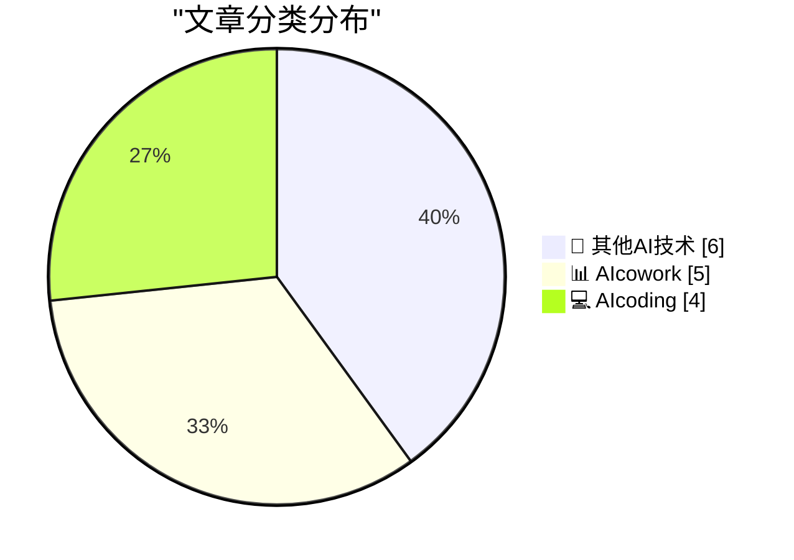
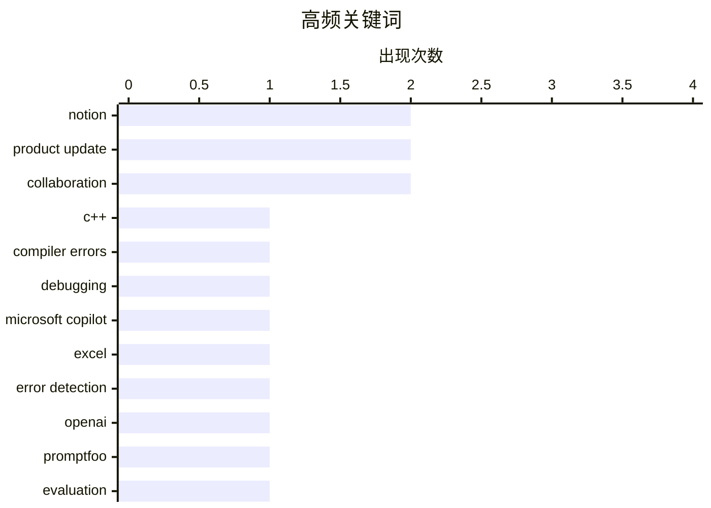

# 📰 AI 博客每日精选 — 2026-03-09

> 来自 98 个技术博客和社交媒体源，AI 精选 Top 15

## 📝 今日看点

今日技术圈的核心焦点在于AI与工作流的深度融合。各大厂商正竞相将AI助手深度嵌入办公套件，从自动修复表格错误到智能起草邮件回复，智能化协作成为明确趋势。同时，AI编程工具正通过收购、功能创新等策略，持续优化开发者体验，致力于提升从代码编写到错误调试的整体效率。

---

## 🏆 今日必读

🥇 **学会阅读 C++ 编译器错误：重载运算符的二义性**

[Learning to read C++ compiler errors: Ambiguous overloaded operator](https://devblogs.microsoft.com/oldnewthing/20260309-00/?p=112118) — devblogs.microsoft.com/oldnewthing · 7 小时前 · 💻 AIcoding

> 文章聚焦于解析 C++ 编译器中因重载运算符二义性产生的错误信息。当编译器报出“ambiguous overloaded operator”错误时，根本原因通常是存在多个可行的运算符函数定义，导致编译器无法做出选择。解决此类问题的关键在于定位并理解这些相互冲突的函数定义来源。作者的核心观点是，通过系统性地分析错误信息中提示的冲突定义，开发者可以高效地诊断并解决这类编译问题。

💡 **为什么值得读**: 对于经常与复杂 C++ 模板或重载代码打交道的开发者，本文提供了直接、实用的调试方法论，能显著提升排查编译错误的效率。

🏷️ C++, Compiler Errors, Debugging

🥈 **现在，在 Excel 中识别和修复电子表格错误变得更加容易**

[Now it’s easier to identify and fix errors in your spreadsheet. Spot issues and get feedback with Microsoft 365 Copilot in Excel.](https://x.com/Microsoft365/status/2031055047165964364) — 𝕏 @Microsoft365 · 4 小时前 · 📊 AIcowork

> Microsoft 365 Copilot 在 Excel 中推出了新的错误识别与修复功能。该功能不仅能自动定位电子表格中错误的根源，还能直接为用户提供修复方案。通过 AI 辅助，用户可以快速发现数据问题并获得反馈，从而提升数据处理效率和准确性。这标志着电子表格工具正从被动计算向主动的、智能化的错误诊断与修正演进。

💡 **为什么值得读**: 对于依赖 Excel 进行数据分析的专业人士，此功能能极大减少人工查错时间，是提升工作流自动化水平的实质性更新。

🏷️ Microsoft Copilot, Excel, Error Detection

🥉 **OpenAI 宣布收购 Promptfoo**

[We’re acquiring Promptfoo. Their technology will strengthen agentic security testing and evaluation capabilities in OpenAI Frontier. Promptfoo will r...](https://x.com/OpenAI/status/2031052793835106753) — 𝕏 @OpenAI · 4 小时前 · 💻 AIcoding

> OpenAI 宣布收购专注于提示词测试与评估的开源工具 Promptfoo。此次收购旨在增强 OpenAI Frontier 在智能体安全测试和评估方面的能力。收购后，Promptfoo 将在现有许可证下继续保持开源，并且 OpenAI 承诺会继续服务和支持现有客户。这表明 OpenAI 正通过整合外部优秀工具来系统性加强其 AI 开发与安全评估的基础设施。

💡 **为什么值得读**: 此次收购揭示了主流 AI 厂商对提示工程标准化、测试自动化工具的重视，对关注 AI 开发生态和最佳实践的从业者有风向标意义。

🏷️ OpenAI, Promptfoo, Evaluation, Agent

4️⃣ **Notion Mail：邮件，但它能自己起草回复**

[RT Notion Mail: Email, but it drafts itself. Connect your inbox to a Custom Agent and try this instruction: “draft responses to emails that need a re...](https://x.com/NotionHQ/status/2031030911387791730) — 𝕏 @NotionHQ · 7 小时前 · 📊 AIcowork

> Notion Mail 推出了一项由自定义智能体驱动的新功能，可自动起草邮件回复。用户只需将收件箱连接到自定义智能体，并给出类似“为需要回复的邮件起草回复”的指令。随后，收件箱中便会填充好待发送的回复草稿，用户只需审阅并点击发送即可。这功能将 AI 深度集成到邮件工作流中，旨在自动化邮件回复的起草环节。

💡 **为什么值得读**: 展示了 Notion 如何将其 AI 能力从文档协作延伸至核心通信场景，为追求邮件处理效率的用户提供了一个新颖的自动化解决方案。

🏷️ Notion, Email Agent, Automation

5️⃣ **GitHub Copilot CLI 如何优化您的时间（通过歌曲展示）**

[We could tell you about how Copilot CLI can optimize your time, but we'd rather have @cassidoo sing about it instead.](https://x.com/github/status/2031080193700274307) — 𝕏 @GitHub · 2 小时前 · 💻 AIcoding

> GitHub 通过一段创意歌曲视频来展示 Copilot CLI 如何优化开发者在命令行中的时间。视频以生动有趣的方式，而非传统的技术说明，来传达 Copilot CLI 的核心价值。这种表现形式旨在突出该工具能帮助开发者更高效地使用命令行，减少记忆命令和查找参数的时间。本质上，这是对 Copilot CLI 提升开发者体验的一种创新营销。

💡 **为什么值得读**: 以轻松、富有创意的方式介绍技术工具，让开发者能直观感受其效率提升的潜力，形式新颖且易于传播。

🏷️ GitHub Copilot, CLI, Productivity

---

## 📊 数据概览

| 扫描源 | 抓取文章 | 时间范围 | 精选 |
|:---:|:---:|:---:|:---:|
| 74/98 | 2357 篇 → 18 篇 | 24h | **15 篇** |

### 分类分布



### 高频关键词



<details>
<summary>📈 纯文本关键词图（终端友好）</summary>

```
notion            │ ████████████████████ 2
product update    │ ████████████████████ 2
collaboration     │ ████████████████████ 2
c++               │ ██████████░░░░░░░░░░ 1
compiler errors   │ ██████████░░░░░░░░░░ 1
debugging         │ ██████████░░░░░░░░░░ 1
microsoft copilot │ ██████████░░░░░░░░░░ 1
excel             │ ██████████░░░░░░░░░░ 1
error detection   │ ██████████░░░░░░░░░░ 1
openai            │ ██████████░░░░░░░░░░ 1
```

</details>

### 🏷️ 话题标签

**notion**(2) · **product update**(2) · **collaboration**(2) · c++(1) · compiler errors(1) · debugging(1) · microsoft copilot(1) · excel(1) · error detection(1) · openai(1) · promptfoo(1) · evaluation(1) · agent(1) · email agent(1) · automation(1) · github copilot(1) · cli(1) · productivity(1) · google workspace(1) · microsoft 365(1)

---

====================

## 🔬 其他AI技术

### 1. MacBook Neo 壁纸现已在 macOS Tahoe 26.4 Beta 中面向所有 Mac 提供

[MacBook Neo Wallpapers Now Available for All Macs in MacOS Tahoe 26.4 Beta](https://www.macrumors.com/2026/03/09/macos-tahoe-26-4-beta-4-neo-wallpapers/) — **daringfireball.net** · 1 小时前 · ⭐ 12/25

> 苹果在 macOS Tahoe 26.4 Beta 4 中为所有 Mac 用户提供了此前 MacBook Neo 专属的系列壁纸。这些壁纸采用气泡风格的线条和彩色渐变设计，拥有 Mac 紫色、蓝色、粉色和黄色四种配色。其设计和颜色共同拼写出了“Mac”一词。这一更新将高端型号的视觉元素下放，丰富了所有 Mac 用户的个性化选择。

🏷️ macOS, Wallpaper, Beta

📌 其他AI技术

---

### 2. 细则给予，粗体夺走：倒计时器

[The fine print giveth and the bold print taketh away: The countdown timer](https://devblogs.microsoft.com/oldnewthing/20260309-01/?p=112120) — **devblogs.microsoft.com/oldnewthing** · 7 小时前 · ⭐ 10/25

> 文章探讨了软件许可协议中“细则”与“粗体”条款的矛盾性。作者以微软产品中常见的倒计时器为例，指出粗体显示的“免费试用”等承诺常被细则中的限制性条款所削弱。这种设计模式可能导致用户在未充分知情的情况下接受不利条款。核心观点是，用户应警惕营销宣传与法律条文之间的差距，仔细阅读细则。

🏷️ UI Design, Countdown Timer, Anecdote

📌 其他AI技术

---

### 3. 书评：《反记忆部不存在》作者：qntm ★★★★★

[Book Review: There Is No Antimemetics Division by qntm ★★★★★](https://shkspr.mobi/blog/2026/03/book-review-there-is-no-antimemetics-division-by-qntm/) — **shkspr.mobi** · 8 小时前 · ⭐ 9/25

> 这是一篇关于科幻小说《There Is No Antimemetics Division》的五星书评。评论者曾于四年前读过本书早期版本但毫无记忆，这恰好契合了书中“反记忆”（无法被记住的事物）的核心设定。小说构建了一个SCP基金会风格的世界，其中存在能抹除自身存在痕迹的恐怖实体。作者认为这本书成功营造了一种“既真实又略微扭曲”的梦魇感，是其读过最令人不安的科幻作品之一。

🏷️ Book Review, Science Fiction, Antimemetics

📌 其他AI技术

---

### 4. 第100篇文章

[100 Posts](https://nesbitt.io/2026/03/09/100-posts.html) — **nesbitt.io** · 11 小时前 · ⭐ 9/25

> 这是作者个人博客的第100篇帖子。文章简短地标记了这一里程碑，并未展开具体的技术或观点讨论。内容核心仅是宣告博客达到了百篇发布的计数。

🏷️ Milestone, Blogging, Meta

📌 其他AI技术

---

### 5. IBM PC/XT 5160 型号

[IBM PC/XT Model 5160](https://dfarq.homeip.net/ibm-pc-xt-model-5160/?utm_source=rss&#038;utm_medium=rss&#038;utm_campaign=ibm-pc-xt-model-5160) — **dfarq.homeip.net** · 10 小时前 · ⭐ 9/25

> 文章回顾了IBM于1983年3月8日发布的PC/XT（型号5160）个人电脑。作为IBM PC的后续机型，“XT”代表“扩展技术”，其最大改进是内置了10MB硬盘，这是主流个人电脑首次标配硬盘。相比原版PC，XT提供了更强的扩展能力，确立了未来PC的基本形态，并取得了巨大的商业成功。

🏷️ Retro Computing, IBM PC, History

📌 其他AI技术

---

### 6. 多元主义：亿万富翁对自身（尤其是我们）构成威胁（2026年3月9日）

[Pluralistic: Billionaires are a danger to themselves and (especially) us (09 Mar 2026)](https://pluralistic.net/2026/03/09/autocrats-of-trade-2/) — **pluralistic.net** · 4 小时前 · ⭐ 8/25

> 文章核心论点是亿万富翁的财富与权力已成为大规模政策失败的根源，对社会构成严重威胁。作者将亿万富翁比作“生产政策失败的机器”，认为他们利用财富扭曲政治、规避监管，最终导致公共利益受损。文章属于每日链接合集，标题观点是其核心论述，其余部分包含了对DRM、版权、电子书等科技文化话题的多个短评链接。

🏷️ Policy, Billionaires, Social Commentary

📌 其他AI技术

---

## 📊 AIcowork

### 7. 现在，在 Excel 中识别和修复电子表格错误变得更加容易

[Now it’s easier to identify and fix errors in your spreadsheet. Spot issues and get feedback with Microsoft 365 Copilot in Excel.](https://x.com/Microsoft365/status/2031055047165964364) — **𝕏 @Microsoft365** · 4 小时前 · ⭐ 20/25

> Microsoft 365 Copilot 在 Excel 中推出了新的错误识别与修复功能。该功能不仅能自动定位电子表格中错误的根源，还能直接为用户提供修复方案。通过 AI 辅助，用户可以快速发现数据问题并获得反馈，从而提升数据处理效率和准确性。这标志着电子表格工具正从被动计算向主动的、智能化的错误诊断与修正演进。

🏷️ Microsoft Copilot, Excel, Error Detection

📌 AIcowork

---

### 8. Notion Mail：邮件，但它能自己起草回复

[RT Notion Mail: Email, but it drafts itself. Connect your inbox to a Custom Agent and try this instruction: “draft responses to emails that need a re...](https://x.com/NotionHQ/status/2031030911387791730) — **𝕏 @NotionHQ** · 7 小时前 · ⭐ 19/25

> Notion Mail 推出了一项由自定义智能体驱动的新功能，可自动起草邮件回复。用户只需将收件箱连接到自定义智能体，并给出类似“为需要回复的邮件起草回复”的指令。随后，收件箱中便会填充好待发送的回复草稿，用户只需审阅并点击发送即可。这功能将 AI 深度集成到邮件工作流中，旨在自动化邮件回复的起草环节。

🏷️ Notion, Email Agent, Automation

📌 AIcowork

---

### 9. 回顾二月 Google Workspace 更新：更智能的 Gmail、Docs 等

[Catch up on the latest features and updates we've rolled out in the February Google Workspace Drop: 🧠 Make the most of your time in Gmail, Docs, Ca...](https://x.com/GoogleWorkspace/status/2031075049340346849) — **𝕏 @GoogleWorkspace** · 3 小时前 · ⭐ 18/25

> Google 总结了二月份为 Google Workspace 推出的一系列新功能和更新。重点更新包括在 Gmail、Docs、Calendar 和 Chat 中引入更智能的时间管理与协作工具，以及旨在打破语言障碍、促进全球协作的沟通功能。这些更新持续强化了 Workspace 套件的生产力和协作能力。这表明 Google 正致力于通过 AI 和智能化来深度优化核心办公应用的用户体验。

🏷️ Google Workspace, Product Update, Collaboration

📌 AIcowork

---

### 10. Microsoft 365 Copilot 即将迎来激动人心的更新

[Exciting updates coming to Microsoft 365 Copilot. Learn more: https://msft.it/392026XC](https://x.com/Microsoft365/status/2031008322497790258) — **𝕏 @Microsoft365** · 7 小时前 · ⭐ 17/25

> Microsoft 宣布将为 Microsoft 365 Copilot 带来名为“Copilot Cowork”的重大更新。Cowork 是一种新的任务完成方式，当用户移交一项任务给它时，它能将请求转化为计划，并在用户的应用程序和文件之间跨应用执行。该功能以用户的工作数据为基础，并在 M365 的安全与治理框架内运行。这标志着 Copilot 从单点辅助工具向能够自主规划并执行跨应用工作流的智能协作者演进。

🏷️ Microsoft 365, Copilot Cowork, Task Automation

📌 AIcowork

---

### 11. Notion 即将推出令人眼前一亮的新功能

[RT Stephen Wu: We've got something dashing coming to @NotionHQ today. Hope it doesn't make you too board 👀](https://x.com/NotionHQ/status/2031048624822702470) — **𝕏 @NotionHQ** · 5 小时前 · ⭐ 11/25

> Notion 官方通过一条预告推文暗示，当天将有一项“令人眼前一亮”的新功能发布。推文使用了“dashing”和“board”等双关语，引发了社区对于新功能可能与仪表板、面板或看板类功能相关的猜测。这是一种典型的悬念式产品发布预热手段。其目的是在正式发布前营造期待感并吸引用户关注。

🏷️ Notion, Product Update, Collaboration

📌 AIcowork

---

## 💻 AIcoding

### 12. 学会阅读 C++ 编译器错误：重载运算符的二义性

[Learning to read C++ compiler errors: Ambiguous overloaded operator](https://devblogs.microsoft.com/oldnewthing/20260309-00/?p=112118) — **devblogs.microsoft.com/oldnewthing** · 7 小时前 · ⭐ 21/25

> 文章聚焦于解析 C++ 编译器中因重载运算符二义性产生的错误信息。当编译器报出“ambiguous overloaded operator”错误时，根本原因通常是存在多个可行的运算符函数定义，导致编译器无法做出选择。解决此类问题的关键在于定位并理解这些相互冲突的函数定义来源。作者的核心观点是，通过系统性地分析错误信息中提示的冲突定义，开发者可以高效地诊断并解决这类编译问题。

🏷️ C++, Compiler Errors, Debugging

📌 AIcoding

---

### 13. OpenAI 宣布收购 Promptfoo

[We’re acquiring Promptfoo. Their technology will strengthen agentic security testing and evaluation capabilities in OpenAI Frontier. Promptfoo will r...](https://x.com/OpenAI/status/2031052793835106753) — **𝕏 @OpenAI** · 4 小时前 · ⭐ 19/25

> OpenAI 宣布收购专注于提示词测试与评估的开源工具 Promptfoo。此次收购旨在增强 OpenAI Frontier 在智能体安全测试和评估方面的能力。收购后，Promptfoo 将在现有许可证下继续保持开源，并且 OpenAI 承诺会继续服务和支持现有客户。这表明 OpenAI 正通过整合外部优秀工具来系统性加强其 AI 开发与安全评估的基础设施。

🏷️ OpenAI, Promptfoo, Evaluation, Agent

📌 AIcoding

---

### 14. GitHub Copilot CLI 如何优化您的时间（通过歌曲展示）

[We could tell you about how Copilot CLI can optimize your time, but we'd rather have @cassidoo sing about it instead.](https://x.com/github/status/2031080193700274307) — **𝕏 @GitHub** · 2 小时前 · ⭐ 18/25

> GitHub 通过一段创意歌曲视频来展示 Copilot CLI 如何优化开发者在命令行中的时间。视频以生动有趣的方式，而非传统的技术说明，来传达 Copilot CLI 的核心价值。这种表现形式旨在突出该工具能帮助开发者更高效地使用命令行，减少记忆命令和查找参数的时间。本质上，这是对 Copilot CLI 提升开发者体验的一种创新营销。

🏷️ GitHub Copilot, CLI, Productivity

📌 AIcoding

---

### 15. 氛围编程实践报告：制作一个赞助商面板

[Vibe Coding Trip Report: Making a sponsor panel](https://xeiaso.net/blog/2026/vibe-coding-sponsor-panel/) — **xeiaso.net** · 21 小时前 · ⭐ 15/25

> 作者分享了一次在紧迫时间限制下（手术前），采用“氛围编程”方式快速开发一个赞助商面板的经历。所谓“氛围编程”，指的是一种更依赖直觉、流畅感和当下工具，而非严格计划与设计的方法。尽管开发节奏紧凑，但最终成果令人满意。这次实践表明，在特定场景下，放松的、以交付为导向的编码方式也能有效产出可用的成果。

🏷️ Vibe Coding, Web Development, Personal Project

📌 AIcoding

---

====================

*生成于 2026-03-09 21:32 | 扫描 74 源 → 获取 2357 篇 → 精选 15 篇*
*基于 [Hacker News Popularity Contest 2025](https://refactoringenglish.com/tools/hn-popularity/) RSS 源列表，由 [Andrej Karpathy](https://x.com/karpathy) 推荐*
*由「懂点儿AI」制作，欢迎关注同名微信公众号获取更多 AI 实用技巧 💡*
