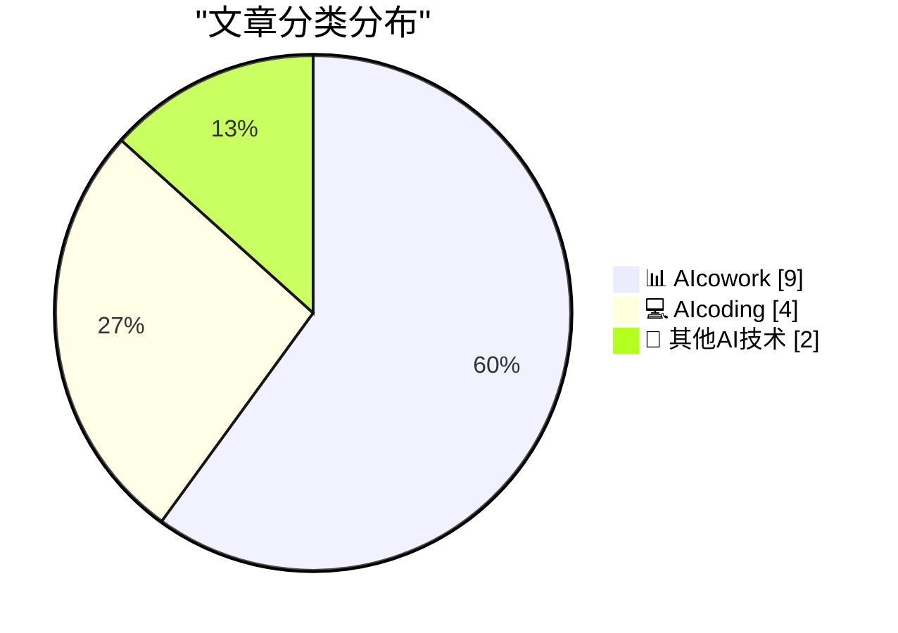
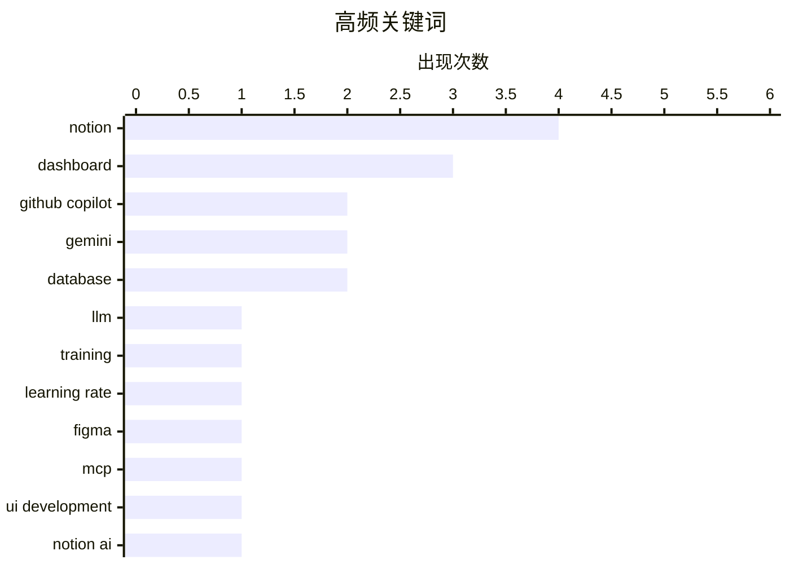

# 📰 AI 博客每日精选 — 2026-03-10

> 来自 98 个技术博客和社交媒体源，AI 精选 Top 15

## 📝 今日看点

今日技术圈聚焦于AI工具如何深度融入工作流以提升效率。AI编程助手正与开发环境及设计工具紧密集成，致力于打通从设计到代码的闭环。同时，以Notion为代表的协作平台通过引入智能全局筛选、数字图表等AI功能，正在重塑团队的信息管理与决策方式。

---

## 🏆 今日必读

🥇 **从零开始构建LLM，第32e部分——干预：学习率**

[Writing an LLM from scratch, part 32e -- Interventions: the learning rate](https://www.gilesthomas.com/2026/03/llm-from-scratch-32e-interventions-learning-rate) — gilesthomas.com · -146 分钟前 · 💻 AIcoding

> 作者在基于Sebastian Raschka的书籍《从零开始构建大语言模型》训练一个GPT-2小基础模型时，正致力于优化其测试损失。文章的核心是探讨如何通过调整优化器中的学习率参数来改善模型训练效果。作者分享了其训练代码中创建优化器的具体片段，并聚焦于学习率这一关键超参数对模型性能的影响。最终目标是找到最佳的学习率设置，以降低测试损失，提升这个代码训练模型的整体表现。

💡 **为什么值得读**: 对于希望深入理解大语言模型训练细节，特别是学习率调优实践的技术人员，这篇文章提供了第一手的实战经验。

🏷️ LLM, Training, Learning Rate

🥈 **GitHub Copilot、VS Code与Figma通过双向MCP服务器实现设计与生产闭环**

[That gap between design and production? Closed. 🔁 GitHub Copilot, @code, and @figma now create a continuous loop. With the bidirectional Figma MCP ...](https://x.com/github/status/2031418718501089468) — 𝕏 @GitHub · 4 小时前 · 💻 AIcoding

> GitHub宣布其Copilot、VS Code与Figma通过新的双向Figma MCP服务器实现深度集成，旨在弥合设计与开发之间的鸿沟。该集成允许开发者将Figma设计上下文直接拉取到VS Code的编码环境中，同时也能将编码实现的工作UI组件推送回Figma画布。这创建了一个从设计到代码再反馈回设计的连续工作流。此举让开发者能在编码流程中无缝对接设计资产，保持工作流的连贯性。

💡 **为什么值得读**: 它展示了AI辅助编程工具如何与设计工具深度融合，为前端和全栈开发者提供了提升跨职能协作效率的颠覆性工作流。

🏷️ GitHub Copilot, Figma, MCP, UI Development

🥉 **Notion AI会议笔记三大更新：侧边栏会议视图、自动同意通知与日语优化**

[RT Zach Tratar: Three great updates to Notion AI Meeting Notes! 📅 Meetings in sidebar: One click to review notes or prep for what's next. 🗣️ Au...](https://x.com/NotionHQ/status/2031403785139138853) — 𝕏 @NotionHQ · 5 小时前 · 📊 AIcowork

> Notion AI的会议笔记功能发布了三项重要更新，旨在提升会议记录与管理的效率。更新包括：在侧边栏集中管理会议，一键查看笔记或准备后续会议；为企业与个人用户提供自动化的录音同意通知功能；针对日语转录和摘要质量进行了专项优化，实现了20%的性能提升。这些更新共同增强了Notion AI在跨国、多场景会议中的实用性和合规性。

💡 **为什么值得读**: 对于频繁使用会议记录功能的团队和个人，尤其是涉及日语或多语言场景的用户，此次更新直接解决了效率、合规与质量的核心痛点。

🏷️ Notion AI, Meeting Notes, Transcription

4️⃣ **Notion仪表板专业技巧：使用全新全局筛选功能一键过滤所有数据源**

[🎛️ Dashboard pro tip: instead of filtering each view on your dashboard one by one…use the new GLOBAL FILTERING! Every source in your dashboard. A...](https://x.com/NotionHQ/status/2031143122928021759) — 𝕏 @NotionHQ · 22 小时前 · 📊 AIcowork

> Notion推出了仪表板的全局筛选功能，彻底改变了在多视图仪表板中逐一筛选数据的低效操作。用户现在可以设置一个筛选条件，并同时应用于仪表板上的所有关联数据源和视图。这意味着所有图表、列表等组件会根据同一筛选条件实时联动更新。该功能极大地简化了复杂仪表板的数据探查流程，实现了数据的统一视角分析。

💡 **为什么值得读**: 此功能是Notion在数据可视化与分析能力上的重要进步，能帮助任何使用Notion构建业务仪表板的用户节省大量重复操作时间。

🏷️ Notion, Dashboard, Product Feature

5️⃣ **在Magit中进行变基操作**

[Rebasing in Magit](https://entropicthoughts.com/rebasing-in-magit) — entropicthoughts.com · 22 小时前 · 💻 AIcoding

> 这篇文章是一篇关于在Magit（Emacs的Git客户端）中执行Git变基操作的技术指南。文章详细讲解了使用Magit进行交互式变基的步骤和命令。它可能涵盖了如何重新排序、压缩、编辑提交信息等常见变基任务。对于使用Emacs和Magit进行版本控制的开发者而言，这是一份实用的操作手册。

💡 **为什么值得读**: 对于Emacs用户和希望精通Magit以提升Git工作效率的开发者，这篇文章提供了清晰、直接的操作指引。

🏷️ Git, Magit, Rebase

---

## 📊 数据概览

| 扫描源 | 抓取文章 | 时间范围 | 精选 |
|:---:|:---:|:---:|:---:|
| 72/98 | 2330 篇 → 31 篇 | 24h | **15 篇** |

### 分类分布



### 高频关键词



<details>
<summary>📈 纯文本关键词图（终端友好）</summary>

```
notion         │ ████████████████████ 4
dashboard      │ ███████████████░░░░░ 3
github copilot │ ██████████░░░░░░░░░░ 2
gemini         │ ██████████░░░░░░░░░░ 2
database       │ ██████████░░░░░░░░░░ 2
llm            │ █████░░░░░░░░░░░░░░░ 1
training       │ █████░░░░░░░░░░░░░░░ 1
learning rate  │ █████░░░░░░░░░░░░░░░ 1
figma          │ █████░░░░░░░░░░░░░░░ 1
mcp            │ █████░░░░░░░░░░░░░░░ 1
```

</details>

### 🏷️ 话题标签

**notion**(4) · **dashboard**(3) · **github copilot**(2) · gemini(2) · database(2) · llm(1) · training(1) · learning rate(1) · figma(1) · mcp(1) · ui development(1) · notion ai(1) · meeting notes(1) · transcription(1) · product feature(1) · git(1) · magit(1) · rebase(1) · ai coding(1) · developer tools(1)

---

====================

## 📊 AIcowork

### 1. Notion AI会议笔记三大更新：侧边栏会议视图、自动同意通知与日语优化

[RT Zach Tratar: Three great updates to Notion AI Meeting Notes! 📅 Meetings in sidebar: One click to review notes or prep for what's next. 🗣️ Au...](https://x.com/NotionHQ/status/2031403785139138853) — **𝕏 @NotionHQ** · 5 小时前 · ⭐ 20/25

> Notion AI的会议笔记功能发布了三项重要更新，旨在提升会议记录与管理的效率。更新包括：在侧边栏集中管理会议，一键查看笔记或准备后续会议；为企业与个人用户提供自动化的录音同意通知功能；针对日语转录和摘要质量进行了专项优化，实现了20%的性能提升。这些更新共同增强了Notion AI在跨国、多场景会议中的实用性和合规性。

🏷️ Notion AI, Meeting Notes, Transcription

📌 AIcowork

---

### 2. Notion仪表板专业技巧：使用全新全局筛选功能一键过滤所有数据源

[🎛️ Dashboard pro tip: instead of filtering each view on your dashboard one by one…use the new GLOBAL FILTERING! Every source in your dashboard. A...](https://x.com/NotionHQ/status/2031143122928021759) — **𝕏 @NotionHQ** · 22 小时前 · ⭐ 20/25

> Notion推出了仪表板的全局筛选功能，彻底改变了在多视图仪表板中逐一筛选数据的低效操作。用户现在可以设置一个筛选条件，并同时应用于仪表板上的所有关联数据源和视图。这意味着所有图表、列表等组件会根据同一筛选条件实时联动更新。该功能极大地简化了复杂仪表板的数据探查流程，实现了数据的统一视角分析。

🏷️ Notion, Dashboard, Product Feature

📌 AIcowork

---

### 3. Heidi如何用Notion统一全球团队，每月节省260+小时

[So @tryheidi went from Australia to 150+ countries in a year. At that speed, decisions were vanishing into Slack threads and time zone gaps. So they b...](https://x.com/NotionHQ/status/2031442907211903174) — **𝕏 @NotionHQ** · 2 小时前 · ⭐ 19/25

> 讲述了旅行品牌Heidi在一年内从澳大利亚拓展到150多个国家后，面临决策信息在Slack线程和时差中丢失的挑战。团队通过在Notion中构建统一工作空间来解决此问题，集成了关联数据库、能在Slack中回答问题的自定义智能体以及能够自我补充的知识库。这一套系统化的信息管理方案，最终为团队每月节省了超过260小时的工作时间。案例展示了Notion在管理高速增长、分布全球的团队时的强大整合能力。

🏷️ Notion, Knowledge Base, Workflow Automation

📌 AIcowork

---

### 4. Google Workspace为Gemini高级用户推出全新AI功能

[New Gemini features are rolling out today in Google Workspace for Gemini Alpha customers and Google AI Pro and Ultra subscribers. ✨ Go from a blank d...](https://x.com/GoogleWorkspace/status/2031430637979123925) — **𝕏 @GoogleWorkspace** · 3 小时前 · ⭐ 19/25

> Google Workspace面向Gemini Alpha客户及Google AI Pro和Ultra订阅用户，推出了一系列新的Gemini AI功能。在Docs中，Gemini可作为写作伙伴，帮助用户从空白文档完成终稿；在Slides中，无需设计技能即可在几分钟内创建演示文稿；在Sheets中，能从基础任务到复杂数据分析，协助创建、组织和编辑整个表格；在Drive中，能即时从文件中查找信息并获取洞察。这些更新全面增强了办公套件各核心组件的AI辅助能力。

🏷️ Google Workspace, Gemini, Product Update

📌 AIcowork

---

### 5. Notion推出数字图表：用单一数字和颜色阈值讲述数据故事

[Sometimes the answer is just one number. Say hello to Number Charts! Pick your colors, set your thresholds, and let the score tell the story: yellow f...](https://x.com/NotionHQ/status/2031411939667259770) — **𝕏 @NotionHQ** · 4 小时前 · ⭐ 18/25

> Notion推出了名为“数字图表”的新可视化组件，专注于用单个关键数字来直观展示数据状态。用户可以为数字图表自定义颜色，并设置阈值规则（例如，10到30之间显示黄色，高于显示绿色，低于显示红色）。这种设计使得关键指标的状态一目了然，如同交通信号灯。该功能旨在成为Notion仪表板中突出显示核心指标的最佳搭档，简化数据故事的呈现。

🏷️ Notion, Dashboard, Data Visualization

📌 AIcowork

---

### 6. 收集所需信息，剩下的交给 PowerPoint Agent

[Gather the information you need, and let PowerPoint Agent help with the rest. The result? An on-brand, meeting ready presentation crafted with your in...](https://x.com/Microsoft365/status/2031393428919988309) — **𝕏 @Microsoft365** · 5 小时前 · ⭐ 18/25

> 微软展示了其 Microsoft 365 Copilot 中的 PowerPoint Agent 功能。该功能允许用户提供核心信息，AI 助手将自动生成一份符合品牌规范、可用于会议的完整演示文稿。整个过程强调用户全程参与和引导，AI 负责执行具体的排版、设计和内容组织工作。最终成果是一份“会议就绪”的专业演示稿，显著提升了内容创作效率。

🏷️ Microsoft Copilot, PowerPoint, Presentation

📌 AIcowork

---

### 7. Google Drive 推出 AI 概览和询问 Gemini 功能

[RT Google Drive: For everyone whose most important files are named “untitled” or “final_FINAL_version 3” these features are for you 👀 The new A...](https://x.com/GoogleWorkspace/status/2031400438679863409) — **𝕏 @GoogleWorkspace** · 8 小时前 · ⭐ 18/25

> Google Drive 针对文件命名混乱（如“未命名”、“最终版_v3”）的用户推出了两项新 AI 功能。AI 概览和询问 Gemini 功能目前以测试版形式，面向美国地区的 Google AI Pro 和 Ultra 订阅用户开放。这些功能旨在帮助用户快速理解和梳理云端存储的文件内容，无需手动打开每个文件。此举是 Google 将生成式 AI 深度集成到生产力套件中的重要一步。

🏷️ Google Drive, Gemini, File Management

📌 AIcowork

---

### 8. Notion 推出仪表板功能

[RT andy: 500k views and not a single person noticed it 👀](https://x.com/NotionHQ/status/2031465309144814046) — **𝕏 @NotionHQ** · 2 小时前 · ⭐ 17/25

> Notion 为其数据库推出了全新的“仪表板”视图功能。该功能将看板、表格、图表、时间线等多种视图整合在一个清晰的概览界面中，为用户提供数据库的鸟瞰图。目前该功能正在逐步向用户推送。官方推文以“50万次观看却无人察觉”的悬念式营销，暗示了该功能可能被无缝集成或包含隐藏的惊喜。

🏷️ Notion, Dashboard, Database

📌 AIcowork

---

### 9. Finalist：将你的一整天浓缩在一个屏幕上

[[Sponsor] Finalist](https://www.finalist.works/finalist-36/) — **daringfireball.net** · 22 小时前 · ⭐ 16/25

> Finalist 是一款集成式的 iOS/macOS 日程规划应用，旨在通过单一屏幕呈现用户全天的安排。它能聚合日历、提醒事项和健康数据，确保没有任务被遗漏。最新版本增加了子任务、日历书签、在日记中集成 HealthKit 数据，以及可从锁屏触发的语音每日简报功能。该应用设计为与用户现有工具链协同工作，弥补其他工具的不足，并提供免费试用和终身许可证。

🏷️ Productivity, iOS, HealthKit

📌 AIcowork

---

## 💻 AIcoding

### 10. 从零开始构建LLM，第32e部分——干预：学习率

[Writing an LLM from scratch, part 32e -- Interventions: the learning rate](https://www.gilesthomas.com/2026/03/llm-from-scratch-32e-interventions-learning-rate) — **gilesthomas.com** · -146 分钟前 · ⭐ 21/25

> 作者在基于Sebastian Raschka的书籍《从零开始构建大语言模型》训练一个GPT-2小基础模型时，正致力于优化其测试损失。文章的核心是探讨如何通过调整优化器中的学习率参数来改善模型训练效果。作者分享了其训练代码中创建优化器的具体片段，并聚焦于学习率这一关键超参数对模型性能的影响。最终目标是找到最佳的学习率设置，以降低测试损失，提升这个代码训练模型的整体表现。

🏷️ LLM, Training, Learning Rate

📌 AIcoding

---

### 11. GitHub Copilot、VS Code与Figma通过双向MCP服务器实现设计与生产闭环

[That gap between design and production? Closed. 🔁 GitHub Copilot, @code, and @figma now create a continuous loop. With the bidirectional Figma MCP ...](https://x.com/github/status/2031418718501089468) — **𝕏 @GitHub** · 4 小时前 · ⭐ 20/25

> GitHub宣布其Copilot、VS Code与Figma通过新的双向Figma MCP服务器实现深度集成，旨在弥合设计与开发之间的鸿沟。该集成允许开发者将Figma设计上下文直接拉取到VS Code的编码环境中，同时也能将编码实现的工作UI组件推送回Figma画布。这创建了一个从设计到代码再反馈回设计的连续工作流。此举让开发者能在编码流程中无缝对接设计资产，保持工作流的连贯性。

🏷️ GitHub Copilot, Figma, MCP, UI Development

📌 AIcoding

---

### 12. 在Magit中进行变基操作

[Rebasing in Magit](https://entropicthoughts.com/rebasing-in-magit) — **entropicthoughts.com** · 22 小时前 · ⭐ 19/25

> 这篇文章是一篇关于在Magit（Emacs的Git客户端）中执行Git变基操作的技术指南。文章详细讲解了使用Magit进行交互式变基的步骤和命令。它可能涵盖了如何重新排序、压缩、编辑提交信息等常见变基任务。对于使用Emacs和Magit进行版本控制的开发者而言，这是一份实用的操作手册。

🏷️ Git, Magit, Rebase

📌 AIcoding

---

### 13. 开发者人才遍布全球，AI工具的获取也应如此——GitHub与Andela合作赋能全球开发者

[Developer talent is global. Access to AI tools should be, too. 🌍 💻 Stephen, a React developer working in Rwanda, shares how he uses GitHub Copil...](https://x.com/github/status/2031459064434069926) — **𝕏 @GitHub** · 1 小时前 · ⭐ 19/25

> GitHub强调开发者人才是全球性的，因此AI编程工具的获取也应当普及全球。文章以在卢旺达工作的React开发者Stephen为例，讲述了他如何使用GitHub Copilot来理解复杂代码，并视AI为赋能而非替代工具。GitHub宣布与Andela合作，为全球超过3000名开发者提供结构化的AI培训，以缩小AI工具的可及性差距。这一举措旨在将AI带来的机会扩展到更广泛的开发者社区。

🏷️ GitHub Copilot, AI Coding, Developer Tools

📌 AIcoding

---

## 🔬 其他AI技术

### 14. HN Skins 0.4.0 - 黑色纪念栏更新

[HN Skins 0.4.0 - Black Bar Updates](https://susam.net/code/news/hnskins/0.4.0.html) — **susam.net** · 21 小时前 · ⭐ 18/25

> HN Skins 0.4.0是HN Skins这个为Hacker News网站提供自定义主题的浏览器用户脚本的一次小版本更新。此次更新主要解决了一个特定问题：确保在纪念科技或科学界知名人士逝世时，Hacker News页面顶部出现的纪念性黑色横幅不会被用户安装的皮肤主题所遮盖。新版本修复了此前某些皮肤可能遮挡这一致敬元素的缺陷，体现了对社区文化的尊重。

🏷️ Hacker News, Userscript, Customization

📌 其他AI技术

---

### 15. 就用 Postgres

[Just Use Postgres](https://nesbitt.io/2026/03/10/just-use-postgres.html) — **nesbitt.io** · 11 小时前 · ⭐ 17/25

> 文章主张将“就用 Postgres”这一开发哲学贯彻到极致。其提出的逻辑终点是：开发者只需执行 `git push` 即可完成部署，且整个应用运行在单一的 Postgres 进程中。这种方案将数据库不仅作为数据存储，更作为应用运行的核心容器，极大简化了部署和运维的复杂性。它挑战了现代微服务和复杂架构的必要性，推崇极简主义的技术栈。

🏷️ Postgres, Deployment, Database

📌 其他AI技术

---

====================

*生成于 2026-03-10 21:29 | 扫描 72 源 → 获取 2330 篇 → 精选 15 篇*
*基于 [Hacker News Popularity Contest 2025](https://refactoringenglish.com/tools/hn-popularity/) RSS 源列表，由 [Andrej Karpathy](https://x.com/karpathy) 推荐*
*由「懂点儿AI」制作，欢迎关注同名微信公众号获取更多 AI 实用技巧 💡*
