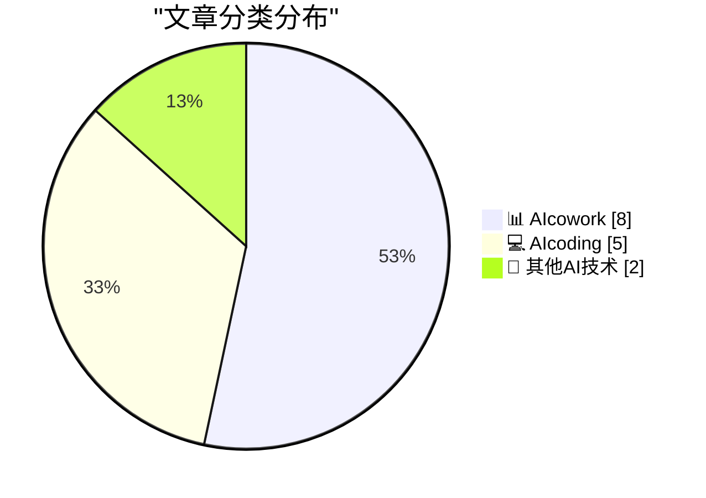
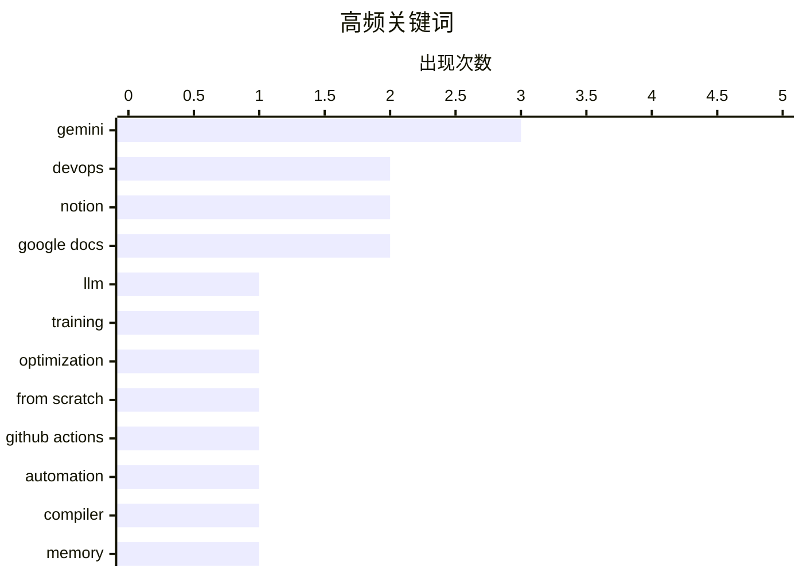

# 📰 AI 博客每日精选 — 2026-03-11

> 来自 98 个技术博客和社交媒体源，AI 精选 Top 15

## 📝 今日看点

今日技术圈聚焦于AI驱动开发与协作工具的深度整合。一方面，AI编程助手正从代码生成向全生命周期渗透，覆盖代码审查、调试记忆乃至底层编译优化。另一方面，AI正重塑团队协作流程，在文档、沟通与项目管理中提供智能风格统一、流程自动化与可视化分析能力，推动工作效率向智能化演进。

---

## 🏆 今日必读

🥇 **从零开始构建LLM，第32e部分——干预：学习率**

[Writing an LLM from scratch, part 32e -- Interventions: the learning rate](https://www.gilesthomas.com/2026/03/llm-from-scratch-32e-interventions-learning-rate) — gilesthomas.com · 21 小时前 · 💻 AIcoding

> 作者在基于Sebastian Raschka的书籍《从零开始构建大语言模型》训练一个GPT-2小型基础模型时，正致力于优化其测试损失。文章的核心是探讨如何通过调整优化器中的学习率来改善模型训练效果。作者分享了其训练代码中创建优化器的具体片段，并暗示学习率是当前阶段提升模型性能的关键干预点。最终结论是，精细调整学习率策略对于降低测试损失、提升从头开始训练的代码模型的性能至关重要。

💡 **为什么值得读**: 对于希望深入理解大语言模型训练细节，特别是学习率调优实践的研究者和开发者，这篇实战笔记提供了具体的技术切入点和代码参考。

🏷️ LLM, Training, Optimization, From Scratch

🥈 **git-pkgs/actions**

[git-pkgs/actions](https://nesbitt.io/2026/03/11/git-pkgs-actions.html) — nesbitt.io · 11 小时前 · 💻 AIcoding

> 这篇文章的主题是如何将git-pkgs工具集成到GitHub Actions工作流中。git-pkgs是一个用于管理依赖包的工具。文章提供了具体的配置步骤和方法，指导开发者实现自动化的工作流程集成。其核心价值在于提升依赖管理的自动化水平和项目构建效率。

💡 **为什么值得读**: 如果你正在使用GitHub Actions并寻求更高效的依赖管理方案，这篇文章提供了即用的集成指南。

🏷️ GitHub Actions, Automation, DevOps

🥉 **编译器如何确保大型栈分配不会跳过保护页？**

[How do compilers ensure that large stack allocations do not skip over the guard page?](https://devblogs.microsoft.com/oldnewthing/20260311-00/?p=112134) — devblogs.microsoft.com/oldnewthing · 7 小时前 · 💻 AIcoding

> 文章探讨了编译器在处理大型栈内存分配时，如何避免分配操作直接跨越内存保护页（guard page）这一底层安全问题。关键机制是编译器不会进行“步幅过大”的单一分配，而是将其分解为多个较小的、安全的分配步骤。这确保了每次分配都能触及保护页并触发正确的异常处理，从而维护栈溢出的检测能力。结论是，编译器通过精细的分配策略来保证内存保护机制的有效性。

💡 **为什么值得读**: 这篇文章以简洁的比喻揭示了编译器与操作系统内存保护机制协同工作的一个精妙细节，适合对系统编程和安全性感兴趣的开发者。

🏷️ Compiler, Memory, Stack

4️⃣ **OpenAI转发：开发者常对Codex在代码审查中的发现感到惊艳**

[RT Romain Huet: Developers coming from other tools are often impressed by what Codex finds in code review. In this video, @majatrebacz and I show how ...](https://x.com/OpenAI/status/2031744906633621856) — 𝕏 @OpenAI · 21 小时前 · 💻 AIcoding

> OpenAI的Codex模型在自动化代码审查方面展现出强大能力，常令来自其他工具的开发者印象深刻。视频演示了如何设置Codex进行代码审查，并逐步查看了它在真实拉取请求（PR）中发现的问题。该功能已包含在ChatGPT Plus/Pro订阅中，或可通过信用额度以每次约1美元的成本使用。这表明AI驱动的深度代码分析正变得更为普及和实用。

💡 **为什么值得读**: 通过真实PR审查演示，直观展示了AI如何提升代码质量检查的深度与效率，对于考虑引入AI辅助代码审查的团队具有参考价值。

🏷️ Code Review, Codex, AI Coding

5️⃣ **GitHub：忘了上次怎么修bug？Copilot CLI记得**

[So you forgot how you fixed that bug the other day. 😬 No worries. GitHub Copilot CLI remembers. With its local SQLite database of your session hist...](https://x.com/github/status/2031841467916800220) — 𝕏 @GitHub · 16 分钟前 · 💻 AIcoding

> GitHub Copilot CLI通过本地SQLite数据库和全文检索索引，记录用户的终端会话历史。用户可以利用该功能快速搜索并找回之前解决问题的工作上下文和具体命令。这旨在帮助开发者节省脑力空间，避免重复寻找解决方案。本质上，它将个人终端操作历史变成了一个可即时查询的知识库。

💡 **为什么值得读**: 该功能将日常终端操作转化为可搜索的资产，能显著提升开发者的上下文切换效率和问题解决速度。

🏷️ GitHub Copilot, CLI, Code Search

---

## 📊 数据概览

| 扫描源 | 抓取文章 | 时间范围 | 精选 |
|:---:|:---:|:---:|:---:|
| 76/98 | 2477 篇 → 23 篇 | 24h | **15 篇** |

### 分类分布



### 高频关键词



<details>
<summary>📈 纯文本关键词图（终端友好）</summary>

```
gemini         │ ████████████████████ 3
devops         │ █████████████░░░░░░░ 2
notion         │ █████████████░░░░░░░ 2
google docs    │ █████████████░░░░░░░ 2
llm            │ ███████░░░░░░░░░░░░░ 1
training       │ ███████░░░░░░░░░░░░░ 1
optimization   │ ███████░░░░░░░░░░░░░ 1
from scratch   │ ███████░░░░░░░░░░░░░ 1
github actions │ ███████░░░░░░░░░░░░░ 1
automation     │ ███████░░░░░░░░░░░░░ 1
```

</details>

### 🏷️ 话题标签

**gemini**(3) · **devops**(2) · **notion**(2) · google docs(2) · llm(1) · training(1) · optimization(1) · from scratch(1) · github actions(1) · automation(1) · compiler(1) · memory(1) · stack(1) · code review(1) · codex(1) · ai coding(1) · github copilot(1) · cli(1) · code search(1) · presentation(1)

---

====================

## 📊 AIcowork

### 1. Notion转发：演示模式现已支持目录块

[RT Cole Bemis: Presentation mode in @NotionHQ now supports the Table of Contents block ✅](https://x.com/NotionHQ/status/2031572931516706977) — **𝕏 @NotionHQ** · 19 小时前 · ⭐ 19/25

> Notion的演示模式新增了对“目录”（Table of Contents）块的支持。这意味着在演示时，可以清晰地展示和导航文档的层级结构。这一更新提升了长文档或复杂项目在进行屏幕分享时的组织性和专业性。

🏷️ Notion, Presentation, Table of Contents

📌 AIcowork

---

### 2. Slack转发：Perplexity推出企业级“计算机”

[RT Perplexity: Introducing Computer for Enterprise Computer runs multi-step workflows across research, coding, design, and deployment. It routes tasks...](https://x.com/SlackHQ/status/2031839937159454872) — **𝕏 @SlackHQ** · 3 小时前 · ⭐ 19/25

> Perplexity推出了面向企业的“Computer”产品，它能够跨研究、编码、设计和部署等多个领域运行多步骤工作流。该系统将任务路由至20个专用模型，并能连接超过400个应用程序。这标志着AI智能体正从单一任务执行向复杂的、跨应用的自动化工作流程演进。

🏷️ Perplexity, Workflow Automation, Enterprise AI

📌 AIcowork

---

### 3. Notion转发：现已拥有数字图表功能

[RT Tirthesh: Re @notionhq now has Number Charts. Great for finance trackers, CRM dashboards, and analytics. And they support conditional coloring too.](https://x.com/NotionHQ/status/2031818615423717566) — **𝕏 @NotionHQ** · 2 小时前 · ⭐ 18/25

> Notion新增了“数字图表”功能，适用于财务追踪器、CRM仪表盘和数据分析等场景。该图表支持条件着色，能够根据数据值动态改变颜色，以增强可视化效果。这使得用户无需导出数据，即可在Notion内创建更直观的数据看板。

🏷️ Notion, Dashboard, Data Visualization

📌 AIcowork

---

### 4. Slack转发：Salesforce建议用Slackbot规划会议间隙

[RT Salesforce: Most of you will spend 10 minutes between meetings staring at an inbox wondering what's next today. Try this in Slackbot instead.](https://x.com/SlackHQ/status/2031795627856699762) — **𝕏 @SlackHQ** · 5 小时前 · ⭐ 18/25

> Salesforce指出，许多人会在会议间隙花10分钟盯着收件箱茫然不知下一步该做什么。他们提出可以通过与Slackbot交互来更高效地规划这些碎片时间。视频演示了如何利用Slackbot快速获取任务提示或安排简短工作，以替代低效的空闲状态。

🏷️ Slack, Productivity, Meeting

📌 AIcowork

---

### 5. Google Workspace：一键统一文档写作风格

[Documents can get messy with different contributors. In a single click, Match writing style analyzes your document to suggest a consistent tone. Gemin...](https://x.com/GoogleWorkspace/status/2031838323430314027) — **𝕏 @GoogleWorkspace** · 28 分钟前 · ⭐ 18/25

> Google Docs中的Gemini AI推出了“匹配写作风格”功能，旨在解决多人协作导致的文档风格不一致问题。该功能能一键分析文档内容，并建议统一的语气和风格。它帮助用户在整合多人反馈的同时，保持品牌声音的一致性，简化了文档的润色和统一工作。

🏷️ Gemini, Google Docs, Writing Style, Collaboration

📌 AIcowork

---

### 6. 观点：你只需要修改电子表格中的一个公式……幸好，Google Sheets 中的 Gemini 能帮忙。

[POV: You just need to change a formula in your spreadsheet… Thankfully, Gemini in Google Sheets can help.](https://x.com/GoogleWorkspace/status/2031808123497799774) — **𝕏 @GoogleWorkspace** · 2 小时前 · ⭐ 18/25

> Google Sheets 中的 Gemini AI 功能可以辅助用户修改和优化电子表格公式。用户只需通过简单的对话指令，Gemini 便能理解需求并自动生成或调整复杂的公式。该功能旨在降低使用高级函数（如 VLOOKUP、SUMIF）的技术门槛，提升数据处理效率。它通过自然语言交互，将用户意图直接转化为可执行的表格逻辑。

🏷️ Gemini, Google Sheets, Formula, Spreadsheet

📌 AIcowork

---

### 7. 盯着还不尽人意的草稿？使用 Google Docs 中的 Gemini 来润色文章、强化论点并调整语气。

[Staring at a draft that isn't quite there yet? 📝🔨 Use Gemini in @GoogleDocs to polish your prose, strengthen your points, and adjust your tone i...](https://x.com/GoogleWorkspace/status/2031762878781333901) — **𝕏 @GoogleWorkspace** · 5 小时前 · ⭐ 18/25

> Google Docs 集成的 Gemini AI 提供了强大的文本编辑与优化功能。用户可以通过一键操作，让 AI 对文档进行润色、强化论点逻辑或调整整体语气。该功能定位为“随时在侧的编辑”，能快速提升初稿质量。它主要服务于需要快速产出或优化书面内容的场景，简化了写作和修订流程。

🏷️ Gemini, Google Docs, Writing Assistant, Editing

📌 AIcowork

---

### 8. 转发：我们将邀请 Notion AI 团队（包括久违的 @simonlast）参加周四的播客。请向我提交所有关于此及 Notion AI 的问题！

[RT swyx: We're having the Notion AI team (including at long last @simonlast) on the pod Thursday. send me all your questions on this + Notion AI! not ...](https://x.com/NotionHQ/status/2031510033440407736) — **𝕏 @NotionHQ** · 23 小时前 · ⭐ 13/25

> 一则转发消息预告将邀请 Notion AI 团队核心成员参与播客节目并公开征集听众问题。转发者 swyx 强调此举并非广告，而是出于对 Notion 的推崇，他认为 Notion 可能是“世界上最重要的知识工作智能体实验室”。这反映了社区对 Notion AI 发展方向和内部技术细节的高度关注。

🏷️ Notion AI, Podcast, Knowledge Work

📌 AIcowork

---

## 💻 AIcoding

### 9. 从零开始构建LLM，第32e部分——干预：学习率

[Writing an LLM from scratch, part 32e -- Interventions: the learning rate](https://www.gilesthomas.com/2026/03/llm-from-scratch-32e-interventions-learning-rate) — **gilesthomas.com** · 21 小时前 · ⭐ 22/25

> 作者在基于Sebastian Raschka的书籍《从零开始构建大语言模型》训练一个GPT-2小型基础模型时，正致力于优化其测试损失。文章的核心是探讨如何通过调整优化器中的学习率来改善模型训练效果。作者分享了其训练代码中创建优化器的具体片段，并暗示学习率是当前阶段提升模型性能的关键干预点。最终结论是，精细调整学习率策略对于降低测试损失、提升从头开始训练的代码模型的性能至关重要。

🏷️ LLM, Training, Optimization, From Scratch

📌 AIcoding

---

### 10. git-pkgs/actions

[git-pkgs/actions](https://nesbitt.io/2026/03/11/git-pkgs-actions.html) — **nesbitt.io** · 11 小时前 · ⭐ 22/25

> 这篇文章的主题是如何将git-pkgs工具集成到GitHub Actions工作流中。git-pkgs是一个用于管理依赖包的工具。文章提供了具体的配置步骤和方法，指导开发者实现自动化的工作流程集成。其核心价值在于提升依赖管理的自动化水平和项目构建效率。

🏷️ GitHub Actions, Automation, DevOps

📌 AIcoding

---

### 11. 编译器如何确保大型栈分配不会跳过保护页？

[How do compilers ensure that large stack allocations do not skip over the guard page?](https://devblogs.microsoft.com/oldnewthing/20260311-00/?p=112134) — **devblogs.microsoft.com/oldnewthing** · 7 小时前 · ⭐ 21/25

> 文章探讨了编译器在处理大型栈内存分配时，如何避免分配操作直接跨越内存保护页（guard page）这一底层安全问题。关键机制是编译器不会进行“步幅过大”的单一分配，而是将其分解为多个较小的、安全的分配步骤。这确保了每次分配都能触及保护页并触发正确的异常处理，从而维护栈溢出的检测能力。结论是，编译器通过精细的分配策略来保证内存保护机制的有效性。

🏷️ Compiler, Memory, Stack

📌 AIcoding

---

### 12. OpenAI转发：开发者常对Codex在代码审查中的发现感到惊艳

[RT Romain Huet: Developers coming from other tools are often impressed by what Codex finds in code review. In this video, @majatrebacz and I show how ...](https://x.com/OpenAI/status/2031744906633621856) — **𝕏 @OpenAI** · 21 小时前 · ⭐ 21/25

> OpenAI的Codex模型在自动化代码审查方面展现出强大能力，常令来自其他工具的开发者印象深刻。视频演示了如何设置Codex进行代码审查，并逐步查看了它在真实拉取请求（PR）中发现的问题。该功能已包含在ChatGPT Plus/Pro订阅中，或可通过信用额度以每次约1美元的成本使用。这表明AI驱动的深度代码分析正变得更为普及和实用。

🏷️ Code Review, Codex, AI Coding

📌 AIcoding

---

### 13. GitHub：忘了上次怎么修bug？Copilot CLI记得

[So you forgot how you fixed that bug the other day. 😬 No worries. GitHub Copilot CLI remembers. With its local SQLite database of your session hist...](https://x.com/github/status/2031841467916800220) — **𝕏 @GitHub** · 16 分钟前 · ⭐ 21/25

> GitHub Copilot CLI通过本地SQLite数据库和全文检索索引，记录用户的终端会话历史。用户可以利用该功能快速搜索并找回之前解决问题的工作上下文和具体命令。这旨在帮助开发者节省脑力空间，避免重复寻找解决方案。本质上，它将个人终端操作历史变成了一个可即时查询的知识库。

🏷️ GitHub Copilot, CLI, Code Search

📌 AIcoding

---

## 🔬 其他AI技术

### 14. 比我的孩子还老的服务器！

[The Server Older than my Kids!](https://idiallo.com/byte-size/my-server-is-older-than-my-kids?src=feed) — **idiallo.com** · 19 小时前 · ⭐ 16/25

> 作者分享了一次因博客文章同时登上 Hacker News 和 Reddit 头条而导致服务器崩溃的运维经历。其服务器架构由处理逻辑和数据库的主 PHP 引擎与提供静态文件的服务器组成。在流量高峰时，CPU 过载迫使作者不得不每隔几分钟就手动重启服务器。这次事件让他深刻认识到优化静态资源（当时页面共有 17 个资源）和架构扩展的重要性。

🏷️ Server, Scaling, DevOps

📌 其他AI技术

---

### 15. 你以为训练数据是从哪里来的？

[Where did you think the training data was coming from?](https://idiallo.com/blog/where-did-the-training-data-come-from-meta-ai-rayban-glasses?src=feed) — **idiallo.com** · 9 小时前 · ⭐ 11/25

> 文章针对 Meta 智能眼镜将数据直接上传至 Facebook 服务器引发的隐私争议发表了评论。作者对公众的惊讶表示不解，认为用于秘密录制人们的 AI 眼镜本就难以保障隐私。他以笔记本电脑摄像头始终对着用户为例，类比说明此类设备固有的隐私风险。文章的核心观点是，对始终在线的传感设备抱有隐私期待是天真且不切实际的。

🏷️ AI Ethics, Privacy, Data

📌 其他AI技术

---

====================

*生成于 2026-03-11 21:31 | 扫描 76 源 → 获取 2477 篇 → 精选 15 篇*
*基于 [Hacker News Popularity Contest 2025](https://refactoringenglish.com/tools/hn-popularity/) RSS 源列表，由 [Andrej Karpathy](https://x.com/karpathy) 推荐*
*由「懂点儿AI」制作，欢迎关注同名微信公众号获取更多 AI 实用技巧 💡*
