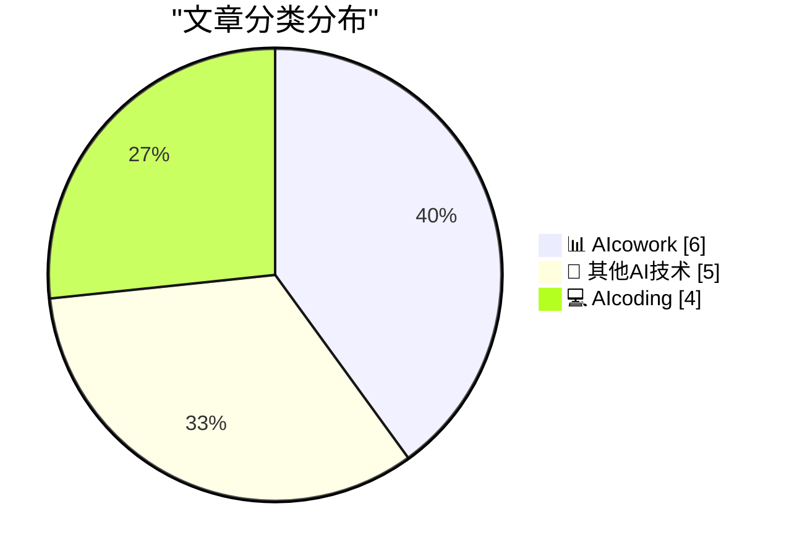
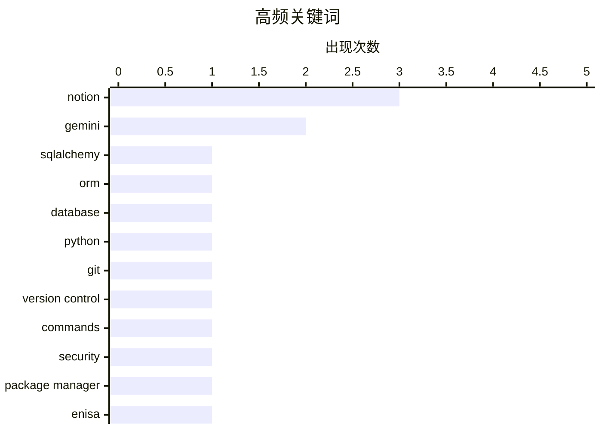

# 📰 AI 博客每日精选 — 2026-03-12

> 来自 98 个技术博客和社交媒体源，AI 精选 Top 15

## 📝 今日看点

今日技术圈聚焦于AI工具向深度工作流的全面渗透与基础工具的持续演进。以GitHub Copilot和Notion AI为代表的AI编程与协作工具正从辅助功能升级为核心生产力平台，深度集成至代码评审、会议记录乃至CRM系统。同时，开发基础领域如数据库ORM、Git工作流及编程语言设计等经典议题，仍在通过版本更新与经验总结不断优化。

---

## 🏆 今日必读

🥇 **SQLAlchemy 2 实战入门**

[Introduction to SQLAlchemy 2 In Practice](https://blog.miguelgrinberg.com/post/introduction-to-sqlalchemy-2-in-practice) — miguelgrinberg.com · 11 小时前 · 💻 AIcoding

> 文章介绍了作者撰写的《SQLAlchemy 2 In Practice》一书，该书深入探讨了目前仍是主流的 Python 数据库库和对象关系映射器（ORM）—— SQLAlchemy 2。作者通常会在博客上免费发布其著作，但本书因故未能完全公开。核心内容聚焦于 SQLAlchemy 2 版本的实践应用与深度解析。对于希望掌握现代 Python 数据库操作和 ORM 技术的开发者而言，这是一份系统性的学习资源。

💡 **为什么值得读**: 由知名技术作者 Miguel Grinberg 撰写，是系统学习当前主流 Python ORM 框架 SQLAlchemy 2 的权威实践指南。

🏷️ SQLAlchemy, ORM, Database, Python

🥈 **Git Checkout、Reset 与 Restore 命令解析**

[Git Checkout, Reset and Restore](https://susam.net/git-checkout-reset-restore.html) — susam.net · 21 小时前 · 💻 AIcoding

> 文章对比了 Git 2.23 版本（2019年发布）引入的 `git restore` 命令与传统上用于重置工作树和索引的 `git checkout` 和 `git reset` 命令。作者记录了这些“旧”命令如何映射到新的 `git restore` 命令，旨在为未来提供清晰的参考。核心在于厘清不同命令的适用场景，帮助用户更精准、安全地管理 Git 仓库状态。尽管新命令已发布数年，但明确其用法对于高效使用 Git 仍然至关重要。

💡 **为什么值得读**: 清晰梳理了 Git 2.23 后新旧状态管理命令的对应关系，能帮助开发者避免混淆，更安全、高效地使用 Git。

🏷️ Git, Version Control, Commands

🥉 **评阅 ENISA 的软件包管理器安全建议**

[Reviewing ENISA’s Package Manager Advisory](https://nesbitt.io/2026/03/12/reviewing-enisas-package-manager-advisory.html) — nesbitt.io · 11 小时前 · 🔬 其他AI技术

> 本文是对欧盟网络安全局（ENISA）发布的《软件包管理器安全使用技术建议》的评阅笔记。文章核心在于分析和解读这份官方安全指南，探讨软件包管理器在使用中的潜在风险与最佳安全实践。作者提供了个人见解和补充说明，帮助读者理解并应用这些安全建议。对于依赖开源生态的开发者和管理员，这是提升软件供应链安全的重要参考资料。

💡 **为什么值得读**: 提供了对权威机构安全指南的第三方解读，能帮助开发者更深入地理解软件包管理器安全风险及防护措施。

🏷️ Security, Package Manager, ENISA

4️⃣ **★ 键盘快捷键的修饰键顺序**

[★ Modifier Key Order for Keyboard Shortcuts](https://daringfireball.net/2026/03/modifier_key_order_for_keyboard_shortcuts) — daringfireball.net · 21 小时前 · 🔬 其他AI技术

> 文章明确规定了 macOS 系统中键盘快捷键的修饰键正确顺序：Fn、Control、Option、Shift、Command。这一顺序规则同时适用于文字描述和符号（glyphs）表示。核心观点是遵循统一的顺序标准，以确保快捷键描述的一致性和可读性。这对于文档编写者、UI/UX 设计师和所有需要清晰沟通快捷键的用户至关重要。

💡 **为什么值得读**: 明确了一个容易被忽视但影响文档和界面专业性的细节规范，对提升技术写作和设计一致性有直接帮助。

🏷️ Keyboard Shortcuts, UI, MacOS

5️⃣ **想创建一门新的编程语言？你可能需要看看这个。👀**

[Thinking of creating a new programming language? You might want to watch this. 👀 https://github.blog/developer-skills/programming-languages-and-fra...](https://x.com/github/status/2032123646668316984) — 𝕏 @GitHub · 5 小时前 · 💻 AIcoding

> GitHub 官方账号分享了一段视频，内容源自其对 C# 和 TypeScript 架构师 Anders Hejlsberg 的采访，总结了创建编程语言的 7 点经验。视频链接指向 GitHub 博客的详细文章。核心内容聚焦于从顶尖语言设计者那里汲取的宝贵洞见和学习成果。这对于语言设计者、编译器开发者或对编程语言原理有浓厚兴趣的开发者极具启发性。

💡 **为什么值得读**: 直接聆听传奇语言设计师 Anders Hejlsberg 的实践经验，是获取语言设计第一手洞见的难得机会。

🏷️ Programming Language, Design, Anders Hejlsberg

---

## 📊 数据概览

| 扫描源 | 抓取文章 | 时间范围 | 精选 |
|:---:|:---:|:---:|:---:|
| 75/98 | 2385 篇 → 31 篇 | 24h | **15 篇** |

### 分类分布



### 高频关键词



<details>
<summary>📈 纯文本关键词图（终端友好）</summary>

```
notion          │ ████████████████████ 3
gemini          │ █████████████░░░░░░░ 2
sqlalchemy      │ ███████░░░░░░░░░░░░░ 1
orm             │ ███████░░░░░░░░░░░░░ 1
database        │ ███████░░░░░░░░░░░░░ 1
python          │ ███████░░░░░░░░░░░░░ 1
git             │ ███████░░░░░░░░░░░░░ 1
version control │ ███████░░░░░░░░░░░░░ 1
commands        │ ███████░░░░░░░░░░░░░ 1
security        │ ███████░░░░░░░░░░░░░ 1
```

</details>

### 🏷️ 话题标签

**notion**(3) · **gemini**(2) · **sqlalchemy**(1) · orm(1) · database(1) · python(1) · git(1) · version control(1) · commands(1) · security(1) · package manager(1) · enisa(1) · keyboard shortcuts(1) · ui(1) · macos(1) · programming language(1) · design(1) · anders hejlsberg(1) · copilot(1) · code review(1)

---

====================

## 📊 AIcowork

### 1. Notion AI 会议笔记记录功能获得用户 A+++++ 好评

[In case you haven't tried it out, give it a test run: https://www.notion.com/product/ai-meeting-notes Thanks, John 🫡](https://x.com/NotionHQ/status/2032129805886636162) — **𝕏 @NotionHQ** · 5 小时前 · ⭐ 18/25

> Notion 官方账号推广其 AI 会议笔记记录功能，并引用了一位名为 John 的用户的高度评价（“A+++++”）。推文鼓励尚未尝试的用户进行测试运行，并附带了该功能的产品页面链接。核心是展示该 AI 功能获得了极佳的用户反馈，旨在吸引更多用户体验。这反映了 Notion 在将 AI 深度集成到生产力工具中的持续努力。

🏷️ Notion, AI Meeting Notes, Product Feature

📌 AIcowork

---

### 2. Notion 正在测试独立的 Notion AI 应用

[RT Laura Sandoval: For the past few months, we've been building a new way to interact with Notion — a standalone Notion AI app. We'd love for you to ...](https://x.com/NotionHQ/status/2031858802702893243) — **𝕏 @NotionHQ** · 23 小时前 · ⭐ 18/25

> Notion 团队在过去几个月里构建了一种与 Notion 交互的新方式——一款独立的 Notion AI 应用。目前该应用已通过 Apple TestFlight 发布测试版，邀请用户体验。这是发布者 Laura Sandoval 在 Notion 的第一个项目。此举意味着 Notion AI 可能正从一项内置功能向独立的、专注的应用程序形态演进。

🏷️ Notion, AI App, Standalone Application

📌 AIcowork

---

### 3. Gemini 集成到 Google Sheets，可快速生成 CXO 级仪表盘

[From scattered data to a CXO-ready dashboard in moments. 📊✨ Describe what you need, and Gemini in Google Sheets can synthesize files and emails to...](https://x.com/GoogleWorkspace/status/2032102022229446715) — **𝕏 @GoogleWorkspace** · 7 小时前 · ⭐ 17/25

> Google Workspace 宣布 Gemini 已集成到 Google Sheets 中。用户只需用语言描述需求，Gemini 便能综合分析多个文件和邮件，自动生成格式化的电子表格、跟踪器和仪表盘，并包含样式化的表格和图表。该功能旨在将零散数据瞬间转化为面向高管（CXO）的、可视化的业务视图，极大提升了数据整理和报告制作的效率。

🏷️ Gemini, Google Sheets, Dashboard, Automation

📌 AIcowork

---

### 4. Slack 推出全新 AI 驱动的 Slack CRM

[RT Marc Benioff: New: Slack CRM. AI on top, salesforce underneath. One pane of glass. 🤯](https://x.com/SlackHQ/status/2032170836283514899) — **𝕏 @SlackHQ** · 3 小时前 · ⭐ 16/25

> Salesforce 首席执行官 Marc Benioff 宣布推出全新的 Slack CRM。该产品将 AI 能力置于上层，而 Salesforce 的 CRM 功能作为底层支撑，集成在“同一块玻璃”（One pane of glass）即 Slack 界面中。这标志着 Slack 与 Salesforce 的深度融合进入新阶段，旨在通过 AI 和统一的协作界面重塑客户关系管理体验。

🏷️ Slack, CRM, Salesforce, AI Integration

📌 AIcowork

---

### 5. Notion会议笔记块通过“指令”功能演变为通用分析工具

[RT Frank: a small, but powerful ship @NotionHQ ⚡️ meeting notes @NotionHQ was always meant to be bigger than meetings. instructions are making that ...](https://x.com/NotionHQ/status/2032179418245021831) — **𝕏 @NotionHQ** · 2 小时前 · ⭐ 15/25

> Notion的“会议笔记”功能通过新增的“指令”特性，从一个会议记录工具演变为一个通用的文本分析“原始模块”。用户可以为同一段文本（如对话、播客转录稿）运行不同的自定义指令，进行博弈论、辩证分析、情景规划等多种维度的分析。这打破了该功能仅限于会议的初衷，使其成为可灵活重塑文本解读方式的多功能分析基元。

🏷️ Notion, Meeting Notes, AI Instructions

📌 AIcowork

---

### 6. Snap公司80-90%员工使用Gemini加速协作

[📸 What happens when a creative company collaborates with AI? At @Snap, 80–90% of employees are engaging with Gemini inside Docs and Sheets, accele...](https://x.com/GoogleWorkspace/status/2032140314593378488) — **𝕏 @GoogleWorkspace** · 4 小时前 · ⭐ 15/25

> Google Workspace分享了Snap公司内部大规模应用AI协作工具Gemini的案例。数据显示，80%至90%的Snap员工在Docs和Sheets中积极使用Gemini AI功能。这一应用显著加速了创意构思过程，并帮助员工在会议前准备得更充分。案例表明，AI深度集成到办公套件中，能有效提升创意型公司的整体协作效率与产出质量。

🏷️ Google Workspace, Gemini, Collaboration, Snap

📌 AIcowork

---

## 🔬 其他AI技术

### 7. 评阅 ENISA 的软件包管理器安全建议

[Reviewing ENISA’s Package Manager Advisory](https://nesbitt.io/2026/03/12/reviewing-enisas-package-manager-advisory.html) — **nesbitt.io** · 11 小时前 · ⭐ 21/25

> 本文是对欧盟网络安全局（ENISA）发布的《软件包管理器安全使用技术建议》的评阅笔记。文章核心在于分析和解读这份官方安全指南，探讨软件包管理器在使用中的潜在风险与最佳安全实践。作者提供了个人见解和补充说明，帮助读者理解并应用这些安全建议。对于依赖开源生态的开发者和管理员，这是提升软件供应链安全的重要参考资料。

🏷️ Security, Package Manager, ENISA

📌 其他AI技术

---

### 8. ★ 键盘快捷键的修饰键顺序

[★ Modifier Key Order for Keyboard Shortcuts](https://daringfireball.net/2026/03/modifier_key_order_for_keyboard_shortcuts) — **daringfireball.net** · 21 小时前 · ⭐ 19/25

> 文章明确规定了 macOS 系统中键盘快捷键的修饰键正确顺序：Fn、Control、Option、Shift、Command。这一顺序规则同时适用于文字描述和符号（glyphs）表示。核心观点是遵循统一的顺序标准，以确保快捷键描述的一致性和可读性。这对于文档编写者、UI/UX 设计师和所有需要清晰沟通快捷键的用户至关重要。

🏷️ Keyboard Shortcuts, UI, MacOS

📌 其他AI技术

---

### 9. 软件的“本体感觉”

[Software Proprioception](https://unsung.aresluna.org/software-proprioception/) — **daringfireball.net** · 6 小时前 · ⭐ 15/25

> 文章探讨了软件感知其运行硬件（如屏幕尺寸、传感器）特性后所能实现的创新交互。核心论点是“指向，而非描述”的设计原则，即用视觉指示（如箭头）替代文字描述，能显著降低用户的认知负荷。作者以“本体感觉”为类比，主张软件应像人体感知肢体位置一样，自适应硬件环境并做出更直观的反馈。这种硬件感知能力是提升软件交互自然度和效率的关键。

🏷️ Software Design, HCI, UX

📌 其他AI技术

---

### 10. 我如何在个人博客中使用生成式AI

[How I use generative AI on this blog](https://evanhahn.com/how-i-use-gen-ai-on-this-blog/) — **evanhahn.com** · 21 小时前 · ⭐ 15/25

> 作者坦诚分享了在个人博客写作中具体使用生成式AI（如LLM）的方法与矛盾心态。他明确认为生成式AI弊大于利，理想世界中不应存在该技术，但在现实工作被迫使用，并出于效率考虑也用于个人博客。AI主要协助完成初稿、头脑风暴等辅助性任务，而非完全替代创作。结论是，在保持批判性认知的前提下，可策略性地利用AI作为工具提升效率。

🏷️ Generative AI, Blog, Workflow

📌 其他AI技术

---

### 11. 历史能源价格上限数据（信息自由请求成功！）

[Historic Energy Price Cap Data (FOI success!)](https://shkspr.mobi/blog/2026/03/historic-energy-price-cap-data-foi-success/) — **shkspr.mobi** · 8 小时前 · ⭐ 14/25

> 作者发现英国能源监管机构Ofgem仅公布当前区域的能源价格上限，而无法在其官网找到完整的历史数据。为此，他通过发送一封邮件（被Ofgem视为信息自由请求）成功获取了全部历史电价上限数据。文章分享了这一通过合法公开请求获取公共数据的成功经验，并可能包含了获取到的数据或方法。此举揭示了公众如何主动获取未被主动公开的关键公共信息。

🏷️ Data, FOI, Energy

📌 其他AI技术

---

## 💻 AIcoding

### 12. SQLAlchemy 2 实战入门

[Introduction to SQLAlchemy 2 In Practice](https://blog.miguelgrinberg.com/post/introduction-to-sqlalchemy-2-in-practice) — **miguelgrinberg.com** · 11 小时前 · ⭐ 24/25

> 文章介绍了作者撰写的《SQLAlchemy 2 In Practice》一书，该书深入探讨了目前仍是主流的 Python 数据库库和对象关系映射器（ORM）—— SQLAlchemy 2。作者通常会在博客上免费发布其著作，但本书因故未能完全公开。核心内容聚焦于 SQLAlchemy 2 版本的实践应用与深度解析。对于希望掌握现代 Python 数据库操作和 ORM 技术的开发者而言，这是一份系统性的学习资源。

🏷️ SQLAlchemy, ORM, Database, Python

📌 AIcoding

---

### 13. Git Checkout、Reset 与 Restore 命令解析

[Git Checkout, Reset and Restore](https://susam.net/git-checkout-reset-restore.html) — **susam.net** · 21 小时前 · ⭐ 22/25

> 文章对比了 Git 2.23 版本（2019年发布）引入的 `git restore` 命令与传统上用于重置工作树和索引的 `git checkout` 和 `git reset` 命令。作者记录了这些“旧”命令如何映射到新的 `git restore` 命令，旨在为未来提供清晰的参考。核心在于厘清不同命令的适用场景，帮助用户更精准、安全地管理 Git 仓库状态。尽管新命令已发布数年，但明确其用法对于高效使用 Git 仍然至关重要。

🏷️ Git, Version Control, Commands

📌 AIcoding

---

### 14. 想创建一门新的编程语言？你可能需要看看这个。👀

[Thinking of creating a new programming language? You might want to watch this. 👀 https://github.blog/developer-skills/programming-languages-and-fra...](https://x.com/github/status/2032123646668316984) — **𝕏 @GitHub** · 5 小时前 · ⭐ 19/25

> GitHub 官方账号分享了一段视频，内容源自其对 C# 和 TypeScript 架构师 Anders Hejlsberg 的采访，总结了创建编程语言的 7 点经验。视频链接指向 GitHub 博客的详细文章。核心内容聚焦于从顶尖语言设计者那里汲取的宝贵洞见和学习成果。这对于语言设计者、编译器开发者或对编程语言原理有浓厚兴趣的开发者极具启发性。

🏷️ Programming Language, Design, Anders Hejlsberg

📌 AIcoding

---

### 15. Copilot Code Review 已进行 6000 万+ 次评审，在独立测试中位列榜首

[RT David Poll: 60M+ reviews and counting. My team has been relentlessly improving Copilot Code Review -- upgrading models, prompts, context exploratio...](https://x.com/github/status/2031944837272924580) — **𝕏 @GitHub** · 22 小时前 · ⭐ 19/25

> GitHub Copilot Code Review 功能已完成超过 6000 万次代码评审。团队通过持续升级模型、优化提示词和扩展上下文探索来改进该工具。一项针对 9 款 AI 代码评审工具的独立测试将其评为第一名，这验证了其改进工作的成效。推文附带了相关演示视频的链接。这表明 AI 辅助代码评审正在走向成熟并得到市场认可。

🏷️ Copilot, Code Review, GitHub

📌 AIcoding

---

====================

*生成于 2026-03-12 21:32 | 扫描 75 源 → 获取 2385 篇 → 精选 15 篇*
*基于 [Hacker News Popularity Contest 2025](https://refactoringenglish.com/tools/hn-popularity/) RSS 源列表，由 [Andrej Karpathy](https://x.com/karpathy) 推荐*
*由「懂点儿AI」制作，欢迎关注同名微信公众号获取更多 AI 实用技巧 💡*
