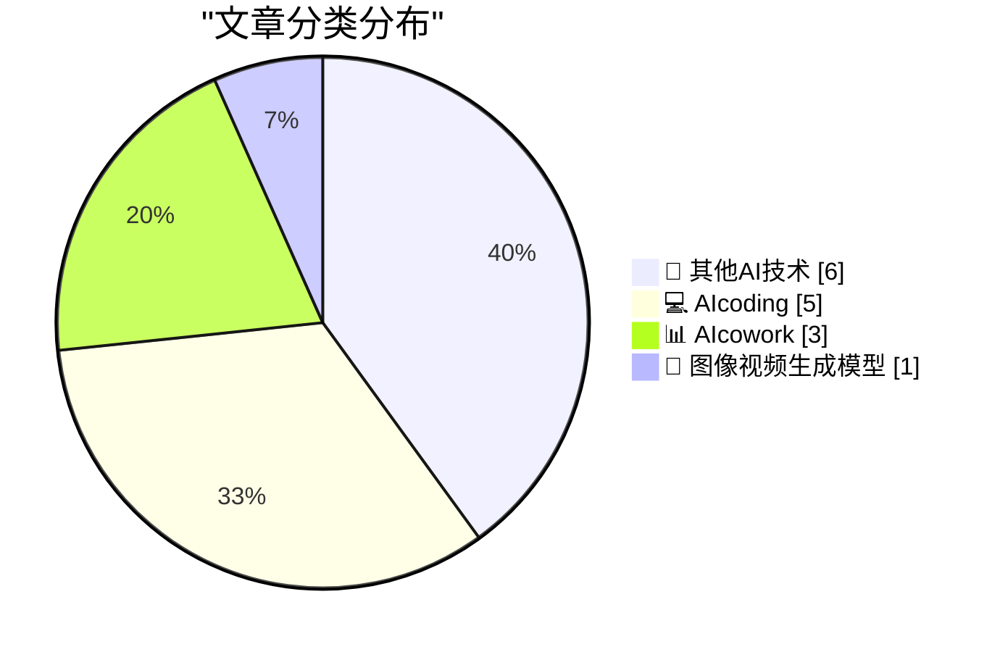
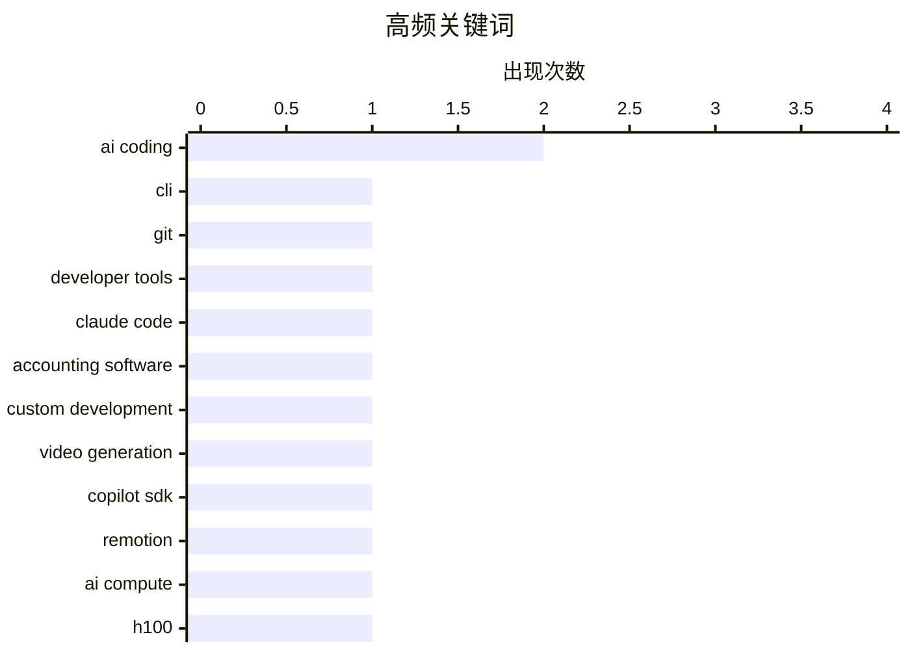

# 📰 AI 博客每日精选 — 2026-03-13

> 来自 98 个技术博客和社交媒体源，AI 精选 Top 15

## 📝 今日看点

今日技术圈聚焦于AI对生产力工具的深度重塑与行业反思。一方面，AI编程助手正以惊人效率赋能个体开发者，从快速构建定制软件到统一多平台开发流程，大幅降低开发门槛。另一方面，巨头竞相将AI深度集成进办公协作套件，通过语音、草图识别和智能设计推动移动与协同办公进入新阶段。与此同时，行业也在冷静审视AI算力扩展的硬性瓶颈与程序员职业未来的深刻变革。

---

## 🏆 今日必读

🥇 **Forge：一个面向 GitHub、GitLab、Gitea、Forgejo 和 Bitbucket 的统一 CLI**

[Forge](https://nesbitt.io/2026/03/13/forge.html) — nesbitt.io · 11 小时前 · 💻 AIcoding

> Forge 是一个旨在统一多个主流代码托管平台（GitHub、GitLab、Gitea、Forgejo、Bitbucket）操作体验的命令行工具。它通过单一接口和一致的命令语法，消除了开发者在不同平台间切换时需要学习和使用不同 CLI 工具的负担。该工具将常见的仓库管理、问题跟踪、合并请求等操作抽象为通用命令，极大提升了开发工作流的效率。对于需要跨平台协作的团队或个人开发者而言，Forge 提供了简化和标准化的操作体验。

💡 **为什么值得读**: 如果你经常需要跨多个 Git 托管平台工作，这个工具能显著简化你的工作流，用一个命令集替代多个平台的专用 CLI。

🏷️ CLI, Git, Developer Tools

🥈 **“软件狂想”：用 Claude Code 构建自定义会计软件**

[‘Software Bonkers’](https://craigmod.com/essays/software_bonkers/) — daringfireball.net · 6 小时前 · 💻 AIcoding

> 作者 Craig Mod 因市面会计软件无法满足其多币种、历史汇率转换和灵活 CSV 导入等复杂需求，决定自行开发。他利用 Claude Code 这一 AI 编程助手，仅用约五天时间就构建出一套完全本地运行、速度极快的定制化会计系统。该系统能够处理多币种并自动获取历史汇率，并能灵活解析各种格式的 CSV 文件。最终成果被作者评价为“用过的最好的会计软件”，展示了 AI 辅助编程在解决特定、复杂个人需求方面的巨大潜力。

💡 **为什么值得读**: 这篇文章生动展示了 AI 编程如何赋能个人开发者快速构建高度定制化、专业级的工具，是理解 AI 辅助开发实际效能的绝佳案例。

🏷️ Claude Code, Accounting Software, Custom Development

🥉 **GitHub：将 WhatsApp 消息转化为视频——利用 Copilot SDK 与 Remotion 在 5 分钟内生成高质量宣传片**

[Turn a WhatsApp message into a video. 📱🎬 We connected the Copilot SDK to Remotion to build a tool that generates a high-quality promo video in 5...](https://x.com/github/status/2032527180505227341) — 𝕏 @GitHub · 2 小时前 · 🎨 图像视频生成模型

> GitHub 团队展示了如何将 Copilot SDK 与 Remotion 框架结合，构建一个能从手机端（如 WhatsApp 消息）触发、在 5 分钟内自动生成高质量宣传视频的工具。该演示强调了“可插拔、可移植的代码”是实现这种快速、自动化工作流的关键。它直观体现了 AI 开发工具（Copilot SDK）与现有专业框架（Remotion）集成后，如何大幅降低复杂媒体内容创作的技术门槛和耗时。

💡 **为什么值得读**: 这个案例极具启发性，展示了 AI 开发套件（Copilot SDK）与专业工具链结合后，能如何革命性地简化并加速从创意到成品的流程。

🏷️ Video Generation, Copilot SDK, Remotion

4️⃣ **Dylan Patel 深度剖析：扩展 AI 算力的三大瓶颈**

[Dylan Patel — Deep dive on the 3 big bottlenecks to scaling AI compute](https://www.dwarkesh.com/p/dylan-patel) — dwarkesh.com · 5 小时前 · 🔬 其他AI技术

> 文章深入探讨了当前制约人工智能计算能力规模扩展的三个主要瓶颈。分析指出，这些瓶颈可能涉及芯片供应、能源功耗或内存带宽等硬件层面，以及软件和系统架构的挑战。文中还提出了一个反直觉的观点：英伟达 H100 这类顶级 AI 芯片今天的价值可能比三年前更高，这侧面反映了算力需求的爆炸式增长与供给瓶颈之间的紧张关系。理解这些瓶颈对于预判 AI 行业发展速度和投资方向至关重要。

💡 **为什么值得读**: 如果你想了解 AI 基础设施面临的根本性挑战以及为何顶级 AI 芯片如此紧俏，这篇深度分析提供了关键见解。

🏷️ AI Compute, H100, Scaling Bottlenecks

5️⃣ **AI 时代之后，程序员将何去何从？**

[What do coders do after AI?](https://anildash.com/2026/03/13/coders-after-ai/) — anildash.com · 21 小时前 · 💻 AIcoding

> 文章探讨了在大型语言模型（LLMs）快速发展、近乎能充当“全栈软件工厂”的当下，程序员职业的未来。作者指出，AI 正在急剧改变软件创造的经济学和权力动态，并已导致大量技术工作者被替代。然而，这并非故事的终点，作者与 Clive Thompson 的对话试图寻找程序员在新时代的角色和价值定位。核心观点是，程序员需要适应并找到与 AI 共生的新方式，而非简单地被取代。

💡 **为什么值得读**: 这篇文章直面了每个技术从业者最关切的职业未来问题，提供了超越恐慌的深度思考框架。

🏷️ AI Coding, LLM, Future of Work, Developers

---

## 📊 数据概览

| 扫描源 | 抓取文章 | 时间范围 | 精选 |
|:---:|:---:|:---:|:---:|
| 76/98 | 2557 篇 → 27 篇 | 24h | **15 篇** |

### 分类分布



### 高频关键词



<details>
<summary>📈 纯文本关键词图（终端友好）</summary>

```
ai coding           │ ████████████████████ 2
cli                 │ ██████████░░░░░░░░░░ 1
git                 │ ██████████░░░░░░░░░░ 1
developer tools     │ ██████████░░░░░░░░░░ 1
claude code         │ ██████████░░░░░░░░░░ 1
accounting software │ ██████████░░░░░░░░░░ 1
custom development  │ ██████████░░░░░░░░░░ 1
video generation    │ ██████████░░░░░░░░░░ 1
copilot sdk         │ ██████████░░░░░░░░░░ 1
remotion            │ ██████████░░░░░░░░░░ 1
```

</details>

### 🏷️ 话题标签

**ai coding**(2) · **cli**(1) · **git**(1) · developer tools(1) · claude code(1) · accounting software(1) · custom development(1) · video generation(1) · copilot sdk(1) · remotion(1) · ai compute(1) · h100(1) · scaling bottlenecks(1) · llm(1) · future of work(1) · developers(1) · microsoft copilot(1) · voice assistant(1) · productivity(1) · google slides(1)

---

====================

## 🔬 其他AI技术

### 1. Dylan Patel 深度剖析：扩展 AI 算力的三大瓶颈

[Dylan Patel — Deep dive on the 3 big bottlenecks to scaling AI compute](https://www.dwarkesh.com/p/dylan-patel) — **dwarkesh.com** · 5 小时前 · ⭐ 18/25

> 文章深入探讨了当前制约人工智能计算能力规模扩展的三个主要瓶颈。分析指出，这些瓶颈可能涉及芯片供应、能源功耗或内存带宽等硬件层面，以及软件和系统架构的挑战。文中还提出了一个反直觉的观点：英伟达 H100 这类顶级 AI 芯片今天的价值可能比三年前更高，这侧面反映了算力需求的爆炸式增长与供给瓶颈之间的紧张关系。理解这些瓶颈对于预判 AI 行业发展速度和投资方向至关重要。

🏷️ AI Compute, H100, Scaling Bottlenecks

📌 其他AI技术

---

### 2. 纽约时报：Meta 因性能问题推迟新款 AI 模型发布

[NYT: ‘Meta Delays Rollout of New AI Model After Performance Concerns’](https://www.nytimes.com/2026/03/12/technology/meta-avocado-ai-model-delayed.html?unlocked_article_code=1.S1A.vI_6.4j717gwtFem0) — **daringfireball.net** · 4 小时前 · ⭐ 10/25

> 据《纽约时报》报道，Meta 公司内部代号为“Avocado”的新基础 AI 模型在内部测试中，于推理、编码和写作等关键能力上未能达到 OpenAI、Anthropic 和 Google 等竞争对手的领先模型水平。尽管“Avocado”的性能优于 Meta 前代模型和 Google 的 Gemini 2.5，但未达到公司设定的内部标杆。出于对性能的担忧，Meta 决定推迟该模型的发布。这一事件凸显了顶级 AI 模型竞赛的激烈程度以及性能标准的水涨船高。

🏷️ Meta, AI Model, Delay

📌 其他AI技术

---

### 3. Windows栈限制检查回顾：MIPS篇

[Windows stack limit checking retrospective: MIPS](https://devblogs.microsoft.com/oldnewthing/20260313-00/?p=112138) — **devblogs.microsoft.com/oldnewthing** · 7 小时前 · ⭐ 9/25

> 文章回顾了Windows在MIPS架构上实现栈溢出检查（stack limit checking）的历史技术细节。核心挑战在于如何在保证安全性的前提下，优化掉不必要的栈探测（stack probe）指令以避免性能开销。MIPS架构缺乏像x86那样的专用硬件支持，迫使开发者采用更复杂的软件方案来模拟这一行为。最终，工程师们通过巧妙的代码生成和编译器优化，在MIPS上实现了高效且可靠的栈保护机制。

🏷️ Stack Limit, MIPS, Windows History

📌 其他AI技术

---

### 4. 付费内容：SaaS末日憎恨者指南

[Premium: The Hater's Guide To The SaaSpocalypse](https://www.wheresyoured.at/hatersguide-saas/) — **wheresyoured.at** · 4 小时前 · ⭐ 8/25

> 文章将当前的AI泡沫置于更宏大的“软件超增长时代终结”的背景下进行分析，作者称之为“腐朽网络泡沫”。指出生成式AI最初看似是打破软件行业增长停滞的新范式。但作者认为，AI热潮本质上是对SaaS（软件即服务）模式增长乏力的一种回应和资本转移。其核心论点是，要理解AI泡沫，必须首先理解其赖以滋生的SaaS行业困境。

🏷️ AI Bubble, SaaS, Market Commentary

📌 其他AI技术

---

### 5. 体育节目占所有广告支持电视观看量的近30%

[Sports Programming Accounts for Almost 30 Percent of All Ad-Supported TV Viewing](https://deadline.com/2026/03/sports-tv-viewing-advertising-nielsen-1236750721/) — **daringfireball.net** · 4 小时前 · ⭐ 7/25

> 根据尼尔森（Nielsen）2025年第四季度的最新数据，体育节目在25至54岁人群的广告支持电视（包括广播、有线电视和流媒体）总观看量中占据了29.2%的份额。这一数据凸显了体育内容在传统电视广告模式中的绝对统治地位。报告发布于2026年电视广告预售季（upfronts）前夕，旨在为市场提供关键的收视趋势洞察。结论是，体育节目已成为支撑整个广告支持电视生态系统的核心支柱。

🏷️ TV, Sports, Viewing

📌 其他AI技术

---

### 6. 多元主义：AI的另外三种精神病症（2026年3月12日）

[Pluralistic: Three more AI psychoses (12 Mar 2026)](https://pluralistic.net/2026/03/12/normal-technology/) — **pluralistic.net** · 19 小时前 · ⭐ 7/25

> 文章批判性地讨论了AI技术引发的三种社会性“精神病症”。作者呼吁公众保持冷静，避免对AI产生非理性的恐惧或崇拜。文章可能涉及AI导致的认知偏差、社会关系异化或法律伦理困境等具体表现。其核心观点是将AI视为一种“正常技术”，反对将其神秘化或特殊化，主张以更平常心和批判性的眼光看待其发展与影响。

🏷️ AI Ethics, AI Psychology, Social Commentary

📌 其他AI技术

---

## 💻 AIcoding

### 7. Forge：一个面向 GitHub、GitLab、Gitea、Forgejo 和 Bitbucket 的统一 CLI

[Forge](https://nesbitt.io/2026/03/13/forge.html) — **nesbitt.io** · 11 小时前 · ⭐ 22/25

> Forge 是一个旨在统一多个主流代码托管平台（GitHub、GitLab、Gitea、Forgejo、Bitbucket）操作体验的命令行工具。它通过单一接口和一致的命令语法，消除了开发者在不同平台间切换时需要学习和使用不同 CLI 工具的负担。该工具将常见的仓库管理、问题跟踪、合并请求等操作抽象为通用命令，极大提升了开发工作流的效率。对于需要跨平台协作的团队或个人开发者而言，Forge 提供了简化和标准化的操作体验。

🏷️ CLI, Git, Developer Tools

📌 AIcoding

---

### 8. “软件狂想”：用 Claude Code 构建自定义会计软件

[‘Software Bonkers’](https://craigmod.com/essays/software_bonkers/) — **daringfireball.net** · 6 小时前 · ⭐ 21/25

> 作者 Craig Mod 因市面会计软件无法满足其多币种、历史汇率转换和灵活 CSV 导入等复杂需求，决定自行开发。他利用 Claude Code 这一 AI 编程助手，仅用约五天时间就构建出一套完全本地运行、速度极快的定制化会计系统。该系统能够处理多币种并自动获取历史汇率，并能灵活解析各种格式的 CSV 文件。最终成果被作者评价为“用过的最好的会计软件”，展示了 AI 辅助编程在解决特定、复杂个人需求方面的巨大潜力。

🏷️ Claude Code, Accounting Software, Custom Development

📌 AIcoding

---

### 9. AI 时代之后，程序员将何去何从？

[What do coders do after AI?](https://anildash.com/2026/03/13/coders-after-ai/) — **anildash.com** · 21 小时前 · ⭐ 18/25

> 文章探讨了在大型语言模型（LLMs）快速发展、近乎能充当“全栈软件工厂”的当下，程序员职业的未来。作者指出，AI 正在急剧改变软件创造的经济学和权力动态，并已导致大量技术工作者被替代。然而，这并非故事的终点，作者与 Clive Thompson 的对话试图寻找程序员在新时代的角色和价值定位。核心观点是，程序员需要适应并找到与 AI 共生的新方式，而非简单地被取代。

🏷️ AI Coding, LLM, Future of Work, Developers

📌 AIcoding

---

### 10. “悲伤与 AI 分野”

[‘Grief and the AI Split’](https://blog.lmorchard.com/2026/03/11/grief-and-the-ai-split/) — **daringfireball.net** · 7 小时前 · ⭐ 15/25

> 一位自 1982 年开始编程的开发者反思 AI 辅助编程带来的感受，认为它更像是编程语言演进阶梯上的又一级台阶，而非彻底的断裂。然而，他也承认整个“阶梯”（编程方式）和它所倚靠的“建筑”（软件行业）都在发生根本性变化，未来方向并不完全明朗。尽管工具在变，但他强调自己“仍然”热爱用代码创造事物的过程。文章捕捉了老牌开发者在技术剧变时代既拥抱变化又怀有不确定性的复杂心境。

🏷️ AI-assisted Coding, Programming, Reflection

📌 AIcoding

---

### 11. 打脸集锦：Anthropic CEO Dario Amodei关于当前AI生成代码比例的预言

[Claim Chowder: Anthropic CEO Dario Amodei on the Percentage of Code Being Generated by AI Today](https://www.businessinsider.com/anthropic-ceo-ai-90-percent-code-3-to-6-months-2025-3) — **daringfireball.net** · 5 小时前 · ⭐ 8/25

> 文章引用了一年前（2025年3月）Anthropic CEO Dario Amodei的预测，他声称AI将在3到6个月内编写90%的代码，并在12个月内编写几乎所有代码。这一预测被作为“打脸集锦”的素材呈现，暗示其与现实发展不符。核心在于对比AI代码生成技术的实际进展与业界领袖过于乐观的公开预言。作者通过回顾这一具体言论，旨在提醒读者对技术炒作保持审慎。

🏷️ AI Coding, Prediction, Anthropic

📌 AIcoding

---

## 📊 AIcowork

### 12. 微软 365 Copilot：您最佳的移动快捷方式是语音

[Your best mobile shortcut? Your voice. Start talking to Microsoft 365 Copilot with easier access options, so you can stay productive wherever work hap...](https://x.com/Microsoft365/status/2032501947899511009) — **𝕏 @Microsoft365** · 4 小时前 · ⭐ 17/25

> 微软宣布为其 Microsoft 365 Copilot 提供更便捷的语音访问选项，使用户能在移动场景中通过语音指令保持高效工作。这一更新旨在将 AI 助手深度集成到移动办公流程中，解放用户的双手和眼睛。它强调了语音交互作为移动端核心生产力入口的重要性，让 Copilot 的能力可以随时随地通过自然对话调用。

🏷️ Microsoft Copilot, Voice Assistant, Productivity

📌 AIcowork

---

### 13. Google Workspace：一键将草图转为可编辑图表，凌乱笔记变为精美幻灯片

[Now you can create beautifully designed and Google Slides that match your deck’s style instantly. Turn sketches into editable charts and messy notes ...](https://x.com/GoogleWorkspace/status/2032532898486612212) — **𝕏 @GoogleWorkspace** · 2 小时前 · ⭐ 17/25

> Google Workspace 为 Google Slides 引入了强大的 AI 设计功能，能即时创建与演示文稿风格匹配的精美幻灯片。新功能允许用户将手绘草图一键转换为可编辑的图表，并将杂乱的笔记自动整理并美化为专业的幻灯片布局。这极大地简化了从原始创意到视觉化、结构化演示文稿的创作过程，提升了内容制作的效率和质量。

🏷️ Google Slides, AI Design, Document Automation

📌 AIcowork

---

### 14. Miro 现已集成至 Google Chat，支持实时协作构思

[🎨 @MiroHQ is now in Google Chat. Brainstorm, plan, and collaborate on ideas in real time → https://goo.gle/3N26u37](https://x.com/GoogleWorkspace/status/2032487602276667733) — **𝕏 @GoogleWorkspace** · 5 小时前 · ⭐ 17/25

> Google Workspace 宣布将可视化协作平台 Miro 集成到 Google Chat 中。用户现在可以直接在 Google Chat 的环境内启动 Miro 白板，进行实时头脑风暴、项目规划和创意协作。这一集成打通了团队聊天与可视化协作工具之间的壁垒，旨在提供一个更流畅、一体化的团队协作体验。

🏷️ Google Chat, Miro, Collaboration

📌 AIcowork

---

## 🎨 图像视频生成模型

### 15. GitHub：将 WhatsApp 消息转化为视频——利用 Copilot SDK 与 Remotion 在 5 分钟内生成高质量宣传片

[Turn a WhatsApp message into a video. 📱🎬 We connected the Copilot SDK to Remotion to build a tool that generates a high-quality promo video in 5...](https://x.com/github/status/2032527180505227341) — **𝕏 @GitHub** · 2 小时前 · ⭐ 19/25

> GitHub 团队展示了如何将 Copilot SDK 与 Remotion 框架结合，构建一个能从手机端（如 WhatsApp 消息）触发、在 5 分钟内自动生成高质量宣传视频的工具。该演示强调了“可插拔、可移植的代码”是实现这种快速、自动化工作流的关键。它直观体现了 AI 开发工具（Copilot SDK）与现有专业框架（Remotion）集成后，如何大幅降低复杂媒体内容创作的技术门槛和耗时。

🏷️ Video Generation, Copilot SDK, Remotion

📌 图像视频生成模型

---

====================

*生成于 2026-03-13 21:32 | 扫描 76 源 → 获取 2557 篇 → 精选 15 篇*
*基于 [Hacker News Popularity Contest 2025](https://refactoringenglish.com/tools/hn-popularity/) RSS 源列表，由 [Andrej Karpathy](https://x.com/karpathy) 推荐*
*由「懂点儿AI」制作，欢迎关注同名微信公众号获取更多 AI 实用技巧 💡*
