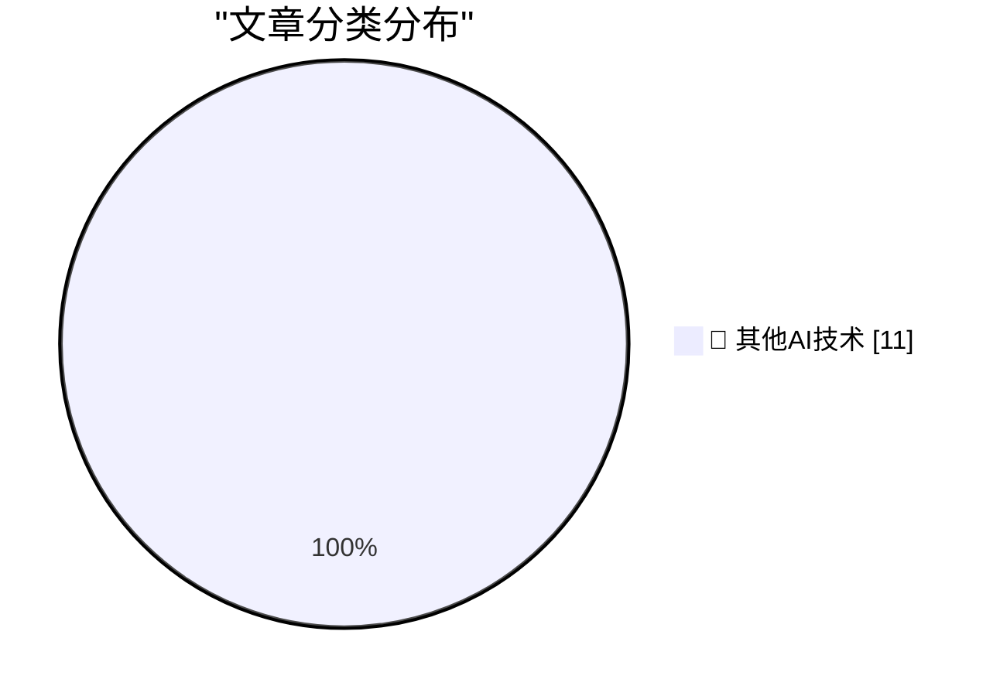
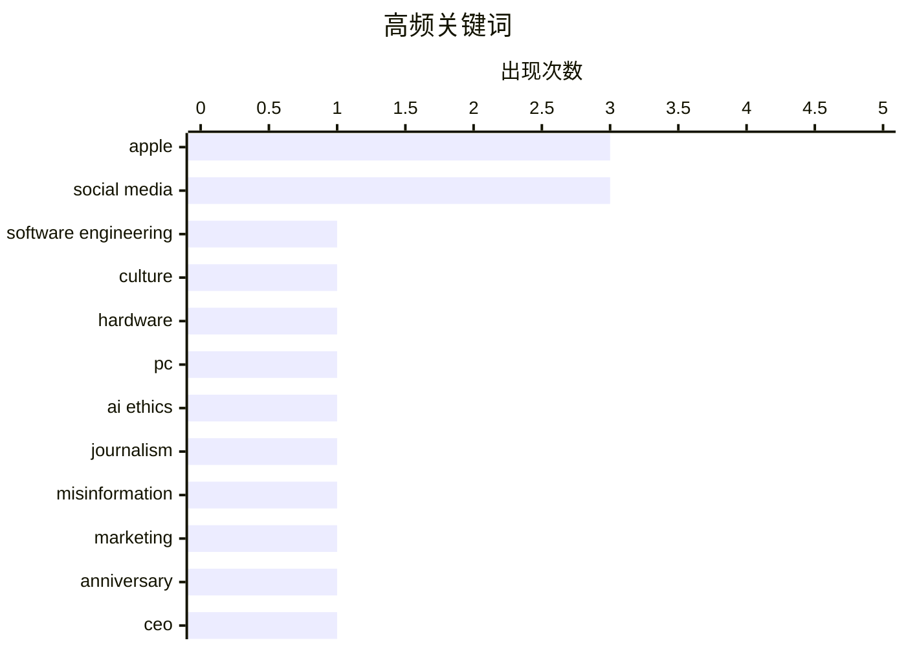

# 📰 AI 博客每日精选 — 2026-03-14

> 来自 98 个技术博客和社交媒体源，AI 精选 Top 11

## 📝 今日看点

今日技术圈聚焦于行业生态的深层反思与竞争。一方面，AI工具的滥用正引发信任危机，科技媒体因记者使用AI伪造内容而采取严厉处罚。另一方面，围绕苹果新品的讨论揭示了PC行业对竞争本质的认知偏差，同时大厂生存哲学被重新探讨，适度的“自我”被视作在复杂环境中推动创新的必要特质。此外，开源可持续性与数字身份协议等基础性议题也持续受到关注。

---

## 🏆 今日必读

🥇 **大厂工程师需要强大的自我**

[Big tech engineers need big egos](https://seangoedecke.com/big-tech-needs-big-egos/) — seangoedecke.com · 21 小时前 · 🔬 其他AI技术

> 文章反驳了科技行业普遍认为“自我过大有害”的观点。作者认为，在大型科技公司生存，一定程度上的“大自我”是必要且有益的，它能帮助工程师在复杂环境中坚持己见、推动项目。这种自我并非指令人难以忍受的过度自信，而是一种对自身能力和判断的坚定信念。核心结论是，健康的自我意识是工程师在大厂取得成功的关键特质之一。

💡 **为什么值得读**: 本文挑战了科技圈关于“谦逊”的主流叙事，为工程师的职业心态提供了反直觉但极具实践价值的视角。

🏷️ Software Engineering, Culture

🥈 **PC制造商尚未准备好迎接MacBook Neo的挑战**

[PC Makers Are Not Ready for the MacBook Neo](https://www.theverge.com/report/894090/macbook-neo-pc-windows-laptop-competition-asus-footinmouth) — daringfireball.net · 1 小时前 · 🔬 其他AI技术

> 文章指出，华硕CFO对苹果MacBook Neo（指新款MacBook Air）仅配备8GB RAM的评论，暴露了PC制造商对竞争的理解偏差。该高管认为Neo更侧重于内容消费，类似平板，这误解了苹果通过软硬件深度整合实现的效率。这表明PC厂商仍在用传统的硬件堆砌思维看待苹果的产品策略，未能意识到其体验优先的竞争力。作者认为PC行业并未准备好应对这种范式转变。

💡 **为什么值得读**: 通过一个具体的高管言论案例，犀利地揭示了Windows PC阵营在应对苹果M芯片Mac战略时的认知滞后。

🏷️ Hardware, Apple, PC

🥉 **Ars Technica因记者使用AI伪造引语而将其解雇**

[Ars Technica Fires Reporter Benj Edwards After He Published Story With AI-Fabricated Quotes](https://futurism.com/artificial-intelligence/ars-technica-fires-reporter-ai-quotes) — daringfireball.net · 4 小时前 · 🔬 其他AI技术

> 知名科技媒体Ars Technica解雇了记者Benj Edwards，因其发表的文章中包含了AI生成的虚假引语。这篇于2月13日发布的文章报道了一起AI代理攻击人类工程师的事件，但其中引述工程师Scott Shambaugh的话完全是伪造的。在当事人指出问题后，主编Ken Fisher道歉并撤回了文章。此事凸显了在新闻报道中滥用AI生成内容所带来的职业风险和伦理问题。

💡 **为什么值得读**: 这是主流科技媒体因AI伪造内容而采取解雇措施的标志性事件，对新闻行业和内容创作者敲响了警钟。

🏷️ AI Ethics, Journalism, Misinformation

4️⃣ **小小的访达小子**

[Lil Finder Guy](https://basicappleguy.com/basicappleblog/lil-finder-guy) — daringfireball.net · 5 小时前 · 🔬 其他AI技术

> 文章赞扬了苹果为推广MacBook Neo在TikTok上发起的营销活动，认为这是苹果多年来最有趣的一次广告战役。活动核心是一个名为“Lil Finder Guy”的卡通角色。作者非常喜爱这个活动，并呼吁苹果应该保留这个角色。文末预测，“Lil Finder Guy”很可能不会是昙花一现，暗示其有成为长期品牌形象的可能。

💡 **为什么值得读**: 展现了苹果在年轻化社交平台营销策略上的创新转变，对品牌营销和果粉文化感兴趣的读者会从中获得启发。

🏷️ Apple, Marketing, Social Media

5️⃣ **蒂姆·库克：'不同凡想50年'**

[Tim Cook: ‘50 Years of Thinking Different’](https://www.apple.com/50-years-of-thinking-different/) — daringfireball.net · 21 小时前 · 🔬 其他AI技术

> 这是苹果CEO蒂姆·库克为纪念公司“不同凡想”理念提出50周年发表的官方致辞。库克强调苹果更专注于创造未来而非缅怀过去，但借此机会感谢全球团队、开发者社区和所有顾客。他指出，用户的创意、信任和故事是苹果不断前进的动力。致辞的核心观点是，“不同凡想”的精神源于用户给予苹果的启示，并将继续指引公司前行。

💡 **为什么值得读**: 作为苹果官方对重要品牌里程碑的定调，是理解苹果当前企业文化和未来导向的一手材料。

🏷️ Apple, Anniversary, CEO

---

## 📊 数据概览

| 扫描源 | 抓取文章 | 时间范围 | 精选 |
|:---:|:---:|:---:|:---:|
| 76/98 | 2489 篇 → 11 篇 | 24h | **11 篇** |

### 分类分布



### 高频关键词



<details>
<summary>📈 纯文本关键词图（终端友好）</summary>

```
apple                │ ████████████████████ 3
social media         │ ████████████████████ 3
software engineering │ ███████░░░░░░░░░░░░░ 1
culture              │ ███████░░░░░░░░░░░░░ 1
hardware             │ ███████░░░░░░░░░░░░░ 1
pc                   │ ███████░░░░░░░░░░░░░ 1
ai ethics            │ ███████░░░░░░░░░░░░░ 1
journalism           │ ███████░░░░░░░░░░░░░ 1
misinformation       │ ███████░░░░░░░░░░░░░ 1
marketing            │ ███████░░░░░░░░░░░░░ 1
```

</details>

### 🏷️ 话题标签

**apple**(3) · **social media**(3) · **software engineering**(1) · culture(1) · hardware(1) · pc(1) · ai ethics(1) · journalism(1) · misinformation(1) · marketing(1) · anniversary(1) · ceo(1) · community(1) · digg(1) · politics(1) · corruption(1) · links(1) · open source(1) · government(1) · funding(1)

---

====================

## 🔬 其他AI技术

### 1. 大厂工程师需要强大的自我

[Big tech engineers need big egos](https://seangoedecke.com/big-tech-needs-big-egos/) — **seangoedecke.com** · 21 小时前 · ⭐ 5/25

> 文章反驳了科技行业普遍认为“自我过大有害”的观点。作者认为，在大型科技公司生存，一定程度上的“大自我”是必要且有益的，它能帮助工程师在复杂环境中坚持己见、推动项目。这种自我并非指令人难以忍受的过度自信，而是一种对自身能力和判断的坚定信念。核心结论是，健康的自我意识是工程师在大厂取得成功的关键特质之一。

🏷️ Software Engineering, Culture

📌 其他AI技术

---

### 2. PC制造商尚未准备好迎接MacBook Neo的挑战

[PC Makers Are Not Ready for the MacBook Neo](https://www.theverge.com/report/894090/macbook-neo-pc-windows-laptop-competition-asus-footinmouth) — **daringfireball.net** · 1 小时前 · ⭐ 5/25

> 文章指出，华硕CFO对苹果MacBook Neo（指新款MacBook Air）仅配备8GB RAM的评论，暴露了PC制造商对竞争的理解偏差。该高管认为Neo更侧重于内容消费，类似平板，这误解了苹果通过软硬件深度整合实现的效率。这表明PC厂商仍在用传统的硬件堆砌思维看待苹果的产品策略，未能意识到其体验优先的竞争力。作者认为PC行业并未准备好应对这种范式转变。

🏷️ Hardware, Apple, PC

📌 其他AI技术

---

### 3. Ars Technica因记者使用AI伪造引语而将其解雇

[Ars Technica Fires Reporter Benj Edwards After He Published Story With AI-Fabricated Quotes](https://futurism.com/artificial-intelligence/ars-technica-fires-reporter-ai-quotes) — **daringfireball.net** · 4 小时前 · ⭐ 5/25

> 知名科技媒体Ars Technica解雇了记者Benj Edwards，因其发表的文章中包含了AI生成的虚假引语。这篇于2月13日发布的文章报道了一起AI代理攻击人类工程师的事件，但其中引述工程师Scott Shambaugh的话完全是伪造的。在当事人指出问题后，主编Ken Fisher道歉并撤回了文章。此事凸显了在新闻报道中滥用AI生成内容所带来的职业风险和伦理问题。

🏷️ AI Ethics, Journalism, Misinformation

📌 其他AI技术

---

### 4. 小小的访达小子

[Lil Finder Guy](https://basicappleguy.com/basicappleblog/lil-finder-guy) — **daringfireball.net** · 5 小时前 · ⭐ 5/25

> 文章赞扬了苹果为推广MacBook Neo在TikTok上发起的营销活动，认为这是苹果多年来最有趣的一次广告战役。活动核心是一个名为“Lil Finder Guy”的卡通角色。作者非常喜爱这个活动，并呼吁苹果应该保留这个角色。文末预测，“Lil Finder Guy”很可能不会是昙花一现，暗示其有成为长期品牌形象的可能。

🏷️ Apple, Marketing, Social Media

📌 其他AI技术

---

### 5. 蒂姆·库克：'不同凡想50年'

[Tim Cook: ‘50 Years of Thinking Different’](https://www.apple.com/50-years-of-thinking-different/) — **daringfireball.net** · 21 小时前 · ⭐ 5/25

> 这是苹果CEO蒂姆·库克为纪念公司“不同凡想”理念提出50周年发表的官方致辞。库克强调苹果更专注于创造未来而非缅怀过去，但借此机会感谢全球团队、开发者社区和所有顾客。他指出，用户的创意、信任和故事是苹果不断前进的动力。致辞的核心观点是，“不同凡想”的精神源于用户给予苹果的启示，并将继续指引公司前行。

🏷️ Apple, Anniversary, CEO

📌 其他AI技术

---

### 6. 你还记得Digg吗？

[You Digg?](https://idiallo.com/byte-size/digg-is-gone-again?src=feed) — **idiallo.com** · 12 小时前 · ⭐ 5/25

> 作者回忆了Digg作为Reddit前身和早期核心网络社区的辉煌岁月。文章重点分析了Digg衰败的关键转折点：V4版本改版。这次改版不仅强推了用户不喜欢的全新设计，更关键的是移除了“埋葬”（bury）按钮，剥夺了社区对内容的集体调控权。作者指出，许多社交网站都倾向于取消点踩功能，这背后可能存在着对用户权力的系统性限制。Digg的案例是社区治理失败的经典教训。

🏷️ Social Media, Community, Digg

📌 其他AI技术

---

### 7. 多元化：腐败的反腐败（2026年3月14日）

[Pluralistic: Corrupt anticorruption (14 Mar 2026)](https://pluralistic.net/2026/03/14/ill-have-what-xis-having/) — **pluralistic.net** · 6 小时前 · ⭐ 5/25

> 这是科利·多克托罗的每日博客链接合集，主题涵盖广泛。本期核心链接探讨了“腐败的反腐败”这一现象，意指反腐败机制本身可能被腐蚀。其余链接内容庞杂，包括科技（奥巴马vs加密、特朗普vs抗议者）、文化（斯蒂芬·金与工会）、经济（免税的标普500公司）等多个领域的短评和趣闻。文章以密集的信息流呈现了对当代社会多个切面的批判性观察。

🏷️ Politics, Corruption, Links

📌 其他AI技术

---

### 8. 政府如何资助开源维护者？

[How Can Governments Pay Open Source Maintainers?](https://shkspr.mobi/blog/2026/03/how-can-governments-pay-open-source-maintainers/) — **shkspr.mobi** · 8 小时前 · ⭐ 5/25

> 文章基于作者在英国政府工作的经验，探讨了政府为所使用的开源软件付费这一难题。尽管英国政府自身发布大量开源代码，但如何系统性地补偿外部开源维护者却面临实际挑战。作者分析了其中涉及的多重复杂问题，例如确定资助对象、金额和方式等。这揭示了一个普遍矛盾：公共部门广泛依赖开源软件，却缺乏直接、公平地回馈其维护者的有效机制。

🏷️ Open Source, Government, Funding

📌 其他AI技术

---

### 9. human.json

[human.json](https://evanhahn.com/human-dot-json/) — **evanhahn.com** · 21 小时前 · ⭐ 5/25

> 文章介绍并实践了“human.json”协议，这是一个用于人类声明其网站内容作者身份并为他人的“人性”作证的网络协议。该协议利用URL所有权作为身份标识，通过站点之间可爬取的“担保”网络来传播信任。作者认为这是一个简洁而巧妙的想法，并已将其部署在自己的网站上（evanhahn.com/human.json）。这本质上是在尝试为网络内容建立一种去中心化的、基于社会关系的“人性证明”层。

🏷️ Protocol, Identity, Web

📌 其他AI技术

---

### 10. FAIR包管理器发生了什么？

[What’s Going On with FAIR Package Manager](https://nesbitt.io/2026/03/14/whats-going-on-with-fair-package-manager.html) — **nesbitt.io** · 11 小时前 · ⭐ 5/25

> 文章简短通报了“联邦FAIR”（Federated FAIR）项目的技术栈变更。该项目已从最初使用的WordPress内容管理系统，转向了TYPO3。FAIR包管理器是一个旨在促进科研软件可发现、可访问、可互操作和可重用的工具。这次技术 pivot 表明项目在底层平台选型上进行了重大调整，可能出于对灵活性、扩展性或社区生态的考虑。

🏷️ Package Manager, FAIR, CMS

📌 其他AI技术

---

### 11. The standard libraries already include π. But where’s the fun in that? Happy #PiDay! 🍕

[The standard libraries already include π. But where’s the fun in that? Happy #PiDay! 🍕](https://x.com/github/status/2032762182929146356) — **𝕏 @GitHub** · 11 小时前 · ⭐ 5/25

> The standard libraries already include π. But where’s the fun in that? <br>Happy #PiDay! 🍕<br><img width="1800" height="1800" style="" src="https://pbs.twimg.com/media/HDXSaovXQAA0muI?format=jpg&amp;

🏷️ PiDay, Fun, Social Media

📌 其他AI技术

---

====================

*生成于 2026-03-14 21:25 | 扫描 76 源 → 获取 2489 篇 → 精选 11 篇*
*基于 [Hacker News Popularity Contest 2025](https://refactoringenglish.com/tools/hn-popularity/) RSS 源列表，由 [Andrej Karpathy](https://x.com/karpathy) 推荐*
*由「懂点儿AI」制作，欢迎关注同名微信公众号获取更多 AI 实用技巧 💡*
