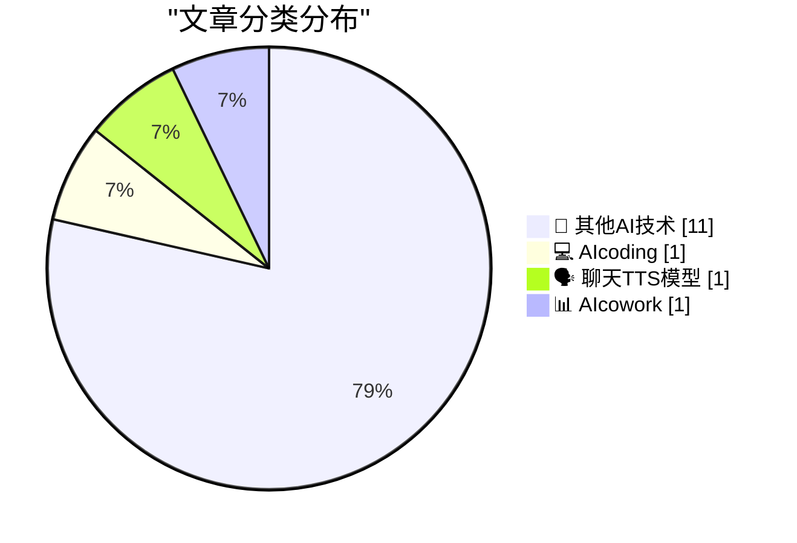
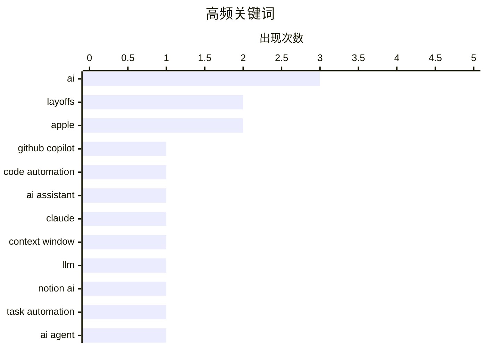

# 📰 AI 博客每日精选 — 2026-03-15

> 来自 98 个技术博客和社交媒体源，AI 精选 Top 14

## 📝 今日看点

今日技术圈聚焦于AI深度融入工作流与行业引发的深刻变革。一方面，AI助手正从代码编写扩展到日常任务管理，成为提升效率的“全能同事”；另一方面，大模型处理长上下文的能力取得突破，正重新定义知识工作的边界。与此同时，AI的巨额成本与效率提升已成为企业战略调整的核心驱动力，甚至直接影响组织架构与人力资源决策。

---

## 🏆 今日必读

🥇 **有时那些维护任务太简单了，不必亲自动手。🙃 通过 /fleet 命令提示 Copilot 来完成所有任务。✅**

[Sometimes those maintenance tasks are too easy to do yourself. 🙃 Prompt Copilot to do them all via the /fleet command. ✅](https://x.com/github/status/2033243463047610602) — 𝕏 @GitHub · 3 小时前 · 💻 AIcoding

> GitHub 展示了其 AI 编程助手 Copilot 的新功能。用户可以通过输入 `/fleet` 命令，让 Copilot 自动处理一系列代码库维护任务。视频演示了该命令如何批量执行诸如更新依赖、修复代码风格等重复性工作。这旨在将开发者从繁琐的日常维护中解放出来，专注于更有创造性的工作。

💡 **为什么值得读**: 该演示直观展示了 AI 如何自动化日常开发工作流，对于寻求提升效率的开发者具有直接参考价值。

🏷️ GitHub Copilot, Code Automation, AI Assistant

🥈 **为什么 Claude 新的 100 万上下文长度是件大事**

[Why Claude's new 1M context length is a big deal](https://martinalderson.com/posts/why-claudes-new-1m-context-length-is-a-big-deal/?utm_source=rss&amp;utm_medium=rss&amp;utm_campaign=feed) — martinalderson.com · 21 小时前 · 🗣️ 聊天TTS模型

> 文章探讨了 Anthropic 为其 Claude Opus 4.6 和 Sonnet 4.6 模型推出的 100 万 token 上下文窗口的重大意义。这一长度允许模型一次性处理数百页文档或数小时对话内容，突破了此前长上下文模型的实用瓶颈。关键突破在于，Anthropic 在提供此能力的同时并未额外收费，降低了大规模上下文应用的门槛。作者认为这不仅是技术突破，更将从根本上改变人机交互和信息处理的方式。

💡 **为什么值得读**: 文章深入分析了超长上下文窗口对 AI 应用范式的颠覆性影响，是理解下一代大模型竞争焦点的必读内容。

🏷️ Claude, Context Window, LLM

🥉 **Notion AI 刚刚帮我买了菜 🥕**

[RT Geoffrey Litt: Notion AI just bought my groceries 🥕](https://x.com/NotionHQ/status/2033284914519695624) — 𝕏 @NotionHQ · 3 小时前 · 📊 AIcowork

> 一条推文展示了 Notion AI 的实际应用案例。用户 Geoffrey Litt 分享截图，显示他利用 Notion AI 功能成功完成了购买 groceries（食品杂货）的任务。这体现了 Notion AI 正从文档协作工具向能够执行具体外部任务的动作型 AI 助理演进。案例证明了 AI 集成如何让生产力工具变得更加主动和实用。

💡 **为什么值得读**: 这个具体用例生动展示了 AI 如何融入日常生活并解决实际问题，为 Notion 用户提供了使用灵感。

🏷️ Notion AI, Task Automation, AI Agent

4️⃣ **Notion 创始人谈公司 AI 化重塑：全球最常用 AI 产品中，仅 3 家非 AI 原生公司**

[RT Hurley: Top 10 most used AI products in the world. Notion is one of only 3 that didn’t start as an AI company. Top 10 fastest growing software ven...](https://x.com/NotionHQ/status/2033284821934563653) — 𝕏 @NotionHQ · 3 小时前 · 🔬 其他AI技术

> Notion 联合创始人 Hurley 分享数据，指出 Notion 位列全球最常用 AI 产品前十，并且是其中仅有的三家非 AI 原生创业公司之一。在增长最快的软件供应商排名中，Notion 也是前十中仅有的两家非 AI 原生公司。他强调过去三年是 Notion 的全面重塑过程，涉及新的技术基础、产品界面和公司定位。这场向 AI 公司的转型被其形容为“一生的挑战和特权”。

💡 **为什么值得读**: 来自 Notion 核心创始人的第一手分享，揭示了传统成功软件公司如何在 AI 浪潮中艰难而彻底地转型。

🏷️ AI Products, Market Analysis, Notion

5️⃣ **Finalist 3.6**

[Finalist 3.6](https://www.finalist.works/finalist-36/) — daringfireball.net · 3 小时前 · 🔬 其他AI技术

> 文章介绍了独立开发者 Slaven Radic 推出的跨平台效率应用 Finalist 3.6。该应用是一个数字计划本，其核心理念是“大多数效率应用帮你组织任务，Finalist 帮你完成它们”。它通过获取权限，智能整合用户的日历、提醒事项和健康数据。Finalist 旨在帮助用户专注于执行和完成目标，而非仅仅规划。

💡 **为什么值得读**: 对于厌倦了复杂任务管理、追求极简执行流的用户，这款聚焦于“完成”的应用提供了一个新颖的解决方案。

🏷️ Product, App, Planner

---

## 📊 数据概览

| 扫描源 | 抓取文章 | 时间范围 | 精选 |
|:---:|:---:|:---:|:---:|
| 76/98 | 2492 篇 → 14 篇 | 24h | **14 篇** |

### 分类分布



### 高频关键词



<details>
<summary>📈 纯文本关键词图（终端友好）</summary>

```
ai              │ ████████████████████ 3
layoffs         │ █████████████░░░░░░░ 2
apple           │ █████████████░░░░░░░ 2
github copilot  │ ███████░░░░░░░░░░░░░ 1
code automation │ ███████░░░░░░░░░░░░░ 1
ai assistant    │ ███████░░░░░░░░░░░░░ 1
claude          │ ███████░░░░░░░░░░░░░ 1
context window  │ ███████░░░░░░░░░░░░░ 1
llm             │ ███████░░░░░░░░░░░░░ 1
notion ai       │ ███████░░░░░░░░░░░░░ 1
```

</details>

### 🏷️ 话题标签

**ai**(3) · **layoffs**(2) · **apple**(2) · github copilot(1) · code automation(1) · ai assistant(1) · claude(1) · context window(1) · llm(1) · notion ai(1) · task automation(1) · ai agent(1) · ai products(1) · market analysis(1) · notion(1) · product(1) · app(1) · planner(1) · philosophy(1) · tools(1)

---

====================

## 🔬 其他AI技术

### 1. Notion 创始人谈公司 AI 化重塑：全球最常用 AI 产品中，仅 3 家非 AI 原生公司

[RT Hurley: Top 10 most used AI products in the world. Notion is one of only 3 that didn’t start as an AI company. Top 10 fastest growing software ven...](https://x.com/NotionHQ/status/2033284821934563653) — **𝕏 @NotionHQ** · 3 小时前 · ⭐ 6/25

> Notion 联合创始人 Hurley 分享数据，指出 Notion 位列全球最常用 AI 产品前十，并且是其中仅有的三家非 AI 原生创业公司之一。在增长最快的软件供应商排名中，Notion 也是前十中仅有的两家非 AI 原生公司。他强调过去三年是 Notion 的全面重塑过程，涉及新的技术基础、产品界面和公司定位。这场向 AI 公司的转型被其形容为“一生的挑战和特权”。

🏷️ AI Products, Market Analysis, Notion

📌 其他AI技术

---

### 2. Finalist 3.6

[Finalist 3.6](https://www.finalist.works/finalist-36/) — **daringfireball.net** · 3 小时前 · ⭐ 5/25

> 文章介绍了独立开发者 Slaven Radic 推出的跨平台效率应用 Finalist 3.6。该应用是一个数字计划本，其核心理念是“大多数效率应用帮你组织任务，Finalist 帮你完成它们”。它通过获取权限，智能整合用户的日历、提醒事项和健康数据。Finalist 旨在帮助用户专注于执行和完成目标，而非仅仅规划。

🏷️ Product, App, Planner

📌 其他AI技术

---

### 3. “这不是为你准备的电脑”

[‘This Is Not the Computer for You’](https://samhenri.gold/blog/20260312-this-is-not-the-computer-for-you/?ref=birchtree.me) — **daringfireball.net** · 3 小时前 · ⭐ 5/25

> 作者 Sam Henri Gold 反驳了“初学者应从简单工具入门”的常见观点。他认为，痴迷的学习往往始于手头任何可用的工具，并通过不断突破其极限来真正理解计算成本的本质。在性能不足的硬件上过度支付计算成本，其限制本身会成为探索技术的“地图”。这种实践性的、甚至带有破坏性的探索，才是掌握复杂技能的真实路径。

🏷️ Philosophy, Tools, Obsession

📌 其他AI技术

---

### 4. 将裁员归咎于 AI：‘这种说法更容易被接受’

[Blaming AI for Layoffs: ‘It Plays Better’](https://www.resume.org/the-great-turnover-9-in-10-companies-plan-to-hire-in-2026-yet-6-in-10-will-have-layoffs-2/) — **daringfireball.net** · 4 小时前 · ⭐ 5/25

> 基于 Resume.org 对 1000 名美国招聘经理的调查，文章揭示了一个现象：59% 的受访者承认，在解释招聘冻结或裁员时，他们会强调 AI 的影响。这样做的原因是，与直接引用财务压力相比，将原因归咎于 AI 技术“更容易被利益相关者接受”。这反映了 AI 正在成为企业进行人事调整时一个便利的、社会接受度更高的叙事工具。

🏷️ AI, Layoffs, Survey

📌 其他AI技术

---

### 5. Horace Dediu 论苹果缺席 AI 烧钱竞赛

[Horace Dediu on Apple Sitting Out the AI Spending Race](https://asymco.com/2026/03/10/the-most-brilliant-move-in-corporate-history/) — **daringfireball.net** · 5 小时前 · ⭐ 5/25

> 分析师 Horace Dediu 指出，在科技巨头竞相投入巨资建设 AI 数据中心时，苹果选择了截然不同的道路。2026年，亚马逊、谷歌、微软和 Meta 在 AI 数据中心上的资本支出合计高达约 6500 亿美元。而曾是最大资本支出者的苹果，并未加入这场军备竞赛。Dediu 将此策略称为“企业史上最精明的举措之一”，质疑了“不巨额投资 AI 基础设施就等于落后”的普遍假设。

🏷️ Apple, AI, Strategy

📌 其他AI技术

---

### 6. 路透社：‘Meta 计划大规模裁员以抵消 AI 成本’

[Reuters: ‘Meta Planning Sweeping Layoffs as AI Costs Mount’](https://www.reuters.com/business/world-at-work/meta-planning-sweeping-layoffs-ai-costs-mount-2026-03-14/) — **daringfireball.net** · 5 小时前 · ⭐ 5/25

> 路透社援引知情人士消息报道，Meta 正在计划一轮影响范围可能超过 20% 员工的大规模裁员。此举旨在抵消其在人工智能基础设施上的巨额投资成本，并为 AI 辅助带来的更高效率做准备。裁员的具体时间和最终规模尚未确定，但公司高层已向中层管理人员传达了相关计划。这凸显了 AI 投资的巨大财务压力正在直接转化为企业的人力结构调整。

🏷️ Meta, AI, Layoffs

📌 其他AI技术

---

### 7. Matt Mullenweg 记录一起极其狡猾的苹果账户钓鱼诈骗

[Matt Mullenweg Documents a Dastardly Clever Apple Account Phishing Scam](https://ma.tt/2026/03/gone-almost-phishin/) — **daringfireball.net** · 20 小时前 · ⭐ 5/25

> WordPress 创始人 Matt Mullenweg 详细描述了自己遭遇的一次高明的苹果账户钓鱼攻击。攻击者首先滥用苹果官方的密码重置流程，向他的所有设备发送大量重置提示进行骚扰。随后，一个伪装成苹果支持的诈骗电话精准拨入，企图利用用户的不耐烦心理套取账户验证码。尽管 Mullenweg 开启了锁定模式，但仍无法阻止这种利用合法系统发起的“疲劳轰炸”式社会工程攻击。

🏷️ Security, Phishing, Apple

📌 其他AI技术

---

### 8. iFixit拆解MacBook Neo：14年来最易维修的MacBook

[iFixit’s MacBook Neo Teardown](https://www.ifixit.com/News/116152/macbook-neo-is-the-most-repairable-macbook-in-14-years) — **daringfireball.net** · 23 小时前 · ⭐ 5/25

> iFixit对苹果最亲民的笔记本电脑MacBook Neo进行了拆解维修性评估。拆解发现，该机型采用了螺丝固定的电池托盘、维修难度更低的键盘设计，并配备了详尽的首日维修手册。与以往大量使用胶水、部件深埋的MacBook相比，Neo的维修便利性显著提升。这一设计证明，设备在保持亲民价格的同时，完全可以实现更高的可维修性。

🏷️ Repair, MacBook, Hardware

📌 其他AI技术

---

### 9. 书评：《太空机器人：我们行星探索者的秘密生活》作者：埃兹·皮尔森博士 ★★★⯪☆

[Book Review: Robots in Space - The Secret Lives of Our Planetary Explorers by Dr Ezzy Pearson ★★★⯪☆](https://shkspr.mobi/blog/2026/03/book-review-robots-in-space-the-secret-lives-of-our-planetary-explorers-by-dr-ezzy-pearson/) — **shkspr.mobi** · 8 小时前 · ⭐ 5/25

> 本书聚焦于无人行星探测器的历史与工程实践，而非载人航天任务。内容详细阐述了在数百万英里外着陆一个小型机器人的技术可行性、背后的工程团队以及时常阻碍项目的政治因素。书中揭示了太空探索中工程挑战与政治现实之间复杂的相互作用。作者的核心观点是，机器人探索的成功不仅取决于技术，更深受地面政治决策的影响。

🏷️ Robotics, Space, Book

📌 其他AI技术

---

### 10. 给开发者的引导式冥想

[Guided Meditation for Developers](https://nesbitt.io/2026/03/15/guided-meditation-for-developers.html) — **nesbitt.io** · 11 小时前 · ⭐ 5/25

> 这是一项专门为软件开发人员设计的冥想练习，旨在应对技术工作中的特定压力源。练习的核心是帮助开发者在复杂的依赖关系树（dependency tree）所象征的项目复杂性和技术债务中，找到内心的平静与专注。它提供了一种将正念练习与编程日常挑战相结合的心理调节方法。

🏷️ Meditation, Developer, Wellness

📌 其他AI技术

---

### 11. BertVote 2026年市议会选举指南

[BertVote Gemeenteraadsverkiezingen 2026](https://berthub.eu/articles/posts/bert-vote-gemeenteraad-2026/) — **berthub.eu** · 9 小时前 · ⭐ 5/25

> 作者针对2026年3月18日举行的荷兰市议会选举，推出了个人化的候选人推荐指南“BertVote”。由于作者本人作为“进步派Pijnacker-Nootdorp”（当地绿党-工党联盟）的名单支持者参选，此次无法以中立立场运作之前的“NerdVote”活动。指南基于作者对候选人的个人了解和信任，推荐了一批令他感到振奋的参选者。

🏷️ Elections, Politics, Local

📌 其他AI技术

---

## 💻 AIcoding

### 12. 有时那些维护任务太简单了，不必亲自动手。🙃 通过 /fleet 命令提示 Copilot 来完成所有任务。✅

[Sometimes those maintenance tasks are too easy to do yourself. 🙃 Prompt Copilot to do them all via the /fleet command. ✅](https://x.com/github/status/2033243463047610602) — **𝕏 @GitHub** · 3 小时前 · ⭐ 22/25

> GitHub 展示了其 AI 编程助手 Copilot 的新功能。用户可以通过输入 `/fleet` 命令，让 Copilot 自动处理一系列代码库维护任务。视频演示了该命令如何批量执行诸如更新依赖、修复代码风格等重复性工作。这旨在将开发者从繁琐的日常维护中解放出来，专注于更有创造性的工作。

🏷️ GitHub Copilot, Code Automation, AI Assistant

📌 AIcoding

---

## 🗣️ 聊天TTS模型

### 13. 为什么 Claude 新的 100 万上下文长度是件大事

[Why Claude's new 1M context length is a big deal](https://martinalderson.com/posts/why-claudes-new-1m-context-length-is-a-big-deal/?utm_source=rss&amp;utm_medium=rss&amp;utm_campaign=feed) — **martinalderson.com** · 21 小时前 · ⭐ 21/25

> 文章探讨了 Anthropic 为其 Claude Opus 4.6 和 Sonnet 4.6 模型推出的 100 万 token 上下文窗口的重大意义。这一长度允许模型一次性处理数百页文档或数小时对话内容，突破了此前长上下文模型的实用瓶颈。关键突破在于，Anthropic 在提供此能力的同时并未额外收费，降低了大规模上下文应用的门槛。作者认为这不仅是技术突破，更将从根本上改变人机交互和信息处理的方式。

🏷️ Claude, Context Window, LLM

📌 聊天TTS模型

---

## 📊 AIcowork

### 14. Notion AI 刚刚帮我买了菜 🥕

[RT Geoffrey Litt: Notion AI just bought my groceries 🥕](https://x.com/NotionHQ/status/2033284914519695624) — **𝕏 @NotionHQ** · 3 小时前 · ⭐ 10/25

> 一条推文展示了 Notion AI 的实际应用案例。用户 Geoffrey Litt 分享截图，显示他利用 Notion AI 功能成功完成了购买 groceries（食品杂货）的任务。这体现了 Notion AI 正从文档协作工具向能够执行具体外部任务的动作型 AI 助理演进。案例证明了 AI 集成如何让生产力工具变得更加主动和实用。

🏷️ Notion AI, Task Automation, AI Agent

📌 AIcowork

---

====================

*生成于 2026-03-15 21:27 | 扫描 76 源 → 获取 2492 篇 → 精选 14 篇*
*基于 [Hacker News Popularity Contest 2025](https://refactoringenglish.com/tools/hn-popularity/) RSS 源列表，由 [Andrej Karpathy](https://x.com/karpathy) 推荐*
*由「懂点儿AI」制作，欢迎关注同名微信公众号获取更多 AI 实用技巧 💡*
