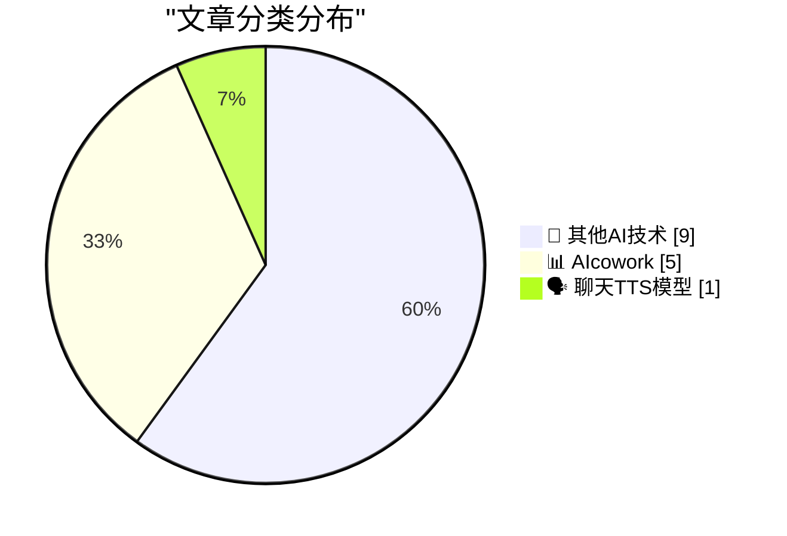
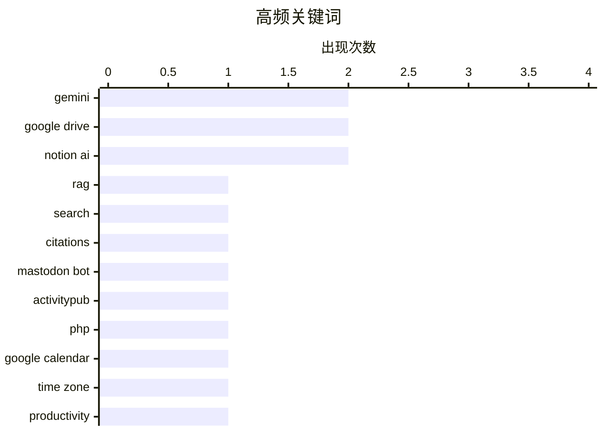

# 📰 AI 博客每日精选 — 2026-03-17

> 来自 98 个技术博客和社交媒体源，AI 精选 Top 15

## 📝 今日看点

今日技术圈聚焦于AI深度融入工作流与开发者工具的持续进化。以Google、Notion为代表的巨头正竞相将AI助手无缝嵌入办公套件，核心趋势是让AI主动理解上下文并直接提供答案，而非被动等待指令。同时，面向开发者的轻量化工具与视频、音频等专用AI基础设施也在并行发展，赋能更广泛的创新应用。

---

## 🏆 今日必读

🥇 **停止手动翻找，开始智能发现：在 Google Drive 中使用 Gemini 提问**

[Stop digging, start discovering. Ask Gemini in Drive lets you dive deeper by grounding answers directly in your chosen files and work context. Whether...](https://x.com/GoogleWorkspace/status/2033620119008473198) — 𝕏 @GoogleWorkspace · 7 小时前 · 📊 AIcowork

> Google Workspace 为 Google Drive 推出了名为“Ask Gemini”的新功能，允许用户基于特定文件和工作上下文进行深度提问。该功能将 Gemini 的回答直接“锚定”在用户选择的文件中，确保答案的相关性和准确性。无论是用于学习、研究还是其他复杂任务，用户都能获得更深入、更具针对性的答案。这标志着云端文件管理与 AI 对话能力的深度整合。

💡 **为什么值得读**: 该功能展示了 AI 如何从通用聊天转向基于具体文档的精准知识问答，是提升个人与团队信息处理效率的关键一步。

🏷️ Gemini, Google Drive, RAG

🥈 **无需翻找文件：Google Drive 的 AI 概述功能直接提供答案与引用**

[No more digging through files to find what you’re looking for. AI Overviews in Drive give you the answers you need, with citations, at the top of you...](https://x.com/GoogleWorkspace/status/2033574825646583998) — 𝕏 @GoogleWorkspace · 10 小时前 · 📊 AIcowork

> Google Drive 推出“AI Overviews”功能，旨在解决用户在大量文件中手动查找信息的痛点。该功能会在搜索结果顶部直接生成答案摘要，并为答案提供明确的文件引用来源。目前，该功能正面向美国的 Gemini Alpha 客户以及 Google AI Pro 和 Ultra 订阅用户逐步推出。这代表了搜索体验从提供文件列表到直接提供智能答案的范式转变。

💡 **为什么值得读**: 了解这项功能如何将传统文件搜索升级为即时知识提取，对于关注生产力工具演进和 AI 应用落地的用户极具参考价值。

🏷️ Gemini, Google Drive, Search, Citations

🥉 **ActivityBot 的一些更新**

[Some updates to ActivityBot](https://shkspr.mobi/blog/2026/03/some-updates-to-activitybot/) — shkspr.mobi · 13 小时前 · 🔬 其他AI技术

> 文章介绍了 ActivityBot 的近期更新，这是一个用于快速构建 Mastodon 机器人的极简工具。其核心是一个不足 80KB 的单一 PHP 文件，却能运行完整的 ActivityPub 服务器。文中列举了多个成功运行的实例，如 @openbenches、@colours 和 @solar 等机器人。作者证明了这种轻量级方案在功能上的可行性。

💡 **为什么值得读**: 对于想快速入门去中心化社交网络机器人开发、且追求极致轻量的开发者，这是一个非常具体且实用的技术方案参考。

🏷️ Mastodon Bot, ActivityPub, PHP

4️⃣ **轻松协调全球会议：Google 日历新增时区快速搜索设置功能**

[Coordinate global meetings with ease. 🌍 Rolling out now, you can search for a city or country to instantly find and set time zones in @GoogleCalend...](https://x.com/GoogleWorkspace/status/2033650261558722707) — 𝕏 @GoogleWorkspace · 5 小时前 · 📊 AIcowork

> Google Calendar 推出了一项新功能，允许用户通过搜索城市或国家名称来快速查找和设置时区。该功能旨在简化跨时区会议的协调过程，减少用户手动滚动查找时区所花费的时间。目前该功能正在逐步向用户推送。其核心目标是让用户将更多时间用于会议本身，而非繁琐的日程安排。

💡 **为什么值得读**: 对于频繁组织或参与跨国、跨地区会议的职场人士，这个看似微小的改进能显著提升日程安排效率和体验。

🏷️ Google Calendar, Time Zone, Productivity

5️⃣ **Notion 推广其 AI 会议笔记功能，强调数据开放与生态**

[RT Zach Tratar: For anyone looking for an open Granola alternative: give Notion AI meeting notes a shot! We don’t hold your data hostage. Your agents...](https://x.com/NotionHQ/status/2033710782400368765) — 𝕏 @NotionHQ · 1 小时前 · 📊 AIcowork

> Notion 通过转推用户评论，推广其 AI 会议笔记功能，并将其定位为“开放”的替代方案。其宣传重点在于数据主权和生态开放性，声称不会“挟持用户数据”，并允许用户的其他智能体（如 Claude Code）使用这些数据。Notion 强调其相信生态系统，并承诺持续改进功能和接纳反馈。

💡 **为什么值得读**: 这篇文章揭示了 Notion 在 AI 功能竞争中的差异化策略——以数据开放和生态集成作为核心卖点，回应了市场对数据锁定的担忧。

🏷️ Notion AI, Meeting Notes, Data Portability

---

## 📊 数据概览

| 扫描源 | 抓取文章 | 时间范围 | 精选 |
|:---:|:---:|:---:|:---:|
| 74/98 | 2447 篇 → 17 篇 | 24h | **15 篇** |

### 分类分布



### 高频关键词



<details>
<summary>📈 纯文本关键词图（终端友好）</summary>

```
gemini          │ ████████████████████ 2
google drive    │ ████████████████████ 2
notion ai       │ ████████████████████ 2
rag             │ ██████████░░░░░░░░░░ 1
search          │ ██████████░░░░░░░░░░ 1
citations       │ ██████████░░░░░░░░░░ 1
mastodon bot    │ ██████████░░░░░░░░░░ 1
activitypub     │ ██████████░░░░░░░░░░ 1
php             │ ██████████░░░░░░░░░░ 1
google calendar │ ██████████░░░░░░░░░░ 1
```

</details>

### 🏷️ 话题标签

**gemini**(2) · **google drive**(2) · **notion ai**(2) · rag(1) · search(1) · citations(1) · mastodon bot(1) · activitypub(1) · php(1) · google calendar(1) · time zone(1) · productivity(1) · meeting notes(1) · data portability(1) · agent(1) · workflow(1) · video api(1) · ai workflow(1) · content moderation(1) · elevenlabs(1)

---

====================

## 🔬 其他AI技术

### 1. ActivityBot 的一些更新

[Some updates to ActivityBot](https://shkspr.mobi/blog/2026/03/some-updates-to-activitybot/) — **shkspr.mobi** · 13 小时前 · ⭐ 18/25

> 文章介绍了 ActivityBot 的近期更新，这是一个用于快速构建 Mastodon 机器人的极简工具。其核心是一个不足 80KB 的单一 PHP 文件，却能运行完整的 ActivityPub 服务器。文中列举了多个成功运行的实例，如 @openbenches、@colours 和 @solar 等机器人。作者证明了这种轻量级方案在功能上的可行性。

🏷️ Mastodon Bot, ActivityPub, PHP

📌 其他AI技术

---

### 2. Mux —— 面向开发者的视频 API

[[Sponsor] Mux — Video API for Developers](https://www.mux.com/video-api?utm_campaign=fireball&amp;utm_source=DF) — **daringfireball.net** · 2 小时前 · ⭐ 14/25

> Mux 是一个视频基础设施平台，提供开发者友好的视频 API。其核心价值在于将视频视为包含上下文和数据的数据源，而不仅仅是播放内容。该 API 支持将视频集成到网站、平台及 AI 工作流中，并能提取字幕、剪辑、故事板等数据，用于构建摘要、翻译、内容审核、打标等功能。同时，Mux 维护着最流行的开源视频播放器 Video.js，其 v10 版本正在进行架构重构。

🏷️ Video API, AI Workflow, Content Moderation

📌 其他AI技术

---

### 3. 《最后一件安静的事》

[‘The Last Quiet Thing’](https://www.terrygodier.com/the-last-quiet-thing) — **daringfireball.net** · 8 小时前 · ⭐ 5/25

> 这是一篇由 Terry Godier 撰写的关于设计与注意力的精彩论文。文章探讨了在信息过载和干扰不断的时代，设计如何与用户的注意力进行交互。文中用作例证的卡西欧手表不仅显示真实时间，而且按钮功能完好，暗示了实体设计在提供“安静”、专注体验上的价值。文章的核心是反思科技产品设计中“安静”品质的重要性。

🏷️ Design, Attention

📌 其他AI技术

---

### 4. 苹果发布由 H2 芯片驱动的 AirPods Max 2

[Apple Introduces AirPods Max 2](https://www.apple.com/newsroom/2026/03/apple-introduces-airpods-max-2-powered-by-h2/) — **daringfireball.net** · 8 小时前 · ⭐ 5/25

> 苹果公司正式发布了第二代头戴式耳机 AirPods Max 2。新品由 H2 芯片驱动，带来了多项升级：包括更强的主动降噪（ANC）、提升的音质，以及首次下放至该系列的自适应音频、对话感知、语音隔离和实时翻译等智能功能。同时，它还为播客主、音乐人和内容创作者提供了录音室级音频录制等创作工具。这标志着 AirPods Max 产品线在音质、智能和创作能力上的全面进化。

🏷️ AirPods, Live Translation

📌 其他AI技术

---

### 5. 苹果飞地与 MacBook Neo 屏幕摄像头指示灯的安防设计

[★ Apple Exclaves and the Secure Design of the MacBook Neo’s On-Screen Camera Indicator](https://daringfireball.net/2026/03/apple_enclaves_neo_camera_indicator) — **daringfireball.net** · 9 小时前 · ⭐ 5/25

> 文章剖析了苹果 MacBook Neo 机型如何通过硬件级安全设计，确保摄像头指示灯无法被软件禁用。其核心方案是利用独立的“飞地”协处理器来管理摄像头和指示灯，两者在物理电路上强制联动。这意味着，即便是内核级漏洞攻击，也无法在指示灯不亮的情况下开启摄像头。作者认为，这种硬件强制执行的隐私设计，是软件方案无法比拟的根本性安全保障。

🏷️ Security, Hardware Design

📌 其他AI技术

---

### 6. 忠诚宣誓运动

[The Loyalty Oath Crusade](https://idiallo.com/blog/loyalty-oath-crusade-speak-up?src=feed) — **idiallo.com** · 14 小时前 · ⭐ 5/25

> 文章借《第二十二条军规》中的荒诞情节，讽刺了组织中以安全为名、实则无效且繁琐的合规流程。书中军官制定了复杂的规则，例如进入食堂需背诵效忠宣誓，索取调料甚至要唱歌，众人明知其荒谬却依然遵从。这种现象揭示了官僚体系如何用形式主义的“忠诚测试”替代真正的安全管理，最终导致流程异化。其核心观点是，盲从于不合理的规则本身就是一种系统性风险。

🏷️ Process, Bureaucracy

📌 其他AI技术

---

### 7. 多元主义：工具与用途（2026年3月16日）

[Pluralistic: Tools vs uses (16 Mar 2026)](https://pluralistic.net/2026/03/16/whittle-a-webserver/) — **pluralistic.net** · 12 小时前 · ⭐ 5/25

> 科利·多克托罗的每日博文链接合集，主题驳杂，核心批判了“技术中立论”的谬误。当日主要文章《工具与用途》论证了技术总有其社会意图与使用语境，不能脱离其创造者和使用者的目的而独立存在。链接内容涉及亚马逊程序员与仓库工人的对比、布鲁斯·斯特林的ETECH演讲、斯蒂芬·金与工会、免税的标普500公司等广泛的社会技术议题。整体体现了从技术细节透视权力与社会结构的多元视角。

🏷️ Tools, Ethics, Labor

📌 其他AI技术

---

### 8. Windows 栈限制检查回顾：PowerPC 篇

[Windows stack limit checking retrospective: PowerPC](https://devblogs.microsoft.com/oldnewthing/20260316-00/?p=112140) — **devblogs.microsoft.com/oldnewthing** · 12 小时前 · ⭐ 5/25

> 这是 Raymond Chen 对 Windows NT 在 PowerPC 架构上实现栈限制检查机制的技术回顾。文章通过逆向工程式的“倒推计算”，揭示了系统如何确定并监控线程栈的边界以防止溢出。它具体分析了 PowerPC 这一特定移植版本中，编译器与操作系统运行时协作完成此项检查的底层细节。该回顾为了解 Windows 跨平台移植的历史及系统级安全机制的实现提供了珍贵案例。

🏷️ Windows, Stack, PowerPC

📌 其他AI技术

---

### 9. 雅达利 2600 版《吃豆人》于 1982 年 3 月 16 日发售

[Atari 2600 Pac-Man went on sale March 16, 1982](https://dfarq.homeip.net/atari-2600-pac-man-went-on-sale-march-16-1982/?utm_source=rss&#038;utm_medium=rss&#038;utm_campaign=atari-2600-pac-man-went-on-sale-march-16-1982) — **dfarq.homeip.net** · 15 小时前 · ⭐ 5/25

> 文章回顾了电子游戏史上一个著名事件：雅达利 2600 版《吃豆人》于 1982 年 3 月 16 日提前发售，比原定的 4 月 3 日早了近三周。当时部分零售商未遵守统一的发售日规定，提前将这款备受期待的游戏上架销售。作者指出，这种渠道失控的情况在当今严格的全球同步发售体系下已难以想象，反映了上世纪80年代游戏分销行业的不同生态。这一事件也成为了这款后来因质量不佳而饱受批评的游戏其传奇故事的开端。

🏷️ Atari, Pac-Man, Retro Gaming

📌 其他AI技术

---

## 📊 AIcowork

### 10. 停止手动翻找，开始智能发现：在 Google Drive 中使用 Gemini 提问

[Stop digging, start discovering. Ask Gemini in Drive lets you dive deeper by grounding answers directly in your chosen files and work context. Whether...](https://x.com/GoogleWorkspace/status/2033620119008473198) — **𝕏 @GoogleWorkspace** · 7 小时前 · ⭐ 20/25

> Google Workspace 为 Google Drive 推出了名为“Ask Gemini”的新功能，允许用户基于特定文件和工作上下文进行深度提问。该功能将 Gemini 的回答直接“锚定”在用户选择的文件中，确保答案的相关性和准确性。无论是用于学习、研究还是其他复杂任务，用户都能获得更深入、更具针对性的答案。这标志着云端文件管理与 AI 对话能力的深度整合。

🏷️ Gemini, Google Drive, RAG

📌 AIcowork

---

### 11. 无需翻找文件：Google Drive 的 AI 概述功能直接提供答案与引用

[No more digging through files to find what you’re looking for. AI Overviews in Drive give you the answers you need, with citations, at the top of you...](https://x.com/GoogleWorkspace/status/2033574825646583998) — **𝕏 @GoogleWorkspace** · 10 小时前 · ⭐ 20/25

> Google Drive 推出“AI Overviews”功能，旨在解决用户在大量文件中手动查找信息的痛点。该功能会在搜索结果顶部直接生成答案摘要，并为答案提供明确的文件引用来源。目前，该功能正面向美国的 Gemini Alpha 客户以及 Google AI Pro 和 Ultra 订阅用户逐步推出。这代表了搜索体验从提供文件列表到直接提供智能答案的范式转变。

🏷️ Gemini, Google Drive, Search, Citations

📌 AIcowork

---

### 12. 轻松协调全球会议：Google 日历新增时区快速搜索设置功能

[Coordinate global meetings with ease. 🌍 Rolling out now, you can search for a city or country to instantly find and set time zones in @GoogleCalend...](https://x.com/GoogleWorkspace/status/2033650261558722707) — **𝕏 @GoogleWorkspace** · 5 小时前 · ⭐ 17/25

> Google Calendar 推出了一项新功能，允许用户通过搜索城市或国家名称来快速查找和设置时区。该功能旨在简化跨时区会议的协调过程，减少用户手动滚动查找时区所花费的时间。目前该功能正在逐步向用户推送。其核心目标是让用户将更多时间用于会议本身，而非繁琐的日程安排。

🏷️ Google Calendar, Time Zone, Productivity

📌 AIcowork

---

### 13. Notion 推广其 AI 会议笔记功能，强调数据开放与生态

[RT Zach Tratar: For anyone looking for an open Granola alternative: give Notion AI meeting notes a shot! We don’t hold your data hostage. Your agents...](https://x.com/NotionHQ/status/2033710782400368765) — **𝕏 @NotionHQ** · 1 小时前 · ⭐ 16/25

> Notion 通过转推用户评论，推广其 AI 会议笔记功能，并将其定位为“开放”的替代方案。其宣传重点在于数据主权和生态开放性，声称不会“挟持用户数据”，并允许用户的其他智能体（如 Claude Code）使用这些数据。Notion 强调其相信生态系统，并承诺持续改进功能和接纳反馈。

🏷️ Notion AI, Meeting Notes, Data Portability

📌 AIcowork

---

### 14. 用户反馈：Notion AI 智能体体验大幅提升，已成为工作流常规部分

[RT Paul Klein IV: the notion agent has really been impressing me lately. huge improvement from the first time i tried it months ago and it's now a reg...](https://x.com/NotionHQ/status/2033704119958179951) — **𝕏 @NotionHQ** · 8 小时前 · ⭐ 16/25

> 文章通过转推展示了用户对 Notion AI 智能体（Agent）的积极评价。用户认为其相比数月前首次尝试有了巨大改进，现已融入常规工作流程。具体用例包括智能生成购物清单等日常任务。这表明 Notion AI 正从概念性功能向实用、可靠的生产力工具演进。

🏷️ Notion AI, Agent, Workflow

📌 AIcowork

---

## 🗣️ 聊天TTS模型

### 15. 我们有了新用户名：@ElevenLabs

[We've got a new handle: @ElevenLabs.](https://x.com/ElevenLabs/status/2033563425666748876) — **𝕏 @ElevenLabs** · 11 小时前 · ⭐ 12/25

> AI 语音合成公司 ElevenLabs 宣布其官方社交媒体账号更换了新的用户名（Handle）。原推文仅包含此声明和一个展示性的视频，未提及具体功能更新或公司变动。这很可能是一次品牌统一或账号优化的常规操作。

🏷️ ElevenLabs, TTS, Branding

📌 聊天TTS模型

---

====================

*生成于 2026-03-17 02:29 | 扫描 74 源 → 获取 2447 篇 → 精选 15 篇*
*基于 [Hacker News Popularity Contest 2025](https://refactoringenglish.com/tools/hn-popularity/) RSS 源列表，由 [Andrej Karpathy](https://x.com/karpathy) 推荐*
*由「懂点儿AI」制作，欢迎关注同名微信公众号获取更多 AI 实用技巧 💡*
