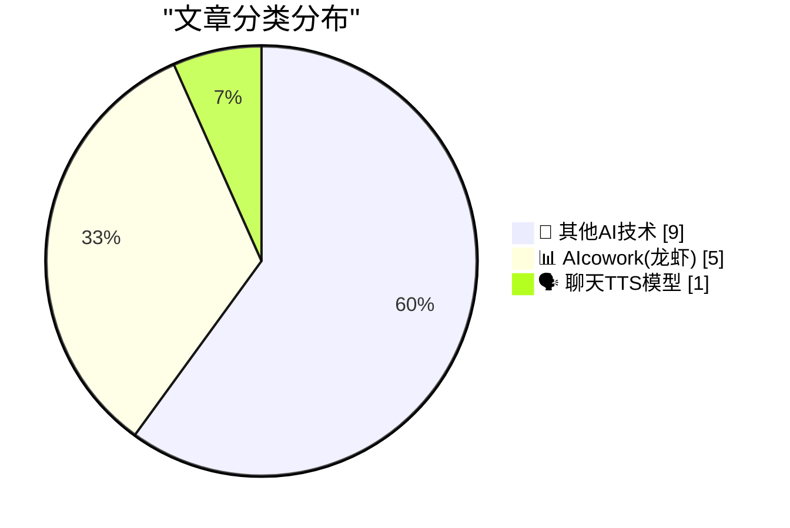
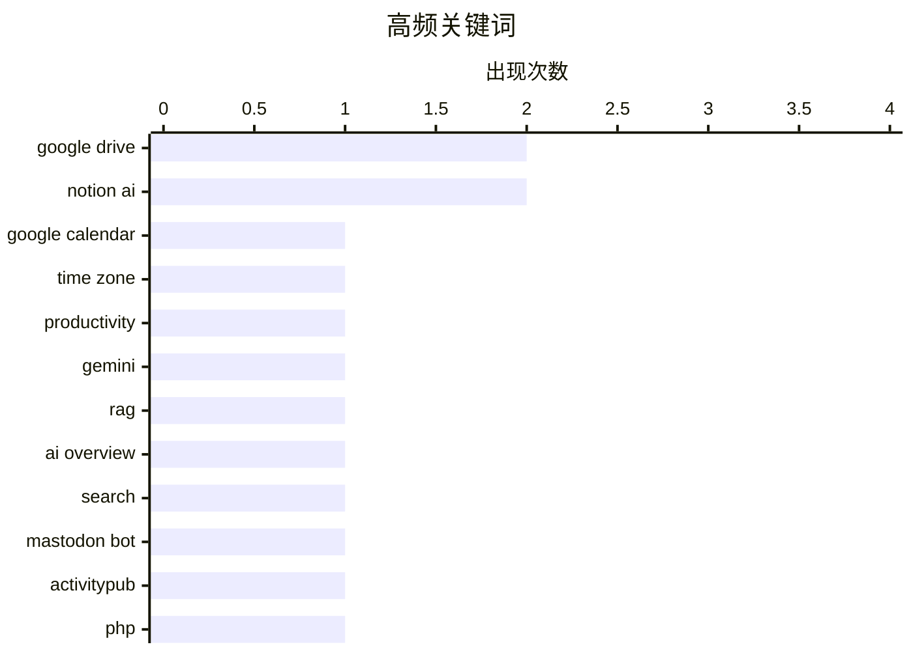

# 📰 AI 博客每日精选 — 2026-03-17

> 来自 98 个技术博客和社交媒体源，AI 精选 Top 15

## 📝 今日看点

今日技术圈聚焦于AI与协作工具的深度融合。AI正从独立工具演变为嵌入工作流的核心智能体，显著提升信息检索与任务自动化效率。同时，远程协作的体验优化与视频等多媒体内容的数据化处理也成为重要创新方向。

---

## 🏆 今日必读

🥇 **轻松协调全球会议：Google 日历推出时区快速搜索功能**

[Coordinate global meetings with ease. 🌍 Rolling out now, you can search for a city or country to instantly find and set time zones in @GoogleCalend...](https://x.com/GoogleWorkspace/status/2033650261558722707) — 𝕏 @GoogleWorkspace · 5 小时前 · 📊 AIcowork(龙虾)

> Google 日历推出新功能，旨在简化跨时区会议安排。用户现在可以直接搜索城市或国家名称，快速查找并设置对应时区。该功能减少了手动滚动查找时区的时间，让用户能将更多精力投入到会议本身。此更新目前正在全球范围内逐步推出。

💡 **为什么值得读**: 对于需要频繁安排跨国或跨地区会议的团队和个人，此功能能显著提升日程安排效率，是 Google Workspace 提升协作体验的实用更新。

🏷️ Google Calendar, Time Zone, Productivity

🥈 **停止挖掘，开始发现：Google Drive 中的“询问 Gemini”功能**

[Stop digging, start discovering. Ask Gemini in Drive lets you dive deeper by grounding answers directly in your chosen files and work context. Whether...](https://x.com/GoogleWorkspace/status/2033620119008473198) — 𝕏 @GoogleWorkspace · 7 小时前 · 📊 AIcowork(龙虾)

> Google Drive 集成了“询问 Gemini”功能，利用 AI 帮助用户深度挖掘文件内容。该功能将答案直接“锚定”在用户选择的文件和工作上下文中，提供更深入、更相关的回答。无论是用于学习、研究还是其他复杂问题，它都能基于用户的具体文件生成答案。这标志着 AI 正深度融入生产力工具，以理解上下文的方式辅助工作。

💡 **为什么值得读**: 它展示了 AI 如何从通用问答转向基于具体文档的精准分析，对于需要处理大量文档的研究者、学生和知识工作者极具吸引力。

🏷️ Gemini, Google Drive, RAG

🥉 **无需翻找文件：Google Drive 推出带引用的 AI 概览功能**

[No more digging through files to find what you’re looking for. AI Overviews in Drive give you the answers you need, with citations, at the top of you...](https://x.com/GoogleWorkspace/status/2033574825646583998) — 𝕏 @GoogleWorkspace · 10 小时前 · 📊 AIcowork(龙虾)

> Google Drive 推出“AI 概览”功能，旨在解决用户在海量文件中寻找信息的痛点。该功能在搜索结果顶部直接提供所需答案，并附有引用来源，指明信息出自哪个文件。目前，该功能正面向美国的 Gemini Alpha 客户以及 Google AI Pro 和 Ultra 订阅用户推出。这代表了搜索正从返回文件列表转向直接提供智能答案。

💡 **为什么值得读**: 该功能将文件搜索体验从‘找文件’升级为‘找答案’，能极大提升信息检索效率，是 AI 驱动生产力工具演进的重要一步。

🏷️ Google Drive, AI Overview, Search

4️⃣ **ActivityBot 的一些更新**

[Some updates to ActivityBot](https://shkspr.mobi/blog/2026/03/some-updates-to-activitybot/) — shkspr.mobi · 14 小时前 · 🔬 其他AI技术

> 文章介绍了 ActivityBot 的近期更新，这是一个用于快速构建 Mastodon 机器人的极简工具。其核心是一个不足 80KB 的单一 PHP 文件，却能运行完整的 ActivityPub 服务器。作者列举了多个运行实例，如 @openbenches、@colours 和 @solar 等机器人，证明了其有效性和实用性。ActivityBot 旨在为开发者提供创建去中心化社交网络机器人的最简单途径。

💡 **为什么值得读**: 对于想快速入门 ActivityPub 协议和 Mastodon 机器人开发的开发者，这是一个极其轻量且经过验证的解决方案。

🏷️ Mastodon Bot, ActivityPub, PHP

5️⃣ **Notion AI 会议笔记：一个开放的 Granola 替代方案**

[RT Zach Tratar: For anyone looking for an open Granola alternative: give Notion AI meeting notes a shot! We don’t hold your data hostage. Your agents...](https://x.com/NotionHQ/status/2033710782400368765) — 𝕏 @NotionHQ · 2 小时前 · 📊 AIcowork(龙虾)

> 这是一条推广 Notion AI 会议笔记功能的推文，将其定位为 Granola 的开放替代品。其核心卖点在于数据开放性，承诺不“挟持”用户数据，并允许用户的其他智能体（如 Claude Code）使用这些数据。Notion 强调其相信生态系统建设，并持续改进产品、乐于听取反馈。这反映了在 AI 笔记工具领域，数据可移植性和生态兼容性正成为关键竞争点。

💡 **为什么值得读**: 如果你担忧 AI 工具的数据锁定问题，并寻求一个能与其他 AI 工具协同工作的笔记解决方案，这条推文提供了明确的选型视角。

🏷️ Notion AI, Meeting Notes, Data Portability

---

## 📊 数据概览

| 扫描源 | 抓取文章 | 时间范围 | 精选 |
|:---:|:---:|:---:|:---:|
| 72/98 | 2416 篇 → 17 篇 | 24h | **15 篇** |

### 分类分布



### 高频关键词



<details>
<summary>📈 纯文本关键词图（终端友好）</summary>

```
google drive    │ ████████████████████ 2
notion ai       │ ████████████████████ 2
google calendar │ ██████████░░░░░░░░░░ 1
time zone       │ ██████████░░░░░░░░░░ 1
productivity    │ ██████████░░░░░░░░░░ 1
gemini          │ ██████████░░░░░░░░░░ 1
rag             │ ██████████░░░░░░░░░░ 1
ai overview     │ ██████████░░░░░░░░░░ 1
search          │ ██████████░░░░░░░░░░ 1
mastodon bot    │ ██████████░░░░░░░░░░ 1
```

</details>

### 🏷️ 话题标签

**google drive**(2) · **notion ai**(2) · **google calendar**(1) · time zone(1) · productivity(1) · gemini(1) · rag(1) · ai overview(1) · search(1) · mastodon bot(1) · activitypub(1) · php(1) · meeting notes(1) · data portability(1) · agent(1) · workflow(1) · video api(1) · ai workflows(1) · content moderation(1) · elevenlabs(1)

---

====================

## 🔬 其他AI技术

### 1. ActivityBot 的一些更新

[Some updates to ActivityBot](https://shkspr.mobi/blog/2026/03/some-updates-to-activitybot/) — **shkspr.mobi** · 14 小时前 · ⭐ 19/25

> 文章介绍了 ActivityBot 的近期更新，这是一个用于快速构建 Mastodon 机器人的极简工具。其核心是一个不足 80KB 的单一 PHP 文件，却能运行完整的 ActivityPub 服务器。作者列举了多个运行实例，如 @openbenches、@colours 和 @solar 等机器人，证明了其有效性和实用性。ActivityBot 旨在为开发者提供创建去中心化社交网络机器人的最简单途径。

🏷️ Mastodon Bot, ActivityPub, PHP

📌 其他AI技术

---

### 2. Mux — 面向开发者的视频 API

[[Sponsor] Mux — Video API for Developers](https://www.mux.com/video-api?utm_campaign=fireball&amp;utm_source=DF) — **daringfireball.net** · 3 小时前 · ⭐ 15/25

> Mux 是一个视频基础设施平台，提供 API 帮助开发者将视频功能集成到网站、平台及 AI 工作流中。其核心价值在于将视频视为“上下文和数据”的来源，而不仅仅是媒体流。通过 Mux，开发者可以轻松获取转录文本、剪辑片段、故事板等数据，用以构建视频摘要、翻译、内容审核、标签生成等高级功能。此外，Mux 还维护着最流行的开源视频播放器 Video.js，其 v10 版本正在进行架构重构。

🏷️ Video API, AI Workflows, Content Moderation

📌 其他AI技术

---

### 3. 《最后一件安静的事》

[‘The Last Quiet Thing’](https://www.terrygodier.com/the-last-quiet-thing) — **daringfireball.net** · 8 小时前 · ⭐ 5/25

> 这是 Terry Godier 撰写的一篇关于设计与注意力的精彩随笔。文章通过具体物件（如一款功能齐全的卡西欧手表）探讨了在信息过载时代，专注与“安静”设计的重要性。Daring Fireball 的推荐语称赞其为“又一篇关于设计和注意力的出色文章”，并特别指出文中提及的手表不仅显示时间，按钮也功能完好，暗示了实体设计的持久价值。文章的核心在于反思科技产品如何塑造我们的注意力与体验。

🏷️ Design, Attention

📌 其他AI技术

---

### 4. 苹果发布由 H2 芯片驱动的 AirPods Max 2

[Apple Introduces AirPods Max 2](https://www.apple.com/newsroom/2026/03/apple-introduces-airpods-max-2-powered-by-h2/) — **daringfireball.net** · 8 小时前 · ⭐ 5/25

> 苹果公司正式发布了第二代头戴式耳机 AirPods Max 2。新品由 H2 芯片驱动，在主动降噪（ANC）和音质方面均有提升。首次为 AirPods Max 带来了自适应音频、对话感知、语音隔离和实时翻译等智能功能。同时，它为播客主、音乐人和内容创作者解锁了新的创作可能，例如支持录音室品质的音频录制。此次更新标志着苹果将其高端耳机的音频体验和智能功能提升到了新水平。

🏷️ AirPods, Hardware

📌 其他AI技术

---

### 5. 苹果飞地与 MacBook Neo 屏幕摄像头指示灯的安防设计

[★ Apple Exclaves and the Secure Design of the MacBook Neo’s On-Screen Camera Indicator](https://daringfireball.net/2026/03/apple_enclaves_neo_camera_indicator) — **daringfireball.net** · 9 小时前 · ⭐ 5/25

> 文章剖析了苹果 MacBook Neo 机型中，其屏幕摄像头指示灯为何无法被软件（包括内核级漏洞）绕过而强制关闭的核心安全机制。关键在于该指示灯由独立的、与主系统隔离的安全协处理器（Apple Enclave）直接控制，其供电和信号通路与摄像头本身物理分离。这意味着即使攻击者获得了内核最高权限，也无法在指示灯不亮的情况下开启摄像头，实现了硬件级别的隐私保护。这种设计将用户可见的物理指示与设备功能进行强制绑定，是隐私安全设计的一个典范。

🏷️ Hardware Security, MacBook

📌 其他AI技术

---

### 6. 忠诚宣誓运动

[The Loyalty Oath Crusade](https://idiallo.com/blog/loyalty-oath-crusade-speak-up?src=feed) — **idiallo.com** · 14 小时前 · ⭐ 5/25

> 文章借用《第二十二条军规》中的荒诞情节，隐喻现代组织中普遍存在的、以安全或合规为名而设立的非必要官僚程序。这些程序（如复杂的登录流程、频繁的忠诚度检查）就像小说中为了进入食堂而必须背诵效忠誓言一样，其实际安全效益存疑，主要作用是表演“尽职”和巩固权力。作者指出，尽管大部分参与者都心知肚明其荒谬性，但出于恐惧或惯性，系统仍得以维持并自我强化。其核心观点是，许多安全措施已异化为形式主义的“忠诚度测试”，而非真正解决问题的工具。

🏷️ Essay, Society

📌 其他AI技术

---

### 7. 工具与用途：别上当

[Pluralistic: Tools vs uses (16 Mar 2026)](https://pluralistic.net/2026/03/16/whittle-a-webserver/) — **pluralistic.net** · 12 小时前 · ⭐ 5/25

> 科利·多克托罗在本文中批判了“技术中立论”的谬误，强调工具的设计永远嵌含着其创造者的意图与价值观，不存在完全中立的工具。他通过对比亚马逊对待其编码员与仓库工人的截然不同的技术系统指出，技术总是被用于服务特定的权力关系——前者获得赋能工具，后者则被监控和压榨工具所束缚。文章认为，我们必须审视技术被“设计用来”做什么，而非天真地讨论它“可能”用来做什么。结论是，将工具与其用途分离是一种危险的错觉，会让我们忽视技术背后的政治与社会选择。

🏷️ Commentary, Links

📌 其他AI技术

---

### 8. Windows 栈限制检查回顾：PowerPC 篇

[Windows stack limit checking retrospective: PowerPC](https://devblogs.microsoft.com/oldnewthing/20260316-00/?p=112140) — **devblogs.microsoft.com/oldnewthing** · 12 小时前 · ⭐ 5/25

> 这是 Raymond Chen 关于 Windows 历史兼容性设计系列文章的一篇，具体回顾了在 PowerPC 架构上实现栈溢出保护（栈限制检查）所遇到的独特挑战。与 x86 架构不同，PowerPC 缺乏专用于栈指针的寄存器，其栈指针是一个通用寄存器，这给运行时检测栈溢出带来了困难。解决方案涉及编译器与操作系统的紧密协作，包括在函数序言中插入检查代码，以及利用内存保护页来触发异常。文章通过“反向推导数学”的方式，解释了如何根据可用内存页大小等约束，计算出合适的栈检查粒度。这体现了 Windows 团队为在不同硬件平台上维持安全性与稳定性所付出的工程努力。

🏷️ Windows, Stack, PowerPC

📌 其他AI技术

---

### 9. 雅达利 2600 版《吃豆人》于 1982 年 3 月 16 日发售

[Atari 2600 Pac-Man went on sale March 16, 1982](https://dfarq.homeip.net/atari-2600-pac-man-went-on-sale-march-16-1982/?utm_source=rss&#038;utm_medium=rss&#038;utm_campaign=atari-2600-pac-man-went-on-sale-march-16-1982) — **dfarq.homeip.net** · 15 小时前 · ⭐ 5/25

> 文章记录了游戏史上一次著名的“偷跑”事件：雅达利 2600 家用机版的《吃豆人》原定于 1982 年 4 月 3 日发售，但部分零售商在 3 月 16 日就提前开始销售。这款游戏在当时备受期待，但最终因严重缩水的画面、音效和游戏性而恶评如潮，被认为是导致 1983 年北美游戏业大崩溃的关键因素之一。事件反映了早期游戏分销渠道管理的松散，与当今严格统一的全球发售形成对比。本文通过这个具体日期，钩沉了一段影响深远的产业历史记忆。

🏷️ Retro Gaming, Atari

📌 其他AI技术

---

## 📊 AIcowork(龙虾)

### 10. 轻松协调全球会议：Google 日历推出时区快速搜索功能

[Coordinate global meetings with ease. 🌍 Rolling out now, you can search for a city or country to instantly find and set time zones in @GoogleCalend...](https://x.com/GoogleWorkspace/status/2033650261558722707) — **𝕏 @GoogleWorkspace** · 5 小时前 · ⭐ 20/25

> Google 日历推出新功能，旨在简化跨时区会议安排。用户现在可以直接搜索城市或国家名称，快速查找并设置对应时区。该功能减少了手动滚动查找时区的时间，让用户能将更多精力投入到会议本身。此更新目前正在全球范围内逐步推出。

🏷️ Google Calendar, Time Zone, Productivity

📌 AIcowork(龙虾)

---

### 11. 停止挖掘，开始发现：Google Drive 中的“询问 Gemini”功能

[Stop digging, start discovering. Ask Gemini in Drive lets you dive deeper by grounding answers directly in your chosen files and work context. Whether...](https://x.com/GoogleWorkspace/status/2033620119008473198) — **𝕏 @GoogleWorkspace** · 7 小时前 · ⭐ 20/25

> Google Drive 集成了“询问 Gemini”功能，利用 AI 帮助用户深度挖掘文件内容。该功能将答案直接“锚定”在用户选择的文件和工作上下文中，提供更深入、更相关的回答。无论是用于学习、研究还是其他复杂问题，它都能基于用户的具体文件生成答案。这标志着 AI 正深度融入生产力工具，以理解上下文的方式辅助工作。

🏷️ Gemini, Google Drive, RAG

📌 AIcowork(龙虾)

---

### 12. 无需翻找文件：Google Drive 推出带引用的 AI 概览功能

[No more digging through files to find what you’re looking for. AI Overviews in Drive give you the answers you need, with citations, at the top of you...](https://x.com/GoogleWorkspace/status/2033574825646583998) — **𝕏 @GoogleWorkspace** · 10 小时前 · ⭐ 20/25

> Google Drive 推出“AI 概览”功能，旨在解决用户在海量文件中寻找信息的痛点。该功能在搜索结果顶部直接提供所需答案，并附有引用来源，指明信息出自哪个文件。目前，该功能正面向美国的 Gemini Alpha 客户以及 Google AI Pro 和 Ultra 订阅用户推出。这代表了搜索正从返回文件列表转向直接提供智能答案。

🏷️ Google Drive, AI Overview, Search

📌 AIcowork(龙虾)

---

### 13. Notion AI 会议笔记：一个开放的 Granola 替代方案

[RT Zach Tratar: For anyone looking for an open Granola alternative: give Notion AI meeting notes a shot! We don’t hold your data hostage. Your agents...](https://x.com/NotionHQ/status/2033710782400368765) — **𝕏 @NotionHQ** · 2 小时前 · ⭐ 17/25

> 这是一条推广 Notion AI 会议笔记功能的推文，将其定位为 Granola 的开放替代品。其核心卖点在于数据开放性，承诺不“挟持”用户数据，并允许用户的其他智能体（如 Claude Code）使用这些数据。Notion 强调其相信生态系统建设，并持续改进产品、乐于听取反馈。这反映了在 AI 笔记工具领域，数据可移植性和生态兼容性正成为关键竞争点。

🏷️ Notion AI, Meeting Notes, Data Portability

📌 AIcowork(龙虾)

---

### 14. Notion Agent 近期表现令人印象深刻，已成为工作流常规部分

[RT Paul Klein IV: the notion agent has really been impressing me lately. huge improvement from the first time i tried it months ago and it's now a reg...](https://x.com/NotionHQ/status/2033704119958179951) — **𝕏 @NotionHQ** · 9 小时前 · ⭐ 17/25

> 用户反馈 Notion 的 AI 智能体（Agent）功能近期有巨大改进，已从尝鲜工具转变为工作流中的常规部分。推文引用了一个具体用例：Notion AI 成功完成了代购 groceries（杂货）的任务。这表明 Notion AI 的能力已从文本处理扩展到能够理解并执行更复杂、更生活化的实际任务。用户认可其从数月前的初版到现在的显著进步。

🏷️ Notion AI, Agent, Workflow

📌 AIcowork(龙虾)

---

## 🗣️ 聊天TTS模型

### 15. 我们有了新用户名：@ElevenLabs

[We've got a new handle: @ElevenLabs.](https://x.com/ElevenLabs/status/2033563425666748876) — **𝕏 @ElevenLabs** · 11 小时前 · ⭐ 12/25

> AI 语音合成公司 ElevenLabs 宣布其官方社交媒体账号更新了用户名（Handle）。原推文仅包含一条简短的声明和一个展示性的视频，未提及具体功能更新或公司变动。这很可能是一次品牌统一或账号优化的常规操作。对于关注该公司的用户来说，这是一个需要知晓的账号变更信息。

🏷️ ElevenLabs, TTS, Branding

📌 聊天TTS模型

---

====================

*生成于 2026-03-17 02:52 | 扫描 72 源 → 获取 2416 篇 → 精选 15 篇*
*基于 [Hacker News Popularity Contest 2025](https://refactoringenglish.com/tools/hn-popularity/) RSS 源列表，由 [Andrej Karpathy](https://x.com/karpathy) 推荐*
*由「懂点儿AI」制作，欢迎关注同名微信公众号获取更多 AI 实用技巧 💡*
