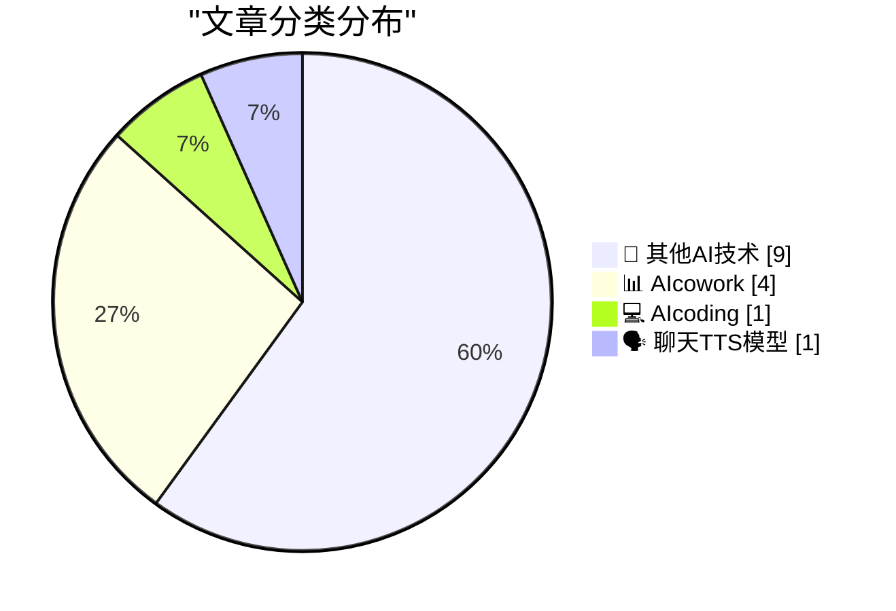
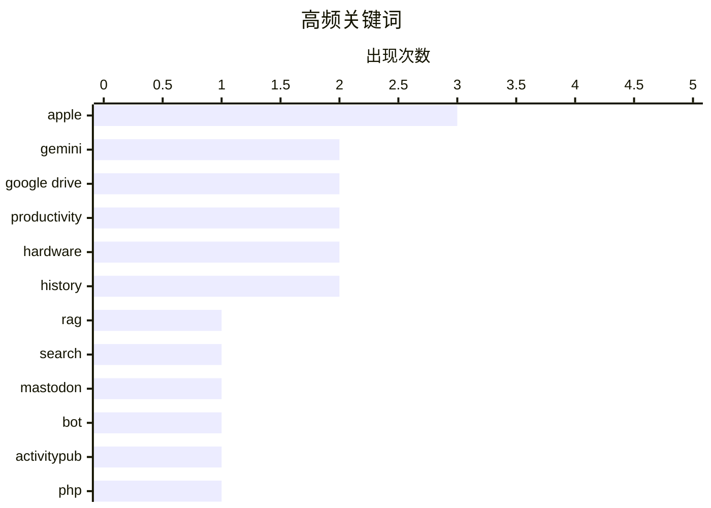

# 📰 AI 博客每日精选 — 2026-03-16

> 来自 98 个技术博客和社交媒体源，AI 精选 Top 15

## 📝 今日看点

今日技术圈聚焦于AI与协作工具的深度融合。谷歌Workspace系列更新引领潮流，其Drive和Calendar的AI功能正将智能问答与跨时区协作变为无缝体验。同时，从极简机器人工具到硬件安全设计，小而精的解决方案与底层技术创新同样备受关注。

---

## 🏆 今日必读

🥇 **停止手动翻找，开始智能发现：在 Google Drive 中使用 Gemini 提问**

[Stop digging, start discovering. Ask Gemini in Drive lets you dive deeper by grounding answers directly in your chosen files and work context. Whether...](https://x.com/GoogleWorkspace/status/2033620119008473198) — 𝕏 @GoogleWorkspace · 2 小时前 · 📊 AIcowork

> Google Workspace 为 Google Drive 推出了名为“Ask Gemini”的 AI 功能。该功能允许用户基于自己 Drive 中的特定文件和工作上下文进行提问，从而获得深度、相关的答案。无论是用于学习、研究还是其他工作场景，它都能将答案直接“锚定”在用户选择的文件上。这旨在帮助用户更高效地处理复杂问题，直接从文件中获取洞见。

💡 **为什么值得读**: 该功能展示了 AI 如何深度集成到生产力工具中，通过理解个人文件上下文来提供精准答案，是提升信息检索效率的实用案例。

🏷️ Gemini, Google Drive, RAG

🥈 **无需翻找文件：Google Drive 的 AI 概览功能直接提供答案与引用**

[No more digging through files to find what you’re looking for. AI Overviews in Drive give you the answers you need, with citations, at the top of you...](https://x.com/GoogleWorkspace/status/2033574825646583998) — 𝕏 @GoogleWorkspace · 5 小时前 · 📊 AIcowork

> Google Drive 推出“AI Overviews”功能，旨在改变用户搜索文件的方式。该功能会在搜索结果顶部直接生成用户所需问题的答案，并附上引用来源的文件链接。目前，该功能正面向美国的 Gemini Alpha 客户以及 Google AI Pro 和 Ultra 订阅用户逐步推出。其核心目标是让用户无需逐个打开文件进行查找，即可快速获得准确信息。

💡 **为什么值得读**: 它代表了企业云存储向智能知识库的演进，对于需要快速从海量文件中提取信息的团队和个人极具吸引力。

🏷️ Gemini, Google Drive, Search

🥉 **ActivityBot 的一些更新**

[Some updates to ActivityBot](https://shkspr.mobi/blog/2026/03/some-updates-to-activitybot/) — shkspr.mobi · 9 小时前 · 🔬 其他AI技术

> 文章介绍了 ActivityBot 的近期更新，这是一个用于快速构建 Mastodon 机器人的极简工具。其核心是一个不足 80KB 的单一 PHP 文件，却能运行完整的 ActivityPub 服务器。作者列举了多个运行实例，如 @openbenches@bot.openbenches.org 等，以证明其有效性和实用性。该工具旨在为开发者提供创建去中心化社交网络机器人的最简单途径。

💡 **为什么值得读**: 对于想快速入门 ActivityPub 协议和 Mastodon 机器人开发的开发者来说，这是一个极其轻量且经过实践验证的解决方案。

🏷️ Mastodon, Bot, ActivityPub, PHP

4️⃣ **轻松协调全球会议：Google 日历新增时区快速搜索功能**

[Coordinate global meetings with ease. 🌍 Rolling out now, you can search for a city or country to instantly find and set time zones in @GoogleCalend...](https://x.com/GoogleWorkspace/status/2033650261558722707) — 𝕏 @GoogleWorkspace · 34 分钟前 · 📊 AIcowork

> Google Calendar 正在推出一项旨在简化跨时区会议安排的新功能。用户现在可以直接搜索城市或国家名称，来快速查找并设置对应的时区。这项更新减少了用户在安排国际会议时手动滚动和查找时区所花费的时间。其设计目标是让用户能将更多精力专注于会议本身，而非繁琐的协调工作。

💡 **为什么值得读**: 此功能直接解决了远程办公和全球化团队协作中的一个高频痛点，能显著提升日程安排效率。

🏷️ Google Calendar, Time Zone, Productivity

5️⃣ **Windows 栈限制检查回顾：PowerPC 篇**

[Windows stack limit checking retrospective: PowerPC](https://devblogs.microsoft.com/oldnewthing/20260316-00/?p=112140) — devblogs.microsoft.com/oldnewthing · 7 小时前 · 💻 AIcoding

> 这是 Raymond Chen《The Old New Thing》博客中关于 Windows 历史技术细节的系列文章之一。本文具体回顾了在 PowerPC 架构上，Windows 操作系统如何进行栈限制检查。文章标题“Doing the math backwards”暗示了其分析角度是从结果反向推导实现机制。这类文章通常深入探讨了操作系统底层、特定硬件平台兼容性等不为人知的实现细节。

💡 **为什么值得读**: 适合对操作系统内核、历史硬件平台兼容性以及底层编程细节有浓厚兴趣的资深开发者和技术历史爱好者阅读。

🏷️ Windows, Stack, PowerPC, Retrospective

---

## 📊 数据概览

| 扫描源 | 抓取文章 | 时间范围 | 精选 |
|:---:|:---:|:---:|:---:|
| 75/98 | 2457 篇 → 17 篇 | 24h | **15 篇** |

### 分类分布



### 高频关键词



<details>
<summary>📈 纯文本关键词图（终端友好）</summary>

```
apple        │ ████████████████████ 3
gemini       │ █████████████░░░░░░░ 2
google drive │ █████████████░░░░░░░ 2
productivity │ █████████████░░░░░░░ 2
hardware     │ █████████████░░░░░░░ 2
history      │ █████████████░░░░░░░ 2
rag          │ ███████░░░░░░░░░░░░░ 1
search       │ ███████░░░░░░░░░░░░░ 1
mastodon     │ ███████░░░░░░░░░░░░░ 1
bot          │ ███████░░░░░░░░░░░░░ 1
```

</details>

### 🏷️ 话题标签

**apple**(3) · **gemini**(2) · **google drive**(2) · productivity(2) · hardware(2) · history(2) · rag(1) · search(1) · mastodon(1) · bot(1) · activitypub(1) · php(1) · google calendar(1) · time zone(1) · windows(1) · stack(1) · powerpc(1) · retrospective(1) · elevenlabs(1) · tts(1)

---

====================

## 🔬 其他AI技术

### 1. ActivityBot 的一些更新

[Some updates to ActivityBot](https://shkspr.mobi/blog/2026/03/some-updates-to-activitybot/) — **shkspr.mobi** · 9 小时前 · ⭐ 18/25

> 文章介绍了 ActivityBot 的近期更新，这是一个用于快速构建 Mastodon 机器人的极简工具。其核心是一个不足 80KB 的单一 PHP 文件，却能运行完整的 ActivityPub 服务器。作者列举了多个运行实例，如 @openbenches@bot.openbenches.org 等，以证明其有效性和实用性。该工具旨在为开发者提供创建去中心化社交网络机器人的最简单途径。

🏷️ Mastodon, Bot, ActivityPub, PHP

📌 其他AI技术

---

### 2. 《最后一件安静的事》

[‘The Last Quiet Thing’](https://www.terrygodier.com/the-last-quiet-thing) — **daringfireball.net** · 3 小时前 · ⭐ 5/25

> 这是 Terry Godier 撰写的一篇关于设计与注意力的精彩随笔。文章通过具体物件（如一款功能完整的卡西欧手表）的观察，探讨了在信息过载时代，那些能够让人专注、不打扰的“安静”设计所具有的价值。文章被 Daring Fireball 推荐，认为其见解深刻。

🏷️ Design, Attention

📌 其他AI技术

---

### 3. 苹果发布由 H2 芯片驱动的 AirPods Max 2

[Apple Introduces AirPods Max 2](https://www.apple.com/newsroom/2026/03/apple-introduces-airpods-max-2-powered-by-h2/) — **daringfireball.net** · 3 小时前 · ⭐ 5/25

> 苹果公司正式发布了第二代头戴式耳机 AirPods Max 2。新品由 H2 芯片驱动，带来了更强的主动降噪（ANC）、提升的音质以及多项智能功能。这是 Adaptive Audio（自适应音频）、Conversation Awareness（对话感知）、Voice Isolation（语音隔离）和 Live Translation（实时翻译）等功能首次引入 AirPods Max 产品线。同时，其新增的录音室级音频录制等功能，也为播客主、音乐人和内容创作者提供了新的创作可能性。

🏷️ AirPods, Hardware, Apple

📌 其他AI技术

---

### 4. 苹果安全飞地与 MacBook Neo 屏幕摄像头指示灯的保密设计

[★ Apple Exclaves and the Secure Design of the MacBook Neo’s On-Screen Camera Indicator](https://daringfireball.net/2026/03/apple_enclaves_neo_camera_indicator) — **daringfireball.net** · 4 小时前 · ⭐ 5/25

> 文章深入分析了苹果 MacBook Neo 笔记本电脑上摄像头指示灯的安全设计机制。其核心论点是，该指示灯的硬件与驱动由独立的“安全飞地”控制，与主操作系统内核完全隔离。这意味着，即使攻击者获得了内核级权限的漏洞利用，也无法在不点亮屏幕指示灯的情况下开启摄像头。这种设计从硬件层面确保了用户隐私的物理性提示不可被绕过。

🏷️ Security, Hardware, Apple

📌 其他AI技术

---

### 5. CHM Live：苹果公司50周年

[CHM Live: Apple at 50](https://www.youtube.com/live/eCSNJgI2LFI) — **daringfireball.net** · 22 小时前 · ⭐ 5/25

> 这是一场由David Pogue主持、庆祝苹果公司成立50周年的现场活动。活动邀请了包括Chris Espinosa、John Sculley和Avie Tevanian在内的特别嘉宾进行分享。内容回顾了苹果公司的历史、关键人物与重要时刻。对于苹果粉丝和科技史爱好者而言，这是一次难得的视听盛宴。

🏷️ Apple, History, Event

📌 其他AI技术

---

### 6. 忠诚宣誓运动

[The Loyalty Oath Crusade](https://idiallo.com/blog/loyalty-oath-crusade-speak-up?src=feed) — **idiallo.com** · 9 小时前 · ⭐ 5/25

> 文章借用约瑟夫·海勒《第二十二条军规》中的情节，讽刺了组织中荒谬的官僚程序和形式主义。书中描述军官为进入食堂和获取调味品，必须完成背诵效忠誓词、唱国歌等层层加码的忠诚测试。这种现象揭示了即使规则明显荒唐，群体也常常选择盲从。其核心观点是，过度的安全与忠诚要求往往会异化为脱离实际、压制个性的工具。

🏷️ Essay, Bureaucracy, Process

📌 其他AI技术

---

### 7. 淋浴思考：Git 瞬移

[Shower Thought: Git Teleportation](https://idiallo.com/byte-size/git-teleportation?src=feed) — **idiallo.com** · 21 小时前 · ⭐ 5/25

> 作者将科幻作品中的“传送”机制类比到Git版本控制系统的工作方式上。核心问题是探讨Git在提交代码时，数据是“移动”还是“复制重建”的。这引出了对Git底层数据模型（如对象存储、哈希引用）的思考。文章旨在用生动的比喻，帮助开发者理解Git内部运作的抽象概念。

🏷️ Git, Sci-fi, Analogy

📌 其他AI技术

---

### 8. 多元主义：工具与用途（2026年3月16日）

[Pluralistic: Tools vs uses (16 Mar 2026)](https://pluralistic.net/2026/03/16/whittle-a-webserver/) — **pluralistic.net** · 7 小时前 · ⭐ 5/25

> Cory Doctorow探讨了“工具中性论”的谬误，强调工具的设计与使用无法与其社会影响割裂。文章链接了多个案例，包括亚马逊对程序员与仓库工人的不同管理、史蒂芬·金支持工会的立场，以及大公司避税问题。其核心论点是，技术工具必然承载着权力结构和社会关系，需要批判性地审视。今日链接还涵盖了《汽车黑客手册》、制作Pop Rocks糖果等广泛主题。

🏷️ Tools, Ethics, Commentary

📌 其他AI技术

---

### 9. 雅达利2600版《吃豆人》于1982年3月16日发售

[Atari 2600 Pac-Man went on sale March 16, 1982](https://dfarq.homeip.net/atari-2600-pac-man-went-on-sale-march-16-1982/?utm_source=rss&#038;utm_medium=rss&#038;utm_campaign=atari-2600-pac-man-went-on-sale-march-16-1982) — **dfarq.homeip.net** · 10 小时前 · ⭐ 5/25

> 史上备受期待的雅达利2600版《吃豆人》于1982年3月16日提前上市，比原定的4月3日发售日早了近三周。这次提前发售是由于部分零售商未遵守统一发售规定，这在80年代相对宽松的零售环境下时有发生。文章回顾了这一游戏史上的标志性事件及其时代背景。

🏷️ Atari, Retro, Gaming, History

📌 其他AI技术

---

## 📊 AIcowork

### 10. 停止手动翻找，开始智能发现：在 Google Drive 中使用 Gemini 提问

[Stop digging, start discovering. Ask Gemini in Drive lets you dive deeper by grounding answers directly in your chosen files and work context. Whether...](https://x.com/GoogleWorkspace/status/2033620119008473198) — **𝕏 @GoogleWorkspace** · 2 小时前 · ⭐ 20/25

> Google Workspace 为 Google Drive 推出了名为“Ask Gemini”的 AI 功能。该功能允许用户基于自己 Drive 中的特定文件和工作上下文进行提问，从而获得深度、相关的答案。无论是用于学习、研究还是其他工作场景，它都能将答案直接“锚定”在用户选择的文件上。这旨在帮助用户更高效地处理复杂问题，直接从文件中获取洞见。

🏷️ Gemini, Google Drive, RAG

📌 AIcowork

---

### 11. 无需翻找文件：Google Drive 的 AI 概览功能直接提供答案与引用

[No more digging through files to find what you’re looking for. AI Overviews in Drive give you the answers you need, with citations, at the top of you...](https://x.com/GoogleWorkspace/status/2033574825646583998) — **𝕏 @GoogleWorkspace** · 5 小时前 · ⭐ 20/25

> Google Drive 推出“AI Overviews”功能，旨在改变用户搜索文件的方式。该功能会在搜索结果顶部直接生成用户所需问题的答案，并附上引用来源的文件链接。目前，该功能正面向美国的 Gemini Alpha 客户以及 Google AI Pro 和 Ultra 订阅用户逐步推出。其核心目标是让用户无需逐个打开文件进行查找，即可快速获得准确信息。

🏷️ Gemini, Google Drive, Search

📌 AIcowork

---

### 12. 轻松协调全球会议：Google 日历新增时区快速搜索功能

[Coordinate global meetings with ease. 🌍 Rolling out now, you can search for a city or country to instantly find and set time zones in @GoogleCalend...](https://x.com/GoogleWorkspace/status/2033650261558722707) — **𝕏 @GoogleWorkspace** · 34 分钟前 · ⭐ 17/25

> Google Calendar 正在推出一项旨在简化跨时区会议安排的新功能。用户现在可以直接搜索城市或国家名称，来快速查找并设置对应的时区。这项更新减少了用户在安排国际会议时手动滚动和查找时区所花费的时间。其设计目标是让用户能将更多精力专注于会议本身，而非繁琐的协调工作。

🏷️ Google Calendar, Time Zone, Productivity

📌 AIcowork

---

### 13. 分享我的 Notion 花园数据库公开版

[RT kathy: my friend asked to see my notion garden database and he liked it - so i made a public version: https://superficial-colossus-255.notion.site/...](https://x.com/NotionHQ/status/2033331845589578107) — **𝕏 @NotionHQ** · 22 小时前 · ⭐ 13/25

> 一位用户分享了自己在 Notion 中创建的花园管理数据库的公开版本。该数据库的核心目标是规划种植原生植物，以实现全年对传粉昆虫（如蜜蜂）的持续支持，并考虑了庭院现有植物情况。创建者还附带了简短的 README 说明，指导他人如何将其个性化，改造成适合自己的花园管理工具。

🏷️ Notion, Database, Productivity

📌 AIcowork

---

## 💻 AIcoding

### 14. Windows 栈限制检查回顾：PowerPC 篇

[Windows stack limit checking retrospective: PowerPC](https://devblogs.microsoft.com/oldnewthing/20260316-00/?p=112140) — **devblogs.microsoft.com/oldnewthing** · 7 小时前 · ⭐ 15/25

> 这是 Raymond Chen《The Old New Thing》博客中关于 Windows 历史技术细节的系列文章之一。本文具体回顾了在 PowerPC 架构上，Windows 操作系统如何进行栈限制检查。文章标题“Doing the math backwards”暗示了其分析角度是从结果反向推导实现机制。这类文章通常深入探讨了操作系统底层、特定硬件平台兼容性等不为人知的实现细节。

🏷️ Windows, Stack, PowerPC, Retrospective

📌 AIcoding

---

## 🗣️ 聊天TTS模型

### 15. 我们有了新账号：@ElevenLabs

[We've got a new handle: @ElevenLabs.](https://x.com/ElevenLabs/status/2033563425666748876) — **𝕏 @ElevenLabs** · 6 小时前 · ⭐ 15/25

> 这是一条来自 AI 语音合成公司 ElevenLabs 的官方公告。内容非常简短，仅宣布其社交媒体账号已更新为 @ElevenLabs。通常，此类账号变更意味着品牌统一或战略调整。公告以视频形式呈现，可能包含了品牌视觉或产品介绍的更新。

🏷️ ElevenLabs, TTS, Branding

📌 聊天TTS模型

---

====================

*生成于 2026-03-16 21:37 | 扫描 75 源 → 获取 2457 篇 → 精选 15 篇*
*基于 [Hacker News Popularity Contest 2025](https://refactoringenglish.com/tools/hn-popularity/) RSS 源列表，由 [Andrej Karpathy](https://x.com/karpathy) 推荐*
*由「懂点儿AI」制作，欢迎关注同名微信公众号获取更多 AI 实用技巧 💡*
