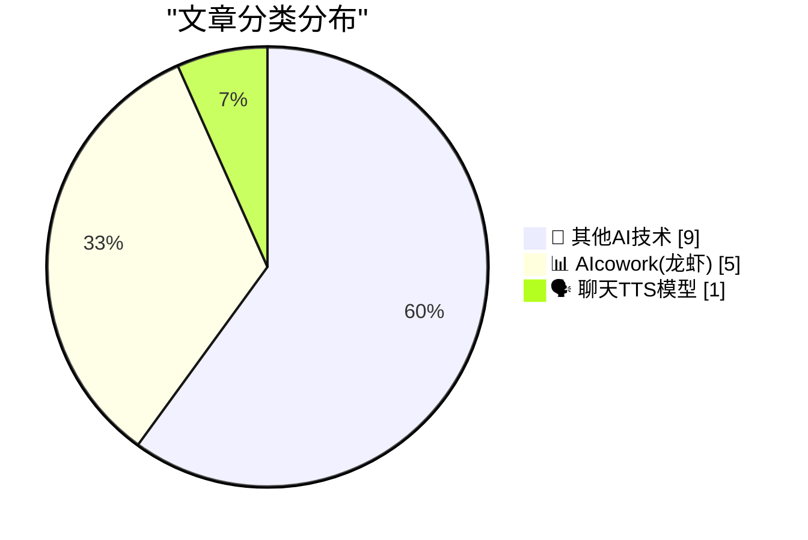
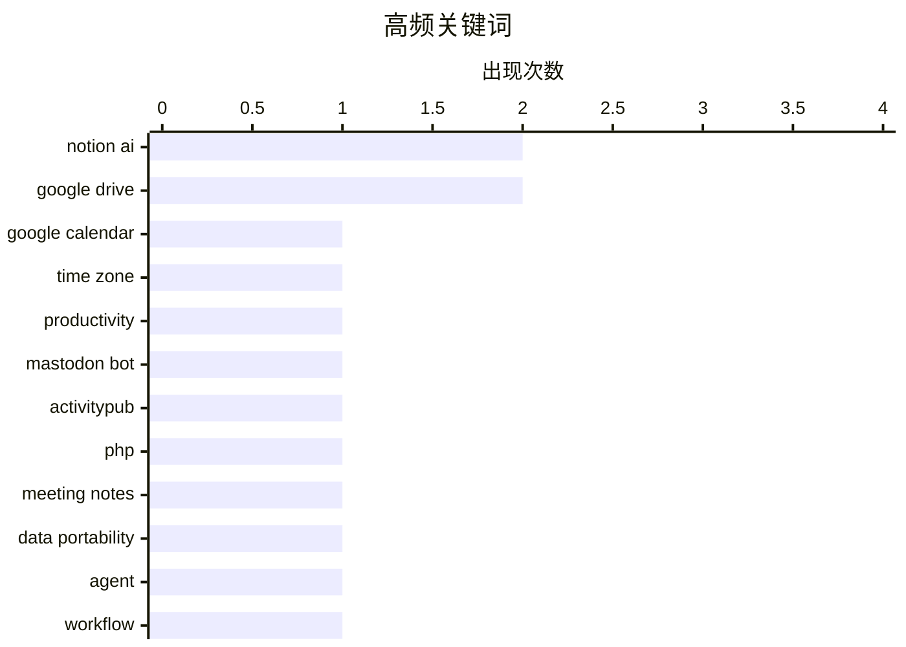

# 📰 AI 博客每日精选 — 2026-03-17

> 来自 98 个技术博客和社交媒体源，AI 精选 Top 15

## 📝 今日看点

今日技术圈聚焦于AI与协作工具的深度融合。巨头谷歌与Notion竞相升级其办公套件，将AI深度集成至日历、文档和云盘，旨在彻底改变信息检索与会议工作流。同时，开源与开发者工具生态持续活跃，从极简机器人框架到视频API，体现了降低复杂功能开发门槛的趋势。

---

## 🏆 今日必读

🥇 **轻松协调全球会议：谷歌日历推出时区快速搜索功能**

[Coordinate global meetings with ease. 🌍 Rolling out now, you can search for a city or country to instantly find and set time zones in @GoogleCalend...](https://x.com/GoogleWorkspace/status/2033650261558722707) — 𝕏 @GoogleWorkspace · 6 小时前 · 📊 AIcowork(龙虾)

> 谷歌日历推出了一项新功能，旨在简化跨时区会议安排。用户现在可以直接搜索城市或国家名称，快速查找并设置对应时区，无需再手动滚动浏览冗长的时区列表。该功能正在逐步向用户推送，目标是减少安排会议的时间消耗，将更多时间留给会议本身。这体现了谷歌对提升日历工具全球化协作效率的持续优化。

💡 **为什么值得读**: 对于需要频繁安排跨国或跨地区会议的团队和个人，此功能能显著提升日程安排效率，是优化远程协作工作流的实用更新。

🏷️ Google Calendar, Time Zone, Productivity

🥈 **ActivityBot 的一些更新**

[Some updates to ActivityBot](https://shkspr.mobi/blog/2026/03/some-updates-to-activitybot/) — shkspr.mobi · 14 小时前 · 🔬 其他AI技术

> ActivityBot 是一个极简的、用于构建 Mastodon 机器人的开源工具。其核心是一个不足 80KB 的单一 PHP 文件，却能运行完整的 ActivityPub 服务器。文中列举了多个运行实例，如 @openbenches@bot.openbenches.org 用于同步 OpenBenches.org 的最新条目。该项目证明了用极简代码实现联邦社交网络（Fediverse）机器人功能的可行性。

💡 **为什么值得读**: 如果你对 Fediverse 生态、Mastodon 机器人开发或极简服务器架构感兴趣，这个不足 80KB 的完整解决方案提供了绝佳的学习范例。

🏷️ Mastodon Bot, ActivityPub, PHP

🥉 **Notion AI 会议笔记：一个开放的 Granola 替代方案**

[RT Zach Tratar: For anyone looking for an open Granola alternative: give Notion AI meeting notes a shot! We don’t hold your data hostage. Your agents...](https://x.com/NotionHQ/status/2033710782400368765) — 𝕏 @NotionHQ · 2 小时前 · 📊 AIcowork(龙虾)

> Notion 官方转推，推广其 Notion AI 会议笔记功能，并将其定位为 Granola 的开放替代品。其核心主张是数据主权和生态开放性，承诺不锁定用户数据，并允许用户的其他AI代理（如 Claude Code）使用这些数据。官方强调该功能在持续改进，并预告了即将到来的发布。

💡 **为什么值得读**: 如果你正在寻找一个数据不锁死、能融入更广泛AI工作流的智能会议笔记工具，这条推文提供了来自官方的明确价值主张和产品定位。

🏷️ Notion AI, Meeting Notes, Data Portability

4️⃣ **Notion Agent 体验大幅提升，已成为工作流常规部分**

[RT Paul Klein IV: the notion agent has really been impressing me lately. huge improvement from the first time i tried it months ago and it's now a reg...](https://x.com/NotionHQ/status/2033704119958179951) — 𝕏 @NotionHQ · 9 小时前 · 📊 AIcowork(龙虾)

> 用户反馈表明 Notion 的 AI 代理（Notion Agent）体验近期有巨大改进。与数月前的初次尝试相比，其性能提升显著，现已能够稳定集成到用户的日常工作中。附带的案例显示，Notion AI 甚至能完成“购买 groceries”这类具体任务，展示了其处理现实场景的能力。

💡 **为什么值得读**: 通过真实用户的积极反馈和具体用例，可以快速了解 Notion AI 代理当前的实际能力水平及其对工作流程的增强效果。

🏷️ Notion AI, Agent, Workflow

5️⃣ **停止挖掘，开始发现：在 Google Drive 中通过 Gemini 获取基于文件的深度答案**

[Stop digging, start discovering. Ask Gemini in Drive lets you dive deeper by grounding answers directly in your chosen files and work context. Whether...](https://x.com/GoogleWorkspace/status/2033620119008473198) — 𝕏 @GoogleWorkspace · 8 小时前 · 📊 AIcowork(龙虾)

> 谷歌 Workspace 推出了“Ask Gemini in Drive”功能，允许用户基于特定文件和工作上下文进行深度提问。该功能将 Gemini 的回答直接“锚定”在用户选择的文件中，旨在为学习、研究等复杂问题提供更深入、更相关的答案。它改变了用户从海量文件中手动搜寻信息的传统模式，转向主动的智能问答。

💡 **为什么值得读**: 对于重度依赖 Google Drive 进行知识管理和团队协作的用户，这是将大模型能力与个人/企业数据深度结合，提升信息检索和知识挖掘效率的关键一步。

🏷️ Gemini, Google Drive, RAG

---

## 📊 数据概览

| 扫描源 | 抓取文章 | 时间范围 | 精选 |
|:---:|:---:|:---:|:---:|
| 76/98 | 2489 篇 → 17 篇 | 24h | **15 篇** |

### 分类分布



### 高频关键词



<details>
<summary>📈 纯文本关键词图（终端友好）</summary>

```
notion ai        │ ████████████████████ 2
google drive     │ ████████████████████ 2
google calendar  │ ██████████░░░░░░░░░░ 1
time zone        │ ██████████░░░░░░░░░░ 1
productivity     │ ██████████░░░░░░░░░░ 1
mastodon bot     │ ██████████░░░░░░░░░░ 1
activitypub      │ ██████████░░░░░░░░░░ 1
php              │ ██████████░░░░░░░░░░ 1
meeting notes    │ ██████████░░░░░░░░░░ 1
data portability │ ██████████░░░░░░░░░░ 1
```

</details>

### 🏷️ 话题标签

**notion ai**(2) · **google drive**(2) · **google calendar**(1) · time zone(1) · productivity(1) · mastodon bot(1) · activitypub(1) · php(1) · meeting notes(1) · data portability(1) · agent(1) · workflow(1) · gemini(1) · rag(1) · ai overview(1) · search(1) · video api(1) · ai workflows(1) · content moderation(1) · elevenlabs(1)

---

====================

## 🔬 其他AI技术

### 1. ActivityBot 的一些更新

[Some updates to ActivityBot](https://shkspr.mobi/blog/2026/03/some-updates-to-activitybot/) — **shkspr.mobi** · 14 小时前 · ⭐ 18/25

> ActivityBot 是一个极简的、用于构建 Mastodon 机器人的开源工具。其核心是一个不足 80KB 的单一 PHP 文件，却能运行完整的 ActivityPub 服务器。文中列举了多个运行实例，如 @openbenches@bot.openbenches.org 用于同步 OpenBenches.org 的最新条目。该项目证明了用极简代码实现联邦社交网络（Fediverse）机器人功能的可行性。

🏷️ Mastodon Bot, ActivityPub, PHP

📌 其他AI技术

---

### 2. Mux — 面向开发者的视频 API

[[Sponsor] Mux — Video API for Developers](https://www.mux.com/video-api?utm_campaign=fireball&amp;utm_source=DF) — **daringfireball.net** · 3 小时前 · ⭐ 15/25

> Mux 定位为面向开发者的视频基础设施平台，其视频 API 让开发者能轻松地将视频功能集成到网站、平台及AI工作流中。其核心价值在于能解锁视频内的数据，如生成转录文本、剪辑、故事板等，以支持内容摘要、翻译、审核、打标等高级应用。同时，Mux 维护着最流行的开源网页视频播放器 Video.js，其 v10 版本正在进行架构重构。

🏷️ Video API, AI Workflows, Content Moderation

📌 其他AI技术

---

### 3. 《最后一件安静的事》

[‘The Last Quiet Thing’](https://www.terrygodier.com/the-last-quiet-thing) — **daringfireball.net** · 9 小时前 · ⭐ 5/25

> 这是 Terry Godier 撰写的一篇关于设计与注意力的精彩论文。文章以一款功能完整的卡西欧手表为例进行探讨，这款手表不仅显示时间，其按钮也完全可用。文章的核心在于反思在过度数字化和干扰充斥的时代，那些专注、纯粹的设计物品的价值。它倡导一种回归物理本质、减少数字干扰的设计哲学。

🏷️ Design, Attention

📌 其他AI技术

---

### 4. 苹果发布由 H2 芯片驱动的 AirPods Max 2

[Apple Introduces AirPods Max 2](https://www.apple.com/newsroom/2026/03/apple-introduces-airpods-max-2-powered-by-h2/) — **daringfireball.net** · 9 小时前 · ⭐ 5/25

> 苹果正式发布了第二代头戴式耳机 AirPods Max 2，其核心升级是搭载了 H2 芯片。新品带来了更佳的主动降噪（ANC）效果、提升的音质，以及一系列首次下放至该系列的智能功能，包括自适应音频、对话感知、语音隔离和实时翻译。同时，它也为播客、音乐人和内容创作者提供了工作室级音频录制等创作工具。

🏷️ AirPods, ANC, Live Translation

📌 其他AI技术

---

### 5. 苹果飞地与 MacBook Neo 屏幕摄像头指示灯的安防设计

[★ Apple Exclaves and the Secure Design of the MacBook Neo’s On-Screen Camera Indicator](https://daringfireball.net/2026/03/apple_enclaves_neo_camera_indicator) — **daringfireball.net** · 10 小时前 · ⭐ 5/25

> 文章剖析了苹果 MacBook Neo 机型中，其屏幕摄像头指示灯无法被软件禁用的硬件级安全设计。核心在于，摄像头控制电路与指示灯电路被集成在同一个物理芯片（飞地）内，共享电源和时钟信号。这意味着，任何软件（包括内核级漏洞利用）都无法单独开启摄像头而不触发指示灯亮起。这种设计从根本上杜绝了摄像头被恶意软件秘密开启的可能性。

🏷️ Security, Hardware Design

📌 其他AI技术

---

### 6. 忠诚宣誓运动

[The Loyalty Oath Crusade](https://idiallo.com/blog/loyalty-oath-crusade-speak-up?src=feed) — **idiallo.com** · 15 小时前 · ⭐ 5/25

> 文章借《第二十二条军规》中的讽刺情节，类比现代职场与企业中普遍存在的形式主义合规流程。文中描述，为了进入食堂、获取食物甚至调味品，士兵们被要求重复进行宣誓、唱歌等荒谬的“忠诚”测试。关键论点是，这些复杂流程并非为了真正的安全或效率，而是为了制造服从性和巩固权力结构。其结论指出，当所有人都明知流程荒唐却仍选择遵从时，系统本身便成为了一种压迫工具。

🏷️ Process, Compliance

📌 其他AI技术

---

### 7. 多元主义：工具与用途（2026年3月16日）

[Pluralistic: Tools vs uses (16 Mar 2026)](https://pluralistic.net/2026/03/16/whittle-a-webserver/) — **pluralistic.net** · 13 小时前 · ⭐ 5/25

> 科利·多克托罗的这篇专栏文章核心驳斥了“技术中立论”，即工具本身无好坏之分，关键看用途的观点。作者认为，工具的设计必然嵌入了其创造者的意图与价值观，会塑造和限制其可能的使用方式。文章通过链接多个案例（如亚马逊程序员与仓库工人的对比、史蒂芬·金支持工会的立场等）来论证，技术和社会结构从来都不是价值中立的。其核心观点是，我们必须审视工具背后的权力关系和经济动机，而非天真地接受“技术中立”的叙事。

🏷️ Tools, Ethics, Labor

📌 其他AI技术

---

### 8. Windows 栈限制检查回顾：PowerPC 篇

[Windows stack limit checking retrospective: PowerPC](https://devblogs.microsoft.com/oldnewthing/20260316-00/?p=112140) — **devblogs.microsoft.com/oldnewthing** · 13 小时前 · ⭐ 5/25

> 这是《老新事物》博客系列文章的一篇，专门回顾 Windows NT 在 PowerPC 架构上实现栈溢出保护的机制。文章具体解释了如何通过“反向计算”来设置和检查线程栈的界限。其关键在于，系统利用 PowerPC 架构的特性，在栈内存两端设置不可访问的“警戒页”，并通过计算出的栈限制寄存器值来触发访问违规。这种设计旨在有效捕获栈溢出错误，防止其导致更严重的安全漏洞或系统崩溃。

🏷️ Windows, Stack, PowerPC

📌 其他AI技术

---

### 9. 雅达利 2600 版《吃豆人》于 1982 年 3 月 16 日发售

[Atari 2600 Pac-Man went on sale March 16, 1982](https://dfarq.homeip.net/atari-2600-pac-man-went-on-sale-march-16-1982/?utm_source=rss&#038;utm_medium=rss&#038;utm_campaign=atari-2600-pac-man-went-on-sale-march-16-1982) — **dfarq.homeip.net** · 16 小时前 · ⭐ 5/25

> 文章回顾了电子游戏史上一个重要事件：雅达利 2600 家用机版《吃豆人》于 1982 年 3 月 16 日提前上市销售。原定发售日为 4 月 3 日，但部分零售商在 3 月 16 日就已开始售卖。这款游戏在当时备受期待，但其最终版本因严重的画面闪烁和简化设计而广受批评，被认为是导致 1983 年北美游戏业大崩溃的因素之一。文章指出，这种零售商提前发售的情况在当今高度控制的发行体系中已很难再现，反映了早期游戏产业分销渠道的不同特点。

🏷️ Atari, Pac-Man, Retro

📌 其他AI技术

---

## 📊 AIcowork(龙虾)

### 10. 轻松协调全球会议：谷歌日历推出时区快速搜索功能

[Coordinate global meetings with ease. 🌍 Rolling out now, you can search for a city or country to instantly find and set time zones in @GoogleCalend...](https://x.com/GoogleWorkspace/status/2033650261558722707) — **𝕏 @GoogleWorkspace** · 6 小时前 · ⭐ 19/25

> 谷歌日历推出了一项新功能，旨在简化跨时区会议安排。用户现在可以直接搜索城市或国家名称，快速查找并设置对应时区，无需再手动滚动浏览冗长的时区列表。该功能正在逐步向用户推送，目标是减少安排会议的时间消耗，将更多时间留给会议本身。这体现了谷歌对提升日历工具全球化协作效率的持续优化。

🏷️ Google Calendar, Time Zone, Productivity

📌 AIcowork(龙虾)

---

### 11. Notion AI 会议笔记：一个开放的 Granola 替代方案

[RT Zach Tratar: For anyone looking for an open Granola alternative: give Notion AI meeting notes a shot! We don’t hold your data hostage. Your agents...](https://x.com/NotionHQ/status/2033710782400368765) — **𝕏 @NotionHQ** · 2 小时前 · ⭐ 18/25

> Notion 官方转推，推广其 Notion AI 会议笔记功能，并将其定位为 Granola 的开放替代品。其核心主张是数据主权和生态开放性，承诺不锁定用户数据，并允许用户的其他AI代理（如 Claude Code）使用这些数据。官方强调该功能在持续改进，并预告了即将到来的发布。

🏷️ Notion AI, Meeting Notes, Data Portability

📌 AIcowork(龙虾)

---

### 12. Notion Agent 体验大幅提升，已成为工作流常规部分

[RT Paul Klein IV: the notion agent has really been impressing me lately. huge improvement from the first time i tried it months ago and it's now a reg...](https://x.com/NotionHQ/status/2033704119958179951) — **𝕏 @NotionHQ** · 9 小时前 · ⭐ 18/25

> 用户反馈表明 Notion 的 AI 代理（Notion Agent）体验近期有巨大改进。与数月前的初次尝试相比，其性能提升显著，现已能够稳定集成到用户的日常工作中。附带的案例显示，Notion AI 甚至能完成“购买 groceries”这类具体任务，展示了其处理现实场景的能力。

🏷️ Notion AI, Agent, Workflow

📌 AIcowork(龙虾)

---

### 13. 停止挖掘，开始发现：在 Google Drive 中通过 Gemini 获取基于文件的深度答案

[Stop digging, start discovering. Ask Gemini in Drive lets you dive deeper by grounding answers directly in your chosen files and work context. Whether...](https://x.com/GoogleWorkspace/status/2033620119008473198) — **𝕏 @GoogleWorkspace** · 8 小时前 · ⭐ 18/25

> 谷歌 Workspace 推出了“Ask Gemini in Drive”功能，允许用户基于特定文件和工作上下文进行深度提问。该功能将 Gemini 的回答直接“锚定”在用户选择的文件中，旨在为学习、研究等复杂问题提供更深入、更相关的答案。它改变了用户从海量文件中手动搜寻信息的传统模式，转向主动的智能问答。

🏷️ Gemini, Google Drive, RAG

📌 AIcowork(龙虾)

---

### 14. Google Drive 推出 AI 概述功能，在搜索结果顶部提供带引用的答案

[No more digging through files to find what you’re looking for. AI Overviews in Drive give you the answers you need, with citations, at the top of you...](https://x.com/GoogleWorkspace/status/2033574825646583998) — **𝕏 @GoogleWorkspace** · 11 小时前 · ⭐ 18/25

> 谷歌为 Google Drive 引入了“AI Overviews”功能，旨在终结用户手动翻找文件的历史。该功能会在搜索结果顶部直接生成用户所需问题的答案，并附上引用来源。目前，该功能正面向美国的 Gemini Alpha 客户以及 Google AI Pro 和 Ultra 订阅用户逐步推送。

🏷️ Google Drive, AI Overview, Search

📌 AIcowork(龙虾)

---

## 🗣️ 聊天TTS模型

### 15. 我们有了新账号：@ElevenLabs

[We've got a new handle: @ElevenLabs.](https://x.com/ElevenLabs/status/2033563425666748876) — **𝕏 @ElevenLabs** · 12 小时前 · ⭐ 13/25

> AI 语音合成领域的知名公司 ElevenLabs 宣布了其官方社交媒体账号的变更。该公司将其在 X（原 Twitter）平台上的账号句柄更新为 @ElevenLabs。这是一条简单的品牌账号更新公告，通常意味着品牌统一或升级。

🏷️ ElevenLabs, TTS, Branding

📌 聊天TTS模型

---

====================

*生成于 2026-03-17 03:28 | 扫描 76 源 → 获取 2489 篇 → 精选 15 篇*
*基于 [Hacker News Popularity Contest 2025](https://refactoringenglish.com/tools/hn-popularity/) RSS 源列表，由 [Andrej Karpathy](https://x.com/karpathy) 推荐*
*由「懂点儿AI」制作，欢迎关注同名微信公众号获取更多 AI 实用技巧 💡*
