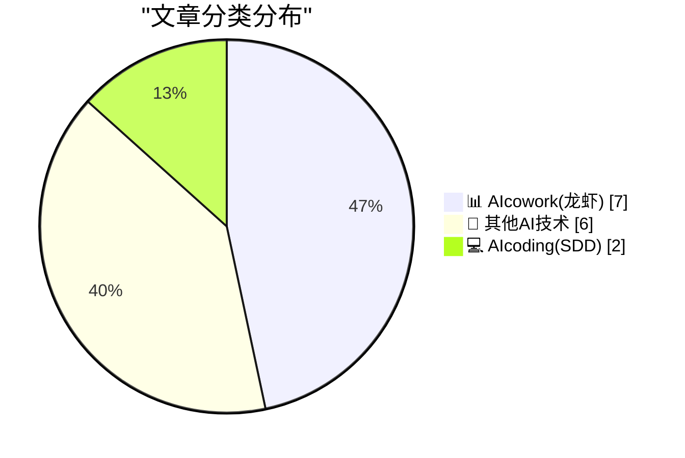
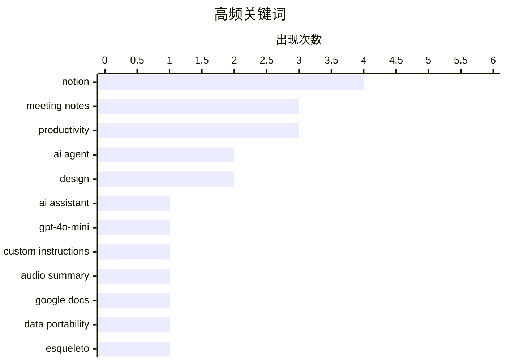

# 📰 AI 博客每日精选 — 2026-03-17

> 来自 98 个技术博客和社交媒体源，AI 精选 Top 15

## 📝 今日看点

今日技术圈聚焦于AI与工作流的深度融合。Notion与Google Workspace竞相升级其AI协作工具，通过自定义指令、音频摘要等功能，致力于打造更个性化、高效的生产力体验。同时，AI驱动生产力提升的案例得到验证，显示出从通用功能向垂直场景深度赋能的明确趋势。

---

## 🏆 今日必读

🥇 **Notion AI 会议笔记新增自定义指令功能**

[New: Custom instructions for AI Meeting Notes 📝 We can't make your meetings shorter. But we can make sure the meeting notes come out exactly the wa...](https://x.com/NotionHQ/status/2034017426040656171) — 𝕏 @NotionHQ · 15 分钟前 · 📊 AIcowork(龙虾)

> Notion AI 会议笔记功能推出了用户呼声最高的自定义指令特性。用户可以为不同类型的会议创建模板化指令，确保生成的笔记格式完全符合个人偏好。该功能支持使用预设模板或自行创建，并能设置为默认选项以实现自动化。这解决了传统 AI 笔记“一刀切”的问题，让笔记产出方式更具个性化。

💡 **为什么值得读**: 该功能直接回应了用户的核心痛点，为需要高度定制化会议记录的专业人士提供了高效的自动化解决方案。

🏷️ Meeting Notes, AI Assistant, Notion

🥈 **Notion 自定义代理模型选择器新增 GPT-5.4 mini**

[Just added GPT-5.4 mini to the Custom Agent model picker. Great for agents with a straightforward job — it’s fast and costs a lot less.](https://x.com/NotionHQ/status/2033979814043132221) — 𝕏 @NotionHQ · 2 小时前 · 📊 AIcowork(龙虾)

> Notion 在其自定义代理（Custom Agent）模型选择器中新增了 OpenAI 的 GPT-5.4 mini 模型。该模型专为执行简单、明确任务的智能体设计，其主要优势在于响应速度快且使用成本显著更低。这为用户在构建自动化工作流时提供了一个在性能与成本间更平衡的模型选项。

💡 **为什么值得读**: 了解最新的高性价比 AI 模型选项，有助于开发者和团队在构建智能体时优化成本与响应速度。

🏷️ GPT-4o-mini, AI Agent, Notion

🥉 **Notion AI 会议笔记发布核心功能：自定义指令**

[RT Zach Tratar: The #1 user request for Notion AI Meeting Notes ships today! 🚢 Your meetings aren’t one-size-fits-all, so why are your notes? You ...](https://x.com/NotionHQ/status/2033937246668366252) — 𝕏 @NotionHQ · 5 小时前 · 📊 AIcowork(龙虾)

> Notion 发布了其 AI 会议笔记功能排名第一的用户需求——自定义指令。该功能允许用户为任何类型的会议创建模板化的指令，而不仅仅是调整格式，从而彻底告别千篇一律的笔记样式。此举旨在让会议笔记能灵活适应销售复盘、团队站会、项目评审等不同场景。

💡 **为什么值得读**: 通过了解该功能的深度定制能力，可以评估其是否能真正替代人工记录，适应复杂的实际会议场景。

🏷️ Meeting Notes, Custom Instructions, Notion

4️⃣ **Google 文档推出音频摘要功能，将报告转化为语音**

[Turn your reports into a quick listen! 🎧 Staying on top of your work doesn’t have to mean working longer hours. Learn how to turn on audio summari...](https://x.com/GoogleWorkspace/status/2033891858040938621) — 𝕏 @GoogleWorkspace · 8 小时前 · 📊 AIcowork(龙虾)

> Google Workspace 为 Google 文档推出了音频摘要（audio summaries）功能。用户可以将冗长的书面报告转换为简短的语音概要，通过“听”而非“读”的方式来快速掌握文档核心内容。该功能旨在帮助用户高效跟进工作，而无需延长工作时间，是信息消费方式的一种创新。

💡 **为什么值得读**: 对于需要快速处理大量文档信息或偏好听觉学习的人群，这是一个提升信息吸收效率的实用工具。

🏷️ Audio Summary, Google Docs, Productivity

5️⃣ **Notion 宣传其 AI 会议笔记作为开放替代方案的优势**

[RT Zach Tratar: For anyone looking for an open Granola alternative: give Notion AI meeting notes a shot! We don’t hold your data hostage. Your agents...](https://x.com/NotionHQ/status/2033710782400368765) — 𝕏 @NotionHQ · 20 小时前 · 📊 AIcowork(龙虾)

> Notion 通过转发高管推文，宣传其 AI 会议笔记是 Granola 等工具的开放替代方案。其核心优势在于不锁定用户数据，允许用户将自己的智能体（甚至包括 Claude Code）接入并使用这些数据。Notion 强调了其对开放生态的信念，并承诺持续改进功能和听取反馈。

💡 **为什么值得读**: 对于关注数据主权和希望将 AI 笔记数据用于其他智能体工作流的用户，这是一个重要的选型参考点。

🏷️ Meeting Notes, AI Agent, Data Portability

---

## 📊 数据概览

| 扫描源 | 抓取文章 | 时间范围 | 精选 |
|:---:|:---:|:---:|:---:|
| 77/98 | 2498 篇 → 20 篇 | 24h | **15 篇** |

### 分类分布



### 高频关键词



<details>
<summary>📈 纯文本关键词图（终端友好）</summary>

```
notion              │ ████████████████████ 4
meeting notes       │ ███████████████░░░░░ 3
productivity        │ ███████████████░░░░░ 3
ai agent            │ ██████████░░░░░░░░░░ 2
design              │ ██████████░░░░░░░░░░ 2
ai assistant        │ █████░░░░░░░░░░░░░░░ 1
gpt-4o-mini         │ █████░░░░░░░░░░░░░░░ 1
custom instructions │ █████░░░░░░░░░░░░░░░ 1
audio summary       │ █████░░░░░░░░░░░░░░░ 1
google docs         │ █████░░░░░░░░░░░░░░░ 1
```

</details>

### 🏷️ 话题标签

**notion**(4) · **meeting notes**(3) · **productivity**(3) · ai agent(2) · design(2) · ai assistant(1) · gpt-4o-mini(1) · custom instructions(1) · audio summary(1) · google docs(1) · data portability(1) · esqueleto(1) · database(1) · tutorial(1) · ui feature(1) · gemini(1) · workspace(1) · x86(1) · stack(1) · low-level(1)

---

====================

## 📊 AIcowork(龙虾)

### 1. Notion AI 会议笔记新增自定义指令功能

[New: Custom instructions for AI Meeting Notes 📝 We can't make your meetings shorter. But we can make sure the meeting notes come out exactly the wa...](https://x.com/NotionHQ/status/2034017426040656171) — **𝕏 @NotionHQ** · 15 分钟前 · ⭐ 22/25

> Notion AI 会议笔记功能推出了用户呼声最高的自定义指令特性。用户可以为不同类型的会议创建模板化指令，确保生成的笔记格式完全符合个人偏好。该功能支持使用预设模板或自行创建，并能设置为默认选项以实现自动化。这解决了传统 AI 笔记“一刀切”的问题，让笔记产出方式更具个性化。

🏷️ Meeting Notes, AI Assistant, Notion

📌 AIcowork(龙虾)

---

### 2. Notion 自定义代理模型选择器新增 GPT-5.4 mini

[Just added GPT-5.4 mini to the Custom Agent model picker. Great for agents with a straightforward job — it’s fast and costs a lot less.](https://x.com/NotionHQ/status/2033979814043132221) — **𝕏 @NotionHQ** · 2 小时前 · ⭐ 22/25

> Notion 在其自定义代理（Custom Agent）模型选择器中新增了 OpenAI 的 GPT-5.4 mini 模型。该模型专为执行简单、明确任务的智能体设计，其主要优势在于响应速度快且使用成本显著更低。这为用户在构建自动化工作流时提供了一个在性能与成本间更平衡的模型选项。

🏷️ GPT-4o-mini, AI Agent, Notion

📌 AIcowork(龙虾)

---

### 3. Notion AI 会议笔记发布核心功能：自定义指令

[RT Zach Tratar: The #1 user request for Notion AI Meeting Notes ships today! 🚢 Your meetings aren’t one-size-fits-all, so why are your notes? You ...](https://x.com/NotionHQ/status/2033937246668366252) — **𝕏 @NotionHQ** · 5 小时前 · ⭐ 22/25

> Notion 发布了其 AI 会议笔记功能排名第一的用户需求——自定义指令。该功能允许用户为任何类型的会议创建模板化的指令，而不仅仅是调整格式，从而彻底告别千篇一律的笔记样式。此举旨在让会议笔记能灵活适应销售复盘、团队站会、项目评审等不同场景。

🏷️ Meeting Notes, Custom Instructions, Notion

📌 AIcowork(龙虾)

---

### 4. Google 文档推出音频摘要功能，将报告转化为语音

[Turn your reports into a quick listen! 🎧 Staying on top of your work doesn’t have to mean working longer hours. Learn how to turn on audio summari...](https://x.com/GoogleWorkspace/status/2033891858040938621) — **𝕏 @GoogleWorkspace** · 8 小时前 · ⭐ 22/25

> Google Workspace 为 Google 文档推出了音频摘要（audio summaries）功能。用户可以将冗长的书面报告转换为简短的语音概要，通过“听”而非“读”的方式来快速掌握文档核心内容。该功能旨在帮助用户高效跟进工作，而无需延长工作时间，是信息消费方式的一种创新。

🏷️ Audio Summary, Google Docs, Productivity

📌 AIcowork(龙虾)

---

### 5. Notion 宣传其 AI 会议笔记作为开放替代方案的优势

[RT Zach Tratar: For anyone looking for an open Granola alternative: give Notion AI meeting notes a shot! We don’t hold your data hostage. Your agents...](https://x.com/NotionHQ/status/2033710782400368765) — **𝕏 @NotionHQ** · 20 小时前 · ⭐ 21/25

> Notion 通过转发高管推文，宣传其 AI 会议笔记是 Granola 等工具的开放替代方案。其核心优势在于不锁定用户数据，允许用户将自己的智能体（甚至包括 Claude Code）接入并使用这些数据。Notion 强调了其对开放生态的信念，并承诺持续改进功能和听取反馈。

🏷️ Meeting Notes, AI Agent, Data Portability

📌 AIcowork(龙虾)

---

### 6. Notion 推出新模块：标签页

[New block: Tabs 🗂️ Sometimes a page has a lot going on. Tabs let you organize it in a new way… no subpages, no mile-long scroll. Type /tabs to tr...](https://x.com/NotionHQ/status/2033967185094447142) — **𝕏 @NotionHQ** · 3 小时前 · ⭐ 20/25

> Notion 新增了“标签页”（Tabs）内容块，用于优化页面内容组织。用户可以在一个页面内通过标签页分类展示不同内容，从而避免创建过多子页面或面对超长的滚动页面。只需输入“/tabs”命令即可使用该功能，旨在提升复杂页面的可读性和导航效率。

🏷️ Notion, Productivity, UI Feature

📌 AIcowork(龙虾)

---

### 7. Dezerv 利用 Google Workspace 与 Gemini 提升生产力超 80%

[🔐 Innovation without compromising trust. @dezervHQ uses Google Workspace with Gemini to automate drafting, summaries and meeting transcripts, boost...](https://x.com/GoogleWorkspace/status/2034012651966132714) — **𝕏 @GoogleWorkspace** · 34 分钟前 · ⭐ 20/25

> 财富管理平台 Dezerv 通过集成 Google Workspace 与 Gemini AI 模型，实现了草稿撰写、内容摘要和会议转录的自动化。这一举措使其团队生产力提升了 80% 以上。案例强调，在实现如此显著效率提升的同时，Dezerv 依然保持了企业级的安全与合规标准，实现了创新与信任的平衡。

🏷️ Gemini, Workspace, Productivity

📌 AIcowork(龙虾)

---

## 🔬 其他AI技术

### 8. 赞助商信息：Mux —— 面向开发者的视频 API

[[Sponsor] Mux — Video API for Developers](https://www.mux.com/?utm_campaign=fireball&amp;utm_source=DF) — **daringfireball.net** · 21 小时前 · ⭐ 14/25

> Mux 是一个视频基础设施平台，提供面向开发者的视频 API。其核心价值在于将视频视为包含上下文和数据的数据源，而不仅仅是播放内容。开发者可以轻松集成视频功能到网站、平台或 AI 工作流中，并利用其 API 提取字幕、生成剪辑和故事板，进而构建摘要、翻译、内容审核、标签等高级功能。Mux 同时维护着最流行的开源网页视频播放器 Video.js，其 v10 版本正在进行架构重构。

🏷️ Video API, AI Workflow, Developer Tool

📌 其他AI技术

---

### 9. 我的家庭实验室将至少宕机20天

[My homelab will be down for at least 20 days](https://xeiaso.net/notes/2026/homelab-is-down/) — **xeiaso.net** · 21 小时前 · ⭐ 11/25

> 作者的家庭实验室因故需要长时间停机维护，预计至少持续20天。这导致其依赖该实验室运行的各项服务和个人项目将暂时中断。作者对此表达了无奈和接受，并提醒读者在此期间相关服务不可用。

🏷️ Homelab, Downtime, Personal

📌 其他AI技术

---

### 10. 福克斯体育将在沉浸式3D转播美委世界棒球经典赛决赛——但Vision Pro不支持

[Fox Sports to Broadcast U.S.-Venezuela World Baseball Classic Final in Immersive 3D — But Not on Vision Pro](https://x.com/mlbonfox/status/2033902946174271992?s=46) — **daringfireball.net** · 2 小时前 · ⭐ 9/25

> 福克斯体育宣布通过其Fox Sports XR应用，为Galaxy XR头显（基于Android XR）提供世界棒球经典赛决赛的沉浸式3D转播体验。然而，其苹果App Store中的应用仅原生支持iOS、Apple TV和Apple Watch设备。这意味着苹果的Vision Pro头显无法通过官方应用观看此次3D转播。

🏷️ XR, Immersive, Broadcast

📌 其他AI技术

---

### 11. 三星在上市仅三个月后便停产Galaxy Z TriFold

[Samsung Discontinues Its Galaxy Z TriFold After Just Three Months](https://www.theverge.com/tech/895879/samsung-galaxy-z-trifold-discontinued-stock-sold-out) — **daringfireball.net** · 7 小时前 · ⭐ 9/25

> 三星计划停产其首款三屏折叠手机Galaxy Z TriFold，此时距该设备在美国上市还不到三个月。这款售价2899美元的手机将首先在韩国停止销售，待美国库存清空后也会在当地停产。此举被外界猜测可能意味着此类过于复杂或昂贵的折叠屏形态市场接受度有限。

🏷️ Foldable, Discontinued, Hardware

📌 其他AI技术

---

### 12. 小Finder图标壁纸

[Lil Finder Guy Wallpapers](https://512pixels.net/2026/03/lil-finder-5k-wallpapers/) — **daringfireball.net** · 7 小时前 · ⭐ 9/25

> PCalc等知名应用的开发者James Thomson创作了一套以经典Mac OS“小Finder”图标为主题的5K分辨率壁纸。这些壁纸由博主Stephen Hackett分享，可供用户免费下载。文章还提到了为3D打印爱好者准备的相关趣味内容。

🏷️ Wallpaper, 3D Printing, Design

📌 其他AI技术

---

### 13. 你或许会争论——如果你能看见它

[You Might Debate It — If You Could See It](https://blog.jim-nielsen.com/2026/opacity-of-generative-tools/) — **blog.jim-nielsen.com** · 2 小时前 · ⭐ 9/25

> 文章探讨了生成式AI设计工具的“不透明性”问题。作者假设了设计团队可能采纳的一套关于字体、动效和背景的详细视觉指南，但指出如果这些指南是由AI生成且过程不透明，团队将无法对其进行有效的讨论和辩论。核心论点是，生成过程的不透明性剥夺了团队对设计决策进行批判性思考和达成共识的基础。

🏷️ Design, Guidelines, Typography

📌 其他AI技术

---

## 💻 AIcoding(SDD)

### 14. Esqueleto 教程

[Esqueleto Tutorial](https://entropicthoughts.com/esqueleto-tutorial) — **entropicthoughts.com** · 22 小时前 · ⭐ 20/25

> 这是一篇关于 Esqueleto 的教程。Esqueleto 是一个 Haskell 的 SQL 嵌入式领域特定语言（EDSL）库，用于构建类型安全、复杂的数据查询。教程通常会涵盖其基本用法、与 Persistent 库的集成、如何编写各种 JOIN 查询以及处理复杂条件。学习 Esqueleto 可以帮助 Haskell 开发者避免 SQL 注入并利用 Haskell 的类型系统保证查询的正确性。

🏷️ Esqueleto, Database, Tutorial

📌 AIcoding(SDD)

---

### 15. Windows 栈限制检查回顾：x86-32 (i386) 的第二次尝试

[Windows stack limit checking retrospective: x86-32 also known as i386, second try](https://devblogs.microsoft.com/oldnewthing/20260317-00/?p=112144) — **devblogs.microsoft.com/oldnewthing** · 7 小时前 · ⭐ 15/25

> 这是《The Old New Thing》博客关于 Windows 操作系统历史技术的深度回顾文章。文章聚焦于 x86-32（即 i386）架构上 Windows 栈限制检查机制的演进与第二次实现尝试。内容涉及底层系统编程、CPU 架构特性（如不可见的返回地址预测器）与操作系统内核设计的交互。这类文章通常包含对历史技术决策、挑战及其解决方案的详细剖析。

🏷️ x86, Stack, Low-level

📌 AIcoding(SDD)

---

====================

*生成于 2026-03-17 21:37 | 扫描 77 源 → 获取 2498 篇 → 精选 15 篇*
*基于 [Hacker News Popularity Contest 2025](https://refactoringenglish.com/tools/hn-popularity/) RSS 源列表，由 [Andrej Karpathy](https://x.com/karpathy) 推荐*
*由「懂点儿AI」制作，欢迎关注同名微信公众号获取更多 AI 实用技巧 💡*
