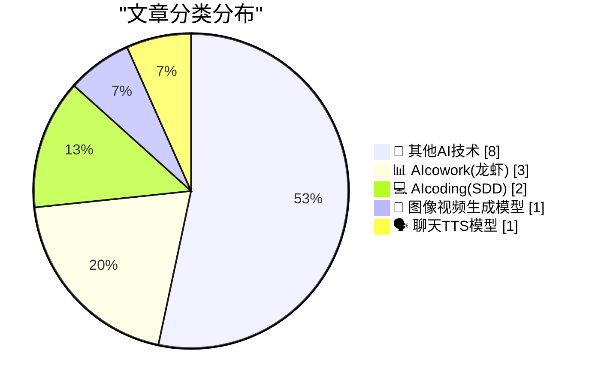
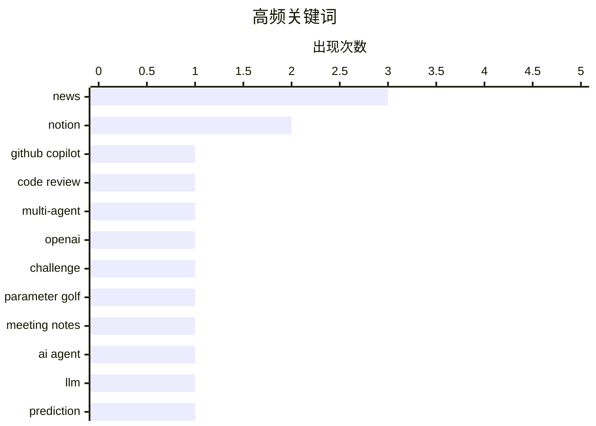

# 📰 AI 博客每日精选 — 2026-03-18

> 来自 98 个技术博客和社交媒体源，AI 精选 Top 15

## 📝 今日看点

今日技术圈聚焦于AI与工作流的深度融合。多模型协作成为提升代码质量的新范式，GitHub等平台正推动AI智能体协同审查。同时，Notion、Google等生产力工具通过深度集成AI，显著提升个性化与效率，标志着“一刀切”软件模式正被灵活智能的解决方案取代。企业级AI应用也从概念验证迈向销售、创意等核心场景的规模化落地。

---

## 🏆 今日必读

🥇 **不同的AI模型能发现不同的Bug，何不全部用上？**

[Different AI models find different bugs. So why not use all of them? Try this out in Copilot CLI: 1. Run /review 2. Ask it to use multiple model provi...](https://x.com/github/status/2034375654829957300) — 𝕏 @GitHub · 27 分钟前 · 💻 AIcoding(SDD)

> GitHub Copilot CLI 引入了多模型代码审查功能，以提升Bug发现能力。用户可通过 `/review` 命令，要求同时调用多个AI模型提供商进行多智能体代码审查。该方案旨在聚合不同模型的优势，获取最高可能的信号，从而在他人之前捕获更多潜在缺陷。这代表了代码审查从单一模型向集成化、多智能体协作的演进。

💡 **为什么值得读**: 该功能展示了如何通过集成多个AI模型来最大化代码审查的覆盖率和准确性，为开发者提供了切实可行的质量提升工具。

🏷️ GitHub Copilot, Code Review, Multi-Agent

🥈 **准备好接受挑战了吗？**

[Are you up for a challenge? http://openai.com/parameter-golf](https://x.com/OpenAI/status/2034315401438580953) — 𝕏 @OpenAI · 4 小时前 · 🔬 其他AI技术

> OpenAI发起了一项名为“参数高尔夫”的挑战。具体挑战内容和目标未在推文中详细说明，但通常此类活动旨在鼓励社区以创新或高效的方式使用其模型。参与者需访问 openai.com/parameter-golf 页面以了解详情并参与。这可能是OpenAI与社区互动、激发创意应用的一种方式。

💡 **为什么值得读**: 参与OpenAI官方挑战是了解其最新动态、测试技术能力并与AI社区互动的绝佳机会。

🏷️ OpenAI, Challenge, Parameter Golf

🥉 **Notion会议笔记功能迎来重大升级：自定义指令上线**

[RT Matthias 🔥: meeting notes in Notion just got a lot better 😍 custom instructions are here — and they're not just instructions. Previously, yo...](https://x.com/NotionHQ/status/2034301462973665590) — 𝕏 @NotionHQ · 10 小时前 · 📊 AIcowork(龙虾)

> Notion的会议笔记功能新增了可复用的自定义指令，取代了此前有限的预设类型。用户现在可以为销售电话、全员大会、反馈会等不同场景创建专属的指令集，从而精准控制笔记的输出格式和内容。这解决了以往需要额外叠加智能体来处理转录稿的痛点，实现了更高效的会议信息结构化。

💡 **为什么值得读**: 此更新极大地提升了Notion会议笔记的灵活性和实用性，让用户能真正定制化地捕获和管理不同类型的会议信息。

🏷️ Notion, Meeting Notes, AI Agent

4️⃣ **LLMs预测我的咖啡**

[LLMs predict my coffee](https://dynomight.net/coffee/) — dynomight.net · 21 小时前 · 🔬 其他AI技术

> 文章探讨了使用大型语言模型来预测个人日常行为（以煮咖啡为例）的可能性与局限性。作者通过实验测试LLMs能否根据其过往的推特历史，准确预测其每天是否会煮咖啡。实验可能涉及提示工程、上下文长度以及模型对时序和个人模式的理解能力。结论可能揭示了LLMs在个性化预测任务中的潜力与当前面临的挑战。

💡 **为什么值得读**: 这篇文章通过一个具体而有趣的实验，生动地检验了LLMs在理解个人习惯和进行微观预测方面的实际能力。

🏷️ LLM, Prediction, Experiment

5️⃣ **Midjourney每周办公时间 - 3月18日**

[Midjourney Weekly Office Hours - 3/18 https://x.com/i/spaces/1lJQRvlVeYvxE](https://x.com/midjourney/status/2034345913297375302) — 𝕏 @midjourney · 2 小时前 · 🎨 图像视频生成模型

> 这是一条关于Midjourney每周例行办公时间活动的预告推文。该活动于3月18日举行，通常在Twitter Spaces上进行。此类办公时间通常用于团队与社区交流，分享更新、演示新功能或回答用户问题。参与是了解Midjourney最新动态和直接与团队互动的渠道。

💡 **为什么值得读**: 对于Midjourney的深度用户和AI绘画爱好者来说，这是获取第一手信息、学习技巧和了解产品路线图的直接途径。

🏷️ Midjourney, Image Generation, Office Hours

---

## 📊 数据概览

| 扫描源 | 抓取文章 | 时间范围 | 精选 |
|:---:|:---:|:---:|:---:|
| 76/98 | 2400 篇 → 22 篇 | 24h | **15 篇** |

### 分类分布



### 高频关键词



<details>
<summary>📈 纯文本关键词图（终端友好）</summary>

```
news           │ ████████████████████ 3
notion         │ █████████████░░░░░░░ 2
github copilot │ ███████░░░░░░░░░░░░░ 1
code review    │ ███████░░░░░░░░░░░░░ 1
multi-agent    │ ███████░░░░░░░░░░░░░ 1
openai         │ ███████░░░░░░░░░░░░░ 1
challenge      │ ███████░░░░░░░░░░░░░ 1
parameter golf │ ███████░░░░░░░░░░░░░ 1
meeting notes  │ ███████░░░░░░░░░░░░░ 1
ai agent       │ ███████░░░░░░░░░░░░░ 1
```

</details>

### 🏷️ 话题标签

**news**(3) · **notion**(2) · **github copilot**(1) · code review(1) · multi-agent(1) · openai(1) · challenge(1) · parameter golf(1) · meeting notes(1) · ai agent(1) · llm(1) · prediction(1) · experiment(1) · midjourney(1) · image generation(1) · office hours(1) · github(1) · podcast(1) · open source(1) · gemini(1)

---

====================

## 🔬 其他AI技术

### 1. 准备好接受挑战了吗？

[Are you up for a challenge? http://openai.com/parameter-golf](https://x.com/OpenAI/status/2034315401438580953) — **𝕏 @OpenAI** · 4 小时前 · ⭐ 20/25

> OpenAI发起了一项名为“参数高尔夫”的挑战。具体挑战内容和目标未在推文中详细说明，但通常此类活动旨在鼓励社区以创新或高效的方式使用其模型。参与者需访问 openai.com/parameter-golf 页面以了解详情并参与。这可能是OpenAI与社区互动、激发创意应用的一种方式。

🏷️ OpenAI, Challenge, Parameter Golf

📌 其他AI技术

---

### 2. LLMs预测我的咖啡

[LLMs predict my coffee](https://dynomight.net/coffee/) — **dynomight.net** · 21 小时前 · ⭐ 17/25

> 文章探讨了使用大型语言模型来预测个人日常行为（以煮咖啡为例）的可能性与局限性。作者通过实验测试LLMs能否根据其过往的推特历史，准确预测其每天是否会煮咖啡。实验可能涉及提示工程、上下文长度以及模型对时序和个人模式的理解能力。结论可能揭示了LLMs在个性化预测任务中的潜力与当前面临的挑战。

🏷️ LLM, Prediction, Experiment

📌 其他AI技术

---

### 3. 直播：见证Agentforce Sales的最新进展

[RT Salesforce: 🔴LIVE: See the latest from Agentforce Sales. • Pipeline Generation • Deal Acceleration • Revenue Optimization Watch how agents wo...](https://x.com/SlackHQ/status/2034299470242779396) — **𝕏 @SlackHQ** · 5 小时前 · ⭐ 8/25

> Salesforce正在直播展示其Agentforce Sales的最新功能。直播内容涵盖管道生成、交易加速和收入优化三大销售核心环节。演示将展示智能体如何在整个销售周期中协同工作，以帮助企业扩展收入。这体现了AI智能体在Salesforce CRM生态中驱动销售自动化的应用前景。

🏷️ Salesforce, Agentforce, Sales AI

📌 其他AI技术

---

### 4. 如何按国家或地区识别您的 Apple 键盘布局

[How to Identify Your Apple Keyboard Layout by Country or Region](https://support.apple.com/en-us/102743) — **daringfireball.net** · 4 分钟前 · ⭐ 5/25

> 该支持页面提供了识别不同国家或地区 Apple 键盘布局的方法。文章指出，苹果近期对其美国键盘的键帽标签进行了更改，这引发了用户对键盘布局标识的关注。页面旨在帮助用户通过物理按键特征或系统设置来准确判断自己键盘所对应的区域版本。核心内容是提供了一份实用的识别指南。

🏷️ Hardware, Guide

📌 其他AI技术

---

### 5. Jony Ive 谈重新设计佳士得拍卖台

[Jony Ive on Redesigning the Christie’s Rostrum](https://www.youtube.com/watch?v=HLXDxx06_EM) — **daringfireball.net** · 7 分钟前 · ⭐ 5/25

> 文章聚焦于 Jony Ive 及其设计公司 LoveFrom 为佳士得拍卖行设计的全新拍卖台。Ive 在视频中阐述了其设计理念，旨在创造一件兼具功能性与美感的家具。这个项目体现了高端品牌对极致设计细节的追求，最终成果被形容为一件“精美的家具”。

🏷️ Design, News

📌 其他AI技术

---

### 6. Meta 将在《Horizon Worlds》中取消 VR 支持

[Meta Is Dropping VR Support From Horizon Worlds](https://www.uploadvr.com/meta-horizon-worlds-dropping-vr-support/) — **daringfireball.net** · 2 小时前 · ⭐ 5/25

> Meta 宣布其社交平台《Horizon Worlds》将放弃 VR 支持，转向纯平面屏幕体验。具体时间线是：3月31日下架 Quest 商店应用，并关闭 Horizon Central 等关键第一方VR世界；6月15日将彻底从 Quest 头显中移除该应用，所有世界将无法在VR中访问。此举意味着该平台将仅作为网页和手机端的“平面”应用存在。这标志着 Meta 对其元宇宙核心产品战略的一次重大调整。

🏷️ VR, Meta, News

📌 其他AI技术

---

### 7. 若收购派拉蒙达成，华纳兄弟探索 CEO 大卫·扎斯拉夫将获高达 8.87 亿美元

[David Zaslav Set to Receive Up to $887 Million if Paramount Acquisition of Warner Bros Closes](https://finance.yahoo.com/news/warner-bros-discovery-ceo-david-zaslav-set-to-receive-up-to-887-million-if-paramount-deal-closes-144501826.html) — **daringfireball.net** · 3 小时前 · ⭐ 5/25

> 报道揭示了华纳兄弟探索公司 CEO 大卫·扎斯拉夫在潜在的公司收购案中可能获得的巨额收益。如果派拉蒙收购华纳兄弟的交易完成，扎斯拉夫将获得包括 5.172 亿美元股权、约 3420 万美元现金、4420 万美元福利以及约 3.354 亿美元税务报销在内的总计近 8.87 亿美元报酬。这笔交易本身于二月底达成，收购价为每股31美元。这凸显了大型企业并购中高管薪酬安排的惊人规模。

🏷️ Business, Acquisition, News

📌 其他AI技术

---

### 8. ★ 压扁

[★ Squashing](https://daringfireball.net/2026/03/squashing) — **daringfireball.net** · 21 小时前 · ⭐ 5/25

> 文章严厉批评了 CNBC 的一篇报道。作者直指该报道的标题是“新闻失职”，并认为报道的其余部分甚至更糟糕。核心是对特定媒体报道的专业性和准确性提出强烈质疑。

🏷️ Media, Critique

📌 其他AI技术

---

## 📊 AIcowork(龙虾)

### 9. Notion会议笔记功能迎来重大升级：自定义指令上线

[RT Matthias 🔥: meeting notes in Notion just got a lot better 😍 custom instructions are here — and they're not just instructions. Previously, yo...](https://x.com/NotionHQ/status/2034301462973665590) — **𝕏 @NotionHQ** · 10 小时前 · ⭐ 20/25

> Notion的会议笔记功能新增了可复用的自定义指令，取代了此前有限的预设类型。用户现在可以为销售电话、全员大会、反馈会等不同场景创建专属的指令集，从而精准控制笔记的输出格式和内容。这解决了以往需要额外叠加智能体来处理转录稿的痛点，实现了更高效的会议信息结构化。

🏷️ Notion, Meeting Notes, AI Agent

📌 AIcowork(龙虾)

---

### 10. 采用AI的组织在创造力和专注力上实现2倍提升

[Organizations that adopt AI see 2× boost in creativity and focus. Our new guide, Introduction to Gemini at Work, shares practical tips to help teams ...](https://x.com/GoogleWorkspace/status/2034322696348041414) — **𝕏 @GoogleWorkspace** · 3 小时前 · ⭐ 11/25

> Google Workspace引用数据称，采用AI的组织在创造力和专注力方面实现了2倍的提升。为此，Google发布了新指南《工作场景中的Gemini入门》，旨在帮助团队开始在日常工作中使用Gemini。该指南提供了实用的技巧和步骤，以促进AI在办公场景中的落地和应用。

🏷️ Gemini, AI Guide, Workplace AI

📌 AIcowork(龙虾)

---

### 11. 标题4终于来了 😤

[Heading 4 is finally here 😤 The years of “just bold the text and pretend” are over. Rolling out now.](https://x.com/NotionHQ/status/2034319575345774830) — **𝕏 @NotionHQ** · 4 小时前 · ⭐ 9/25

> Notion正式推出了用户期待已久的“标题4”格式。此举结束了用户长期以来只能通过加粗文本（“just bold the text and pretend”）来模拟四级标题的变通做法。新功能正在逐步向所有用户推送，完善了Notion文档的层级结构体系。

🏷️ Notion, Product Update, Heading

📌 AIcowork(龙虾)

---

## 💻 AIcoding(SDD)

### 12. 不同的AI模型能发现不同的Bug，何不全部用上？

[Different AI models find different bugs. So why not use all of them? Try this out in Copilot CLI: 1. Run /review 2. Ask it to use multiple model provi...](https://x.com/github/status/2034375654829957300) — **𝕏 @GitHub** · 27 分钟前 · ⭐ 21/25

> GitHub Copilot CLI 引入了多模型代码审查功能，以提升Bug发现能力。用户可通过 `/review` 命令，要求同时调用多个AI模型提供商进行多智能体代码审查。该方案旨在聚合不同模型的优势，获取最高可能的信号，从而在他人之前捕获更多潜在缺陷。这代表了代码审查从单一模型向集成化、多智能体协作的演进。

🏷️ GitHub Copilot, Code Review, Multi-Agent

📌 AIcoding(SDD)

---

### 13. “一刀切”的软件模式消亡了吗？

[Is the "one size fits all" software model dead? In this episode of the GitHub Podcast, Cassidy and Kedasha explore the rise of personal software tools...](https://x.com/github/status/2034272507549594012) — **𝕏 @GitHub** · 7 小时前 · ⭐ 11/25

> GitHub播客探讨了“一刀切”通用软件模式是否正在被取代，以及个人化软件工具的兴起。本期节目由Cassidy和Kedasha主持，重点关注开发者为自己构建、并通过开源分享给世界的个人软件工具。这反映了DIY开发文化的增长，以及工具开发从大型通用产品向个性化、场景化解决方案的转变。

🏷️ GitHub, Podcast, Open Source

📌 AIcoding(SDD)

---

## 🎨 图像视频生成模型

### 14. Midjourney每周办公时间 - 3月18日

[Midjourney Weekly Office Hours - 3/18 https://x.com/i/spaces/1lJQRvlVeYvxE](https://x.com/midjourney/status/2034345913297375302) — **𝕏 @midjourney** · 2 小时前 · ⭐ 12/25

> 这是一条关于Midjourney每周例行办公时间活动的预告推文。该活动于3月18日举行，通常在Twitter Spaces上进行。此类办公时间通常用于团队与社区交流，分享更新、演示新功能或回答用户问题。参与是了解Midjourney最新动态和直接与团队互动的渠道。

🏷️ Midjourney, Image Generation, Office Hours

📌 图像视频生成模型

---

## 🗣️ 聊天TTS模型

### 15. ElevenLabs峰会即将登陆华沙标志性场馆

[RT Mati Staniszewski: The ElevenLabs Summit is coming to Warsaw - and to one of the most iconic venues in the country.](https://x.com/ElevenLabs/status/2034325150619857091) — **𝕏 @ElevenLabs** · 4 小时前 · ⭐ 8/25

> ElevenLabs宣布其峰会将在波兰华沙举行，并选址于该国最具标志性的场馆之一。这标志着ElevenLabs（一家领先的AI语音技术公司）正在扩大其全球社区活动和影响力。峰会通常是发布新产品、分享技术见解和进行行业交流的重要场合。

🏷️ ElevenLabs, TTS, Summit

📌 聊天TTS模型

---

====================

*生成于 2026-03-18 21:33 | 扫描 76 源 → 获取 2400 篇 → 精选 15 篇*
*基于 [Hacker News Popularity Contest 2025](https://refactoringenglish.com/tools/hn-popularity/) RSS 源列表，由 [Andrej Karpathy](https://x.com/karpathy) 推荐*
*由「懂点儿AI」制作，欢迎关注同名微信公众号获取更多 AI 实用技巧 💡*
