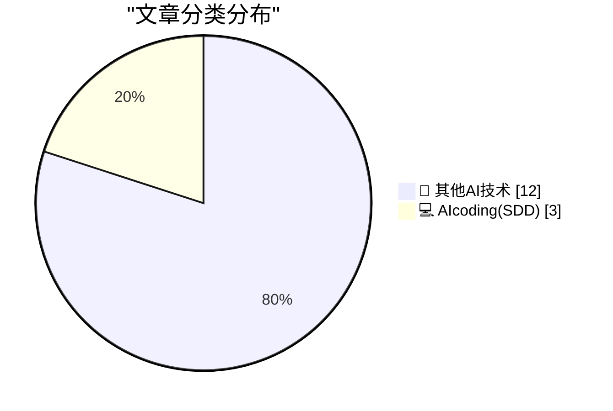
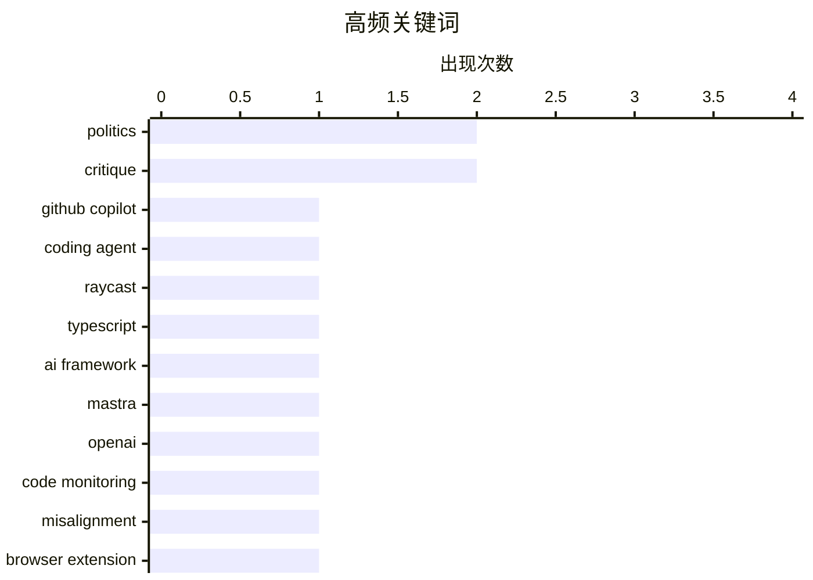

# 📰 AI 博客每日精选 — 2026-03-19

> 来自 98 个技术博客和社交媒体源，AI 精选 Top 15

## 📝 今日看点

今日技术圈聚焦于AI深度融入开发流程与网络生态的治理反思。一方面，AI编码助手正通过更无缝的集成和更易用的框架，持续渗透并重塑开发者工作流；另一方面，从巨头内部代码安全监控到浏览器脚本功能的争议，技术社区对AI与软件行为的可控性及网络体验的优化表现出高度关切。

---

## 🏆 今日必读

🥇 **Raycast 用户：您知道吗？了解 Copilot 编码助手能为您做什么**

[.@Raycast users: Did you know? 💡 Learn more about what Copilot coding agent can do for you. ⬇️ https://github.blog/changelog/2025-08-28-start-and...](https://x.com/github/status/2034656259987628377) — 𝕏 @GitHub · 5 小时前 · 💻 AIcoding(SDD)

> GitHub Copilot 编码助手现已深度集成至 Raycast 启动器。用户可以直接在 Raycast 中启动并跟踪 Copilot 的编码任务，无需切换应用上下文。该集成旨在提升开发者工作流的流畅度，将 AI 辅助编程无缝嵌入日常操作。这标志着 AI 开发工具正从独立应用向工作流核心组件演进。

💡 **为什么值得读**: 对于同时使用 Raycast 和 Copilot 的效率型开发者，此集成能显著减少上下文切换，是优化 AI 辅助编程工作流的实用指南。

🏷️ GitHub Copilot, coding agent, Raycast

🥈 **使用 TypeScript 构建 AI 应用变得更简单了**

[Building AI apps in TypeScript just got easier. ⚡️ Tomorrow on Open Source Friday, learn all about @mastra, a TypeScript-first framework for buildin...](https://x.com/github/status/2034707741432791052) — 𝕏 @GitHub · 2 小时前 · 💻 AIcoding(SDD)

> GitHub 将介绍 Mastra，一个 TypeScript 优先的 AI 应用开发框架。该框架旨在简化基于 TypeScript 的 AI 应用构建流程。其 CTO 将在“开源星期五”活动中进行详细讲解。这表明 TypeScript 生态在 AI 工程化领域正获得更多专用工具支持。

💡 **为什么值得读**: 适合希望利用 TypeScript 技术栈快速构建生产级 AI 应用的开发者，提供了一个新的框架选型参考。

🏷️ TypeScript, AI framework, Mastra

🥉 **OpenAI 利用其最强模型监控 99.9% 的内部编码流量以防止错位**

[RT Marcus Williams: Sharing some of the work I’ve been doing at OpenAI: we now monitor 99.9% of internal coding traffic for misalignment using our mo...](https://x.com/OpenAI/status/2034688206504075570) — 𝕏 @OpenAI · 4 小时前 · 💻 AIcoding(SDD)

> OpenAI 内部已部署其最强大的模型来监控代码安全。该监控系统覆盖了 99.9% 的内部编码流量，通过审查完整行为轨迹来捕捉可疑行为。系统能快速升级严重案例，并持续强化安全防护措施。这体现了 AI 公司利用 AI 进行自我监管和内部风险控制的前沿实践。

💡 **为什么值得读**: 揭示了 AI 巨头如何将尖端技术反用于自身安全治理，对关注 AI 安全与对齐实践的技术人员具有重要参考价值。

🏷️ OpenAI, code monitoring, misalignment

4️⃣ **Safari 扩展 StopTheMadness Pro 与 StopTheScript**

[StopTheMadness Pro and StopTheScript Extensions for Safari](https://mastodon.social/@lapcatsoftware/116252960395480568) — daringfireball.net · 25 分钟前 · 🔬 其他AI技术

> StopTheMadness Pro 是一款 Safari 浏览器扩展，能阻止视频自动播放、隐藏“使用 Google 登录”按钮及网站通知请求。另一款扩展 StopTheScript 则允许用户选择性彻底禁用特定网站的 JavaScript。作者以《卫报》网站为例，说明禁用 JavaScript 可极大改善阅读体验。这些工具旨在将浏览控制权交还给用户，对抗干扰性网页设计。

💡 **为什么值得读**: 为受困于现代网页过度脚本、自动播放和弹窗干扰的用户提供了具体、有效的解决方案。

🏷️ Browser Extension, Safari

5️⃣ **《纽约时报》实际标题：‘特朗普在与日本领导人会面时拿珍珠港事件开玩笑’**

[Actual Headline in the Actual New York Times: ‘Trump Jokes About Pearl Harbor in Meeting With Japan’s Leader’](https://www.nytimes.com/2026/03/19/us/politics/trump-japan-pearl-harbor-oval-office-takaichi.html?unlocked_article_code=1.UVA.zau0.UZ5WnBjtPHot) — daringfireball.net · 33 分钟前 · 🔬 其他AI技术

> 一篇来自《纽约时报》的报道记录了特朗普总统的一段争议性言论。在被问及为何未提前通知日本等盟友关于美以袭击伊朗的行动时，特朗普反问“为什么你们不告诉我珍珠港事件？”。该言论引发了在场官员和记者的一些笑声。报道呈现了外交场合中一次非常规的、涉及历史伤痛的对话。

💡 **为什么值得读**: 提供了关于国际关系与政治言论的一手新闻片段，有助于理解特定政治语境下的沟通风格。

🏷️ Politics, News

---

## 📊 数据概览

| 扫描源 | 抓取文章 | 时间范围 | 精选 |
|:---:|:---:|:---:|:---:|
| 75/98 | 2377 篇 → 22 篇 | 24h | **15 篇** |

### 分类分布



### 高频关键词



<details>
<summary>📈 纯文本关键词图（终端友好）</summary>

```
politics        │ ████████████████████ 2
critique        │ ████████████████████ 2
github copilot  │ ██████████░░░░░░░░░░ 1
coding agent    │ ██████████░░░░░░░░░░ 1
raycast         │ ██████████░░░░░░░░░░ 1
typescript      │ ██████████░░░░░░░░░░ 1
ai framework    │ ██████████░░░░░░░░░░ 1
mastra          │ ██████████░░░░░░░░░░ 1
openai          │ ██████████░░░░░░░░░░ 1
code monitoring │ ██████████░░░░░░░░░░ 1
```

</details>

### 🏷️ 话题标签

**politics**(2) · **critique**(2) · **github copilot**(1) · coding agent(1) · raycast(1) · typescript(1) · ai framework(1) · mastra(1) · openai(1) · code monitoring(1) · misalignment(1) · browser extension(1) · safari(1) · news(1) · commentary(1) · typography(1) · design(1) · android(1) · sideloading(1) · web development(1)

---

====================

## 🔬 其他AI技术

### 1. Safari 扩展 StopTheMadness Pro 与 StopTheScript

[StopTheMadness Pro and StopTheScript Extensions for Safari](https://mastodon.social/@lapcatsoftware/116252960395480568) — **daringfireball.net** · 25 分钟前 · ⭐ 5/25

> StopTheMadness Pro 是一款 Safari 浏览器扩展，能阻止视频自动播放、隐藏“使用 Google 登录”按钮及网站通知请求。另一款扩展 StopTheScript 则允许用户选择性彻底禁用特定网站的 JavaScript。作者以《卫报》网站为例，说明禁用 JavaScript 可极大改善阅读体验。这些工具旨在将浏览控制权交还给用户，对抗干扰性网页设计。

🏷️ Browser Extension, Safari

📌 其他AI技术

---

### 2. 《纽约时报》实际标题：‘特朗普在与日本领导人会面时拿珍珠港事件开玩笑’

[Actual Headline in the Actual New York Times: ‘Trump Jokes About Pearl Harbor in Meeting With Japan’s Leader’](https://www.nytimes.com/2026/03/19/us/politics/trump-japan-pearl-harbor-oval-office-takaichi.html?unlocked_article_code=1.UVA.zau0.UZ5WnBjtPHot) — **daringfireball.net** · 33 分钟前 · ⭐ 5/25

> 一篇来自《纽约时报》的报道记录了特朗普总统的一段争议性言论。在被问及为何未提前通知日本等盟友关于美以袭击伊朗的行动时，特朗普反问“为什么你们不告诉我珍珠港事件？”。该言论引发了在场官员和记者的一些笑声。报道呈现了外交场合中一次非常规的、涉及历史伤痛的对话。

🏷️ Politics, News

📌 其他AI技术

---

### 3. ‘除了特朗普，所有人都明白他做了什么’

[‘Everyone but Trump Understands What He’s Done’](https://www.theatlantic.com/ideas/2026/03/trump-iran-war-allies/686423/?gift=aQyUJR7AIw1mJWdQ6Ed6yGfvOucd9Oa8W54yMDTtr2I) — **daringfireball.net** · 1 小时前 · ⭐ 5/25

> 《大西洋月刊》文章分析了特朗普总统的外交行为对其盟友信任造成的长期损害。文章指出，特朗普在过去14个月中对欧洲盟友加征关税、嘲笑其安全关切并多次进行侮辱。作者引用其曾对欧洲官员称“如果欧洲受到攻击，我们绝不会来帮助你们”等言论。核心论点是特朗普的行为系统地破坏了美国与关键盟友之间的信任关系。

🏷️ Politics, Commentary

📌 其他AI技术

---

### 4. Mark Simonson 发现字体设计的那一天

[The Day Mark Simonson Discovered Type Design](https://www.marksimonson.com/notebook/view/the-day-i-discovered-type-design/) — **daringfireball.net** · 2 小时前 · ⭐ 5/25

> 著名字体设计师 Mark Simonson 回忆了其职业生涯的起点。他在学校的图形教室偶然发现了一本由传奇设计师 Herb Lubalin 编辑的 ITC 公司刊物《U&lc》。该杂志精美的排版和设计深深震撼了他，为他这位 aspiring typophile 提供了丰富的养料。正是这一刻，他下定决心未来要从事字体设计工作。

🏷️ Typography, Design

📌 其他AI技术

---

### 5. 谷歌针对 Android 侧载的新限制包括 24 小时等待期

[Google’s New Sideloading Restrictions for Android Include a 24-Hour Waiting Period](https://www.androidauthority.com/google-android-sideloading-unverified-apps-new-rules-3650343/) — **daringfireball.net** · 2 小时前 · ⭐ 5/25

> 谷歌正式公布了 Android 侧载未经验证应用的新规则，其流程将变得极具摩擦性。新规生效后，从非 Play Store 的开发者处安装应用将面临多重警告和障碍。最关键的限制之一是首次安装来自某开发者的应用时，可能会强制实施长达 24 小时的等待期。此举旨在大幅提高侧载的安全门槛，引导用户回归官方商店。

🏷️ Android, Sideloading

📌 其他AI技术

---

### 6. 关于 Shubham Bose ‘49MB 网页’ 的 Hacker News 讨论

[Hacker News Discussion on Shubham Bose’s ‘The 49MB Web Page’](https://news.ycombinator.com/item?id=47390945) — **daringfireball.net** · 4 小时前 · ⭐ 5/25

> 讨论引出了一个长期存在的争议性观点：浏览器支持 JavaScript 是一个可怕的错误。该观点认为，脚本支持将网页从文档变成了嵌入式计算机程序。正是脚本导致了 49MB 巨型网页、监控追踪产业综合体的出现。如果没有 JavaScript，网页将保持其轻量、以文档为核心的初衷。这引发了关于 Web 技术本质与异化的根本性思考。

🏷️ Web Development, JavaScript

📌 其他AI技术

---

### 7. AppleScript: ‘将 MarsEdit 文档保存为文本文件’

[★ AppleScript: ‘Save MarsEdit Document to Text File’](https://daringfireball.net/2026/03/applescript_save_marsedit_document_to_text_file) — **daringfireball.net** · 4 小时前 · ⭐ 5/25

> 作者分享了一个自用的 AppleScript 脚本，用于解决其工作流中的一个具体痛点。该脚本的功能是将 MarsEdit（一款博客编辑软件）中的文档保存为文本文件。作者感慨自己未能更早地编写并分享这个脚本。这体现了通过自动化小工具主动优化个人工作流程的极客精神。

🏷️ AppleScript, Automation

📌 其他AI技术

---

### 8. The Talk Show 播客：'The Pogue Feature'

[The Talk Show: ‘The Pogue Feature’](https://daringfireball.net/thetalkshow/2026/03/18/ep-443) — **daringfireball.net** · 21 小时前 · ⭐ 5/25

> 本期播客特邀嘉宾大卫·波格讨论其新书《Apple: The First 50 Years》。该书全面回顾了苹果公司过去50年的发展历程，内容详实且视角独特。波格作为资深科技记者，在节目中分享了撰写过程中的见解与轶事。该书旨在为读者提供一个理解苹果公司历史与文化的权威框架。

🏷️ Podcast, Apple

📌 其他AI技术

---

### 9. ★ ‘你的挫败感就是产品’

[★ ‘Your Frustration Is the Product’](https://daringfireball.net/2026/03/your_frustration_is_the_product) — **daringfireball.net** · 21 小时前 · ⭐ 5/25

> 文章尖锐批评了当前许多网站故意设计糟糕用户体验的现象。作者将决策者比作“试图撞上冰山的邮轮船长”，指出其通过制造用户挫败感（如强制登录、复杂流程）来达成商业目标。这种将用户挫败感产品化的策略，本质上是将短期商业利益置于长期用户信任之上。其核心观点是，这种反模式设计最终会损害产品与品牌的可持续发展。

🏷️ User Experience, Critique

📌 其他AI技术

---

### 10. Pluralistic：对企业废话的喜爱与糟糕的判断力相关

[Pluralistic: Love of corporate bullshit is correlated with bad judgment (19 Mar 2026)](https://pluralistic.net/2026/03/19/jargon-watch/) — **pluralistic.net** · 8 小时前 · ⭐ 5/25

> 文章探讨了企业环境中滥用行话（如“协同”、“战略拐点”）的现象及其危害。作者引用研究指出，过度使用或欣赏这类“企业废话”与个人糟糕的判断力和决策质量存在相关性。这些空洞的语言掩盖了真实问题，阻碍有效沟通，并可能成为不良决策的烟雾弹。结论是，清晰、具体的语言是良好判断和有效协作的基础。

🏷️ Corporate Culture, Critique

📌 其他AI技术

---

### 11. Windows栈限制检查回顾：amd64，亦称 x86-64

[Windows stack limit checking retrospective: amd64, also known as x86-64](https://devblogs.microsoft.com/oldnewthing/20260319-00/?p=112152) — **devblogs.microsoft.com/oldnewthing** · 7 小时前 · ⭐ 5/25

> 这是《Windows栈限制检查回顾》系列文章的现代篇，聚焦于amd64（x86-64）架构。文章详细解释了64位Windows系统如何管理与检查线程栈的边界，以防止栈溢出。与之前的x86架构相比，amd64架构在硬件和操作系统层面引入了不同的机制和策略来处理此问题。本文最终完成了从历史到现代的技术演进全景回顾。

🏷️ x86-64, stack, Windows

📌 其他AI技术

---

### 12. 共识算法棋盘游戏

[Consensus Board Game](https://matklad.github.io/2026/03/19/consensus-board-game.html) — **matklad.github.io** · 21 小时前 · ⭐ 5/25

> 作者基于早期理解Paxos等分布式共识算法的痛苦经历，创作了一套可视化的“共识棋盘游戏”教学工具。文章通过一系列精心绘制的示意图，直观解释了提案、投票、承诺等核心概念及其交互过程。这些图示可作为经典教材《Notes on Paxos》的补充，或将原文视为本图示的正式叙述版本。该方法旨在降低理解分布式共识算法核心思想的认知门槛。

🏷️ consensus, distributed systems, explanation

📌 其他AI技术

---

## 💻 AIcoding(SDD)

### 13. Raycast 用户：您知道吗？了解 Copilot 编码助手能为您做什么

[.@Raycast users: Did you know? 💡 Learn more about what Copilot coding agent can do for you. ⬇️ https://github.blog/changelog/2025-08-28-start-and...](https://x.com/github/status/2034656259987628377) — **𝕏 @GitHub** · 5 小时前 · ⭐ 21/25

> GitHub Copilot 编码助手现已深度集成至 Raycast 启动器。用户可以直接在 Raycast 中启动并跟踪 Copilot 的编码任务，无需切换应用上下文。该集成旨在提升开发者工作流的流畅度，将 AI 辅助编程无缝嵌入日常操作。这标志着 AI 开发工具正从独立应用向工作流核心组件演进。

🏷️ GitHub Copilot, coding agent, Raycast

📌 AIcoding(SDD)

---

### 14. 使用 TypeScript 构建 AI 应用变得更简单了

[Building AI apps in TypeScript just got easier. ⚡️ Tomorrow on Open Source Friday, learn all about @mastra, a TypeScript-first framework for buildin...](https://x.com/github/status/2034707741432791052) — **𝕏 @GitHub** · 2 小时前 · ⭐ 20/25

> GitHub 将介绍 Mastra，一个 TypeScript 优先的 AI 应用开发框架。该框架旨在简化基于 TypeScript 的 AI 应用构建流程。其 CTO 将在“开源星期五”活动中进行详细讲解。这表明 TypeScript 生态在 AI 工程化领域正获得更多专用工具支持。

🏷️ TypeScript, AI framework, Mastra

📌 AIcoding(SDD)

---

### 15. OpenAI 利用其最强模型监控 99.9% 的内部编码流量以防止错位

[RT Marcus Williams: Sharing some of the work I’ve been doing at OpenAI: we now monitor 99.9% of internal coding traffic for misalignment using our mo...](https://x.com/OpenAI/status/2034688206504075570) — **𝕏 @OpenAI** · 4 小时前 · ⭐ 15/25

> OpenAI 内部已部署其最强大的模型来监控代码安全。该监控系统覆盖了 99.9% 的内部编码流量，通过审查完整行为轨迹来捕捉可疑行为。系统能快速升级严重案例，并持续强化安全防护措施。这体现了 AI 公司利用 AI 进行自我监管和内部风险控制的前沿实践。

🏷️ OpenAI, code monitoring, misalignment

📌 AIcoding(SDD)

---

====================

*生成于 2026-03-19 21:35 | 扫描 75 源 → 获取 2377 篇 → 精选 15 篇*
*基于 [Hacker News Popularity Contest 2025](https://refactoringenglish.com/tools/hn-popularity/) RSS 源列表，由 [Andrej Karpathy](https://x.com/karpathy) 推荐*
*由「懂点儿AI」制作，欢迎关注同名微信公众号获取更多 AI 实用技巧 💡*
