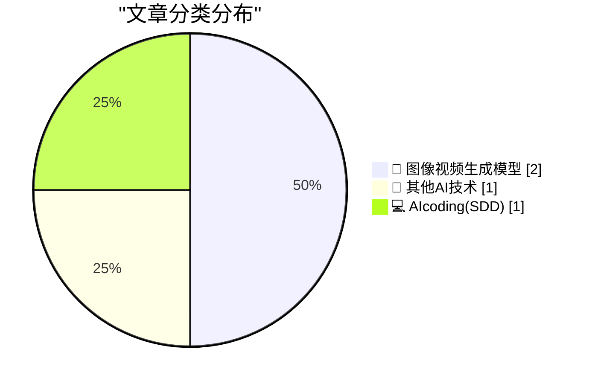
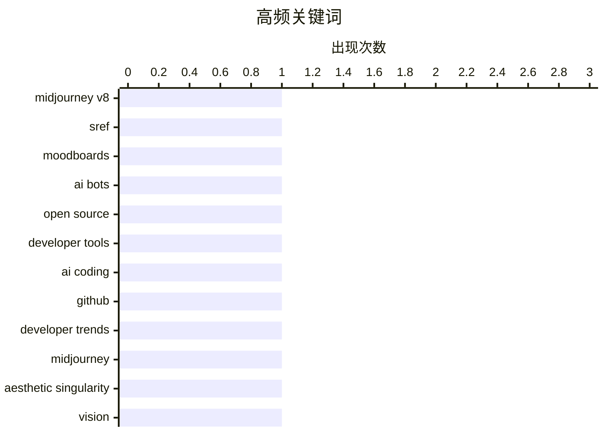

# 📰 AI 博客每日精选 — 2026-03-21

> 来自 98 个技术博客和社交媒体源，AI 精选 Top 4

## 📝 今日看点

今日技术圈聚焦于生成式AI的迅猛进化与生态渗透。一方面，以Midjourney为代表的视觉AI正追求性能突破与“美学奇点”的宏大愿景。另一方面，AI正深度重塑开发工作流，既引发工具趋同的讨论，也催生了如何主动优化项目以吸引AI协作的新实践。整体来看，AI技术正从工具能力升级，转向定义新的创作范式与开发生态。

---

## 🏆 今日必读

🥇 **Midjourney V8 两项快速更新**

[Two quick updates for V8 (1) Relax mode is now available for V8 (2) We've put up a new version of SREF / Moodboards which is 4x faster, 4x cheaper, su...](https://x.com/midjourney/status/2035175336150004136) — 𝕏 @midjourney · 19 小时前 · 🎨 图像视频生成模型

> Midjourney 为其 V8 模型发布了两项重要更新。首先，V8 模型现已支持 Relax 模式。其次，推出了全新版本的 SREF / Moodboards 功能，其速度提升至原来的 4 倍，成本降低至原来的 1/4，并新增了对 HD 模式、个性化、--stylize 和 --exp 参数的支持。用户可通过输入 --sv 6 使用旧版本，或输入 --sv 7 使用新版本。此次更新显著提升了工具的性价比和创作灵活性。

💡 **为什么值得读**: 对于 Midjourney 用户和 AI 图像生成爱好者而言，此次更新意味着能以更低的成本、更快的速度获得更强大的创作控制能力，是优化工作流的重要信息。

🏷️ Midjourney V8, SREF, Moodboards

🥈 **如何为你的开源项目吸引 AI 机器人**

[How to Attract AI Bots to Your Open Source Project](https://nesbitt.io/2026/03/21/how-to-attract-ai-bots-to-your-open-source-project.html) — nesbitt.io · 11 小时前 · 🔬 其他AI技术

> 文章是一份关于如何吸引 AI 机器人（如 AI 编程助手）关注和参与开源项目的实用指南。核心在于通过优化项目设置，使其更易于被 AI 理解和处理，从而获得应有的关注和贡献。指南提供了具体的、可操作的建议，帮助项目维护者适应 AI 协作的新常态。最终目标是提升项目的可见度和自动化协作水平。

💡 **为什么值得读**: 在 AI 日益参与软件开发的今天，这份指南为开源项目维护者提供了前瞻性的策略，有助于项目在新时代保持活力和竞争力。

🏷️ AI Bots, Open Source, Developer Tools

🥉 **AI 是让我们工具趋同，还是赋能我们尝试新事物？**

[Is AI making us all use the same tools, or is it empowering us to try new things? 🤔 The Head of GitHub Next, Idan Gazit, sees two trends colliding:...](https://x.com/github/status/2035420346082345012) — 𝕏 @GitHub · 3 小时前 · 💻 AIcoding(SDD)

> 文章探讨了 AI 对开发者工具链和编程语言选择的双重影响。GitHub Next 负责人 Idan Gazit 指出两种趋势正在碰撞：一方面，AI 驱动开发者向它擅长的流行框架（如 TypeScript, Python）集中；另一方面，AI 也显著降低了学习从未写过的编程语言的门槛。这场讨论关乎未来软件开发的生态是走向聚合还是更加多元化。核心观点是，AI 正在通过反馈循环深刻改变软件开发的面貌。

💡 **为什么值得读**: 它尖锐地提出了一个每位开发者都将面对的核心矛盾，并提供了来自 GitHub 内部的洞察，有助于思考个人技术栈和团队技术选型的未来方向。

🏷️ AI Coding, GitHub, Developer Trends

4️⃣ **Midjourney 的单一目标：抵达“美学奇点”**

[RT Midjourney: Re @honorablepicnic @chaykak @Biernacki @DavidSHolz If we had to articulate a single goal related to the visual world, it would be to "...](https://x.com/midjourney/status/2035465939194650963) — 𝕏 @midjourney · 9 分钟前 · 🎨 图像视频生成模型

> Midjourney 官方阐述了其在视觉领域的终极目标。这个目标被定义为“抵达美学奇点”。所谓“美学奇点”，是指一年内发生的美学探索总量，将超过人类历史上所有美学探索的总和。这并非一个技术指标，而是一个关于创造力和视觉文化发展的宏大愿景。它揭示了 Midjourney 超越工具定位，旨在引爆人类集体审美潜能的野心。

💡 **为什么值得读**: 这句话精辟地概括了生成式 AI 在文化层面的革命性潜力，能激发读者对技术未来社会影响的深度思考。

🏷️ Midjourney, Aesthetic Singularity, Vision

---

## 📊 数据概览

| 扫描源 | 抓取文章 | 时间范围 | 精选 |
|:---:|:---:|:---:|:---:|
| 76/98 | 2405 篇 → 4 篇 | 24h | **4 篇** |

### 分类分布



### 高频关键词



<details>
<summary>📈 纯文本关键词图（终端友好）</summary>

```
midjourney v8    │ ████████████████████ 1
sref             │ ████████████████████ 1
moodboards       │ ████████████████████ 1
ai bots          │ ████████████████████ 1
open source      │ ████████████████████ 1
developer tools  │ ████████████████████ 1
ai coding        │ ████████████████████ 1
github           │ ████████████████████ 1
developer trends │ ████████████████████ 1
midjourney       │ ████████████████████ 1
```

</details>

### 🏷️ 话题标签

**midjourney v8**(1) · **sref**(1) · **moodboards**(1) · ai bots(1) · open source(1) · developer tools(1) · ai coding(1) · github(1) · developer trends(1) · midjourney(1) · aesthetic singularity(1) · vision(1)

---

====================

## 🎨 图像视频生成模型

### 1. Midjourney V8 两项快速更新

[Two quick updates for V8 (1) Relax mode is now available for V8 (2) We've put up a new version of SREF / Moodboards which is 4x faster, 4x cheaper, su...](https://x.com/midjourney/status/2035175336150004136) — **𝕏 @midjourney** · 19 小时前 · ⭐ 22/25

> Midjourney 为其 V8 模型发布了两项重要更新。首先，V8 模型现已支持 Relax 模式。其次，推出了全新版本的 SREF / Moodboards 功能，其速度提升至原来的 4 倍，成本降低至原来的 1/4，并新增了对 HD 模式、个性化、--stylize 和 --exp 参数的支持。用户可通过输入 --sv 6 使用旧版本，或输入 --sv 7 使用新版本。此次更新显著提升了工具的性价比和创作灵活性。

🏷️ Midjourney V8, SREF, Moodboards

📌 图像视频生成模型

---

### 2. Midjourney 的单一目标：抵达“美学奇点”

[RT Midjourney: Re @honorablepicnic @chaykak @Biernacki @DavidSHolz If we had to articulate a single goal related to the visual world, it would be to "...](https://x.com/midjourney/status/2035465939194650963) — **𝕏 @midjourney** · 9 分钟前 · ⭐ 9/25

> Midjourney 官方阐述了其在视觉领域的终极目标。这个目标被定义为“抵达美学奇点”。所谓“美学奇点”，是指一年内发生的美学探索总量，将超过人类历史上所有美学探索的总和。这并非一个技术指标，而是一个关于创造力和视觉文化发展的宏大愿景。它揭示了 Midjourney 超越工具定位，旨在引爆人类集体审美潜能的野心。

🏷️ Midjourney, Aesthetic Singularity, Vision

📌 图像视频生成模型

---

## 🔬 其他AI技术

### 3. 如何为你的开源项目吸引 AI 机器人

[How to Attract AI Bots to Your Open Source Project](https://nesbitt.io/2026/03/21/how-to-attract-ai-bots-to-your-open-source-project.html) — **nesbitt.io** · 11 小时前 · ⭐ 21/25

> 文章是一份关于如何吸引 AI 机器人（如 AI 编程助手）关注和参与开源项目的实用指南。核心在于通过优化项目设置，使其更易于被 AI 理解和处理，从而获得应有的关注和贡献。指南提供了具体的、可操作的建议，帮助项目维护者适应 AI 协作的新常态。最终目标是提升项目的可见度和自动化协作水平。

🏷️ AI Bots, Open Source, Developer Tools

📌 其他AI技术

---

## 💻 AIcoding(SDD)

### 4. AI 是让我们工具趋同，还是赋能我们尝试新事物？

[Is AI making us all use the same tools, or is it empowering us to try new things? 🤔 The Head of GitHub Next, Idan Gazit, sees two trends colliding:...](https://x.com/github/status/2035420346082345012) — **𝕏 @GitHub** · 3 小时前 · ⭐ 11/25

> 文章探讨了 AI 对开发者工具链和编程语言选择的双重影响。GitHub Next 负责人 Idan Gazit 指出两种趋势正在碰撞：一方面，AI 驱动开发者向它擅长的流行框架（如 TypeScript, Python）集中；另一方面，AI 也显著降低了学习从未写过的编程语言的门槛。这场讨论关乎未来软件开发的生态是走向聚合还是更加多元化。核心观点是，AI 正在通过反馈循环深刻改变软件开发的面貌。

🏷️ AI Coding, GitHub, Developer Trends

📌 AIcoding(SDD)

---

====================

*生成于 2026-03-21 21:23 | 扫描 76 源 → 获取 2405 篇 → 精选 4 篇*
*基于 [Hacker News Popularity Contest 2025](https://refactoringenglish.com/tools/hn-popularity/) RSS 源列表，由 [Andrej Karpathy](https://x.com/karpathy) 推荐*
*由「懂点儿AI」制作，欢迎关注同名微信公众号获取更多 AI 实用技巧 💡*
