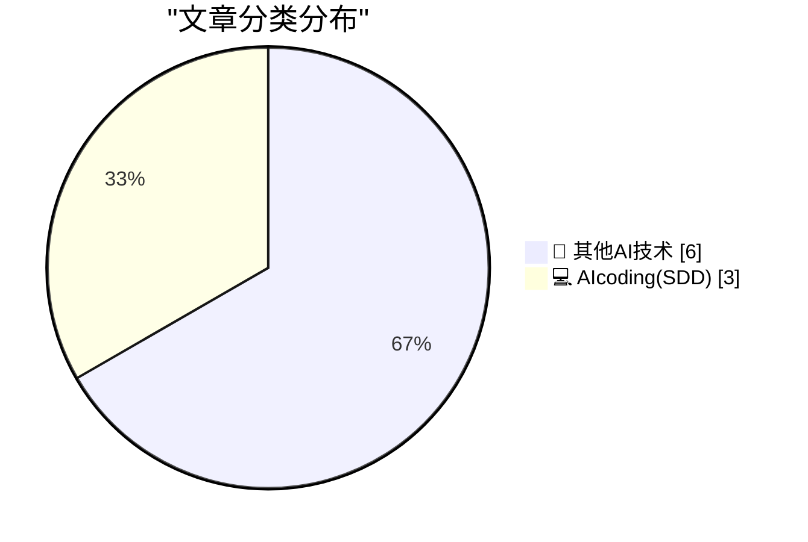
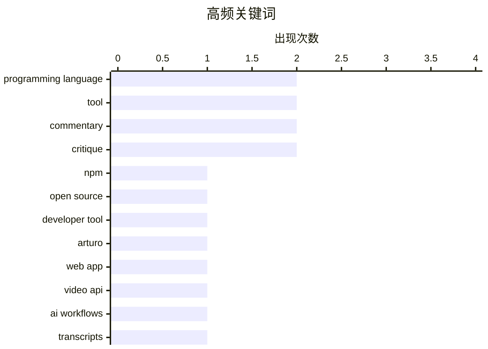

# 📰 AI 博客每日精选 — 2026-03-22

> 来自 98 个技术博客和社交媒体源，AI 精选 Top 9

## 📝 今日看点

今日技术圈聚焦于开发者工具的创新与AI驱动的现实挑战。一方面，从npmx的快速崛起到随机编程语言工具的探索，展现了开源社区对高效、趣味性开发体验的持续追求。另一方面，AI与自动化技术在视频API、客服等场景深入应用的同时，也暴露出资源滥用、体验脱节等治理与伦理问题。此外，科技巨头重返硬件市场的动向，预示着新一轮生态竞争正在酝酿。

---

## 🏆 今日必读

🥇 **一个深夜想法如何催生出 npmx：一个快速、现代的 npm 注册表浏览器**

[What started as a late-night idea turned into npmx: a fast, modern browser for the npm registry. Two weeks later? Over 1,000 contributions. 👀 Here'...](https://x.com/github/status/2035777471186899183) — 𝕏 @GitHub · 3 小时前 · 💻 AIcoding(SDD)

> 文章讲述了一个名为 npmx 的 npm 注册表现代浏览器的诞生故事。该项目源于一个深夜的灵感，并在短短两周内就获得了超过 1000 次贡献，成为一个迅速成功的开源项目。npmx 的核心目标是提供一个快速、现代的界面来浏览庞大的 npm 包生态系统。这个故事展示了开源社区如何能迅速接纳并推动一个有价值的新工具。

💡 **为什么值得读**: 通过一个真实的“一夜成功”案例，生动展示了开源项目从灵感到爆发的惊人速度与社区力量。

🏷️ npm, Open Source, Developer Tool

🥈 **所有测试都通过了：一个短篇故事**

[All tests pass: a short story](https://evanhahn.com/all-tests-pass-a-short-story/) — evanhahn.com · 21 小时前 · 💻 AIcoding(SDD)

> 作者通过一个随机选择编程语言的工具，偶然接触到了 Arturo 语言并决定尝试。Arturo 是一个由 Yanis Zafirópulos 主要维护的、基于堆栈的编程语言。文章记录了作者探索这门陌生语言并成功运行代码的趣味过程。整个过程体现了程序员对新技术的自发好奇心和探索乐趣。

💡 **为什么值得读**: 用一个轻松的个人实验，展现了程序员跳出舒适圈、尝试小众技术时纯粹的乐趣与发现。

🏷️ Programming Language, Arturo, Tool

🥉 **选择随机编程语言的小型网页应用**

[Little web app to pick a random programming language](https://evanhahn.com/random-programming-language/) — evanhahn.com · 21 小时前 · 💻 AIcoding(SDD)

> 作者创建了一个极其简单的网页应用，用于从 Rosetta Code 网站列表中随机选择一种编程语言。该应用的核心技术点是自动抓取 Rosetta Code 上的所有编程语言列表。通过这个项目，作者意外了解到 Arturo 这门语言。项目虽小，但完成了从数据抓取到前端展示的完整流程。

💡 **为什么值得读**: 展示了如何用一个极简的 side project 解决特定需求（选择困难），并可能带来意想不到的学习机会。

🏷️ Web App, Programming Language, Tool

4️⃣ **Mux —— 面向开发者的视频 API**

[Mux — Video API for Developers](https://www.mux.com/?utm_campaign=fireball&amp;utm_source=DF) — daringfireball.net · 3 小时前 · 🔬 其他AI技术

> 文章介绍了 Mux 作为一款面向开发者的视频 API 服务平台。Mux 使得将视频功能集成到网站、平台乃至 AI 工作流中变得简单且可扩展。其服务不仅能处理视频播放，还能解锁视频内的数据，如生成字幕、剪辑、故事板，以支持内容摘要、翻译、审核和打标等高级功能。此外，Mux 还负责维护最流行的开源网页视频播放器 Video.js，其 v10 版本正在进行架构重构的 Beta 测试。

💡 **为什么值得读**: 为开发者清晰地梳理了现代视频处理 API 的核心能力与前沿方向，是集成视频功能的实用技术选型参考。

🏷️ Video API, AI Workflows, Transcripts

5️⃣ **‘好，我很高兴他死了。’**

[‘Good, I’m Glad He’s Dead.’](https://truthsocial.com/@realDonaldTrump/116268334535345382) — daringfireball.net · 4 小时前 · 🔬 其他AI技术

> 文章引用了美国时任总统在社交媒体上对罗伯特·穆勒去世发表的争议性言论：“好，我很高兴他死了。” 作者以讽刺的口吻评论，将这种言论归因于老年人痴呆症导致的失态和思维混乱。文章暗示这种“直言不讳”恰恰暴露了其品格的低下。整个内容是对一则政治人物极端言论的尖锐批评。

💡 **为什么值得读**: 以辛辣的讽刺剖析政治人物的失格言论，反映了公共 discourse 中的极端案例。

🏷️ Politics, Blog, Commentary

---

## 📊 数据概览

| 扫描源 | 抓取文章 | 时间范围 | 精选 |
|:---:|:---:|:---:|:---:|
| 75/98 | 2394 篇 → 9 篇 | 24h | **9 篇** |

### 分类分布



### 高频关键词



<details>
<summary>📈 纯文本关键词图（终端友好）</summary>

```
programming language │ ████████████████████ 2
tool                 │ ████████████████████ 2
commentary           │ ████████████████████ 2
critique             │ ████████████████████ 2
npm                  │ ██████████░░░░░░░░░░ 1
open source          │ ██████████░░░░░░░░░░ 1
developer tool       │ ██████████░░░░░░░░░░ 1
arturo               │ ██████████░░░░░░░░░░ 1
web app              │ ██████████░░░░░░░░░░ 1
video api            │ ██████████░░░░░░░░░░ 1
```

</details>

### 🏷️ 话题标签

**programming language**(2) · **tool**(2) · **commentary**(2) · critique(2) · npm(1) · open source(1) · developer tool(1) · arturo(1) · web app(1) · video api(1) · ai workflows(1) · transcripts(1) · politics(1) · blog(1) · web performance(1) · ads(1) · smartphone(1) · amazon(1) · rumor(1) · customer service(1)

---

====================

## 🔬 其他AI技术

### 1. Mux —— 面向开发者的视频 API

[Mux — Video API for Developers](https://www.mux.com/?utm_campaign=fireball&amp;utm_source=DF) — **daringfireball.net** · 3 小时前 · ⭐ 14/25

> 文章介绍了 Mux 作为一款面向开发者的视频 API 服务平台。Mux 使得将视频功能集成到网站、平台乃至 AI 工作流中变得简单且可扩展。其服务不仅能处理视频播放，还能解锁视频内的数据，如生成字幕、剪辑、故事板，以支持内容摘要、翻译、审核和打标等高级功能。此外，Mux 还负责维护最流行的开源网页视频播放器 Video.js，其 v10 版本正在进行架构重构的 Beta 测试。

🏷️ Video API, AI Workflows, Transcripts

📌 其他AI技术

---

### 2. ‘好，我很高兴他死了。’

[‘Good, I’m Glad He’s Dead.’](https://truthsocial.com/@realDonaldTrump/116268334535345382) — **daringfireball.net** · 4 小时前 · ⭐ 5/25

> 文章引用了美国时任总统在社交媒体上对罗伯特·穆勒去世发表的争议性言论：“好，我很高兴他死了。” 作者以讽刺的口吻评论，将这种言论归因于老年人痴呆症导致的失态和思维混乱。文章暗示这种“直言不讳”恰恰暴露了其品格的低下。整个内容是对一则政治人物极端言论的尖锐批评。

🏷️ Politics, Blog, Commentary

📌 其他AI技术

---

### 3. 半吉字节的广告

[Half a Gigabyte of Ads](https://stuartbreckenridge.net/2026-03-19-pc-gamer-recommends-rss-readers-in-a-37mb-article/) — **daringfireball.net** · 4 小时前 · ⭐ 5/25

> 文章批评了 PC Gamer 网站一个网页的糟糕性能，其初始加载就高达 37MB，并在五分钟内额外下载了近 500MB（半吉字节）的广告内容。作者认为这种对网络资源的滥用是极不负责且不专业的。为此，作者提议网页浏览器应默认将页面加载限制在 5MB 以内，并需要用户明确同意才能下载额外内容。

🏷️ Web Performance, Ads, Critique

📌 其他AI技术

---

### 4. 路透社：亚马逊计划在 Fire Phone 失败十余年后卷土重来，重返智能手机市场

[Reuters: ‘Amazon Plans Smartphone Comeback More Than a Decade After Fire Phone Flop’](https://www.reuters.com/technology/amazon-plans-smartphone-comeback-more-than-decade-after-fire-phone-flop-2026-03-20/) — **daringfireball.net** · 20 小时前 · ⭐ 5/25

> 据路透社报道，亚马逊正内部开发代号为“Transformer”的新智能手机项目，旨在重返市场。这款手机被定位为移动个性化设备，可与家庭语音助手 Alexa 同步，并作为全天连接亚马逊用户的渠道。其个性化功能旨在促进用户在亚马逊购物、观看 Prime Video 和使用 Audible 等。这是亚马逊自 2014 年 Fire Phone 失败后，再次尝试进入智能手机领域。

🏷️ Smartphone, Amazon, Rumor

📌 其他AI技术

---

### 5. 厌倦了吃自家的狗粮？试试闻自己的屁吧！

[Bored of eating your own dogfood? Try smelling your own farts!](https://shkspr.mobi/blog/2026/03/bored-of-eating-your-own-dogfood-try-smelling-your-own-farts/) — **shkspr.mobi** · 8 小时前 · ⭐ 5/25

> 作者通过一次糟糕的客服电话经历，讽刺了企业过度依赖自动化客服（如网站、AI助手）而忽视真实用户需求的现象。电话中被反复告知使用在线渠道，但实际体验证明这些渠道无法有效解决问题。文章指出，这种脱离实际用户体验的设计决策，就像“闻自己的屁”一样自我感觉良好却令他人不适。最终导致了客服通道拥堵，与设计者的预期完全相反。

🏷️ Customer Service, AI Assistant, Critique

📌 其他AI技术

---

### 6. 为何我们现在必须节约，并继续推进绿色能源

[Waarom we nu WEL zuinig moeten doen, en door moeten met groene energie](https://berthub.eu/articles/posts/waarom-we-nu-wel-zuinig-moeten-doen-en-meer-groene-energie/) — **berthub.eu** · 11 小时前 · ⭐ 5/25

> 文章针对国际能源署（IEA）因中东战争建议节约能源，而荷兰部长声称无短缺的矛盾展开讨论。作者指出，否认短缺就像当初“COVID只留在布拉班特”的说法一样，是荷兰的传统误区。事实上，短缺影响已经显现，如油价飞涨。核心论点是，即便在夏季，明智地使用能源也至关重要，因为这能未雨绸缪，缓解未来压力，并为加速向绿色能源转型提供动力。节约与开发绿色能源是应对危机的双重策略。

🏷️ Energy Policy, Commentary, Dutch

📌 其他AI技术

---

## 💻 AIcoding(SDD)

### 7. 一个深夜想法如何催生出 npmx：一个快速、现代的 npm 注册表浏览器

[What started as a late-night idea turned into npmx: a fast, modern browser for the npm registry. Two weeks later? Over 1,000 contributions. 👀 Here'...](https://x.com/github/status/2035777471186899183) — **𝕏 @GitHub** · 3 小时前 · ⭐ 20/25

> 文章讲述了一个名为 npmx 的 npm 注册表现代浏览器的诞生故事。该项目源于一个深夜的灵感，并在短短两周内就获得了超过 1000 次贡献，成为一个迅速成功的开源项目。npmx 的核心目标是提供一个快速、现代的界面来浏览庞大的 npm 包生态系统。这个故事展示了开源社区如何能迅速接纳并推动一个有价值的新工具。

🏷️ npm, Open Source, Developer Tool

📌 AIcoding(SDD)

---

### 8. 所有测试都通过了：一个短篇故事

[All tests pass: a short story](https://evanhahn.com/all-tests-pass-a-short-story/) — **evanhahn.com** · 21 小时前 · ⭐ 15/25

> 作者通过一个随机选择编程语言的工具，偶然接触到了 Arturo 语言并决定尝试。Arturo 是一个由 Yanis Zafirópulos 主要维护的、基于堆栈的编程语言。文章记录了作者探索这门陌生语言并成功运行代码的趣味过程。整个过程体现了程序员对新技术的自发好奇心和探索乐趣。

🏷️ Programming Language, Arturo, Tool

📌 AIcoding(SDD)

---

### 9. 选择随机编程语言的小型网页应用

[Little web app to pick a random programming language](https://evanhahn.com/random-programming-language/) — **evanhahn.com** · 21 小时前 · ⭐ 15/25

> 作者创建了一个极其简单的网页应用，用于从 Rosetta Code 网站列表中随机选择一种编程语言。该应用的核心技术点是自动抓取 Rosetta Code 上的所有编程语言列表。通过这个项目，作者意外了解到 Arturo 这门语言。项目虽小，但完成了从数据抓取到前端展示的完整流程。

🏷️ Web App, Programming Language, Tool

📌 AIcoding(SDD)

---

====================

*生成于 2026-03-22 21:25 | 扫描 75 源 → 获取 2394 篇 → 精选 9 篇*
*基于 [Hacker News Popularity Contest 2025](https://refactoringenglish.com/tools/hn-popularity/) RSS 源列表，由 [Andrej Karpathy](https://x.com/karpathy) 推荐*
*由「懂点儿AI」制作，欢迎关注同名微信公众号获取更多 AI 实用技巧 💡*
