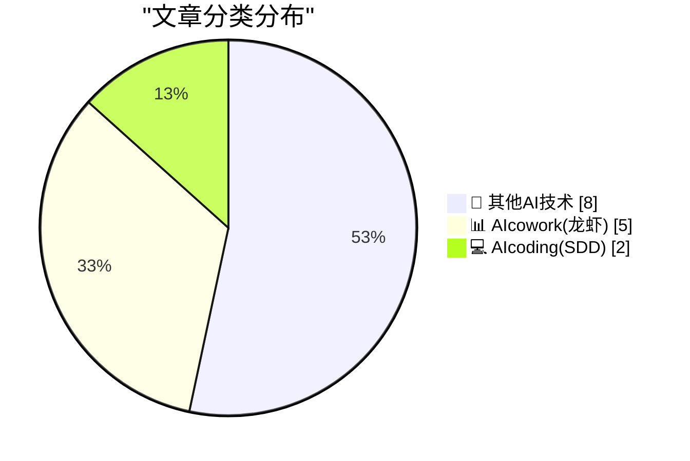
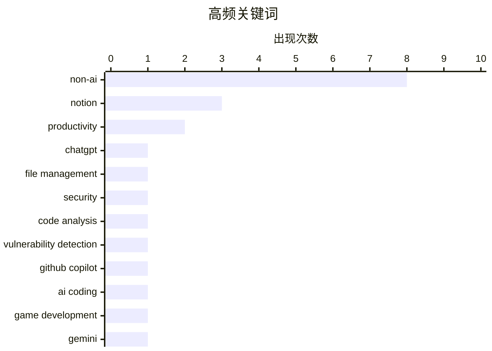

# 📰 AI 博客每日精选 — 2026-03-23

> 来自 98 个技术博客和社交媒体源，AI 精选 Top 15

## 📝 今日看点

今日技术圈的核心焦点在于AI正深度融入日常工作流与安全开发。AI办公助手持续进化，ChatGPT、Google日历和Notion纷纷通过文件管理、智能调度与快捷操作提升人机协作效率。同时，AI在代码与安全领域展现威力，从辅助快速游戏开发到开源框架自动化挖掘复杂漏洞，体现了其作为生产力与守护者的双重角色。

---

## 🏆 今日必读

🥇 **ChatGPT文件管理功能升级：轻松查找、复用和构建文件**

[It’s now easier to find, reuse, and build on the files you upload and create in ChatGPT. You can quickly reference files in a chat using recent files...](https://x.com/OpenAI/status/2036183180219392103) — 𝕏 @OpenAI · 47 分钟前 · 📊 AIcowork(龙虾)

> ChatGPT为Plus、Pro和Business用户推出新的文件管理功能，旨在提升用户与已上传或创建文件的交互效率。用户现在可以通过工具栏中的“最近文件”快速在聊天中引用文件，或直接向ChatGPT询问已上传文件的内容。新增的网页侧边栏“文件库”标签页允许用户浏览所有历史文件。该功能正面向全球相关用户推出，并将很快扩展至欧洲经济区、瑞士和英国的用户。

💡 **为什么值得读**: 了解此更新能显著提升你在ChatGPT中处理多文件任务的效率，是生产力用户必知的功能迭代。

🏷️ ChatGPT, File Management, Productivity

🥈 **GitHub安全实验室开源AI驱动框架，助力检测认证绕过等漏洞**

[The GitHub Security Lab Taskflow Agent is designed to detect Auth Bypasses, IDORs, Token Leaks, and other vulnerabilities that often slip through stan...](https://x.com/github/status/2036172386974794192) — 𝕏 @GitHub · 1 小时前 · 💻 AIcoding(SDD)

> GitHub安全实验室发布了开源的Taskflow Agent框架，专门用于检测那些容易被标准工具遗漏的安全漏洞。该框架旨在识别认证绕过、不安全的直接对象引用、令牌泄露等复杂漏洞。用户现在可以自行运行这些开源任务流来扫描自己的项目。此举将先进的AI驱动安全检测能力开放给了更广泛的开发者社区。

💡 **为什么值得读**: 对于关注应用安全的开发者，这个开源框架提供了企业级的安全检测思路和工具，能有效弥补常规扫描的盲区。

🏷️ Security, Code Analysis, Vulnerability Detection

🥉 **开发者利用GitHub Copilot快速编写3D breakout游戏，实现面部追踪控制**

[RT Martin Woodward: Quickly vibe coded 3D breakout game with GitHub Copilot to use face tracking to control the paddle (and also adjust the board so i...](https://x.com/github/status/2036188718076219474) — 𝕏 @GitHub · 18 小时前 · 💻 AIcoding(SDD)

> 一位开发者使用GitHub Copilot快速编写了一个3D breakout游戏原型。该游戏创新地使用了面部追踪技术来控制游戏中的挡板。开发者还调整了游戏板，使其能根据玩家的视角正确移动。这个项目展示了AI编程助手在快速实现创意和交互实验方面的强大助力。

💡 **为什么值得读**: 这个案例生动展示了AI编程助手如何将创意（如面部控制）快速转化为可运行的代码原型，极具启发性。

🏷️ GitHub Copilot, AI Coding, Game Development

4️⃣ **Google日历集成Gemini AI，智能解决会议安排难题**

[No more scheduling headaches! 🗓️ Gemini in @googlecalendar is removing the friction from meeting logistics. By analyzing availability and time zon...](https://x.com/GoogleWorkspace/status/2036126578812375389) — 𝕏 @GoogleWorkspace · 4 小时前 · 📊 AIcowork(龙虾)

> Google日历集成了Gemini AI功能，旨在自动化并优化会议安排流程。该功能通过分析参与者的可用性和时区信息，快速为所有人找到最佳的会议时间。即使面对日程繁忙的日历，它也能高效识别出合适的空档。这大大减少了以往安排会议时反复协调的摩擦。

💡 **为什么值得读**: 如果你经常为协调跨时区、多参与者的会议而烦恼，这个AI功能将直接提升你的日程管理效率。

🏷️ Gemini, Google Calendar, Meeting Scheduling

5️⃣ **Notion推出快捷操作：Alt+点击新建聊天，Cmd+Alt+O后台运行**

[RT Ken Chen: shipped something small: • alt + click “new chat” • cmd + alt + O runs in the background. no context switching.](https://x.com/NotionHQ/status/2036154907787665796) — 𝕏 @NotionHQ · 2 小时前 · 📊 AIcowork(龙虾)

> Notion发布了两项提升效率的小型功能更新。用户现在可以通过Alt+点击“新建聊天”按钮快速发起对话。新增的快捷键Cmd+Alt+O（Mac）可以让某些操作在后台运行。这些改进的核心目标是减少用户在不同任务和界面间切换的上下文中断，保持工作流的连贯性。

💡 **为什么值得读**: 这两个看似微小的快捷键优化，能切实减少日常使用中的操作中断，适合追求极致效率的Notion深度用户。

🏷️ Notion, Productivity, AI Assistant

---

## 📊 数据概览

| 扫描源 | 抓取文章 | 时间范围 | 精选 |
|:---:|:---:|:---:|:---:|
| 77/98 | 2496 篇 → 16 篇 | 24h | **15 篇** |

### 分类分布



### 高频关键词



<details>
<summary>📈 纯文本关键词图（终端友好）</summary>

```
non-ai                  │ ████████████████████ 8
notion                  │ ████████░░░░░░░░░░░░ 3
productivity            │ █████░░░░░░░░░░░░░░░ 2
chatgpt                 │ ███░░░░░░░░░░░░░░░░░ 1
file management         │ ███░░░░░░░░░░░░░░░░░ 1
security                │ ███░░░░░░░░░░░░░░░░░ 1
code analysis           │ ███░░░░░░░░░░░░░░░░░ 1
vulnerability detection │ ███░░░░░░░░░░░░░░░░░ 1
github copilot          │ ███░░░░░░░░░░░░░░░░░ 1
ai coding               │ ███░░░░░░░░░░░░░░░░░ 1
```

</details>

### 🏷️ 话题标签

**non-ai**(8) · **notion**(3) · **productivity**(2) · chatgpt(1) · file management(1) · security(1) · code analysis(1) · vulnerability detection(1) · github copilot(1) · ai coding(1) · game development(1) · gemini(1) · google calendar(1) · meeting scheduling(1) · ai assistant(1) · personal productivity(1) · life management(1) · product announcement(1) · collaboration(1)

---

====================

## 🔬 其他AI技术

### 1. 全球汽油价格一览

[Gasoline Prices Around the World](https://www.globalpetrolprices.com/gasoline_prices/) — **daringfireball.net** · 46 分钟前 · ⭐ 5/25

> 这是一个专注于提供全球汽油价格的单一功能网站。网站以直观的方式展示了世界各地的油价数据。例如，数据显示香港的汽油价格异常高昂，这一事实可能出乎许多人的意料。这类网站的价值在于将复杂数据简化为清晰、可快速获取的参考信息。

🏷️ Non-AI

📌 其他AI技术

---

### 2. 苹果WWDC 2026开发者大会定于6月8日至12日举行

[WWDC 2026: June 8–12](https://www.apple.com/newsroom/2026/03/apples-worldwide-developers-conference-returns-the-week-of-june-8/) — **daringfireball.net** · 3 小时前 · ⭐ 5/25

> 苹果公司正式宣布2026年全球开发者大会将于6月8日至12日举行。大会将以主题演讲和平台国情咨文拉开序幕，随后整周在线进行。会议将包含超过100个视频讲座、互动小组实验室和预约咨询，开发者可通过这些渠道直接与苹果工程师和设计师交流。大会内容将通过苹果开发者应用、网站、YouTube以及中国的B站频道发布。

🏷️ Non-AI

📌 其他AI技术

---

### 3. 回顾十年前DF档案：‘这个行业糟透了’——关于网络广告的困境

[From the DF Archive, a Decade Ago: ‘The Industry Is Fucked Up’](https://daringfireball.net/linked/2015/07/09/ritchie-bad-ads) — **daringfireball.net** · 3 小时前 · ⭐ 5/25

> 文章回顾了2015年一篇关于网站广告乱象的旧文，当时iMore网站揭示了其被迫投放日益恶劣、对读者充满敌意的广告的困境。十年过去，网络广告的整体状况并未发生根本性改变，劣质广告和侵犯性追踪依然盛行。而曾经优秀的iMore网站本身也已关闭，这构成了一个关于行业生态与内容质量关系的讽刺性注脚。

🏷️ Non-AI

📌 其他AI技术

---

### 4. 《HTML评论》第五期

[The HTML Review: Issue 05](https://thehtml.review/05/) — **daringfireball.net** · 3 小时前 · ⭐ 5/25

> 文章推荐了《HTML评论》第五期，将其视为对当前网页设计现状的一种慰藉。作者通过引用莎士比亚《理查三世》的台词，表达了对具有艺术家般信念的原生应用开发者的渴望。核心观点是赞扬该出版物在网页设计趋于同质化和商业化的环境中，依然坚持艺术与技术的独特融合。这本质上是对网页开发中艺术完整性和独立精神的呼唤。

🏷️ Non-AI

📌 其他AI技术

---

### 5. 多元化：人员不足是一种“恶化”形式（2026年3月23日）

[Pluralistic: Understaffing as a form of enshittification (23 Mar 2026)](https://pluralistic.net/2026/03/22/nobodys-home/) — **pluralistic.net** · 15 小时前 · ⭐ 5/25

> 文章核心论点是，企业故意“人员不足”是一种系统性策略，旨在将价值从员工、客户和用户转移到投资者手中，这是平台“恶化”过程的关键一环。这种策略通过削减成本、增加剩余员工负担、降低服务质量来实现利润最大化。其最终后果是损害产品体验、员工福祉和消费者权益，使平台变得对所有人都不友好。作者的核心观点是，人员不足并非管理失误，而是资本主义为追求短期利润而有意为之的剥削形式。

🏷️ Non-AI

📌 其他AI技术

---

### 6. 如何确保反恶意软件不会终止我的自定义服务？

[How can I make sure the anti-malware software doesn’t terminate my custom service?](https://devblogs.microsoft.com/oldnewthing/20260323-00/?p=112157) — **devblogs.microsoft.com/oldnewthing** · 7 小时前 · ⭐ 5/25

> 文章回答了一个常见的Windows系统管理问题：如何防止安全软件误杀合法的自定义服务。Raymond Chen给出的核心建议是，开发者必须主动与反恶意软件供应商合作，将自己的软件提交给供应商进行白名单验证。没有技术上的“强制”方法可以绕过信誉良好的安全产品。结论是，确保兼容性的唯一正确途径是通过官方渠道建立信任，而不是尝试对抗或绕过安全机制。

🏷️ Non-AI

📌 其他AI技术

---

### 7. 486之后是什么？

[What came after 486?](https://dfarq.homeip.net/what-came-after-486/?utm_source=rss&#038;utm_medium=rss&#038;utm_campaign=what-came-after-486) — **dfarq.homeip.net** · 10 小时前 · ⭐ 5/25

> 文章回顾了Intel处理器从486时代开始的命名演变史。在1990年代之前，CPU只有部件号（如80486）和主频，没有独立的品牌名。由于法院裁定数字不能作为商标，Intel无法为“486”注册商标，这直接促使了“奔腾”品牌的诞生。因此，486的继任者并非“586”，而是全新的“Pentium”品牌。这一变化标志着CPU营销从强调规格参数转向构建消费者品牌。

🏷️ Non-AI

📌 其他AI技术

---

### 8. 日立有限公司，第一部分

[Hitachi Ltd, Part I](https://www.abortretry.fail/p/hitachi-ltd-part-i) — **abortretry.fail** · 21 小时前 · ⭐ 5/25

> 这是关于日本巨头企业日立公司历史系列文章的第一部分。文章从其日文原名“株式会社日立製作所”切入，预示着将深入探讨其创立背景和早期发展。作为一家从电气设备起步、业务遍及基础设施、IT、数字媒体等多个领域的综合集团，其起源故事对于理解日本现代工业史具有代表性。预计本系列将详细梳理日立如何从一家工厂成长为全球性企业的关键节点。

🏷️ Non-AI

📌 其他AI技术

---

## 📊 AIcowork(龙虾)

### 9. ChatGPT文件管理功能升级：轻松查找、复用和构建文件

[It’s now easier to find, reuse, and build on the files you upload and create in ChatGPT. You can quickly reference files in a chat using recent files...](https://x.com/OpenAI/status/2036183180219392103) — **𝕏 @OpenAI** · 47 分钟前 · ⭐ 21/25

> ChatGPT为Plus、Pro和Business用户推出新的文件管理功能，旨在提升用户与已上传或创建文件的交互效率。用户现在可以通过工具栏中的“最近文件”快速在聊天中引用文件，或直接向ChatGPT询问已上传文件的内容。新增的网页侧边栏“文件库”标签页允许用户浏览所有历史文件。该功能正面向全球相关用户推出，并将很快扩展至欧洲经济区、瑞士和英国的用户。

🏷️ ChatGPT, File Management, Productivity

📌 AIcowork(龙虾)

---

### 10. Google日历集成Gemini AI，智能解决会议安排难题

[No more scheduling headaches! 🗓️ Gemini in @googlecalendar is removing the friction from meeting logistics. By analyzing availability and time zon...](https://x.com/GoogleWorkspace/status/2036126578812375389) — **𝕏 @GoogleWorkspace** · 4 小时前 · ⭐ 19/25

> Google日历集成了Gemini AI功能，旨在自动化并优化会议安排流程。该功能通过分析参与者的可用性和时区信息，快速为所有人找到最佳的会议时间。即使面对日程繁忙的日历，它也能高效识别出合适的空档。这大大减少了以往安排会议时反复协调的摩擦。

🏷️ Gemini, Google Calendar, Meeting Scheduling

📌 AIcowork(龙虾)

---

### 11. Notion推出快捷操作：Alt+点击新建聊天，Cmd+Alt+O后台运行

[RT Ken Chen: shipped something small: • alt + click “new chat” • cmd + alt + O runs in the background. no context switching.](https://x.com/NotionHQ/status/2036154907787665796) — **𝕏 @NotionHQ** · 2 小时前 · ⭐ 17/25

> Notion发布了两项提升效率的小型功能更新。用户现在可以通过Alt+点击“新建聊天”按钮快速发起对话。新增的快捷键Cmd+Alt+O（Mac）可以让某些操作在后台运行。这些改进的核心目标是减少用户在不同任务和界面间切换的上下文中断，保持工作流的连贯性。

🏷️ Notion, Productivity, AI Assistant

📌 AIcowork(龙虾)

---

### 12. 用户利用Notion AI代理管理时间、精力、注意力和情绪

[RT Christina Yang: My obsession in being aware of time, energy, attention and emotion management has been growing up to another level with @NotionHQ a...](https://x.com/NotionHQ/status/2036128836233077235) — **𝕏 @NotionHQ** · 4 小时前 · ⭐ 15/25

> 一位用户分享了她使用Notion AI代理将个人管理提升到新水平的体验。她专注于对时间、精力、注意力和情绪进行系统化管理。通过Notion规划生活、构建个人生活数据集，她获得了持续自我优化的乐趣。这体现了Notion正从一个笔记工具演变为一个集成的个人操作系统和数据分析平台。

🏷️ Notion, Personal Productivity, Life Management

📌 AIcowork(龙虾)

---

### 13. Notion与Contra宣布合作，预告将有重大动作

[RT Contra: Calling all builders! We’re teaming up with @NotionHQ for something big. Stay tuned 👀](https://x.com/NotionHQ/status/2036127920092225945) — **𝕏 @NotionHQ** · 4 小时前 · ⭐ 9/25

> Notion与自由职业者平台Contra宣布建立合作伙伴关系。双方共同呼吁创作者和建设者关注此次合作。预告信息表明，即将推出的合作项目规模可观，但具体细节尚未披露。这暗示着Notion可能正在拓展其平台在创作者经济或自由职业领域的集成能力。

🏷️ Notion, Product Announcement, Collaboration

📌 AIcowork(龙虾)

---

## 💻 AIcoding(SDD)

### 14. GitHub安全实验室开源AI驱动框架，助力检测认证绕过等漏洞

[The GitHub Security Lab Taskflow Agent is designed to detect Auth Bypasses, IDORs, Token Leaks, and other vulnerabilities that often slip through stan...](https://x.com/github/status/2036172386974794192) — **𝕏 @GitHub** · 1 小时前 · ⭐ 20/25

> GitHub安全实验室发布了开源的Taskflow Agent框架，专门用于检测那些容易被标准工具遗漏的安全漏洞。该框架旨在识别认证绕过、不安全的直接对象引用、令牌泄露等复杂漏洞。用户现在可以自行运行这些开源任务流来扫描自己的项目。此举将先进的AI驱动安全检测能力开放给了更广泛的开发者社区。

🏷️ Security, Code Analysis, Vulnerability Detection

📌 AIcoding(SDD)

---

### 15. 开发者利用GitHub Copilot快速编写3D breakout游戏，实现面部追踪控制

[RT Martin Woodward: Quickly vibe coded 3D breakout game with GitHub Copilot to use face tracking to control the paddle (and also adjust the board so i...](https://x.com/github/status/2036188718076219474) — **𝕏 @GitHub** · 18 小时前 · ⭐ 19/25

> 一位开发者使用GitHub Copilot快速编写了一个3D breakout游戏原型。该游戏创新地使用了面部追踪技术来控制游戏中的挡板。开发者还调整了游戏板，使其能根据玩家的视角正确移动。这个项目展示了AI编程助手在快速实现创意和交互实验方面的强大助力。

🏷️ GitHub Copilot, AI Coding, Game Development

📌 AIcoding(SDD)

---

====================

*生成于 2026-03-23 21:35 | 扫描 77 源 → 获取 2496 篇 → 精选 15 篇*
*基于 [Hacker News Popularity Contest 2025](https://refactoringenglish.com/tools/hn-popularity/) RSS 源列表，由 [Andrej Karpathy](https://x.com/karpathy) 推荐*
*由「懂点儿AI」制作，欢迎关注同名微信公众号获取更多 AI 实用技巧 💡*
