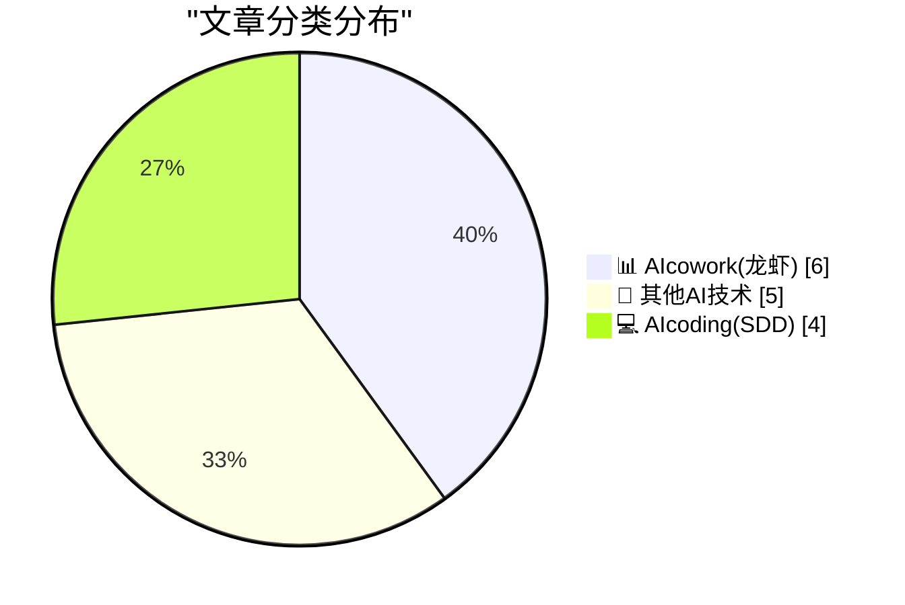
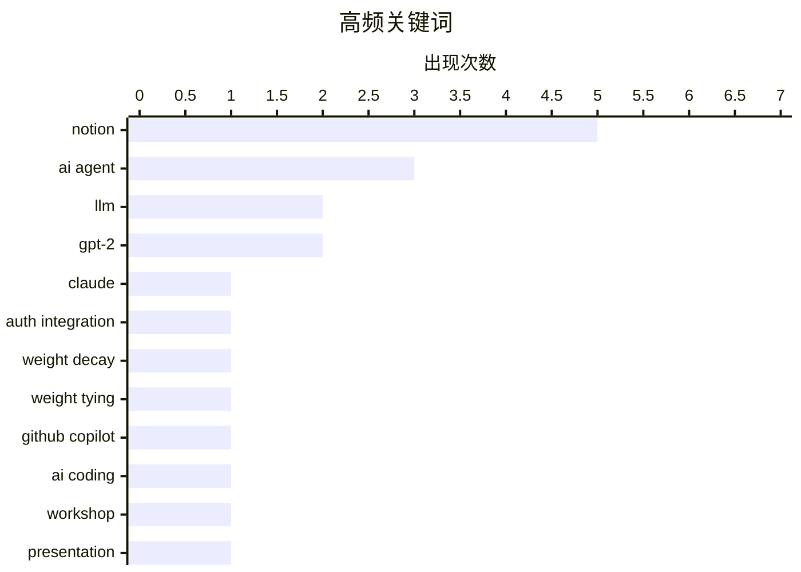

# 📰 AI 博客每日精选 — 2026-03-24

> 来自 98 个技术博客和社交媒体源，AI 精选 Top 15

## 📝 今日看点

今日技术圈聚焦于AI深度融入工作流的两大趋势。一方面，AI编程助手正从代码补全迈向更自动化的“零点击”集成与运维，成为开发者的核心生产力伙伴。另一方面，以Notion、微软、谷歌为代表的协作平台，正竞相将AI打造为能主动处理任务、生成内容与优化流程的智能同事，重塑人机协作模式。

---

## 🏆 今日必读

🥇 **npx workos：从身份验证集成到环境管理，实现零点击运维**

[[Sponsor] npx workos: From Auth Integration to Environment Management, Zero ClickOps](https://workos.com/docs/authkit/cli-installer?utm_source=daringfireball&amp;utm_medium=newsletter&amp;utm_campaign=q12026) — daringfireball.net · 21 小时前 · 💻 AIcoding(SDD)

> WorkOS CLI 工具集旨在简化开发者身份验证集成与环境管理工作流。其核心功能是一个由 Claude 驱动的 AI 代理，能自动分析项目、检测框架并直接将完整的身份验证代码集成到代码库中，无需预先注册。该工具集还包含 `workos seed`（将环境定义为代码）、`workos doctor`（诊断并修复配置错误）等技能，将 CLI 转变为 WorkOS 专家。最终，它实现了从代码集成到环境配置的“零点击运维”自动化体验。

💡 **为什么值得读**: 对于需要快速、无痛集成企业级身份验证功能并追求运维自动化的开发团队，该工具提供了革命性的“开箱即用”解决方案。

🏷️ AI Agent, Claude, Auth Integration

🥈 **从零开始编写 LLM，第 32f 部分 —— 干预：权重衰减**

[Writing an LLM from scratch, part 32f -- Interventions: weight decay](https://www.gilesthomas.com/2026/03/llm-from-scratch-32f-interventions-weight-decay) — gilesthomas.com · 21 小时前 · 💻 AIcoding(SDD)

> 文章是“从零开始构建大型语言模型”系列的一部分，专注于通过干预措施提升一个基于 GPT-2 small 架构、在代码数据上训练的模型的测试损失。核心探讨了权重衰减这一正则化技术，旨在防止模型过拟合。作者引用了 Sebastian Raschka 的书籍作为实践基础，并展示了在训练代码中创建优化器时集成权重衰减的具体代码片段。实验目的是验证权重衰减对模型泛化能力的实际改善效果。

💡 **为什么值得读**: 通过具体的代码实践和模型调优过程，为理解权重衰减在 LLM 训练中的原理与作用提供了第一手经验。

🏷️ LLM, GPT-2, Weight Decay

🥉 **从零开始编写 LLM，第 32g 部分 —— 干预：权重绑定**

[Writing an LLM from scratch, part 32g -- Interventions: weight tying](https://www.gilesthomas.com/2026/03/llm-from-scratch-32g-interventions-weight-tying) — gilesthomas.com · 1 小时前 · 💻 AIcoding(SDD)

> 本文继续探讨提升从头训练 LLM 性能的干预措施，聚焦于权重绑定技术。权重绑定虽能减少模型参数量，但根据 Sebastian Raschka 的经验，它通常会导致模型性能下降，因此现代 LLM 中已较少使用。作者从直觉上解释了这一现象的原因，并计划在文中详细阐述其背后的逻辑。该讨论是基于作者尝试多种方法以改善其 GPT-2 小模型测试损失的一系列实验的一部分。

💡 **为什么值得读**: 澄清了一个常见但可能被误解的模型优化技术（权重绑定），并基于权威经验解释了其在现代实践中的取舍，对模型设计者有直接参考价值。

🏷️ LLM, GPT-2, Weight Tying

4️⃣ **想探索 GitHub Copilot 在真实世界的编码辅助吗？全球 Copilot 开发者日活动正在进行中**

[Want to explore real-world AI-assisted coding with Copilot? GitHub Copilot Dev Days are happening globally. Join local developers to level up your wor...](https://x.com/github/status/2036517156922236948) — 𝕏 @GitHub · 2 小时前 · 💻 AIcoding(SDD)

> GitHub 正在全球范围内举办 Copilot 开发者日活动，旨在推广其 AI 编程助手 Copilot 的实际应用。活动邀请开发者加入本地聚会，以提升他们的工作流程效率。同时，GitHub 也开放申请，允许开发者为自己所在的社区主办类似活动。该举措是为了让开发者亲身体验和掌握 AI 辅助编程的最佳实践。

💡 **为什么值得读**: 为开发者提供了一个线下交流和学习 AI 编程工具实战经验的宝贵机会，有助于快速提升开发效率。

🏷️ GitHub Copilot, AI Coding, Workshop

5️⃣ **Notion 推出演示模式：任何页面一键切换为演示文稿**

[ICYMI: we shipped Presentation Mode! Open any page, press Present, and you’ve got a deck. Your slides were hiding in plain sight.](https://x.com/NotionHQ/status/2036502856312959322) — 𝕏 @NotionHQ · 3 小时前 · 📊 AIcowork(龙虾)

> Notion 正式发布了演示文稿模式，这是一个将现有页面直接转换为幻灯片的功能。用户只需打开任意一个 Notion 页面，点击“演示”按钮，即可立即获得一个结构化的演示文稿。该功能强调内容复用，意味着用户无需额外创建幻灯片，其内容本就隐藏在页面之中。这极大地简化了从文档到演示的流程。

💡 **为什么值得读**: 对于频繁使用 Notion 进行知识管理和汇报的用户来说，此功能无缝衔接了文档撰写与演示展示，能显著提升工作效率。

🏷️ Notion, Presentation, Productivity

---

## 📊 数据概览

| 扫描源 | 抓取文章 | 时间范围 | 精选 |
|:---:|:---:|:---:|:---:|
| 78/98 | 2508 篇 → 26 篇 | 24h | **15 篇** |

### 分类分布



### 高频关键词



<details>
<summary>📈 纯文本关键词图（终端友好）</summary>

```
notion           │ ████████████████████ 5
ai agent         │ ████████████░░░░░░░░ 3
llm              │ ████████░░░░░░░░░░░░ 2
gpt-2            │ ████████░░░░░░░░░░░░ 2
claude           │ ████░░░░░░░░░░░░░░░░ 1
auth integration │ ████░░░░░░░░░░░░░░░░ 1
weight decay     │ ████░░░░░░░░░░░░░░░░ 1
weight tying     │ ████░░░░░░░░░░░░░░░░ 1
github copilot   │ ████░░░░░░░░░░░░░░░░ 1
ai coding        │ ████░░░░░░░░░░░░░░░░ 1
```

</details>

### 🏷️ 话题标签

**notion**(5) · **ai agent**(3) · **llm**(2) · gpt-2(2) · claude(1) · auth integration(1) · weight decay(1) · weight tying(1) · github copilot(1) · ai coding(1) · workshop(1) · presentation(1) · productivity(1) · workflow(1) · hackathon(1) · copilot(1) · ai assistant(1) · microsoft 365(1) · gemini(1) · workspace(1)

---

====================

## 📊 AIcowork(龙虾)

### 1. Notion 推出演示模式：任何页面一键切换为演示文稿

[ICYMI: we shipped Presentation Mode! Open any page, press Present, and you’ve got a deck. Your slides were hiding in plain sight.](https://x.com/NotionHQ/status/2036502856312959322) — **𝕏 @NotionHQ** · 3 小时前 · ⭐ 18/25

> Notion 正式发布了演示文稿模式，这是一个将现有页面直接转换为幻灯片的功能。用户只需打开任意一个 Notion 页面，点击“演示”按钮，即可立即获得一个结构化的演示文稿。该功能强调内容复用，意味着用户无需额外创建幻灯片，其内容本就隐藏在页面之中。这极大地简化了从文档到演示的流程。

🏷️ Notion, Presentation, Productivity

📌 AIcowork(龙虾)

---

### 2. Notion 自定义 AI 代理设置体验现已大幅提升

[RT Akshay Kothari: Custom Agent setup is a lot more delightful now. Big thanks to @kennnnchen’s magic touch.](https://x.com/NotionHQ/status/2036537770240516360) — **𝕏 @NotionHQ** · 1 小时前 · ⭐ 16/25

> Notion 的自定义 AI 代理设置流程得到了显著优化，用户体验变得更加流畅和令人愉悦。这一改进归功于开发者 @kennnnchen 的贡献。官方通过转发 Akshay Kothari 的推文并附上演示视频来宣布此更新。视频展示了优化后更直观、高效的代理配置过程。

🏷️ Notion, AI Agent, Workflow

📌 AIcowork(龙虾)

---

### 3. Notion Buildathon 黑客松正式启动：构建解决实际工作流的自定义 AI 代理

[RT Contra: The @NotionHQ Buildathon is LIVE ⚡️ Build a custom AI agent that solves a real, repeatable workflow in client work. $5K in prizes, exclus...](https://x.com/NotionHQ/status/2036498222441701696) — **𝕏 @NotionHQ** · 3 小时前 · ⭐ 15/25

> Notion 举办的 Buildathon 黑客松活动现已开始，主题是构建能够解决真实、可重复客户工作流程的自定义 AI 代理。活动提供了总额 5000 美元的奖金、专属的 Notion 周边产品作为激励。该活动旨在激发社区创造力，鼓励开发者利用 Notion 平台解决实际问题。官方期待看到参赛者构建出有创意的解决方案。

🏷️ Notion, AI Agent, Hackathon

📌 AIcowork(龙虾)

---

### 4. 微软 Copilot Cowork：只需委派任务，让它处理研究、报告等繁重工作

[All you have to do is delegate. Let Copilot Cowork handle the research, the reports, and the heavy lifting.](https://x.com/Microsoft365/status/2036495801845772743) — **𝕏 @Microsoft365** · 4 小时前 · ⭐ 15/25

> 微软 365 推出的 Copilot Cowork 功能定位为用户的协作伙伴，旨在接管研究、报告撰写等繁重任务。用户的核心动作是“委派”，由 AI 来承担具体的执行工作。该功能通过视频展示了其如何协助用户完成知识性工作。其目标是提升用户在 Microsoft 365 套件中的工作效率。

🏷️ Copilot, AI Assistant, Microsoft 365

📌 AIcowork(龙虾)

---

### 5. Gemini 重新构想创作流程：成为你在 Docs、Sheets、Slides 和 Drive 中的协作伙伴

[Gemini is reimagining the creative process by transforming into a collaborative partner that works alongside you across Docs, Sheets, Slides, and Driv...](https://x.com/GoogleWorkspace/status/2036537407672054174) — **𝕏 @GoogleWorkspace** · 1 小时前 · ⭐ 15/25

> Google Workspace 中的 Gemini 正在转变为一个跨文档、表格、幻灯片和云盘的 AI 协作伙伴。它通过分析用户的邮件、聊天记录和文件来获取洞察，从而帮助用户瞬间从空白页面完成高质量草稿。该功能旨在彻底改变传统的创作过程，实现快速启动和迭代。官方强调其目标是让 AI 与用户并肩工作，而非简单替代。

🏷️ Gemini, Workspace, AI Collaboration

📌 AIcowork(龙虾)

---

### 6. Notion AI 会议笔记功能在两周内交付超过 30 项改进与修复

[RT Zach Tratar: Launches get all the credit, so this week let's flip the script. It’s important to fix the little things and squeeze performance. Our...](https://x.com/NotionHQ/status/2036487763093233939) — **𝕏 @NotionHQ** · 4 小时前 · ⭐ 12/25

> Notion 的 AI 会议笔记团队在过去两周内专注于性能优化和细节打磨，累计交付了超过 30 项小型改进和错误修复。团队强调在关注重大发布的同时，持续优化现有功能、提升性能同样至关重要。推文列举了其中几个值得提及的改进示例。这体现了团队对产品体验和稳定性的持续投入。

🏷️ AI Meeting Notes, Product Update, Notion

📌 AIcowork(龙虾)

---

## 🔬 其他AI技术

### 7. Salesforce TDX26 议程构建器现已上线！

[RT Salesforce Developers: 📣 #TDX26 Agenda Builder is live! Two days. 400+ deep technical sessions and hands-on workshops, all designed to help you ...](https://x.com/SlackHQ/status/2036477371537055877) — **𝕏 @SlackHQ** · 5 小时前 · ⭐ 12/25

> Salesforce 年度技术大会 TDX26 的议程规划工具已正式开放。本次大会为期两天，包含超过 400 场深度技术分享和动手实践研讨会。所有内容旨在帮助开发者掌握技能，以在智能体 AI 时代保持领先。参会者现在可以开始规划自己的个性化日程。

🏷️ Developer Conference, Agentic AI, Salesforce

📌 其他AI技术

---

### 8. 观点：你只是想发送一个附件……

[POV: You just want to send an attachment… Thankfully, Google Drive supports multiple file types, making file sharing easier across teams and tools.](https://x.com/GoogleWorkspace/status/2036428570294091782) — **𝕏 @GoogleWorkspace** · 8 小时前 · ⭐ 8/25

> 该推文强调了 Google Drive 在简化团队文件共享方面的价值。其核心功能是支持多种文件类型，解决了用户跨团队和工具发送附件的常见痛点。这使得文件协作过程更加顺畅高效。

🏷️ Google Drive, File Sharing, Product Feature

📌 其他AI技术

---

### 9. 来自 @ivanhzhao 和 @lennysan 的一点办公室轶事

[A bit of office lore from @ivanhzhao & @lennysan.](https://x.com/NotionHQ/status/2036212670664417672) — **𝕏 @NotionHQ** · 22 小时前 · ⭐ 7/25

> 这是一段由 Notion 联合创始人 Ivan Zhao 和知名产品专家 Lenny Rachitsky 分享的办公室趣事视频。内容涉及 Notion 的公司文化或内部故事。视频附有用户在旧金山对 Notion 办公室表示兴奋的推文截图。

🏷️ Company Culture, Office Lore, Notion

📌 其他AI技术

---

### 10. 在树莓派上使用 FireWire

[Using FireWire on a Raspberry Pi](https://www.jeffgeerling.com/blog/2026/firewire-on-a-raspberry-pi/) — **jeffgeerling.com** · 5 小时前 · ⭐ 5/25

> 文章探讨了在苹果 macOS 26 Tahoe 移除 FireWire 支持后，如何为旧设备寻找替代解决方案。作者因苹果此举，开始研究在树莓派上使用 FireWire 接口来连接老式硬盘、DV摄像机和音视频设备。具体方案涉及硬件连接和驱动配置，旨在让这些旧设备在现代生态中继续发挥作用。

🏷️ Raspberry Pi, FireWire

📌 其他AI技术

---

### 11. ★ 如何应对 macOS 26 Tahoe 中的那些菜单项图标

[★ What to Do About Those Menu Item Icons in MacOS 26 Tahoe](https://daringfireball.net/2026/03/what_to_do_about_those_menu_item_icons_in_macos_26_tahoe) — **daringfireball.net** · 2 小时前 · ⭐ 5/25

> 文章核心是吐槽并寻求解决 macOS 26 Tahoe 新引入的系统应用菜单项图标问题，作者将其比喻为“诅咒的小污点”。文中提到了一个隐藏偏好设置，但指出它只能部分解决问题，效果如同“地狱里的半杯温水”，无法完全隐藏所有图标。这反映了作者对新 UI 设计的强烈不满。

🏷️ macOS, UI

📌 其他AI技术

---

## 💻 AIcoding(SDD)

### 12. npx workos：从身份验证集成到环境管理，实现零点击运维

[[Sponsor] npx workos: From Auth Integration to Environment Management, Zero ClickOps](https://workos.com/docs/authkit/cli-installer?utm_source=daringfireball&amp;utm_medium=newsletter&amp;utm_campaign=q12026) — **daringfireball.net** · 21 小时前 · ⭐ 22/25

> WorkOS CLI 工具集旨在简化开发者身份验证集成与环境管理工作流。其核心功能是一个由 Claude 驱动的 AI 代理，能自动分析项目、检测框架并直接将完整的身份验证代码集成到代码库中，无需预先注册。该工具集还包含 `workos seed`（将环境定义为代码）、`workos doctor`（诊断并修复配置错误）等技能，将 CLI 转变为 WorkOS 专家。最终，它实现了从代码集成到环境配置的“零点击运维”自动化体验。

🏷️ AI Agent, Claude, Auth Integration

📌 AIcoding(SDD)

---

### 13. 从零开始编写 LLM，第 32f 部分 —— 干预：权重衰减

[Writing an LLM from scratch, part 32f -- Interventions: weight decay](https://www.gilesthomas.com/2026/03/llm-from-scratch-32f-interventions-weight-decay) — **gilesthomas.com** · 21 小时前 · ⭐ 22/25

> 文章是“从零开始构建大型语言模型”系列的一部分，专注于通过干预措施提升一个基于 GPT-2 small 架构、在代码数据上训练的模型的测试损失。核心探讨了权重衰减这一正则化技术，旨在防止模型过拟合。作者引用了 Sebastian Raschka 的书籍作为实践基础，并展示了在训练代码中创建优化器时集成权重衰减的具体代码片段。实验目的是验证权重衰减对模型泛化能力的实际改善效果。

🏷️ LLM, GPT-2, Weight Decay

📌 AIcoding(SDD)

---

### 14. 从零开始编写 LLM，第 32g 部分 —— 干预：权重绑定

[Writing an LLM from scratch, part 32g -- Interventions: weight tying](https://www.gilesthomas.com/2026/03/llm-from-scratch-32g-interventions-weight-tying) — **gilesthomas.com** · 1 小时前 · ⭐ 22/25

> 本文继续探讨提升从头训练 LLM 性能的干预措施，聚焦于权重绑定技术。权重绑定虽能减少模型参数量，但根据 Sebastian Raschka 的经验，它通常会导致模型性能下降，因此现代 LLM 中已较少使用。作者从直觉上解释了这一现象的原因，并计划在文中详细阐述其背后的逻辑。该讨论是基于作者尝试多种方法以改善其 GPT-2 小模型测试损失的一系列实验的一部分。

🏷️ LLM, GPT-2, Weight Tying

📌 AIcoding(SDD)

---

### 15. 想探索 GitHub Copilot 在真实世界的编码辅助吗？全球 Copilot 开发者日活动正在进行中

[Want to explore real-world AI-assisted coding with Copilot? GitHub Copilot Dev Days are happening globally. Join local developers to level up your wor...](https://x.com/github/status/2036517156922236948) — **𝕏 @GitHub** · 2 小时前 · ⭐ 19/25

> GitHub 正在全球范围内举办 Copilot 开发者日活动，旨在推广其 AI 编程助手 Copilot 的实际应用。活动邀请开发者加入本地聚会，以提升他们的工作流程效率。同时，GitHub 也开放申请，允许开发者为自己所在的社区主办类似活动。该举措是为了让开发者亲身体验和掌握 AI 辅助编程的最佳实践。

🏷️ GitHub Copilot, AI Coding, Workshop

📌 AIcoding(SDD)

---

====================

*生成于 2026-03-24 21:37 | 扫描 78 源 → 获取 2508 篇 → 精选 15 篇*
*基于 [Hacker News Popularity Contest 2025](https://refactoringenglish.com/tools/hn-popularity/) RSS 源列表，由 [Andrej Karpathy](https://x.com/karpathy) 推荐*
*由「懂点儿AI」制作，欢迎关注同名微信公众号获取更多 AI 实用技巧 💡*
