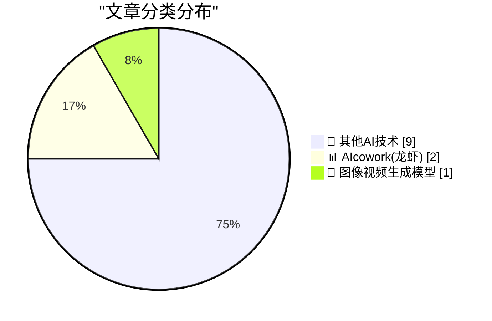
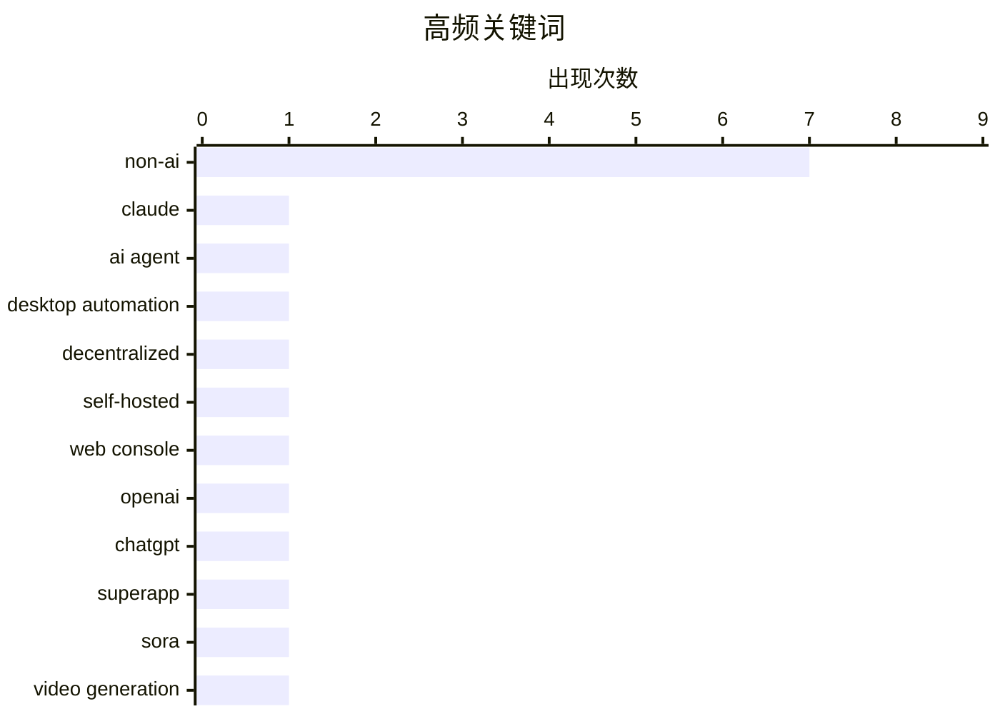

# 📰 AI 博客每日精选 — 2026-03-25

> 来自 98 个技术博客和社交媒体源，AI 精选 Top 12

## 📝 今日看点

今日技术圈聚焦于AI助手向操作系统级生产力工具演进，以及主流平台生态的持续整合与竞争。Claude与OpenAI均推出桌面“超级应用”战略，旨在通过直接控制计算机或整合多项服务来重塑人机协作界面。同时，苹果与三星等巨头在应用商店分析、跨平台文件共享等生态功能上持续角力，平台体验的优化与互联成为关键战场。

---

## 🏆 今日必读

🥇 **Claude 现已能接管你的 Mac 进行操作**

[Claude Can Now Take Control of Your Mac](https://claude.com/blog/dispatch-and-computer-use) — daringfireball.net · 20 小时前 · 📊 AIcowork(龙虾)

> Anthropic 在 Claude Co-worker 和 Claude Code 中推出了计算机控制功能。Claude 现在可以在用户授权下，直接控制鼠标、点击、导航屏幕，以自动执行任务，例如打开文件、使用浏览器和运行开发工具。该功能目前作为研究预览版，向 Claude Pro 和 Max 订阅者开放，并与 Dispatch 任务分配功能配合良好。这标志着 AI 助手从被动响应向主动、具身操作系统的关键一步。

💡 **为什么值得读**: 该功能展示了 AI 从对话工具向能够直接操作系统的智能体演进的重要趋势，对于理解未来人机交互模式具有前瞻性。

🏷️ Claude, AI Agent, Desktop Automation

🥈 **Wander 0.3.0 发布**

[Wander 0.3.0](https://susam.net/code/news/wander/0.3.0.html) — susam.net · 21 小时前 · 🔬 其他AI技术

> Wander 0.3.0 是一个小型、去中心化、自托管的网络控制台，允许网站访客探索由独立站长社区推荐的网站。此版本主要修复了 0.2.0 版本中引入的两个导致部分用户出现问题的新功能所引发的关键错误。项目旨在构建一个去中心化的网页发现社区，用户可通过访问 susam.net/wander/ 进行体验。

💡 **为什么值得读**: 对于关注去中心化网络、独立站点生态和小型自托管工具的开发者而言，这是一个值得关注的轻量级实践项目。

🏷️ Decentralized, Self-hosted, Web Console

🥉 **《华尔街日报》：OpenAI 计划推出桌面“超级应用”**

[WSJ: ‘OpenAI Plans Launch of Desktop “Superapp”’](https://www.wsj.com/tech/openai-plans-launch-of-desktop-superapp-to-refocus-simplify-user-experience-9e19931d?st=25wiu1) — daringfireball.net · 20 小时前 · 📊 AIcowork(龙虾)

> OpenAI 正计划将其 ChatGPT 应用、Codex 编码平台和浏览器整合为一个桌面“超级应用”。此举旨在简化用户体验，并将公司重心进一步转向工程和商业客户。应用主管 Fidji Simo 将负责监督这一变革，并帮助销售团队推广新产品。这标志着 OpenAI 正从单一的聊天机器人服务向集成化生产力平台战略转型。

💡 **为什么值得读**: 揭示了 OpenAI 的核心产品战略转向，对于关注 AI 行业竞争格局和未来应用形态的读者至关重要。

🏷️ OpenAI, ChatGPT, Superapp

4️⃣ **OpenAI 即将关闭 Sora 应用**

[OpenAI Is Closing Sora](https://x.com/soraofficialapp/status/2036546752535470382) — daringfireball.net · 20 小时前 · 🎨 图像视频生成模型

> OpenAI 旗下的视频生成应用 Sora 正式宣布即将关闭。官方推文感谢了用户社区，并承诺将分享应用与 API 的具体时间线以及作品保存方案。然而，评论指出 Sora 虽然短期内引发了关注，但并未产生持久影响力，更像是一个成本高昂的试验性项目。这反映了 AI 视频生成领域在商业化落地和用户留存方面面临的挑战。

💡 **为什么值得读**: 通过一个明星 AI 应用的快速陨落，揭示了当前生成式 AI 产品在寻找可持续商业模式上的普遍困境。

🏷️ Sora, Video Generation, API

5️⃣ **“一份包含非常规建筑结构名称的连锁餐厅列表”**

[‘A List of Chain Restaurants Whose Names Contain Unusual Structures’](https://onefoottsunami.com/2026/03/18/a-list-of-chain-restaurants-whose-names-contain-unusual-structures/) — daringfireball.net · 1 小时前 · 🔬 其他AI技术

> 文章介绍并讨论了一份列举了名称中包含“非常规建筑结构”（如 Barn, Mill, Station 等）的连锁餐厅的趣味列表。作者试图寻找列表之外的例子，最接近的是 1980 年代的 ShowBiz Pizza Place，但认为“Place”不属于建筑结构而未列入。这本质上是一篇关于语言、命名文化和怀旧记忆的轻松随笔。

💡 **为什么值得读**: 以一种独特而有趣的视角观察商业命名文化，适合喜欢语言游戏和流行文化考据的读者轻松阅读。

🏷️ Non-AI

---

## 📊 数据概览

| 扫描源 | 抓取文章 | 时间范围 | 精选 |
|:---:|:---:|:---:|:---:|
| 63/98 | 1886 篇 → 12 篇 | 24h | **12 篇** |

### 分类分布



### 高频关键词



<details>
<summary>📈 纯文本关键词图（终端友好）</summary>

```
non-ai             │ ████████████████████ 7
claude             │ ███░░░░░░░░░░░░░░░░░ 1
ai agent           │ ███░░░░░░░░░░░░░░░░░ 1
desktop automation │ ███░░░░░░░░░░░░░░░░░ 1
decentralized      │ ███░░░░░░░░░░░░░░░░░ 1
self-hosted        │ ███░░░░░░░░░░░░░░░░░ 1
web console        │ ███░░░░░░░░░░░░░░░░░ 1
openai             │ ███░░░░░░░░░░░░░░░░░ 1
chatgpt            │ ███░░░░░░░░░░░░░░░░░ 1
superapp           │ ███░░░░░░░░░░░░░░░░░ 1
```

</details>

### 🏷️ 话题标签

**non-ai**(7) · **claude**(1) · **ai agent**(1) · desktop automation(1) · decentralized(1) · self-hosted(1) · web console(1) · openai(1) · chatgpt(1) · superapp(1) · sora(1) · video generation(1) · api(1) · biography(1) · microsoft(1) · nba(1)

---

====================

## 🔬 其他AI技术

### 1. Wander 0.3.0 发布

[Wander 0.3.0](https://susam.net/code/news/wander/0.3.0.html) — **susam.net** · 21 小时前 · ⭐ 16/25

> Wander 0.3.0 是一个小型、去中心化、自托管的网络控制台，允许网站访客探索由独立站长社区推荐的网站。此版本主要修复了 0.2.0 版本中引入的两个导致部分用户出现问题的新功能所引发的关键错误。项目旨在构建一个去中心化的网页发现社区，用户可通过访问 susam.net/wander/ 进行体验。

🏷️ Decentralized, Self-hosted, Web Console

📌 其他AI技术

---

### 2. “一份包含非常规建筑结构名称的连锁餐厅列表”

[‘A List of Chain Restaurants Whose Names Contain Unusual Structures’](https://onefoottsunami.com/2026/03/18/a-list-of-chain-restaurants-whose-names-contain-unusual-structures/) — **daringfireball.net** · 1 小时前 · ⭐ 5/25

> 文章介绍并讨论了一份列举了名称中包含“非常规建筑结构”（如 Barn, Mill, Station 等）的连锁餐厅的趣味列表。作者试图寻找列表之外的例子，最接近的是 1980 年代的 ShowBiz Pizza Place，但认为“Place”不属于建筑结构而未列入。这本质上是一篇关于语言、命名文化和怀旧记忆的轻松随笔。

🏷️ Non-AI

📌 其他AI技术

---

### 3. App Store Connect 分析功能迎来重大更新

[Improved Analytics in App Store Connect](https://developer.apple.com/news/?id=hh6v4b55) — **daringfireball.net** · 2 小时前 · ⭐ 5/25

> 苹果为开发者平台 App Store Connect 中的 Analytics（分析）模块推出了自上线以来最大规模的更新。更新包括全新的用户体验，使开发者能更轻松地衡量其应用和游戏的性能表现。所有数据收集仍以用户隐私为核心，并附有全新的支持指南。部分社区反馈对数据呈现方式表达了关切。

🏷️ Non-AI

📌 其他AI技术

---

### 4. iOS 26.4 更新详解

[iOS 26.4](https://www.macrumors.com/guide/ios-26-4-features/) — **daringfireball.net** · 20 小时前 · ⭐ 5/25

> iOS 26.4 更新中，App Store 的变动尤为显著：它合并了“App”与“购买历史”页面，并为“应用更新”设立了独立专区。这使得进入更新页面从原来资料页底部的一键直达，变成了需要两次点击。尽管最初引发了一些不便的反馈，但此举被认为在逻辑上更清晰。文章提供了对此版本所有新功能和变化的详细梳理。

🏷️ Non-AI

📌 其他AI技术

---

### 5. 效仿谷歌 Pixel，三星 Galaxy S26 系列宣布支持 AirDrop

[Following Google’s Lead With Pixel Phones, Samsung Announces AirDrop Support With Galaxy S26 Phones](https://news.samsung.com/us/samsung-airdrop-quick-share-galaxy-s26-series/) — **daringfireball.net** · 23 小时前 · ⭐ 5/25

> 三星宣布将为 Galaxy S26 系列手机引入对苹果 AirDrop 协议的支持，用户可通过三星的 Quick Share 功能与苹果设备跨平台分享内容。该功能将于 3 月 23 日从韩国开始推送，并逐步扩展至欧洲、北美、日本等多个地区。未来该支持将有望扩展到更多三星设备。这是继谷歌 Pixel 之后，又一主要安卓厂商加入对 AirDrop 的兼容。

🏷️ Non-AI

📌 其他AI技术

---

### 6. Pluralistic：做生意的成本（2026年3月25日）

[Pluralistic: The cost of doing business (25 Mar 2026)](https://pluralistic.net/2026/03/25/fact-intensive/) — **pluralistic.net** · 14 小时前 · ⭐ 5/25

> 本期博客的核心论点是，“市场定义”正在成为反垄断法实施中的一种拒绝服务攻击，增加了执法成本。文章链接集合还涉及多个议题，包括联合太平洋铁路诉模型铁路案、华纳兄弟诉《哈利·波特》粉丝案、《纽约时报》的商标纠缠、格伦费尔大厦维修成本转嫁租客等。作者 Cory Doctorow 从技术、法律和文化交叉视角批判大公司滥用权力。

🏷️ Non-AI

📌 其他AI技术

---

### 7. 如何将对话框的消息循环改为使用 MsgWaitForMultipleObjects 而非 GetMessage？

[How can I change a dialog box’s message loop to do a Msg­Wait­For­Multiple­Objects instead of Get­Message?](https://devblogs.microsoft.com/oldnewthing/20260325-00/?p=112165) — **devblogs.microsoft.com/oldnewthing** · 7 小时前 · ⭐ 5/25

> 这是一篇解决 Windows 编程中特定技术问题的文章。它解答了如何修改对话框的消息循环机制，使其从标准的 GetMessage 等待模式，变为使用 MsgWaitForMultipleObjects 函数。后者允许消息循环在等待消息的同时，也能等待其他内核对象（如事件、信号量）变为有信号状态。文章指出，对话框本身提供了允许开发者改变其等待方式的机制。

🏷️ Non-AI

📌 其他AI技术

---

### 8. 开源领域十大阴谋论

[The Top 10 Biggest Conspiracies in Open Source](https://nesbitt.io/2026/03/25/the-top-10-biggest-conspiracies-in-open-source.html) — **nesbitt.io** · 11 小时前 · ⭐ 5/25

> 文章列举了开源软件世界中流传最广、最具争议的十个阴谋论。这些“阴谋”涉及大型科技公司通过贡献代码进行暗中控制、基金会治理背后的权力博弈，以及某些流行项目突然“被收购”或转向的真实动机。作者并未断言这些阴谋属实，而是指出这些现象和疑点确实存在，并构成了开源社区文化叙事的一部分。其核心观点在于，理解这些“阴谋论”有助于更清醒地认识开源生态中商业、政治与理想主义交织的复杂现实。

🏷️ Non-AI

📌 其他AI技术

---

### 9. 史蒂夫·鲍尔默：微软前CEO与NBA球队老板

[Steve Ballmer, Microsoft executive and NBA owner](https://dfarq.homeip.net/steve-ballmer-microsoft-executive-and-nba-owner/?utm_source=rss&#038;utm_medium=rss&#038;utm_campaign=steve-ballmer-microsoft-executive-and-nba-owner) — **dfarq.homeip.net** · 10 小时前 · ⭐ 5/25

> 文章简要介绍了史蒂夫·鲍尔默的生平，重点聚焦于他职业生涯的两个标志性身份。他于2000年至2014年担任微软首席执行官，是带领公司经历PC时代鼎盛与移动互联网冲击的关键人物。离开微软后，他于2014年以20亿美元收购了NBA洛杉矶快船队，成功转型为职业体育联盟的球队老板。根据报道，其个人财富目前约在千亿美元级别。文章勾勒了他从科技巨头掌舵人到体育产业大亨的跨界人生轨迹。

🏷️ Biography, Microsoft, NBA

📌 其他AI技术

---

## 📊 AIcowork(龙虾)

### 10. Claude 现已能接管你的 Mac 进行操作

[Claude Can Now Take Control of Your Mac](https://claude.com/blog/dispatch-and-computer-use) — **daringfireball.net** · 20 小时前 · ⭐ 23/25

> Anthropic 在 Claude Co-worker 和 Claude Code 中推出了计算机控制功能。Claude 现在可以在用户授权下，直接控制鼠标、点击、导航屏幕，以自动执行任务，例如打开文件、使用浏览器和运行开发工具。该功能目前作为研究预览版，向 Claude Pro 和 Max 订阅者开放，并与 Dispatch 任务分配功能配合良好。这标志着 AI 助手从被动响应向主动、具身操作系统的关键一步。

🏷️ Claude, AI Agent, Desktop Automation

📌 AIcowork(龙虾)

---

### 11. 《华尔街日报》：OpenAI 计划推出桌面“超级应用”

[WSJ: ‘OpenAI Plans Launch of Desktop “Superapp”’](https://www.wsj.com/tech/openai-plans-launch-of-desktop-superapp-to-refocus-simplify-user-experience-9e19931d?st=25wiu1) — **daringfireball.net** · 20 小时前 · ⭐ 15/25

> OpenAI 正计划将其 ChatGPT 应用、Codex 编码平台和浏览器整合为一个桌面“超级应用”。此举旨在简化用户体验，并将公司重心进一步转向工程和商业客户。应用主管 Fidji Simo 将负责监督这一变革，并帮助销售团队推广新产品。这标志着 OpenAI 正从单一的聊天机器人服务向集成化生产力平台战略转型。

🏷️ OpenAI, ChatGPT, Superapp

📌 AIcowork(龙虾)

---

## 🎨 图像视频生成模型

### 12. OpenAI 即将关闭 Sora 应用

[OpenAI Is Closing Sora](https://x.com/soraofficialapp/status/2036546752535470382) — **daringfireball.net** · 20 小时前 · ⭐ 11/25

> OpenAI 旗下的视频生成应用 Sora 正式宣布即将关闭。官方推文感谢了用户社区，并承诺将分享应用与 API 的具体时间线以及作品保存方案。然而，评论指出 Sora 虽然短期内引发了关注，但并未产生持久影响力，更像是一个成本高昂的试验性项目。这反映了 AI 视频生成领域在商业化落地和用户留存方面面临的挑战。

🏷️ Sora, Video Generation, API

📌 图像视频生成模型

---

====================

*生成于 2026-03-25 21:37 | 扫描 63 源 → 获取 1886 篇 → 精选 12 篇*
*基于 [Hacker News Popularity Contest 2025](https://refactoringenglish.com/tools/hn-popularity/) RSS 源列表，由 [Andrej Karpathy](https://x.com/karpathy) 推荐*
*由「懂点儿AI」制作，欢迎关注同名微信公众号获取更多 AI 实用技巧 💡*
