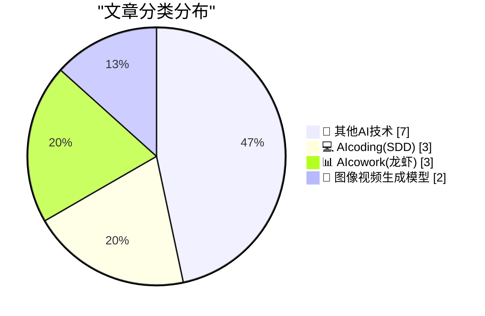
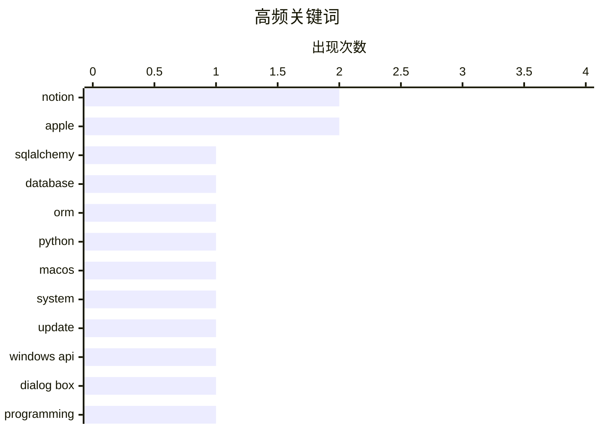

# 📰 AI 博客每日精选 — 2026-03-26

> 来自 98 个技术博客和社交媒体源，AI 精选 Top 15

## 📝 今日看点

今日技术圈聚焦于AI与协作工具的深度融合。AI正从编码助手向游戏开发、实时内容生成等更复杂的创意和生产领域渗透。同时，各大平台正竞相将AI能力无缝嵌入团队协作流程，以提升信息共享与工作效率。

---

## 🏆 今日必读

🥇 **SQLAlchemy 2 实战 - 第二章：数据库表**

[SQLAlchemy 2 In Practice - Chapter 2 - Database Tables](https://blog.miguelgrinberg.com/post/sqlalchemy-2-in-practice---chapter-1---database-tables) — miguelgrinberg.com · 9 小时前 · 💻 AIcoding(SDD)

> 本章节是《SQLAlchemy 2 实战》书籍的一部分，专注于使用 SQLAlchemy 库进行数据库表操作的基础实践。它详细介绍了如何使用 SQLAlchemy 的核心组件（如 `Table`、`Column`、`MetaData`）来定义和创建数据库表结构。内容涵盖了数据类型定义、主键/外键约束设置，以及如何通过声明式基类或经典映射方式将 Python 类与数据库表关联。对于需要从零开始掌握 SQLAlchemy ORM 或 SQL 表达式语言进行数据建模的开发者，本章提供了清晰的入门指南和代码示例。

💡 **为什么值得读**: 这是系统学习 SQLAlchemy 2 现代 ORM 用法和最佳实践的权威教程章节，适合任何希望提升 Python 数据库操作技能的开发者。

🏷️ SQLAlchemy, Database, ORM, Python

🥈 **Mr. Macintosh 解释另一种屏蔽 macOS 26 Tahoe 软件更新提示的方法**

[Mr. Macintosh Explains Another Way to Block the Software Update Prompts for MacOS 26 Tahoe](https://www.youtube.com/watch?v=uRg1pW8TSYk) — daringfireball.net · 6 小时前 · 🔬 其他AI技术

> 文章介绍了屏蔽 macOS 26 Tahoe 升级提示的另一种方法，作为之前需要手动编辑设备管理配置文件（XML Property List）的替代方案。该方法使用免费的 iMazing Profile Editor 图形化工具来创建和配置所需的设备管理描述文件，从而避免了直接编辑复杂 XML 文件的风险和门槛。此方法旨在帮助希望停留在 macOS 15 Sequoia 的用户更简单、安全地屏蔽系统更新提示。

💡 **为什么值得读**: 为不想升级到新 macOS 版本的用户提供了一个更直观、低风险的图形化操作方案，避免了手动配置文件的复杂性。

🏷️ macOS, System, Update

🥉 **为什么如果对话框是 MessageBox，WM_ENTERIDLE 就不起作用？**

[Why doesn’t WM_ENTER­IDLE work if the dialog box is a Message­Box?](https://devblogs.microsoft.com/oldnewthing/20260326-00/?p=112167) — devblogs.microsoft.com/oldnewthing · 7 小时前 · 💻 AIcoding(SDD)

> 文章探讨了 Windows 消息 `WM_ENTERIDLE` 在标准 `MessageBox` 对话框上失效的技术原因。核心结论是 `MessageBox` 对话框主动选择退出了 `WM_ENTERIDLE` 消息的发送机制。这解释了开发者在使用该消息来检测模态对话框空闲状态时可能遇到的意外行为。

💡 **为什么值得读**: 清晰解答了一个 Windows 编程中特定消息机制的细微陷阱，有助于开发者避免在对话框消息处理上浪费时间。

🏷️ Windows API, Dialog Box, Programming

4️⃣ **GitHub：AI 融入 Unity 正在成为现实，了解 Unity MCP**

[AI inside Unity is getting real. 👀 Join us on Open Source Friday with Andy Tsen to dive into Unity MCP. We'll cover: 🤖 How AI agents talk to Uni...](https://x.com/github/status/2037224355722129447) — 𝕏 @GitHub · 3 小时前 · 💻 AIcoding(SDD)

> GitHub 预告了一场关于 Unity MCP（Model Context Protocol）的 Open Source Friday 直播活动。活动将深入探讨 AI 如何与 Unity 游戏引擎进行交互，核心议题包括：AI 智能体与 Unity 通信的机制、在游戏引擎中“上下文”的具体含义，以及如何开始构建 AI 辅助的工作流程。

💡 **为什么值得读**: 为游戏开发者和 AI 应用研究者提供了了解前沿的 AI-游戏引擎集成技术（Unity MCP）的直接机会。

🏷️ AI Agent, Unity, MCP, Game Development

5️⃣ **Notion：现在你可以将任何 AI 聊天线程作为只读链接分享**

[Sometimes, you want to share your AI chat…with the group chat. Now you can! Share any AI chat thread as a read-only link 🫡](https://x.com/NotionHQ/status/2036927053711499676) — 𝕏 @NotionHQ · 23 小时前 · 📊 AIcowork(龙虾)

> Notion 宣布推出了一项新功能：用户可以将与 Notion AI 的对话线程生成一个只读链接并进行分享。这使得团队协作场景下，分享 AI 对话过程和结果变得非常简单，无需截图或复制粘贴文本。

💡 **为什么值得读**: 极大地提升了 Notion AI 在团队协作中的实用性和透明度，方便知识留存与共享。

🏷️ Notion, AI Chat, Collaboration

---

## 📊 数据概览

| 扫描源 | 抓取文章 | 时间范围 | 精选 |
|:---:|:---:|:---:|:---:|
| 76/98 | 2391 篇 → 23 篇 | 24h | **15 篇** |

### 分类分布



### 高频关键词



<details>
<summary>📈 纯文本关键词图（终端友好）</summary>

```
notion      │ ████████████████████ 2
apple       │ ████████████████████ 2
sqlalchemy  │ ██████████░░░░░░░░░░ 1
database    │ ██████████░░░░░░░░░░ 1
orm         │ ██████████░░░░░░░░░░ 1
python      │ ██████████░░░░░░░░░░ 1
macos       │ ██████████░░░░░░░░░░ 1
system      │ ██████████░░░░░░░░░░ 1
update      │ ██████████░░░░░░░░░░ 1
windows api │ ██████████░░░░░░░░░░ 1
```

</details>

### 🏷️ 话题标签

**notion**(2) · **apple**(2) · **sqlalchemy**(1) · database(1) · orm(1) · python(1) · macos(1) · system(1) · update(1) · windows api(1) · dialog box(1) · programming(1) · ai agent(1) · unity(1) · mcp(1) · game development(1) · ai chat(1) · collaboration(1) · ai features(1) · productivity(1)

---

====================

## 🔬 其他AI技术

### 1. Mr. Macintosh 解释另一种屏蔽 macOS 26 Tahoe 软件更新提示的方法

[Mr. Macintosh Explains Another Way to Block the Software Update Prompts for MacOS 26 Tahoe](https://www.youtube.com/watch?v=uRg1pW8TSYk) — **daringfireball.net** · 6 小时前 · ⭐ 20/25

> 文章介绍了屏蔽 macOS 26 Tahoe 升级提示的另一种方法，作为之前需要手动编辑设备管理配置文件（XML Property List）的替代方案。该方法使用免费的 iMazing Profile Editor 图形化工具来创建和配置所需的设备管理描述文件，从而避免了直接编辑复杂 XML 文件的风险和门槛。此方法旨在帮助希望停留在 macOS 15 Sequoia 的用户更简单、安全地屏蔽系统更新提示。

🏷️ macOS, System, Update

📌 其他AI技术

---

### 2. 将 human.json 添加到 WordPress

[Adding human.json to WordPress](https://shkspr.mobi/blog/2026/03/adding-human-json-to-wordpress/) — **shkspr.mobi** · 8 小时前 · ⭐ 17/25

> 文章探讨了在 WordPress 中实现类似 FOAF（Friend of a Friend）语义网理念的实践，即通过 `human.json` 文件来表达和公开人际信任关系网络。作者指出，这种描述个人与社会关系的尝试每隔几年就会以新形式出现，有时涉及复杂的密码学和密钥签名，有时则使用繁琐的 XML RDF。在 WordPress 中实现 `human.json` 提供了一种更轻量、更易部署的方案来构建可导航的社交信任图谱。

🏷️ FOAF, WordPress, Semantic Web

📌 其他AI技术

---

### 3. The Information：苹果可以“蒸馏”谷歌的大型 Gemini 模型

[The Information: ‘Apple Can “Distill” Google’s Big Gemini Model’](https://www.theinformation.com/newsletters/ai-agenda/apple-can-distill-googles-big-gemini-model?rc=jfy0lk) — **daringfireball.net** · 3 小时前 · ⭐ 15/25

> 据 The Information 报道，苹果与谷歌的 Gemini AI 模型授权协议赋予了苹果极大的灵活性。苹果不仅可以在自己的数据中心内完全访问 Gemini 大模型，还能对其进行“蒸馏”操作，即利用大模型生成更小、更专精的模型，以用于特定任务或适配更小型的设备。这超出了简单的微调范围，意味着苹果能基于 Gemini 的核心技术创建一系列定制化的衍生模型。

🏷️ Apple, Gemini, Model Distillation

📌 其他AI技术

---

### 4. 迪士尼在Sora被砍后，放弃了此前计划的10亿美元OpenAI投资

[Disney Drops Vaporware $1B Investment in OpenAI After Sora Got Axed](https://variety.com/2026/digital/news/openai-shutting-down-sora-video-disney-1236698277/) — **daringfireball.net** · 2 小时前 · ⭐ 10/25

> 迪士尼已终止与OpenAI的合作关系，放弃了原计划对这家AI公司的10亿美元投资。合作终止的直接原因是OpenAI决定退出视频生成业务并调整战略优先级。迪士尼方面表示尊重这一决定，并对双方团队此前的建设性合作表示赞赏。这一变动标志着两家巨头在生成式AI视频领域合作的终结。

🏷️ OpenAI, Disney, Partnership

📌 其他AI技术

---

### 5. 工程师确实会因编写简洁的代码而获得晋升

[Engineers do get promoted for writing simple code](https://seangoedecke.com/simple-work-gets-rewarded/) — **seangoedecke.com** · 21 小时前 · ⭐ 5/25

> 文章驳斥了“没人因代码简洁而晋升”和“复杂代码等于工作保障”的流行观点。作者指出，编写清晰、可维护的简单代码是高级工程师的核心能力，管理层实际上能识别并奖励这种带来长期稳定性的贡献。过度复杂的系统反而会增加团队负担和业务风险，明智的领导者会推崇简约设计。真正的职业发展源于构建可靠、易懂的系统，而非制造只有自己能维护的“黑盒”。

🏷️ Software Engineering, Code Quality

📌 其他AI技术

---

### 6. 苹果充电指南

[The Apple Charging Situation](https://randsinrepose.com/guides/apple-charging-guide.html) — **daringfireball.net** · 1 小时前 · ⭐ 5/25

> 这是一份关于苹果设备充电的实用信息指南。文章系统性地整理了不同苹果设备（如iPhone、iPad、Mac）的充电接口、功率要求及适配器兼容性。它旨在帮助用户理解并选择正确的充电方案，以优化充电效率和设备电池健康。指南内容兼具实用性和知识性，能解答用户在充电时遇到的实际困惑。

🏷️ Charger, Apple

📌 其他AI技术

---

### 7. 在iOS 26.4中，你可以直接跳转到App Store的更新页面

[You Can Jump Right to the Updates Screen in the App Store App on iOS 26.4](https://daringfireball.net/linked/2026/03/24/ios-264) — **daringfireball.net** · 1 小时前 · ⭐ 5/25

> 针对iOS 26.4将App Store更新列表隐藏得更深的问题，文章提供了两个高效的解决方案。用户可以在主屏幕上长按App Store图标，直接从上下文菜单跳转到“更新”页面。此外，也可以创建一个快捷指令，通过执行“打开URL（itms-apps://apps.apple.com/）”这一动作实现一键直达。这两个技巧有效规避了官方UI改动带来的操作不便。

🏷️ iOS, App Store, UI

📌 其他AI技术

---

## 💻 AIcoding(SDD)

### 8. SQLAlchemy 2 实战 - 第二章：数据库表

[SQLAlchemy 2 In Practice - Chapter 2 - Database Tables](https://blog.miguelgrinberg.com/post/sqlalchemy-2-in-practice---chapter-1---database-tables) — **miguelgrinberg.com** · 9 小时前 · ⭐ 22/25

> 本章节是《SQLAlchemy 2 实战》书籍的一部分，专注于使用 SQLAlchemy 库进行数据库表操作的基础实践。它详细介绍了如何使用 SQLAlchemy 的核心组件（如 `Table`、`Column`、`MetaData`）来定义和创建数据库表结构。内容涵盖了数据类型定义、主键/外键约束设置，以及如何通过声明式基类或经典映射方式将 Python 类与数据库表关联。对于需要从零开始掌握 SQLAlchemy ORM 或 SQL 表达式语言进行数据建模的开发者，本章提供了清晰的入门指南和代码示例。

🏷️ SQLAlchemy, Database, ORM, Python

📌 AIcoding(SDD)

---

### 9. 为什么如果对话框是 MessageBox，WM_ENTERIDLE 就不起作用？

[Why doesn’t WM_ENTER­IDLE work if the dialog box is a Message­Box?](https://devblogs.microsoft.com/oldnewthing/20260326-00/?p=112167) — **devblogs.microsoft.com/oldnewthing** · 7 小时前 · ⭐ 20/25

> 文章探讨了 Windows 消息 `WM_ENTERIDLE` 在标准 `MessageBox` 对话框上失效的技术原因。核心结论是 `MessageBox` 对话框主动选择退出了 `WM_ENTERIDLE` 消息的发送机制。这解释了开发者在使用该消息来检测模态对话框空闲状态时可能遇到的意外行为。

🏷️ Windows API, Dialog Box, Programming

📌 AIcoding(SDD)

---

### 10. GitHub：AI 融入 Unity 正在成为现实，了解 Unity MCP

[AI inside Unity is getting real. 👀 Join us on Open Source Friday with Andy Tsen to dive into Unity MCP. We'll cover: 🤖 How AI agents talk to Uni...](https://x.com/github/status/2037224355722129447) — **𝕏 @GitHub** · 3 小时前 · ⭐ 20/25

> GitHub 预告了一场关于 Unity MCP（Model Context Protocol）的 Open Source Friday 直播活动。活动将深入探讨 AI 如何与 Unity 游戏引擎进行交互，核心议题包括：AI 智能体与 Unity 通信的机制、在游戏引擎中“上下文”的具体含义，以及如何开始构建 AI 辅助的工作流程。

🏷️ AI Agent, Unity, MCP, Game Development

📌 AIcoding(SDD)

---

## 📊 AIcowork(龙虾)

### 11. Notion：现在你可以将任何 AI 聊天线程作为只读链接分享

[Sometimes, you want to share your AI chat…with the group chat. Now you can! Share any AI chat thread as a read-only link 🫡](https://x.com/NotionHQ/status/2036927053711499676) — **𝕏 @NotionHQ** · 23 小时前 · ⭐ 20/25

> Notion 宣布推出了一项新功能：用户可以将与 Notion AI 的对话线程生成一个只读链接并进行分享。这使得团队协作场景下，分享 AI 对话过程和结果变得非常简单，无需截图或复制粘贴文本。

🏷️ Notion, AI Chat, Collaboration

📌 AIcowork(龙虾)

---

### 12. Notion 3.4 版本发布：包含仪表板视图、图像生成等大量新功能

[Notion 3.4 is a big one! New building blocks. New AI. A lot shipped recently. Here’s what's new: → Dashboard view → Image generation → Presentatio...](https://x.com/NotionHQ/status/2037251032892555320) — **𝕏 @NotionHQ** · 2 小时前 · ⭐ 19/25

> Notion 发布了重要的 3.4 版本更新，引入了大量新功能和新 AI 能力。主要更新包括：全新的仪表板视图、AI 图像生成、演示模式、AI 技能、标签页块、H4 标题、页面归档、语音听写、Salesforce 和 Box 连接器、与智能体的私有 Slack 频道集成，以及 n8n MCP 集成等。

🏷️ Notion, AI Features, Productivity

📌 AIcowork(龙虾)

---

### 13. Google Workspace：在 Google Chat 中集成 Workday，打造更高效的人力资源体验

[🗓️ HR that’s more accessible, efficient, and user-friendly for everyone? Get @Workday for Google Chat ✅ https://goo.gle/3NJPoak](https://x.com/GoogleWorkspace/status/2037213741603807582) — **𝕏 @GoogleWorkspace** · 4 小时前 · ⭐ 12/25

> Google Workspace 宣布在 Google Chat 中集成 Workday 应用。该集成旨在让人力资源相关流程对所有人而言都更易访问、更高效、用户体验更友好。用户可以直接在 Google Chat 界面内使用 Workday 的功能。

🏷️ Google Chat, Workday, HR

📌 AIcowork(龙虾)

---

## 🎨 图像视频生成模型

### 14. RunwayML 与 Modal 合作，为 Runway Characters 提供实时推理能力

[RT Modal: The team at @runwayml is pushing the frontier of what's possible in world models. We're proud to work with them to power real-time inference...](https://x.com/runwayml/status/2037262296754340132) — **𝕏 @runwayml** · 7 小时前 · ⭐ 16/25

> RunwayML 宣布与 Modal 合作，利用 Modal 的基础设施为其“Runway Characters”产品提供实时推理能力。RunwayML 团队正在世界模型领域推动可能性边界，而此次合作旨在支持其生成式 AI 角色实现低延迟的实时交互。

🏷️ World Model, Runway, Real-time

📌 图像视频生成模型

---

### 15. Katie Notopoulos告别Sora：‘你太美又太蠢，不适合这个世界’

[Katie Notopoulos Bids Farewell to Sora: ‘You Were Too Beautiful and Stupid for This World’](https://www.businessinsider.com/sora-openai-chatgpt-sam-altman-ai-shutting-down-farewell-why-2026-3) — **daringfireball.net** · 4 小时前 · ⭐ 10/25

> 文章以亲身体验揭示了OpenAI的Sora视频生成应用面临的核心用户留存问题。作者指出，用户自制视频的新鲜感通常在两周内迅速消退，观看陌生人制作的视频则缺乏吸引力。这暴露了Sora作为一个社交内容平台的根本性缺陷：缺乏持续的消费价值。最终，应用因无法形成可持续的社交互动循环而失去用户。

🏷️ Sora, Video Generation, AI Product

📌 图像视频生成模型

---

====================

*生成于 2026-03-26 21:31 | 扫描 76 源 → 获取 2391 篇 → 精选 15 篇*
*基于 [Hacker News Popularity Contest 2025](https://refactoringenglish.com/tools/hn-popularity/) RSS 源列表，由 [Andrej Karpathy](https://x.com/karpathy) 推荐*
*由「懂点儿AI」制作，欢迎关注同名微信公众号获取更多 AI 实用技巧 💡*
