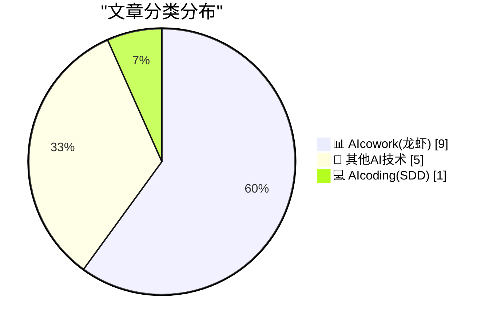
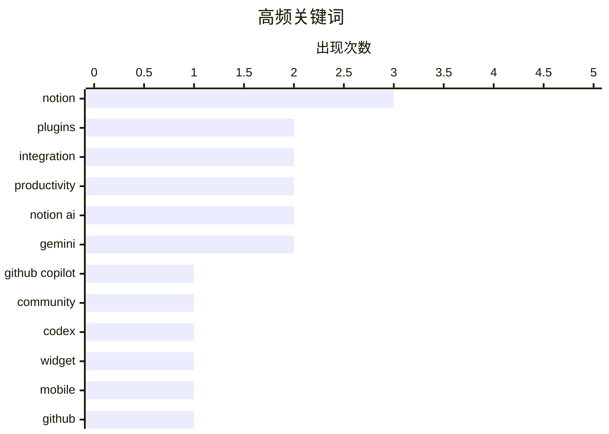

# 📰 AI 博客每日精选 — 2026-03-27

> 来自 98 个技术博客和社交媒体源，AI 精选 Top 15

## 📝 今日看点

今日技术圈的核心焦点是AI与工作流的深度融合。AI编码助手正通过插件和社区资源积极嵌入开发者现有工具链，提升编程效率。同时，以Notion和Google Workspace为代表的平台，正大力将AI能力转化为智能代理和自动化流程，重塑日常办公与协作模式。

---

## 🏆 今日必读

🥇 **Awesome GitHub Copilot 项目有了新家**

[🆕 The Awesome GitHub Copilot project has a new home. Head over to explore hundreds of community-built customizations: 🔍 Full-text search for age...](https://x.com/github/status/2037587970052485191) — 𝕏 @GitHub · 3 小时前 · 💻 AIcoding(SDD)

> GitHub Copilot 的社区资源项目“Awesome GitHub Copilot”已迁移至新平台。新平台汇集了数百个社区构建的自定义内容，包括代理和技能的全文搜索功能、专用的学习中心，以及为 Copilot CLI 和 VS Code 提供的一键插件安装。该项目完全由社区驱动，旨在方便开发者探索和共享 Copilot 的扩展用法。

💡 **为什么值得读**: 这是探索和获取 GitHub Copilot 高级用法及社区插件的一站式入口，能极大提升开发效率。

🏷️ GitHub Copilot, Plugins, Community

🥈 **OpenAI 为 Codex 推出插件功能**

[RT OpenAI Developers: We're rolling out plugins in Codex. Codex now works seamlessly out of the box with the most important tools builders already use...](https://x.com/OpenAI/status/2037298931907084568) — 𝕏 @OpenAI · 23 小时前 · 📊 AIcowork(龙虾)

> OpenAI 正在为 Codex 模型推出插件系统。Codex 现已能与 Slack、Figma、Notion、Gmail 等开发者常用工具开箱即用地无缝集成。此举旨在让 AI 编码助手直接融入现有工作流，提升工具链的连贯性。

💡 **为什么值得读**: 了解 Codex 如何通过插件生态打破工具壁垒，实现更智能的跨平台开发辅助。

🏷️ Codex, Plugins, Integration

🥉 **Notion 推出全新桌面小组件**

[Just shipped: a new Notion widget! One tap from your home screen → open AI chat, camera, or voice input.](https://x.com/NotionHQ/status/2037593512385130868) — 𝕏 @NotionHQ · 3 小时前 · 📊 AIcowork(龙虾)

> Notion 发布了一款新的桌面小组件。用户只需在手机主屏幕轻点一下，即可快速启动 AI 聊天、相机或语音输入功能，直达 Notion 的 AI 能力。

💡 **为什么值得读**: 通过小组件将 Notion AI 的入口前置到主屏幕，是提升移动端工作效率的实用设计。

🏷️ Notion, Widget, Mobile

4️⃣ **新版 GitHub 仓库仪表盘正式发布**

[The new GitHub repository dashboard is now generally available. You can now find, specify, and save custom views of your projects in seconds. 🔍 Fil...](https://x.com/github/status/2037283646483181926) — 𝕏 @GitHub · 23 小时前 · 🔬 其他AI技术

> GitHub 全新的仓库仪表盘现已全面开放使用。该功能允许用户在几秒钟内查找、指定并保存项目的自定义视图。核心功能包括按语言或组织筛选、通过命令面板搜索以及收藏常用查询。

💡 **为什么值得读**: 对于管理大量仓库的开发者或团队负责人，此功能能显著改善项目导航与管理的效率。

🏷️ GitHub, Dashboard, Productivity

5️⃣ **Notion 独立 AI 应用提升测试人员上限并改进功能**

[RT JT: We just increased the tester limit for the standalone Notion AI app. We fixed the crashes, added the mention menu, and improved custom agent se...](https://x.com/NotionHQ/status/2037620104922619974) — 𝕏 @NotionHQ · 1 小时前 · 📊 AIcowork(龙虾)

> Notion 提高了其独立 AI 应用的测试人员数量限制。最新版本修复了崩溃问题，增加了提及菜单，并改进了自定义代理设置。

💡 **为什么值得读**: 关注 Notion AI 独立应用的最新进展和功能迭代，抢先体验其作为专用工具的表现。

🏷️ Notion AI, App, Beta

---

## 📊 数据概览

| 扫描源 | 抓取文章 | 时间范围 | 精选 |
|:---:|:---:|:---:|:---:|
| 73/98 | 2440 篇 → 25 篇 | 24h | **15 篇** |

### 分类分布



### 高频关键词



<details>
<summary>📈 纯文本关键词图（终端友好）</summary>

```
notion         │ ████████████████████ 3
plugins        │ █████████████░░░░░░░ 2
integration    │ █████████████░░░░░░░ 2
productivity   │ █████████████░░░░░░░ 2
notion ai      │ █████████████░░░░░░░ 2
gemini         │ █████████████░░░░░░░ 2
github copilot │ ███████░░░░░░░░░░░░░ 1
community      │ ███████░░░░░░░░░░░░░ 1
codex          │ ███████░░░░░░░░░░░░░ 1
widget         │ ███████░░░░░░░░░░░░░ 1
```

</details>

### 🏷️ 话题标签

**notion**(3) · **plugins**(2) · **integration**(2) · productivity(2) · notion ai(2) · gemini(2) · github copilot(1) · community(1) · codex(1) · widget(1) · mobile(1) · github(1) · dashboard(1) · app(1) · beta(1) · onboarding(1) · gmail(1) · meeting scheduling(1) · google sheets(1) · data analysis(1)

---

====================

## 📊 AIcowork(龙虾)

### 1. OpenAI 为 Codex 推出插件功能

[RT OpenAI Developers: We're rolling out plugins in Codex. Codex now works seamlessly out of the box with the most important tools builders already use...](https://x.com/OpenAI/status/2037298931907084568) — **𝕏 @OpenAI** · 23 小时前 · ⭐ 20/25

> OpenAI 正在为 Codex 模型推出插件系统。Codex 现已能与 Slack、Figma、Notion、Gmail 等开发者常用工具开箱即用地无缝集成。此举旨在让 AI 编码助手直接融入现有工作流，提升工具链的连贯性。

🏷️ Codex, Plugins, Integration

📌 AIcowork(龙虾)

---

### 2. Notion 推出全新桌面小组件

[Just shipped: a new Notion widget! One tap from your home screen → open AI chat, camera, or voice input.](https://x.com/NotionHQ/status/2037593512385130868) — **𝕏 @NotionHQ** · 3 小时前 · ⭐ 18/25

> Notion 发布了一款新的桌面小组件。用户只需在手机主屏幕轻点一下，即可快速启动 AI 聊天、相机或语音输入功能，直达 Notion 的 AI 能力。

🏷️ Notion, Widget, Mobile

📌 AIcowork(龙虾)

---

### 3. Notion 独立 AI 应用提升测试人员上限并改进功能

[RT JT: We just increased the tester limit for the standalone Notion AI app. We fixed the crashes, added the mention menu, and improved custom agent se...](https://x.com/NotionHQ/status/2037620104922619974) — **𝕏 @NotionHQ** · 1 小时前 · ⭐ 17/25

> Notion 提高了其独立 AI 应用的测试人员数量限制。最新版本修复了崩溃问题，增加了提及菜单，并改进了自定义代理设置。

🏷️ Notion AI, App, Beta

📌 AIcowork(龙虾)

---

### 4. 用户分享：Notion AI 对新员工帮助巨大

[RT JH Scherck: Notion AI is so damn helpful for new employees:](https://x.com/NotionHQ/status/2037331682857255194) — **𝕏 @NotionHQ** · 21 小时前 · ⭐ 17/25

> 一则用户分享指出，Notion AI 对新员工入职和工作上手提供了极大帮助。具体应用场景未在推文中详述，但肯定了其在辅助新人方面的价值。

🏷️ Notion AI, Onboarding, Productivity

📌 AIcowork(龙虾)

---

### 5. Gmail 整合 Gemini：基于邮件上下文智能安排会议

[Scheduling shouldn't be a hassle. 🗓️ Help me schedule in Gmail pulls ideal time slots based on your availability in Google Calendar and the contex...](https://x.com/GoogleWorkspace/status/2037621428204269794) — **𝕏 @GoogleWorkspace** · 1 小时前 · ⭐ 17/25

> Google 在 Gmail 中推出了由 Gemini 驱动的“Help me schedule”功能。该功能能根据 Google Calendar 中的空闲时间和电子邮件上下文，智能推荐理想的会议时间。目标是让用户专注于会议议程而非后勤安排。

🏷️ Gemini, Gmail, Meeting Scheduling

📌 AIcowork(龙虾)

---

### 6. 利用 Gemini 在 Sheets 中整合与分析分散数据

[Put your scattered data to work with Gemini in Sheets. Organize and analyze the data you need from a single prompt. 📈 → https://goo.gle/3PyEapS](https://x.com/GoogleWorkspace/status/2037561032319627313) — **𝕏 @GoogleWorkspace** · 5 小时前 · ⭐ 17/25

> Google Sheets 集成了 Gemini 能力，可将分散的数据整合并加以分析。用户通过单一提示即可组织并分析所需数据。

🏷️ Gemini, Google Sheets, Data Analysis

📌 AIcowork(龙虾)

---

### 7. 通过智能代理连接 NotionMail 与 Notion

[RT Sam H Li: Re @NotionMail meets @NotionHQ…all via an agent🙂](https://x.com/NotionHQ/status/2037564366506369428) — **𝕏 @NotionHQ** · 5 小时前 · ⭐ 16/25

> 一则演示展示了如何通过一个智能代理（Agent）将 NotionMail 与 Notion 主页连接起来。视频显示了邮件内容如何经由代理自动处理并同步至 Notion。

🏷️ Notion, Agent, Integration

📌 AIcowork(龙虾)

---

### 8. Notion 将举办自定义智能代理构建研讨会

[RT Brian Lovin: Let’s make some custom agents! Join us next week 👇](https://x.com/NotionHQ/status/2037606897998844056) — **𝕏 @NotionHQ** · 2 小时前 · ⭐ 15/25

> Notion 宣布将举办一场关于构建自定义智能代理的线上研讨会。会议将分享如何利用 Notion 构建每日简报、营销漏斗和内容管道等自动化工作流，并提供相关模板。Notion 的 Brian Lovin 将参与分享。

🏷️ Notion, Custom Agents, Automation

📌 AIcowork(龙虾)

---

### 9. Slack：智能体驱动型企业的操作系统

[Slack is the operating system for the agentic enterprise. 👏](https://x.com/SlackHQ/status/2037534119689593108) — **𝕏 @SlackHQ** · 7 小时前 · ⭐ 12/25

> Slack 正在重新定位为“智能体驱动型企业的操作系统”，旨在通过 AI 简化企业复杂性。其核心理念是 Slack 本质上是一个伪装成消息工具的搜索和 AI 工具。该平台的新愿景是像操作系统抽象硬件一样，抽象和协调企业中的各种 AI 智能体与工作流。这标志着 Slack 从团队协作工具向企业智能中枢的战略转型。

🏷️ Slack, Agentic Enterprise, AI Tool

📌 AIcowork(龙虾)

---

## 🔬 其他AI技术

### 10. 新版 GitHub 仓库仪表盘正式发布

[The new GitHub repository dashboard is now generally available. You can now find, specify, and save custom views of your projects in seconds. 🔍 Fil...](https://x.com/github/status/2037283646483181926) — **𝕏 @GitHub** · 23 小时前 · ⭐ 17/25

> GitHub 全新的仓库仪表盘现已全面开放使用。该功能允许用户在几秒钟内查找、指定并保存项目的自定义视图。核心功能包括按语言或组织筛选、通过命令面板搜索以及收藏常用查询。

🏷️ GitHub, Dashboard, Productivity

📌 其他AI技术

---

### 11. Google Cloud Next：从测试走向转型

[RT Google Cloud: It’s time to move from testing to transforming. Take a look at transformation in action during this Spotlight at #GoogleCloudNext wi...](https://x.com/GoogleWorkspace/status/2037632000178192556) — **𝕏 @GoogleWorkspace** · 5 小时前 · ⭐ 11/25

> Google Cloud 在 Google Cloud Next 大会上强调，企业应将 AI 从测试阶段推进到全面的业务转型。大会通过实际案例展示了企业如何利用 Google Cloud 技术实现转型。其核心呼吁是领导者不应只是旁观技术变革，而应主动引领这一进程。这标志着 AI 应用正从概念验证迈向规模化、生产级的深度整合。

🏷️ Google Cloud, AI Transformation, Enterprise

📌 其他AI技术

---

### 12. 系统震撼：一款字体时隔25年的复仇

[System shock](https://aresluna.org/system-shock) — **aresluna.org** · 6 小时前 · ⭐ 7/25

> 本文讲述了一款拥有25年历史的字体在数字时代重新焕发生机并引发广泛关注的故事。文章最初发表于2015年10月，本次为更新版本，全文约1100词。它通过一个具体的字体案例，探讨了设计、技术遗产与数字复兴的主题。故事揭示了经典设计在新技术环境下可能产生的持久影响和意外回归。

🏷️ Font, Design, History

📌 其他AI技术

---

### 13. 非白人男性撰写的 UX 书籍清单

[UX books not written by white men](https://aresluna.org/ux-books-not-written-by-white-men) — **aresluna.org** · 6 小时前 · ⭐ 6/25

> 这是一个由社区众包收集的 UX（用户体验）书籍清单，特别聚焦于非白人男性作者的作品。清单旨在丰富和多元化 UX 领域的知识来源与视角。它为用户、学生和从业者提供了一个发现不同背景作者重要著作的宝贵资源。通过汇集多元声音，该清单挑战了该领域传统上的作者构成。

🏷️ UX, Books, Diversity

📌 其他AI技术

---

### 14. 用树莓派 FireWire HAT 模块让 MiniDV 摄像机重获新生

[Bring back MiniDV with this Raspberry Pi FireWire HAT](https://www.jeffgeerling.com/blog/2026/minidv-with-raspberry-pi-firewire-hat/) — **jeffgeerling.com** · 7 小时前 · ⭐ 5/25

> 作者展示如何利用一款新的 FireWire HAT 扩展板和 PiSugar3 Plus 电池，将树莓派改造成便携式“内存录制单元”（MRU）。该方案旨在取代老式 FireWire/i.Link/DV 摄像机中的磁带，实现数字化录制。这是对前文“在树莓派上使用 FireWire”教程的实际应用延伸。此项目为保存和利用旧式摄像设备提供了经济且创新的技术解决方案。

🏷️ Raspberry Pi, Hardware

📌 其他AI技术

---

## 💻 AIcoding(SDD)

### 15. Awesome GitHub Copilot 项目有了新家

[🆕 The Awesome GitHub Copilot project has a new home. Head over to explore hundreds of community-built customizations: 🔍 Full-text search for age...](https://x.com/github/status/2037587970052485191) — **𝕏 @GitHub** · 3 小时前 · ⭐ 21/25

> GitHub Copilot 的社区资源项目“Awesome GitHub Copilot”已迁移至新平台。新平台汇集了数百个社区构建的自定义内容，包括代理和技能的全文搜索功能、专用的学习中心，以及为 Copilot CLI 和 VS Code 提供的一键插件安装。该项目完全由社区驱动，旨在方便开发者探索和共享 Copilot 的扩展用法。

🏷️ GitHub Copilot, Plugins, Community

📌 AIcoding(SDD)

---

====================

*生成于 2026-03-27 21:33 | 扫描 73 源 → 获取 2440 篇 → 精选 15 篇*
*基于 [Hacker News Popularity Contest 2025](https://refactoringenglish.com/tools/hn-popularity/) RSS 源列表，由 [Andrej Karpathy](https://x.com/karpathy) 推荐*
*由「懂点儿AI」制作，欢迎关注同名微信公众号获取更多 AI 实用技巧 💡*
