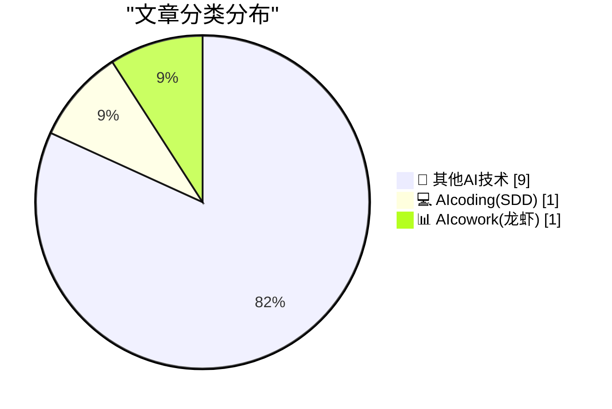
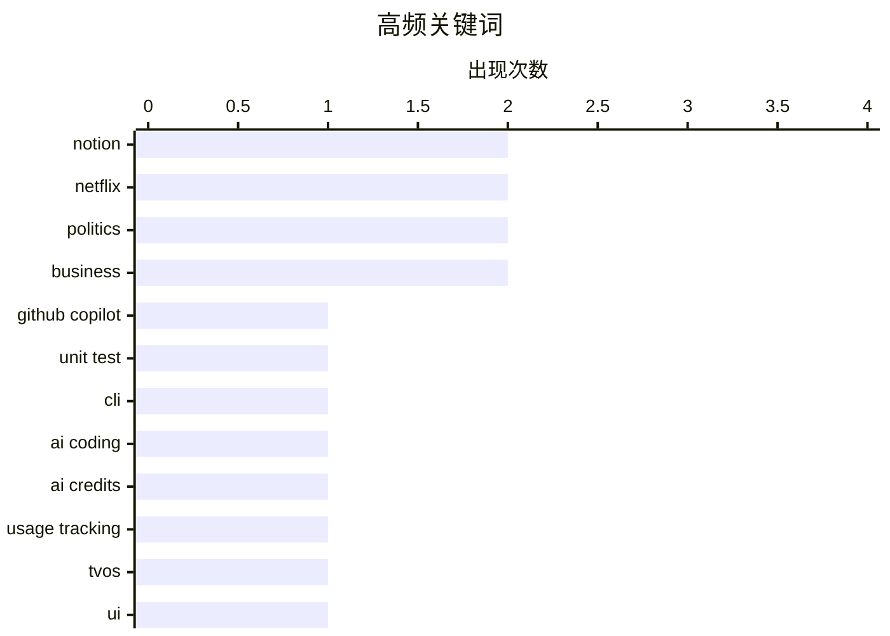

# 📰 AI 博客每日精选 — 2026-03-28

> 来自 98 个技术博客和社交媒体源，AI 精选 Top 11

## 📝 今日看点

今日技术圈聚焦于AI工具深度集成与平台商业化进程。AI编程助手正从代码编辑向终端等更广泛的开发场景渗透，提升自动化水平。同时，主流平台正加速商业化步伐，通过引入广告、调整订阅策略等方式寻求增长，但需警惕对用户体验的潜在影响。此外，头部科技公司持续强化其生态系统的安全与功能壁垒。

---

## 🏆 今日必读

🥇 **GitHub Copilot CLI：在终端中快速生成健壮的单元测试套件**

[Every dev knows unit tests are important ... and every dev has a project missing them. 😅 With GitHub Copilot CLI, you can quickly generate a robust...](https://x.com/github/status/2037959242863247423) — 𝕏 @GitHub · 3 小时前 · 💻 AIcoding(SDD)

> GitHub Copilot CLI 提供了一种从终端快速生成单元测试的解决方案，以解决开发者明知重要却常遗漏测试的痛点。用户可通过进入计划模式（Shift-Tab）、启动自动代理群以及使用 `/tasks` 命令监控进度来快速创建健壮的测试套件。该工具旨在将测试生成流程无缝集成到开发者的命令行工作流中，提升开发效率。

💡 **为什么值得读**: 对于希望将单元测试快速集成到现有项目、并寻求命令行高效工作流的开发者，这是一个实用的工具指南。

🏷️ GitHub Copilot, Unit Test, CLI, AI Coding

🥈 **Notion 新增每日信用额度使用查看功能**

[RT andy: we added the ability to view your daily credit use in addition to your cumulative credit use. unfortunately coinboi doesn't hang around this ...](https://x.com/NotionHQ/status/2037705089734062445) — 𝕏 @NotionHQ · 21 小时前 · 📊 AIcowork(龙虾)

> Notion 为其用户界面添加了每日信用额度使用情况的查看功能，作为对累计使用数据的补充。这一更新为用户提供了更细粒度的资源消耗监控能力，有助于更好地管理使用成本。尽管其标志性的“coinboi”动画未在此视图中出现，但该功能本身仍具实用性。

💡 **为什么值得读**: 对于需要精细控制和管理其 Notion API 使用成本与配额的用户，此功能提供了直接的数据支持。

🏷️ Notion, AI Credits, Usage Tracking

🥉 **Netflix 搞砸了其 tvOS 视频播放器**

[Netflix Wrecked Their tvOS Video Player](https://www.pocket-lint.com/netflix-just-made-their-app-worse-and-theres-no-way-to-fix-it/) — daringfireball.net · 5 小时前 · 🔬 其他AI技术

> Netflix 近期对 tvOS 版应用进行更新，导致视频播放器的用户体验显著下降。主要问题在于快进和快退功能变得难以使用，操作逻辑被更改，引发了 Apple TV 用户的普遍不满。这些看似微小的改动在实际使用中带来了显著的挫败感。此次更新被广泛认为是一次用户体验的倒退。

💡 **为什么值得读**: 如果你是 Apple TV 的 Netflix 用户，了解此次负面更新有助于理解当前使用中可能遇到的困扰。

🏷️ Netflix, tvOS, UI

4️⃣ **特朗普将其签名印上美元钞票**

[Trump Is Putting His Signature on U.S. Currency](https://www.nytimes.com/2026/03/26/us/politics/trump-signature-us-dollars.html) — daringfireball.net · 6 小时前 · 🔬 其他AI技术

> 美国财政部宣布，特朗普总统的签名将于今年晚些时候出现在美元纸币上。此举是为纪念美国建国250周年而做出的前所未有的改变，特朗普将成为首位在任期内将签名印在流通货币上的美国总统。他的签名将单独出现在纸币上，而非与财政部长签名并列。

💡 **为什么值得读**: 此新闻涉及美国货币设计与政治象征意义的重大历史性变化，具有标志性意义。

🏷️ Politics, Currency

5️⃣ **纽约邮报：特朗普考虑重新命名霍尔木兹海峡**

[New York Post: ‘Trump Considers Renaming Strait of Hormuz’](https://nypost.com/2026/03/27/us-news/trump-considers-renaming-strait-of-hormuz-after-either-america-or-himself-once-he-evicts-iran/) — daringfireball.net · 6 小时前 · 🔬 其他AI技术

> 据《纽约邮报》报道，特朗普总统正优先考虑夺取霍尔木兹海峡的控制权，并对盟友未能协助打通这一关键水道感到沮丧。报道称，一旦结束伊朗对该海峡航运的“恐怖统治”，特朗普考虑以“美国”或他自己的名字来重新命名该海峡。该报道源自右翼媒体，其可信度需谨慎看待。

💡 **为什么值得读**: 该报道揭示了地缘政治中一个极具争议性的潜在动向，尽管来源需要甄别，但话题本身引人关注。

🏷️ Politics, Geopolitics

---

## 📊 数据概览

| 扫描源 | 抓取文章 | 时间范围 | 精选 |
|:---:|:---:|:---:|:---:|
| 77/98 | 2505 篇 → 11 篇 | 24h | **11 篇** |

### 分类分布



### 高频关键词



<details>
<summary>📈 纯文本关键词图（终端友好）</summary>

```
notion         │ ████████████████████ 2
netflix        │ ████████████████████ 2
politics       │ ████████████████████ 2
business       │ ████████████████████ 2
github copilot │ ██████████░░░░░░░░░░ 1
unit test      │ ██████████░░░░░░░░░░ 1
cli            │ ██████████░░░░░░░░░░ 1
ai coding      │ ██████████░░░░░░░░░░ 1
ai credits     │ ██████████░░░░░░░░░░ 1
usage tracking │ ██████████░░░░░░░░░░ 1
```

</details>

### 🏷️ 话题标签

**notion**(2) · **netflix**(2) · **politics**(2) · business(2) · github copilot(1) · unit test(1) · cli(1) · ai coding(1) · ai credits(1) · usage tracking(1) · tvos(1) · ui(1) · currency(1) · geopolitics(1) · media(1) · subscribers(1) · apple(1) · security(1) · lockdown mode(1) · apple maps(1)

---

====================

## 🔬 其他AI技术

### 1. Netflix 搞砸了其 tvOS 视频播放器

[Netflix Wrecked Their tvOS Video Player](https://www.pocket-lint.com/netflix-just-made-their-app-worse-and-theres-no-way-to-fix-it/) — **daringfireball.net** · 5 小时前 · ⭐ 5/25

> Netflix 近期对 tvOS 版应用进行更新，导致视频播放器的用户体验显著下降。主要问题在于快进和快退功能变得难以使用，操作逻辑被更改，引发了 Apple TV 用户的普遍不满。这些看似微小的改动在实际使用中带来了显著的挫败感。此次更新被广泛认为是一次用户体验的倒退。

🏷️ Netflix, tvOS, UI

📌 其他AI技术

---

### 2. 特朗普将其签名印上美元钞票

[Trump Is Putting His Signature on U.S. Currency](https://www.nytimes.com/2026/03/26/us/politics/trump-signature-us-dollars.html) — **daringfireball.net** · 6 小时前 · ⭐ 5/25

> 美国财政部宣布，特朗普总统的签名将于今年晚些时候出现在美元纸币上。此举是为纪念美国建国250周年而做出的前所未有的改变，特朗普将成为首位在任期内将签名印在流通货币上的美国总统。他的签名将单独出现在纸币上，而非与财政部长签名并列。

🏷️ Politics, Currency

📌 其他AI技术

---

### 3. 纽约邮报：特朗普考虑重新命名霍尔木兹海峡

[New York Post: ‘Trump Considers Renaming Strait of Hormuz’](https://nypost.com/2026/03/27/us-news/trump-considers-renaming-strait-of-hormuz-after-either-america-or-himself-once-he-evicts-iran/) — **daringfireball.net** · 6 小时前 · ⭐ 5/25

> 据《纽约邮报》报道，特朗普总统正优先考虑夺取霍尔木兹海峡的控制权，并对盟友未能协助打通这一关键水道感到沮丧。报道称，一旦结束伊朗对该海峡航运的“恐怖统治”，特朗普考虑以“美国”或他自己的名字来重新命名该海峡。该报道源自右翼媒体，其可信度需谨慎看待。

🏷️ Politics, Geopolitics

📌 其他AI技术

---

### 4. 商业内幕的订阅用户螺旋式下降

[Business Insider’s Subscriber Spiral](https://www.status.news/p/business-insider-subscription-decline-data) — **daringfireball.net** · 20 小时前 · ⭐ 5/25

> 《商业内幕》的付费订阅用户数量在过去三年持续大幅下滑。数据显示，其用户数从2022年的约18.5万降至2023年的16万（下降14%），2024年降至15万（再降6%），到2025年进一步跌至约13.5万（又降10%）。三年内总订阅量下降了约27%，显示出其订阅业务面临严峻挑战。

🏷️ Media, Subscribers, Business

📌 其他AI技术

---

### 5. 苹果称未发现锁定模式曾被成功攻破

[Apple Says It’s Not Aware of Lockdown Mode Ever Having Been Exploited](https://techcrunch.com/2026/03/27/apple-says-no-one-using-lockdown-mode-has-been-hacked-with-spyware/) — **daringfireball.net** · 21 小时前 · ⭐ 5/25

> 苹果公司宣布，自近四年前推出锁定模式这一高级安全功能以来，尚未发现任何启用该模式的设备被雇佣间谍软件成功入侵的案例。苹果发言人明确表示，未意识到有针对启用锁定模式的苹果设备的成功攻击。这一声明证实了锁定模式在抵御最复杂攻击方面的有效性。

🏷️ Apple, Security, Lockdown Mode

📌 其他AI技术

---

### 6. 苹果宣布广告将登陆 Apple Maps

[Apple Announces Ads Are Coming to Apple Maps](https://www.apple.com/newsroom/2026/03/introducing-apple-business-a-new-all-in-one-platform-for-businesses-of-all-sizes/) — **daringfireball.net** · 21 小时前 · ⭐ 5/25

> 苹果将于今年夏季在美国和加拿大为 Apple Maps 引入广告业务。企业可以通过新的“Apple Business”平台创建地图广告，广告将出现在用户搜索结果的顶部（基于相关性）以及新的“推荐地点”体验顶部。广告会明确标注以确保透明度，这是苹果为其地图服务商业化迈出的关键一步。

🏷️ Apple Maps, Ads, Business

📌 其他AI技术

---

### 7. Netflix 再次涨价

[Netflix Raises Prices Again](https://variety.com/2026/tv/news/why-netflix-hiked-prices-explained-chart-1236701365/) — **daringfireball.net** · 21 小时前 · ⭐ 5/25

> Netflix 于3月26日起实施新一轮全球涨价。其中，标准无广告套餐从17.99美元涨至19.99美元，广告支持套餐从7.99美元涨至8.99美元，顶级无广告套餐从24.99美元涨至26.99美元。此次调价适用于新用户，并将在当前用户的计费周期内逐步生效。

🏷️ Netflix, Pricing, Streaming

📌 其他AI技术

---

### 8. OpenBenches 收录纪念长椅数量突破 4 万张

[OpenBenches hits 40k](https://shkspr.mobi/blog/2026/03/openbenches-hits-40k/) — **shkspr.mobi** · 8 小时前 · ⭐ 5/25

> 众包纪念长椅数据库网站 OpenBenches 收录的条目数量已突破 40,000 个大关。该网站在2023年11月达到3万条记录后，于2026年3月初由长期贡献者添加了一张精美的纪念长椅，实现了这一里程碑。网站利用先进的机器学习技术来分析和展示其增长数据。

🏷️ Open Data, Crowdsourcing, Memorial

📌 其他AI技术

---

### 9. A li’l quality-of-life update: Mute replies to discussions you’re done with. Peace and quiet, until someone @-mentions you.

[A li’l quality-of-life update: Mute replies to discussions you’re done with. Peace and quiet, until someone @-mentions you.](https://x.com/NotionHQ/status/2037656136762233343) — **𝕏 @NotionHQ** · 23 小时前 · ⭐ 5/25

> A li’l quality-of-life update: Mute replies to discussions you’re done with.<br><br>Peace and quiet, until someone @-mentions you.<br> GitHub Copilot CLI 提供了一种从终端快速生成单元测试的解决方案，以解决开发者明知重要却常遗漏测试的痛点。用户可通过进入计划模式（Shift-Tab）、启动自动代理群以及使用 `/tasks` 命令监控进度来快速创建健壮的测试套件。该工具旨在将测试生成流程无缝集成到开发者的命令行工作流中，提升开发效率。

🏷️ GitHub Copilot, Unit Test, CLI, AI Coding

📌 AIcoding(SDD)

---

## 📊 AIcowork(龙虾)

### 11. Notion 新增每日信用额度使用查看功能

[RT andy: we added the ability to view your daily credit use in addition to your cumulative credit use. unfortunately coinboi doesn't hang around this ...](https://x.com/NotionHQ/status/2037705089734062445) — **𝕏 @NotionHQ** · 21 小时前 · ⭐ 19/25

> Notion 为其用户界面添加了每日信用额度使用情况的查看功能，作为对累计使用数据的补充。这一更新为用户提供了更细粒度的资源消耗监控能力，有助于更好地管理使用成本。尽管其标志性的“coinboi”动画未在此视图中出现，但该功能本身仍具实用性。

🏷️ Notion, AI Credits, Usage Tracking

📌 AIcowork(龙虾)

---

====================

*生成于 2026-03-28 21:29 | 扫描 77 源 → 获取 2505 篇 → 精选 11 篇*
*基于 [Hacker News Popularity Contest 2025](https://refactoringenglish.com/tools/hn-popularity/) RSS 源列表，由 [Andrej Karpathy](https://x.com/karpathy) 推荐*
*由「懂点儿AI」制作，欢迎关注同名微信公众号获取更多 AI 实用技巧 💡*
