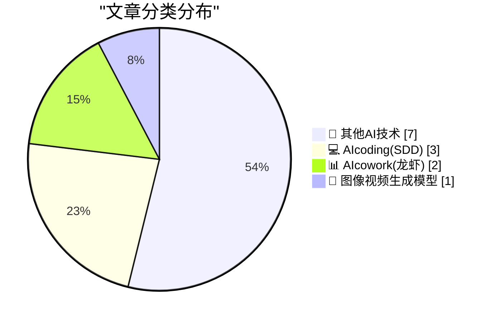
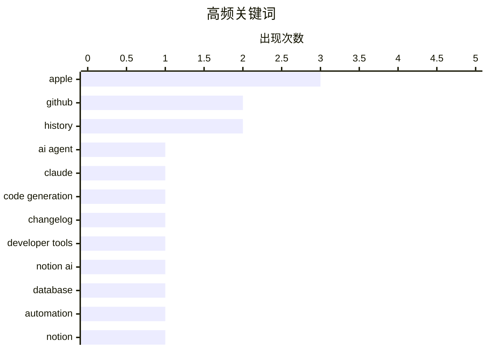

# 📰 AI 博客每日精选 — 2026-03-29

> 来自 98 个技术博客和社交媒体源，AI 精选 Top 13

## 📝 今日看点

今日技术圈聚焦于AI工具向深度集成与自动化演进。AI编码助手正从代码补全迈向理解项目上下文、自动完成复杂集成任务的新阶段。同时，AI与协作平台的融合持续深化，通过自然语言交互和智能代理能力重塑工作流管理。此外，图像生成等关键领域即将迎来重大版本更新，预示着新一轮能力跃迁。

---

## 🏆 今日必读

🥇 **WorkOS**

[WorkOS](https://workos.com/docs/authkit/cli-installer?utm_source=daringfireball&amp;utm_medium=newsletter&amp;utm_campaign=q12026) — daringfireball.net · 40 分钟前 · 💻 AIcoding(SDD)

> WorkOS 发布了一款由 Claude 驱动的 AI 代理 CLI 工具，用于自动化身份验证集成。该工具能自动读取项目代码、检测技术框架，并将完整的身份验证功能直接写入代码库，无需预先注册。它还能创建环境、自动填充密钥，并允许用户在准备好后再认领账户。此外，通过 WorkOS Skills 和 `workos seed` 命令，该 CLI 能将代理转变为 WorkOS 专家，并将环境定义为代码。

💡 **为什么值得读**: 该工具极大简化了开发者集成企业级身份验证的流程，通过 AI 代理实现‘零配置’自动化，是提升开发效率的实用方案。

🏷️ AI Agent, Claude, Code Generation

🥈 **GitHub 更新日志**

[Get every update about GitHub. 🔔 Follow our changelog. ⬇️ https://github.blog/changelog/](https://x.com/github/status/2038315376535068961) — 𝕏 @GitHub · 3 小时前 · 💻 AIcoding(SDD)

> GitHub 官方推荐用户关注其更新日志（Changelog）以获取所有平台更新信息。更新日志是 GitHub 发布新功能、变更和产品动态的官方渠道。通过关注该日志，开发者可以及时了解 API 变更、功能发布和安全更新等关键信息。这有助于团队保持开发环境与最新实践同步。

💡 **为什么值得读**: 对于依赖 GitHub 进行开发和协作的团队，这是获取第一手官方更新、避免兼容性问题的必备信息来源。

🏷️ GitHub, Changelog, Developer Tools

🥉 **Notion AI 创建自定义地图**

[RT Geoffrey Litt: me: wish I had a custom map of local bike shops, with the exact criteria I'm looking for Notion AI:](https://x.com/NotionHQ/status/2038323800241320358) — 𝕏 @NotionHQ · 3 小时前 · 📊 AIcowork(龙虾)

> 用户展示了 Notion AI 根据特定需求生成定制化地图的能力。案例中，用户希望获得一张符合其精确筛选条件（如特定类型的本地自行车店）的定制地图。Notion AI 能够理解自然语言描述的需求，并自动生成包含地理位置和筛选结果的可视化地图。这体现了 AI 如何将复杂的数据查询和可视化任务变得简单直观。

💡 **为什么值得读**: 这个案例生动展示了 Notion AI 如何将抽象的个人需求转化为结构化的实用工具，体现了其强大的自然语言理解和自动化生成能力。

🏷️ Notion AI, Database, Automation

4️⃣ **Notion 数据库代理改变游戏规则**

[RT Saksham Chauhan: Been using Notion for 5 years. Started with study schedules. Now it runs my entire agency CRM, client onboarding, project tracking...](https://x.com/NotionHQ/status/2038330083082178664) — 𝕏 @NotionHQ · 8 小时前 · 📊 AIcowork(龙虾)

> 一位长达五年的 Notion 用户分享了其如何从管理学习计划发展到用 Notion 运营整个代理机构的 CRM、客户 onboarding 和项目追踪。新推出的“数据库代理”功能改变了游戏规则，它是一组 AI 代理，能利用页面上下文、工作区信息和网络数据自动更新数据库。这消除了“稍后更新”却永不执行的拖延问题，使 Notion 从“有条理”进化为“自主运行”的系统。

💡 **为什么值得读**: 它揭示了 Notion 如何通过 AI 代理实现数据维护自动化，对于希望减少手动操作、提升系统自主性的团队具有重要参考价值。

🏷️ Notion, AI Agents, Workflow

5️⃣ **Midjourney 即将发布革命性 V8 新版本**

[RT David: We've got a really cool & radically different version of V8 coming very soon. The prev version was called "V8 Alpha", but im not sure if any...](https://x.com/midjourney/status/2038112437510271473) — 𝕏 @midjourney · 17 小时前 · 🎨 图像视频生成模型

> Midjourney 透露即将发布一个“非常酷且 radically different”的 V8 新版本。此前版本曾被称为“V8 Alpha”，但团队不确定用户是否理解“Alpha”的含义。目前正在为新版本命名而犹豫，候选名称包括“V8 Beta”、“V8”或“V8.1”。这暗示了新版本可能不是一次简单的迭代，而是一次重大更新。

💡 **为什么值得读**: 对于关注 AI 图像生成前沿进展的用户，此消息预告了 Midjourney 核心模型可能迎来的一次重要技术飞跃。

🏷️ Midjourney, V8, Image Generation

---

## 📊 数据概览

| 扫描源 | 抓取文章 | 时间范围 | 精选 |
|:---:|:---:|:---:|:---:|
| 78/98 | 2427 篇 → 13 篇 | 24h | **13 篇** |

### 分类分布



### 高频关键词



<details>
<summary>📈 纯文本关键词图（终端友好）</summary>

```
apple           │ ████████████████████ 3
github          │ █████████████░░░░░░░ 2
history         │ █████████████░░░░░░░ 2
ai agent        │ ███████░░░░░░░░░░░░░ 1
claude          │ ███████░░░░░░░░░░░░░ 1
code generation │ ███████░░░░░░░░░░░░░ 1
changelog       │ ███████░░░░░░░░░░░░░ 1
developer tools │ ███████░░░░░░░░░░░░░ 1
notion ai       │ ███████░░░░░░░░░░░░░ 1
database        │ ███████░░░░░░░░░░░░░ 1
```

</details>

### 🏷️ 话题标签

**apple**(3) · **github**(2) · **history**(2) · ai agent(1) · claude(1) · code generation(1) · changelog(1) · developer tools(1) · notion ai(1) · database(1) · automation(1) · notion(1) · ai agents(1) · workflow(1) · midjourney(1) · v8(1) · image generation(1) · package management(1) · software design(1) · podcast(1)

---

====================

## 🔬 其他AI技术

### 1. The Talk Show: ‘你会遇到一些小麻烦’

[The Talk Show: ‘You’re Going to Have the Niggles’](https://daringfireball.net/thetalkshow/2026/03/29/ep-444) — **daringfireball.net** · 41 分钟前 · ⭐ 6/25

> 本期播客邀请 Christina Warren 回归，重点讨论了苹果公司一个月内的多项产品发布，特别是 iPhone 17e 和 MacBook Neo。对话深入探讨了这些新产品的特点、市场定位以及可能存在的争议或“小麻烦”。节目同时也缅怀了被搁置的 Mac Pro 产品线。节目由 Squarespace 和 Sentry 赞助，并为听众提供了优惠码。

🏷️ Apple, Podcast

📌 其他AI技术

---

### 2. 版本历史： ‘麦金塔电脑’

[Version History: ‘The Macintosh’](https://www.theverge.com/podcast/903068/macintosh-1984-version-history) — **daringfireball.net** · 41 分钟前 · ⭐ 6/25

> 本期《版本历史》播客讲述了原始 Macintosh 的故事。尽管初期销量不佳，但 Macintosh 在关键理念上是正确的：它预见了未来个人电脑的使用方式，坚信电脑应该更简单易用，并证明了软硬件深度整合的设计能产生巨大差异。节目认为，正是这些理念永久地改变了计算机的发展轨迹，奠定了现代计算体验的基础。

🏷️ Macintosh, History

📌 其他AI技术

---

### 3. The Verge: ‘评选苹果过去50年最佳产品’

[The Verge: ‘Rank the Best Apple Products From the Last 50 Years’](https://www.theverge.com/cs/tech/900477/apple-50-anniversary-rank-products) — **daringfireball.net** · 1 小时前 · ⭐ 6/25

> The Verge 发起了一项投票，邀请读者对苹果公司过去50年推出的产品进行排名。文章作者对当前的投票结果表达了不满，特别指出像 Extended Keyboard II 这样的经典产品仅排在第47位。这引发了对大众投票能否准确反映产品历史价值与影响力的思考，也侧面反映了不同用户群体（如普通消费者与专业爱好者）评价标准的差异。

🏷️ Apple, Poll

📌 其他AI技术

---

### 4. 2019款英特尔 Mac Pro 不幸的发布时间

[The 2019 Intel Mac Pro’s Unfortunate Timing](https://512pixels.net/2026/03/how-apple-could-have-saved-the-mac-pro/) — **daringfireball.net** · 21 小时前 · ⭐ 6/25

> 文章分析了2019年发布的英特尔 Mac Pro 因产品周期与芯片转型计划重叠而面临的“不幸时机”。作者认为，如果苹果按原计划在2017年就淘汰2013款 Mac Pro，转而推出面向专业市场的大屏 iMac，就可以避免在2020年转向 Apple Silicon 前一年，发布这款“史上最强的英特尔 Mac”。虽然苹果在2017年可能无法预知 M1 芯片在2020年问世，但这仍使得2019款 Mac Pro 成为一款生不逢时的过渡性产品。

🏷️ Mac Pro, Timing

📌 其他AI技术

---

### 5. Apple Should Set and Enforce Some Basic Standards for Custom Video Players on tvOS

[Apple Should Set and Enforce Some Basic Standards for Custom Video Players on tvOS](https://daringfireball.net/2024/03/quickly_toggling_closed_captions_on_apple_tv) — **daringfireball.net** · 22 小时前 · ⭐ 6/25

> While I’m bitching about Netflix’s craptacular new video player on Apple TV, let me quote from a piece I wrote two years ago (also complaining about Netflix’s tvOS app):


  Turns out there are two be

🏷️ tvOS, Video Player

📌 其他AI技术

---

### 6. ‘How Apple Became Apple: The Definitive Oral History of the Company’s Earliest Days’

[‘How Apple Became Apple: The Definitive Oral History of the Company’s Earliest Days’](https://www.fastcompany.com/91514404/apple-founding-50th-anniversary-apple-1-apple-ii-jobs-wozniak?mvgt=E5Loo3fO74zl) — **daringfireball.net** · 23 小时前 · ⭐ 6/25

> This feature from Harry McCracken is just spectacularly good. (And it’s a gift link that’ll get you past Fast Company’s paywall.) 50 years is a long time and there are some key players in Apple’s orig

🏷️ Apple, History

📌 其他AI技术

---

### 7. The perfect camping mug? https://thegithubshop.com/collections/new-arrivals/products/invertocat-miir-camp-mug

[The perfect camping mug? https://thegithubshop.com/collections/new-arrivals/products/invertocat-miir-camp-mug](https://x.com/github/status/2038017310347133265) — **𝕏 @GitHub** · 23 小时前 · ⭐ 5/25

> The perfect camping mug?<br>https://thegithubshop.com/collections/new-arrivals/products/invertocat-miir-camp-mug<br> WorkOS 发布了一款由 Claude 驱动的 AI 代理 CLI 工具，用于自动化身份验证集成。该工具能自动读取项目代码、检测技术框架，并将完整的身份验证功能直接写入代码库，无需预先注册。它还能创建环境、自动填充密钥，并允许用户在准备好后再认领账户。此外，通过 WorkOS Skills 和 `workos seed` 命令，该 CLI 能将代理转变为 WorkOS 专家，并将环境定义为代码。

🏷️ AI Agent, Claude, Code Generation

📌 AIcoding(SDD)

---

### 9. GitHub 更新日志

[Get every update about GitHub. 🔔 Follow our changelog. ⬇️ https://github.blog/changelog/](https://x.com/github/status/2038315376535068961) — **𝕏 @GitHub** · 3 小时前 · ⭐ 19/25

> GitHub 官方推荐用户关注其更新日志（Changelog）以获取所有平台更新信息。更新日志是 GitHub 发布新功能、变更和产品动态的官方渠道。通过关注该日志，开发者可以及时了解 API 变更、功能发布和安全更新等关键信息。这有助于团队保持开发环境与最新实践同步。

🏷️ GitHub, Changelog, Developer Tools

📌 AIcoding(SDD)

---

### 10. 软件包的角色

[The Roles of Packages](https://nesbitt.io/2026/03/29/the-roles-of-packages.html) — **nesbitt.io** · 11 小时前 · ⭐ 15/25

> 文章将 Sajaniemi 的“变量角色”理论应用于各种包管理器中的软件包分析。该理论原本用于对编程中变量的行为模式进行分类（如固定值、步进器、收集器）。作者试图用这套框架来理解和分类软件包在不同依赖管理上下文中所扮演的抽象角色（例如是基础依赖、工具链还是临时补丁）。这为理解复杂的包依赖关系提供了一个新的分析视角。

🏷️ Package Management, Software Design

📌 AIcoding(SDD)

---

## 📊 AIcowork(龙虾)

### 11. Notion AI 创建自定义地图

[RT Geoffrey Litt: me: wish I had a custom map of local bike shops, with the exact criteria I'm looking for Notion AI:](https://x.com/NotionHQ/status/2038323800241320358) — **𝕏 @NotionHQ** · 3 小时前 · ⭐ 18/25

> 用户展示了 Notion AI 根据特定需求生成定制化地图的能力。案例中，用户希望获得一张符合其精确筛选条件（如特定类型的本地自行车店）的定制地图。Notion AI 能够理解自然语言描述的需求，并自动生成包含地理位置和筛选结果的可视化地图。这体现了 AI 如何将复杂的数据查询和可视化任务变得简单直观。

🏷️ Notion AI, Database, Automation

📌 AIcowork(龙虾)

---

### 12. Notion 数据库代理改变游戏规则

[RT Saksham Chauhan: Been using Notion for 5 years. Started with study schedules. Now it runs my entire agency CRM, client onboarding, project tracking...](https://x.com/NotionHQ/status/2038330083082178664) — **𝕏 @NotionHQ** · 8 小时前 · ⭐ 18/25

> 一位长达五年的 Notion 用户分享了其如何从管理学习计划发展到用 Notion 运营整个代理机构的 CRM、客户 onboarding 和项目追踪。新推出的“数据库代理”功能改变了游戏规则，它是一组 AI 代理，能利用页面上下文、工作区信息和网络数据自动更新数据库。这消除了“稍后更新”却永不执行的拖延问题，使 Notion 从“有条理”进化为“自主运行”的系统。

🏷️ Notion, AI Agents, Workflow

📌 AIcowork(龙虾)

---

## 🎨 图像视频生成模型

### 13. Midjourney 即将发布革命性 V8 新版本

[RT David: We've got a really cool & radically different version of V8 coming very soon. The prev version was called "V8 Alpha", but im not sure if any...](https://x.com/midjourney/status/2038112437510271473) — **𝕏 @midjourney** · 17 小时前 · ⭐ 16/25

> Midjourney 透露即将发布一个“非常酷且 radically different”的 V8 新版本。此前版本曾被称为“V8 Alpha”，但团队不确定用户是否理解“Alpha”的含义。目前正在为新版本命名而犹豫，候选名称包括“V8 Beta”、“V8”或“V8.1”。这暗示了新版本可能不是一次简单的迭代，而是一次重大更新。

🏷️ Midjourney, V8, Image Generation

📌 图像视频生成模型

---

====================

*生成于 2026-03-29 21:30 | 扫描 78 源 → 获取 2427 篇 → 精选 13 篇*
*基于 [Hacker News Popularity Contest 2025](https://refactoringenglish.com/tools/hn-popularity/) RSS 源列表，由 [Andrej Karpathy](https://x.com/karpathy) 推荐*
*由「懂点儿AI」制作，欢迎关注同名微信公众号获取更多 AI 实用技巧 💡*
