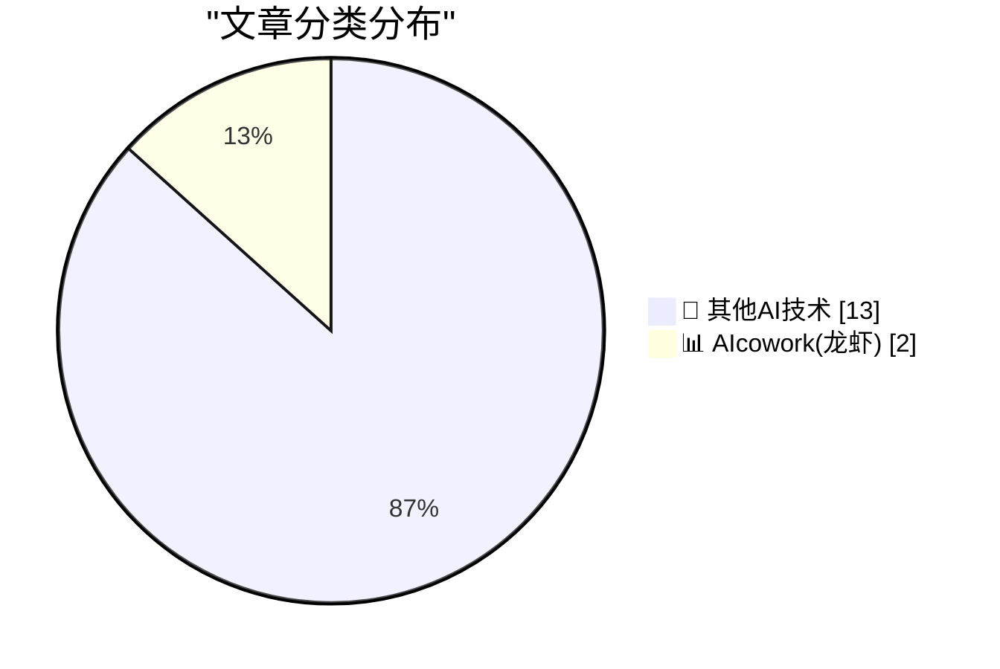
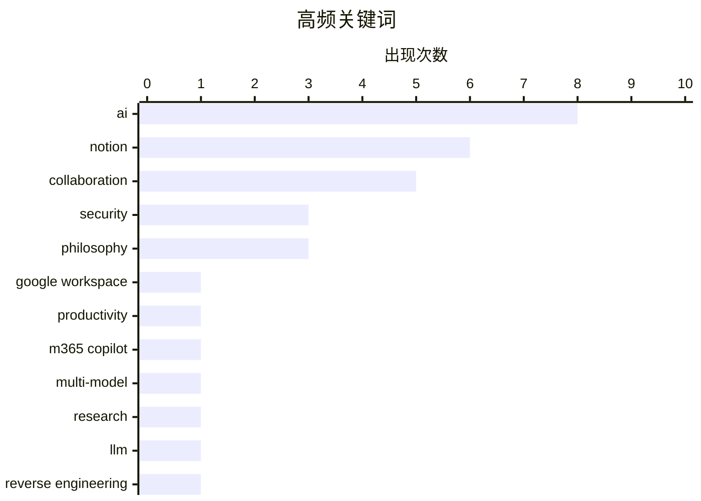

# 📰 AI 博客每日精选 — 2026-03-30

> 来自 98 个技术博客和社交媒体源，AI 精选 Top 15

## 📝 今日看点

今日技术圈聚焦于两大核心趋势。一是AI正深度融入协作办公场景，巨头如Google和Microsoft纷纷升级产品，旨在将AI作为提升团队效率与决策质量的“协作者”。二是关于AI发展路径的深刻反思，以Notion为代表的“共同思考”理念引发广泛共鸣，强调技术应服务于人类协作而非助长孤立，这为行业的长期发展提供了关键的人文视角。

---

## 🏆 今日必读

🥇 **告别邮件长串！将繁忙对话移至 Google Chat**

[No more email megathreads!. 💬 Move busy conversations out of your inbox and into Google Chat. You can now share important customer emails or projec...](https://x.com/GoogleWorkspace/status/2038663296421642610) — 𝕏 @GoogleWorkspace · 4 小时前 · 📊 AIcowork(龙虾)

> Google Workspace 推出新功能，旨在解决邮箱被冗长邮件讨论串淹没的问题。用户现在可以将重要的客户邮件或项目数据，通过生成持久链接的方式，直接分享到 Google Chat 的对话中。此举将实时协作场景从异步的邮箱转移至同步的聊天工具，以提升团队沟通效率。核心是整合 Gmail 与 Chat，优化工作流，减少信息在不同应用间的割裂。

💡 **为什么值得读**: 该功能直击现代职场沟通痛点，为管理复杂项目讨论和客户沟通提供了更高效的解决方案，适合团队协作频繁的用户关注。

🏷️ Google Workspace, Collaboration, Productivity

🥈 **研究者现拥有内置的“第二意见”：Microsoft 365 Copilot 推出 Critique 系统**

[Researcher just got a built-in second opinion, which means better research, fewer gaps, and more confidence in every answer.](https://x.com/Microsoft365/status/2038610722146705760) — 𝕏 @Microsoft365 · 8 小时前 · 📊 AIcowork(龙虾)

> Microsoft 365 Copilot 引入名为“Critique”的新型多模型深度研究系统。该系统能够协同使用多个AI模型来生成最优回答和报告，相当于为研究过程提供了一个内置的“第二意见”。其目标是提升研究的质量，减少信息盲区，从而让用户对每一个答案都更有信心。这代表了AI助手从单一模型响应向多模型协同、交叉验证的演进方向。

💡 **为什么值得读**: 了解AI助手如何通过多模型协作来提升输出结果的可靠性和深度，对于依赖AI进行研究和决策的专业人士具有重要参考价值。

🏷️ M365 Copilot, Multi-model, Research

🥉 **网络数字锁从未遭遇过如此强大的对手**

[The Webs Digital Locks have Never had a Stronger Opponent](https://blog.pixelmelt.dev/the-webs-digital-locks/) — blog.pixelmelt.dev · 4 小时前 · 🔬 其他AI技术

> 文章指出，我们正处在一个逆向工程的复兴时代。由于大型语言模型（LLMs）能力的飞跃，安全防御者目前处于被动地位。作者认为，在找到有效应对LLMs的方法之前，这种防御劣势将持续存在。核心观点是，LLM技术极大地改变了攻防平衡，对现有的数字安全防护（“数字锁”）构成了前所未有的挑战。

💡 **为什么值得读**: 本文提供了一个关于AI时代网络安全态势的尖锐视角，帮助安全从业者理解当前防御体系面临的根本性挑战。

🏷️ LLM, Reverse Engineering, Security

4️⃣ **GitHub 初学者指南：5分钟掌握项目安全基础**

[Security doesn't need to be intimidating. In just 5 minutes (or the time it takes to make your ☕️), you'll know the basics of securing your projects...](https://x.com/github/status/2038691492219236397) — 𝕏 @GitHub · 2 小时前 · 🔬 其他AI技术

> GitHub 推出了面向初学者的安全教程系列新一集，承诺在5分钟内讲解项目安全基础知识。该教程重点介绍如何使用 GitHub Advanced Security 功能来保护项目安全。内容旨在降低安全实践的门槛，使其不再令人生畏。目标是让开发者在泡一杯咖啡的时间内，就能建立起最基本的安全防护意识与操作。

💡 **为什么值得读**: 对于任何希望快速为项目奠定安全基础、却又不知从何入手的开发者来说，这是一个高效且实用的入门指南。

🏷️ GitHub, Security, Beginner

5️⃣ **Notion 联合创始人 Ivan Zhao：最好的事物绝非独自构建**

[RT Brian Halligan: A lot of folks in here talk about “taste” as a (the only?) competitive advantage. @ivanhzhao has it!](https://x.com/NotionHQ/status/2038715433650639142) — 𝕏 @NotionHQ · 1 小时前 · 🔬 其他AI技术

> Notion 联合创始人 Ivan Zhao 反驳了当前流行的“一人与AI军团”的孤独式AI叙事，认为将他人视为摩擦的观点是错误的。他强调，最好的事物从来都不是独自构建的。基于此，Notion 在AI变革时代重申其核心品牌理念：“共同思考”。这一定位旨在将AI作为协作的增强工具，而非人类协作的替代品。

💡 **为什么值得读**: 在AI工具强调个人生产力的浪潮中，Notion提出了强调人类协作的差异化价值观，为思考AI与工作的关系提供了另一种重要视角。

🏷️ AI, Philosophy, Notion

---

## 📊 数据概览

| 扫描源 | 抓取文章 | 时间范围 | 精选 |
|:---:|:---:|:---:|:---:|
| 73/98 | 2277 篇 → 24 篇 | 24h | **15 篇** |

### 分类分布



### 高频关键词



<details>
<summary>📈 纯文本关键词图（终端友好）</summary>

```
ai               │ ████████████████████ 8
notion           │ ███████████████░░░░░ 6
collaboration    │ █████████████░░░░░░░ 5
security         │ ████████░░░░░░░░░░░░ 3
philosophy       │ ████████░░░░░░░░░░░░ 3
google workspace │ ███░░░░░░░░░░░░░░░░░ 1
productivity     │ ███░░░░░░░░░░░░░░░░░ 1
m365 copilot     │ ███░░░░░░░░░░░░░░░░░ 1
multi-model      │ ███░░░░░░░░░░░░░░░░░ 1
research         │ ███░░░░░░░░░░░░░░░░░ 1
```

</details>

### 🏷️ 话题标签

**ai**(8) · **notion**(6) · **collaboration**(5) · security(3) · philosophy(3) · google workspace(1) · productivity(1) · m365 copilot(1) · multi-model(1) · research(1) · llm(1) · reverse engineering(1) · github(1) · beginner(1) · human-centric(1) · saas(1) · leadership(1) · workspace(1) · brand(1) · market(1)

---

====================

## 🔬 其他AI技术

### 1. 网络数字锁从未遭遇过如此强大的对手

[The Webs Digital Locks have Never had a Stronger Opponent](https://blog.pixelmelt.dev/the-webs-digital-locks/) — **blog.pixelmelt.dev** · 4 小时前 · ⭐ 7/25

> 文章指出，我们正处在一个逆向工程的复兴时代。由于大型语言模型（LLMs）能力的飞跃，安全防御者目前处于被动地位。作者认为，在找到有效应对LLMs的方法之前，这种防御劣势将持续存在。核心观点是，LLM技术极大地改变了攻防平衡，对现有的数字安全防护（“数字锁”）构成了前所未有的挑战。

🏷️ LLM, Reverse Engineering, Security

📌 其他AI技术

---

### 2. GitHub 初学者指南：5分钟掌握项目安全基础

[Security doesn't need to be intimidating. In just 5 minutes (or the time it takes to make your ☕️), you'll know the basics of securing your projects...](https://x.com/github/status/2038691492219236397) — **𝕏 @GitHub** · 2 小时前 · ⭐ 7/25

> GitHub 推出了面向初学者的安全教程系列新一集，承诺在5分钟内讲解项目安全基础知识。该教程重点介绍如何使用 GitHub Advanced Security 功能来保护项目安全。内容旨在降低安全实践的门槛，使其不再令人生畏。目标是让开发者在泡一杯咖啡的时间内，就能建立起最基本的安全防护意识与操作。

🏷️ GitHub, Security, Beginner

📌 其他AI技术

---

### 3. Notion 联合创始人 Ivan Zhao：最好的事物绝非独自构建

[RT Brian Halligan: A lot of folks in here talk about “taste” as a (the only?) competitive advantage. @ivanhzhao has it!](https://x.com/NotionHQ/status/2038715433650639142) — **𝕏 @NotionHQ** · 1 小时前 · ⭐ 6/25

> Notion 联合创始人 Ivan Zhao 反驳了当前流行的“一人与AI军团”的孤独式AI叙事，认为将他人视为摩擦的观点是错误的。他强调，最好的事物从来都不是独自构建的。基于此，Notion 在AI变革时代重申其核心品牌理念：“共同思考”。这一定位旨在将AI作为协作的增强工具，而非人类协作的替代品。

🏷️ AI, Philosophy, Notion

📌 其他AI技术

---

### 4. 观点：Ivan Zhao 的历史观助力 Notion 锚定长期技术演进弧线

[RT John Luttig: ivan is one of the best students of tech history that I know, and that helps him ground Notion in a multi-decade arc of technological ...](https://x.com/NotionHQ/status/2038711283747533062) — **𝕏 @NotionHQ** · 1 小时前 · ⭐ 6/25

> 观点认为，Notion 联合创始人 Ivan Zhao 对科技历史的深刻研究，帮助 Notion 将产品定位在一个长达数十年的技术演进弧线上。在当前AI讨论充满末日论调的背景下，他所提出的积极叙事——强调协作而非替代——具有重要价值。这种基于历史视野的长期主义，使 Notion 能够在技术变革中保持清晰的定位。

🏷️ AI, Philosophy, Notion

📌 其他AI技术

---

### 5. Notion 社区声音：记住，我们做这一切是为了人类

[RT Ryo Lu: don’t forget we are doing all this for the humans, not the other way around](https://x.com/NotionHQ/status/2038703112010293503) — **𝕏 @NotionHQ** · 2 小时前 · ⭐ 6/25

> 针对 Notion “共同思考”的理念，社区成员 Ryo Lu 进一步强调，所有技术发展的终极目的都应该是服务于人类，而不是本末倒置。这一观点呼应并强化了 Ivan Zhao 反对“孤独AI”叙事的立场。它提醒在AI开发与应用中，必须坚持以人为本的价值导向。

🏷️ AI, Philosophy, Human-centric

📌 其他AI技术

---

### 6. 从经典涂鸦到玛格丽特·米德名言：Notion “共同思考”的文化内涵

[RT Raphael Schaad: My favorite Notion doodle during my time there was always the group of four, rowing in the same direction. Today, Notion launched a...](https://x.com/NotionHQ/status/2038704747801354355) — **𝕏 @NotionHQ** · 2 小时前 · ⭐ 6/25

> 前 Notion 员工分享，代表四人同向划船的涂鸦一直是其内部喜爱的文化符号，与如今“共同思考”的视频主题高度契合。他引用了人类学家玛格丽特·米德的名言——“一小群有思想、肯奉献的公民可以改变世界”，来阐释 Notion 所倡导的协作精神。这揭示了 Notion 的品牌信息植根于其长期以来的团队协作文化。

🏷️ AI, Collaboration, Notion

📌 其他AI技术

---

### 7. 投资者视角：Ivan Zhao 是如何思考从 SaaS 向 AI 过渡的

[RT Patrick OShaughnessy: So good. Have spent time with Ivan recently and he’s one of the most interesting and impressive CEOs I’ve encountered (espe...](https://x.com/NotionHQ/status/2038687357831204917) — **𝕏 @NotionHQ** · 3 小时前 · ⭐ 6/25

> 投资者 Patrick O‘Shaughnessy 评价 Notion 联合创始人 Ivan Zhao 是他见过最有趣、最令人印象深刻的CEO之一，尤其是在从SaaS向AI过渡这个话题上。这表明 Ivan Zhao 对产品在AI时代的演进路径有着深刻且独到的思考。外界对其战略思考能力的认可，增强了 Notion 新定位“共同思考”的可信度。

🏷️ AI, SaaS, Leadership

📌 其他AI技术

---

### 8. 员工为何选择 Notion：对“共同思考”理念的认同

[RT Geoffrey Litt: Why I work at @NotionHQ:](https://x.com/NotionHQ/status/2038700498698821981) — **𝕏 @NotionHQ** · 3 小时前 · ⭐ 6/25

> Notion 员工 Geoffrey Litt 通过转发 Ivan Zhao “共同思考”的宣言，间接阐释了自己为何选择在 Notion 工作。这表明公司倡导的“反对孤独AI、强调人类协作”的理念，对内起到了凝聚团队、吸引人才的重要作用。员工的公开认同说明这一价值观已内化为企业文化和雇主品牌的一部分。

🏷️ AI, Collaboration, Notion

📌 其他AI技术

---

### 9. Notion 提出“共同思考”理念，回应人工智能时代的孤独叙事

[RT Ivan Zhao: Re 1930, IBM — Think 1997, Apple — Think Different 2026, Notion — Think Together We found this human narrative missing today. Togethe...](https://x.com/NotionHQ/status/2038681663883145727) — **𝕏 @NotionHQ** · 3 小时前 · ⭐ 6/25

> Notion 联合创始人 Ivan Zhao 针对当前人工智能的流行叙事提出批判，认为其过度强调个体与机器交互，将他人视为“摩擦”。他指出，最伟大的成就从来不是独自完成的，并正式提出“Think Together”（共同思考）作为 Notion 在2026年的品牌理念。该理念旨在强调协作与连接是人类意义的核心，是对 IBM “Think”和 Apple “Think Different”时代精神的延续与回应。其核心观点是，人工智能的未来应是关于“共同思考”，而非孤独的个体与机器对话。

🏷️ AI, Collaboration, Notion

📌 其他AI技术

---

### 10. 人工智能的本质是共同思考

[RT Patrick Hsu: AI is about thinking together 1911, IBM - Think 1997, Apple - Think Different 2026, Notion - Think Together](https://x.com/NotionHQ/status/2038676237695254792) — **𝕏 @NotionHQ** · 3 小时前 · ⭐ 6/25

> 文章延续了 Notion “Think Together”的主题，明确指出人工智能的意义在于促进“共同思考”。它批评了当前将 AI 描绘为“一人与一群聊天机器人”的孤独叙事，认为这种观点误解了未来。作者强调，最好的事物源于协作，而非孤军奋战。在变革时代，Notion 重申其立场，即通过工具促进人类之间的连接与共同创造，才是技术的正确方向。

🏷️ AI, Collaboration, Notion

📌 其他AI技术

---

### 11. Material Security：统一云工作空间安全，解决安全团队的噪音问题

[[Sponsor] Material Security](https://material.security/lp-cloud-office-security?utm_source=third-party&amp;utm_medium=email&amp;utm_campaign=20260330-daringfireball) — **daringfireball.net** · 18 分钟前 · ⭐ 5/25

> 文章指出，大多数安全团队的瓶颈并非人才短缺，而是被大量告警噪音所淹没，例如手动修复网络钓鱼、追踪高风险 OAuth 权限和审计文件共享。Material Security 提供的解决方案是将电子邮件、文件和账户的检测与响应统一到一个平台中，以此整合云工作空间安全。该方案旨在弥补 Google 和 Microsoft 原生安全功能的不足，且避免企业级软件的臃肿问题。其核心价值是让安全团队从重复劳动中解放出来，实现规模化运营，而非单纯增加人手。

🏷️ Security, Workspace

📌 其他AI技术

---

### 12. 品牌时代

[‘The Brand Age’](https://paulgraham.com/brandage.html) — **daringfireball.net** · 4 小时前 · ⭐ 5/25

> 本文是对 Paul Graham 一篇关于“品牌时代”文章的评论。Graham 原文以机械手表行业为例，论证一个仅由品牌定义的世界将是怪异和糟糕的。然而，评论者提出了不同意见，认为当下的机械手表市场（尤其是独立品牌如 Baltic 和 Halios）比以往任何时候都更有趣、更具活力。评论者承认 Graham 的论述发人深省，但认为其结论在独立制表领域并不完全适用，暗示“品牌时代”的负面影响可能被高估了。

🏷️ Brand, Market

📌 其他AI技术

---

### 13. 非同寻常尺寸的 Mac

[Macs of Unusual Size](https://scottknaster.substack.com/p/macs-of-unusual-size) — **daringfireball.net** · 5 小时前 · ⭐ 5/25

> Scott Knaster 在文章中提到了“大 Mac”和“小 Mac”的尺寸对比，指出前者大约是后者的 22 倍。这很可能是在比喻或回顾苹果历史上不同尺寸的 Macintosh 电脑，例如早期的紧凑型 Mac 与后来的大型专业机型。文章通过这个具体的倍数，生动地展现了苹果硬件产品线在物理尺寸上的巨大跨度。

🏷️ Mac, Hardware

📌 其他AI技术

---

## 📊 AIcowork(龙虾)

### 14. 告别邮件长串！将繁忙对话移至 Google Chat

[No more email megathreads!. 💬 Move busy conversations out of your inbox and into Google Chat. You can now share important customer emails or projec...](https://x.com/GoogleWorkspace/status/2038663296421642610) — **𝕏 @GoogleWorkspace** · 4 小时前 · ⭐ 16/25

> Google Workspace 推出新功能，旨在解决邮箱被冗长邮件讨论串淹没的问题。用户现在可以将重要的客户邮件或项目数据，通过生成持久链接的方式，直接分享到 Google Chat 的对话中。此举将实时协作场景从异步的邮箱转移至同步的聊天工具，以提升团队沟通效率。核心是整合 Gmail 与 Chat，优化工作流，减少信息在不同应用间的割裂。

🏷️ Google Workspace, Collaboration, Productivity

📌 AIcowork(龙虾)

---

### 15. 研究者现拥有内置的“第二意见”：Microsoft 365 Copilot 推出 Critique 系统

[Researcher just got a built-in second opinion, which means better research, fewer gaps, and more confidence in every answer.](https://x.com/Microsoft365/status/2038610722146705760) — **𝕏 @Microsoft365** · 8 小时前 · ⭐ 15/25

> Microsoft 365 Copilot 引入名为“Critique”的新型多模型深度研究系统。该系统能够协同使用多个AI模型来生成最优回答和报告，相当于为研究过程提供了一个内置的“第二意见”。其目标是提升研究的质量，减少信息盲区，从而让用户对每一个答案都更有信心。这代表了AI助手从单一模型响应向多模型协同、交叉验证的演进方向。

🏷️ M365 Copilot, Multi-model, Research

📌 AIcowork(龙虾)

---

====================

*生成于 2026-03-30 21:41 | 扫描 73 源 → 获取 2277 篇 → 精选 15 篇*
*基于 [Hacker News Popularity Contest 2025](https://refactoringenglish.com/tools/hn-popularity/) RSS 源列表，由 [Andrej Karpathy](https://x.com/karpathy) 推荐*
*由「懂点儿AI」制作，欢迎关注同名微信公众号获取更多 AI 实用技巧 💡*
