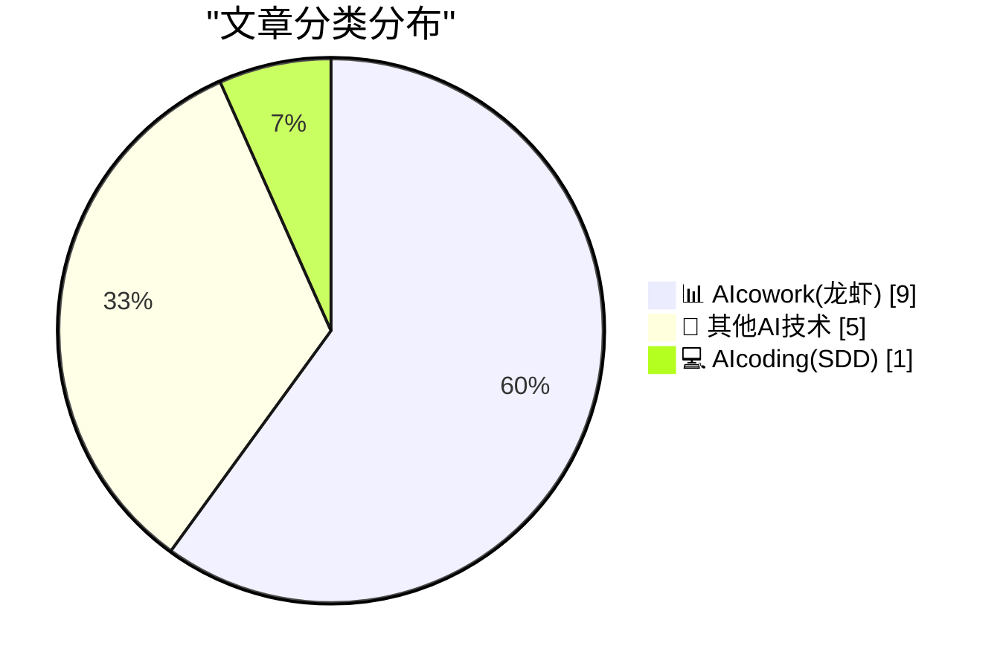
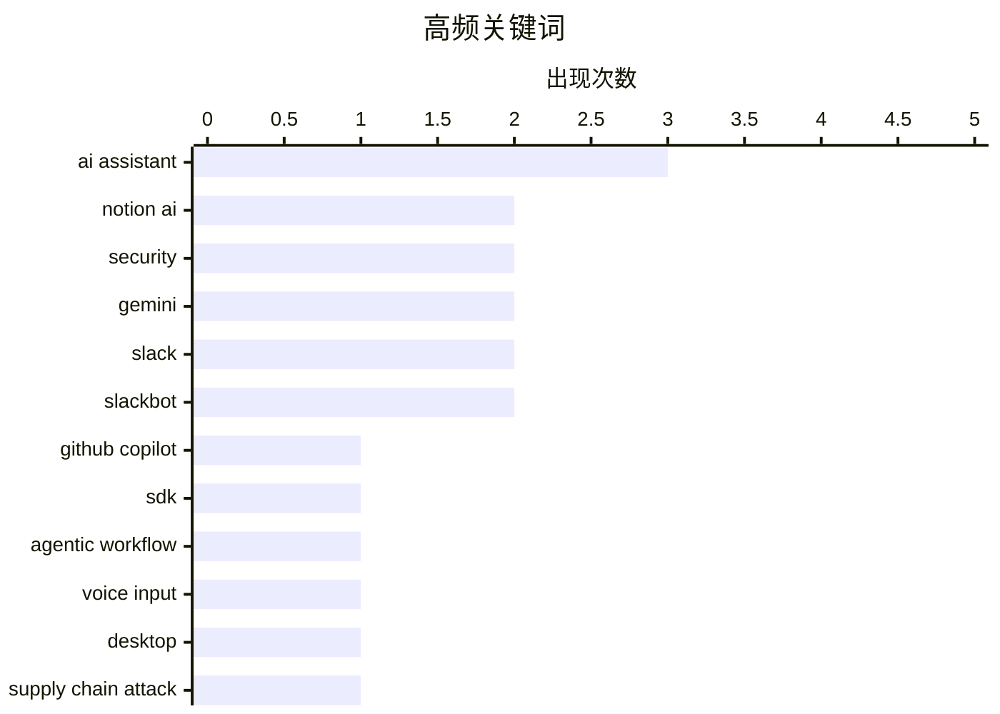

# 📰 AI 博客每日精选 — 2026-03-31

> 来自 98 个技术博客和社交媒体源，AI 精选 Top 15

## 📝 今日看点

今日技术圈聚焦于AI与工作流的深度融合。一方面，AI交互正从基础对话迈向可编程执行，赋能开发者构建更强大的智能体应用。另一方面，各大协作平台（如Notion、Slack、Microsoft 365）竞相集成AI能力，旨在通过语音、多模型对比、自动化流程等方式彻底重塑工作效率。同时，开源供应链安全因AI生成代码的普及而面临新的严峻挑战。

---

## 🏆 今日必读

🥇 **文本交互时代已过，可编程执行才是AI的新界面**

[You may know AI for its prompt-response interactions, but programmable execution is the new interface. 👀 With the GitHub Copilot SDK, you can enabl...](https://x.com/github/status/2039053877207609445) — 𝕏 @GitHub · 2 小时前 · 💻 AIcoding(SDD)

> GitHub提出AI交互正从简单的提示-响应模式转向可编程执行的新范式。通过GitHub Copilot SDK，开发者可以在自己的应用程序中直接启用智能体工作流。这一转变主要基于三种核心模式，旨在将AI从对话工具转变为可集成、可执行任务的编程接口。文章的核心观点是，AI作为文本工具的时代已经结束，执行能力正成为其新的、更强大的交互界面。

💡 **为什么值得读**: 为开发者揭示了AI集成从对话到执行的关键范式转变，并提供了具体的实现路径（Copilot SDK），对构建下一代AI应用具有直接指导意义。

🏷️ GitHub Copilot, SDK, Agentic Workflow

🥈 **最快的输入方式是不打字：Notion桌面端现已支持语音输入**

[Sometimes the fastest way to type is to not type at all. Voice input. Now on desktop too!](https://x.com/NotionHQ/status/2039018886574846370) — 𝕏 @NotionHQ · 5 小时前 · 📊 AIcowork(龙虾)

> Notion宣布其语音输入功能现已扩展至桌面端。该功能允许用户通过说话而非打字来快速输入内容，旨在提升创作和记录效率。此次更新补齐了移动端与桌面端的体验一致性，为用户提供了更灵活、高效的输入选择。这表明Notion正持续优化其产品的多模态交互能力。

💡 **为什么值得读**: 展示了生产力工具如何通过引入语音输入来降低使用门槛、提升效率，对于需要频繁进行内容创作和记录的用户是实用功能更新。

🏷️ Notion AI, Voice Input, Desktop

🥉 **Telnyx、LiteLLM与Axios：供应链危机**

[Telnyx, LiteLLM and Axios: the supply chain crisis](https://martinalderson.com/posts/telnyx-litellm-axios-supply-chain-crisis/?utm_source=rss&amp;utm_medium=rss&amp;utm_campaign=feed) — martinalderson.com · 21 小时前 · 🔬 其他AI技术

> 文章揭示了两周内npm和PyPI软件包仓库遭受的一系列连锁供应链攻击。攻击利用了Telnyx、LiteLLM和Axios等流行开源项目的依赖关系进行传播。作者指出，大型语言模型（LLMs）自动生成代码的行为加剧了这类攻击的传播速度和隐蔽性。当前主流的缓解措施（如依赖审查）已不足以应对这种新型威胁。

💡 **为什么值得读**: 深刻剖析了LLM时代下软件供应链安全面临的新挑战，对开发者和安全团队具有重要的预警和启发价值。

🏷️ Supply Chain Attack, LLM, Security

4️⃣ **Notion AI iOS测试版最新功能：可在应用中查看和编辑自定义智能体**

[RT Laura Sandoval: A few of the latest features and improvements we've been shipping for the Notion AI for iOS beta 🧵 1. You can now view and edit ...](https://x.com/NotionHQ/status/2039032780064194893) — 𝕏 @NotionHQ · 4 小时前 · 📊 AIcowork(龙虾)

> Notion AI的iOS测试版推出了多项新功能与改进。核心更新是用户现在可以直接在移动应用中查看和编辑自己创建的自定义AI智能体。这增强了移动端对AI工作流的控制与管理能力，使智能体功能不再局限于桌面端。此举旨在提升Notion AI在移动场景下的实用性和灵活性。

💡 **为什么值得读**: 体现了Notion致力于让AI功能实现全平台无缝体验，对于依赖移动办公和希望随时随地管理AI工作流的用户是重要更新。

🏷️ Notion AI, iOS, Custom Agent

5️⃣ **兼听则明：Microsoft 365 Copilot的Council功能可同时运行多个模型**

[A second opinion can’t hurt. Run multiple models with Council in Researcher and see exactly where responses agree (and where they don’t).](https://x.com/Microsoft365/status/2039052838311960753) — 𝕏 @Microsoft365 · 2 小时前 · 📊 AIcowork(龙虾)

> 微软在Microsoft 365 Copilot中推出了名为“Council”的新功能。该功能允许用户对同一个提示词同时运行多个不同的AI模型。其核心价值在于让用户直观地对比不同模型的响应，看清它们在哪些观点上一致，在哪些地方存在分歧。这有助于用户更全面地评估信息，做出更明智的决策。

💡 **为什么值得读**: 提供了一种创新的AI使用范式，通过模型对比来提升结果的可靠性和决策质量，对于需要高准确性分析的专业人士尤其有用。

🏷️ M365 Copilot, Council, Multi-model

---

## 📊 数据概览

| 扫描源 | 抓取文章 | 时间范围 | 精选 |
|:---:|:---:|:---:|:---:|
| 76/98 | 2496 篇 → 37 篇 | 24h | **15 篇** |

### 分类分布



### 高频关键词



<details>
<summary>📈 纯文本关键词图（终端友好）</summary>

```
ai assistant     │ ████████████████████ 3
notion ai        │ █████████████░░░░░░░ 2
security         │ █████████████░░░░░░░ 2
gemini           │ █████████████░░░░░░░ 2
slack            │ █████████████░░░░░░░ 2
slackbot         │ █████████████░░░░░░░ 2
github copilot   │ ███████░░░░░░░░░░░░░ 1
sdk              │ ███████░░░░░░░░░░░░░ 1
agentic workflow │ ███████░░░░░░░░░░░░░ 1
voice input      │ ███████░░░░░░░░░░░░░ 1
```

</details>

### 🏷️ 话题标签

**ai assistant**(3) · **notion ai**(2) · **security**(2) · gemini(2) · slack(2) · slackbot(2) · github copilot(1) · sdk(1) · agentic workflow(1) · voice input(1) · desktop(1) · supply chain attack(1) · llm(1) · ios(1) · custom agent(1) · m365 copilot(1) · council(1) · multi-model(1) · google docs(1) · writing assistant(1)

---

====================

## 📊 AIcowork(龙虾)

### 1. 最快的输入方式是不打字：Notion桌面端现已支持语音输入

[Sometimes the fastest way to type is to not type at all. Voice input. Now on desktop too!](https://x.com/NotionHQ/status/2039018886574846370) — **𝕏 @NotionHQ** · 5 小时前 · ⭐ 21/25

> Notion宣布其语音输入功能现已扩展至桌面端。该功能允许用户通过说话而非打字来快速输入内容，旨在提升创作和记录效率。此次更新补齐了移动端与桌面端的体验一致性，为用户提供了更灵活、高效的输入选择。这表明Notion正持续优化其产品的多模态交互能力。

🏷️ Notion AI, Voice Input, Desktop

📌 AIcowork(龙虾)

---

### 2. Notion AI iOS测试版最新功能：可在应用中查看和编辑自定义智能体

[RT Laura Sandoval: A few of the latest features and improvements we've been shipping for the Notion AI for iOS beta 🧵 1. You can now view and edit ...](https://x.com/NotionHQ/status/2039032780064194893) — **𝕏 @NotionHQ** · 4 小时前 · ⭐ 19/25

> Notion AI的iOS测试版推出了多项新功能与改进。核心更新是用户现在可以直接在移动应用中查看和编辑自己创建的自定义AI智能体。这增强了移动端对AI工作流的控制与管理能力，使智能体功能不再局限于桌面端。此举旨在提升Notion AI在移动场景下的实用性和灵活性。

🏷️ Notion AI, iOS, Custom Agent

📌 AIcowork(龙虾)

---

### 3. 兼听则明：Microsoft 365 Copilot的Council功能可同时运行多个模型

[A second opinion can’t hurt. Run multiple models with Council in Researcher and see exactly where responses agree (and where they don’t).](https://x.com/Microsoft365/status/2039052838311960753) — **𝕏 @Microsoft365** · 2 小时前 · ⭐ 17/25

> 微软在Microsoft 365 Copilot中推出了名为“Council”的新功能。该功能允许用户对同一个提示词同时运行多个不同的AI模型。其核心价值在于让用户直观地对比不同模型的响应，看清它们在哪些观点上一致，在哪些地方存在分歧。这有助于用户更全面地评估信息，做出更明智的决策。

🏷️ M365 Copilot, Council, Multi-model

📌 AIcowork(龙虾)

---

### 4. Gemini一键统一协作文档的写作风格与语调

[Collaborating with multiple coworkers can lead to messy @GoogleDocs with inconsistent voices and tones. ✍ With a single click, Gemini suggests edits ...](https://x.com/GoogleWorkspace/status/2038975889950519471) — **𝕏 @GoogleWorkspace** · 7 小时前 · ⭐ 16/25

> 针对多人协作的Google文档常出现的风格与语调不一致问题，Google Workspace推出了基于Gemini的解决方案。用户只需点击一次，Gemini即可分析整个文档并建议编辑，使写作风格保持统一。该功能旨在减少团队协作中的沟通成本，提升文档的专业性和可读性。这是AI应用于提升团队协作质量的具体实践。

🏷️ Gemini, Google Docs, Writing Assistant

📌 AIcowork(龙虾)

---

### 5. Digicloud Africa利用Gemini自定义Gems将赋能规划时间缩短60%

[What is Google Cloud's partner, Digicloud Africa's secret to cutting enablement planning by 60%? It's custom Gems in Gemini. Less brain drain, more in...](https://x.com/GoogleWorkspace/status/2039087993202331768) — **𝕏 @GoogleWorkspace** · 28 分钟前 · ⭐ 15/25

> Google Cloud的合作伙伴Digicloud Africa分享了其提升效率的秘诀：使用Gemini中的自定义Gems功能。通过创建定制化的AI助手，该公司成功将赋能规划所需的时间减少了60%。这种方法减少了知识流失，并将员工精力更多地释放到创新性工作上。案例证明了定制化AI工具在解决特定业务问题上的巨大潜力。

🏷️ Gemini, Custom Gems, Workflow Optimization

📌 AIcowork(龙虾)

---

### 6. 遇见全新的Slack：AI工作的地方

[RT Salesforce: 🔴 LIVE NOW Meet the new @SlackHQ. Where AI works. → Slackbot → Slack Marketplace → Slack CRM → Slack + Salesforce → Slack + Age...](https://x.com/SlackHQ/status/2039044245512712369) — **𝕏 @SlackHQ** · 3 小时前 · ⭐ 12/25

> Salesforce发布了全新版本的Slack，其核心定位是“AI工作的地方”。新版Slack整合了多项AI与生态能力，包括升级的Slackbot、Slack Marketplace应用市场、Slack CRM以及与Salesforce、Anthropic AI等深度集成。这标志着Slack正从一个沟通工具转型为集成了多种AI智能体和业务流程的智能工作平台。

🏷️ Slack, AI Integration, Product Launch

📌 AIcowork(龙虾)

---

### 7. 团队如何用Slack一键清除关键项目障碍

[RT Salesforce: The team at @gowithengine needs to clear blockers for a critical project. They don’t hunt through backlogs, switch between 100+ apps, ...](https://x.com/SlackHQ/status/2039067105220321461) — **𝕏 @SlackHQ** · 2 小时前 · ⭐ 11/25

> 文章通过Engine团队的场景演示了新版Slack如何高效解决项目阻塞问题。团队无需在超过100个应用间切换、翻查任务清单或召开状态会议。他们只需在Slack中提出问题，Slack的AI能力便能自动整合信息、协调资源并推动问题解决。这展示了AI驱动的工作流如何极大简化复杂项目管理。

🏷️ Slack, AI Assistant, Workflow

📌 AIcowork(龙虾)

---

### 8. MrBeast团队中Slackbot的四个进阶技能

[RT Salesforce: Things Slackbot does at @MrBeast: Level 1: *searches channels to validate a video concept* Level 2: *generates a brief and books the ki...](https://x.com/SlackHQ/status/2039052306432274551) — **𝕏 @SlackHQ** · 2 小时前 · ⭐ 11/25

> 展示了MrBeast团队如何利用AI驱动的Slackbot完成从概念验证到绩效报告的全链路工作。Slackbot的能力分为四个层级：从搜索频道验证视频创意，到生成简报并预订会议，再到在通话中实时寻找供应商，最高层级甚至能读取共享屏幕上的实时仪表盘数据来生成绩效报告。这体现了AI助理正深度融入核心创意与运营流程。

🏷️ Slackbot, AI Assistant, Automation

📌 AIcowork(龙虾)

---

### 9. 办公室里消息最灵通的人刚休完假回来。Slackbot。

[RT Salesforce: The most informed person in the office just got back from PTO. Slackbot.](https://x.com/SlackHQ/status/2039039296426914143) — **𝕏 @SlackHQ** · 7 小时前 · ⭐ 11/25

> Salesforce 旗下 Slack 发布了一则产品宣传视频，展示其 AI 助手 Slackbot 在员工休假归来后的应用场景。视频暗示 Slackbot 能快速帮助员工了解休假期间错过的所有工作对话、决策和项目进展。其核心功能是聚合和总结历史信息，让用户无需翻阅大量聊天记录即可掌握全局。这体现了 Slack 将 AI 深度集成到工作流中，以提升信息获取效率的产品方向。

🏷️ Slackbot, AI Assistant, Information Retrieval

📌 AIcowork(龙虾)

---

## 🔬 其他AI技术

### 10. Telnyx、LiteLLM与Axios：供应链危机

[Telnyx, LiteLLM and Axios: the supply chain crisis](https://martinalderson.com/posts/telnyx-litellm-axios-supply-chain-crisis/?utm_source=rss&amp;utm_medium=rss&amp;utm_campaign=feed) — **martinalderson.com** · 21 小时前 · ⭐ 19/25

> 文章揭示了两周内npm和PyPI软件包仓库遭受的一系列连锁供应链攻击。攻击利用了Telnyx、LiteLLM和Axios等流行开源项目的依赖关系进行传播。作者指出，大型语言模型（LLMs）自动生成代码的行为加剧了这类攻击的传播速度和隐蔽性。当前主流的缓解措施（如依赖审查）已不足以应对这种新型威胁。

🏷️ Supply Chain Attack, LLM, Security

📌 其他AI技术

---

### 11. 我的闲言碎语可通过 Gopher 协议访问

[My ramblings are available over gopher](https://maurycyz.com/misc/gopher/) — **maurycyz.com** · -141 分钟前 · ⭐ 10/25

> 作者因其网站需要复杂的现代浏览器（戏称为“一千行 C 代码”）才能访问而感到不满。为此，他额外为网站提供了 Gopher 协议支持，这是一种极简的、基于文本的早期互联网协议。用户可以直接使用 `telnet` 命令连接其服务器的 70 端口来访问纯文本内容。此举旨在为追求简单、轻量级和复古网络体验的用户提供一种替代访问方式，体现了对网络多样性和“低科技”可行性的支持。

🏷️ Gopher, Protocol, Website

📌 其他AI技术

---

### 12. 在检查更新是否导致问题之前，先检查问题在更新前是否不存在

[Before you check if an update caused your problem, check that it wasn’t a problem before the update](https://devblogs.microsoft.com/oldnewthing/20260331-00/?p=112177) — **devblogs.microsoft.com/oldnewthing** · 7 小时前 · ⭐ 10/25

> 文章针对软件更新后常出现的归因错误，提出了一个关键的问题排查逻辑。核心论点是：许多被归咎于“新更新”的问题，实际上在更新前就已经存在，只是未被发现。作者建议在怀疑更新导致故障时，首先应回滚到更新前的环境进行复现测试，以确认问题是否真的由更新引入。这是一种严谨的、基于事实的调试思维方式，能有效避免浪费时间在错误的调查方向上。正确的归因是有效解决问题的第一步。

🏷️ Debugging, Update, Problem

📌 其他AI技术

---

### 13. npm 的默认设置是糟糕的

[npm’s Defaults Are Bad](https://nesbitt.io/2026/03/31/npms-defaults-are-bad.html) — **nesbitt.io** · 11 小时前 · ⭐ 10/25

> 文章直指 npm 客户端（Node.js 包管理器）的默认配置是导致 JavaScript 供应链安全问题的根本原因之一。作者认为，npm 默认的宽松行为（如自动安装所有依赖、执行脚本）为恶意包传播和依赖混淆攻击创造了条件。这些不安全的默认值使得开发者，尤其是新手，在未主动配置更严格策略的情况下，项目会暴露于不必要的风险之中。结论是，为了生态系统安全，npm 应该将安全置于便利之上，修改其默认设置。

🏷️ npm, Security, JavaScript

📌 其他AI技术

---

### 14. MVC 之误

[The MVC Mistake](https://entropicthoughts.com/mvc-mistake) — **entropicthoughts.com** · 23 小时前 · ⭐ 10/25

> 文章对经典的 MVC（模型-视图-控制器）架构模式在现代应用开发中的适用性提出了批判性质疑。作者认为，严格遵循 MVC 常常会导致代码组织僵化、控制器过于臃肿，以及模型层承载过多不相关的逻辑。问题的核心在于 MVC 最初是为桌面 GUI 应用设计的，其关注点分离方式可能不完全契合复杂的 Web 应用或领域驱动设计。文章主张开发者不应被 MVC 教条束缚，而应根据实际需求选择或组合更合适的架构模式。盲目套用 MVC 可能是一种错误。

🏷️ MVC, Architecture, Software

📌 其他AI技术

---

## 💻 AIcoding(SDD)

### 15. 文本交互时代已过，可编程执行才是AI的新界面

[You may know AI for its prompt-response interactions, but programmable execution is the new interface. 👀 With the GitHub Copilot SDK, you can enabl...](https://x.com/github/status/2039053877207609445) — **𝕏 @GitHub** · 2 小时前 · ⭐ 21/25

> GitHub提出AI交互正从简单的提示-响应模式转向可编程执行的新范式。通过GitHub Copilot SDK，开发者可以在自己的应用程序中直接启用智能体工作流。这一转变主要基于三种核心模式，旨在将AI从对话工具转变为可集成、可执行任务的编程接口。文章的核心观点是，AI作为文本工具的时代已经结束，执行能力正成为其新的、更强大的交互界面。

🏷️ GitHub Copilot, SDK, Agentic Workflow

📌 AIcoding(SDD)

---

====================

*生成于 2026-03-31 21:39 | 扫描 76 源 → 获取 2496 篇 → 精选 15 篇*
*基于 [Hacker News Popularity Contest 2025](https://refactoringenglish.com/tools/hn-popularity/) RSS 源列表，由 [Andrej Karpathy](https://x.com/karpathy) 推荐*
*由「懂点儿AI」制作，欢迎关注同名微信公众号获取更多 AI 实用技巧 💡*
