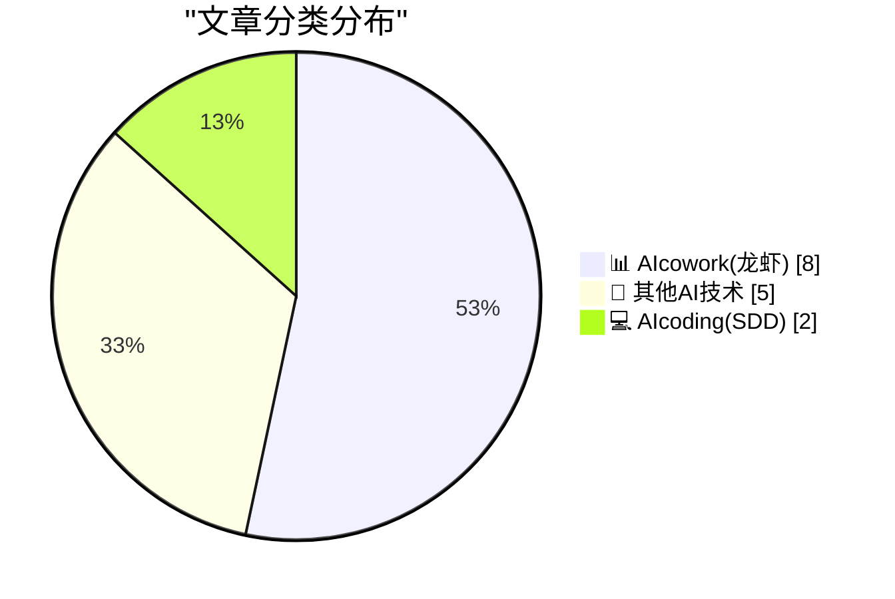
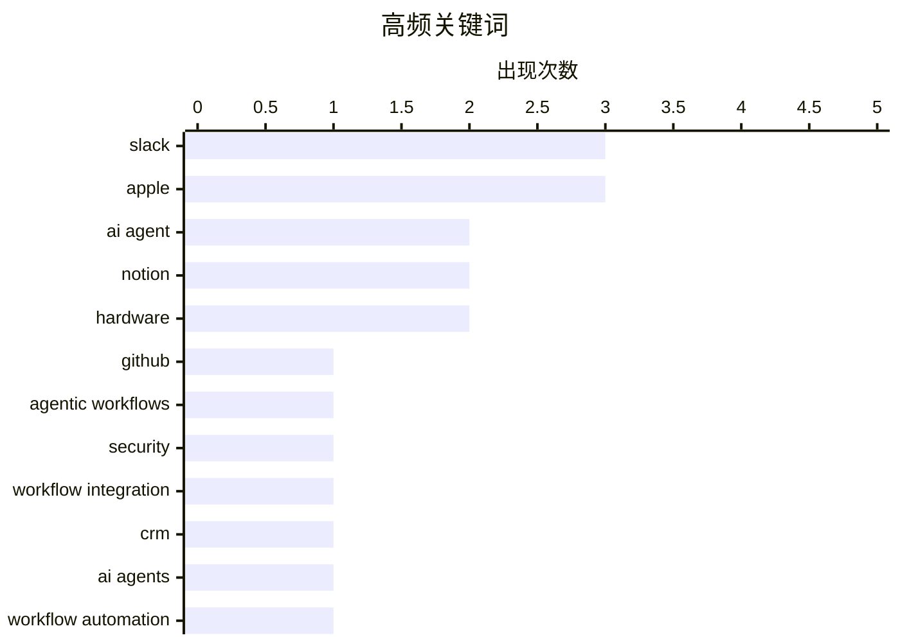

# 📰 AI 博客每日精选 — 2026-04-01

> 来自 98 个技术博客和社交媒体源，AI 精选 Top 15

## 📝 今日看点

今日技术焦点集中于AI与工作流的深度融合。AI智能体正从独立工具演变为跨平台协作的核心枢纽，深度嵌入Slack、Notion等办公场景以自动化复杂流程。同时，AI编码助手的安全性与实用性成为关键议题，业界正从架构设计和使用方法论层面构建可信赖的自动化开发环境。

---

## 🏆 今日必读

🥇 **GitHub Agentic Workflows 的安全架构设计**

[If you're building with GitHub Agentic Workflows, security is baked into the foundation. 🔐 The architecture is set up around three core principles:...](https://x.com/github/status/2039420064986698225) — 𝕏 @GitHub · 2 小时前 · 💻 AIcoding(SDD)

> 文章介绍了 GitHub Agentic Workflows 内置的安全架构设计。其核心围绕三大安全原则构建：隔离、受限输出和全面日志记录。该架构从设计之初就遵循“安全设计”理念，旨在为AI驱动的自动化工作流提供基础安全保障。这确保了即使在工作流执行复杂任务时，也能有效控制风险并满足企业级安全要求。

💡 **为什么值得读**: 对于正在或计划采用AI Agentic工作流的开发者和企业，本文提供了关键的安全设计范式，有助于构建可信的自动化流程。

🏷️ GitHub, Agentic Workflows, Security

🥈 **Slackbot 集成 Linear 与 Cursor AI 打造终极工作流**

[Identify. 🛠 Log. 📝 Fix. 💻 Review. 👀 All in a single thread. Slackbot + @Linear + @cursor_ai = The ultimate workflow. Just ask, and Slackbo...](https://x.com/SlackHQ/status/2039372563487285348) — 𝕏 @SlackHQ · 5 小时前 · 📊 AIcowork(龙虾)

> 展示了 Slackbot 与 Linear（项目管理工具）和 Cursor AI（AI代码助手）深度集成的工作流。该集成能在单一Slack线程中完成问题识别、记录、修复和代码审查的全过程。用户只需提出请求，Slackbot便能自动调用合适的AI智能体或应用程序来执行任务。这实现了跨工具的任务自动化闭环，极大提升了开发运维效率。

💡 **为什么值得读**: 该案例是AI智能体与现有开发工具链无缝集成的典范，为构建高效的开发者体验提供了具体蓝图。

🏷️ Slack, AI Agent, Workflow Integration

🥉 **面向小型企业的 Slack CRM 正式上线**

[Slack CRM is here for small businesses. 👋 Manage every customer relationship – from first hello to closed deal to ongoing support –conversational...](https://x.com/SlackHQ/status/2039399515208212852) — 𝕏 @SlackHQ · 3 小时前 · 📊 AIcowork(龙虾)

> Slack 推出了专为小型企业设计的CRM功能。用户可以直接在Slack对话界面中，管理从初次接触到成交再到售后支持的完整客户关系。只需向AI工作助手Slackbot提出请求，即可完成相关CRM操作。这标志着Slack正从一个沟通工具向集成了客户管理的综合工作平台演进。

💡 **为什么值得读**: 展示了对话式AI如何重塑中小企业CRM的使用体验，降低了客户关系管理的工具切换成本和上手门槛。

🏷️ Slack, CRM, AI Agent

4️⃣ **Notion Agents 如何助力团队全天候自动化工作**

[RT Dan Shipper 📧: we run all of @every on @NotionHQ one of the big reasons we love notion is notion agents. they run 24/7 in the background to help...](https://x.com/NotionHQ/status/2039342524196962336) — 𝕏 @NotionHQ · 7 小时前 · 📊 AIcowork(龙虾)

> 分享了团队如何利用 Notion Agents（Notion AI智能体）来提升效率。这些智能体可7x24小时在后台运行，自动帮助团队进行工作优先级排序、战略规划、知识整理并确保信息同步。Notion Agents 的核心价值在于将AI能力深度嵌入到团队的知识库和工作流中，实现主动式协助。

💡 **为什么值得读**: 揭示了Notion作为AI智能体运行平台的潜力，为知识密集型团队如何利用AI实现自动化管理提供了实践参考。

🏷️ Notion, AI Agents, Workflow Automation

5️⃣ **Salesforce 发布30多项新功能，将Slackbot升级为终极工作伙伴**

[RT Salesforce News & Insights: Salesforce announced 30+ new capabilities that take Slackbot from personal agent to the ultimate teammate. Watch yester...](https://x.com/SlackHQ/status/2039423478743327150) — 𝕏 @SlackHQ · 4 小时前 · 📊 AIcowork(龙虾)

> Salesforce 宣布了超过30项新功能，旨在将Slackbot从个人助手升级为团队的核心工作伙伴。这些新能力包括增强的Slackbot、Slack应用市场以及内置的CRM功能。此次升级的重点是深化AI智能体与业务数据的融合，提升自动化水平。这标志着Slack正在加速转型为智能化的企业协作与操作中心。

💡 **为什么值得读**: 概述了Slack在AI时代下的战略升级方向，对于关注企业级协作平台演进和AI应用落地的读者具有重要参考价值。

🏷️ Slack, Salesforce, Product Launch

---

## 📊 数据概览

| 扫描源 | 抓取文章 | 时间范围 | 精选 |
|:---:|:---:|:---:|:---:|
| 77/98 | 2507 篇 → 34 篇 | 24h | **15 篇** |

### 分类分布



### 高频关键词



<details>
<summary>📈 纯文本关键词图（终端友好）</summary>

```
slack                │ ████████████████████ 3
apple                │ ████████████████████ 3
ai agent             │ █████████████░░░░░░░ 2
notion               │ █████████████░░░░░░░ 2
hardware             │ █████████████░░░░░░░ 2
github               │ ███████░░░░░░░░░░░░░ 1
agentic workflows    │ ███████░░░░░░░░░░░░░ 1
security             │ ███████░░░░░░░░░░░░░ 1
workflow integration │ ███████░░░░░░░░░░░░░ 1
crm                  │ ███████░░░░░░░░░░░░░ 1
```

</details>

### 🏷️ 话题标签

**slack**(3) · **apple**(3) · **ai agent**(2) · notion(2) · hardware(2) · github(1) · agentic workflows(1) · security(1) · workflow integration(1) · crm(1) · ai agents(1) · workflow automation(1) · salesforce(1) · product launch(1) · copilot(1) · ai coding(1) · productivity(1) · google chat(1) · datadog(1) · alert integration(1)

---

====================

## 📊 AIcowork(龙虾)

### 1. Slackbot 集成 Linear 与 Cursor AI 打造终极工作流

[Identify. 🛠 Log. 📝 Fix. 💻 Review. 👀 All in a single thread. Slackbot + @Linear + @cursor_ai = The ultimate workflow. Just ask, and Slackbo...](https://x.com/SlackHQ/status/2039372563487285348) — **𝕏 @SlackHQ** · 5 小时前 · ⭐ 22/25

> 展示了 Slackbot 与 Linear（项目管理工具）和 Cursor AI（AI代码助手）深度集成的工作流。该集成能在单一Slack线程中完成问题识别、记录、修复和代码审查的全过程。用户只需提出请求，Slackbot便能自动调用合适的AI智能体或应用程序来执行任务。这实现了跨工具的任务自动化闭环，极大提升了开发运维效率。

🏷️ Slack, AI Agent, Workflow Integration

📌 AIcowork(龙虾)

---

### 2. 面向小型企业的 Slack CRM 正式上线

[Slack CRM is here for small businesses. 👋 Manage every customer relationship – from first hello to closed deal to ongoing support –conversational...](https://x.com/SlackHQ/status/2039399515208212852) — **𝕏 @SlackHQ** · 3 小时前 · ⭐ 21/25

> Slack 推出了专为小型企业设计的CRM功能。用户可以直接在Slack对话界面中，管理从初次接触到成交再到售后支持的完整客户关系。只需向AI工作助手Slackbot提出请求，即可完成相关CRM操作。这标志着Slack正从一个沟通工具向集成了客户管理的综合工作平台演进。

🏷️ Slack, CRM, AI Agent

📌 AIcowork(龙虾)

---

### 3. Notion Agents 如何助力团队全天候自动化工作

[RT Dan Shipper 📧: we run all of @every on @NotionHQ one of the big reasons we love notion is notion agents. they run 24/7 in the background to help...](https://x.com/NotionHQ/status/2039342524196962336) — **𝕏 @NotionHQ** · 7 小时前 · ⭐ 20/25

> 分享了团队如何利用 Notion Agents（Notion AI智能体）来提升效率。这些智能体可7x24小时在后台运行，自动帮助团队进行工作优先级排序、战略规划、知识整理并确保信息同步。Notion Agents 的核心价值在于将AI能力深度嵌入到团队的知识库和工作流中，实现主动式协助。

🏷️ Notion, AI Agents, Workflow Automation

📌 AIcowork(龙虾)

---

### 4. Salesforce 发布30多项新功能，将Slackbot升级为终极工作伙伴

[RT Salesforce News & Insights: Salesforce announced 30+ new capabilities that take Slackbot from personal agent to the ultimate teammate. Watch yester...](https://x.com/SlackHQ/status/2039423478743327150) — **𝕏 @SlackHQ** · 4 小时前 · ⭐ 20/25

> Salesforce 宣布了超过30项新功能，旨在将Slackbot从个人助手升级为团队的核心工作伙伴。这些新能力包括增强的Slackbot、Slack应用市场以及内置的CRM功能。此次升级的重点是深化AI智能体与业务数据的融合，提升自动化水平。这标志着Slack正在加速转型为智能化的企业协作与操作中心。

🏷️ Slack, Salesforce, Product Launch

📌 AIcowork(龙虾)

---

### 5. 在 Google Chat 中接收 Datadog 实时告警

[Get real-time @datadoghq alerts in Google Chat. Stay ahead of incidents without switching tools ⚡💬 https://goo.gle/47ybsLW](https://x.com/GoogleWorkspace/status/2039388069304975444) — **𝕏 @GoogleWorkspace** · 4 小时前 · ⭐ 19/25

> 介绍了 Google Chat 与监控平台 Datadog 的集成功能。用户现在可以在Google Chat中直接接收来自Datadog的实时事件告警。该集成旨在让运维和开发团队无需切换工具即可及时感知线上事故，从而更快地响应和处置。这减少了工具间切换的摩擦，有助于提升事件响应速度。

🏷️ Google Chat, Datadog, Alert Integration

📌 AIcowork(龙虾)

---

### 6. 使用 Gemini 在 Google Docs 中生成符合个人风格的文档

[Create documents that actually sound like you. Use Gemini in Google Docs to pull from your work context and generate polished, ready-to-share document...](https://x.com/GoogleWorkspace/status/2039327671750885621) — **𝕏 @GoogleWorkspace** · 8 小时前 · ⭐ 19/25

> 展示了 Google Docs 中 Gemini AI 助手的文档生成能力。该功能能够利用用户的工作上下文（如过往邮件、文档），生成风格一致、内容精炼且可直接分享的文档。其核心优势在于让AI生成的文档更贴合用户的个人或公司行文风格，而非千篇一律的模板化内容。这提升了AI辅助写作的实用性和个性化程度。

🏷️ Gemini, Google Docs, Document Generation

📌 AIcowork(龙虾)

---

### 7. Notion 第一季度发布25项以上更新全解析

[RT Osama: This Q1, @NotionHQ shipped 25+ updates. Most people don't even know half of them exist. Here's the full breakdown🧵](https://x.com/NotionHQ/status/2039414237890769021) — **𝕏 @NotionHQ** · 3 小时前 · ⭐ 18/25

> 文章系统盘点了 Notion 在第一季度发布的超过25项功能更新。作者指出，其中大部分更新并不为多数用户所知晓。这些更新可能涵盖了数据库、AI功能、协作体验、API或界面优化等多个方面。全面了解这些更新有助于用户和开发者更充分地利用Notion平台的最新能力。

🏷️ Notion, Product Updates, Q1

📌 AIcowork(龙虾)

---

### 8. Slackbot 30秒完成会议准备：集成CRM与日历的AI助手

[RT Salesforce: Didn't prep for that call in 20 minutes? Slackbot: *pulls your Salesforce CRM records, Slack threads, and calendar to create a brief wi...](https://x.com/SlackHQ/status/2039336564052926894) — **𝕏 @SlackHQ** · 23 小时前 · ⭐ 15/25

> 演示了Slackbot作为AI助手如何高效完成会议准备工作。它能在30秒内自动拉取Salesforce CRM记录、相关Slack讨论线程和日历信息，生成包含正确定位和用例的会议简报。案例中，它还能智能提示“CFO刚被添加到会议邀请中”这样的关键变更。这相当于将通常需要一小时的准备工作压缩到极短时间。

🏷️ Slackbot, AI Assistant, Meeting Prep

📌 AIcowork(龙虾)

---

## 🔬 其他AI技术

### 9. DRAM价格正在扼杀爱好者单板计算机市场

[DRAM pricing is killing the hobbyist SBC market](https://www.jeffgeerling.com/blog/2026/dram-pricing-is-killing-the-hobbyist-sbc-market/) — **jeffgeerling.com** · 40 分钟前 · ⭐ 5/25

> 树莓派基金会宣布全系LPDDR4内存型号涨价，并将16GB版树莓派5的价格推高至299.99美元。此次涨价的核心驱动力是持续高位的DRAM市场价格，严重挤压了面向爱好者的“高端单板计算机”市场的生存空间。作者指出，这导致原本以高性价比和可玩性著称的树莓派等产品，正变得对普通爱好者越来越不友好。结论是，DRAM定价已成为阻碍创客和硬件爱好者社区发展的关键瓶颈。

🏷️ Hardware, Pricing, SBC

📌 其他AI技术

---

### 10. 关于苹果趣味‘倒带’视频的更多细节

[More on Apple’s Fun ‘Rewind’ Video](https://hachyderm.io/@lexfri/116331181693278195) — **daringfireball.net** · 1 小时前 · ⭐ 5/25

> 有用户发现，将苹果新发布的‘倒带’视频反向播放，其背景音乐是经过升调处理的经典‘Think Different’广告配乐。此外，视频中出现的复古‘◀︎◀︎ REW’按钮被指出字体设计不一致：‘REW’使用了位图化的芝加哥12号字体，而箭头符号却是现代样式。设计师Craig Hockenberry随后模仿Susan Kare的风格对其进行了修复，使整体风格统一。这体现了苹果社区对品牌历史细节的高度关注和考据精神。

🏷️ Apple, Video, Marketing

📌 其他AI技术

---

### 11. 《华尔街日报》记者本·科恩探访苹果原型硬件档案馆

[Ben Cohen of the WSJ Tours Apple’s Archive of Prototype Hardware](https://www.youtube.com/watch?v=74qPQt_5DdM) — **daringfireball.net** · 1 小时前 · ⭐ 5/25

> 这是一段时长7分钟的短视频，由《华尔街日报》记者本·科恩带领观众独家探访苹果公司不对外公开的原型硬件档案馆。视频中展示了大量从未公开过的历史原型设备和有趣藏品。作者建议观众亲自观看以获取最佳体验，避免剧透其中惊喜。这段视频为科技爱好者提供了一次难得的机会，近距离了解苹果产品开发历程中的珍贵实物。

🏷️ Apple, Hardware, Archive

📌 其他AI技术

---

### 12. 新泽西州，愚蠢之州

[New Jersey, the Jackass State](https://x.com/NJGov/status/2039370966090854604) — **daringfireball.net** · 1 小时前 · ⭐ 5/25

> 文章批评新泽西州政府官方X账号在愚人节发布了一个极其愚蠢的‘玩笑’，声称立即解除全州范围内的自助加油禁令。新泽西州是美国唯一一个法律禁止车主自己加油的州，必须由加油员操作，这一政策常因效率低下和服务态度问题遭人诟病。作者认为，官方账号利用这项早已惹人厌烦的陈旧政策来开玩笑，不仅无趣，更凸显了其脱离实际。这反映了政府社交媒体运营有时会做出脱离公众真实感受的失败决策。

🏷️ Social Media, Joke, New Jersey

📌 其他AI技术

---

### 13. Ryan D’Agostino为《Esquire》撰写苹果50周年特稿，描绘蒂姆·库克

[Ryan D’Agostino Profiles Tim Cook for Esquire on Apple’s 50th](https://www.esquire.com/news-politics/a70886045/apple-50th-anniversary/) — **daringfireball.net** · 2 小时前 · ⭐ 5/25

> 这篇《Esquire》杂志的特稿通过蒂姆·库克的视角，回顾了史蒂夫·乔布斯逝世前后的关键时刻。文中提到，尽管乔布斯患病已久，但在他去世当天，驱车回公司准备向全球宣布这一消息的库克，仍感到一种‘奇怪的震惊’。稿件深入挖掘了库克在接任后，如何承载并延续苹果的遗产与创新使命。文章旨在通过个人化的叙事，展现这位低调的CEO在苹果半个世纪历史中所扮演的承前启后的核心角色。

🏷️ Tim Cook, Steve Jobs, Apple

📌 其他AI技术

---

## 💻 AIcoding(SDD)

### 14. GitHub Agentic Workflows 的安全架构设计

[If you're building with GitHub Agentic Workflows, security is baked into the foundation. 🔐 The architecture is set up around three core principles:...](https://x.com/github/status/2039420064986698225) — **𝕏 @GitHub** · 2 小时前 · ⭐ 22/25

> 文章介绍了 GitHub Agentic Workflows 内置的安全架构设计。其核心围绕三大安全原则构建：隔离、受限输出和全面日志记录。该架构从设计之初就遵循“安全设计”理念，旨在为AI驱动的自动化工作流提供基础安全保障。这确保了即使在工作流执行复杂任务时，也能有效控制风险并满足企业级安全要求。

🏷️ GitHub, Agentic Workflows, Security

📌 AIcoding(SDD)

---

### 15. Copilot 究竟是什么？一位工程师的深度体验与思考

[What is Copilot exactly?](https://idiallo.com/blog/what-is-copilot-exactly?src=feed) — **idiallo.com** · 9 小时前 · ⭐ 19/25

> 作者最初对Microsoft Copilot持怀疑态度，但在一位高效能同事的影响下决定重新深度体验。文章核心探讨了Copilot这类AI编程助手的真实价值和使用方法，反思了“用不好工具可能是使用方法不对”的问题。作者通过亲身实践，试图理解为何它能成为某些“10倍效率工程师”不可或缺的工具。最终观点是，AI是未来，需要以开放心态去掌握其正确使用方式。

🏷️ Copilot, AI Coding, Productivity

📌 AIcoding(SDD)

---

====================

*生成于 2026-04-01 21:40 | 扫描 77 源 → 获取 2507 篇 → 精选 15 篇*
*基于 [Hacker News Popularity Contest 2025](https://refactoringenglish.com/tools/hn-popularity/) RSS 源列表，由 [Andrej Karpathy](https://x.com/karpathy) 推荐*
*由「懂点儿AI」制作，欢迎关注同名微信公众号获取更多 AI 实用技巧 💡*
