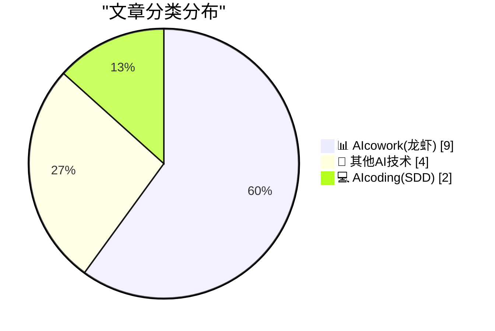
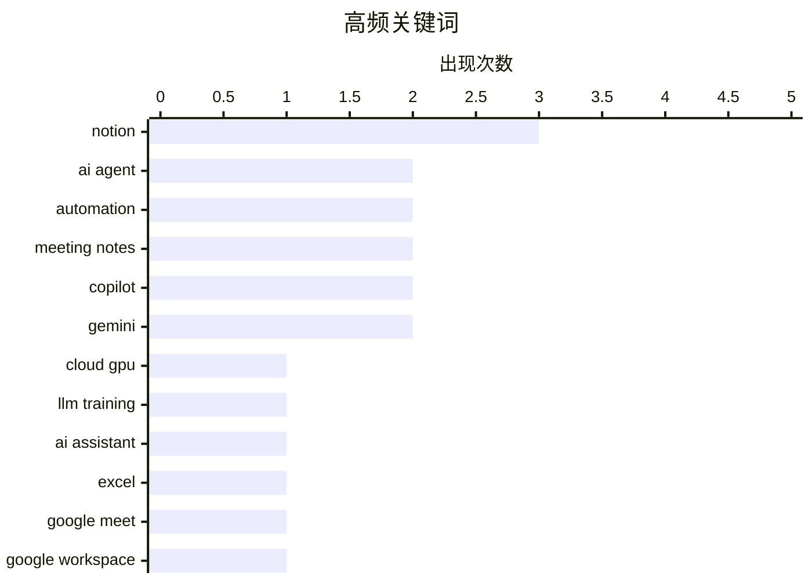

# 📰 AI 博客每日精选 — 2026-04-03

> 来自 98 个技术博客和社交媒体源，AI 精选 Top 15

## 📝 今日看点

今日技术圈的核心焦点在于AI如何深度融入日常工作流以提升效率。一方面，AI编程助手正从代码生成向自动化资源管理与理论构建等更高维度演进。另一方面，各大生产力平台（如Microsoft 365、Google Workspace、Notion）密集更新，竞相将AI深度嵌入会议、笔记、数据分析等协作场景，标志着AI与人类“同事”的协作模式已进入大规模应用与精细化定制阶段。

---

## 🏆 今日必读

🥇 **自动化启动 Lambda Labs 云实例**

[Automating starting Lambda Labs instances](https://www.gilesthomas.com/2026/04/automating-starting-lambda-instances) — gilesthomas.com · 22 小时前 · 💻 AIcoding(SDD)

> 作者因难以抢到稀缺的 8x A100 实例来训练 LLM，开发了一个名为 lambda-manager 的自动化工具。该工具基于智能体编程（agentic coding）在一小时内完成，包含三个核心命令：列出实例类型、持续监控并启动指定实例、以及管理现有实例。它解决了在资源紧张时手动抢实例的低效问题，将抢购流程自动化。作者通过编写实用脚本，将获取稀缺计算资源的过程变得高效且可重复。

💡 **为什么值得读**: 对于需要抢购稀缺云 GPU 资源的研究者或开发者，这篇文章提供了一个即用、开源的自动化解决方案，能显著提升工作效率。

🏷️ AI Agent, Cloud GPU, Automation, LLM Training

🥈 **Notion AI 会议笔记现支持自定义指令：聚焦重点、跳过内容并格式化**

[RT Hansel Notions: This is actually huge if you hate meeting notes. You can now tell @NotionHQ AI: what to focus on, what to skip, and how to format e...](https://x.com/NotionHQ/status/2039921882116550999) — 𝕏 @NotionHQ · 17 小时前 · 📊 AIcowork(龙虾)

> Notion AI 会议笔记功能新增了自定义指令能力，允许用户精确控制摘要内容。用户现在可以指示 AI 专注于特定议题、跳过无关部分，并按照自己偏好的格式进行结构化输出。这一更新旨在让自动生成的会议摘要更贴合个人工作流程，提升信息提取的针对性和实用性。会议记录从此可以高度个性化，满足不同场景和角色的需求。

💡 **为什么值得读**: 如果你厌倦了千篇一律的 AI 会议摘要，这个功能让你能像指挥助手一样定制输出，直接获得真正有用的会议记录。

🏷️ Meeting Notes, AI Assistant, Notion

🥉 **使用 Microsoft 365 Copilot 快速处理数据汇总与创意数据透视表任务**

[Handle quick turnaround tasks with Microsoft 365 Copilot, like summarizing data or creative pivot tables.](https://x.com/Microsoft365/status/2040149868635623565) — 𝕏 @Microsoft365 · 2 小时前 · 📊 AIcowork(龙虾)

> Microsoft 365 Copilot 能够帮助用户快速处理需要快速周转的数据分析任务。其核心能力包括自动汇总数据以及生成富有创意的数据透视表，从而简化数据分析流程。该功能旨在提升用户在 Excel 等办公场景中的效率，将复杂的数据操作转化为简单的指令。这体现了 Copilot 作为 AI 助手在提升办公生产力方面的具体应用。

💡 **为什么值得读**: 展示了 AI 如何将繁琐的数据处理工作变得简单直观，适合所有需要频繁进行数据分析和汇报的职场人士。

🏷️ Copilot, Excel, Automation

4️⃣ **在 Google Meet 中专注讨论：让“为我记笔记”捕获细节，用“向 Gemini 提问”私下厘清要点**

[Stay focused on the discussion during your meetings. ✍️ Let "Take notes for me" capture the details, and use "Ask Gemini in Meet" to catch up or cla...](https://x.com/GoogleWorkspace/status/2040158143670366540) — 𝕏 @GoogleWorkspace · 1 小时前 · 📊 AIcowork(龙虾)

> Google Workspace 在 Meet 中整合了 AI 功能，帮助用户在会议期间保持专注。"为我记笔记"功能可自动捕获会议细节，生成笔记。同时，用户可以在不打断会议的情况下，私下使用"在 Meet 中向 Gemini 提问"来回顾内容或澄清疑点。这套组合功能旨在减少与会者的认知负担，确保沟通流畅且信息无损。AI 在此扮演了无声的协作者角色，提升会议效率。

💡 **为什么值得读**: 它解决了既要参与讨论又要分心记笔记的痛点，通过 AI 实现真正的沉浸式会议体验。

🏷️ Gemini, Meeting Notes, Google Meet

5️⃣ **本月 Google Workspace 更新上线：涵盖 Vids 虚拟形象、Gmail 群组日程与 Gemini 多语言支持**

[This month’s Google Workspace updates are live! ✨ We have major video creation updates with avatars in Google Vids, simplified group scheduling in @...](https://x.com/GoogleWorkspace/status/2040112848680960403) — 𝕏 @GoogleWorkspace · 4 小时前 · 📊 AIcowork(龙虾)

> Google Workspace 发布了本月一系列功能更新，覆盖多个核心应用。主要更新包括：Google Vids 视频创作工具引入了虚拟形象功能；Gmail 简化了群组日程安排流程；Meet 中的 Gemini AI 助手增加了更多语言支持。这些更新旨在提升视频制作、团队协作和跨语言沟通的体验与效率。此次发布显示了 Google 在整合 AI 与核心办公场景上的持续投入。

💡 **为什么值得读**: 一次性了解 Google 办公套件在 AI 和协作方面的最新进展，把握生产力工具的未来趋势。

🏷️ Google Workspace, Gemini, AI Avatars

---

## 📊 数据概览

| 扫描源 | 抓取文章 | 时间范围 | 精选 |
|:---:|:---:|:---:|:---:|
| 76/98 | 2495 篇 → 20 篇 | 24h | **15 篇** |

### 分类分布



### 高频关键词



<details>
<summary>📈 纯文本关键词图（终端友好）</summary>

```
notion        │ ████████████████████ 3
ai agent      │ █████████████░░░░░░░ 2
automation    │ █████████████░░░░░░░ 2
meeting notes │ █████████████░░░░░░░ 2
copilot       │ █████████████░░░░░░░ 2
gemini        │ █████████████░░░░░░░ 2
cloud gpu     │ ███████░░░░░░░░░░░░░ 1
llm training  │ ███████░░░░░░░░░░░░░ 1
ai assistant  │ ███████░░░░░░░░░░░░░ 1
excel         │ ███████░░░░░░░░░░░░░ 1
```

</details>

### 🏷️ 话题标签

**notion**(3) · **ai agent**(2) · **automation**(2) · meeting notes(2) · copilot(2) · gemini(2) · cloud gpu(1) · llm training(1) · ai assistant(1) · excel(1) · google meet(1) · google workspace(1) · ai avatars(1) · service desk(1) · slack(1) · agentic ai(1) · programming theory(1) · software engineering(1) · ai credits(1) · dashboard(1)

---

====================

## 📊 AIcowork(龙虾)

### 1. Notion AI 会议笔记现支持自定义指令：聚焦重点、跳过内容并格式化

[RT Hansel Notions: This is actually huge if you hate meeting notes. You can now tell @NotionHQ AI: what to focus on, what to skip, and how to format e...](https://x.com/NotionHQ/status/2039921882116550999) — **𝕏 @NotionHQ** · 17 小时前 · ⭐ 20/25

> Notion AI 会议笔记功能新增了自定义指令能力，允许用户精确控制摘要内容。用户现在可以指示 AI 专注于特定议题、跳过无关部分，并按照自己偏好的格式进行结构化输出。这一更新旨在让自动生成的会议摘要更贴合个人工作流程，提升信息提取的针对性和实用性。会议记录从此可以高度个性化，满足不同场景和角色的需求。

🏷️ Meeting Notes, AI Assistant, Notion

📌 AIcowork(龙虾)

---

### 2. 使用 Microsoft 365 Copilot 快速处理数据汇总与创意数据透视表任务

[Handle quick turnaround tasks with Microsoft 365 Copilot, like summarizing data or creative pivot tables.](https://x.com/Microsoft365/status/2040149868635623565) — **𝕏 @Microsoft365** · 2 小时前 · ⭐ 20/25

> Microsoft 365 Copilot 能够帮助用户快速处理需要快速周转的数据分析任务。其核心能力包括自动汇总数据以及生成富有创意的数据透视表，从而简化数据分析流程。该功能旨在提升用户在 Excel 等办公场景中的效率，将复杂的数据操作转化为简单的指令。这体现了 Copilot 作为 AI 助手在提升办公生产力方面的具体应用。

🏷️ Copilot, Excel, Automation

📌 AIcowork(龙虾)

---

### 3. 在 Google Meet 中专注讨论：让“为我记笔记”捕获细节，用“向 Gemini 提问”私下厘清要点

[Stay focused on the discussion during your meetings. ✍️ Let "Take notes for me" capture the details, and use "Ask Gemini in Meet" to catch up or cla...](https://x.com/GoogleWorkspace/status/2040158143670366540) — **𝕏 @GoogleWorkspace** · 1 小时前 · ⭐ 20/25

> Google Workspace 在 Meet 中整合了 AI 功能，帮助用户在会议期间保持专注。"为我记笔记"功能可自动捕获会议细节，生成笔记。同时，用户可以在不打断会议的情况下，私下使用"在 Meet 中向 Gemini 提问"来回顾内容或澄清疑点。这套组合功能旨在减少与会者的认知负担，确保沟通流畅且信息无损。AI 在此扮演了无声的协作者角色，提升会议效率。

🏷️ Gemini, Meeting Notes, Google Meet

📌 AIcowork(龙虾)

---

### 4. 本月 Google Workspace 更新上线：涵盖 Vids 虚拟形象、Gmail 群组日程与 Gemini 多语言支持

[This month’s Google Workspace updates are live! ✨ We have major video creation updates with avatars in Google Vids, simplified group scheduling in @...](https://x.com/GoogleWorkspace/status/2040112848680960403) — **𝕏 @GoogleWorkspace** · 4 小时前 · ⭐ 17/25

> Google Workspace 发布了本月一系列功能更新，覆盖多个核心应用。主要更新包括：Google Vids 视频创作工具引入了虚拟形象功能；Gmail 简化了群组日程安排流程；Meet 中的 Gemini AI 助手增加了更多语言支持。这些更新旨在提升视频制作、团队协作和跨语言沟通的体验与效率。此次发布显示了 Google 在整合 AI 与核心办公场景上的持续投入。

🏷️ Google Workspace, Gemini, AI Avatars

📌 AIcowork(龙虾)

---

### 5. 将智能客服代理融入 Slack：在问题生成工单前就解决它

[RT Agentforce Service: Your service desk isn't slow because your team is inefficient. It’s slow because your legacy ITSM was built for a world that n...](https://x.com/SlackHQ/status/2040099239049527441) — **𝕏 @SlackHQ** · 6 小时前 · ⭐ 16/25

> 推文指出传统 IT 服务管理（ITSM）系统效率低下的根源在于其设计已过时，而非团队效率问题。解决方案是将智能客服代理（Agentforce Service）直接集成到团队已日常使用的 Slack 中，消除在不同系统间切换带来的效率损耗。其核心理念是让服务支持发生在对话发生的界面，在用户正式提交工单前就尝试解决问题。这代表了一种从“被动受理工单”到“主动在上下文中解决问题”的范式转变。

🏷️ Service Desk, Slack, Agentic AI

📌 AIcowork(龙虾)

---

### 6. Notion AI 积分面板：默认显示累计用量还是每日用量？

[RT andy: would you want your notion credit dashboard to show cumulative or daily credit use by default?](https://x.com/NotionHQ/status/2039843394307100732) — **𝕏 @NotionHQ** · 22 小时前 · ⭐ 14/25

> 这是一条用户发起的关于 Notion AI 积分管理面板设计的投票讨论。用户询问社区更希望仪表板默认显示累计信用额度使用情况，还是每日使用情况。该问题涉及产品设计的细节和用户体验，旨在收集用户偏好以优化信息展示方式。讨论聚焦于哪种数据呈现方式对用户监控和管理 AI 资源消耗更为直观和有效。

🏷️ Notion, AI Credits, Dashboard

📌 AIcowork(龙虾)

---

### 7. #M365Con26 主题演讲阵容揭晓：聚焦 AI、Copilot 与未来工作

[The keynote lineup for #M365Con26 is packed! 🚀 Jeff Teper, Charles Lamanna, Vasu Jakkal, Rohan Kumar, and Jaime Teevan, all in one room, sharing wh...](https://x.com/Microsoft365/status/2039845907299025106) — **𝕏 @Microsoft365** · 22 小时前 · ⭐ 11/25

> 微软宣布了 Microsoft 365 年度大会 #M365Con26 的核心主题演讲阵容。演讲者包括 Jeff Teper、Charles Lamanna、Vasu Jakkal、Rohan Kumar 和 Jaime Teevan 等多位微软高层领导者。他们将齐聚一堂，分享关于 AI、Copilot 智能副驾以及未来工作形态的最新展望和战略。此次大会被视为了解微软在生产力、协作及 AI 领域下一步动向的关键窗口。

🏷️ Conference, Copilot, Future of Work

📌 AIcowork(龙虾)

---

### 8. Notion 总部拥有最可爱的乐高套装

[☕️](https://x.com/NotionHQ/status/2039911857583243656) — **𝕏 @NotionHQ** · 17 小时前 · ⭐ 10/25

> 这是一条展示 Notion 公司内部文化的轻松推文。推文内容显示 Notion 总部拥有一套非常可爱的乐高积木套装。这反映了该公司注重工作环境趣味性和员工关怀的企业文化。此类内容通常用于塑造品牌亲和力，与社区进行非正式互动。

🏷️ Notion, Social Media

📌 AIcowork(龙虾)

---

### 9. 能动性是一种肌肉，工具可以强化它，也可以让它萎缩

[Agency is a muscle. Tools can strengthen it — or let it atrophy. @ivanhzhao](https://x.com/NotionHQ/status/2039868041073393822) — **𝕏 @NotionHQ** · 20 小时前 · ⭐ 10/25

> 文章核心探讨了工具设计与人类能动性之间的关系。作者Ivan Zhao提出，能动性（Agency）如同肌肉，需要锻炼才能保持强健。工具的设计至关重要：好的工具能增强使用者的控制力、创造力和解决问题的能力，从而“强化”能动性；而设计不当或过度自动化的工具则会替代用户思考与决策，导致能动性“萎缩”。结论是，工具开发者应致力于创造能赋能用户而非削弱其自主性的产品。

🏷️ AI Tools, Productivity

📌 AIcowork(龙虾)

---

## 🔬 其他AI技术

### 10. 付费专栏：AI并非大到不能倒

[Premium: AI Isn't Too Big To Fail](https://www.wheresyoured.at/premium-ai-isnt-too-big-to-fail/) — **wheresyoured.at** · 20 分钟前 · ⭐ 8/25

> 文章驳斥了当前为AI泡沫辩护的常见论调。作者指出，许多人试图通过类比历史（如将OpenAI比作Uber）来合理化数千亿美元的浪费和数据中心的过度建设，但这些类比并不成立。核心论点是，当前AI热潮的基础设施投入和资本消耗存在巨大风险，其商业模式和长期可持续性远未得到验证。最终结论是，AI行业并非“大到不能倒”，其发展路径可能面临严峻的调整甚至失败。

🏷️ AI Bubble, Investment, Industry Analysis

📌 其他AI技术

---

### 11. 书评：《超级智能：路线图、危险性与策略》尼克·博斯特罗姆 ★★★★☆

[Book Review: Superintelligence - Paths, Dangers, Strategies by Nick Bostrom ★★★★⯪](https://shkspr.mobi/blog/2026/04/book-review-superintelligence-paths-dangers-strategies-by-nick-bostrom/) — **shkspr.mobi** · 9 小时前 · ⭐ 6/25

> 这是一篇对尼克·博斯特罗姆2014年著作《超级智能》的高度评价书评。评论者认为该书清晰地预见了真正人工智能（而非当前的大语言模型）可能带来的生存性风险，并提出了在创造之前必须建立的安全措施。书中开篇的“麻雀寓言”极具警示意义，论证了在能力远超人类的超级智能出现前，做好充分准备和控制的极端重要性。书评的核心观点是，这本书关于AI安全与治理的论述至今仍未过时，且比当前对AI的讨论更为深刻和紧迫。

🏷️ AI Ethics, Superintelligence, Book Review

📌 其他AI技术

---

### 12. 用树莓派搭建你自己的拨号上网ISP

[Build your own Dial-up ISP with a Raspberry Pi](https://www.jeffgeerling.com/blog/2026/build-your-own-dial-up-isp-with-a-raspberry-pi/) — **jeffgeerling.com** · 7 小时前 · ⭐ 5/25

> 文章是一份详细的技术教程，指导读者如何使用树莓派（Raspberry Pi）搭建一个私人拨号上网服务器。作者因获得一台初代iBook G3笔记本而萌生此项目，目的是让这台老式电脑能通过WiFi连接并模拟传统的拨号上网体验。教程涵盖了所需的硬件（如USB调制解调器）、软件配置（如PPP和RADIUS服务器设置）以及网络桥接等关键步骤。最终成功实现了让复古硬件通过现代网络技术访问互联网，并浏览怀旧网站。

🏷️ Raspberry Pi, DIY

📌 其他AI技术

---

### 13. 苹果为坚守iOS 26的用户发布iOS 18安全更新

[Apple Releases iOS 18 Security Updates for iOS 26 Holdouts](https://sixcolors.com/post/2026/04/apple-releases-ios-18-security-updates-for-ios-26-holdouts/) — **daringfireball.net** · 2 小时前 · ⭐ 5/25

> 文章报道了苹果公司一项重要的系统更新政策变化。此前，苹果曾停止为能升级到iOS 26但选择留在iOS 18的设备提供安全更新，引发了用户对安全风险的担忧。最新消息是，自4月1日起，苹果开始向所有运行iOS 18的设备（包括那些有资格升级到iOS 26的）推送iOS 18.7.7安全更新。这解决了“坚守旧版”用户的安全隐患，但文章也暗示了“坏消息”可能在于这种支持模式的未来不确定性。核心结论是，苹果此次行动回应了用户诉求，暂时保障了旧版系统用户的安全。

🏷️ iOS, Security Update, Apple

📌 其他AI技术

---

## 💻 AIcoding(SDD)

### 14. 自动化启动 Lambda Labs 云实例

[Automating starting Lambda Labs instances](https://www.gilesthomas.com/2026/04/automating-starting-lambda-instances) — **gilesthomas.com** · 22 小时前 · ⭐ 22/25

> 作者因难以抢到稀缺的 8x A100 实例来训练 LLM，开发了一个名为 lambda-manager 的自动化工具。该工具基于智能体编程（agentic coding）在一小时内完成，包含三个核心命令：列出实例类型、持续监控并启动指定实例、以及管理现有实例。它解决了在资源紧张时手动抢实例的低效问题，将抢购流程自动化。作者通过编写实用脚本，将获取稀缺计算资源的过程变得高效且可重复。

🏷️ AI Agent, Cloud GPU, Automation, LLM Training

📌 AIcoding(SDD)

---

### 15. （与 AI 智能体协作的）编程即理论构建

[Programming (with AI agents) as theory building](https://seangoedecke.com/programming-with-ai-agents-as-theory-building/) — **seangoedecke.com** · 21 小时前 · ⭐ 14/25

> 文章重新审视了 Peter Naur 于 1985 年提出的“编程即理论构建”观点，并探讨其在 AI 智能体编程时代的适用性。Naur 认为，软件工程的核心产出不是代码本身，而是程序员脑海中关于程序如何工作的“理论”或知识体系。在 AI 智能体协助编程的背景下，这一观点变得尤为关键：程序员的核心角色正从“编写代码”转向“构建、维护和传递关于复杂系统的理论”。作者同意这一观点，并认为与 AI 协作编程时，构建清晰、可传递的理论比以往任何时候都更重要。

🏷️ AI Agent, Programming Theory, Software Engineering

📌 AIcoding(SDD)

---

====================

*生成于 2026-04-03 21:32 | 扫描 76 源 → 获取 2495 篇 → 精选 15 篇*
*基于 [Hacker News Popularity Contest 2025](https://refactoringenglish.com/tools/hn-popularity/) RSS 源列表，由 [Andrej Karpathy](https://x.com/karpathy) 推荐*
*由「懂点儿AI」制作，欢迎关注同名微信公众号获取更多 AI 实用技巧 💡*
