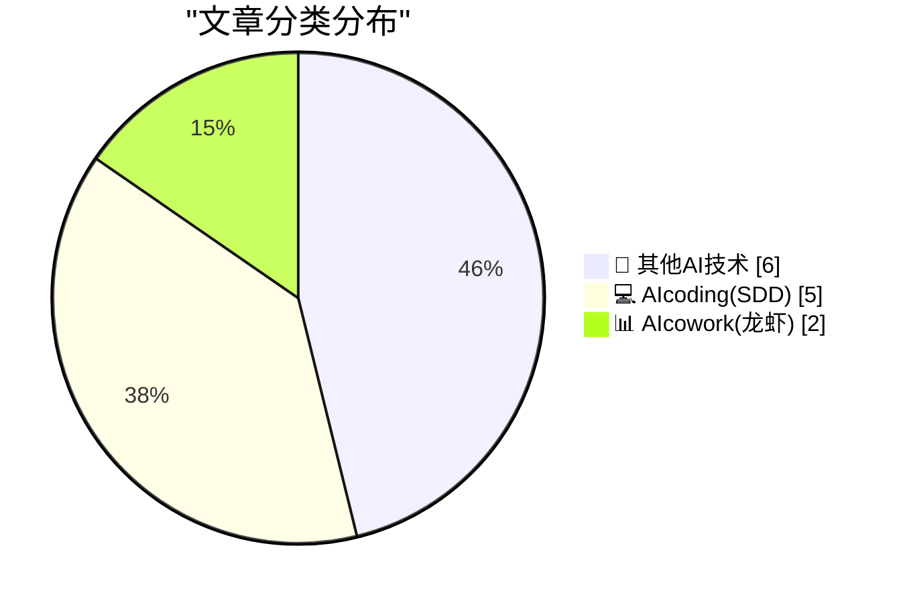
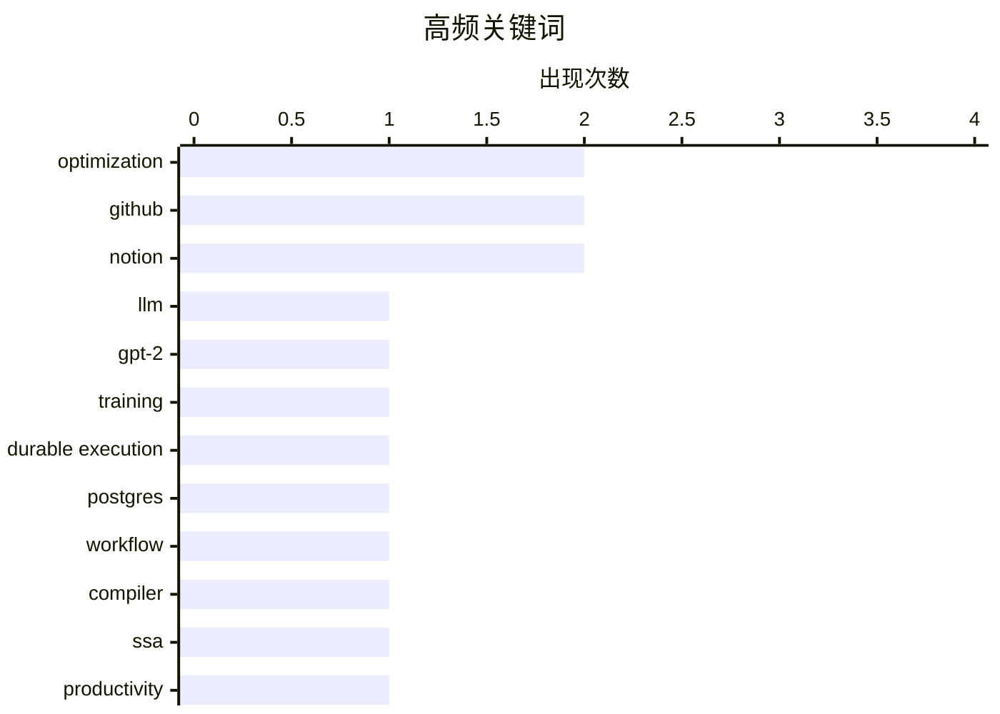

# 📰 AI 博客每日精选 — 2026-04-04

> 来自 98 个技术博客和社交媒体源，AI 精选 Top 13

## 📝 今日看点

今日技术圈聚焦于AI驱动的开发范式革新与基础设施的轻量化实践。一方面，从LLM模型底层优化到AI编程助手的多模态进化，AI正深度融入从代码编写到日常管理的全流程。另一方面，以Postgres等成熟数据库构建轻量持久层、以及围绕代码仓库打造个人操作系统，反映出简化架构、强化核心工具链的趋势。同时，开源理念的多元冲突与科技监管的博弈，也构成了重要的行业背景音。

---

## 🏆 今日必读

🥇 **从零开始编写LLM，第32h部分——干预措施：完整的float32精度**

[Writing an LLM from scratch, part 32h -- Interventions: full fat float32](https://www.gilesthomas.com/2026/04/llm-from-scratch-32h-interventions-full-fat-float32) — gilesthomas.com · 21 小时前 · 💻 AIcoding(SDD)

> 文章是作者为改进一个从零实现的GPT-2小规模基础模型测试损失而进行的最后一项技术干预实验。该模型基于Sebastian Raschka的书籍《从零开始构建大语言模型》进行训练，并以代码为训练数据。核心干预措施是将模型的计算精度从之前的某种形式（如bfloat16或混合精度）切换为完整的单精度浮点数（float32）。作者旨在通过提升数值精度来观察其对模型最终性能指标（test loss）的影响。结论将揭示在资源有限的情况下，为代码数据训练的轻量级模型，更高的数值精度是否带来显著的性能收益。

💡 **为什么值得读**: 通过一个具体的工程实验，揭示了数值精度选择对小型LLM训练效果的实际影响，为模型调优提供了第一手经验参考。

🏷️ LLM, GPT-2, Training, Optimization

🥈 **Absurd在生产环境中的应用**

[Absurd In Production](https://lucumr.pocoo.org/2026/4/4/absurd-in-production/) — lucumr.pocoo.org · 21 小时前 · 💻 AIcoding(SDD)

> 文章分享了基于Postgres构建的轻量级持久化执行系统Absurd，在投入生产环境约五个月后的实践经验。该系统设计理念是仅依赖Postgres，无需独立服务、编译器插件或完整运行时，通过一个SQL文件和轻量SDK即可实现持久化工作流。实践表明，其核心设计经受住了生产考验，系统运行稳定可靠。作者认为这种极简架构在满足需求的同时，大幅降低了复杂性和运维成本。

💡 **为什么值得读**: 为需要工作流引擎的团队提供了一个极具吸引力的、以数据库为中心的极简替代方案，并附有真实的生产环境验证。

🏷️ Durable Execution, Postgres, Workflow

🥉 **值编号**

[Value numbering](https://bernsteinbear.com/blog/value-numbering/?utm_source=rss) — bernsteinbear.com · 21 小时前 · 💻 AIcoding(SDD)

> 这是一篇编译器领域的教程文章，核心主题是介绍一种名为“值编号”的中间表示优化技术。作者指出，值编号在静态单赋值形式的基础上更进一步，它不仅为每个值分配唯一名称，还能识别并合并程序中计算相同的表达式。文章通过代码示例对比了SSA形式与值编号优化后的差异，展示了后者如何消除冗余计算。值编号是编译器实现公共子表达式消除等关键优化的有效方法。

💡 **为什么值得读**: 用清晰的解释和代码示例，深入浅出地阐明了编译器优化中一个重要但常被忽略的技术细节。

🏷️ Compiler, SSA, Optimization

4️⃣ **GitHub：用代码仓库管理你的日常生活**

[GitHub powers your code, but it can also power your daily life. 🔋 Instead of downloading another productivity app, manage your tasks right where yo...](https://x.com/github/status/2040490839881720092) — 𝕏 @GitHub · 3 小时前 · 📊 AIcowork(龙虾)

> GitHub官方提出，其平台不仅可以管理代码，还能作为一个“个人操作系统”来管理日常生活任务。具体方案是直接利用GitHub的内置功能：用Issues来记录待办事项（如家务、账单），用Labels标记优先级和状态，用Projects视图来规划和跟踪每日日程。该方法的核心是将软件开发的项目管理方法论迁移到个人生活管理场景。它倡导在开发者已有的工作环境中整合生产力工具，避免安装额外应用。

💡 **为什么值得读**: 为开发者提供了一个极具创意且低成本的个人生产力系统构建思路，充分利用了现有工具的灵活性。

🏷️ GitHub, Productivity, Task Management

5️⃣ **GitHub初学者指南：确保项目安全**

[😬 We've all been there, right? Our latest episode of GitHub for Beginners is all about making sure your projects are secure. Check it out now. http...](https://x.com/github/status/2040287121815077176) — 𝕏 @GitHub · 16 小时前 · 💻 AIcoding(SDD)

> 这是GitHub为初学者制作的系列内容之一，专注于项目安全入门。内容旨在帮助新手开发者避免常见的安全疏漏，建立基础的代码仓库安全实践。虽然推文未给出具体措施，但链接指向的博客或视频应会涵盖如密钥管理、依赖项漏洞检查、访问权限控制等基础安全主题。其目的是降低安全实践的门槛，让初学者从项目开始就养成良好习惯。

💡 **为什么值得读**: 由官方出品，为入门开发者提供了亟需的、易于上手的安全实践起点。

🏷️ GitHub, Security, Beginner

---

## 📊 数据概览

| 扫描源 | 抓取文章 | 时间范围 | 精选 |
|:---:|:---:|:---:|:---:|
| 77/98 | 2507 篇 → 13 篇 | 24h | **13 篇** |

### 分类分布



### 高频关键词



<details>
<summary>📈 纯文本关键词图（终端友好）</summary>

```
optimization      │ ████████████████████ 2
github            │ ████████████████████ 2
notion            │ ████████████████████ 2
llm               │ ██████████░░░░░░░░░░ 1
gpt-2             │ ██████████░░░░░░░░░░ 1
training          │ ██████████░░░░░░░░░░ 1
durable execution │ ██████████░░░░░░░░░░ 1
postgres          │ ██████████░░░░░░░░░░ 1
workflow          │ ██████████░░░░░░░░░░ 1
compiler          │ ██████████░░░░░░░░░░ 1
```

</details>

### 🏷️ 话题标签

**optimization**(2) · **github**(2) · **notion**(2) · llm(1) · gpt-2(1) · training(1) · durable execution(1) · postgres(1) · workflow(1) · compiler(1) · ssa(1) · productivity(1) · task management(1) · security(1) · beginner(1) · ai coding(1) · claude(1) · codex(1) · ai agent(1) · voice(1)

---

====================

## 🔬 其他AI技术

### 1. Pluralistic：欧盟准备在科技问题上向特朗普屈服（2026年4月4日）

[Pluralistic: EU ready to cave to Trump on tech (04 Apr 2026)](https://pluralistic.net/2026/04/04/digital-subjugation/) — **pluralistic.net** · 13 小时前 · ⭐ 5/25

> 评论文章核心观点是指出欧盟可能在科技监管政策上对美国前总统特朗普的立场做出重大让步。作者用“投降猴”一词讽刺这种态势，认为这将导致“数字征服”。文章链接列表还涉及AI治疗信任度、疫苗分配、关税问题等多个科技与社会交叉议题。作者的核心立场是对欧盟可能放弃其数字主权和强硬监管立场表示批评和担忧。

🏷️ AI Policy, AI Ethics

📌 其他AI技术

---

### 2. 欢迎加入RSS俱乐部！

[Welcome to RSS Club!](https://shkspr.mobi/blog/2026/04/welcome-to-rss-club/) — **shkspr.mobi** · 9 小时前 · ⭐ 5/25

> 作者创建了一个名为“RSS俱乐部”的特别内容系列，其文章仅通过RSS/Atom订阅源发布，对普通网页访问者和搜索引擎不可见。这是一种实验性的内容分发方式，旨在为订阅者创造一种专属的“秘密社交网络”体验。如果你能读到这篇文章，就意味着你已经是俱乐部成员。这种做法是对抗算法流媒体、回归订阅制信息获取的一种极端实践。

🏷️ RSS, Web

📌 其他AI技术

---

### 3. 开源意味着什么？

[What does Open Source mean?](https://nesbitt.io/2026/04/04/what-does-open-source-mean.html) — **nesbitt.io** · 11 小时前 · ⭐ 5/25

> 文章标题直指开源领域的一个根本性问题。虽然内容仅有一句提示“一堆互不相容的期望”，但这精准地概括了当前“开源”概念面临的困境。它暗示着，不同群体（如开发者、企业、社区）对“开源”有着各自不同的理解和期望，这些期望之间常常存在矛盾与冲突，导致“开源”的定义和实践变得模糊和复杂。

🏷️ Open Source

📌 其他AI技术

---

### 4. Wander Console 0.4.0

[Wander Console 0.4.0](https://susam.net/code/news/wander/0.4.0.html) — **susam.net** · 21 小时前 · ⭐ 5/25

> Wander Console 0.4.0 is the fourth release of Wander, a small,
  decentralised, self-hosted web console that lets visitors to your
  website explore interesting websites and pages recommended by a
  c

🏷️ Web Console, Decentralized

📌 其他AI技术

---

### 5. RT Moft.us: A special evening with creators and founders hosted by @notionhq at Lighthouse Campus, Brooklyn. MOFT was honored to be a gifting partner,...

[RT Moft.us: A special evening with creators and founders hosted by @notionhq at Lighthouse Campus, Brooklyn. MOFT was honored to be a gifting partner,...](https://x.com/NotionHQ/status/2040444511990820941) — **𝕏 @NotionHQ** · 8 小时前 · ⭐ 5/25

> RT Moft.us<br>A special evening with creators and founders hosted by @notionhq at Lighthouse Campus, Brooklyn. MOFT was honored to be a gifting partner, with exclusive customized Laptop Carry Sleeves 

🏷️ Event, Community

📌 其他AI技术

---

### 6. RT Varadh: Thrilled to join @NotionHQ! It’s an exciting moment to be building tools for the future for everyone. I’ve used Notion for over a decade ...

[RT Varadh: Thrilled to join @NotionHQ! It’s an exciting moment to be building tools for the future for everyone. I’ve used Notion for over a decade ...](https://x.com/NotionHQ/status/2040202605516001302) — **𝕏 @NotionHQ** · 23 小时前 · ⭐ 5/25

> RT Varadh<br>Thrilled to join @NotionHQ!<br><br>It’s an exciting moment to be building tools for the future for everyone. I’ve used Notion for over a decade and admired what this team has built for a 

🏷️ Career, Notion

📌 其他AI技术

---

## 💻 AIcoding(SDD)

### 7. 从零开始编写LLM，第32h部分——干预措施：完整的float32精度

[Writing an LLM from scratch, part 32h -- Interventions: full fat float32](https://www.gilesthomas.com/2026/04/llm-from-scratch-32h-interventions-full-fat-float32) — **gilesthomas.com** · 21 小时前 · ⭐ 22/25

> 文章是作者为改进一个从零实现的GPT-2小规模基础模型测试损失而进行的最后一项技术干预实验。该模型基于Sebastian Raschka的书籍《从零开始构建大语言模型》进行训练，并以代码为训练数据。核心干预措施是将模型的计算精度从之前的某种形式（如bfloat16或混合精度）切换为完整的单精度浮点数（float32）。作者旨在通过提升数值精度来观察其对模型最终性能指标（test loss）的影响。结论将揭示在资源有限的情况下，为代码数据训练的轻量级模型，更高的数值精度是否带来显著的性能收益。

🏷️ LLM, GPT-2, Training, Optimization

📌 AIcoding(SDD)

---

### 8. Absurd在生产环境中的应用

[Absurd In Production](https://lucumr.pocoo.org/2026/4/4/absurd-in-production/) — **lucumr.pocoo.org** · 21 小时前 · ⭐ 21/25

> 文章分享了基于Postgres构建的轻量级持久化执行系统Absurd，在投入生产环境约五个月后的实践经验。该系统设计理念是仅依赖Postgres，无需独立服务、编译器插件或完整运行时，通过一个SQL文件和轻量SDK即可实现持久化工作流。实践表明，其核心设计经受住了生产考验，系统运行稳定可靠。作者认为这种极简架构在满足需求的同时，大幅降低了复杂性和运维成本。

🏷️ Durable Execution, Postgres, Workflow

📌 AIcoding(SDD)

---

### 9. 值编号

[Value numbering](https://bernsteinbear.com/blog/value-numbering/?utm_source=rss) — **bernsteinbear.com** · 21 小时前 · ⭐ 21/25

> 这是一篇编译器领域的教程文章，核心主题是介绍一种名为“值编号”的中间表示优化技术。作者指出，值编号在静态单赋值形式的基础上更进一步，它不仅为每个值分配唯一名称，还能识别并合并程序中计算相同的表达式。文章通过代码示例对比了SSA形式与值编号优化后的差异，展示了后者如何消除冗余计算。值编号是编译器实现公共子表达式消除等关键优化的有效方法。

🏷️ Compiler, SSA, Optimization

📌 AIcoding(SDD)

---

### 10. GitHub初学者指南：确保项目安全

[😬 We've all been there, right? Our latest episode of GitHub for Beginners is all about making sure your projects are secure. Check it out now. http...](https://x.com/github/status/2040287121815077176) — **𝕏 @GitHub** · 16 小时前 · ⭐ 20/25

> 这是GitHub为初学者制作的系列内容之一，专注于项目安全入门。内容旨在帮助新手开发者避免常见的安全疏漏，建立基础的代码仓库安全实践。虽然推文未给出具体措施，但链接指向的博客或视频应会涵盖如密钥管理、依赖项漏洞检查、访问权限控制等基础安全主题。其目的是降低安全实践的门槛，让初学者从项目开始就养成良好习惯。

🏷️ GitHub, Security, Beginner

📌 AIcoding(SDD)

---

### 11. 转推：开发者分享不可或缺的付费AI工具

[RT ぶんかい@AIで遊ぶ人: あ、Notion AI忘れていた。 Notion AIにもだいぶお世話になっている。](https://x.com/NotionHQ/status/2040503857470701820) — **𝕏 @NotionHQ** · 11 小时前 · ⭐ 20/25

> 一条转推分享了一位日本开发者认为对其工作至关重要的三类付费AI工具。其核心工具链包括：用于开发的主工具“Codex app”、作为秘书工具的自建“ClaudeCode”环境，以及用于结对编程体验和培训的“Manus”。开发者强调，这些工具能直接提升工作效率，而当前AI工具的丰富性已使得“想到就能做到”。Notion AI也被提及为常用工具之一。

🏷️ AI Coding, Claude, Codex

📌 AIcoding(SDD)

---

## 📊 AIcowork(龙虾)

### 12. GitHub：用代码仓库管理你的日常生活

[GitHub powers your code, but it can also power your daily life. 🔋 Instead of downloading another productivity app, manage your tasks right where yo...](https://x.com/github/status/2040490839881720092) — **𝕏 @GitHub** · 3 小时前 · ⭐ 20/25

> GitHub官方提出，其平台不仅可以管理代码，还能作为一个“个人操作系统”来管理日常生活任务。具体方案是直接利用GitHub的内置功能：用Issues来记录待办事项（如家务、账单），用Labels标记优先级和状态，用Projects视图来规划和跟踪每日日程。该方法的核心是将软件开发的项目管理方法论迁移到个人生活管理场景。它倡导在开发者已有的工作环境中整合生产力工具，避免安装额外应用。

🏷️ GitHub, Productivity, Task Management

📌 AIcowork(龙虾)

---

### 13. 转推：你的Notion AI助手现在能听你说话了

[RT Osama: 🎙️ Your @NotionHQ AI Agent can now hear you](https://x.com/NotionHQ/status/2040505791938183591) — **𝕏 @NotionHQ** · 2 小时前 · ⭐ 18/25

> Notion官方转推展示了其AI Agent的新功能——语音输入支持。视频演示了用户可以通过语音直接与Notion AI助手进行交互。这表明Notion正在为其AI功能增加多模态交互能力，使其不再局限于文本输入，向更自然、便捷的助理体验迈进。这是Notion AI功能的一次重要体验升级。

🏷️ Notion, AI Agent, Voice

📌 AIcowork(龙虾)

---

====================

*生成于 2026-04-04 21:29 | 扫描 77 源 → 获取 2507 篇 → 精选 13 篇*
*基于 [Hacker News Popularity Contest 2025](https://refactoringenglish.com/tools/hn-popularity/) RSS 源列表，由 [Andrej Karpathy](https://x.com/karpathy) 推荐*
*由「懂点儿AI」制作，欢迎关注同名微信公众号获取更多 AI 实用技巧 💡*
